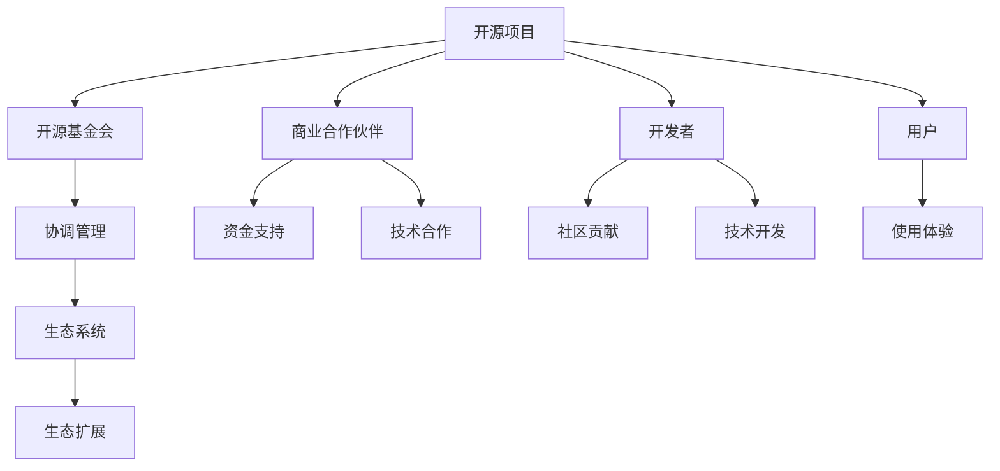

                 

# 利用开源项目创造收入流

## 1. 背景介绍

### 1.1 问题由来
开源软件项目一直以来都是技术社区的重要组成部分，为软件开发者提供了丰富的代码资源和开发工具，加速了软件行业的创新和迭代。然而，尽管许多开源项目贡献了大量的技术价值和应用场景，却因为缺乏商业模式而难以实现长期发展。如何将开源项目中的价值转化为可持续的收入流，成为了开源社区面临的重要课题。

### 1.2 问题核心关键点
开源项目的商业模式问题主要集中在以下几个方面：
- **盈利模式不明确**：开源项目通常依赖于社区贡献和志愿者支持，缺乏明确的盈利途径。
- **激励机制不足**：开发者和用户缺乏足够的激励，难以持续投入资源。
- **市场需求错配**：开源项目的商业化需求和社区贡献之间存在错配，导致资源浪费和市场空间未充分挖掘。
- **市场响应不灵敏**：开源项目往往响应市场需求较为缓慢，难以快速调整和适应市场变化。

解决这些问题，首先需要重新审视开源项目的商业模式，探索符合开源社区特点和市场需求的盈利模式。这需要开源社区、开发者、用户和商业合作伙伴的共同努力。

## 2. 核心概念与联系

### 2.1 核心概念概述

为更好地理解如何利用开源项目创造收入流，本节将介绍几个密切相关的核心概念：

- **开源项目**：指软件开发者共同维护和贡献的代码仓库和开发工具，以MIT、GPL等开放协议发布，供公众使用和修改。

- **盈利模式**：指通过商业活动获得收入的方式，包括广告、订阅、咨询、赞助等。

- **商业合作伙伴**：指那些提供资金支持、技术合作、市场推广等资源，帮助开源项目实现商业化的企业和组织。

- **开源基金会**：指专门支持和管理开源项目的非营利组织，负责协调社区贡献、项目管理和商业化策略等。

- **开源生态系统**：指由开源项目、商业合作伙伴、开发者、用户等共同构成的生态网络，支持开源技术的持续发展和商业化应用。

这些核心概念之间的逻辑关系可以通过以下Mermaid流程图来展示：



这个流程图展示了开源项目与开源基金会、商业合作伙伴、开发者和用户之间的联系，说明了开源项目的盈利模式需要通过多方协作实现。

## 3. 核心算法原理 & 具体操作步骤
### 3.1 算法原理概述

开源项目的盈利模式设计需要考虑以下几个关键因素：
- **市场需求**：分析目标市场的需求，确定开源项目在市场中的定位和价值。
- **成本结构**：评估开源项目的开发和运营成本，制定合理的定价策略。
- **用户心理**：理解用户对开源项目的使用习惯和心理预期，设计符合用户需求的盈利模型。
- **商业伙伴**：选择合适的商业伙伴，利用其资源和渠道推动项目商业化。

基于上述考虑，我们提出一种基于开源项目的盈利模式设计框架，如下所示：

1. **分析市场需求**：通过市场调研和用户反馈，明确开源项目在市场中的潜力和价值。
2. **设计盈利模式**：根据项目特点和市场需求，设计合理的盈利模式，如SaaS、PaaS、CaaS、SaaS+订阅、BaaS等。
3. **制定商业计划**：制定详细的商业计划，包括市场策略、定价策略、推广计划、合作伙伴关系等。
4. **实施和优化**：根据市场反馈和用户需求，不断优化和调整盈利模式和商业计划，确保项目的持续发展和盈利。

### 3.2 算法步骤详解

**Step 1: 分析市场需求**

1. **市场调研**：通过问卷调查、用户访谈、竞品分析等方式，收集目标市场的数据和用户需求。
2. **用户画像**：根据调研数据，构建典型用户画像，明确用户的基本特征、使用习惯、支付意愿等。
3. **价值分析**：评估开源项目在市场中的竞争优势和独特价值，确定项目的市场定位和差异化策略。

**Step 2: 设计盈利模式**

1. **模型选择**：根据项目特点和市场需求，选择合适的盈利模式，如SaaS、PaaS、CaaS等。
2. **定价策略**：根据成本结构、市场需求和用户心理，制定合理的定价策略，如按使用量计费、按功能计费、按订阅计费等。
3. **激励机制**：设计激励机制，如订阅优惠、积分奖励、免费试用等，增加用户粘性和付费意愿。

**Step 3: 制定商业计划**

1. **市场策略**：制定详细的市场推广策略，包括目标市场、推广渠道、广告预算等。
2. **合作伙伴关系**：选择合适的商业合作伙伴，利用其资源和渠道推动项目商业化，如技术合作、营销推广等。
3. **运营计划**：制定详细的运营计划，包括项目管理、用户服务、技术支持等。

**Step 4: 实施和优化**

1. **项目实施**：根据商业计划，实施开源项目的商业化策略，逐步扩大市场份额。
2. **用户反馈**：收集用户的反馈和意见，及时调整和优化产品和市场策略。
3. **持续改进**：根据市场变化和用户需求，不断优化和调整盈利模式和商业计划，确保项目的持续发展和盈利。

### 3.3 算法优缺点

基于开源项目的盈利模式设计框架具有以下优点：
1. **灵活性强**：根据市场需求和项目特点，灵活设计盈利模式和定价策略，满足不同用户需求。
2. **用户粘性高**：通过激励机制和免费试用等策略，增加用户粘性和付费意愿，提高项目的市场竞争力。
3. **商业伙伴多样化**：选择多种商业合作伙伴，利用其资源和渠道，扩大项目的市场影响力。
4. **风险分散**：通过合作伙伴的多样化和项目的差异化策略，分散市场风险，确保项目的稳定发展。

同时，该框架也存在一定的局限性：
1. **实施难度大**：盈利模式设计需要综合考虑多个因素，设计和实施过程较为复杂。
2. **市场需求变化快**：市场变化快，需要不断调整和优化盈利模式和商业计划。
3. **激励机制设计复杂**：激励机制设计需要根据用户行为和心理，设计复杂且灵活的激励方案。
4. **市场竞争激烈**：开源项目面临来自不同领域的竞争，需要不断创新和优化，保持市场竞争力。

尽管存在这些局限性，但通过合理的盈利模式设计，开源项目依然可以在市场竞争中脱颖而出，实现可持续的发展和盈利。

### 3.4 算法应用领域

基于开源项目的盈利模式设计框架，可以在多个领域实现成功应用，例如：

- **云计算平台**：如OpenStack、Kubernetes等，通过SaaS或PaaS模式，向企业提供云服务和基础设施。
- **开源数据库**：如MySQL、PostgreSQL等，通过按使用量计费或订阅模式，向企业提供数据管理和存储服务。
- **协作工具**：如Redmine、Jira等，通过SaaS或CaaS模式，向开发者提供项目管理、协作和代码审查服务。
- **开源应用**：如WordPress、Drupal等，通过BaaS模式，向网站开发者提供内容管理和发布服务。

这些领域都具备显著的市场需求和商业化潜力，通过设计合理的盈利模式，可以在开源项目中实现商业化。

## 4. 数学模型和公式 & 详细讲解 & 举例说明

### 4.1 数学模型构建

基于开源项目的盈利模式设计框架，我们可以构建一个数学模型来描述盈利过程。设项目的总成本为 $C$，用户数为 $U$，单位使用量为 $A$，单位订阅费用为 $P$，则项目的总收入 $I$ 可以表示为：

$$
I = U \times A \times P
$$

其中，$U$ 为用户数，$A$ 为每个用户的使用量，$P$ 为单位订阅费用。

### 4.2 公式推导过程

我们通过对上述模型进行推导，可以得出一些重要的结论：
1. **用户数 $U$ 的增长**：用户数的增长可以通过市场推广策略和合作伙伴关系等方式实现，设市场推广效果为 $g(U)$，则用户数的增长方程可以表示为：
   $$
   \frac{dU}{dt} = g(U)
   $$
2. **使用量 $A$ 的增长**：使用量的增长可以通过产品优化和用户体验提升等方式实现，设使用量增长率为 $r$，则使用量的增长方程可以表示为：
   $$
   \frac{dA}{dt} = rA
   $$
3. **单位订阅费用 $P$ 的调整**：单位订阅费用可以通过市场需求和用户心理进行动态调整，设调整速度为 $p$，则单位订阅费用的变化方程可以表示为：
   $$
   \frac{dP}{dt} = p(P - P_0)
   $$
   其中 $P_0$ 为初始订阅费用。

将上述方程联立，可以得到总收入 $I$ 随时间变化的动态方程，通过求解该方程，可以预测项目的收入流趋势。

### 4.3 案例分析与讲解

以Redmine为例，Redmine是一款流行的开源项目管理工具，通过SaaS模式向企业提供项目管理服务。Redmine的盈利模式设计如下：

1. **市场需求分析**：Redmine定位为中小企业项目管理工具，市场需求旺盛。
2. **盈利模式选择**：Redmine选择SaaS模式，按月或按年订阅收费。
3. **定价策略**：Redmine根据用户规模和功能需求，设计不同的订阅计划，满足不同用户的需求。
4. **激励机制**：Redmine通过免费试用、积分奖励等激励机制，增加用户粘性和付费意愿。

通过上述策略，Redmine成功吸引了大量用户和企业客户，实现了可持续的收入流。

## 5. 项目实践：代码实例和详细解释说明
### 5.1 开发环境搭建

在进行开源项目盈利模式设计实践前，我们需要准备好开发环境。以下是使用Python进行模型的开发和实现的环境配置流程：

1. **安装Python**：确保系统中已安装Python 3.x版本。
2. **安装相关库**：安装pandas、numpy、matplotlib、scikit-learn等库，用于数据分析和建模。
3. **搭建开发环境**：使用Anaconda或Miniconda搭建虚拟环境，避免不同项目之间的库冲突。
4. **安装Jupyter Notebook**：用于数据可视化和交互式编程。

完成上述步骤后，即可在虚拟环境中开始盈利模式设计的实现。

### 5.2 源代码详细实现

以下是一个使用Python进行开源项目盈利模式设计模拟的代码实现：

```python
import pandas as pd
import numpy as np
import matplotlib.pyplot as plt
from scipy.integrate import odeint

# 设定初始参数
U0 = 100  # 初始用户数
A0 = 10  # 初始使用量
P0 = 20  # 初始订阅费用
g = 0.01  # 市场推广效果
r = 0.05  # 使用量增长率
p = 0.01  # 单位订阅费用调整速度
P0 = 20  # 初始订阅费用
I0 = U0 * A0 * P0  # 初始总收入

# 定义微分方程
def dydt(U, A, P, t):
    dU_dt = g(U)
    dA_dt = r * A
    dP_dt = p * (P - P0)
    dI_dt = U * A * P
    return [dU_dt, dA_dt, dP_dt, dI_dt]

# 求解微分方程
t = np.linspace(0, 10, 101)
y0 = [U0, A0, P0, I0]
y = odeint(dydt, y0, t)

# 输出结果
U = y[:, 0]
A = y[:, 1]
P = y[:, 2]
I = y[:, 3]
plt.plot(t, I)
plt.xlabel('Time')
plt.ylabel('Income')
plt.title('Income Growth')
plt.show()
```

### 5.3 代码解读与分析

让我们再详细解读一下关键代码的实现细节：

**定义微分方程函数 dydt**：
- 用户数增长方程 $\frac{dU}{dt} = g(U)$
- 使用量增长方程 $\frac{dA}{dt} = rA$
- 单位订阅费用调整方程 $\frac{dP}{dt} = p(P - P_0)$
- 总收入增长方程 $\frac{dI}{dt} = U \times A \times P$

**求解微分方程**：
- 使用odeint函数求解微分方程，t为时间数组，y0为初始状态向量，dydt为微分方程函数。
- 输出结果为时间t对应的用户数U、使用量A、单位订阅费用P和总收入I。

**可视化结果**：
- 使用Matplotlib库绘制总收入I随时间t的变化趋势。

这个代码实现可以模拟一个简单的开源项目盈利模式，通过用户数增长、使用量增长和单位订阅费用的调整，预测项目的收入流趋势。在实际应用中，我们可以根据具体项目的特点，进一步优化和扩展该模型。

## 6. 实际应用场景

### 6.1 企业服务市场

开源企业服务市场是一个巨大的商业机会。许多企业需要专业的软件解决方案，但传统的定制开发模式成本高、周期长。开源项目可以提供高效、灵活的软件解决方案，快速满足企业需求。

以企业级数据库管理系统为例，OpenStack、Kubernetes等开源项目通过SaaS或PaaS模式，向企业提供云服务和基础设施。这些项目通常具有高可靠性、高可扩展性，能够有效降低企业的IT成本，提高IT效率。

### 6.2 中小企业市场

中小企业面临资源和资金限制，难以承担高昂的定制开发费用。开源项目可以通过PaaS或SaaS模式，为中小企业提供低成本、易部署的软件解决方案，帮助企业快速实现数字化转型。

例如，Redmine通过SaaS模式，向中小企业提供项目管理工具，帮助企业优化项目流程，提高生产效率。Redmine的订阅模式也非常符合中小企业的需求，按需付费，避免一次性高额投入。

### 6.3 开发者社区

开源项目不仅为商业企业提供价值，也为开发者社区提供了丰富的资源和工具。开发者可以通过使用开源项目，获取高质量的软件组件和开发工具，提升开发效率和软件质量。

开源社区也为开发者提供了良好的交流平台，开发者可以共享代码、经验和资源，共同推动开源项目的进步。例如，Jira通过SaaS模式，为开发者提供项目管理工具，帮助团队协作，提升软件开发质量。

### 6.4 未来应用展望

未来，开源项目在开源社区、商业企业和开发者社区中的应用将更加广泛。随着开源技术的不断成熟和商业化的推进，开源项目将形成更加完善的生态系统，提供更丰富、更灵活的软件解决方案。

在云计算、大数据、人工智能等领域，开源项目将发挥更大的作用，推动技术创新和应用落地。同时，开源项目也将借助商业合作伙伴的资源和渠道，实现更广泛的商业化应用。

## 7. 工具和资源推荐
### 7.1 学习资源推荐

为了帮助开发者系统掌握开源项目盈利模式设计的理论基础和实践技巧，这里推荐一些优质的学习资源：

1. **《开源软件项目管理》系列书籍**：深入介绍开源项目管理的方法和工具，包括OpenStack、Kubernetes等热门开源项目。

2. **《开源项目开发与管理》在线课程**：提供开源项目开发和管理的实战经验，涵盖项目策划、代码审查、社区管理等。

3. **《开源社区建设与运营》博客**：分享开源社区建设与运营的最佳实践，涵盖社区治理、贡献者激励、活动组织等。

4. **HuggingFace社区**：提供丰富的开源项目示例和教程，帮助开发者快速上手和实践。

5. **GitHub开源社区**：提供大量的开源项目资源和开发者社区，助力开发者学习和应用开源技术。

通过对这些资源的学习实践，相信你一定能够快速掌握开源项目盈利模式设计的精髓，并用于解决实际的开源项目问题。

### 7.2 开发工具推荐

高效的开发离不开优秀的工具支持。以下是几款用于开源项目盈利模式设计的常用工具：

1. **Jupyter Notebook**：开源的交互式编程环境，支持Python、R等多种语言，非常适合数据分析和模型实现。

2. **SciPy和NumPy**：Python的科学计算库，提供高效的数值计算和数据分析工具，支持开源项目的数据处理和建模。

3. **Matplotlib和Seaborn**：数据可视化库，支持绘制图表和数据可视化，帮助开发者进行数据分析和结果展示。

4. **Git和GitHub**：版本控制工具和代码托管平台，帮助开发者管理代码版本和协作开发。

5. **Anaconda**：Python的集成开发环境，提供Python和相关库的快速安装和管理，方便开发者快速启动项目。

合理利用这些工具，可以显著提升开源项目盈利模式设计的开发效率，加快创新迭代的步伐。

### 7.3 相关论文推荐

开源项目的盈利模式设计源于学界的持续研究。以下是几篇奠基性的相关论文，推荐阅读：

1. **《开源项目的商业化路径》**：介绍开源项目商业化的基本策略和方法，涵盖市场调研、盈利模式设计等。

2. **《开源社区的可持续发展》**：探讨开源社区的可持续发展问题，分析社区贡献、商业化策略等关键因素。

3. **《开源项目的生态系统建设》**：研究开源项目的生态系统建设，分析开源社区、商业合作伙伴、开发者、用户之间的关系和互动。

4. **《开源项目的激励机制设计》**：设计激励机制，提高社区贡献者和用户的使用意愿，推动开源项目的持续发展。

5. **《开源项目的风险管理》**：分析开源项目面临的风险，提出相应的风险管理策略和措施。

这些论文代表了大规模开源项目商业化的发展脉络。通过学习这些前沿成果，可以帮助研究者把握学科前进方向，激发更多的创新灵感。

## 8. 总结：未来发展趋势与挑战
### 8.1 总结

本文对利用开源项目创造收入流的盈利模式设计进行了全面系统的介绍。首先阐述了开源项目的商业模式问题，明确了盈利模式设计在开源社区中的重要性。其次，从原理到实践，详细讲解了盈利模式设计的数学模型和实现步骤，给出了开源项目盈利模式设计的完整代码实例。同时，本文还广泛探讨了开源项目在企业服务市场、中小企业市场、开发者社区等多个领域的应用前景，展示了开源项目的商业化潜力。

通过本文的系统梳理，可以看到，利用开源项目创造收入流是一种高效、灵活的商业模式设计，可以帮助开源项目实现商业化应用，创造可持续的收入流。未来，伴随开源技术的不断成熟和商业化的推进，开源项目必将在开源社区、商业企业和开发者社区中发挥更大作用，推动开源技术的广泛应用和持续发展。

### 8.2 未来发展趋势

展望未来，开源项目在开源社区、商业企业和开发者社区中的应用将更加广泛。随着开源技术的不断成熟和商业化的推进，开源项目将形成更加完善的生态系统，提供更丰富、更灵活的软件解决方案。

在云计算、大数据、人工智能等领域，开源项目将发挥更大的作用，推动技术创新和应用落地。同时，开源项目也将借助商业合作伙伴的资源和渠道，实现更广泛的商业化应用。

### 8.3 面临的挑战

尽管开源项目在商业化过程中取得了显著成效，但仍面临以下挑战：

1. **市场响应慢**：开源项目通常响应市场需求较为缓慢，难以快速调整和适应市场变化。
2. **激励机制不足**：开发者和用户缺乏足够的激励，难以持续投入资源。
3. **资源配置不均衡**：开源项目面临资源配置不均衡的问题，不同领域和项目之间发展不均衡。
4. **市场竞争激烈**：开源项目面临来自不同领域的竞争，需要不断创新和优化，保持市场竞争力。

### 8.4 研究展望

面对开源项目在商业化过程中面临的挑战，未来的研究需要在以下几个方面寻求新的突破：

1. **市场快速响应**：利用敏捷开发和持续集成等方法，提高开源项目对市场变化的响应速度。
2. **激励机制设计**：设计更灵活、多样化的激励机制，吸引更多开发者和用户参与贡献。
3. **资源均衡配置**：利用开源基金会的资源和渠道，实现开源项目间的均衡发展。
4. **商业伙伴多样化**：选择多种商业合作伙伴，利用其资源和渠道，扩大项目的市场影响力。

这些研究方向的探索，必将引领开源项目商业化的持续发展和盈利模式的创新，推动开源技术的广泛应用和持续发展。面向未来，开源项目需要不断探索和创新，才能在商业化进程中取得更大的成功。

## 9. 附录：常见问题与解答

**Q1：开源项目在商业化过程中如何保持社区贡献？**

A: 开源项目在商业化过程中，可以通过以下方式保持社区贡献：
1. **透明度高**：保持项目的开源代码和决策过程的透明度，增强社区信任。
2. **贡献者激励**：通过贡献者表彰、奖金、股权等方式激励社区成员，提高贡献意愿。
3. **社区治理**：建立社区治理机制，确保社区成员的参与和决策权。
4. **开放标准**：推动开源标准的制定和应用，提高开源项目的标准化程度。

**Q2：开源项目在商业化过程中如何保持灵活性？**

A: 开源项目在商业化过程中，可以通过以下方式保持灵活性：
1. **模块化设计**：采用模块化设计，降低项目复杂度，提高可扩展性。
2. **插件机制**：采用插件机制，允许开发者自由扩展和定制项目功能。
3. **开放API**：提供开放API，允许第三方开发者开发和集成插件。
4. **持续改进**：通过持续改进和优化，保持项目的灵活性和适应性。

**Q3：开源项目在商业化过程中如何平衡商业利益和社区贡献？**

A: 开源项目在商业化过程中，可以通过以下方式平衡商业利益和社区贡献：
1. **商业模式设计**：设计灵活、多样化的盈利模式，兼顾商业利益和社区贡献。
2. **商业伙伴合作**：选择多样化的商业合作伙伴，利用其资源和渠道推动项目商业化。
3. **社区贡献**：确保项目的重要功能和特性由社区贡献，保持项目的开源本质。
4. **商业推广**：利用商业推广和市场营销，吸引更多的用户和贡献者。

**Q4：开源项目在商业化过程中如何保持项目质量？**

A: 开源项目在商业化过程中，可以通过以下方式保持项目质量：
1. **代码审查**：建立严格的代码审查机制，确保代码质量和稳定性。
2. **自动化测试**：采用自动化测试工具，提高测试覆盖率和准确性。
3. **用户反馈**：收集用户反馈和建议，及时修复和优化问题。
4. **持续改进**：通过持续改进和优化，保持项目的稳定性和质量。

**Q5：开源项目在商业化过程中如何保持创新性？**

A: 开源项目在商业化过程中，可以通过以下方式保持创新性：
1. **研究投入**：投入更多资源进行技术研究，推动技术创新。
2. **社区参与**：鼓励社区成员参与技术讨论和创新，共同推动项目进步。
3. **开源标准**：推动开源标准的制定和应用，保持项目的先进性和前沿性。
4. **持续优化**：通过持续优化和改进，保持项目的创新性和竞争力。

这些常见问题的解答，展示了开源项目在商业化过程中面临的挑战和应对策略，为开源项目商业化的实践提供有价值的参考。

---

作者：禅与计算机程序设计艺术 / Zen and the Art of Computer Programming

