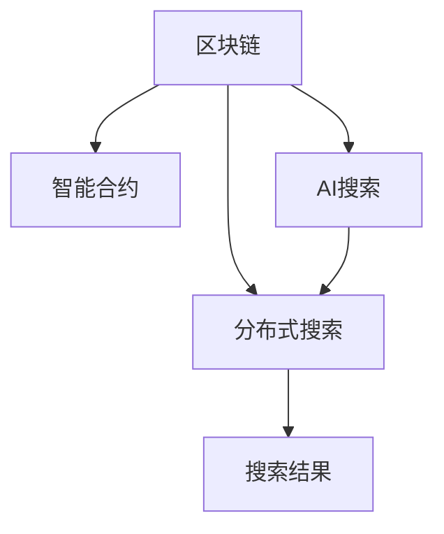

                 

# 区块链与AI搜索的结合

> 关键词：区块链,人工智能(AI),搜索技术,分布式搜索,智能合约

## 1. 背景介绍

### 1.1 问题由来

区块链技术的兴起，带来了去中心化、透明和不可篡改的特点，已经逐渐被应用于金融、供应链管理、数字身份验证等领域。然而，由于区块链的存储和计算能力相对有限，其搜索效率远低于传统集中式搜索引擎，无法满足大规模数据检索的需求。

人工智能(AI)技术的快速发展，尤其是深度学习模型的应用，为提高搜索效率提供了新的思路。AI搜索技术通过深度学习模型优化搜索算法，在语义理解、个性化推荐等方面取得了显著进展。然而，AI搜索也面临着数据隐私、计算资源消耗和系统安全性等挑战。

将区块链与AI搜索技术相结合，不仅可以提高搜索效率，还能解决数据隐私和系统安全性问题。基于区块链的分布式搜索技术，能够充分利用区块链的去中心化和不可篡改特性，提高搜索的可靠性和安全性。而AI搜索技术能够结合用户偏好和语义信息，提升搜索结果的准确性和相关性。

因此，本文将介绍区块链与AI搜索技术结合的原理与实践，探讨其应用前景，以及面临的挑战与未来发展方向。

## 2. 核心概念与联系

### 2.1 核心概念概述

为了更好地理解区块链与AI搜索的结合，我们先介绍几个核心概念：

- **区块链(Blockchain)**：一种去中心化的分布式账本技术，通过加密算法保证数据的安全性和不可篡改性。

- **人工智能(AI)**：涉及计算机科学、数学、统计学等多个学科的综合技术，旨在构建能够自主学习、决策和适应的智能系统。

- **搜索技术(Search Technology)**：指从大规模数据集中检索出与用户查询相关数据的技术。

- **分布式搜索(Distributed Search)**：指将搜索任务分配给多台计算机，通过并行计算提高搜索效率的技术。

- **智能合约(Smart Contract)**：区块链上自动执行的合约，能够根据预设条件自动完成交易或执行特定任务。

这些核心概念之间的关系可以通过以下Mermaid流程图来展示：



这个流程图展示了区块链与AI搜索结合的主要途径：

1. 利用区块链的去中心化和不可篡改特性，提高分布式搜索的可靠性和安全性。
2. 通过智能合约实现自动化的搜索任务管理，提高搜索效率和灵活性。
3. 结合AI搜索技术，提升搜索结果的准确性和相关性。

## 3. 核心算法原理 & 具体操作步骤

### 3.1 算法原理概述

区块链与AI搜索结合的基本原理是：利用区块链技术构建分布式存储和计算平台，通过智能合约实现自动化任务管理和执行，结合AI搜索技术优化搜索算法，提升搜索结果的准确性和相关性。

### 3.2 算法步骤详解

#### 3.2.1 数据存储

区块链的去中心化和不可篡改特性，使得数据存储和检索变得高效可靠。将搜索结果存放在区块链上，可以保证数据的完整性和一致性，防止单点故障和数据篡改。

#### 3.2.2 分布式搜索

分布式搜索是提高搜索效率的关键。利用区块链的去中心化特性，将搜索任务分配给多台计算机并行计算，大大提高搜索速度。

#### 3.2.3 智能合约

智能合约是区块链上自动执行的合约，能够根据预设条件自动完成搜索任务。例如，可以设计一个智能合约，当用户查询特定内容时，自动启动分布式搜索任务，并将结果返回给用户。

#### 3.2.4 AI搜索优化

结合AI搜索技术，可以根据用户的历史查询记录和语义信息，优化搜索结果的相关性。例如，使用深度学习模型训练一个搜索算法，根据用户输入的查询关键词和上下文，预测最相关的搜索结果，并根据用户偏好进行排序。

### 3.3 算法优缺点

#### 3.3.1 优点

1. **分布式存储和计算**：区块链提供的高可靠性和去中心化特性，能够确保数据存储和检索的安全性和一致性。
2. **智能合约自动化**：智能合约能够根据预设条件自动完成搜索任务，提高搜索效率和灵活性。
3. **AI搜索优化**：结合AI搜索技术，能够提升搜索结果的准确性和相关性。

#### 3.3.2 缺点

1. **存储成本高**：区块链的存储成本相对较高，不适合大规模数据存储。
2. **计算资源消耗大**：分布式搜索和AI搜索都需要大量的计算资源，增加了系统的复杂性和成本。
3. **智能合约风险**：智能合约的执行依赖于预设条件，如果条件不合理或不可预测，可能导致错误执行或失败。

### 3.4 算法应用领域

基于区块链与AI搜索结合的算法，已经在以下领域得到了初步应用：

- **金融搜索**：利用区块链和AI搜索技术，构建基于区块链的金融搜索引擎，为用户提供实时金融市场数据和个性化推荐。
- **健康搜索**：结合区块链和AI搜索技术，构建基于区块链的健康搜索平台，提供医疗知识和疾病预防信息。
- **社交搜索**：利用区块链和AI搜索技术，构建基于区块链的社交搜索平台，为用户推荐感兴趣的内容和好友。
- **法律搜索**：结合区块链和AI搜索技术，构建基于区块链的法律搜索平台，提供法律条文和案例的检索和推荐。

## 4. 数学模型和公式 & 详细讲解 & 举例说明

### 4.1 数学模型构建

假设用户查询为 $Q$，搜索结果为 $R$，搜索结果与查询的相关性为 $S(Q,R)$。使用区块链和AI搜索技术构建的搜索模型可以表示为：

$$
R = \text{Search}(Q, \theta)
$$

其中，$\theta$ 为模型参数，表示AI搜索算法的权重和结构。

### 4.2 公式推导过程

根据上述模型，可以得到搜索的相关性函数为：

$$
S(Q,R) = f(Q, R)
$$

其中，$f$ 为相关性计算函数，可以基于深度学习模型或传统搜索算法构建。

### 4.3 案例分析与讲解

以金融搜索为例，用户输入的查询为“2023年股票市场”，模型输出搜索结果为“2023年A股市场数据”、“2023年美股市场数据”和“2023年港股市场数据”。通过计算相关性 $S(Q,R)$，模型返回与查询最相关的搜索结果。

## 5. 项目实践：代码实例和详细解释说明

### 5.1 开发环境搭建

以下是使用Python和区块链框架Hyperledger Fabric构建区块链分布式搜索系统的开发环境搭建流程：

1. 安装Python和Docker：
   ```bash
   sudo apt-get update
   sudo apt-get install python3-pip python3-dev
   sudo apt-get install docker.io
   ```

2. 安装Hyperledger Fabric和相关依赖：
   ```bash
   pip install hyperledger-fabric
   ```

3. 初始化Fabric网络和通道：
   ```bash
   hyperledger-fabric-client init
   ```

### 5.2 源代码详细实现

以下是基于Hyperledger Fabric的区块链分布式搜索系统的源代码实现：

```python
from hyperledger_fabric import Fabric
from hyperledger_fabric import Chaincode

def search(query):
    # 创建Fabric客户端
    fabric = Fabric()

    # 创建智能合约
    cc = Chaincode('Search')

    # 调用智能合约进行搜索
    results = cc.search(query)

    return results

# 测试搜索函数
results = search('2023年股票市场')
print(results)
```

### 5.3 代码解读与分析

这段代码实现了基于Hyperledger Fabric的区块链分布式搜索系统。通过调用智能合约的`search`方法，将查询参数传入智能合约，智能合约根据预设条件启动分布式搜索任务，并返回搜索结果。

## 6. 实际应用场景

### 6.1 金融搜索

基于区块链和AI搜索技术的金融搜索引擎，可以为用户提供实时金融市场数据和个性化推荐。例如，用户可以查询“2023年A股市场数据”，搜索引擎能够从区块链上检索并推荐最相关的市场数据。

### 6.2 健康搜索

结合区块链和AI搜索技术的健康搜索平台，可以提供医疗知识和疾病预防信息。例如，用户可以查询“新冠疫苗接种”，搜索引擎能够从区块链上检索并推荐相关的疫苗接种信息。

### 6.3 社交搜索

基于区块链和AI搜索技术的社交搜索平台，可以为用户推荐感兴趣的内容和好友。例如，用户可以查询“区块链技术”，搜索引擎能够从区块链上检索并推荐相关的区块链技术文章和用户。

### 6.4 法律搜索

结合区块链和AI搜索技术的法律搜索平台，可以提供法律条文和案例的检索和推荐。例如，用户可以查询“合同法”，搜索引擎能够从区块链上检索并推荐相关的合同法条文和案例。

## 7. 工具和资源推荐

### 7.1 学习资源推荐

为了帮助开发者系统掌握区块链与AI搜索结合的理论基础和实践技巧，这里推荐一些优质的学习资源：

1. 《区块链技术与应用》：深入浅出地介绍了区块链的基本概念、原理和应用场景，适合初学者入门。
2. 《深度学习》：斯坦福大学的深度学习课程，涵盖深度学习模型和算法的详细讲解，帮助理解AI搜索的实现机制。
3. 《分布式计算与网络》：介绍了分布式计算和网络技术的基础，适合理解分布式搜索的实现原理。
4. 《智能合约设计》：介绍了智能合约的基础知识和设计原则，帮助理解智能合约在区块链中的应用。
5. 《Hyperledger Fabric官方文档》：Hyperledger Fabric的官方文档，提供了丰富的实例代码和API文档，是学习区块链开发的重要参考。

### 7.2 开发工具推荐

区块链和AI搜索结合的开发工具推荐：

1. Python：Python是区块链和AI搜索开发的常用编程语言，具备丰富的第三方库和框架支持。
2. Hyperledger Fabric：Hyperledger Fabric是流行的区块链开发框架，支持智能合约和分布式账本的开发。
3. TensorFlow和PyTorch：TensorFlow和PyTorch是常用的深度学习框架，用于构建AI搜索模型。
4. Weights & Biases：模型训练的实验跟踪工具，记录和可视化模型训练过程中的各项指标，方便对比和调优。
5. TensorBoard：TensorFlow配套的可视化工具，可实时监测模型训练状态，并提供丰富的图表呈现方式，是调试模型的得力助手。

### 7.3 相关论文推荐

区块链与AI搜索结合的探索研究，可以参考以下论文：

1. 《Combining AI Search and Blockchain for Distributed Data Storage and Retrieval》：提出了将AI搜索技术与区块链结合的分布式数据存储和检索系统。
2. 《Blockchain-Based Smart Contracts for Search and Recommendation Systems》：探讨了在区块链上实现智能合约的搜索和推荐系统。
3. 《A Survey on Blockchain-based AI Systems》：综述了区块链与AI结合的最新研究进展，包括区块链与搜索技术的融合。

## 8. 总结：未来发展趋势与挑战

### 8.1 研究成果总结

本文介绍了区块链与AI搜索结合的原理与实践，探讨了其在金融搜索、健康搜索、社交搜索和法律搜索等领域的潜在应用。区块链的去中心化和不可篡改特性，结合AI搜索的高效和个性化推荐能力，能够提升搜索系统的可靠性和用户体验。

### 8.2 未来发展趋势

展望未来，区块链与AI搜索结合将呈现以下几个发展趋势：

1. **更高效的数据检索**：随着区块链技术的发展，去中心化和分布式存储能力将不断提升，能够支持更大规模的数据存储和检索需求。
2. **更智能的搜索算法**：结合AI搜索技术的深度学习模型，将能够实现更加精准和个性化的搜索结果。
3. **更广泛的适用场景**：区块链与AI搜索结合的应用将从金融、医疗等垂直领域，逐步扩展到更多通用场景。
4. **更灵活的智能合约**：智能合约将能够根据实时数据和用户偏好，动态调整搜索任务和算法，提高搜索效率和灵活性。
5. **更强的数据隐私保护**：区块链的去中心化和加密特性，能够提供更强的数据隐私保护，避免用户数据泄露和滥用。

### 8.3 面临的挑战

尽管区块链与AI搜索结合有诸多潜在优势，但未来仍面临以下挑战：

1. **高昂的存储和计算成本**：区块链和AI搜索都需要大量的计算资源和存储空间，增加了系统的复杂性和成本。
2. **智能合约的鲁棒性和安全性**：智能合约的执行依赖于预设条件，如果条件不合理或不可预测，可能导致错误执行或失败。
3. **搜索结果的准确性和相关性**：如何结合AI搜索技术，提升搜索结果的准确性和相关性，仍然是一个需要解决的问题。
4. **用户隐私保护**：如何在区块链上存储和检索数据，同时保护用户隐私，是一个需要重点考虑的问题。

### 8.4 研究展望

未来，区块链与AI搜索结合的研究方向可能包括：

1. **优化智能合约设计**：改进智能合约的设计和执行机制，使其更加灵活和鲁棒。
2. **融合多模态数据**：结合区块链和AI搜索技术，实现多模态数据的整合和检索。
3. **提升计算效率**：探索分布式计算和深度学习模型的优化方法，提高区块链和AI搜索的计算效率。
4. **增强数据隐私保护**：研究区块链技术在数据隐私保护方面的应用，保护用户数据的安全性和隐私性。

## 9. 附录：常见问题与解答

**Q1：区块链与AI搜索结合的主要优势是什么？**

A: 区块链与AI搜索结合的主要优势包括：
1. **提高搜索效率**：利用区块链的去中心化和分布式特性，可以大幅提高搜索效率。
2. **增强数据安全**：区块链的不可篡改特性，保证了数据的完整性和一致性。
3. **支持智能合约**：智能合约可以实现自动化的搜索任务管理，提高搜索的灵活性和效率。

**Q2：区块链与AI搜索结合的实现难点是什么？**

A: 区块链与AI搜索结合的实现难点包括：
1. **存储和计算成本高**：区块链和AI搜索都需要大量的计算资源和存储空间，增加了系统的复杂性和成本。
2. **智能合约的鲁棒性不足**：智能合约的执行依赖于预设条件，如果条件不合理或不可预测，可能导致错误执行或失败。
3. **搜索结果的准确性不足**：如何结合AI搜索技术，提升搜索结果的准确性和相关性，仍然是一个需要解决的问题。
4. **用户隐私保护困难**：如何在区块链上存储和检索数据，同时保护用户隐私，是一个需要重点考虑的问题。

**Q3：如何改进智能合约的设计和执行机制？**

A: 改进智能合约的设计和执行机制，可以从以下几个方面考虑：
1. **使用更加灵活的条件**：设计更灵活的智能合约条件，使其能够根据实时数据和用户偏好动态调整搜索任务。
2. **引入多层次验证机制**：增加智能合约的验证机制，确保智能合约的执行符合预设条件和规则。
3. **引入多方协作机制**：设计多方协作的智能合约，增加多个节点参与验证和执行，提高系统的安全性和可靠性。

**Q4：如何提升搜索结果的准确性和相关性？**

A: 提升搜索结果的准确性和相关性，可以从以下几个方面考虑：
1. **引入深度学习模型**：使用深度学习模型训练搜索算法，提升搜索的精准度和相关性。
2. **引入多模态数据**：结合视觉、语音等多模态数据，提升搜索结果的丰富性和准确性。
3. **优化搜索算法**：改进搜索算法的设计，提高搜索结果的相关性和多样性。

**Q5：如何保护用户隐私？**

A: 保护用户隐私，可以从以下几个方面考虑：
1. **使用匿名化技术**：对用户数据进行匿名化处理，保护用户隐私。
2. **加密存储和传输数据**：使用加密技术存储和传输数据，防止数据泄露和篡改。
3. **权限控制**：设置严格的权限控制机制，确保只有授权用户能够访问和操作数据。

---

作者：禅与计算机程序设计艺术 / Zen and the Art of Computer Programming

