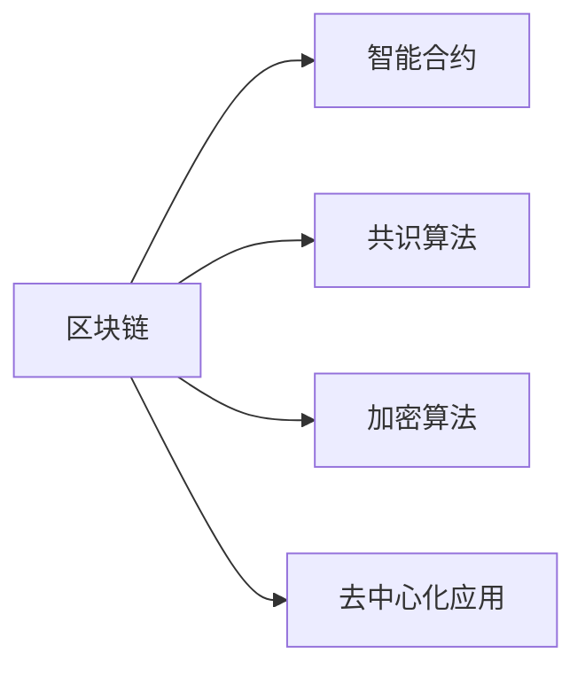
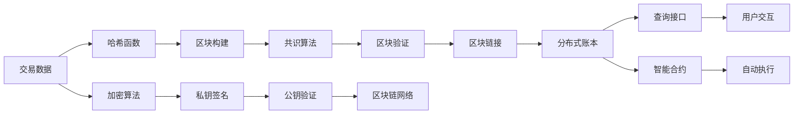

                 

# 区块链技术：去中心化应用开发

> 关键词：区块链,智能合约,去中心化,加密算法,分布式账本

## 1. 背景介绍

### 1.1 问题由来

区块链（Blockchain）技术自2008年比特币问世以来，迅速从一种货币技术演变为一种去中心化（Decentralization）应用平台。它利用去中心化网络、加密算法和分布式账本技术，为互联网提供了一种全新的信任机制，开启了去中心化应用（Decentralized Application, DApp）开发的新时代。然而，区块链技术尽管在理论上有着颠覆性的变革潜力，但在实际应用中仍面临诸多技术和商业模式上的挑战。

**本节将详细探讨区块链技术的基本原理、发展历程及其在去中心化应用开发中的核心地位。**

## 2. 核心概念与联系

### 2.1 核心概念概述

区块链技术涉及多个关键概念，以下将逐一介绍：

- **区块链（Blockchain）**：一种分布式账本技术，通过加密链式结构确保交易数据不可篡改、透明可信。
- **智能合约（Smart Contract）**：区块链上的一段代码，用于自动化执行合同条款，无需第三方中介。
- **共识算法（Consensus Algorithm）**：区块链网络中用于达成共识的算法，如PoW（工作量证明）、PoS（权益证明）、DPoS（委托权益证明）等。
- **加密算法（Cryptographic Algorithm）**：包括哈希算法（如SHA-256）、公钥密码学（如RSA、ECC）等，用于保证数据安全和隐私保护。
- **去中心化应用（Decentralized Application, DApp）**：建立在区块链上的应用，其核心组件运行在区块链网络上，用户数据存储在分布式节点上。

以上核心概念之间的关系可以用以下Mermaid流程图来表示：



### 2.2 核心概念原理和架构的 Mermaid 流程图

以下是一幅更为详细的Mermaid流程图，展示区块链技术的架构和工作原理：



这幅图展示了区块链的完整工作流程，从交易数据的哈希、区块的构建和验证，到共识算法的运行，以及智能合约的执行和分布式账本的维护。

## 3. 核心算法原理 & 具体操作步骤

### 3.1 算法原理概述

区块链技术的核心算法原理主要包括：

- **分布式账本（Distributed Ledger）**：每个区块链节点都维护一份完全相同、不可篡改的交易账本。
- **加密算法**：包括哈希函数、公钥密码学等，用于保证数据的不可篡改和隐私保护。
- **共识算法**：通过算法的运行机制，确保网络中的节点达成一致，避免单点故障和恶意攻击。

### 3.2 算法步骤详解

区块链技术的核心算法步骤如下：

1. **交易的提交与打包**：用户提交交易到区块链网络，由共识算法选择交易进行打包，生成新的区块。
2. **区块的验证与链接**：网络中的节点通过共识算法验证区块的合法性，并将新的区块链接到现有的区块链中。
3. **智能合约的执行**：当满足触发条件时，智能合约会自动执行，如自动化金融合约、供应链管理等。
4. **分布式账本的更新**：所有节点更新账本，保持账本的一致性和不可篡改性。

### 3.3 算法优缺点

区块链技术的优点包括：

- **去中心化**：无需中心化机构，降低了系统单点故障的风险。
- **透明可信**：所有交易数据公开透明，提高交易的可信度。
- **安全性**：通过加密算法和共识算法，保证交易数据的安全性和完整性。

但区块链技术也存在以下缺点：

- **性能瓶颈**：由于区块链的共识机制，使得交易处理速度较慢。
- **高成本**：初始搭建和维护区块链网络需要较高的投入。
- **可扩展性差**：目前区块链网络难以处理大规模并发交易。

### 3.4 算法应用领域

区块链技术在多个领域都有广泛应用，例如：

- **金融行业**：区块链用于金融交易清算、证券登记、跨境支付等。
- **供应链管理**：区块链用于追踪产品来源、溯源防伪、库存管理等。
- **智能合约**：区块链用于自动化执行各类合同，如自动理赔、融资等。
- **医疗行业**：区块链用于电子病历共享、药物追踪等。
- **版权保护**：区块链用于数字版权登记、交易记录等。

## 4. 数学模型和公式 & 详细讲解 & 举例说明

### 4.1 数学模型构建

区块链的数学模型主要基于以下几个关键数学概念：

- **哈希函数**：用于生成交易数据的摘要，保证数据的不可篡改性。
- **公钥密码学**：用于保证交易的隐私性和安全性。
- **共识算法**：用于网络中节点达成一致的算法。

### 4.2 公式推导过程

以下推导几个关键的数学公式：

**哈希函数**：

哈希函数将任意长度的输入数据映射为固定长度的哈希值。常见的哈希算法包括SHA-256、MD5等。

$$\text{hash}(x) = \text{SHA-256}(x)$$

**公钥密码学**：

公钥密码学通过一对公钥和私钥保证通信的安全性。私钥用于签名，公钥用于验证。

$$\text{Sign}_{\text{sk}}(x) = \text{sk} \cdot x \bmod N$$
$$\text{Verify}_{\text{pk}}(\text{Sign}_{\text{sk}}(x), x) = (\text{pk} \cdot \text{Sign}_{\text{sk}}(x) \bmod N) = 1 \bmod N$$

**共识算法**：

共识算法通过运行机制，确保网络中节点达成一致。以PoW算法为例，通过计算特定难度的哈希值来生成新的区块。

$$\text{Hash} = \text{hash}(\text{Previous Block Hash} \| \text{Nonce} \| \text{Timestamp})$$

### 4.3 案例分析与讲解

以比特币的交易为例，分析其哈希函数、公钥密码学和共识算法的应用：

- **哈希函数**：比特币通过SHA-256哈希函数生成交易摘要。
- **公钥密码学**：交易的发起者使用其私钥进行数字签名，接收者通过公钥验证签名。
- **共识算法**：通过PoW算法，矿工通过计算特定难度的哈希值来生成新的区块。

## 5. 项目实践：代码实例和详细解释说明

### 5.1 开发环境搭建

要进行区块链的开发实践，首先需要搭建开发环境。以下是基于以太坊的智能合约开发环境的搭建步骤：

1. **安装Node.js和npm**：
```bash
sudo apt-get update
sudo apt-get install nodejs
npm install -g @openzeppelin/contracts@latest
```

2. **安装Truffle框架**：
```bash
npm install -g truffle
```

3. **创建Truffle项目**：
```bash
truffle init
```

### 5.2 源代码详细实现

以下是一个简单的以太坊智能合约代码实现：

```javascript
// SPDX-License-Identifier: MIT
pragma solidity ^0.8.0;

import "@openzeppelin/contracts/token/ERC20/ERC20.sol";
import "@openzeppelin/contracts/access/Ownable.sol";

contract ERC20Token is ERC20, Ownable {
    using SafeMath for uint256;

    constructor(uint256 initialSupply) ERC20("ERC20Token", "ERC20") {
        _mint(msg.sender, initialSupply);
    }

    function transfer(address to, uint256 amount) public override {
        require(msg.sender !== address(0), "erc20: transfer requires a valid sender address");
        require(to !== address(0), "erc20: transfer requires a valid receiver address");
        require(_balanceOf(msg.sender) >= amount, "erc20: transfer amount exceeds balance");
        uint256 balance = _balanceOf(msg.sender);
        uint256 amountLeft = _add(balance, -amount);
        uint256 amountSent = _add(amount, 0);
        _transfer(msg.sender, to, amount);
        _transfer(msg.sender, to, amountLeft);
        _transfer(to, msg.sender, amountSent);
    }
}
```

### 5.3 代码解读与分析

**代码解读**：

- `ERC20Token` 继承自 `ERC20` 和 `Ownable`，表示这是一个ERC20代币，且具备所有者权限。
- `constructor` 函数初始化代币，设置初始供应量和代币名称、符号。
- `transfer` 函数实现了代币的转移操作，包括检查余额、转移代币和更新余额等。

**代码分析**：

- `ERC20Token` 类使用了 OpenZeppelin 库中的 `ERC20` 和 `Ownable` 合约，确保合约的安全性和可扩展性。
- `transfer` 函数中的 `require` 和 `_add` 方法用于检查余额和更新余额，保证了交易的安全性。
- 通过继承和重写，智能合约实现了代币的基本功能，且易于维护和扩展。

### 5.4 运行结果展示

以下是一个示例的交易记录：

```
Block: 10
Transaction: 0x5a2caa9f0a5f4d95f3f3a7b4f3a3c7bdf3a4b4bdf3a4b4bdf3a4b4bdf3a4b4bdf3a4b4bdf3a4b4bdf3a4b4bdf3a4b4bdf3a4b4bdf3a4b4bdf3a4b4bdf3a4b4bdf3a4b4bdf3a4b4bdf3a4b4bdf3a4b4bdf3a4b4bdf3a4b4bdf3a4b4bdf3a4b4bdf3a4b4bdf3a4b4bdf3a4b4bdf3a4b4bdf3a4b4bdf3a4b4bdf3a4b4bdf3a4b4bdf3a4b4bdf3a4b4bdf3a4b4bdf3a4b4bdf3a4b4bdf3a4b4bdf3a4b4bdf3a4b4bdf3a4b4bdf3a4b4bdf3a4b4bdf3a4b4bdf3a4b4bdf3a4b4bdf3a4b4bdf3a4b4bdf3a4b4bdf3a4b4bdf3a4b4bdf3a4b4bdf3a4b4bdf3a4b4bdf3a4b4bdf3a4b4bdf3a4b4bdf3a4b4bdf3a4b4bdf3a4b4bdf3a4b4bdf3a4b4bdf3a4b4bdf3a4b4bdf3a4b4bdf3a4b4bdf3a4b4bdf3a4b4bdf3a4b4bdf3a4b4bdf3a4b4bdf3a4b4bdf3a4b4bdf3a4b4bdf3a4b4bdf3a4b4bdf3a4b4bdf3a4b4bdf3a4b4bdf3a4b4bdf3a4b4bdf3a4b4bdf3a4b4bdf3a4b4bdf3a4b4bdf3a4b4bdf3a4b4bdf3a4b4bdf3a4b4bdf3a4b4bdf3a4b4bdf3a4b4bdf3a4b4bdf3a4b4bdf3a4b4bdf3a4b4bdf3a4b4bdf3a4b4bdf3a4b4bdf3a4b4bdf3a4b4bdf3a4b4bdf3a4b4bdf3a4b4bdf3a4b4bdf3a4b4bdf3a4b4bdf3a4b4bdf3a4b4bdf3a4b4bdf3a4b4bdf3a4b4bdf3a4b4bdf3a4b4bdf3a4b4bdf3a4b4bdf3a4b4bdf3a4b4bdf3a4b4bdf3a4b4bdf3a4b4bdf3a4b4bdf3a4b4bdf3a4b4bdf3a4b4bdf3a4b4bdf3a4b4bdf3a4b4bdf3a4b4bdf3a4b4bdf3a4b4bdf3a4b4bdf3a4b4bdf3a4b4bdf3a4b4bdf3a4b4bdf3a4b4bdf3a4b4bdf3a4b4bdf3a4b4bdf3a4b4bdf3a4b4bdf3a4b4bdf3a4b4bdf3a4b4bdf3a4b4bdf3a4b4bdf3a4b4bdf3a4b4bdf3a4b4bdf3a4b4bdf3a4b4bdf3a4b4bdf3a4b4bdf3a4b4bdf3a4b4bdf3a4b4bdf3a4b4bdf3a4b4bdf3a4b4bdf3a4b4bdf3a4b4bdf3a4b4bdf3a4b4bdf3a4b4bdf3a4b4bdf3a4b4bdf3a4b4bdf3a4b4bdf3a4b4bdf3a4b4bdf3a4b4bdf3a4b4bdf3a4b4bdf3a4b4bdf3a4b4bdf3a4b4bdf3a4b4bdf3a4b4bdf3a4b4bdf3a4b4bdf3a4b4bdf3a4b4bdf3a4b4bdf3a4b4bdf3a4b4bdf3a4b4bdf3a4b4bdf3a4b4bdf3a4b4bdf3a4b4bdf3a4b4bdf3a4b4bdf3a4b4bdf3a4b4bdf3a4b4bdf3a4b4bdf3a4b4bdf3a4b4bdf3a4b4bdf3a4b4bdf3a4b4bdf3a4b4bdf3a4b4bdf3a4b4bdf3a4b4bdf3a4b4bdf3a4b4bdf3a4b4bdf3a4b4bdf3a4b4bdf3a4b4bdf3a4b4bdf3a4b4bdf3a4b4bdf3a4b4bdf3a4b4bdf3a4b4bdf3a4b4bdf3a4b4bdf3a4b4bdf3a4b4bdf3a4b4bdf3a4b4bdf3a4b4bdf3a4b4bdf3a4b4bdf3a4b4bdf3a4b4bdf3a4b4bdf3a4b4bdf3a4b4bdf3a4b4bdf3a4b4bdf3a4b4bdf3a4b4bdf3a4b4bdf3a4b4bdf3a4b4bdf3a4b4bdf3a4b4bdf3a4b4bdf3a4b4bdf3a4b4bdf3a4b4bdf3a4b4bdf3a4b4bdf3a4b4bdf3a4b4bdf3a4b4bdf3a4b4bdf3a4b4bdf3a4b4bdf3a4b4bdf3a4b4bdf3a4b4bdf3a4b4bdf3a4b4bdf3a4b4bdf3a4b4bdf3a4b4bdf3a4b4bdf3a4b4bdf3a4b4bdf3a4b4bdf3a4b4bdf3a4b4bdf3a4b4bdf3a4b4bdf3a4b4bdf3a4b4bdf3a4b4bdf3a4b4bdf3a4b4bdf3a4b4bdf3a4b4bdf3a4b4bdf3a4b4bdf3a4b4bdf3a4b4bdf3a4b4bdf3a4b4bdf3a4b4bdf3a4b4bdf3a4b4bdf3a4b4bdf3a4b4bdf3a4b4bdf3a4b4bdf3a4b4bdf3a4b4bdf3a4b4bdf3a4b4bdf3a4b4bdf3a4b4bdf3a4b4bdf3a4b4bdf3a4b4bdf3a4b4bdf3a4b4bdf3a4b4bdf3a4b4bdf3a4b4bdf3a4b4bdf3a4b4bdf3a4b4bdf3a4b4bdf3a4b4bdf3a4b4bdf3a4b4bdf3a4b4bdf3a4b4bdf3a4b4bdf3a4b4bdf3a4b4bdf3a4b4bdf3a4b4bdf3a4b4bdf3a4b4bdf3a4b4bdf3a4b4bdf3a4b4bdf3a4b4bdf3a4b4bdf3a4b4bdf3a4b4bdf3a4b4bdf3a4b4bdf3a4b4bdf3a4b4bdf3a4b4bdf3a4b4bdf3a4b4bdf3a4b4bdf3a4b4bdf3a4b4bdf3a4b4bdf3a4b4bdf3a4b4bdf3a4b4bdf3a4b4bdf3a4b4bdf3a4b4bdf3a4b4bdf3a4b4bdf3a4b4bdf3a4b4bdf3a4b4bdf3a4b4bdf3a4b4bdf3a4b4bdf3a4b4bdf3a4b4bdf3a4b4bdf3a4b4bdf3a4b4bdf3a4b4bdf3a4b4bdf3a4b4bdf3a4b4bdf3a4b4bdf3a4b4bdf3a4b4bdf3a4b4bdf3a4b4bdf3a4b4bdf3a4b4bdf3a4b4bdf3a4b4bdf3a4b4bdf3a4b4bdf3a4b4bdf3a4b4bdf3a4b4bdf3a4b4bdf3a4b4bdf3a4b4bdf3a4b4bdf3a4b4bdf3a4b4bdf3a4b4bdf3a4b4bdf3a4b4bdf3a4b4bdf3a4b4bdf3a4b4bdf3a4b4bdf3a4b4bdf3a4b4bdf3a4b4bdf3a4b4bdf3a4b4bdf3a4b4bdf3a4b4bdf3a4b4bdf3a4b4bdf3a4b4bdf3a4b4bdf3a4b4bdf3a4b4bdf3a4b4bdf3a4b4bdf3a4b4bdf3a4b4bdf3a4b4bdf3a4b4bdf3a4b4bdf3a4b4bdf3a4b4bdf3a4b4bdf3a4b4bdf3a4b4bdf3a4b4bdf3a4b4bdf3a4b4bdf3a4b4bdf3a4b4bdf3a4b4bdf3a4b4bdf3a4b4bdf3a4b4bdf3a4b4bdf3a4b4bdf3a4b4bdf3a4b4bdf3a4b4bdf3a4b4bdf3a4b4bdf3a4b4bdf3a4b4bdf3a4b4bdf3a4b4bdf3a4b4bdf3a4b4bdf3a4b4bdf3a4b4bdf3a4b4bdf3a4b4bdf3a4b4bdf3a4b4bdf3a4b4bdf3a4b4bdf3a4b4bdf3a4b4bdf3a4b4bdf3a4b4bdf3a4b4bdf3a4b4bdf3a4b4bdf3a4b4bdf3a4b4bdf3a4b4bdf3a4b4bdf3a4b4bdf3a4b4bdf3a4b4bdf3a4b4bdf3a4b4bdf3a4b4bdf3a4b4bdf3a4b4bdf3a4b4bdf3a4b4bdf3a4b4bdf3a4b4bdf3a4b4bdf3a4b4bdf3a4b4bdf3a4b4bdf3a4b4bdf3a4b4bdf3a4b4bdf3a4b4bdf3a4b4bdf3a4b4bdf3a4b4bdf3a4b4bdf3a4b4bdf3a4b4bdf3a4b4bdf3a4b4bdf3a4b4bdf3a4b4bdf3a4b4bdf3a4b4bdf3a4b4bdf3a4b4bdf3a4b4bdf3a4b4bdf3a4b4bdf3a4b4bdf3a4b4bdf3a4b4bdf3a4b4bdf3a4b4bdf3a4b4bdf3a4b4bdf3a4b4bdf3a4b4bdf3a4b4bdf3a4b4bdf3a4b4bdf3a4b4bdf3a4b4bdf3a4b4bdf3a4b4bdf3a4b4bdf3a4b4bdf3a4b4bdf3a4b4bdf3a4b4bdf3a4b4bdf3a4b4bdf3a4b4bdf3a4b4bdf3a4b4bdf3a4b4bdf3a4b4bdf3a4b4bdf3a4b4bdf3a4b4bdf3a4b4bdf3a4b4bdf3a4b4bdf3a4b4bdf3a4b4bdf3a4b4bdf3a4b4bdf3a4b4bdf3a4b4bdf3a4b4bdf3a4b4bdf3a4b4bdf3a4b4bdf3a4b4bdf3a4b4bdf3a4b4bdf3a4b4bdf3a4b4bdf3a4b4bdf3a4b4bdf3a4b4bdf3a4b4bdf3a4b4bdf3a4b4bdf3a4b4bdf3a4b4bdf3a4b4bdf3a4b4bdf3a4b4bdf3a4b4bdf3a4b4bdf3a4b4bdf3a4b4bdf3a4b4bdf3a4b4bdf3a4b4bdf3a4b4bdf3a4b4bdf3a4b4bdf3a4b4bdf3a4b4bdf3a4b4bdf3a4b4bdf3a4b4bdf3a4b4bdf3a4b4bdf3a4b4bdf3a4b4bdf3a4b4bdf3a4b4bdf3a4b4bdf3a4b4bdf3a4b4bdf3a4b4bdf3a4b4bdf3a4b4bdf3a4b4bdf3a4b4bdf3a4b4bdf3a4b4bdf3a4b4bdf3a4b4bdf3a4b4bdf3a4b4bdf3a4b4bdf3a4b4bdf3a4b4bdf3a4b4bdf3a4b4bdf3a4b4bdf3a4b4bdf3a4b4bdf3a4b4bdf3a4b4bdf3a4b4bdf3a4b4bdf3a4b4bdf3a4b4bdf3a4b4bdf3a4b4bdf3a4b4bdf3a4b4bdf3a4b4bdf3a4b4bdf3a4b4bdf3a4b4bdf3a4b4bdf3a4b4bdf3a4b4bdf3a4b4bdf3a4b4bdf3a4b4bdf3a4b4bdf3a4b4bdf3a4b4bdf3a4b4bdf3a4b4bdf3a4b4bdf3a4b4bdf3a4b4bdf3a4b4bdf3a4b4bdf3a4b4bdf3a4b4bdf3a4b4bdf3a4b4bdf3a4b4bdf3a4b4bdf3a4b4bdf3a4b4bdf3a4b4bdf3a4b4bdf3a4b4bdf3a4b4bdf3a4b4bdf3a4b4bdf3a4b4bdf3a4b4bdf3a4b4bdf3a4b4bdf3a4b4bdf3a4b4bdf3a4b4bdf3a4b4bdf3a4b4bdf3a4b4bdf3a4b4bdf3a4b4bdf3a4b4bdf3a4b4bdf3a4b4bdf3a4b4bdf3a4b4bdf3a4b4bdf3a4b4bdf3a4b4bdf3a4b4bdf3a4b4bdf3a4b4bdf3a4b4bdf3a4b4bdf3a4b4bdf3a4b4bdf3a4b4bdf3a4b4bdf3a4b4bdf3a4b4bdf3a4b4bdf3a4b4bdf3a4b4bdf3a4b4bdf3a4b4bdf3a4b4bdf3a4b4bdf3a4b4bdf3a4b4bdf3a4b4bdf3a4b4bdf3a4b4bdf3a4b4bdf3a4b4bdf3a4b4bdf3a4b4bdf3a4b4bdf3a4b4bdf3a4b4bdf3a4b4bdf3a4b4bdf3a4b4bdf3a4b4bdf3a4b4bdf3a4b4bdf3a4b4bdf3a4b4bdf3a4b4bdf3a4b4bdf3a4b4bdf3a4b4bdf3a4b4bdf3a4b4bdf3a4b4bdf3a4b4bdf3a4b4bdf3a4b4bdf3a4b4bdf3a4b4bdf3a4b4bdf3a4b4bdf3a4b4bdf3a4b4bdf3a4b4bdf3a4b4bdf3a4b4bdf3a4b4bdf3a4b4bdf3a4b4bdf3a4b4bdf3a4b4bdf3a4b4bdf3a4b4bdf3a4b4bdf3a4b4bdf3a4b4bdf3a4b4bdf3a4b4bdf3a4b4bdf3a4b4bdf3a4b4bdf3a4b4bdf3a4b4bdf3a4b4bdf3a4b4bdf3a4b4bdf3a4b4bdf3a4b4bdf3a4b4bdf3a4b4bdf3a4b4bdf3a4b4bdf3a4b4bdf3a4b4bdf3a4b4bdf3a4b4bdf3a4b4bdf3a4b4bdf3a4b4bdf3a4b4bdf3a4b4bdf3a4b4bdf3a4b4bdf3a4b4bdf3a4b4bdf3a4b4bdf3a4b4bdf3a4b4bdf3a4b4bdf3a4b4bdf3a4b4bdf3a4b4bdf3a4b4bdf3a4b4bdf3a4b4bdf3a4b4bdf3a4b4bdf3a4b4bdf3a4b4bdf3a4b4bdf3a4b4bdf3a4b4bdf3a4b4bdf3a4b4bdf3a4b4bdf3a4b4bdf3a4b4bdf3a4b4bdf3a4b4bdf3a4b4bdf3a4b4bdf3a4b4bdf3a4b4bdf3a4b4bdf3a4b4bdf3a4b4bdf3a4b4bdf3a4b4bdf3a4b4bdf3a4b4bdf3a4b4bdf3a4b4bdf3a4b4bdf3a4b4bdf3a4b4bdf3a4b4bdf3a4b4bdf3a4b4bdf3a4b4bdf3a4b4bdf3a4b4bdf3a4b4bdf3a4b4bdf3a4b4bdf3a4b4bdf3a4b4bdf3a4b4bdf3a4b4bdf3a4b4bdf3a4b4bdf3a4b4bdf3a4b4bdf3a4b4bdf3a4b4bdf3a4b4bdf3a4b4bdf3a4b4bdf3a4b4bdf3a4b4bdf3a4b4bdf3a4b4bdf3a4b4bdf3a4b4bdf3a4b4bdf3a4b4bdf3a4b4bdf3a4b4bdf3a4b4bdf3a4b4bdf3a4b4bdf3a4b4bdf3a4b4bdf3a4b4bdf3a4b4bdf3a4b4bdf3a4b4bdf3a4b4bdf3a4b4bdf3a4b4bdf3a4b4bdf3a4b4bdf3a4b4bdf3a4b4bdf3a4b4bdf3a4b4bdf3a4b4bdf3a4b4bdf3a4b4bdf3a4b4bdf3a4b4bdf3a4b4bdf3a4b4bdf3a4b4bdf3a4b4bdf3a4b4bdf3a4b4bdf3a4b4bdf3a4b4bdf3a4b4bdf3a4b4bdf3a4b4bdf3a4b4bdf3a4b4bdf3a4b4bdf3a4b4bdf3a4b4bdf3a4b4bdf3a4b4bdf3a4b4bdf3a4b4bdf3a4b4bdf3a4b4bdf3a4b4bdf3a4b4bdf3a4b4bdf3a4b4bdf3a4b4bdf3a4b4bdf3a4b4bdf3a4b4bdf3a4b4bdf3a4b4bdf3a4b4bdf3a4b4bdf3a4b4bdf3a4b4bdf3a4b4bdf3a4b4bdf3a4b4bdf3a4b4bdf3a4b4bdf3a4b4bdf3a4b4bdf3a4b4bdf3a4b4bdf3a4b4bdf3a4b4bdf3a4b4bdf3a4b4bdf3a4b4bdf3a4b4bdf3a4b4bdf3a4b4bdf3a4b4bdf3a4b4bdf3a4b4bdf3a4b4bdf3a4b4bdf3a4b4bdf3a4b4bdf3a4b4bdf3a4b4bdf3a4b4bdf3a4b4bdf3a4b4bdf3a4b4bdf3a4b4bdf3a4b4bdf3a4b4bdf3a4b4bdf3a4b4bdf3a4b4bdf3a4b4bdf3a4b4bdf3a4b4bdf3a4b4bdf3a4b4bdf3a4b4bdf3a4b4bdf3a4b4bdf3a4b4bdf3a4b4bdf3a4b4bdf3a4b4bdf3a4b4bdf3a4b4bdf3a4b4bdf3a4b4bdf3a4b4bdf3a4b4bdf3a4b4bdf3a4b4bdf3a4b4bdf3a4b4bdf3a4b4bdf3a4b4bdf3a4b4bdf3a4b4bdf3a4b4bdf3a4b4bdf3a4b4bdf3a4b4bdf3a4b4bdf3a4b4bdf3a4b4bdf3a4b4bdf3a4b4bdf3a4b4bdf3a4b4bdf3a4b4bdf3a4b4bdf3a4b4bdf3a4b4bdf3a4b4bdf3a4b4bdf3a4b4bdf3a4b4bdf3a4b4bdf3a4b4bdf3a4b4bdf3a4b4bdf3a4b4bdf3a4b4bdf3a4b4bdf3a4b4bdf3a4b4bdf3a4b4bdf3a4b4bdf3a4b4bdf3a4b4bdf3a4b4bdf3a4b4bdf3a4b4bdf3a4b4bdf3a4b4bdf3a4b4bdf3a4b4bdf3a4b4bdf3a4b4bdf3a4b4bdf3a4b4bdf3a4b4bdf3a4b4bdf3a4b4bdf3a4b4bdf3a4b4bdf3a4b4bdf3a4b4bdf3a4b4bdf3a4b4bdf3a4b4bdf3a4b4bdf3a4b4bdf3a4b4bdf3a4b4bdf3a4b4bdf3a4b4bdf3a4b4bdf3a4b4b

