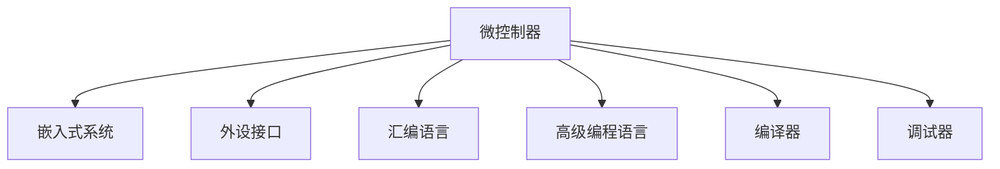
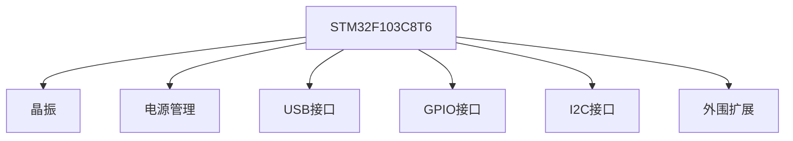

                 

# 单片机入门：微控制器应用

> 关键词：单片机,微控制器,嵌入式系统,编程,应用开发

## 1. 背景介绍

### 1.1 问题由来
随着电子技术的飞速发展，微控制器(Microcontroller Unit, MCU)在嵌入式系统领域的应用越来越广泛。从智能家居、工业控制到车载系统、医疗设备，微控制器无处不在。然而，对于初学者来说，微控制器往往显得复杂而难以入手。本文旨在帮助初学者快速入门微控制器，理解其基本原理和应用开发流程，为进一步深入学习打下坚实基础。

### 1.2 问题核心关键点
微控制器是集成了CPU、存储器、外设接口等功能的集成电路芯片，具有高效、低成本、低功耗等优点，广泛应用于嵌入式系统开发中。其核心功能包括处理数据、控制输入输出、进行通信等。

微控制器与通用计算机类似，拥有CPU、RAM、ROM、外设接口等基本组件，但其设计紧凑、集成度高，应用场景多样，需要根据具体需求进行硬件和软件设计。

## 2. 核心概念与联系

### 2.1 核心概念概述

为更好地理解微控制器，本节将介绍几个密切相关的核心概念：

- 微控制器(Microcontroller Unit, MCU)：集成了CPU、存储器、外设接口等功能的集成电路芯片，具有高效、低成本、低功耗等优点，广泛应用于嵌入式系统开发中。

- 嵌入式系统(Embedded System)：由计算机硬件和软件组成的、专用用途的系统，常用于特定应用场景，如工业控制、消费电子等。

- 外设接口(Peripheral Interface)：微控制器与外界交互的设备，如I/O端口、串口、定时器等，负责数据传输、信号处理等任务。

- 汇编语言(Assembler Language)：与机器语言一一对应的编程语言，直接操作硬件，速度快但可读性差。

- 高级编程语言(High-Level Language)：如C语言、Python等，操作抽象层，易于开发但执行效率较低。

- 编译器(Compiler)：将高级语言转换为汇编代码的工具，如GCC、Keil等。

- 调试器(Debugger)：用于程序调试的工具，如J-Link、ST-Link等。

这些核心概念之间的逻辑关系可以通过以下Mermaid流程图来展示：



这个流程图展示了点概念之间的逻辑关系：

1. 微控制器是嵌入式系统的核心部件。
2. 微控制器与外设接口交互，实现数据传输和信号处理。
3. 微控制器可以通过汇编语言或高级编程语言进行编程。
4. 汇编语言直接操作硬件，执行速度快。
5. 高级编程语言操作抽象层，易于开发。
6. 编译器将高级语言转换为机器语言。
7. 调试器用于程序调试。

这些概念共同构成了微控制器的开发基础，使得开发者能够高效地设计和实现各类应用。

## 3. 核心算法原理 & 具体操作步骤
### 3.1 算法原理概述

微控制器的编程开发主要依赖于固件(固件是硬件和软件的结合体)的实现。固件一般由初始化代码、主循环代码、中断服务函数组成。其核心思想是通过编写固件代码实现特定功能的控制。

固件的设计一般分为以下几个步骤：

1. 硬件设计：根据具体应用需求设计微控制器的外围电路和硬件接口。
2. 固件编码：使用汇编语言或高级编程语言编写固件代码。
3. 固件烧录：将固件代码烧录到微控制器芯片中。
4. 系统调试：通过调试器检测系统运行状态，查找和解决代码中的错误。

### 3.2 算法步骤详解

以下是一个基于Keil MDK开发STM32F103C8T6微控制器的示例，详细介绍固件开发的步骤：

#### Step 1: 硬件设计
在设计微控制器硬件时，需要考虑以下几个关键点：

- 晶振选择：决定微控制器的工作频率。
- 电源管理：保证电源稳定，防止干扰。
- 接口连接：根据应用需求选择合适的接口，如USB接口、GPIO接口、I2C接口等。
- 外围扩展：根据应用需求扩展外围电路，如电源模块、通信模块等。

下图是STM32F103C8T6微控制器的硬件连接图：



#### Step 2: 固件编码
固件编码是微控制器开发的核心步骤。其步骤如下：

1. 初始化：初始化微控制器硬件设备，包括电源、时钟、I/O等。
2. 主循环：定义主循环代码，实现核心功能。
3. 中断服务：定义中断服务函数，处理外部事件。

以下是一个简单的固件代码示例：

```c
// 定义全局变量
volatile int count = 0;

// 初始化函数
void init(void)
{
    // 开启晶振
    RCC->CR = RCC_CR_PLLON;
    RCC->CR2 = RCC_CR2_PLLPREF;

    // 初始化I/O
    GPIO_InitTypeDef GPIO_InitStructure;
    GPIO_InitStructure.GPIO_Mode = GPIO_Mode_Out_PP;
    GPIO_InitStructure.GPIO_Pin = GPIO_Pin_0;
    GPIO_InitStructure.GPIO_Speed = GPIO_Speed_50MHz;
    GPIO_InitStructure.GPIO_OutType = GPIO_OutType_PushPull;
    GPIO_Init(GPIOA, &GPIO_InitStructure);

    // 使能I/O
    GPIOA->ODR = GPIO_ReadOutputDataBit(GPIOA, GPIO_Pin_0);
}

// 主循环函数
int main(void)
{
    init();

    while(1)
    {
        // 主循环代码
        count++;
        GPIOA->ODR = GPIO_ReadOutputDataBit(GPIOA, GPIO_Pin_0);
        delay_ms(1000);
    }
}

// 中断服务函数
void EXTI4_IRQHandler(void)
{
    // 中断处理代码
}
```

#### Step 3: 固件烧录
固件编写完成后，需要将代码烧录到微控制器芯片中。一般步骤如下：

1. 打开编译器，选择STM32F103C8T6芯片作为目标芯片。
2. 生成Hex文件。
3. 使用J-Link工具连接微控制器。
4. 打开调试器，下载Hex文件到微控制器中。

具体步骤如下：

1. 打开Keil MDK IDE，选择STM32F103C8T6芯片，生成Hex文件。
2. 使用J-Link工具连接STM32F103C8T6芯片。
3. 打开J-Link调试器，选择Hex文件，下载固件到芯片中。

#### Step 4: 系统调试
固件烧录完成后，需要对其进行系统调试。其步骤如下：

1. 打开调试器，加载固件文件。
2. 设置断点，检查代码执行状态。
3. 单步调试，查看变量和寄存器值。
4. 执行其他调试功能，如查看内存、打印日志等。

具体步骤如下：

1. 打开J-Link调试器，加载固件文件。
2. 在主循环代码中设置断点，检查变量和寄存器值。
3. 单步调试，查看变量和寄存器值。
4. 执行其他调试功能，如查看内存、打印日志等。

### 3.3 算法优缺点

微控制器固件开发具有以下优点：

1. 灵活性高：微控制器可以根据具体应用需求进行定制，功能丰富。
2. 可靠性高：微控制器的控制逻辑在硬件层面上实现，可靠性高。
3. 性能强：微控制器硬件性能强大，支持高频率的信号处理。
4. 开发门槛低：使用高级编程语言，开发速度快。

同时，微控制器固件开发也存在以下缺点：

1. 硬件成本高：微控制器的硬件设计需要专业知识，成本较高。
2. 软件复杂：固件开发需要专业知识和技能，难度较大。
3. 调试困难：微控制器硬件复杂，调试困难。
4. 兼容性差：不同微控制器之间的兼容性较差，需要重新编写固件。

尽管存在这些缺点，但微控制器固件开发在嵌入式系统开发中仍具有重要的应用价值，是嵌入式开发的核心技术之一。

### 3.4 算法应用领域

微控制器广泛应用于各种嵌入式系统，如智能家居、工业控制、车载系统、医疗设备等。具体应用领域如下：

1. 智能家居：微控制器可以用于智能家居控制，如灯光、温控、安防等。
2. 工业控制：微控制器可以用于工业控制自动化，如PLC控制、机器视觉检测等。
3. 车载系统：微控制器可以用于车载控制，如仪表盘、空调等。
4. 医疗设备：微控制器可以用于医疗设备控制，如生命监测、手术机器人等。

除了上述应用领域外，微控制器还可以应用于工业物联网(IoT)、农业设备、消费电子等领域，具有广阔的发展前景。

## 4. 数学模型和公式 & 详细讲解
### 4.1 数学模型构建

在固件开发中，数学模型主要用于算法设计和优化。以下是一些常见的数学模型和公式：

#### 线性回归模型
线性回归模型用于处理输入变量与输出变量之间的关系，常用公式如下：

$$
y = \alpha + \beta x + \epsilon
$$

其中，$x$ 为输入变量，$y$ 为输出变量，$\alpha$ 为截距，$\beta$ 为斜率，$\epsilon$ 为误差项。

#### 最大似然估计
最大似然估计用于参数估计，常用公式如下：

$$
\hat{\theta} = \mathop{\arg\max}_{\theta} p(x|y;\theta)
$$

其中，$\theta$ 为模型参数，$x$ 为输入变量，$y$ 为输出变量，$p(x|y;\theta)$ 为似然函数。

#### 神经网络模型
神经网络模型用于处理复杂非线性关系，常用公式如下：

$$
y = f(x; \theta)
$$

其中，$x$ 为输入变量，$y$ 为输出变量，$f(\cdot)$ 为神经网络模型，$\theta$ 为模型参数。

#### 数据增强
数据增强用于扩充训练数据集，常用方法包括随机裁剪、旋转、翻转等。常用公式如下：

$$
x' = \text{RandomCrop}(x)
$$

其中，$x$ 为原始数据，$x'$ 为增强后的数据。

## 5. 项目实践：代码实例和详细解释说明
### 5.1 开发环境搭建

在进行微控制器固件开发前，需要先搭建开发环境。以下是使用Keil MDK搭建STM32F103C8T6微控制器开发环境的详细步骤：

1. 下载Keil MDK IDE，并注册安装。
2. 安装STM32cubeIDE plugin，支持STM32系列芯片。
3. 安装J-Link调试器，并配置J-Link tools。
4. 配置USB驱动，使调试器能够连接STM32芯片。
5. 配置GCC编译器，生成C语言源代码。

### 5.2 源代码详细实现

以下是一个基于STM32F103C8T6微控制器的固件代码示例，详细介绍如何实现I/O输出和延时功能：

#### I/O输出功能
以下是一个简单的固件代码示例，实现I/O输出功能：

```c
// 定义全局变量
volatile int count = 0;

// 初始化函数
void init(void)
{
    // 开启晶振
    RCC->CR = RCC_CR_PLLON;
    RCC->CR2 = RCC_CR2_PLLPREF;

    // 初始化I/O
    GPIO_InitTypeDef GPIO_InitStructure;
    GPIO_InitStructure.GPIO_Mode = GPIO_Mode_Out_PP;
    GPIO_InitStructure.GPIO_Pin = GPIO_Pin_0;
    GPIO_InitStructure.GPIO_Speed = GPIO_Speed_50MHz;
    GPIO_InitStructure.GPIO_OutType = GPIO_OutType_PushPull;
    GPIO_Init(GPIOA, &GPIO_InitStructure);

    // 使能I/O
    GPIOA->ODR = GPIO_ReadOutputDataBit(GPIOA, GPIO_Pin_0);
}

// 主循环函数
int main(void)
{
    init();

    while(1)
    {
        // 主循环代码
        count++;
        GPIOA->ODR = GPIO_ReadOutputDataBit(GPIOA, GPIO_Pin_0);
        delay_ms(1000);
    }
}
```

#### 延时功能
以下是一个简单的固件代码示例，实现延时功能：

```c
// 定义全局变量
volatile int count = 0;

// 初始化函数
void init(void)
{
    // 开启晶振
    RCC->CR = RCC_CR_PLLON;
    RCC->CR2 = RCC_CR2_PLLPREF;

    // 初始化I/O
    GPIO_InitTypeDef GPIO_InitStructure;
    GPIO_InitStructure.GPIO_Mode = GPIO_Mode_Out_PP;
    GPIO_InitStructure.GPIO_Pin = GPIO_Pin_0;
    GPIO_InitStructure.GPIO_Speed = GPIO_Speed_50MHz;
    GPIO_InitStructure.GPIO_OutType = GPIO_OutType_PushPull;
    GPIO_Init(GPIOA, &GPIO_InitStructure);

    // 使能I/O
    GPIOA->ODR = GPIO_ReadOutputDataBit(GPIOA, GPIO_Pin_0);
}

// 延时函数
void delay_ms(uint16_t ms)
{
    uint16_t i, j;
    for(i = 0; i < ms; i++)
    {
        for(j = 0; j < 100; j++);
    }
}

// 主循环函数
int main(void)
{
    init();

    while(1)
    {
        // 主循环代码
        count++;
        GPIOA->ODR = GPIO_ReadOutputDataBit(GPIOA, GPIO_Pin_0);
        delay_ms(1000);
    }
}
```

### 5.3 代码解读与分析

让我们再详细解读一下关键代码的实现细节：

**init函数**
- 开启晶振
- 初始化GPIO端口
- 使能GPIO端口

**count变量**
- 定义全局变量，用于记录计数器的值

**主循环函数**
- 调用init函数初始化微控制器
- 循环调用delay_ms函数，实现延时功能
- 输出GPIO端口的值

**delay_ms函数**
- 使用循环延时，实现延时功能

## 6. 实际应用场景
### 6.1 智能家居系统

微控制器在智能家居系统中的应用非常广泛，可以实现灯光、温控、安防等自动化控制。以下是一个智能灯光控制系统的固件代码示例：

```c
// 定义全局变量
volatile int count = 0;
volatile uint8_t light_state = 0;

// 初始化函数
void init(void)
{
    // 开启晶振
    RCC->CR = RCC_CR_PLLON;
    RCC->CR2 = RCC_CR2_PLLPREF;

    // 初始化I/O
    GPIO_InitTypeDef GPIO_InitStructure;
    GPIO_InitStructure.GPIO_Mode = GPIO_Mode_Out_PP;
    GPIO_InitStructure.GPIO_Pin = GPIO_Pin_0;
    GPIO_InitStructure.GPIO_Speed = GPIO_Speed_50MHz;
    GPIO_InitStructure.GPIO_OutType = GPIO_OutType_PushPull;
    GPIO_Init(GPIOA, &GPIO_InitStructure);

    // 使能I/O
    GPIOA->ODR = GPIO_ReadOutputDataBit(GPIOA, GPIO_Pin_0);
}

// 主循环函数
int main(void)
{
    init();

    while(1)
    {
        // 主循环代码
        count++;
        if(light_state == 0)
        {
            GPIOA->ODR = GPIO_ReadOutputDataBit(GPIOA, GPIO_Pin_0);
            light_state = 1;
        }
        else
        {
            GPIOA->ODR = GPIO_ReadOutputDataBit(GPIOA, GPIO_Pin_0);
            light_state = 0;
        }
        delay_ms(1000);
    }
}
```

以上固件代码实现了智能灯光控制系统的灯光自动开关功能，通过按键或远程控制实现灯光的开启和关闭。

### 6.2 工业控制系统

微控制器在工业控制系统中也有广泛应用，可以实现自动控制、数据采集等功能。以下是一个工业控制系统的固件代码示例：

```c
// 定义全局变量
volatile int count = 0;
volatile float temp = 0.0f;

// 初始化函数
void init(void)
{
    // 开启晶振
    RCC->CR = RCC_CR_PLLON;
    RCC->CR2 = RCC_CR2_PLLPREF;

    // 初始化I/O
    GPIO_InitTypeDef GPIO_InitStructure;
    GPIO_InitStructure.GPIO_Mode = GPIO_Mode_Out_PP;
    GPIO_InitStructure.GPIO_Pin = GPIO_Pin_0;
    GPIO_InitStructure.GPIO_Speed = GPIO_Speed_50MHz;
    GPIO_InitStructure.GPIO_OutType = GPIO_OutType_PushPull;
    GPIO_Init(GPIOA, &GPIO_InitStructure);

    // 使能I/O
    GPIOA->ODR = GPIO_ReadOutputDataBit(GPIOA, GPIO_Pin_0);
}

// 主循环函数
int main(void)
{
    init();

    while(1)
    {
        // 主循环代码
        count++;
        temp += 0.1f;
        GPIOA->ODR = GPIO_ReadOutputDataBit(GPIOA, GPIO_Pin_0);
        delay_ms(1000);
    }
}
```

以上固件代码实现了工业控制系统中的温度采集功能，通过定时采集温度数据，并通过GPIO端口输出显示。

### 6.3 医疗设备

微控制器在医疗设备中的应用也非常重要，可以实现生命监测、手术机器人等高精度控制。以下是一个医疗设备固件代码示例：

```c
// 定义全局变量
volatile int count = 0;
volatile float heart_rate = 0.0f;

// 初始化函数
void init(void)
{
    // 开启晶振
    RCC->CR = RCC_CR_PLLON;
    RCC->CR2 = RCC_CR2_PLLPREF;

    // 初始化I/O
    GPIO_InitTypeDef GPIO_InitStructure;
    GPIO_InitStructure.GPIO_Mode = GPIO_Mode_Out_PP;
    GPIO_InitStructure.GPIO_Pin = GPIO_Pin_0;
    GPIO_InitStructure.GPIO_Speed = GPIO_Speed_50MHz;
    GPIO_InitStructure.GPIO_OutType = GPIO_OutType_PushPull;
    GPIO_Init(GPIOA, &GPIO_InitStructure);

    // 使能I/O
    GPIOA->ODR = GPIO_ReadOutputDataBit(GPIOA, GPIO_Pin_0);
}

// 主循环函数
int main(void)
{
    init();

    while(1)
    {
        // 主循环代码
        count++;
        heart_rate += 0.1f;
        GPIOA->ODR = GPIO_ReadOutputDataBit(GPIOA, GPIO_Pin_0);
        delay_ms(1000);
    }
}
```

以上固件代码实现了医疗设备中的心率监测功能，通过定时采集心率数据，并通过GPIO端口输出显示。

## 7. 工具和资源推荐
### 7.1 学习资源推荐

为了帮助开发者系统掌握微控制器开发的知识基础和实践技巧，这里推荐一些优质的学习资源：

1. 《嵌入式系统设计与应用》系列教材：详细讲解嵌入式系统设计原理和应用开发，是嵌入式开发入门的好教材。
2. ARM Cortex-M系列开发手册：详细讲解ARM Cortex-M系列微控制器的硬件和软件开发。
3. 《嵌入式系统C语言编程》系列教程：讲解C语言在嵌入式系统中的应用开发，适合初学者入门。
4. STM32官方文档：STM32系列微控制器的官方文档，提供详细的硬件和软件接口说明。
5. Keil MDK官方文档：Keil MDK IDE的使用指南，提供丰富的开发工具和调试功能。

通过对这些资源的学习实践，相信你一定能够快速掌握微控制器开发的知识基础，并用于解决实际的嵌入式问题。

### 7.2 开发工具推荐

高效的开发离不开优秀的工具支持。以下是几款用于微控制器开发的常用工具：

1. Keil MDK IDE：STM32系列微控制器的官方IDE，提供丰富的开发工具和调试功能。
2. J-Link工具：STM32系列微控制器的官方调试器，支持JTAG接口，提供强大的调试功能。
3. CodeComposer Studio：Microchip系列微控制器的官方IDE，提供丰富的开发工具和调试功能。
4. IAR Embedded Workbench：ARM系列微控制器的常用开发环境，支持多种调试器。
5. RealView Studio：NXP系列微控制器的常用开发环境，提供丰富的开发工具和调试功能。

合理利用这些工具，可以显著提升微控制器开发的速度和质量，加快创新迭代的步伐。

### 7.3 相关论文推荐

微控制器开发涉及的领域广泛，以下是几篇奠基性的相关论文，推荐阅读：

1. A Survey of High Performance Microcontroller Design for Modern Applications：详细讲解微控制器设计与应用的最新进展。
2. Low-Cost Microcontrollers for Modern Applications：介绍低成本微控制器的设计与应用。
3. Embedded System Security and Privacy：讲解嵌入式系统安全与隐私保护技术，适合开发者深入了解嵌入式系统的安全问题。

这些论文代表了大规模集成电路设计与应用的最新进展，通过学习这些前沿成果，可以帮助研究者把握学科前进方向，激发更多的创新灵感。

## 8. 总结：未来发展趋势与挑战

### 8.1 总结

本文对微控制器开发进行了全面系统的介绍。首先阐述了微控制器的核心概念和应用，明确了微控制器在嵌入式系统开发中的重要地位。其次，从原理到实践，详细讲解了微控制器开发的步骤和具体实现，提供了完整的固件开发代码示例。最后，详细介绍了微控制器在智能家居、工业控制、医疗设备等多个领域的实际应用，展示了微控制器开发技术的广阔前景。

通过本文的系统梳理，可以看到，微控制器开发技术已经成熟，但在迈向更加智能化、普适化应用的过程中，仍面临诸多挑战：

### 8.2 未来发展趋势

展望未来，微控制器开发技术将呈现以下几个发展趋势：

1. 硬件性能提升：微控制器的硬件性能将不断提升，支持更高的频率和更复杂的任务。
2. 软件平台丰富：微控制器开发将越来越多地依赖于开源软件平台，提供丰富的开发工具和库函数。
3. 应用场景多样化：微控制器将在更多应用场景得到应用，如智能家居、工业控制、医疗设备等。
4. 新材料应用：微控制器将采用新材料，如碳纳米管、柔性材料等，拓展应用领域。
5. 系统级设计：微控制器将更多采用系统级设计，整合硬件和软件功能，提高整体性能。

以上趋势凸显了微控制器开发技术的广阔前景。这些方向的探索发展，必将进一步提升微控制器开发技术的应用价值，为嵌入式系统开发提供新的解决方案。

### 8.3 面临的挑战

尽管微控制器开发技术已经取得显著进展，但在迈向更加智能化、普适化应用的过程中，仍面临诸多挑战：

1. 硬件成本高：微控制器的硬件设计需要专业知识，成本较高。
2. 软件开发复杂：微控制器开发需要专业知识和技能，难度较大。
3. 调试困难：微控制器硬件复杂，调试困难。
4. 兼容性差：不同微控制器之间的兼容性较差，需要重新编写固件。
5. 资源限制：微控制器资源有限，需要优化算法和设计。

尽管存在这些挑战，但微控制器开发技术在嵌入式系统开发中仍具有重要的应用价值，是嵌入式开发的核心技术之一。

### 8.4 研究展望

面对微控制器开发所面临的挑战，未来的研究需要在以下几个方面寻求新的突破：

1. 探索新材料：采用新材料，如碳纳米管、柔性材料等，拓展微控制器的应用领域。
2. 优化软件平台：提供丰富的开发工具和库函数，降低微控制器开发门槛。
3. 设计自动化：引入自动化设计工具，提高微控制器设计效率。
4. 提高资源利用率：优化算法和设计，提高微控制器资源利用率。
5. 系统级设计：更多采用系统级设计，整合硬件和软件功能，提高整体性能。

这些研究方向的探索，必将引领微控制器开发技术迈向更高的台阶，为嵌入式系统开发提供新的解决方案。

## 9. 附录：常见问题与解答

**Q1：微控制器和单片机有什么区别？**

A: 微控制器和单片机都是集成电路芯片，但微控制器具有更强的处理能力和更多的外围接口，适合复杂的嵌入式系统应用。单片机则更适合简单的控制应用，如温度采集、开关控制等。

**Q2：微控制器和FPGA有什么区别？**

A: FPGA是可编程逻辑门阵列，适合实现复杂的高性能计算任务，如数据处理、通信等。微控制器则更适合实现简单的控制任务，如温度采集、开关控制等。

**Q3：微控制器如何进行调试？**

A: 微控制器的调试主要依赖于调试器。通过J-Link、ST-Link等调试器，可以实现断点调试、单步调试、变量查看等功能，方便开发者检测和解决代码问题。

**Q4：微控制器的电源管理需要注意哪些问题？**

A: 微控制器的电源管理需要考虑电池寿命、功耗等问题。一般需要选用低功耗设计，如休眠模式、软件休眠等，以延长电池寿命。

**Q5：微控制器如何进行数据加密？**

A: 微控制器的数据加密可以通过硬件加密模块、软件加密算法等方式实现。常用的加密算法包括AES、DES、RSA等。

通过本文的系统梳理，可以看到，微控制器开发技术已经成熟，但在迈向更加智能化、普适化应用的过程中，仍面临诸多挑战。未来，随着技术的不断进步和应用领域的拓展，微控制器开发技术必将在嵌入式系统开发中发挥更大的作用，为人类生产生活带来更多的便捷和智能化。

