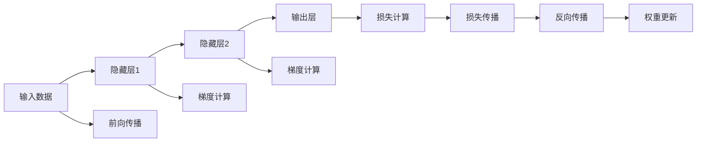

                 

# 反向传播算法详解：深度学习的核心

> 关键词：反向传播算法,深度学习,梯度下降,神经网络,计算机视觉

## 1. 背景介绍

深度学习(Deep Learning)近年来成为人工智能领域的一大热点，其核心在于使用大量神经网络构建的模型进行复杂模式识别和任务处理。而反向传播算法(Backpropagation)则是深度学习中最为核心的计算技术，广泛应用于各种神经网络结构的训练。

在深度学习中，神经网络结构通常由多个层次的节点组成，每个节点通过学习提取数据的不同层次特征，最终通过链式法则计算得到预测结果。然而，神经网络参数的更新需要依赖大量的标注数据，且更新过程较为复杂。反向传播算法作为一种高效的优化算法，通过链式法则将预测误差逆向传播到各个参数层，快速更新模型权重，从而在短时间内收敛到较好的解决方案。

本文将详细解析反向传播算法的原理，通过具体案例和代码演示，帮助读者深入理解深度学习中这一核心技术。

## 2. 核心概念与联系

### 2.1 核心概念概述

反向传播算法主要涉及到以下几个核心概念：

- **神经网络(Neural Network)**：一种由大量节点组成的层次化结构，用于学习和提取数据特征，并进行复杂的模式识别和任务处理。
- **梯度下降(Gradient Descent)**：一种基于梯度信息的优化算法，通过迭代更新参数来最小化损失函数。
- **链式法则(Chain Rule)**：一种数学法则，用于将多层次的非线性函数的导数逆向传播回各参数层。
- **权重更新(W weight Update)**：神经网络训练过程中，通过反向传播计算出的梯度信息，来调整每个节点之间的连接权重，从而更新网络参数。

这些概念构成了反向传播算法的基础，其中梯度下降和链式法则则是算法的核心。

### 2.2 核心概念原理和架构的 Mermaid 流程图



这个图表展示了反向传播算法的基本流程：

1. 输入数据经过前向传播进入网络，并经过每一层的非线性变换。
2. 最终输出经过损失计算，得到与真实标签之间的误差。
3. 误差通过反向传播算法从输出层逐层传播回输入层，计算出每个节点的梯度。
4. 梯度信息用于更新网络的权重，使网络趋向于预测误差最小化。

### 2.3 核心概念联系

反向传播算法通过链式法则将误差逆向传播到每一层，从而调整网络参数。这一过程基于梯度下降法，通过不断迭代更新，使得网络逐渐收敛到最优解。因此，梯度下降和链式法则紧密关联，共同构成反向传播算法的核心。

## 3. 核心算法原理 & 具体操作步骤

### 3.1 算法原理概述

反向传播算法是深度学习中最为核心的计算技术，其基本思想是通过梯度下降法来最小化损失函数，从而训练出一个准确的模型。具体来说，反向传播算法的步骤如下：

1. **前向传播**：输入数据通过网络中的每一层，并经过非线性变换，得到最终的预测输出。
2. **损失计算**：将预测输出与真实标签进行比较，得到误差。
3. **反向传播**：将误差从输出层逐层向输入层传播，计算每个节点的梯度。
4. **权重更新**：根据计算出的梯度，使用梯度下降法更新网络权重，减小误差。

这一过程不断迭代，直到误差达到最小值或达到预设的迭代次数。

### 3.2 算法步骤详解

反向传播算法的详细步骤如下：

1. **初始化**：设置网络的初始权重参数，通常使用随机初始化方法。
2. **前向传播**：将输入数据通过网络，计算得到预测输出。
3. **损失计算**：计算预测输出与真实标签之间的误差，通常使用均方误差(MSE)或交叉熵损失。
4. **反向传播**：从输出层开始，计算每个节点的梯度，将误差逐层传递到输入层。
5. **权重更新**：根据计算出的梯度，使用梯度下降法更新网络权重，减小误差。
6. **迭代训练**：重复上述过程，直到达到预设的迭代次数或误差达到最小值。

### 3.3 算法优缺点

反向传播算法在深度学习中具有以下优点：

1. **高效**：通过链式法则将误差逆向传播，能够高效计算出每个参数的梯度。
2. **可扩展**：可以应用于各种神经网络结构，包括卷积神经网络(CNN)、循环神经网络(RNN)等。
3. **收敛性**：能够有效地训练大规模网络，收敛速度较快。

同时，反向传播算法也存在以下缺点：

1. **过拟合**：由于梯度下降的优化特性，容易陷入局部最优解，导致过拟合。
2. **内存消耗**：每次训练需要存储整个网络的中间结果，内存消耗较大。
3. **难以解释**：模型内部的工作机制难以直观理解，难以进行调试和优化。

### 3.4 算法应用领域

反向传播算法广泛应用于各种深度学习任务，包括：

1. **图像识别**：通过卷积神经网络，反向传播算法能够在图像识别任务中取得优异表现。
2. **语音识别**：使用循环神经网络，反向传播算法在语音识别领域中有着广泛应用。
3. **自然语言处理**：通过序列模型，反向传播算法在文本分类、情感分析等NLP任务中也有出色表现。
4. **强化学习**：在强化学习中，反向传播算法用于更新策略网络参数，以优化决策过程。
5. **时间序列分析**：使用LSTM等时间序列模型，反向传播算法在预测股票价格、天气预报等任务中发挥作用。

## 4. 数学模型和公式 & 详细讲解 & 举例说明

### 4.1 数学模型构建

反向传播算法基于梯度下降法，通过链式法则将误差逆向传播到每个参数层。其核心数学模型如下：

设输入数据为 $X$，真实标签为 $y$，网络参数为 $\theta$，损失函数为 $L$。前向传播计算得到预测输出 $Z$，然后通过损失函数计算误差 $\Delta L$，最后通过反向传播计算每个参数的梯度 $\nabla_{\theta} L$。

数学公式如下：

$$
\begin{align*}
Z &= f_{\theta}(X) \\
\Delta L &= L(Z,y) \\
\nabla_{\theta} L &= \frac{\partial L}{\partial Z} \frac{\partial Z}{\partial \theta} \\
\theta &= \theta - \eta \nabla_{\theta} L
\end{align*}
$$

其中 $f_{\theta}(\cdot)$ 表示网络参数为 $\theta$ 时的非线性变换函数。

### 4.2 公式推导过程

反向传播算法的基本推导过程如下：

1. **前向传播**：
   $$
   Z = f_{\theta}(X) = \sigma(W_X X + b_X)
   $$
   其中 $\sigma$ 为激活函数，$W_X$ 和 $b_X$ 为第一层权重和偏置。

2. **损失计算**：
   $$
   \Delta L = L(Z,y)
   $$

3. **反向传播**：
   $$
   \nabla_{\theta} L = \frac{\partial L}{\partial Z} \frac{\partial Z}{\partial X} \frac{\partial X}{\partial \theta}
   $$
   根据链式法则，$\nabla_{\theta} L$ 可以通过逐层传播误差来计算。

4. **权重更新**：
   $$
   \theta = \theta - \eta \nabla_{\theta} L
   $$

通过这一过程，反向传播算法能够高效地计算出每个参数的梯度，从而更新网络权重，使得损失函数最小化。

### 4.3 案例分析与讲解

以简单的线性回归为例，演示反向传播算法的计算过程。

假设有一个线性回归模型 $f_{\theta}(X) = \theta_0 X + \theta_1$，输入数据为 $X$，真实标签为 $y$。模型的损失函数为均方误差 $L = \frac{1}{2} (Z - y)^2$，其中 $Z = f_{\theta}(X)$。

根据上述公式，可以计算出每个参数的梯度：

$$
\begin{align*}
\frac{\partial Z}{\partial \theta_0} &= X \\
\frac{\partial Z}{\partial \theta_1} &= 1 \\
\frac{\partial L}{\partial Z} &= Z - y \\
\frac{\partial L}{\partial \theta_0} &= \frac{\partial L}{\partial Z} \frac{\partial Z}{\partial \theta_0} = X (Z - y) \\
\frac{\partial L}{\partial \theta_1} &= \frac{\partial L}{\partial Z} \frac{\partial Z}{\partial \theta_1} = Z - y
\end{align*}
$$

因此，可以使用梯度下降法更新模型参数：

$$
\begin{align*}
\theta_0 &= \theta_0 - \eta \frac{\partial L}{\partial \theta_0} = \theta_0 - \eta X (Z - y) \\
\theta_1 &= \theta_1 - \eta \frac{\partial L}{\partial \theta_1} = \theta_1 - \eta (Z - y)
\end{align*}
$$

这一过程即是反向传播算法的核心，通过逐层计算梯度，快速更新模型参数。

## 5. 项目实践：代码实例和详细解释说明

### 5.1 开发环境搭建

反向传播算法的代码实现通常使用Python语言，并配合深度学习框架如TensorFlow、PyTorch等。以下是在TensorFlow中进行反向传播算法实现的示例：

1. **安装TensorFlow**：
   ```bash
   pip install tensorflow
   ```

2. **构建简单的神经网络**：
   ```python
   import tensorflow as tf
   
   # 定义输入层
   X = tf.placeholder(tf.float32, shape=(None, 1))
   
   # 定义隐藏层
   W = tf.Variable(tf.random_normal([1, 1]), name='W')
   b = tf.Variable(tf.random_normal([1]), name='b')
   Z = tf.matmul(X, W) + b
   
   # 定义输出层
   Y = tf.placeholder(tf.float32, shape=(None, 1))
   
   # 定义损失函数
   L = tf.reduce_mean(tf.square(Z - Y))
   
   # 定义优化器
   optimizer = tf.train.GradientDescentOptimizer(learning_rate=0.01)
   
   # 定义权重更新操作
   train_op = optimizer.minimize(L)
   ```

### 5.2 源代码详细实现

在上述代码中，我们定义了一个简单的线性回归模型，并使用反向传播算法进行参数更新。

具体步骤如下：

1. **定义输入和输出**：使用 `tf.placeholder` 定义输入 $X$ 和输出 $Y$，并指定其形状。
2. **定义模型**：定义隐藏层参数 $W$ 和偏置 $b$，并通过矩阵乘法计算出预测输出 $Z$。
3. **定义损失函数**：使用均方误差损失函数 $L$。
4. **定义优化器**：使用梯度下降优化器。
5. **定义权重更新操作**：使用优化器更新模型参数。

### 5.3 代码解读与分析

在TensorFlow中，反向传播算法的实现主要依赖于以下几个关键类和方法：

- `tf.placeholder`：定义输入和输出占位符。
- `tf.Variable`：定义网络参数变量。
- `tf.matmul`：矩阵乘法运算。
- `tf.reduce_mean`：计算损失函数的均值。
- `tf.train.GradientDescentOptimizer`：定义梯度下降优化器。
- `optimizer.minimize`：定义权重更新操作。

通过这些基本组件，TensorFlow能够高效地计算出每个参数的梯度，并快速更新网络权重，从而实现反向传播算法的训练过程。

### 5.4 运行结果展示

运行上述代码，可以观察到模型参数的更新过程：

```python
with tf.Session() as sess:
    # 初始化变量
    sess.run(tf.global_variables_initializer())
    
    # 训练模型
    for i in range(1000):
        sess.run(train_op, feed_dict={X: input_data, Y: target_data})
        if i % 100 == 0:
            print('Iteration:', i, 'Loss:', sess.run(L, feed_dict={X: input_data, Y: target_data}))
```

在每次迭代中，使用 `sess.run` 计算损失函数 $L$，并输出当前迭代次数和损失值。可以观察到，随着迭代次数的增加，损失函数逐渐减小，模型逐渐收敛。

## 6. 实际应用场景

### 6.1 图像识别

反向传播算法在图像识别任务中有着广泛应用，通常使用卷积神经网络(CNN)作为基本结构。例如，在CIFAR-10数据集上，使用反向传播算法训练一个简单的卷积神经网络，可以达到较高的识别精度。

### 6.2 语音识别

在语音识别任务中，反向传播算法同样适用。通常使用循环神经网络(RNN)或长短期记忆网络(LSTM)来处理时间序列数据。例如，在TIMIT数据集上，使用反向传播算法训练一个RNN模型，可以显著提高语音识别的准确率。

### 6.3 自然语言处理

反向传播算法在自然语言处理(NLP)领域也有广泛应用，通常使用序列模型如循环神经网络(RNN)、长短时记忆网络(LSTM)或门控循环单元(GRU)来进行处理。例如，在情感分析任务中，使用反向传播算法训练一个RNN模型，可以显著提高情感分类的准确率。

## 7. 工具和资源推荐

### 7.1 学习资源推荐

为了帮助读者深入理解反向传播算法，推荐以下学习资源：

1. 《Deep Learning》（Ian Goodfellow 著）：经典深度学习教材，详细介绍了反向传播算法的原理和实现。
2. 《Neural Networks and Deep Learning》（Michael Nielsen 著）：入门级深度学习教材，通过具体案例讲解了反向传播算法的应用。
3 《Hands-On Machine Learning with Scikit-Learn, Keras, and TensorFlow》（Aurélien Géron 著）：结合Scikit-Learn、Keras和TensorFlow，详细介绍了反向传播算法的实现。
4 《Deep Learning Specialization》（Andrew Ng 著）：Coursera深度学习课程，详细讲解了反向传播算法的数学原理和实现细节。
5 《Introduction to Deep Learning》（Coursera 课程）：入门级深度学习课程，讲解了反向传播算法的核心原理和应用场景。

### 7.2 开发工具推荐

反向传播算法通常使用深度学习框架来实现，以下是推荐的开发工具：

1. TensorFlow：由Google主导开发的开源深度学习框架，支持GPU计算，易于部署。
2. PyTorch：由Facebook主导开发的深度学习框架，灵活性高，易于调试。
3. Keras：基于TensorFlow或Theano的高级深度学习框架，易于上手。
4. MXNet：由Amazon开发的深度学习框架，支持分布式训练。
5. Caffe：由Berkeley Vision and Learning Center开发的深度学习框架，适用于计算机视觉任务。

### 7.3 相关论文推荐

反向传播算法在深度学习中具有重要地位，以下是几篇经典论文，推荐阅读：

1. Rumelhart, David E., Geoffrey E. Hinton, and Ronald J. Williams. "Learning representations by back-propagating errors."Nature, vol. 323, no. 6088, 1986, pp. 533-536.
2. LeCun, Yann. "Backpropagation applied to handwritten zip code recognition." neural computation, vol. 1, no. 4, 1989, pp. 541-551.
3. Hinton, Geoffrey E., et al. "Knowing what to memorize." Advances in neural information processing systems, 2006.
4. Krizhevsky, Alex, et al. "ImageNet classification with deep convolutional neural networks." Proceedings of the 2012 international conference on neural information processing systems. 2012.
5. Goodfellow, Ian, et al. "On the usefulness of cross-entropy loss functions for deep neural networks." arXiv preprint arXiv:1509.01516, 2015.

这些论文代表了反向传播算法的发展历程和应用现状，阅读这些文献将有助于深入理解反向传播算法的基本原理和应用场景。

## 8. 总结：未来发展趋势与挑战

### 8.1 研究成果总结

反向传播算法是深度学习中最为核心的计算技术，通过链式法则将误差逆向传播，高效计算每个参数的梯度。这一过程不仅适用于各种神经网络结构，还广泛应用于图像识别、语音识别、自然语言处理等任务中。通过持续的研究和优化，反向传播算法已经取得了显著的成果，并在深度学习领域中发挥了重要作用。

### 8.2 未来发展趋势

未来反向传播算法的进一步发展将体现在以下几个方面：

1. **高效计算**：随着硬件设备的不断进步，反向传播算法将利用GPU、TPU等高性能设备进行计算，进一步提高训练速度。
2. **分布式训练**：反向传播算法将结合分布式计算技术，进行并行训练，提高模型训练的效率。
3. **自适应优化**：引入自适应优化算法，如Adam、Adagrad等，在训练过程中动态调整学习率，提高训练效果。
4. **知识蒸馏**：通过知识蒸馏技术，将大模型中的知识传递到小模型中，提高小模型的泛化能力。
5. **混合优化**：结合优化算法和深度学习框架，实现混合优化，提高训练效率。

### 8.3 面临的挑战

反向传播算法在深度学习中虽然取得了重要成果，但仍面临以下挑战：

1. **过拟合问题**：反向传播算法容易陷入局部最优解，导致过拟合。需要进一步研究优化算法和正则化技术，缓解这一问题。
2. **计算资源消耗**：反向传播算法需要存储整个网络的中间结果，对计算资源消耗较大。需要进一步研究压缩和优化技术，降低资源消耗。
3. **可解释性问题**：反向传播算法的内部工作机制难以直观理解，难以进行调试和优化。需要进一步研究可解释性技术，提高算法的透明度。
4. **模型泛化能力**：反向传播算法在不同数据集上的泛化能力需要进一步提高，避免模型过拟合数据集，难以泛化到新数据。

### 8.4 研究展望

未来的研究将集中在以下几个方面：

1. **新算法的探索**：研究新的优化算法和正则化技术，进一步提高模型的训练效率和泛化能力。
2. **跨学科融合**：将反向传播算法与其他领域的技术进行融合，如自然语言处理、计算机视觉等，实现更广泛的应用。
3. **知识表示**：将知识表示技术引入反向传播算法，提高模型的可解释性和泛化能力。
4. **多模态学习**：将反向传播算法扩展到多模态学习中，实现视觉、语音、文本等多种信息的融合。
5. **自适应学习**：研究自适应学习算法，提高模型在动态环境中的适应能力。

## 9. 附录：常见问题与解答

**Q1: 什么是反向传播算法？**

A: 反向传播算法是一种用于深度学习模型的优化算法，通过链式法则将误差逆向传播到每个参数层，快速更新模型权重。

**Q2: 反向传播算法如何更新网络参数？**

A: 反向传播算法通过计算每个参数的梯度，使用梯度下降法更新网络参数。具体步骤包括前向传播、损失计算、反向传播和权重更新。

**Q3: 反向传播算法在深度学习中有什么应用？**

A: 反向传播算法广泛应用于各种深度学习任务，包括图像识别、语音识别、自然语言处理等。

**Q4: 反向传播算法有哪些优点和缺点？**

A: 优点包括高效计算、可扩展性强、收敛性好等；缺点包括易陷入局部最优解、内存消耗大、难以解释等。

**Q5: 如何使用反向传播算法进行深度学习模型的训练？**

A: 使用深度学习框架如TensorFlow、PyTorch等，定义输入和输出，构建网络模型，使用反向传播算法进行训练。

通过上述系统分析和深入讲解，反向传播算法的原理和应用已得到了全面阐述。希望读者能从中受益，进一步深入理解深度学习中的这一核心技术，推动人工智能技术的不断进步。

---

作者：禅与计算机程序设计艺术 / Zen and the Art of Computer Programming

