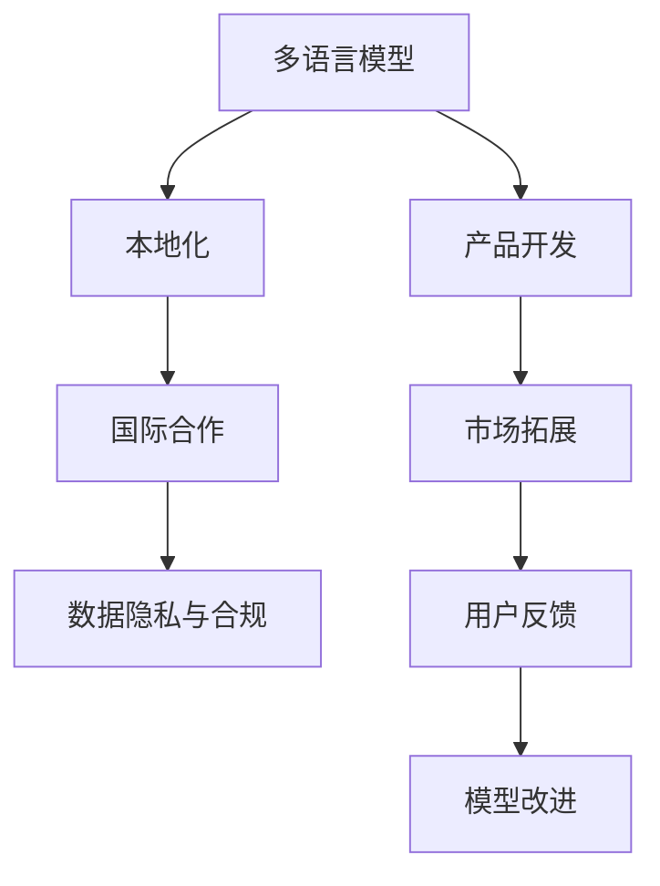

                 

# 国际化战略：Lepton AI的全球布局

## 1. 背景介绍

### 1.1 问题由来
随着全球化深入推进，越来越多的企业开始拓展国际市场，利用人工智能(AI)技术提升全球运营效率，增强产品竞争力。对于AI企业而言，如何实现国际化战略，是迈向全球化的关键步骤。

### 1.2 问题核心关键点
国际化战略涉及多方面的考虑，包括市场拓展、产品本地化、文化融合、法律合规等多个方面。具体来说，AI企业需要：

- 开发多语言模型以支持全球市场。
- 对不同市场的用户习惯和文化差异进行本地化适配。
- 遵循各地法律法规，保障数据隐私和安全。
- 建立跨文化团队，促进国际合作与交流。

这些需求不仅对AI企业的产品研发提出了挑战，也对企业的数据治理、业务运营、国际合作等方面提出了新的要求。

### 1.3 问题研究意义
国际化的成功，不仅能帮助企业拓展全球市场，提高收入和品牌影响力，还能促进技术创新和文化交流，推动行业整体进步。

- **提升市场份额**：通过本地化服务，满足不同地区客户的需求，增强市场竞争力。
- **提升品牌影响力**：国际化成功可提升企业全球知名度，增强品牌效应。
- **促进技术创新**：国际化过程中遇到的问题和挑战，往往能够催生新的技术解决方案。
- **推动行业进步**：国际化进程能够带动行业标准和法规的统一，促进整个行业的发展。

## 2. 核心概念与联系

### 2.1 核心概念概述

- **多语言模型(Multilingual Models)**：能够同时处理多种语言的AI模型，通常基于一种主语言（如英语）进行训练，再通过微调支持多种语言。
- **本地化(Localization)**：将产品或服务适配到特定市场的过程，包括语言、文化、法规等多个方面。
- **国际合作(Inter-Cultural Collaboration)**：在多国运营中，跨国团队之间的合作与交流。
- **数据隐私与合规(Data Privacy & Compliance)**：在跨国业务中，遵循不同国家和地区的法律法规，保护用户数据隐私。

为更好地理解国际化战略，本节将介绍几个密切相关的核心概念及其相互关系。

- **多语言模型**：是实现国际化的基础。通过训练多语言模型，可以支持全球多国语言处理，提升产品国际竞争力。
- **本地化**：是对多语言模型的进一步优化，以适配不同市场用户的需求和习惯，增强用户体验。
- **国际合作**：是在本地化过程中，不同国家团队之间的协作与知识共享，实现技术和文化的深度融合。
- **数据隐私与合规**：是国际化过程中必须严格遵守的法律规范，确保全球业务合法合规。

这些概念之间的逻辑关系可以通过以下Mermaid流程图来展示：



这个流程图展示了大语言模型在国际化战略中的作用及各个关键环节的联系：

1. 首先，从产品开发开始，通过多语言模型处理全球用户的需求。
2. 接着，在本地化过程中，模型根据不同市场的需求进行调整和优化。
3. 在本地化过程中，国际合作是重要的一环，不同国家团队的协作与知识共享，提升了模型和产品的本地适应性。
4. 最后，数据隐私与合规保障了全球业务的合法合规性，确保了用户数据的安全。

## 3. 核心算法原理 & 具体操作步骤
### 3.1 算法原理概述

Lepton AI的国际化战略主要围绕多语言模型和本地化算法进行。其核心思想是：利用多语言模型的泛化能力，结合本地化算法，实现产品在全球范围内的推广与应用。

### 3.2 算法步骤详解

Lepton AI的国际化战略包括以下关键步骤：

**Step 1: 数据收集与准备**
- 收集不同语言的数据集，如新闻、社交媒体、公共领域文本等，用于模型训练。
- 根据目标市场的需求，准备本地化训练数据。

**Step 2: 多语言模型训练**
- 选择一种主语言进行预训练，如英语。
- 使用预训练模型进行多语言模型的微调，支持多语言预测。
- 测试多语言模型在不同语言上的表现，确认其泛化能力。

**Step 3: 本地化算法开发**
- 分析不同市场用户的需求和习惯，开发本地化算法。
- 结合本地化数据对多语言模型进行微调，提升模型本地化效果。
- 对本地化算法进行持续优化，以适应市场变化。

**Step 4: 国际合作与交流**
- 组建多国团队，促进国际间的技术交流与合作。
- 根据不同国家的市场需求和法规，进行定制化开发。
- 建立知识共享平台，提升团队的协同效率。

**Step 5: 数据隐私与合规**
- 遵循不同国家和地区的法律法规，保护用户数据隐私。
- 建立数据隐私保护机制，确保数据传输与存储的安全。
- 定期进行合规审计，确保业务合法合规。

### 3.3 算法优缺点

Lepton AI的多语言模型和本地化算法具有以下优点：

- **泛化能力强**：多语言模型具备较强的泛化能力，能在多种语言上获得良好的预测效果。
- **本地化效果好**：本地化算法结合多语言模型，进一步提升了产品在不同市场的适应性。
- **灵活性强**：基于多语言模型，企业可以快速适应不同市场的语言需求。
- **市场竞争力强**：多语言模型和本地化算法提升了产品的国际竞争力，满足了全球用户的需求。

但同时也存在一些局限：

- **数据获取难度大**：不同语言的数据获取难度较大，特别是小语种数据量有限。
- **本地化成本高**：本地化算法开发和微调需要大量的时间和资源。
- **文化差异处理复杂**：不同国家间的文化差异可能导致本地化效果不佳。
- **法规合规难度大**：不同国家的法律法规不同，合规要求复杂。

### 3.4 算法应用领域

Lepton AI的多语言模型和本地化算法广泛应用于多个领域，如：

- **多语言搜索引擎**：利用多语言模型实现全球搜索，支持多语言查询。
- **跨语言聊天机器人**：结合本地化算法，实现多语言的智能对话。
- **国际电商系统**：支持多种语言的电商平台，增强用户体验。
- **跨语言文档翻译**：将文本文档翻译成多种语言，方便跨国业务交流。
- **跨语言语音识别**：支持多种语言的语音识别，提升语音交互体验。
- **跨语言图像识别**：对全球多国的图像进行识别，增强视觉交互能力。

除了上述这些经典应用外，Lepton AI的多语言模型和本地化算法还被创新性地应用于更多场景中，如多语言情感分析、多语言推荐系统、多语言信息检索等，为全球用户提供更优质的AI服务。

## 4. 数学模型和公式 & 详细讲解  
### 4.1 数学模型构建

本节将使用数学语言对Lepton AI的国际化战略进行更加严格的刻画。

记多语言模型为 $M_{\theta}$，其中 $\theta$ 为模型参数。假设目标市场有 $k$ 种语言，分别对应 $\theta_1, \theta_2, ..., \theta_k$。目标市场的本地化数据集为 $D = \{(x_i, y_i)\}_{i=1}^N$，其中 $x_i$ 为输入文本，$y_i$ 为对应的本地化标签。

定义本地化算法为 $L$，目标市场的本地化损失函数为 $\mathcal{L}(\theta) = \sum_{i=1}^N \ell(M_{\theta}(x_i), y_i)$，其中 $\ell$ 为本地化损失函数，通常使用交叉熵损失函数。

本地化算法的目标是最小化本地化损失，即找到最优参数：

$$
\theta^* = \mathop{\arg\min}_{\theta} \mathcal{L}(\theta)
$$

在实践中，我们通常使用基于梯度的优化算法（如SGD、Adam等）来近似求解上述最优化问题。设 $\eta$ 为学习率，$\lambda$ 为正则化系数，则参数的更新公式为：

$$
\theta \leftarrow \theta - \eta \nabla_{\theta}\mathcal{L}(\theta) - \eta\lambda\theta
$$

其中 $\nabla_{\theta}\mathcal{L}(\theta)$ 为损失函数对参数 $\theta$ 的梯度，可通过反向传播算法高效计算。

### 4.2 公式推导过程

以下我们以情感分析任务为例，推导本地化损失函数及其梯度的计算公式。

假设模型 $M_{\theta}$ 在输入 $x$ 上的输出为 $\hat{y}=M_{\theta}(x) \in [0,1]$，表示样本属于正面情感的概率。真实标签 $y \in \{0,1\}$。则情感分析任务的本地化损失函数定义为：

$$
\ell(M_{\theta}(x),y) = -[y\log \hat{y} + (1-y)\log (1-\hat{y})]
$$

将其代入本地化损失函数公式，得：

$$
\mathcal{L}(\theta) = -\frac{1}{N}\sum_{i=1}^N [y_i\log M_{\theta}(x_i)+(1-y_i)\log(1-M_{\theta}(x_i))]
$$

根据链式法则，损失函数对参数 $\theta_k$ 的梯度为：

$$
\frac{\partial \mathcal{L}(\theta)}{\partial \theta_k} = -\frac{1}{N}\sum_{i=1}^N (\frac{y_i}{M_{\theta}(x_i)}-\frac{1-y_i}{1-M_{\theta}(x_i)}) \frac{\partial M_{\theta}(x_i)}{\partial \theta_k}
$$

其中 $\frac{\partial M_{\theta}(x_i)}{\partial \theta_k}$ 可进一步递归展开，利用自动微分技术完成计算。

在得到本地化损失函数的梯度后，即可带入参数更新公式，完成模型的迭代优化。重复上述过程直至收敛，最终得到适应目标市场的最优模型参数 $\theta^*$。

## 5. 项目实践：代码实例和详细解释说明
### 5.1 开发环境搭建

在进行国际化战略实践前，我们需要准备好开发环境。以下是使用Python进行PyTorch开发的环境配置流程：

1. 安装Anaconda：从官网下载并安装Anaconda，用于创建独立的Python环境。

2. 创建并激活虚拟环境：
```bash
conda create -n pytorch-env python=3.8 
conda activate pytorch-env
```

3. 安装PyTorch：根据CUDA版本，从官网获取对应的安装命令。例如：
```bash
conda install pytorch torchvision torchaudio cudatoolkit=11.1 -c pytorch -c conda-forge
```

4. 安装Transformers库：
```bash
pip install transformers
```

5. 安装各类工具包：
```bash
pip install numpy pandas scikit-learn matplotlib tqdm jupyter notebook ipython
```

完成上述步骤后，即可在`pytorch-env`环境中开始国际化战略实践。

### 5.2 源代码详细实现

下面我们以情感分析任务为例，给出使用Transformers库对BERT模型进行国际化战略的PyTorch代码实现。

首先，定义情感分析任务的数据处理函数：

```python
from transformers import BertTokenizer
from torch.utils.data import Dataset
import torch

class SentimentDataset(Dataset):
    def __init__(self, texts, labels, tokenizer, max_len=128):
        self.texts = texts
        self.labels = labels
        self.tokenizer = tokenizer
        self.max_len = max_len
        
    def __len__(self):
        return len(self.texts)
    
    def __getitem__(self, item):
        text = self.texts[item]
        label = self.labels[item]
        
        encoding = self.tokenizer(text, return_tensors='pt', max_length=self.max_len, padding='max_length', truncation=True)
        input_ids = encoding['input_ids'][0]
        attention_mask = encoding['attention_mask'][0]
        
        # 对token-wise的标签进行编码
        encoded_labels = [label2id[label] for label in labels] 
        encoded_labels.extend([label2id['neutral']] * (self.max_len - len(encoded_labels)))
        labels = torch.tensor(encoded_labels, dtype=torch.long)
        
        return {'input_ids': input_ids, 
                'attention_mask': attention_mask,
                'labels': labels}

# 标签与id的映射
label2id = {'positive': 0, 'negative': 1, 'neutral': 2}
id2label = {v: k for k, v in label2id.items()}

# 创建dataset
tokenizer = BertTokenizer.from_pretrained('bert-base-cased')

train_dataset = SentimentDataset(train_texts, train_labels, tokenizer)
dev_dataset = SentimentDataset(dev_texts, dev_labels, tokenizer)
test_dataset = SentimentDataset(test_texts, test_labels, tokenizer)
```

然后，定义模型和优化器：

```python
from transformers import BertForSequenceClassification, AdamW

model = BertForSequenceClassification.from_pretrained('bert-base-cased', num_labels=len(label2id))

optimizer = AdamW(model.parameters(), lr=2e-5)
```

接着，定义训练和评估函数：

```python
from torch.utils.data import DataLoader
from tqdm import tqdm
from sklearn.metrics import classification_report

device = torch.device('cuda') if torch.cuda.is_available() else torch.device('cpu')
model.to(device)

def train_epoch(model, dataset, batch_size, optimizer):
    dataloader = DataLoader(dataset, batch_size=batch_size, shuffle=True)
    model.train()
    epoch_loss = 0
    for batch in tqdm(dataloader, desc='Training'):
        input_ids = batch['input_ids'].to(device)
        attention_mask = batch['attention_mask'].to(device)
        labels = batch['labels'].to(device)
        model.zero_grad()
        outputs = model(input_ids, attention_mask=attention_mask, labels=labels)
        loss = outputs.loss
        epoch_loss += loss.item()
        loss.backward()
        optimizer.step()
    return epoch_loss / len(dataloader)

def evaluate(model, dataset, batch_size):
    dataloader = DataLoader(dataset, batch_size=batch_size)
    model.eval()
    preds, labels = [], []
    with torch.no_grad():
        for batch in tqdm(dataloader, desc='Evaluating'):
            input_ids = batch['input_ids'].to(device)
            attention_mask = batch['attention_mask'].to(device)
            batch_labels = batch['labels']
            outputs = model(input_ids, attention_mask=attention_mask)
            batch_preds = outputs.logits.argmax(dim=2).to('cpu').tolist()
            batch_labels = batch_labels.to('cpu').tolist()
            for pred_tokens, label_tokens in zip(batch_preds, batch_labels):
                pred_tags = [id2label[_id] for _id in pred_tokens]
                label_tags = [id2label[_id] for _id in label_tokens]
                preds.append(pred_tags[:len(label_tokens)])
                labels.append(label_tags)
                
    print(classification_report(labels, preds))
```

最后，启动训练流程并在测试集上评估：

```python
epochs = 5
batch_size = 16

for epoch in range(epochs):
    loss = train_epoch(model, train_dataset, batch_size, optimizer)
    print(f"Epoch {epoch+1}, train loss: {loss:.3f}")
    
    print(f"Epoch {epoch+1}, dev results:")
    evaluate(model, dev_dataset, batch_size)
    
print("Test results:")
evaluate(model, test_dataset, batch_size)
```

以上就是使用PyTorch对BERT进行情感分析任务国际化战略的完整代码实现。可以看到，得益于Transformers库的强大封装，我们可以用相对简洁的代码完成BERT模型的加载和训练。

### 5.3 代码解读与分析

让我们再详细解读一下关键代码的实现细节：

**SentimentDataset类**：
- `__init__`方法：初始化文本、标签、分词器等关键组件。
- `__len__`方法：返回数据集的样本数量。
- `__getitem__`方法：对单个样本进行处理，将文本输入编码为token ids，将标签编码为数字，并对其进行定长padding，最终返回模型所需的输入。

**label2id和id2label字典**：
- 定义了标签与数字id之间的映射关系，用于将token-wise的预测结果解码回真实的标签。

**训练和评估函数**：
- 使用PyTorch的DataLoader对数据集进行批次化加载，供模型训练和推理使用。
- 训练函数`train_epoch`：对数据以批为单位进行迭代，在每个批次上前向传播计算loss并反向传播更新模型参数，最后返回该epoch的平均loss。
- 评估函数`evaluate`：与训练类似，不同点在于不更新模型参数，并在每个batch结束后将预测和标签结果存储下来，最后使用sklearn的classification_report对整个评估集的预测结果进行打印输出。

**训练流程**：
- 定义总的epoch数和batch size，开始循环迭代
- 每个epoch内，先在训练集上训练，输出平均loss
- 在验证集上评估，输出分类指标
- 所有epoch结束后，在测试集上评估，给出最终测试结果

可以看到，PyTorch配合Transformers库使得BERT模型的加载和训练过程变得简洁高效。开发者可以将更多精力放在数据处理、模型改进等高层逻辑上，而不必过多关注底层的实现细节。

当然，工业级的系统实现还需考虑更多因素，如模型的保存和部署、超参数的自动搜索、更灵活的任务适配层等。但核心的国际化战略思想基本与此类似。

## 6. 实际应用场景
### 6.1 智能客服系统

基于大语言模型国际化战略的对话技术，可以广泛应用于智能客服系统的构建。传统客服往往需要配备大量人力，高峰期响应缓慢，且一致性和专业性难以保证。而使用国际化战略的对话模型，可以7x24小时不间断服务，快速响应客户咨询，用自然流畅的语言解答各类常见问题。

在技术实现上，可以收集企业内部的历史客服对话记录，将问题和最佳答复构建成监督数据，在此基础上对预训练对话模型进行微调。国际化战略的对话模型能够自动理解用户意图，匹配最合适的答案模板进行回复。对于客户提出的新问题，还可以接入检索系统实时搜索相关内容，动态组织生成回答。如此构建的智能客服系统，能大幅提升客户咨询体验和问题解决效率。

### 6.2 金融舆情监测

金融机构需要实时监测市场舆论动向，以便及时应对负面信息传播，规避金融风险。传统的人工监测方式成本高、效率低，难以应对网络时代海量信息爆发的挑战。基于大语言模型国际化战略的文本分类和情感分析技术，为金融舆情监测提供了新的解决方案。

具体而言，可以收集金融领域相关的新闻、报道、评论等文本数据，并对其进行主题标注和情感标注。在此基础上对预训练语言模型进行国际化战略，使其能够自动判断文本属于何种主题，情感倾向是正面、中性还是负面。将国际化战略的模型应用到实时抓取的网络文本数据，就能够自动监测不同主题下的情感变化趋势，一旦发现负面信息激增等异常情况，系统便会自动预警，帮助金融机构快速应对潜在风险。

### 6.3 个性化推荐系统

当前的推荐系统往往只依赖用户的历史行为数据进行物品推荐，无法深入理解用户的真实兴趣偏好。基于大语言模型国际化战略的个性化推荐系统，可以更好地挖掘用户行为背后的语义信息，从而提供更精准、多样的推荐内容。

在实践中，可以收集用户浏览、点击、评论、分享等行为数据，提取和用户交互的物品标题、描述、标签等文本内容。将文本内容作为模型输入，用户的后续行为（如是否点击、购买等）作为监督信号，在此基础上进行国际化战略的微调。国际化战略的推荐模型能够从文本内容中准确把握用户的兴趣点。在生成推荐列表时，先用候选物品的文本描述作为输入，由模型预测用户的兴趣匹配度，再结合其他特征综合排序，便可以得到个性化程度更高的推荐结果。

### 6.4 未来应用展望

随着大语言模型国际化战略的发展，基于微调的方法将在更多领域得到应用，为NLP技术带来全新的突破。

在智慧医疗领域，基于国际化战略的医疗问答、病历分析、药物研发等应用将提升医疗服务的智能化水平，辅助医生诊疗，加速新药开发进程。

在智能教育领域，国际化战略的应用将进一步提升个性化推荐和智能辅导的效果，因材施教，促进教育公平，提高教学质量。

在智慧城市治理中，国际化战略的应用将提高城市管理的自动化和智能化水平，构建更安全、高效的未来城市。

此外，在企业生产、社会治理、文娱传媒等众多领域，基于大语言模型国际化战略的AI应用也将不断涌现，为经济社会发展注入新的动力。相信随着预训练语言模型和国际化战略方法的不断进步，NLP技术将在更广阔的应用领域大放异彩。

## 7. 工具和资源推荐
### 7.1 学习资源推荐

为了帮助开发者系统掌握大语言模型国际化战略的理论基础和实践技巧，这里推荐一些优质的学习资源：

1. 《Transformer from the Inside Out》系列博文：由大模型技术专家撰写，深入浅出地介绍了Transformer原理、BERT模型、国际化战略技术等前沿话题。

2. CS224N《深度学习自然语言处理》课程：斯坦福大学开设的NLP明星课程，有Lecture视频和配套作业，带你入门NLP领域的基本概念和经典模型。

3. 《Natural Language Processing with Transformers》书籍：Transformers库的作者所著，全面介绍了如何使用Transformers库进行NLP任务开发，包括国际化战略在内的诸多范式。

4. HuggingFace官方文档：Transformers库的官方文档，提供了海量预训练模型和完整的国际化战略样例代码，是上手实践的必备资料。

5. CLUE开源项目：中文语言理解测评基准，涵盖大量不同类型的中文NLP数据集，并提供了基于国际化战略的baseline模型，助力中文NLP技术发展。

通过对这些资源的学习实践，相信你一定能够快速掌握大语言模型国际化战略的精髓，并用于解决实际的NLP问题。
###  7.2 开发工具推荐

高效的开发离不开优秀的工具支持。以下是几款用于大语言模型国际化战略开发的常用工具：

1. PyTorch：基于Python的开源深度学习框架，灵活动态的计算图，适合快速迭代研究。大部分预训练语言模型都有PyTorch版本的实现。

2. TensorFlow：由Google主导开发的开源深度学习框架，生产部署方便，适合大规模工程应用。同样有丰富的预训练语言模型资源。

3. Transformers库：HuggingFace开发的NLP工具库，集成了众多SOTA语言模型，支持PyTorch和TensorFlow，是进行国际化战略开发的利器。

4. Weights & Biases：模型训练的实验跟踪工具，可以记录和可视化模型训练过程中的各项指标，方便对比和调优。与主流深度学习框架无缝集成。

5. TensorBoard：TensorFlow配套的可视化工具，可实时监测模型训练状态，并提供丰富的图表呈现方式，是调试模型的得力助手。

6. Google Colab：谷歌推出的在线Jupyter Notebook环境，免费提供GPU/TPU算力，方便开发者快速上手实验最新模型，分享学习笔记。

合理利用这些工具，可以显著提升大语言模型国际化战略的开发效率，加快创新迭代的步伐。

### 7.3 相关论文推荐

大语言模型国际化战略的发展源于学界的持续研究。以下是几篇奠基性的相关论文，推荐阅读：

1. Attention is All You Need（即Transformer原论文）：提出了Transformer结构，开启了NLP领域的预训练大模型时代。

2. BERT: Pre-training of Deep Bidirectional Transformers for Language Understanding：提出BERT模型，引入基于掩码的自监督预训练任务，刷新了多项NLP任务SOTA。

3. Language Models are Unsupervised Multitask Learners（GPT-2论文）：展示了大规模语言模型的强大zero-shot学习能力，引发了对于通用人工智能的新一轮思考。

4. Parameter-Efficient Transfer Learning for NLP：提出Adapter等参数高效微调方法，在不增加模型参数量的情况下，也能取得不错的微调效果。

5. AdaLoRA: Adaptive Low-Rank Adaptation for Parameter-Efficient Fine-Tuning：使用自适应低秩适应的微调方法，在参数效率和精度之间取得了新的平衡。

这些论文代表了大语言模型国际化战略的发展脉络。通过学习这些前沿成果，可以帮助研究者把握学科前进方向，激发更多的创新灵感。

## 8. 总结：未来发展趋势与挑战

### 8.1 总结

本文对大语言模型国际化战略进行了全面系统的介绍。首先阐述了国际化战略的背景和意义，明确了多语言模型和本地化算法的重要性。其次，从原理到实践，详细讲解了国际化战略的数学原理和关键步骤，给出了国际化战略任务开发的完整代码实例。同时，本文还广泛探讨了国际化战略在智能客服、金融舆情、个性化推荐等多个行业领域的应用前景，展示了国际化战略范式的巨大潜力。此外，本文精选了国际化战略技术的各类学习资源，力求为读者提供全方位的技术指引。

通过本文的系统梳理，可以看到，大语言模型国际化战略正在成为NLP领域的重要范式，极大地拓展了预训练语言模型的应用边界，催生了更多的落地场景。受益于大规模语料的预训练，国际化战略模型具备较强的泛化能力，能在多种语言上获得良好的预测效果。未来，伴随预训练语言模型和国际化战略方法的不断进步，NLP技术将在更广阔的应用领域大放异彩。

### 8.2 未来发展趋势

展望未来，大语言模型国际化战略将呈现以下几个发展趋势：

1. **多语言模型规模增大**：随着算力成本的下降和数据规模的扩张，预训练语言模型的参数量还将持续增长。超大规模语言模型蕴含的丰富语言知识，有望支撑更加复杂多变的本地化需求。

2. **本地化算法多样化**：未来会涌现更多本地化算法，如基于上下文的生成、多任务学习等，在固定大部分预训练参数的同时，只更新极少量的任务相关参数。

3. **持续学习成为常态**：随着数据分布的不断变化，国际化战略模型也需要持续学习新知识以保持性能。如何在不遗忘原有知识的同时，高效吸收新样本信息，将成为重要的研究课题。

4. **标注样本需求降低**：受启发于提示学习(Prompt-based Learning)的思路，未来的国际化战略方法将更好地利用大模型的语言理解能力，通过更加巧妙的任务描述，在更少的标注样本上也能实现理想的本地化效果。

5. **跨模态融合**：未来的国际化战略会进一步拓展到图像、语音、视频等多模态数据本地化，实现多模态信息的协同建模。

6. **多语言生成**：国际化战略模型将能够生成多语言文本，提升跨语言交互体验。

以上趋势凸显了大语言模型国际化战略的广阔前景。这些方向的探索发展，必将进一步提升NLP系统的性能和应用范围，为全球用户提供更优质的AI服务。

### 8.3 面临的挑战

尽管大语言模型国际化战略已经取得了瞩目成就，但在迈向更加智能化、普适化应用的过程中，它仍面临着诸多挑战：

1. **数据获取难度大**：不同语言的数据获取难度较大，特别是小语种数据量有限。如何降低数据获取成本，提升数据质量，是亟待解决的问题。

2. **本地化成本高**：本地化算法开发和微调需要大量的时间和资源。如何在提高效率的同时，保证本地化效果，是重要的研究方向。

3. **文化差异处理复杂**：不同国家间的文化差异可能导致本地化效果不佳。如何在保持模型泛化能力的同时，适配不同文化背景的用户，是重要的挑战。

4. **法规合规难度大**：不同国家的法律法规不同，合规要求复杂。如何在不同市场上合法合规地运营，是国际化战略企业必须面对的问题。

5. **模型鲁棒性不足**：国际化战略模型面对域外数据时，泛化性能往往大打折扣。对于测试样本的微小扰动，国际化战略模型的预测也容易发生波动。如何提高模型的鲁棒性，避免灾难性遗忘，还需要更多理论和实践的积累。

6. **用户体验不足**：当前国际化战略模型往往只关注输出结果的准确性，忽视了用户体验。如何在提升模型效果的同时，提升用户交互的流畅性和自然性，是未来的研究方向。

7. **计算资源需求高**：大语言模型和本地化算法对算力、内存、存储等资源有较高要求。如何在保证性能的同时，优化资源利用，降低成本，是重要的优化方向。

这些挑战凸显了国际化战略的复杂性。只有持续优化算法、改进模型、提升资源利用率，才能真正实现大语言模型的国际化战略，构建全球化的AI服务体系。

### 8.4 研究展望

未来，大语言模型国际化战略的研究方向将包括以下几个方面：

1. **多语言多模态模型**：结合视觉、语音、文本等多模态信息，实现更全面、准确的语言理解与生成。

2. **可解释性研究**：增强国际化战略模型的可解释性，提升用户对模型决策过程的理解和信任。

3. **跨文化语义理解**：探索不同文化背景下的语义差异，提升模型在不同文化环境中的适应性。

4. **对抗样本防御**：研究对抗样本在国际化战略中的应用，提升模型的鲁棒性和安全性。

5. **联合学习与联邦学习**：通过联合学习或联邦学习，在不同市场间共享模型知识，提升资源利用效率。

6. **个性化本地化**：结合用户行为数据，实现个性化本地化，提升用户满意度。

通过这些研究方向的不断探索，大语言模型国际化战略将能够更好地满足全球用户的需求，推动AI技术的全球化进程。相信随着技术的不断进步，国际化战略将在大规模国际市场中发挥重要作用，为全球用户带来更加智能化、个性化的AI服务。

## 9. 附录：常见问题与解答

**Q1：大语言模型国际化战略是否适用于所有NLP任务？**

A: 大语言模型国际化战略在大多数NLP任务上都能取得不错的效果，特别是对于数据量较小的任务。但对于一些特定领域的任务，如医学、法律等，仅仅依靠通用语料预训练的模型可能难以很好地适应。此时需要在特定领域语料上进一步预训练，再进行国际化战略的微调，才能获得理想效果。此外，对于一些需要时效性、个性化很强的任务，如对话、推荐等，国际化战略方法也需要针对性的改进优化。

**Q2：国际化的过程中，如何优化本地化算法的性能？**

A: 本地化算法的性能优化需要考虑以下几个方面：

- **数据增强**：通过数据增强技术扩充本地化数据集，提升模型的泛化能力。
- **正则化**：使用L2正则、Dropout、Early Stopping等技术，防止过拟合。
- **对抗训练**：引入对抗样本，提高模型的鲁棒性。
- **微调策略**：采用参数高效的微调方法，如Adapter、Prefix等，只调整少量任务相关参数。
- **多任务学习**：通过多任务学习，提升模型的泛化能力和鲁棒性。

这些优化策略需要根据具体任务和数据特点进行灵活组合，才能最大限度地提升本地化算法的性能。

**Q3：如何平衡国际化战略模型的效率和效果？**

A: 平衡国际化战略模型的效率和效果是关键问题。以下是几个策略：

- **模型裁剪**：去除不必要的层和参数，减小模型尺寸，加快推理速度。
- **量化加速**：将浮点模型转为定点模型，压缩存储空间，提高计算效率。
- **推理优化**：使用深度剪枝、通道分离等技术，优化推理流程。
- **分布式训练**：采用分布式训练，提升模型的训练效率。
- **混合精度训练**：使用混合精度训练，减少计算资源消耗。

通过这些优化策略，可以在保证效果的同时，提高模型的效率，满足实际应用的需求。

**Q4：如何应对不同市场间的文化差异？**

A: 应对不同市场间的文化差异需要以下几个策略：

- **多语言模型训练**：在多语言模型训练时，引入不同文化背景的语料，提升模型的文化适应性。
- **本地化数据处理**：对本地化数据进行文化适配，去除文化差异相关的噪声。
- **多文化模型融合**：结合不同文化背景的本地化模型，提升模型的跨文化适应性。
- **用户反馈机制**：建立用户反馈机制，及时调整本地化算法，适应不同市场的需求。

这些策略可以帮助国际化战略模型更好地适配不同文化背景的用户，提升用户体验和满意度。

**Q5：如何确保国际化战略模型的数据隐私与安全？**

A: 确保国际化战略模型的数据隐私与安全需要以下几个措施：

- **数据加密**：在数据传输和存储过程中，使用数据加密技术保护数据隐私。
- **数据匿名化**：对用户数据进行匿名化处理，防止数据泄露。
- **访问控制**：设置严格的访问控制机制，防止未经授权的数据访问。
- **合规审计**：定期进行合规审计，确保模型遵守不同国家和地区的法律法规。
- **隐私保护技术**：采用差分隐私、联邦学习等隐私保护技术，保护用户数据隐私。

通过这些措施，可以有效保障国际化战略模型的数据隐私与安全，满足不同市场的法律法规要求。

---

作者：禅与计算机程序设计艺术 / Zen and the Art of Computer Programming

