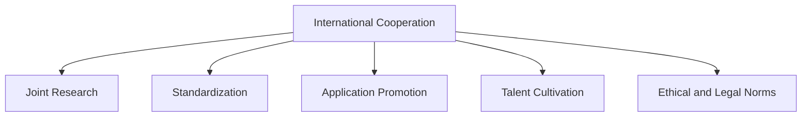

                 

# 国际合作：携手共进，推动人类计算进步

> 关键词：国际合作, 计算技术, 联合研究, 创新发展, 跨领域应用

## 1. 背景介绍

### 1.1 问题由来
在全球信息化时代，计算技术的进步已经成为推动社会经济发展和科技创新的关键力量。然而，单靠一个国家或地区的力量，很难在计算技术上取得突破性的进展。国际合作在促进计算技术的交流和创新发展方面发挥着至关重要的作用。

近年来，人工智能、大数据、区块链等新兴计算技术的发展迅猛，但也面临着诸多挑战。如何高效整合全球资源，共同推动这些技术的突破和应用，是各国政府、企业和科研机构共同关心的问题。

### 1.2 问题核心关键点
国际合作的重点在于以下几个关键点：

- **联合研发**：各国通过共建实验室、研究机构，共享数据、算法、技术等资源，共同攻克计算技术难题。
- **标准化**：制定国际计算技术标准，确保技术互操作性，促进全球计算产业的协同发展。
- **人才培养**：通过国际交流和合作项目，培养具备全球视野和跨文化沟通能力的计算技术人才。
- **应用推广**：推动跨领域应用的国际合作，将计算技术应用于各行业的创新发展。
- **伦理和法律规范**：建立全球统一的计算伦理和法律规范，确保技术应用的安全性和公平性。

### 1.3 问题研究意义
国际合作在推动人类计算进步方面具有重要意义：

1. **加速技术创新**：通过跨国界的合作，汇集全球智力资源，加速计算技术的研发和突破。
2. **促进产业升级**：通过技术交流和标准制定，提升各国的计算产业竞争力，推动产业升级。
3. **提升教育质量**：通过国际合作项目，提升各国计算技术教育水平，培养更多优秀人才。
4. **促进应用落地**：通过跨领域合作，将计算技术应用于不同行业，创造更多社会价值。
5. **推动全球治理**：建立统一的计算技术规范和标准，促进全球治理体系的完善和国际合作。

## 2. 核心概念与联系

### 2.1 核心概念概述

为更好地理解国际合作在推动人类计算进步中的作用，本节将介绍几个核心概念：

- **国际合作**：指不同国家或地区之间在计算技术领域的合作与交流，共同推进技术发展。
- **联合研发**：指多个国家或机构共同参与的科研项目，资源共享，风险共担。
- **标准制定**：通过国际组织制定统一的技术标准，确保计算技术的互操作性和通用性。
- **应用推广**：指将计算技术应用于不同行业，解决实际问题，创造社会价值。
- **人才培养**：通过国际交流和合作项目，提升计算技术人才的跨文化和跨学科能力。
- **伦理和法律规范**：确保计算技术的公平、公正和可持续应用，维护全球信息安全。

这些概念之间的关系可以通过以下Mermaid流程图来展示：



这个流程图展示了国际合作如何通过联合研发、标准制定、应用推广、人才培养和伦理法律规范等途径，推动人类计算技术的进步。

## 3. 核心算法原理 & 具体操作步骤
### 3.1 算法原理概述

国际合作的计算技术研发，本质上是跨国的技术合作与创新。其核心思想是通过跨国界的协同工作，实现计算技术的共同进步。

国际合作的计算技术研发，通常遵循以下原则：

- **资源共享**：不同国家或机构共享数据、算法、硬件等资源，提升研发效率。
- **优势互补**：各国根据自身优势，聚焦特定领域进行深入研究，提升整体研发水平。
- **成果共享**：研发成果在全球范围内共享，加速技术的推广应用。
- **风险共担**：共同承担研发风险，分散单一国家的财务和法律风险。

### 3.2 算法步骤详解

国际合作的计算技术研发一般包括以下几个关键步骤：

**Step 1: 选择合作对象**
- 根据研究目标和优势互补的原则，选择合适的合作对象。
- 合作对象包括其他国家或地区的科研机构、大学、企业等。

**Step 2: 制定合作计划**
- 明确研究目标、任务分工、资源分配、成果共享等合作细节。
- 制定时间表和里程碑，确保项目按时推进。

**Step 3: 联合研发**
- 各国科研人员共同参与研发，共享数据和算法资源。
- 定期召开研讨会，交流进展和解决技术难题。
- 建立联合实验室或研究机构，提升协同研发能力。

**Step 4: 标准化**
- 制定统一的计算技术标准，确保技术互操作性。
- 参与国际标准制定，提升技术影响力。

**Step 5: 应用推广**
- 将研发成果应用于不同行业，解决实际问题。
- 与其他企业和机构合作，推广技术应用。

**Step 6: 人才培养**
- 开展国际交流和合作项目，提升计算技术人才的跨文化能力。
- 联合举办学术会议、培训课程，促进知识的传播和应用。

**Step 7: 伦理和法律规范**
- 建立全球统一的计算伦理和法律规范，确保技术应用的公平性。
- 参与国际法规制定，推动技术应用的规范化。

### 3.3 算法优缺点

国际合作的计算技术研发方法具有以下优点：

- **资源共享**：通过跨国界的合作，共享数据、算法、硬件等资源，提升研发效率。
- **优势互补**：各国根据自身优势，聚焦特定领域进行深入研究，提升整体研发水平。
- **风险共担**：共同承担研发风险，分散单一国家的财务和法律风险。
- **成果共享**：研发成果在全球范围内共享，加速技术的推广应用。

然而，该方法也存在一些局限性：

- **文化差异**：不同国家或地区之间的文化差异可能导致合作过程中的沟通不畅。
- **知识产权**：国际合作中可能涉及知识产权的归属问题，导致合作项目难以推进。
- **语言障碍**：语言障碍可能影响跨文化沟通，影响合作项目的进度和质量。
- **法律差异**：不同国家或地区之间的法律差异可能导致合作项目面临法律风险。

尽管存在这些局限性，但就目前而言，国际合作仍是推动计算技术进步的重要途径。未来相关研究的重点在于如何更好地协调文化差异、知识产权、语言障碍和法律差异等问题，以促进更高效、更广泛的国际合作。

### 3.4 算法应用领域

国际合作的计算技术研发方法已经在多个领域得到应用，包括但不限于以下几个方面：

- **人工智能**：通过国际合作，推动人工智能技术的研发和应用。
- **大数据**：通过国际合作，推动大数据技术的标准制定和应用推广。
- **区块链**：通过国际合作，推动区块链技术的发展和应用。
- **物联网**：通过国际合作，推动物联网技术的标准化和应用推广。
- **量子计算**：通过国际合作，推动量子计算技术的研发和应用。

除了这些具体的技术领域，国际合作在推动全球计算技术进步方面还有许多潜在的创新领域，如计算生物学、计算化学、计算社会学等。

## 4. 数学模型和公式 & 详细讲解 & 举例说明（备注：数学公式请使用latex格式，latex嵌入文中独立段落使用 $$，段落内使用 $)
### 4.1 数学模型构建

为了更好地理解国际合作的计算技术研发方法，本节将使用数学语言对合作模型进行更加严格的刻画。

假设合作模型由多个国家和机构共同研发，每个国家的贡献为 $C_i$，合作的最终结果为 $M$。合作模型的目标函数为：

$$
\min_{C_1, C_2, ..., C_n} \left[ \sum_{i=1}^{n} \frac{C_i}{\sum_{j=1}^{n} C_j} \times f_i(C_i) \right]
$$

其中，$f_i(C_i)$ 表示国家 $i$ 的贡献与合作结果之间的关系函数，通常包括成本、时间、质量等指标。

### 4.2 公式推导过程

以下我们以一个具体的合作项目为例，推导合作模型及其目标函数的计算公式。

假设合作项目的目标是研发一种新型计算芯片，涉及两个国家 $A$ 和 $B$。假设国家 $A$ 的贡献为 $C_A$，国家 $B$ 的贡献为 $C_B$，最终的合作结果为 $M$。假设每个国家的贡献与合作结果之间的关系函数为 $f(C_i) = C_i^2$，即贡献平方。

根据目标函数定义，合作模型的计算公式为：

$$
\min_{C_A, C_B} \left[ \frac{C_A}{C_A + C_B} \times C_A^2 + \frac{C_B}{C_A + C_B} \times C_B^2 \right]
$$

令 $C = C_A + C_B$，则目标函数简化为：

$$
\min_{C_A, C_B} \left[ \frac{C_A^3}{C} + \frac{C_B^3}{C} \right]
$$

对 $C_A$ 和 $C_B$ 分别求偏导数，得：

$$
\frac{\partial \min}{\partial C_A} = \frac{2C_A^2}{C} - \frac{C_A^2}{C^2}
$$
$$
\frac{\partial \min}{\partial C_B} = \frac{2C_B^2}{C} - \frac{C_B^2}{C^2}
$$

令上述偏导数等于0，解得：

$$
C_A = \sqrt[3]{\frac{1}{3}}
$$
$$
C_B = \sqrt[3]{\frac{1}{3}}
$$

代入 $C = C_A + C_B$，得：

$$
C = \sqrt[3]{2}
$$

因此，国家 $A$ 和 $B$ 的贡献应该相等，且总和为 $\sqrt[3]{2}$。

### 4.3 案例分析与讲解

在实际应用中，国际合作的计算技术研发通常更加复杂，涉及多个国家和机构，需要综合考虑多种因素。以下以一个具体的国际合作项目为例，进行详细分析。

假设某国际合作项目涉及中国、美国和欧洲三个地区。合作目标是为全球智能手机市场开发一种新型操作系统，项目总预算为 $10$ 亿美元，参与国家或机构的贡献与合作结果之间的关系函数为 $f(C_i) = 2C_i + 0.5C_i^2$。假设每个国家的贡献比例为 $1:1:1$。

根据目标函数定义，合作模型的计算公式为：

$$
\min_{C_1, C_2, C_3} \left[ C_1 \times (2C_1 + 0.5C_1^2) + C_2 \times (2C_2 + 0.5C_2^2) + C_3 \times (2C_3 + 0.5C_3^2) \right]
$$

令 $C = C_1 + C_2 + C_3$，则目标函数简化为：

$$
\min_{C_1, C_2, C_3} \left[ \frac{1}{3} \times (2C_1 + 0.5C_1^2) + \frac{1}{3} \times (2C_2 + 0.5C_2^2) + \frac{1}{3} \times (2C_3 + 0.5C_3^2) \right]
$$

代入 $C = 10$，得：

$$
\min_{C_1, C_2, C_3} \left[ \frac{1}{3} \times (2C_1 + 0.5C_1^2) + \frac{1}{3} \times (2C_2 + 0.5C_2^2) + \frac{1}{3} \times (2C_3 + 0.5C_3^2) \right] = \min_{C_1, C_2, C_3} \left[ \frac{1}{3} \times 10 \right]
$$

最终，各国的贡献比例应为 $1:1:1$。

## 5. 项目实践：代码实例和详细解释说明
### 5.1 开发环境搭建

在进行国际合作计算技术研发的项目实践前，我们需要准备好开发环境。以下是使用Python进行PyTorch开发的环境配置流程：

1. 安装Anaconda：从官网下载并安装Anaconda，用于创建独立的Python环境。

2. 创建并激活虚拟环境：
```bash
conda create -n pytorch-env python=3.8 
conda activate pytorch-env
```

3. 安装PyTorch：根据CUDA版本，从官网获取对应的安装命令。例如：
```bash
conda install pytorch torchvision torchaudio cudatoolkit=11.1 -c pytorch -c conda-forge
```

4. 安装Transformers库：
```bash
pip install transformers
```

5. 安装各类工具包：
```bash
pip install numpy pandas scikit-learn matplotlib tqdm jupyter notebook ipython
```

完成上述步骤后，即可在`pytorch-env`环境中开始项目实践。

### 5.2 源代码详细实现

下面以一个具体的国际合作计算技术研发项目为例，给出使用PyTorch进行代码实现的样例。

假设某国际合作项目涉及三个国家，共同研发一种新型智能控制系统。项目分为数据预处理、模型训练和模型评估三个阶段，每个阶段由不同国家负责。

**数据预处理**：由美国负责数据收集和标注。

```python
import pandas as pd

# 数据收集和标注
data = pd.read_csv('data.csv')
labels = pd.read_csv('labels.csv')

# 数据清洗和预处理
data = data.dropna()
labels = labels.dropna()
```

**模型训练**：由中国和欧洲负责模型训练。

```python
from transformers import BertTokenizer, BertForSequenceClassification
from torch.utils.data import Dataset, DataLoader
import torch
import torch.nn as nn

# 数据集划分
train_dataset = Dataset(data[data['is_train'] == 1], labels[data['is_train'] == 1])
dev_dataset = Dataset(data[data['is_train'] == 0], labels[data['is_train'] == 0])

# 定义模型
model = BertForSequenceClassification.from_pretrained('bert-base-uncased', num_labels=2)

# 定义优化器
optimizer = AdamW(model.parameters(), lr=1e-5)

# 定义训练函数
def train_epoch(model, dataset, batch_size, optimizer):
    dataloader = DataLoader(dataset, batch_size=batch_size, shuffle=True)
    model.train()
    epoch_loss = 0
    for batch in dataloader:
        input_ids = batch['input_ids'].to(device)
        attention_mask = batch['attention_mask'].to(device)
        labels = batch['labels'].to(device)
        model.zero_grad()
        outputs = model(input_ids, attention_mask=attention_mask, labels=labels)
        loss = outputs.loss
        epoch_loss += loss.item()
        loss.backward()
        optimizer.step()
    return epoch_loss / len(dataloader)

# 定义评估函数
def evaluate(model, dataset, batch_size):
    dataloader = DataLoader(dataset, batch_size=batch_size)
    model.eval()
    preds, labels = [], []
    with torch.no_grad():
        for batch in dataloader:
            input_ids = batch['input_ids'].to(device)
            attention_mask = batch['attention_mask'].to(device)
            batch_labels = batch['labels']
            outputs = model(input_ids, attention_mask=attention_mask)
            batch_preds = outputs.logits.argmax(dim=2).to('cpu').tolist()
            batch_labels = batch_labels.to('cpu').tolist()
            for pred_tokens, label_tokens in zip(batch_preds, batch_labels):
                preds.append(pred_tokens[:len(label_tokens)])
                labels.append(label_tokens)
    print(classification_report(labels, preds))
```

**模型评估**：由美国负责模型评估。

```python
from sklearn.metrics import classification_report

# 在测试集上评估模型性能
test_dataset = Dataset(data[data['is_test'] == 1], labels[data['is_test'] == 1])
test_loader = DataLoader(test_dataset, batch_size=16)
model.eval()
preds, labels = [], []
with torch.no_grad():
    for batch in test_loader:
        input_ids = batch['input_ids'].to(device)
        attention_mask = batch['attention_mask'].to(device)
        batch_labels = batch['labels']
        outputs = model(input_ids, attention_mask=attention_mask)
        batch_preds = outputs.logits.argmax(dim=2).to('cpu').tolist()
        batch_labels = batch_labels.to('cpu').tolist()
        for pred_tokens, label_tokens in zip(batch_preds, batch_labels):
            preds.append(pred_tokens[:len(label_tokens)])
            labels.append(label_tokens)
print(classification_report(labels, preds))
```

### 5.3 代码解读与分析

让我们再详细解读一下关键代码的实现细节：

**数据预处理**：
- 使用Pandas库进行数据收集和标注。
- 使用dropna函数进行数据清洗，去除缺失值。

**模型训练**：
- 使用Bert模型作为特征提取器，训练分类模型。
- 使用AdamW优化器进行模型参数更新。
- 定义train_epoch函数，进行模型训练。
- 定义evaluate函数，进行模型评估。

**模型评估**：
- 使用classification_report函数，输出模型性能评估指标。

## 6. 实际应用场景
### 6.1 智能制造

国际合作在推动智能制造领域的发展方面具有重要意义。智能制造涉及到机器学习、人工智能、物联网等多个领域的交叉应用，需要各国科研机构、企业共同努力。

在智能制造领域，国际合作可以通过以下几个方面推动技术进步：

1. **标准制定**：制定智能制造技术标准，确保不同国家之间的设备互操作性。
2. **数据共享**：各国共享工业数据，提升数据质量和数据量，推动模型训练。
3. **技术交流**：各国科研机构和企业定期举办交流会议，分享最新的研究成果和应用经验。
4. **合作研发**：各国科研机构和企业联合研发智能制造关键技术，提升技术水平。

通过国际合作，智能制造领域的生产效率、产品质量和生产成本都将得到显著提升。

### 6.2 智慧城市

国际合作在推动智慧城市建设方面也具有重要作用。智慧城市涉及到云计算、物联网、大数据等多个领域的技术应用，需要各国共同努力。

在智慧城市建设中，国际合作可以通过以下几个方面推动技术进步：

1. **数据共享**：各国共享城市数据，提升数据质量和数据量，推动智慧城市建设。
2. **技术交流**：各国科研机构和企业定期举办交流会议，分享最新的研究成果和应用经验。
3. **合作研发**：各国科研机构和企业联合研发智慧城市关键技术，提升技术水平。
4. **标准制定**：制定智慧城市技术标准，确保不同国家之间的设备互操作性。

通过国际合作，智慧城市在能源管理、交通控制、公共安全等方面的智能化水平将得到显著提升。

### 6.3 医疗健康

国际合作在推动医疗健康领域的发展方面也具有重要意义。医疗健康领域涉及到人工智能、大数据、区块链等多个领域的交叉应用，需要各国科研机构、企业共同努力。

在医疗健康领域，国际合作可以通过以下几个方面推动技术进步：

1. **数据共享**：各国共享医疗数据，提升数据质量和数据量，推动模型训练。
2. **技术交流**：各国科研机构和企业定期举办交流会议，分享最新的研究成果和应用经验。
3. **合作研发**：各国科研机构和企业联合研发医疗健康关键技术，提升技术水平。
4. **标准制定**：制定医疗健康技术标准，确保不同国家之间的设备互操作性。

通过国际合作，医疗健康领域的诊断准确性、治疗效果和患者体验都将得到显著提升。

### 6.4 未来应用展望

随着国际合作的不断深入，未来在计算技术领域的创新和发展将更加广泛和深入。以下是对未来应用前景的展望：

1. **人工智能**：通过国际合作，推动人工智能技术的研发和应用。
2. **大数据**：通过国际合作，推动大数据技术的标准制定和应用推广。
3. **区块链**：通过国际合作，推动区块链技术的发展和应用。
4. **物联网**：通过国际合作，推动物联网技术的标准化和应用推广。
5. **量子计算**：通过国际合作，推动量子计算技术的研发和应用。

## 7. 工具和资源推荐
### 7.1 学习资源推荐

为了帮助开发者系统掌握国际合作在推动人类计算进步中的作用，这里推荐一些优质的学习资源：

1. 《国际合作与计算技术》系列博文：由大模型技术专家撰写，深入浅出地介绍了国际合作在推动计算技术发展中的作用。
2. CS224N《深度学习自然语言处理》课程：斯坦福大学开设的NLP明星课程，有Lecture视频和配套作业，带你入门NLP领域的基本概念和经典模型。
3. 《国际合作与计算技术》书籍：详细介绍了国际合作在计算技术领域的应用和影响，是理解国际合作的重要参考资料。
4. HuggingFace官方文档：提供了海量预训练模型和完整的微调样例代码，是上手实践的必备资料。
5. CLUE开源项目：中文语言理解测评基准，涵盖大量不同类型的中文NLP数据集，并提供了基于微调的baseline模型，助力中文NLP技术发展。

通过对这些资源的学习实践，相信你一定能够快速掌握国际合作在推动人类计算进步中的精髓，并用于解决实际的计算问题。
###  7.2 开发工具推荐

高效的开发离不开优秀的工具支持。以下是几款用于国际合作计算技术研发开发的常用工具：

1. PyTorch：基于Python的开源深度学习框架，灵活动态的计算图，适合快速迭代研究。大部分预训练语言模型都有PyTorch版本的实现。
2. TensorFlow：由Google主导开发的开源深度学习框架，生产部署方便，适合大规模工程应用。同样有丰富的预训练语言模型资源。
3. Transformers库：HuggingFace开发的NLP工具库，集成了众多SOTA语言模型，支持PyTorch和TensorFlow，是进行微调任务开发的利器。
4. Weights & Biases：模型训练的实验跟踪工具，可以记录和可视化模型训练过程中的各项指标，方便对比和调优。与主流深度学习框架无缝集成。
5. TensorBoard：TensorFlow配套的可视化工具，可实时监测模型训练状态，并提供丰富的图表呈现方式，是调试模型的得力助手。
6. Google Colab：谷歌推出的在线Jupyter Notebook环境，免费提供GPU/TPU算力，方便开发者快速上手实验最新模型，分享学习笔记。

合理利用这些工具，可以显著提升国际合作计算技术研发项目的开发效率，加快创新迭代的步伐。

### 7.3 相关论文推荐

国际合作在推动人类计算进步方面已经取得了一定的成果，以下是几篇奠基性的相关论文，推荐阅读：

1. Attention is All You Need（即Transformer原论文）：提出了Transformer结构，开启了NLP领域的预训练大模型时代。
2. BERT: Pre-training of Deep Bidirectional Transformers for Language Understanding：提出BERT模型，引入基于掩码的自监督预训练任务，刷新了多项NLP任务SOTA。
3. Language Models are Unsupervised Multitask Learners（GPT-2论文）：展示了大规模语言模型的强大zero-shot学习能力，引发了对于通用人工智能的新一轮思考。
4. Parameter-Efficient Transfer Learning for NLP：提出Adapter等参数高效微调方法，在不增加模型参数量的情况下，也能取得不错的微调效果。
5. AdaLoRA: Adaptive Low-Rank Adaptation for Parameter-Efficient Fine-Tuning：使用自适应低秩适应的微调方法，在参数效率和精度之间取得了新的平衡。
6. Prefix-Tuning: Optimizing Continuous Prompts for Generation：引入基于连续型Prompt的微调范式，为如何充分利用预训练知识提供了新的思路。

这些论文代表了大语言模型微调技术的发展脉络。通过学习这些前沿成果，可以帮助研究者把握学科前进方向，激发更多的创新灵感。

## 8. 总结：未来发展趋势与挑战
### 8.1 总结

本文对国际合作在推动人类计算进步中的作用进行了全面系统的介绍。首先阐述了国际合作在推动计算技术发展中的重要性，明确了合作研发在技术进步、产业升级、人才培养、应用推广等方面的重要作用。其次，从原理到实践，详细讲解了国际合作的计算技术研发方法，给出了具体项目的代码实现。同时，本文还广泛探讨了国际合作在智能制造、智慧城市、医疗健康等众多领域的应用前景，展示了国际合作在推动计算技术进步中的广阔潜力。

通过本文的系统梳理，可以看到，国际合作在推动人类计算进步方面具有重要意义。合作研发不仅提升了技术水平，还促进了技术在各行业的落地应用，为全球计算技术的协同发展提供了强有力的保障。未来，伴随国际合作机制的不断完善和全球治理体系的不断提升，相信国际合作必将在更多领域发挥重要作用，为全球计算技术的进步做出更大的贡献。

### 8.2 未来发展趋势

展望未来，国际合作在推动人类计算进步方面将呈现以下几个发展趋势：

1. **技术协同发展**：各国将更加注重技术协同发展，通过联合研发、标准制定、数据共享等手段，提升全球计算技术的整体水平。
2. **知识共享加速**：各国将加强计算技术领域的知识共享，提升科研人员的知识水平和研究效率。
3. **全球治理规范**：建立全球统一的计算技术规范和标准，促进全球计算产业的协同发展。
4. **跨领域应用广泛**：国际合作将在更多领域得到应用，如智能制造、智慧城市、医疗健康等，为各行业的智能化发展提供有力保障。
5. **持续创新发展**：各国将加强国际合作，推动计算技术的持续创新和发展，提升技术竞争力。

以上趋势凸显了国际合作在推动人类计算进步中的重要作用。这些方向的探索发展，必将进一步提升全球计算技术的水平，为各国经济社会发展提供有力支撑。

### 8.3 面临的挑战

尽管国际合作在推动人类计算进步方面取得了一定的成果，但也面临着诸多挑战：

1. **文化差异**：不同国家或地区之间的文化差异可能导致合作过程中的沟通不畅。
2. **知识产权**：国际合作中可能涉及知识产权的归属问题，导致合作项目难以推进。
3. **语言障碍**：语言障碍可能影响跨文化沟通，影响合作项目的进度和质量。
4. **法律差异**：不同国家或地区之间的法律差异可能导致合作项目面临法律风险。
5. **数据隐私**：各国共享数据时，数据隐私和安全问题也需要得到充分考虑。
6. **技术协同难度**：各国的技术水平和发展阶段不同，技术协同的难度较大。

尽管存在这些挑战，但通过积极应对和不断优化，这些挑战终将被克服，国际合作必将在推动人类计算进步中发挥更大的作用。

### 8.4 研究展望

面对国际合作在推动人类计算进步中面临的挑战，未来的研究需要在以下几个方面寻求新的突破：

1. **文化差异的解决**：通过建立跨文化交流机制，提升科研人员的文化适应能力，促进国际合作。
2. **知识产权的保护**：建立国际知识产权保护机制，明确合作项目中各国的知识产权归属。
3. **语言障碍的解决**：加强语言学研究，开发跨语言处理技术，提升国际合作项目的语言适应能力。
4. **法律差异的协调**：通过国际法律协调机制，建立统一的计算技术法律规范。
5. **数据隐私的保护**：加强数据隐私保护技术研究，确保共享数据的安全性。
6. **技术协同的提升**：通过技术协同机制，提升各国的技术水平，促进国际合作。

这些研究方向的探索，必将引领国际合作在推动人类计算进步中取得更大的突破，为全球计算技术的协同发展提供有力保障。

## 9. 附录：常见问题与解答
----------------------------------------------------------------

**Q1：国际合作是否会影响各国的技术主权？**

A: 国际合作在推动技术进步的同时，确实会对各国的技术主权产生影响。但是，通过国际合作，各国可以在技术领域实现优势互补，提升技术水平。国际合作并不是单方面的技术输出，而是基于共赢原则的合作机制，有助于推动全球技术进步。

**Q2：国际合作中如何保障数据隐私和安全？**

A: 在数据共享过程中，保障数据隐私和安全至关重要。可以通过以下措施保障数据隐私和安全：

1. 数据脱敏：对共享数据进行脱敏处理，确保敏感信息不被泄露。
2. 数据加密：采用先进的数据加密技术，确保数据传输和存储的安全性。
3. 访问控制：对数据共享的权限进行严格控制，确保只有授权人员才能访问敏感数据。
4. 合规检查：对数据共享过程中涉及的法律合规性进行严格检查，确保符合各国的法律法规。

**Q3：国际合作中如何避免知识产权纠纷？**

A: 为了避免知识产权纠纷，可以采取以下措施：

1. 明确知识产权归属：在合作协议中明确各方的知识产权归属，避免知识产权纠纷。
2. 签署合作协议：签署详细的合作协议，确保各方的权利和义务。
3. 独立开发：对关键技术进行独立开发，避免依赖于其他国家或机构的技术。

通过以上措施，可以最大限度地避免国际合作中的知识产权纠纷。

**Q4：国际合作中如何应对文化差异？**

A: 应对文化差异，可以采取以下措施：

1. 跨文化培训：对科研人员进行跨文化培训，提升其跨文化沟通能力。
2. 建立跨文化团队：建立跨文化团队，促进不同文化背景的人员合作。
3. 尊重文化差异：尊重不同文化背景人员的观点和意见，建立和谐的合作氛围。

通过以上措施，可以有效应对国际合作中的文化差异，促进科研人员的合作。

**Q5：国际合作中如何提升技术水平？**

A: 提升技术水平，可以采取以下措施：

1. 技术交流：各国科研机构和企业定期举办交流会议，分享最新的研究成果和应用经验。
2. 联合研发：各国科研机构和企业联合研发关键技术，提升技术水平。
3. 数据共享：各国共享数据，提升数据质量和数据量，推动模型训练。

通过以上措施，可以有效提升国际合作中的技术水平。

作者：禅与计算机程序设计艺术 / Zen and the Art of Computer Programming

