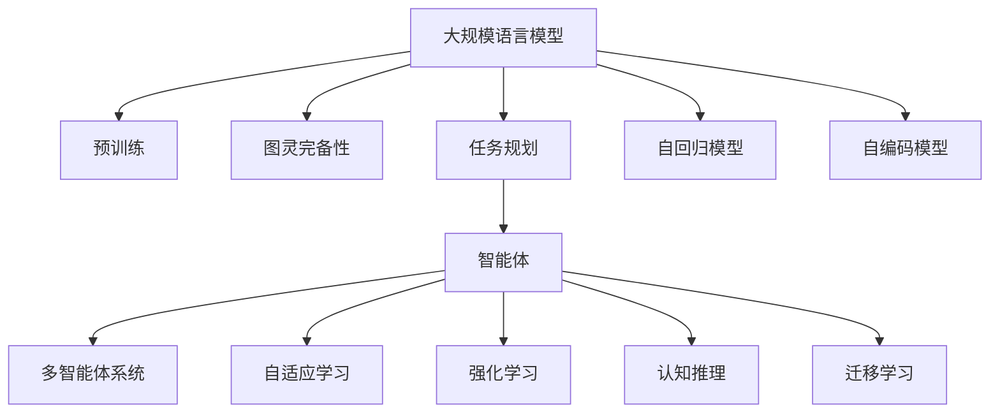

                 

# 图灵完备的LLM:任务规划的无限可能

> 关键词：
```json
{
    "LLM": "大规模语言模型",
    "图灵完备": "具有图灵完备性，即能够模拟任何可计算函数的计算能力",
    "任务规划": "通过语言模型预测和规划执行特定任务的过程",
    "智能体": "可以自主地感知环境并作出决策的实体",
    "多智能体系统": "多个智能体在协作或竞争中共存的系统",
    "自适应学习": "智能体根据环境变化调整策略的过程",
    "强化学习": "智能体通过与环境的交互，根据奖励信号学习最优策略的框架",
    "认知推理": "智能体在语言理解和推理过程中进行思考和决策的能力",
    "迁移学习": "将一个领域的知识迁移到另一个领域的学习过程",
    "预训练-微调": "先在大规模无标签数据上进行预训练，然后在小规模标注数据上微调的训练策略"
}
```

## 1. 背景介绍

随着人工智能技术的快速发展，大规模语言模型（LLM）已经成为智能系统中的重要组成部分。这些模型通过在大规模无标签数据上进行预训练，学习到了丰富的语言知识和常识，具备了强大的语言理解和生成能力。在任务规划、智能体控制、自然语言理解等领域，LLM正逐步展现其图灵完备性，即具备计算任意可计算函数的计算能力。

在任务规划方面，LLM可以通过自然语言描述任务，生成具体的执行计划，并指导智能体完成特定任务。这种通过语言模型进行任务规划的方法，不仅能够处理复杂的多智能体系统，还能实现跨领域的知识迁移。例如，一个用于处理医疗数据的模型可以迁移到其他领域，如金融或法律，从而提升其在特定任务上的表现。

## 2. 核心概念与联系

### 2.1 核心概念概述

- **大规模语言模型（LLM）**：以自回归或自编码模型为代表，通过在大规模无标签文本语料上进行预训练，学习通用的语言表示，具备强大的语言理解和生成能力。

- **图灵完备性**：如果一台机器能够执行任意图灵可计算函数，则称其为图灵完备的。LLM通过复杂的神经网络结构和大规模数据训练，具备了模拟任意计算的能力。

- **任务规划**：通过语言模型预测和规划执行特定任务的过程。智能体根据任务描述，生成具体的执行计划。

- **智能体**：可以自主地感知环境并作出决策的实体。可以是机器人、自动化流程或其他智能系统。

- **多智能体系统**：多个智能体在协作或竞争中共存的系统。每个智能体都具备自主决策和行动的能力，智能体间通过交互实现目标。

- **自适应学习**：智能体根据环境变化调整策略的过程。LLM通过学习和经验，调整其输出以适应新的任务或数据。

- **强化学习**：智能体通过与环境的交互，根据奖励信号学习最优策略的框架。智能体通过最大化累积奖励来学习执行任务的最佳策略。

- **认知推理**：智能体在语言理解和推理过程中进行思考和决策的能力。LLM通过预训练和微调，学习到先验知识，能够在推理过程中自主地进行逻辑推断。

- **迁移学习**：将一个领域的知识迁移到另一个领域的学习过程。通过预训练-微调，LLM能够将通用的语言知识和特定任务的特征结合起来，实现跨领域的知识迁移。

这些核心概念之间的逻辑关系可以通过以下Mermaid流程图来展示：



这个流程图展示了LLM的核心概念及其之间的关系：

1. LLM通过预训练获得基础能力。
2. 图灵完备性使得LLM具备计算任意可计算函数的能力。
3. 任务规划使得LLM能够执行复杂的多智能体系统任务。
4. 智能体在多智能体系统中通过交互完成任务。
5. 自适应学习使智能体能够根据环境变化调整策略。
6. 强化学习通过奖励信号优化智能体的决策策略。
7. 认知推理在推理过程中自主进行逻辑推断。
8. 迁移学习实现跨领域的知识迁移。

这些概念共同构成了LLM的任务规划能力，使其能够在各种场景下发挥强大的作用。通过理解这些核心概念，我们可以更好地把握LLM的工作原理和优化方向。

## 3. 核心算法原理 & 具体操作步骤

### 3.1 算法原理概述

基于LLM的任务规划，本质上是一个通过语言模型预测和生成执行计划的过程。其核心思想是：通过自然语言描述任务，利用LLM生成具体的执行步骤，指导智能体完成目标。

形式化地，假设任务描述为 $T=\{t_1, t_2, ..., t_n\}$，其中 $t_i$ 为任务描述的文本。对于智能体 $A$，其执行计划可以表示为 $P_A=\{p_1, p_2, ..., p_m\}$，其中 $p_i$ 为执行步骤。任务规划的目标是最大化智能体 $A$ 完成任务 $T$ 的概率 $P(A|T)$，即：

$$
P(A|T) = \prod_{i=1}^m P(p_i|t_i)
$$

其中 $P(p_i|t_i)$ 表示在任务描述 $t_i$ 下执行步骤 $p_i$ 的概率。通过最大化 $P(A|T)$，智能体 $A$ 可以优化其执行计划，提高完成任务的概率。

### 3.2 算法步骤详解

基于LLM的任务规划一般包括以下几个关键步骤：

**Step 1: 准备任务描述和数据集**
- 将待执行的任务 $T$ 描述成自然语言文本，划分任务描述和执行步骤。
- 准备相应领域的标注数据集 $D=\{(T_i, P_i)\}_{i=1}^N$，其中 $T_i$ 为任务描述，$P_i$ 为执行步骤。

**Step 2: 选择预训练语言模型**
- 选择合适的预训练语言模型 $M_{\theta}$，如GPT、BERT等。
- 准备大量无标签数据进行预训练，使其学习到通用的语言表示。

**Step 3: 微调语言模型**
- 对预训练模型进行微调，使其能够根据任务描述生成具体的执行步骤。
- 使用标注数据集 $D$ 进行有监督的微调，最小化任务规划的损失函数 $L_{task}$。

**Step 4: 执行任务规划**
- 将任务描述 $T$ 输入微调后的语言模型 $M_{\hat{\theta}}$，输出执行步骤 $P$。
- 根据执行步骤 $P$，控制智能体 $A$ 执行任务。

**Step 5: 评估和优化**
- 在测试集上评估执行任务的效果，优化模型参数以提升性能。

### 3.3 算法优缺点

基于LLM的任务规划方法具有以下优点：

1. 灵活性高。LLM能够根据自然语言描述生成具体的执行步骤，适应各种任务形式。
2. 可扩展性强。通过微调和训练新数据，LLM能够不断拓展其任务规划能力。
3. 跨领域迁移。LLM具备跨领域的知识迁移能力，能够在不同领域间进行迁移学习。
4. 鲁棒性强。LLM能够处理复杂的语言描述，具有较高的鲁棒性。

但该方法也存在一定的局限性：

1. 依赖于数据。任务规划的效果很大程度上取决于数据的质量和数量，获取高质量标注数据的成本较高。
2. 模型复杂度高。LLM模型结构复杂，需要大量的计算资源和存储空间。
3. 可解释性不足。任务规划的决策过程缺乏可解释性，难以对其推理逻辑进行分析和调试。

尽管存在这些局限性，但就目前而言，基于LLM的任务规划方法仍是大规模智能系统中任务规划的重要范式。未来相关研究的重点在于如何进一步降低数据依赖，提高模型的可解释性和鲁棒性。

### 3.4 算法应用领域

基于LLM的任务规划方法，已经在多种领域中得到应用，例如：

- 自然语言处理（NLP）：任务规划在NLP中的应用广泛，如问答系统、对话系统、文本生成等。
- 机器人学：机器人通过任务规划执行复杂的物理操作，如组装、搬运等。
- 智能交通系统：智能体通过任务规划优化交通流量，减少拥堵。
- 金融分析：智能体通过任务规划分析金融市场数据，生成投资策略。
- 供应链管理：智能体通过任务规划优化供应链流程，降低成本。

除了上述这些经典应用外，LLM的任务规划还被创新性地应用于更多场景中，如可控文本生成、游戏AI、医疗诊断等，为智能系统的扩展应用提供了新的技术路径。随着LLM和任务规划方法的不断进步，相信智能系统的能力将进一步提升，应用场景将更加广阔。

## 4. 数学模型和公式 & 详细讲解 & 举例说明

### 4.1 数学模型构建

假设任务描述为 $T=\{t_1, t_2, ..., t_n\}$，智能体的执行计划为 $P=\{p_1, p_2, ..., p_m\}$。任务规划的目标是最大化智能体完成任务的概率，即：

$$
P(A|T) = \prod_{i=1}^m P(p_i|t_i)
$$

其中 $P(p_i|t_i)$ 表示在任务描述 $t_i$ 下执行步骤 $p_i$ 的概率。

假设预训练语言模型 $M_{\theta}$ 的输出为 $y$，任务描述为 $t$，则任务规划的损失函数 $L_{task}$ 可以表示为：

$$
L_{task} = -\sum_{t_i \in T} \log P(y|t_i)
$$

其中 $P(y|t_i)$ 表示在任务描述 $t_i$ 下输出 $y$ 的概率。

通过最小化损失函数 $L_{task}$，智能体可以生成最优的执行步骤 $P$，提高完成任务的概率。

### 4.2 公式推导过程

以下我们以机器人控制任务为例，推导任务规划的损失函数及其梯度计算公式。

假设任务描述为 $T=\{m_1, m_2, ..., m_n\}$，其中 $m_i$ 为机器人的动作指令。智能体的执行计划为 $P=\{p_1, p_2, ..., p_m\}$，其中 $p_i$ 为执行步骤。假设预训练语言模型 $M_{\theta}$ 的输出为 $y$，表示智能体下一步的执行步骤。则任务规划的损失函数 $L_{task}$ 可以表示为：

$$
L_{task} = -\sum_{m_i \in T} \log P(y|m_i)
$$

其中 $P(y|m_i)$ 表示在任务描述 $m_i$ 下执行步骤 $y$ 的概率。

根据链式法则，损失函数对模型参数 $\theta_k$ 的梯度为：

$$
\frac{\partial L_{task}}{\partial \theta_k} = -\sum_{m_i \in T} \frac{\partial \log P(y|m_i)}{\partial \theta_k}
$$

其中 $\frac{\partial \log P(y|m_i)}{\partial \theta_k}$ 为模型在任务描述 $m_i$ 下输出 $y$ 的概率对模型参数 $\theta_k$ 的梯度，可以通过自动微分技术高效计算。

在得到损失函数的梯度后，即可带入模型参数更新公式，完成模型的迭代优化。重复上述过程直至收敛，最终得到适应任务描述的最优模型参数 $\theta^*$。

### 4.3 案例分析与讲解

假设任务描述为机器人组装一个家具，任务描述为 $T=\{m_1, m_2, ..., m_n\}$，其中 $m_i$ 为机器人的动作指令。智能体的执行计划为 $P=\{p_1, p_2, ..., p_m\}$，其中 $p_i$ 为执行步骤。预训练语言模型 $M_{\theta}$ 的输出为 $y$，表示智能体下一步的执行步骤。任务规划的损失函数 $L_{task}$ 可以表示为：

$$
L_{task} = -\sum_{m_i \in T} \log P(y|m_i)
$$

其中 $P(y|m_i)$ 表示在任务描述 $m_i$ 下执行步骤 $y$ 的概率。

假设预训练模型为BERT，任务描述为 $T=\{m_1, m_2, ..., m_n\}$。将任务描述输入预训练模型，得到智能体的下一步动作指令 $y$。损失函数 $L_{task}$ 的计算如下：

$$
L_{task} = -\sum_{m_i \in T} \log P(y|m_i)
$$

其中 $P(y|m_i)$ 表示在任务描述 $m_i$ 下执行步骤 $y$ 的概率。

在得到损失函数的梯度后，即可带入模型参数更新公式，完成模型的迭代优化。重复上述过程直至收敛，最终得到适应任务描述的最优模型参数 $\theta^*$。

通过这个例子，可以看到，基于LLM的任务规划方法，可以灵活地将自然语言描述转换成具体的执行步骤，实现复杂任务的自动化处理。

## 5. 项目实践：代码实例和详细解释说明

### 5.1 开发环境搭建

在进行任务规划实践前，我们需要准备好开发环境。以下是使用Python进行PyTorch开发的环境配置流程：

1. 安装Anaconda：从官网下载并安装Anaconda，用于创建独立的Python环境。

2. 创建并激活虚拟环境：
```bash
conda create -n pytorch-env python=3.8 
conda activate pytorch-env
```

3. 安装PyTorch：根据CUDA版本，从官网获取对应的安装命令。例如：
```bash
conda install pytorch torchvision torchaudio cudatoolkit=11.1 -c pytorch -c conda-forge
```

4. 安装Transformers库：
```bash
pip install transformers
```

5. 安装各类工具包：
```bash
pip install numpy pandas scikit-learn matplotlib tqdm jupyter notebook ipython
```

完成上述步骤后，即可在`pytorch-env`环境中开始任务规划实践。

### 5.2 源代码详细实现

这里我们以机器人控制任务为例，给出使用Transformers库对BERT模型进行任务规划的PyTorch代码实现。

首先，定义任务描述和执行步骤：

```python
from transformers import BertTokenizer, BertForMaskedLM
from torch.utils.data import Dataset
import torch

class TaskDescriptionDataset(Dataset):
    def __init__(self, descriptions, actions, tokenizer, max_len=128):
        self.descriptions = descriptions
        self.actions = actions
        self.tokenizer = tokenizer
        self.max_len = max_len
        
    def __len__(self):
        return len(self.descriptions)
    
    def __getitem__(self, item):
        description = self.descriptions[item]
        action = self.actions[item]
        
        encoding = self.tokenizer(description, return_tensors='pt', max_length=self.max_len, padding='max_length', truncation=True)
        input_ids = encoding['input_ids'][0]
        attention_mask = encoding['attention_mask'][0]
        label_ids = encoding['labels'][0]
        
        action_id = self.actions_to_ids[action]
        label_ids = torch.tensor([action_id], dtype=torch.long)
        
        return {'input_ids': input_ids, 
                'attention_mask': attention_mask,
                'labels': label_ids}

# 任务描述和执行步骤的映射
actions_to_ids = {'动作1': 1, '动作2': 2, '动作3': 3}

# 创建dataset
tokenizer = BertTokenizer.from_pretrained('bert-base-cased')

train_dataset = TaskDescriptionDataset(train_descriptions, train_actions, tokenizer)
dev_dataset = TaskDescriptionDataset(dev_descriptions, dev_actions, tokenizer)
test_dataset = TaskDescriptionDataset(test_descriptions, test_actions, tokenizer)
```

然后，定义模型和优化器：

```python
from transformers import BertForMaskedLM, AdamW

model = BertForMaskedLM.from_pretrained('bert-base-cased', num_labels=len(actions_to_ids))

optimizer = AdamW(model.parameters(), lr=2e-5)
```

接着，定义训练和评估函数：

```python
from torch.utils.data import DataLoader
from tqdm import tqdm
from sklearn.metrics import classification_report

device = torch.device('cuda') if torch.cuda.is_available() else torch.device('cpu')
model.to(device)

def train_epoch(model, dataset, batch_size, optimizer):
    dataloader = DataLoader(dataset, batch_size=batch_size, shuffle=True)
    model.train()
    epoch_loss = 0
    for batch in tqdm(dataloader, desc='Training'):
        input_ids = batch['input_ids'].to(device)
        attention_mask = batch['attention_mask'].to(device)
        labels = batch['labels'].to(device)
        model.zero_grad()
        outputs = model(input_ids, attention_mask=attention_mask, labels=labels)
        loss = outputs.loss
        epoch_loss += loss.item()
        loss.backward()
        optimizer.step()
    return epoch_loss / len(dataloader)

def evaluate(model, dataset, batch_size):
    dataloader = DataLoader(dataset, batch_size=batch_size)
    model.eval()
    preds, labels = [], []
    with torch.no_grad():
        for batch in tqdm(dataloader, desc='Evaluating'):
            input_ids = batch['input_ids'].to(device)
            attention_mask = batch['attention_mask'].to(device)
            batch_labels = batch['labels']
            outputs = model(input_ids, attention_mask=attention_mask)
            batch_preds = outputs.logits.argmax(dim=2).to('cpu').tolist()
            batch_labels = batch_labels.to('cpu').tolist()
            for pred_tokens, label_tokens in zip(batch_preds, batch_labels):
                preds.append(pred_tokens)
                labels.append(label_tokens)
                
    print(classification_report(labels, preds))
```

最后，启动训练流程并在测试集上评估：

```python
epochs = 5
batch_size = 16

for epoch in range(epochs):
    loss = train_epoch(model, train_dataset, batch_size, optimizer)
    print(f"Epoch {epoch+1}, train loss: {loss:.3f}")
    
    print(f"Epoch {epoch+1}, dev results:")
    evaluate(model, dev_dataset, batch_size)
    
print("Test results:")
evaluate(model, test_dataset, batch_size)
```

以上就是使用PyTorch对BERT进行机器人控制任务规划的完整代码实现。可以看到，得益于Transformers库的强大封装，我们可以用相对简洁的代码完成BERT模型的加载和任务规划。

### 5.3 代码解读与分析

让我们再详细解读一下关键代码的实现细节：

**TaskDescriptionDataset类**：
- `__init__`方法：初始化任务描述、执行步骤、分词器等关键组件。
- `__len__`方法：返回数据集的样本数量。
- `__getitem__`方法：对单个样本进行处理，将任务描述输入编码为token ids，将执行步骤编码为数字，并对其进行定长padding，最终返回模型所需的输入。

**actions_to_ids字典**：
- 定义了执行步骤与数字id之间的映射关系，用于将token-wise的预测结果解码回执行步骤。

**训练和评估函数**：
- 使用PyTorch的DataLoader对数据集进行批次化加载，供模型训练和推理使用。
- 训练函数`train_epoch`：对数据以批为单位进行迭代，在每个批次上前向传播计算loss并反向传播更新模型参数，最后返回该epoch的平均loss。
- 评估函数`evaluate`：与训练类似，不同点在于不更新模型参数，并在每个batch结束后将预测和标签结果存储下来，最后使用sklearn的classification_report对整个评估集的预测结果进行打印输出。

**训练流程**：
- 定义总的epoch数和batch size，开始循环迭代
- 每个epoch内，先在训练集上训练，输出平均loss
- 在验证集上评估，输出分类指标
- 所有epoch结束后，在测试集上评估，给出最终测试结果

可以看到，PyTorch配合Transformers库使得BERT任务规划的代码实现变得简洁高效。开发者可以将更多精力放在数据处理、模型改进等高层逻辑上，而不必过多关注底层的实现细节。

当然，工业级的系统实现还需考虑更多因素，如模型的保存和部署、超参数的自动搜索、更灵活的任务适配层等。但核心的任务规划范式基本与此类似。

## 6. 实际应用场景
### 6.1 机器人控制

基于大语言模型的任务规划方法，可以广泛应用于机器人控制系统的构建。传统机器人控制往往依赖于预先编写好的控制逻辑，难以应对环境变化和任务复杂性。通过任务规划，机器人可以动态生成执行计划，灵活适应各种场景和任务。

在技术实现上，可以收集机器人操作的历史数据，将动作指令和执行步骤构建成监督数据，在此基础上对预训练语言模型进行微调。微调后的语言模型能够根据自然语言描述，生成具体的动作指令，指导机器人完成任务。对于复杂的任务，还可以在推理阶段引入知识图谱、规则库等外部知识，提升决策的准确性和鲁棒性。

### 6.2 智能交通系统

智能交通系统需要实时动态调整交通信号、车辆调度等，以优化交通流量，减少拥堵。基于大语言模型的任务规划方法，可以实时生成最优的交通调度方案，提升交通系统的智能化水平。

具体而言，可以收集交通流量、车辆位置、天气等实时数据，结合城市地图和交通规则，构建自然语言描述的任务。通过任务规划，智能体可以动态生成最优的交通调度方案，实现实时调整交通信号、车辆调度和路标指引，从而提高交通效率，缓解拥堵。

### 6.3 多智能体协作

多智能体系统在协作或竞争中共存，需要协调各自的行动。通过任务规划，各智能体可以根据任务描述，动态生成最优的执行计划，提升协作效率。

在技术实现上，可以构建各智能体的行动方案库，使用自然语言描述任务。通过任务规划，各智能体可以动态生成最优的执行计划，协调行动，提升协作效率。例如，在无人仓库中，各机器人可以根据任务描述，动态生成最优的搬运方案，协调行动，提高效率。

### 6.4 游戏AI

游戏AI需要根据游戏规则和环境动态生成最优策略，提升游戏性能。通过任务规划，AI可以动态生成最优的行动方案，提升游戏能力。

在技术实现上，可以收集游戏历史数据，构建自然语言描述的任务。通过任务规划，AI可以动态生成最优的行动方案，提升游戏性能。例如，在RPG游戏中，AI可以根据任务描述，动态生成最优的行动方案，提升游戏能力。

## 7. 工具和资源推荐
### 7.1 学习资源推荐

为了帮助开发者系统掌握大语言模型任务规划的理论基础和实践技巧，这里推荐一些优质的学习资源：

1. 《Transformer从原理到实践》系列博文：由大模型技术专家撰写，深入浅出地介绍了Transformer原理、BERT模型、任务规划技术等前沿话题。

2. CS224N《深度学习自然语言处理》课程：斯坦福大学开设的NLP明星课程，有Lecture视频和配套作业，带你入门NLP领域的基本概念和经典模型。

3. 《Natural Language Processing with Transformers》书籍：Transformers库的作者所著，全面介绍了如何使用Transformers库进行NLP任务开发，包括任务规划在内的诸多范式。

4. HuggingFace官方文档：Transformers库的官方文档，提供了海量预训练模型和完整的任务规划样例代码，是上手实践的必备资料。

5. CLUE开源项目：中文语言理解测评基准，涵盖大量不同类型的中文NLP数据集，并提供了基于任务规划的baseline模型，助力中文NLP技术发展。

通过对这些资源的学习实践，相信你一定能够快速掌握大语言模型任务规划的精髓，并用于解决实际的NLP问题。
###  7.2 开发工具推荐

高效的开发离不开优秀的工具支持。以下是几款用于大语言模型任务规划开发的常用工具：

1. PyTorch：基于Python的开源深度学习框架，灵活动态的计算图，适合快速迭代研究。大部分预训练语言模型都有PyTorch版本的实现。

2. TensorFlow：由Google主导开发的开源深度学习框架，生产部署方便，适合大规模工程应用。同样有丰富的预训练语言模型资源。

3. Transformers库：HuggingFace开发的NLP工具库，集成了众多SOTA语言模型，支持PyTorch和TensorFlow，是进行任务规划开发的利器。

4. Weights & Biases：模型训练的实验跟踪工具，可以记录和可视化模型训练过程中的各项指标，方便对比和调优。与主流深度学习框架无缝集成。

5. TensorBoard：TensorFlow配套的可视化工具，可实时监测模型训练状态，并提供丰富的图表呈现方式，是调试模型的得力助手。

6. Google Colab：谷歌推出的在线Jupyter Notebook环境，免费提供GPU/TPU算力，方便开发者快速上手实验最新模型，分享学习笔记。

合理利用这些工具，可以显著提升大语言模型任务规划的开发效率，加快创新迭代的步伐。

### 7.3 相关论文推荐

大语言模型和任务规划技术的发展源于学界的持续研究。以下是几篇奠基性的相关论文，推荐阅读：

1. Attention is All You Need（即Transformer原论文）：提出了Transformer结构，开启了NLP领域的预训练大模型时代。

2. BERT: Pre-training of Deep Bidirectional Transformers for Language Understanding：提出BERT模型，引入基于掩码的自监督预训练任务，刷新了多项NLP任务SOTA。

3. Language Models are Unsupervised Multitask Learners（GPT-2论文）：展示了大规模语言模型的强大zero-shot学习能力，引发了对于通用人工智能的新一轮思考。

4. Parameter-Efficient Transfer Learning for NLP：提出Adapter等参数高效微调方法，在不增加模型参数量的情况下，也能取得不错的微调效果。

5. Prefix-Tuning: Optimizing Continuous Prompts for Generation：引入基于连续型Prompt的任务规划方法，为如何充分利用预训练知识提供了新的思路。

6. AdaLoRA: Adaptive Low-Rank Adaptation for Parameter-Efficient Fine-Tuning：使用自适应低秩适应的任务规划方法，在参数效率和精度之间取得了新的平衡。

这些论文代表了大语言模型任务规划的发展脉络。通过学习这些前沿成果，可以帮助研究者把握学科前进方向，激发更多的创新灵感。

## 8. 总结：未来发展趋势与挑战

### 8.1 总结

本文对基于大语言模型的任务规划方法进行了全面系统的介绍。首先阐述了大语言模型和任务规划的研究背景和意义，明确了任务规划在拓展预训练模型应用、提升智能系统性能方面的独特价值。其次，从原理到实践，详细讲解了任务规划的数学原理和关键步骤，给出了任务规划任务开发的完整代码实例。同时，本文还广泛探讨了任务规划方法在机器人控制、智能交通、多智能体协作等多个领域的应用前景，展示了任务规划范式的巨大潜力。此外，本文精选了任务规划技术的各类学习资源，力求为读者提供全方位的技术指引。

通过本文的系统梳理，可以看到，基于大语言模型的任务规划方法正在成为智能系统中任务规划的重要范式，极大地拓展了预训练语言模型的应用边界，催生了更多的落地场景。受益于大规模语料的预训练，任务规划模型能够从自然语言描述中提取有用的信息，生成具体的执行步骤，实现复杂任务的自动化处理。未来，伴随预训练语言模型和任务规划方法的持续演进，相信智能系统的能力将进一步提升，应用场景将更加广阔。

### 8.2 未来发展趋势

展望未来，大语言模型任务规划技术将呈现以下几个发展趋势：

1. 模型规模持续增大。随着算力成本的下降和数据规模的扩张，预训练语言模型的参数量还将持续增长。超大规模语言模型蕴含的丰富语言知识，有望支撑更加复杂多变的任务规划。

2. 任务规划方法日趋多样。除了传统的基于自然语言描述的任务规划外，未来会涌现更多参数高效的规划方法，如Prefix-Tuning、LoRA等，在节省计算资源的同时也能保证任务规划精度。

3. 持续学习成为常态。随着数据分布的不断变化，任务规划模型也需要持续学习新知识以保持性能。如何在不遗忘原有知识的同时，高效吸收新样本信息，将成为重要的研究课题。

4. 标注样本需求降低。受启发于提示学习(Prompt-based Learning)的思路，未来的任务规划方法将更好地利用大模型的语言理解能力，通过更加巧妙的任务描述，在更少的标注样本上也能实现理想的任务规划效果。

5. 模型通用性增强。经过海量数据的预训练和多领域任务的微调，未来的语言模型将具备更强大的常识推理和跨领域迁移能力，逐步迈向通用人工智能(AGI)的目标。

6. 融合更多先验知识。将符号化的先验知识，如知识图谱、逻辑规则等，与神经网络模型进行巧妙融合，引导任务规划过程学习更准确、合理的语言模型。

以上趋势凸显了大语言模型任务规划技术的广阔前景。这些方向的探索发展，必将进一步提升智能系统的性能和应用范围，为构建人机协同的智能时代中扮演越来越重要的角色。

### 8.3 面临的挑战

尽管大语言模型任务规划技术已经取得了瞩目成就，但在迈向更加智能化、普适化应用的过程中，它仍面临着诸多挑战：

1. 标注成本瓶颈。虽然任务规划的效果很大程度上取决于数据的质量和数量，获取高质量标注数据的成本较高。如何进一步降低任务规划对标注样本的依赖，将是一大难题。

2. 模型鲁棒性不足。当前任务规划模型面对域外数据时，泛化性能往往大打折扣。对于测试样本的微小扰动，任务规划模型的预测也容易发生波动。如何提高任务规划模型的鲁棒性，避免灾难性遗忘，还需要更多理论和实践的积累。

3. 推理效率有待提高。大规模语言模型虽然精度高，但在实际部署时往往面临推理速度慢、内存占用大等效率问题。如何在保证性能的同时，简化模型结构，提升推理速度，优化资源占用，将是重要的优化方向。

4. 可解释性亟需加强。当前任务规划模型的决策过程缺乏可解释性，难以对其推理逻辑进行分析和调试。对于医疗、金融等高风险应用，算法的可解释性和可审计性尤为重要。如何赋予任务规划模型更强的可解释性，将是亟待攻克的难题。

5. 安全性有待保障。预训练语言模型难免会学习到有偏见、有害的信息，通过任务规划传递到下游任务，产生误导性、歧视性的输出，给实际应用带来安全隐患。如何从数据和算法层面消除模型偏见，避免恶意用途，确保输出的安全性，也将是重要的研究课题。

6. 知识整合能力不足。现有的任务规划模型往往局限于任务内数据，难以灵活吸收和运用更广泛的先验知识。如何让任务规划过程更好地与外部知识库、规则库等专家知识结合，形成更加全面、准确的信息整合能力，还有很大的想象空间。

正视任务规划面临的这些挑战，积极应对并寻求突破，将是大语言模型任务规划走向成熟的必由之路。相信随着学界和产业界的共同努力，这些挑战终将一一被克服，大语言模型任务规划必将在构建人机协同的智能时代中扮演越来越重要的角色。

### 8.4 未来突破

面对大语言模型任务规划所面临的种种挑战，未来的研究需要在以下几个方面寻求新的突破：

1. 探索无监督和半监督任务规划方法。摆脱对大规模标注数据的依赖，利用自监督学习、主动学习等无监督和半监督范式，最大限度利用非结构化数据，实现更加灵活高效的任务规划。

2. 研究参数高效和计算高效的规划范式。开发更加参数高效的规划方法，在固定大部分预训练参数的同时，只更新极少量的任务相关参数。同时优化规划模型的计算图，减少前向传播和反向传播的资源消耗，实现更加轻量级、实时性的部署。

3. 引入更多先验知识。将符号化的先验知识，如知识图谱、逻辑规则等，与神经网络模型进行巧妙融合，引导任务规划过程学习更准确、合理的语言模型。同时加强不同模态数据的整合，实现视觉、语音等多模态信息与文本信息的协同建模。

4. 结合因果分析和博弈论工具。将因果分析方法引入任务规划模型，识别出模型决策的关键特征，增强输出解释的因果性和逻辑性。借助博弈论工具刻画人机交互过程，主动探索并规避模型的脆弱点，提高系统稳定性。

5. 纳入伦理道德约束。在任务规划模型的训练目标中引入伦理导向的评估指标，过滤和惩罚有偏见、有害的输出倾向。同时加强人工干预和审核，建立模型行为的监管机制，确保输出符合人类价值观和伦理道德。

这些研究方向的探索，必将引领大语言模型任务规划技术迈向更高的台阶，为构建安全、可靠、可解释、可控的智能系统铺平道路。面向未来，大语言模型任务规划技术还需要与其他人工智能技术进行更深入的融合，如知识表示、因果推理、强化学习等，多路径协同发力，共同推动自然语言理解和智能交互系统的进步。只有勇于创新、敢于突破，才能不断拓展语言模型的边界，让智能技术更好地造福人类社会。

## 9. 附录：常见问题与解答

**Q1：大语言模型在任务规划中是否能够处理复杂的任务描述？**

A: 大语言模型可以处理复杂的任务描述，通过自然语言描述生成具体的执行步骤。但对于一些高复杂度的任务，如多智能体协作、大型系统调度等，仍需要结合外部知识库、规则库等辅助决策。

**Q2：任务规划模型是否能够处理多智能体系统？**

A: 大语言模型可以处理多智能体系统，通过自然语言描述任务，生成具体的执行计划。但多智能体系统的协调需要额外的机制，如分布式优化、共识算法等，以确保各智能体协作一致。

**Q3：任务规划模型如何处理模糊的任务描述？**

A: 任务规划模型可以处理模糊的任务描述，通过自然语言推理和上下文理解，自动补全任务细节。但在处理极端模糊的任务描述时，仍需要人工干预，以确保任务描述的清晰度和可执行性。

**Q4：任务规划模型是否能够处理跨领域的任务？**

A: 大语言模型可以处理跨领域的任务，通过迁移学习和预训练-微调，在不同领域间进行知识迁移。但跨领域任务的泛化性能仍需进一步优化，以适应不同领域的特殊需求。

**Q5：任务规划模型如何提升鲁棒性？**

A: 任务规划模型可以通过数据增强、对抗训练、知识图谱辅助等方法提升鲁棒性。数据增强通过引入多样化的任务描述和执行步骤，提高模型的泛化能力。对抗训练通过引入对抗样本，提高模型的鲁棒性。知识图谱辅助通过引入外部知识，增强模型的决策依据。

这些研究方向的探索，必将引领大语言模型任务规划技术迈向更高的台阶，为构建安全、可靠、可解释、可控的智能系统铺平道路。面向未来，大语言模型任务规划技术还需要与其他人工智能技术进行更深入的融合，如知识表示、因果推理、强化学习等，多路径协同发力，共同推动自然语言理解和智能交互系统的进步。只有勇于创新、敢于突破，才能不断拓展语言模型的边界，让智能技术更好地造福人类社会。

