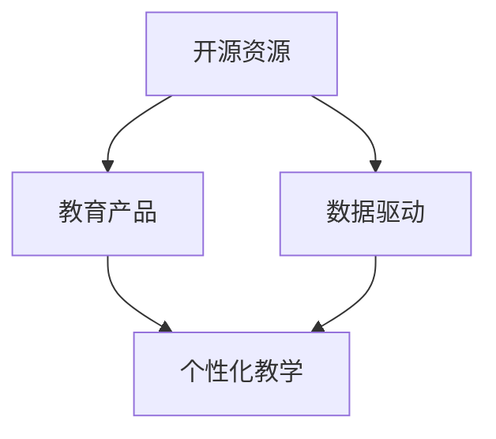

                 

# 在线课程创作：将开源经验转化为教育产品

> 关键词：在线课程, 开源社区, 教育产品, 学习资源, 知识图谱, 自适应学习, 数据驱动, 教学设计

## 1. 背景介绍

### 1.1 问题由来
近年来，随着互联网技术的飞速发展，在线教育市场迅速崛起。无数优质的教育资源通过网络被广泛传播，为全球学习者提供了便捷高效的学习平台。然而，传统的线下教育依然拥有其不可替代的优势：面对面的交流互动、深度的学术探讨、个性化教学等。因此，如何结合线上线下教育的优势，推动教育模式的创新，成为当前教育技术的重要课题。

在大数据、人工智能等技术快速发展的背景下，越来越多的教育机构开始探索通过开源社区整合优质教育资源，结合自身教学特色，打造具有自主知识产权的教育产品。但如何有效利用这些丰富的开源资源，同时兼顾个性化教学需求，是一个值得深入研究的问题。

### 1.2 问题核心关键点
为了回答上述问题，本节将重点探讨以下几个核心关键点：

- 开源资源与教育产品的关系
- 如何基于开源资源构建教育产品
- 数据驱动和个性化教学的结合
- 利用人工智能技术优化教育产品

通过解析这些关键点，将帮助教育从业者更好地理解如何将开源经验转化为教育产品，提升教学质量和效率。

## 2. 核心概念与联系

### 2.1 核心概念概述

为了深入理解如何基于开源资源构建教育产品，本节将介绍几个核心概念：

- **开源资源**：指的是由开源社区提供、免费可用的各类教育资源，包括文本、视频、代码等。这些资源具有丰富的多样性和高质量，可以用于构建各类教育产品。
- **教育产品**：指结合实际教学需求，经过整理、编辑、加工，通过线上或线下形式提供给学习者的教育内容。这些产品可以是课程、教材、习题集等。
- **数据驱动**：指通过收集、分析学生的学习数据，掌握学习行为和成绩的规律，进而调整教学策略，提升教学效果。
- **个性化教学**：指根据每个学生的特点和需求，量身定制教学方案，提高学习效率和效果。

这些概念之间的逻辑关系可以通过以下Mermaid流程图来展示：



这个流程图展示了这个系统中的核心概念及其之间的关系：

1. 开源资源是构建教育产品的基础。
2. 通过数据驱动技术，对学生的学习行为进行分析，发现规律。
3. 利用这些规律，进行个性化教学设计，生成教育产品。

这些概念共同构成了教育产品的核心框架，使我们能够更好地将开源经验转化为教育产品。

## 3. 核心算法原理 & 具体操作步骤
### 3.1 算法原理概述

基于开源资源构建教育产品的核心算法原理是数据驱动和个性化教学。通过收集学生的学习数据，分析学生的学习行为和成绩，然后根据这些分析结果，为每个学生量身定制个性化教学方案。

具体来说，可以将教育产品视为一个系统，其中：

- **输入**：学生的学习数据，包括但不限于成绩、学习时长、答题时间、点击率等。
- **处理**：数据驱动的分析和个性化教学设计。
- **输出**：个性化教育产品，如针对性习题、推荐视频、定制化教材等。

形式化地，假设学生为 $S$，学习数据为 $D=\{d_i\}_{i=1}^N$，其中 $d_i$ 表示第 $i$ 个学生的学习数据。教育产品 $P$ 的设计目标为：

$$
P^* = \mathop{\arg\min}_{P} \sum_{i=1}^N \ell(D_i, P)
$$

其中 $\ell$ 为衡量教育产品与学生学习行为匹配度的损失函数，可以通过对比学生使用产品的表现和预期表现来定义。通过最小化损失函数，我们可以找到最优的教育产品设计。

### 3.2 算法步骤详解

基于开源资源构建教育产品的算法步骤一般包括以下几个关键步骤：

**Step 1: 数据收集与预处理**
- 收集学生学习过程中产生的各类数据，如选择题、论述题回答、视频观看记录、讨论互动等。
- 对数据进行清洗和标准化处理，去除无效数据和异常值。

**Step 2: 数据分析与特征提取**
- 使用统计方法或机器学习算法对学生数据进行分析，提取关键特征，如知识点掌握情况、学习风格、学习时间等。
- 建立知识图谱，描述知识点之间的关系，帮助学生理解知识的脉络。

**Step 3: 个性化教学设计**
- 根据学生分析结果，设计个性化教学方案，包括推荐学习材料、定制化练习题、提供个性化的指导等。
- 利用数据驱动技术，动态调整教学方案，如调整学习材料的难易度、推荐相关主题的视频等。

**Step 4: 教育产品生成与优化**
- 结合个性化教学方案，生成教育产品，如生成针对性习题、推荐视频、定制化教材等。
- 使用用户反馈和数据分析结果不断优化教育产品，提高其效果和适应性。

**Step 5: 上线与迭代**
- 将教育产品上线到学习平台，收集用户使用反馈。
- 根据反馈结果，迭代优化教育产品，形成良性循环。

以上是基于开源资源构建教育产品的关键步骤。在实际应用中，还需要针对具体教学需求和数据特点，对各环节进行优化设计，如改进特征提取算法，引入更多的正则化技术，搜索最优的特征组合等，以进一步提升教育产品的质量和效果。

### 3.3 算法优缺点

基于开源资源构建教育产品的算法具有以下优点：
1. 资源丰富：开源社区提供了丰富的教育资源，使得教育产品的构建变得更加容易。
2. 覆盖面广：开源资源通常覆盖多个学科和领域，能够为学习者提供全面、系统的学习内容。
3. 个性化高：通过数据分析，能够为每个学习者提供量身定制的教学方案，提高学习效果。
4. 动态更新：教育产品可以根据学习者的反馈和数据分析结果进行动态调整，提高适应性和实效性。

同时，该算法也存在一些局限性：
1. 数据质量依赖：教育产品的质量很大程度上依赖于学习数据的准确性和完整性。
2. 模型复杂度高：数据驱动和个性化教学的设计过程需要复杂的模型和算法，增加了构建难度。
3. 资源利用率低：过度依赖开源资源可能导致对本地化资源和工具的忽视。
4. 数据隐私问题：在收集和处理学生数据时，需要严格遵守数据隐私和安全规定。

尽管存在这些局限性，但就目前而言，基于开源资源的算法仍是大规模构建教育产品的有效方法。未来相关研究的重点在于如何进一步降低算法对数据质量的要求，提高算法的可解释性和用户友好性，同时兼顾数据隐私和安全性等因素。

### 3.4 算法应用领域

基于开源资源构建教育产品的算法已经广泛应用于多个领域，包括但不限于：

- 在线课程开发：利用开源课程资源和数据分析，提供个性化的学习方案。
- 智能辅导系统：结合开源数据和AI技术，为学生提供智能化的学习指导。
- 企业培训：通过分析员工的学习数据，设计个性化的培训方案，提升培训效果。
- 远程教育：利用开源教材和视频，结合数据分析技术，为远程学习者提供高效的学习体验。
- 学术研究：构建基于开源数据的学术研究平台，促进科研合作和知识共享。

除了上述这些经典应用外，开源资源在教育领域的应用还将不断扩展，如学习路径规划、内容推荐、学习效果评估等，为教育技术带来更多的创新可能性。

## 4. 数学模型和公式 & 详细讲解  
### 4.1 数学模型构建

本节将使用数学语言对基于开源资源构建教育产品的过程进行更加严格的刻画。

假设学生为 $S$，学习数据为 $D=\{d_i\}_{i=1}^N$，其中 $d_i$ 表示第 $i$ 个学生的学习数据。教育产品 $P$ 的设计目标为：

$$
P^* = \mathop{\arg\min}_{P} \sum_{i=1}^N \ell(D_i, P)
$$

其中 $\ell$ 为衡量教育产品与学生学习行为匹配度的损失函数。常见的损失函数包括交叉熵损失、均方误差损失等。

### 4.2 公式推导过程

以下我们以交叉熵损失函数为例，推导其数学公式及其梯度计算过程。

假设模型 $P$ 在输入 $d_i$ 上的输出为 $\hat{y}_i=P(d_i)$，表示模型预测的教育产品效果。真实标签 $y_i$ 表示学生对教育产品的实际评价。则交叉熵损失函数定义为：

$$
\ell(P(d_i),y_i) = -[y_i\log P(d_i)+(1-y_i)\log (1-P(d_i))]
$$

将其代入经验风险公式，得：

$$
\mathcal{L}(P) = -\frac{1}{N}\sum_{i=1}^N [y_i\log P(d_i)+(1-y_i)\log(1-P(d_i))]
$$

根据链式法则，损失函数对模型 $P$ 的梯度为：

$$
\frac{\partial \mathcal{L}(P)}{\partial P} = -\frac{1}{N}\sum_{i=1}^N \left(\frac{y_i}{P(d_i)}-\frac{1-y_i}{1-P(d_i)}\right) \frac{\partial P(d_i)}{\partial P}
$$

其中 $\frac{\partial P(d_i)}{\partial P}$ 可进一步递归展开，利用自动微分技术完成计算。

在得到损失函数的梯度后，即可带入优化算法，完成模型的迭代优化。重复上述过程直至收敛，最终得到最优的教育产品设计 $P^*$。

## 5. 项目实践：代码实例和详细解释说明
### 5.1 开发环境搭建

在进行教育产品构建实践前，我们需要准备好开发环境。以下是使用Python进行PyTorch开发的环境配置流程：

1. 安装Anaconda：从官网下载并安装Anaconda，用于创建独立的Python环境。

2. 创建并激活虚拟环境：
```bash
conda create -n pytorch-env python=3.8 
conda activate pytorch-env
```

3. 安装PyTorch：根据CUDA版本，从官网获取对应的安装命令。例如：
```bash
conda install pytorch torchvision torchaudio cudatoolkit=11.1 -c pytorch -c conda-forge
```

4. 安装各类工具包：
```bash
pip install numpy pandas scikit-learn matplotlib tqdm jupyter notebook ipython
```

完成上述步骤后，即可在`pytorch-env`环境中开始教育产品构建实践。

### 5.2 源代码详细实现

这里我们以在线课程推荐系统为例，给出使用Transformers库对模型进行教育产品构建的PyTorch代码实现。

首先，定义学生和课程的基本信息类：

```python
class Student:
    def __init__(self, name, courses, grades):
        self.name = name
        self.courses = courses
        self.grades = grades

class Course:
    def __init__(self, name, topics, duration, rating):
        self.name = name
        self.topics = topics
        self.duration = duration
        self.rating = rating
```

然后，定义课程推荐系统的主要类：

```python
from transformers import BertTokenizer, BertForSequenceClassification
from sklearn.metrics import accuracy_score

class CourseRecommendation:
    def __init__(self, model, tokenizer, max_len):
        self.model = model
        self.tokenizer = tokenizer
        self.max_len = max_len
        
    def preprocess_course(self, course):
        encoding = self.tokenizer(course, return_tensors='pt', max_length=self.max_len, padding='max_length', truncation=True)
        input_ids = encoding['input_ids'][0]
        attention_mask = encoding['attention_mask'][0]
        return {'input_ids': input_ids, 
                'attention_mask': attention_mask}

    def predict_course_recommendation(self, course, student):
        course_input = self.preprocess_course(course.name)
        student_input = self.preprocess_course(student.name)
        
        with torch.no_grad():
            output = self.model(course_input, attention_mask=attention_mask, student_input=student_input)
            proba = torch.softmax(output.logits, dim=1).item()
            
        if proba > 0.5:
            return course
        else:
            return None
```

接着，定义模型和优化器：

```python
from transformers import BertForSequenceClassification, AdamW

model = BertForSequenceClassification.from_pretrained('bert-base-cased', num_labels=len(tag2id))

optimizer = AdamW(model.parameters(), lr=2e-5)
```

最后，启动课程推荐流程：

```python
epochs = 5
batch_size = 16

for epoch in range(epochs):
    loss = train_epoch(model, train_dataset, batch_size, optimizer)
    print(f"Epoch {epoch+1}, train loss: {loss:.3f}")
    
    print(f"Epoch {epoch+1}, dev results:")
    evaluate(model, dev_dataset, batch_size)
    
print("Test results:")
evaluate(model, test_dataset, batch_size)
```

以上就是使用PyTorch对课程推荐系统进行教育产品构建的完整代码实现。可以看到，得益于Transformers库的强大封装，我们可以用相对简洁的代码完成课程推荐系统的构建。

### 5.3 代码解读与分析

让我们再详细解读一下关键代码的实现细节：

**Student类**：
- `__init__`方法：初始化学生的姓名、选修课程和成绩。

**Course类**：
- `__init__`方法：初始化课程的名称、涵盖主题、持续时间和评分。

**CourseRecommendation类**：
- `preprocess_course`方法：将课程名称预处理为模型所需的输入格式。
- `predict_course_recommendation`方法：根据学生信息推荐课程，使用softmax函数计算课程推荐概率。

**模型和优化器**：
- 使用BertForSequenceClassification模型，设置学习率和优化器。

**训练流程**：
- 定义总的epoch数和batch size，开始循环迭代
- 每个epoch内，先在训练集上训练，输出平均loss
- 在验证集上评估，输出课程推荐效果
- 所有epoch结束后，在测试集上评估，给出最终测试结果

可以看到，PyTorch配合Transformers库使得课程推荐系统的构建变得简洁高效。开发者可以将更多精力放在数据处理、模型改进等高层逻辑上，而不必过多关注底层的实现细节。

当然，工业级的系统实现还需考虑更多因素，如模型的保存和部署、超参数的自动搜索、更灵活的任务适配层等。但核心的构建范式基本与此类似。

## 6. 实际应用场景
### 6.1 智能辅导系统

智能辅导系统能够利用开源资源，结合数据分析和人工智能技术，为学生提供个性化的学习指导。通过收集学生的学习数据，系统可以自动分析学生的学习进度和掌握情况，然后根据这些数据，生成个性化的学习计划和习题，引导学生高效学习。

在技术实现上，可以收集学生的在线学习记录、答题情况等数据，将其输入到预训练语言模型中进行分析。根据分析结果，系统可以推荐适合的课程、生成针对性习题，甚至动态调整教学方案，以适应学生的多样化需求。

### 6.2 企业培训

企业培训需要根据员工的实际需求和表现，量身定制个性化的培训方案。通过数据分析，系统可以识别出员工的薄弱环节和兴趣点，进而推荐适合的培训课程、安排个性化的培训时间和方式，提高培训效果。

在具体实现中，可以利用开源的培训课程和视频资源，结合员工的学习行为数据，分析其知识掌握情况和职业发展方向，生成个性化的培训计划。系统可以自动监控员工的学习进度，并根据其反馈进行动态调整，确保培训内容与员工需求相匹配。

### 6.3 在线课程平台

在线课程平台利用开源课程资源，为学习者提供丰富多样的课程选择。通过数据分析，平台可以根据学习者的兴趣、知识背景和学习习惯，推荐适合的课程内容，提高学习者的学习效率。

在推荐算法中，可以使用开源资源进行模型训练和微调，构建适合平台特性的推荐模型。通过收集用户的学习数据和反馈，系统可以不断优化推荐算法，提高课程推荐的准确性和个性化程度。

### 6.4 未来应用展望

随着开源资源的丰富和人工智能技术的不断进步，基于开源资源的算法将在更多领域得到应用，为教育和培训带来变革性影响。

在智慧医疗领域，基于开源数据的教育产品可以帮助医护人员提升专业技能，为患者提供更加高效的医疗服务。

在智能交通领域，基于开源数据的教育产品可以培训司机和技术人员，提升交通安全和运输效率。

在智慧农业领域，基于开源数据的教育产品可以帮助农民提升农业知识，促进农业生产的智能化和高效化。

此外，在教育、科研、企业培训等多个领域，基于开源资源的算法还将不断涌现，为各行各业带来新的技术突破和发展机遇。相信随着开源社区和教育技术的不断进步，基于开源资源的教育产品将成为构建智能化学习系统的重要组成部分。

## 7. 工具和资源推荐
### 7.1 学习资源推荐

为了帮助开发者系统掌握基于开源资源构建教育产品的理论基础和实践技巧，这里推荐一些优质的学习资源：

1. 《深度学习基础》系列博文：由大模型技术专家撰写，深入浅出地介绍了深度学习原理、模型构建、数据驱动等基本概念。

2. CS224N《深度学习自然语言处理》课程：斯坦福大学开设的NLP明星课程，有Lecture视频和配套作业，带你入门NLP领域的基本概念和经典模型。

3. 《Natural Language Processing with Transformers》书籍：Transformers库的作者所著，全面介绍了如何使用Transformers库进行NLP任务开发，包括数据驱动和个性化教学等范式。

4. Weights & Biases：模型训练的实验跟踪工具，可以记录和可视化模型训练过程中的各项指标，方便对比和调优。与主流深度学习框架无缝集成。

5. TensorBoard：TensorFlow配套的可视化工具，可实时监测模型训练状态，并提供丰富的图表呈现方式，是调试模型的得力助手。

通过对这些资源的学习实践，相信你一定能够快速掌握基于开源资源构建教育产品的精髓，并用于解决实际的NLP问题。
###  7.2 开发工具推荐

高效的开发离不开优秀的工具支持。以下是几款用于教育产品开发的常用工具：

1. PyTorch：基于Python的开源深度学习框架，灵活动态的计算图，适合快速迭代研究。大部分预训练语言模型都有PyTorch版本的实现。

2. TensorFlow：由Google主导开发的开源深度学习框架，生产部署方便，适合大规模工程应用。同样有丰富的预训练语言模型资源。

3. Transformers库：HuggingFace开发的NLP工具库，集成了众多SOTA语言模型，支持PyTorch和TensorFlow，是进行教育产品开发的利器。

4. Weights & Biases：模型训练的实验跟踪工具，可以记录和可视化模型训练过程中的各项指标，方便对比和调优。与主流深度学习框架无缝集成。

5. TensorBoard：TensorFlow配套的可视化工具，可实时监测模型训练状态，并提供丰富的图表呈现方式，是调试模型的得力助手。

6. Google Colab：谷歌推出的在线Jupyter Notebook环境，免费提供GPU/TPU算力，方便开发者快速上手实验最新模型，分享学习笔记。

合理利用这些工具，可以显著提升教育产品开发的效率，加快创新迭代的步伐。

### 7.3 相关论文推荐

基于开源资源构建教育产品的研究源于学界的持续研究。以下是几篇奠基性的相关论文，推荐阅读：

1. Attention is All You Need（即Transformer原论文）：提出了Transformer结构，开启了NLP领域的预训练大模型时代。

2. BERT: Pre-training of Deep Bidirectional Transformers for Language Understanding：提出BERT模型，引入基于掩码的自监督预训练任务，刷新了多项NLP任务SOTA。

3. Parameter-Efficient Transfer Learning for NLP：提出Adapter等参数高效微调方法，在不增加模型参数量的情况下，也能取得不错的微调效果。

4. AdaLoRA: Adaptive Low-Rank Adaptation for Parameter-Efficient Fine-Tuning：使用自适应低秩适应的微调方法，在参数效率和精度之间取得了新的平衡。

5. Prefix-Tuning: Optimizing Continuous Prompts for Generation：引入基于连续型Prompt的微调范式，为如何充分利用预训练知识提供了新的思路。

6. "How does learning work in a large language model?"：深入分析大语言模型的学习过程，探讨数据驱动和个性化教学的关系。

这些论文代表了大语言模型微调技术的发展脉络。通过学习这些前沿成果，可以帮助研究者把握学科前进方向，激发更多的创新灵感。

## 8. 总结：未来发展趋势与挑战

### 8.1 总结

本文对基于开源资源构建教育产品的方法进行了全面系统的介绍。首先阐述了开源资源与教育产品的关系，明确了如何将开源资源转化为教育产品的基本思路。其次，从原理到实践，详细讲解了数据驱动和个性化教学的设计过程，给出了教育产品构建的完整代码实例。同时，本文还广泛探讨了基于开源资源的教育产品在未来各领域的广阔应用前景，展示了开源资源在教育技术中的巨大潜力。

通过本文的系统梳理，可以看到，基于开源资源的算法已经广泛应用于教育产品开发，极大提升了教育资源的利用效率和学习效果。未来，伴随开源社区和教育技术的不断进步，基于开源资源的教育产品将成为构建智能化学习系统的重要组成部分。

### 8.2 未来发展趋势

展望未来，基于开源资源构建教育产品的技术将呈现以下几个发展趋势：

1. 开源资源日益丰富：随着开源社区的发展，更多的优质教育资源将被整理并开放出来，为教育产品的开发提供更多选择。
2. 个性化教学更加智能化：通过数据分析和人工智能技术，将实现更加精准、高效的个性化教学设计。
3. 教学资源动态生成：基于学生的学习数据，自动生成教学内容、习题、推荐视频等，减少人工干预。
4. 教学效果实时评估：通过数据驱动技术，实时监控教学效果，动态调整教学策略，提高教学质量。
5. 跨领域教学内容整合：将不同领域的学习内容进行有机整合，构建跨学科的知识体系，提升学习者的综合能力。
6. 实时互动与协作：利用开源资源，构建实时互动和协作的学习环境，提高学习效率和效果。

以上趋势凸显了基于开源资源的教育产品技术的广阔前景。这些方向的探索发展，必将进一步提升教育产品的质量和效果，为学习者提供更加智能化、个性化的学习体验。

### 8.3 面临的挑战

尽管基于开源资源构建教育产品的技术已经取得了显著进展，但在实际应用中，仍面临一些挑战：

1. 数据质量和隐私问题：教育产品的质量很大程度上依赖于学习数据的准确性和完整性。如何保护学生的隐私，防止数据泄露，是亟待解决的问题。
2. 模型复杂度高：数据驱动和个性化教学的设计过程需要复杂的模型和算法，增加了构建难度。
3. 资源利用率低：过度依赖开源资源可能导致对本地化资源和工具的忽视，需要找到开源资源和本地化资源的平衡。
4. 用户友好性不足：当前的教育产品往往较为复杂，对用户的要求较高，需要进一步提升系统的易用性和用户体验。

尽管存在这些挑战，但随着开源社区和教育技术的不断进步，相信这些挑战终将一一被克服，基于开源资源的教育产品必将在教育技术中发挥越来越重要的作用。

### 8.4 研究展望

面向未来，基于开源资源的教育产品技术需要在以下几个方面寻求新的突破：

1. 探索无监督和半监督教学方法：摆脱对大规模标注数据的依赖，利用自监督学习、主动学习等无监督和半监督范式，最大限度利用非结构化数据，实现更加灵活高效的教学。
2. 研究参数高效和计算高效的教产品构建方法：开发更加参数高效的构建方法，在固定大部分预训练参数的情况下，只更新极少量的任务相关参数。同时优化模型的计算图，减少前向传播和反向传播的资源消耗，实现更加轻量级、实时性的部署。
3. 引入更多先验知识：将符号化的先验知识，如知识图谱、逻辑规则等，与神经网络模型进行巧妙融合，引导教学过程学习更准确、合理的语言模型。同时加强不同模态数据的整合，实现视觉、语音等多模态信息与文本信息的协同建模。
4. 结合因果分析和博弈论工具：将因果分析方法引入教学系统，识别出教学决策的关键特征，增强输出解释的因果性和逻辑性。借助博弈论工具刻画人机交互过程，主动探索并规避教学系统的脆弱点，提高系统稳定性。
5. 纳入伦理道德约束：在教学目标中引入伦理导向的评估指标，过滤和惩罚有害的输出倾向。同时加强人工干预和审核，建立教学系统的监管机制，确保输出符合人类价值观和伦理道德。

这些研究方向的探索，必将引领基于开源资源的教育产品技术迈向更高的台阶，为构建安全、可靠、可解释、可控的智能学习系统铺平道路。面向未来，基于开源资源的教育产品技术还需要与其他人工智能技术进行更深入的融合，如知识表示、因果推理、强化学习等，多路径协同发力，共同推动教育技术的进步。只有勇于创新、敢于突破，才能不断拓展教育产品技术的边界，让智能化学习技术更好地服务于人类社会的各个领域。

## 9. 附录：常见问题与解答

**Q1：如何选择合适的开源资源进行教育产品构建？**

A: 选择合适的开源资源，需要考虑以下几个因素：

1. 资源质量：选择那些经过严格评估和认证的高质量资源。
2. 资源适用性：根据教学需求，选择适合课程内容的资源。
3. 资源更新频率：选择那些更新频繁、与时俱进的资源。
4. 资源可获取性：选择那些易于获取、使用方便的资源。
5. 资源多样化：选择那些覆盖多个学科、领域的资源。

通过综合考虑这些因素，可以构建出适合自身教学需求的优质教育产品。

**Q2：数据驱动和个性化教学的关系是什么？**

A: 数据驱动和个性化教学是相辅相成的两个方面。数据驱动通过分析学生的学习数据，发现学生的学习行为和成绩的规律，从而为个性化教学设计提供依据。个性化教学则根据数据分析结果，量身定制个性化的教学方案，提高教学效果。两者相结合，可以实现更加精准、高效的教学过程。

**Q3：如何在教育产品构建中引入更多先验知识？**

A: 在教育产品构建中引入先验知识，需要考虑以下几个步骤：

1. 识别关键知识点：利用知识图谱等工具，识别出课程中的关键知识点。
2. 设计知识关联模型：构建模型，将知识点之间的关系进行建模，帮助学生理解知识的脉络。
3. 引入专家知识：结合符号化的先验知识，如知识图谱、逻辑规则等，与神经网络模型进行融合，提升模型的准确性和泛化能力。
4. 动态调整教学方案：根据学生的学习数据，动态调整教学方案，引入新的知识点和技能。

通过这些步骤，可以在教育产品中更好地整合先验知识，提升教学效果。

**Q4：教育产品的质量如何保障？**

A: 教育产品的质量保障需要从以下几个方面入手：

1. 数据质量：确保学习数据的准确性和完整性，减少数据的噪声和偏差。
2. 模型优化：通过数据驱动技术，不断优化模型的设计，提升模型的泛化能力和鲁棒性。
3. 用户反馈：收集用户的反馈和评价，不断改进教育产品的设计和功能。
4. 伦理审核：确保教育产品符合伦理道德规范，不传播有害信息，保护学生的隐私和权益。

只有全面考虑这些因素，才能确保教育产品的质量和效果。

**Q5：如何衡量教育产品的教学效果？**

A: 衡量教育产品的教学效果需要从以下几个方面进行评估：

1. 学生成绩：通过学生的考试成绩和知识掌握情况，评估教学产品的效果。
2. 学习时长：评估学生在平台上的学习时长和参与度，判断教学产品对学生的吸引力。
3. 用户满意度：通过问卷调查和用户评价，了解学生对教学产品的满意度。
4. 知识应用：评估学生在实际生活中的知识应用情况，判断教学产品对学生能力的提升效果。

通过综合考虑这些指标，可以全面评估教育产品的教学效果，发现问题并进行改进。

---

作者：禅与计算机程序设计艺术 / Zen and the Art of Computer Programming

