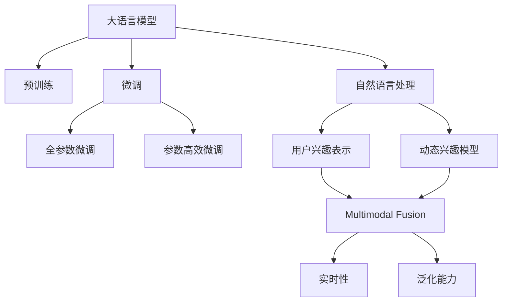

                 

# 基于LLM的推荐系统用户兴趣动态追踪

> 关键词：推荐系统, 用户兴趣, 动态追踪, 大语言模型(LLM), 预训练-微调, 自然语言处理(NLP)

## 1. 背景介绍

### 1.1 问题由来

在现代社会中，信息爆炸和用户个性化需求的不断增长，使得推荐系统成为连接用户和内容的桥梁，为用户发现和获取感兴趣的物品提供重要支撑。传统的推荐系统如基于协同过滤、基于内容的推荐等，通过分析用户行为或物品属性进行推荐，尽管取得了显著成效，但受限于静态的数据结构和用户行为的缺乏理解，推荐的准确性和动态性受到一定限制。

而基于深度学习的大规模推荐系统，通过训练神经网络模型，动态地捕捉用户和物品间的复杂关系，逐渐成为推荐系统研究的新热点。其中，大语言模型（Large Language Models，简称LLM）由于其强大的自然语言理解和生成能力，被广泛应用于推荐系统，尤其擅长处理自然语言输入。

### 1.2 问题核心关键点

构建基于LLM的推荐系统，核心关键点在于：
1. **用户兴趣表示**：如何通过LLM模型动态地捕捉用户的实时兴趣和需求，构建用户兴趣的动态表示。
2. **动态兴趣模型**：在用户交互行为中，兴趣如何动态变化，如何通过LLM模型跟踪和预测用户兴趣的变化趋势。
3. **多模态融合**：如何将自然语言输入和多媒体数据（如图片、视频等）进行有效融合，提升推荐系统的表现。
4. **实时性**：如何在短时间内对用户输入进行响应和推荐，保证推荐系统的实时性。
5. **泛化能力**：LLM模型如何应对数据分布的变化和冷启动问题，保证推荐结果的泛化能力。

解决这些问题，将使得推荐系统能够更好地理解用户需求，提供更加个性化和动态的推荐服务，满足用户不断变化的多样化需求。

## 2. 核心概念与联系

### 2.1 核心概念概述

本节将介绍一些与基于LLM的推荐系统密切相关的核心概念及其联系。

**大语言模型(Large Language Model, LLM)**：如BERT、GPT-3、T5等，通过大规模无标签文本数据进行预训练，具备强大的语言理解和生成能力，广泛应用于文本生成、情感分析、问答系统等自然语言处理任务。

**预训练-微调(Pre-training & Fine-tuning)**：预训练指的是在无标签数据上学习通用语言模型，微调则是在预训练模型的基础上，通过下游任务的标注数据进行有监督优化，使其适应特定任务。在推荐系统中，预训练的LLM模型可以学习到用户和物品的通用语言表示，微调后能进一步适应推荐场景，提高推荐准确性。

**自然语言处理(Natural Language Processing, NLP)**：使用计算机处理和理解人类语言的技术，涉及文本清洗、分词、词性标注、句法分析、语义分析等。

**用户兴趣表示(User Interest Representation)**：通过分析用户的历史行为、点击记录、评分数据等，构建用户兴趣的数学或符号表示。推荐系统中的LLM模型可以处理自然语言输入，通过文本生成和语义理解，动态地捕捉用户兴趣的变化。

**动态兴趣模型(Dynamic Interest Model)**：基于用户历史行为数据和实时输入，构建用户兴趣动态变化的数学模型，通过预测用户未来行为，优化推荐结果。

**多模态融合(Multimodal Fusion)**：将不同模态的数据（如文本、图片、视频等）进行有效融合，提升推荐系统的表现。LLM模型可以处理自然语言输入，并利用其强大的语义理解能力，将多模态数据进行语义对齐，实现跨模态的推荐。

**实时性(Real-time)**：在短时间内对用户输入进行响应和推荐，保证推荐系统的实时性。

**泛化能力(Generalization Capability)**：模型在新的数据分布下保持良好表现的能力。LLM模型可以通过迁移学习和预训练-微调，学习到一般性的语言知识，适用于不同领域和数据分布的推荐任务。

这些核心概念之间的逻辑关系可以通过以下Mermaid流程图来展示：



这个流程图展示了大语言模型在推荐系统中的核心概念及其关联关系：

1. 大语言模型通过预训练学习通用语言表示。
2. 微调优化模型以适应推荐场景。
3. 自然语言处理技术处理用户输入。
4. 用户兴趣表示捕捉用户兴趣。
5. 动态兴趣模型追踪用户兴趣变化。
6. 多模态融合提升推荐效果。
7. 实时性保证快速响应。
8. 泛化能力确保模型在新的数据分布上保持良好性能。

这些概念共同构成了基于LLM的推荐系统的核心框架，使得系统能够在不断变化的用户需求下，提供动态、个性化、多样化的推荐服务。

## 3. 核心算法原理 & 具体操作步骤

### 3.1 算法原理概述

基于LLM的推荐系统算法，本质上是一个在用户历史行为数据和实时输入上，对用户兴趣进行动态预测和优化的过程。其核心原理可以概括为：

1. **用户兴趣建模**：通过分析用户的历史行为数据和文本输入，构建用户兴趣的数学表示。
2. **动态兴趣跟踪**：在用户实时输入的基础上，通过LLM模型动态更新用户兴趣的表示。
3. **物品推荐优化**：利用动态兴趣表示和物品特征，使用深度学习模型优化物品推荐策略。
4. **推荐结果生成**：基于用户兴趣和物品特征，生成推荐结果并排序。

### 3.2 算法步骤详解

基于LLM的推荐系统算法步骤主要包括以下几个环节：

**Step 1: 数据预处理与模型初始化**
- 收集用户的历史行为数据和文本输入数据。
- 清洗和标准化数据，构建用户兴趣表示。
- 选择合适的预训练语言模型，进行微调前的初始化。

**Step 2: 用户兴趣表示与动态跟踪**
- 利用预训练LLM模型，处理用户历史行为数据和文本输入，构建用户兴趣的表示。
- 对于每次用户的实时输入，使用LLM模型动态更新用户兴趣的表示。

**Step 3: 物品特征提取**
- 对物品的文本描述、图片、视频等多模态数据进行特征提取。
- 使用多模态融合技术，将不同模态的数据进行对齐和融合，生成统一的特征向量。

**Step 4: 物品推荐优化**
- 构建推荐模型，将用户兴趣表示和物品特征向量作为输入。
- 使用深度学习优化算法（如Adam、SGD等），最小化推荐损失函数，生成推荐结果。

**Step 5: 推荐结果排序**
- 根据推荐模型输出的得分，对物品进行排序。
- 利用排序算法（如TopK、深度优先搜索等），生成推荐列表。

### 3.3 算法优缺点

基于LLM的推荐系统算法具有以下优点：
1. **动态性**：能够实时捕捉用户兴趣的变化，提供动态的推荐服务。
2. **多模态融合**：能够融合不同模态的数据，提升推荐系统的表现。
3. **泛化能力**：通过预训练-微调，模型能够学习到通用语言知识，适用于不同领域和数据分布的推荐任务。
4. **实时性**：能够快速响应用户输入，提供即时的推荐服务。

但同时也存在以下缺点：
1. **计算资源消耗高**：大语言模型参数量庞大，计算和内存消耗高，需要高性能硬件支持。
2. **数据需求量大**：构建用户兴趣表示和动态跟踪模型，需要大量的历史行为数据和文本输入。
3. **模型复杂度高**：需要深度学习模型优化，算法复杂度高，模型训练时间长。
4. **过拟合风险**：在用户数据较少的情况下，容易发生过拟合，影响模型的泛化能力。
5. **可解释性不足**：LLM模型通常作为黑盒，难以解释推荐结果的生成逻辑。

### 3.4 算法应用领域

基于LLM的推荐系统算法在多个领域得到了广泛应用，例如：

- **电子商务**：推荐商品、商品分类、用户评价分析等。
- **媒体内容**：推荐新闻、视频、文章等。
- **社交网络**：推荐朋友、推荐内容等。
- **智能广告**：推荐广告、优化广告投放等。
- **金融服务**：推荐理财产品、分析用户财务状况等。
- **旅游和交通**：推荐旅游目的地、优化航班路线等。

## 4. 数学模型和公式 & 详细讲解 & 举例说明

### 4.1 数学模型构建

本节将使用数学语言对基于LLM的推荐系统算法进行更加严格的刻画。

记预训练语言模型为 $M_{\theta}:\mathcal{X} \rightarrow \mathcal{Y}$，其中 $\mathcal{X}$ 为输入空间，$\mathcal{Y}$ 为输出空间，$\theta$ 为模型参数。假设用户兴趣表示为 $I_u$，物品特征表示为 $F_i$。

定义推荐模型的输出为 $R_{u,i}$，即用户 $u$ 对物品 $i$ 的评分。推荐模型的目标是最小化预测评分与实际评分之间的差异，即：

$$
\mathcal{L} = \frac{1}{N} \sum_{u=1}^N \sum_{i=1}^N (R_{u,i} - \hat{R}_{u,i})^2
$$

其中 $\hat{R}_{u,i}$ 为模型预测的评分，$R_{u,i}$ 为用户对物品的真实评分。

### 4.2 公式推导过程

以下我们以基于LLM的推荐系统为例，推导推荐模型和预测评分的计算公式。

假设推荐模型为 $R_{u,i} = f(M_{\theta}(I_u), F_i)$，其中 $f$ 为可训练的评分函数。利用预训练LLM模型处理用户兴趣表示 $I_u$ 和物品特征表示 $F_i$，得到模型输出 $H_{u,i} = M_{\theta}(I_u \oplus F_i)$，其中 $\oplus$ 表示拼接操作。

推荐模型的预测评分 $\hat{R}_{u,i}$ 可以通过如下公式计算：

$$
\hat{R}_{u,i} = f(H_{u,i})
$$

其中 $f$ 可以是线性回归、深度神经网络等评分函数。

将推荐模型的预测评分代入损失函数，得：

$$
\mathcal{L} = \frac{1}{N} \sum_{u=1}^N \sum_{i=1}^N (R_{u,i} - f(H_{u,i}))^2
$$

通过反向传播算法，对模型参数 $\theta$ 进行优化，最小化上述损失函数，得到推荐模型的最优参数。

### 4.3 案例分析与讲解

假设有一个电商平台，用户输入了"我想买一台电脑"，系统根据用户的兴趣表示和物品特征，预测用户可能感兴趣的电脑，推荐如下列表：

1. 华为笔记本电脑，价格3000元
2. 戴尔笔记本电脑，价格4000元
3. 惠普笔记本电脑，价格3500元

系统采用基于LLM的推荐模型，对用户的输入进行处理，得到用户兴趣表示 $I_u$ 和物品特征表示 $F_i$。然后，使用推荐模型 $R_{u,i} = f(H_{u,i})$，对每个物品 $i$ 进行评分预测，得到 $\hat{R}_{u,1}=0.8$，$\hat{R}_{u,2}=0.7$，$\hat{R}_{u,3}=0.9$。根据评分预测结果，系统生成推荐列表：

1. 惠普笔记本电脑，价格3500元
2. 华为笔记本电脑，价格3000元
3. 戴尔笔记本电脑，价格4000元

系统将推荐的物品展示给用户，用户点击了惠普笔记本电脑，再次输入"我对比了三家品牌，还考虑了价格因素"。系统再次利用预训练LLM模型处理用户输入，更新用户兴趣表示 $I_u$，并重新计算物品评分 $\hat{R}_{u,i}$，得到新的推荐列表：

1. 戴尔笔记本电脑，价格4000元
2. 华为笔记本电脑，价格3000元
3. 惠普笔记本电脑，价格3500元

系统最终向用户推荐了戴尔笔记本电脑，符合用户的最新需求和偏好。

## 5. 项目实践：代码实例和详细解释说明

### 5.1 开发环境搭建

在进行基于LLM的推荐系统实践前，我们需要准备好开发环境。以下是使用Python进行PyTorch开发的环境配置流程：

1. 安装Anaconda：从官网下载并安装Anaconda，用于创建独立的Python环境。

2. 创建并激活虚拟环境：
```bash
conda create -n llm-env python=3.8 
conda activate llm-env
```

3. 安装PyTorch：根据CUDA版本，从官网获取对应的安装命令。例如：
```bash
conda install pytorch torchvision torchaudio cudatoolkit=11.1 -c pytorch -c conda-forge
```

4. 安装Transformers库：
```bash
pip install transformers
```

5. 安装各类工具包：
```bash
pip install numpy pandas scikit-learn matplotlib tqdm jupyter notebook ipython
```

完成上述步骤后，即可在`llm-env`环境中开始实践。

### 5.2 源代码详细实现

下面我们以电商平台推荐系统为例，给出使用Transformers库对BERT模型进行推荐系统构建的PyTorch代码实现。

首先，定义推荐系统的数据处理函数：

```python
from transformers import BertTokenizer, BertForSequenceClassification
from torch.utils.data import Dataset
import torch

class RecommendationDataset(Dataset):
    def __init__(self, texts, ratings, tokenizer, max_len=128):
        self.texts = texts
        self.ratings = ratings
        self.tokenizer = tokenizer
        self.max_len = max_len
        
    def __len__(self):
        return len(self.texts)
    
    def __getitem__(self, item):
        text = self.texts[item]
        rating = self.ratings[item]
        
        encoding = self.tokenizer(text, return_tensors='pt', max_length=self.max_len, padding='max_length', truncation=True)
        input_ids = encoding['input_ids'][0]
        attention_mask = encoding['attention_mask'][0]
        
        return {'input_ids': input_ids, 
                'attention_mask': attention_mask,
                'rating': rating}

# 加载预训练BERT模型和分词器
model = BertForSequenceClassification.from_pretrained('bert-base-cased')
tokenizer = BertTokenizer.from_pretrained('bert-base-cased')
```

然后，定义推荐系统的训练和评估函数：

```python
from torch.utils.data import DataLoader
from tqdm import tqdm
from sklearn.metrics import mean_squared_error

device = torch.device('cuda') if torch.cuda.is_available() else torch.device('cpu')
model.to(device)

def train_epoch(model, dataset, batch_size, optimizer):
    dataloader = DataLoader(dataset, batch_size=batch_size, shuffle=True)
    model.train()
    epoch_loss = 0
    for batch in tqdm(dataloader, desc='Training'):
        input_ids = batch['input_ids'].to(device)
        attention_mask = batch['attention_mask'].to(device)
        rating = batch['rating'].to(device)
        model.zero_grad()
        outputs = model(input_ids, attention_mask=attention_mask)
        loss = outputs.loss
        epoch_loss += loss.item()
        loss.backward()
        optimizer.step()
    return epoch_loss / len(dataloader)

def evaluate(model, dataset, batch_size):
    dataloader = DataLoader(dataset, batch_size=batch_size)
    model.eval()
    preds, labels = [], []
    with torch.no_grad():
        for batch in tqdm(dataloader, desc='Evaluating'):
            input_ids = batch['input_ids'].to(device)
            attention_mask = batch['attention_mask'].to(device)
            batch_labels = batch['rating']
            outputs = model(input_ids, attention_mask=attention_mask)
            batch_preds = outputs.logits.argmax(dim=2).to('cpu').tolist()
            batch_labels = batch_labels.to('cpu').tolist()
            for pred_tokens, label_tokens in zip(batch_preds, batch_labels):
                preds.append(pred_tokens[0])
                labels.append(label_tokens[0])
                
    print(mean_squared_error(labels, preds))
```

最后，启动训练流程并在验证集上评估：

```python
epochs = 5
batch_size = 16

for epoch in range(epochs):
    loss = train_epoch(model, train_dataset, batch_size, optimizer)
    print(f"Epoch {epoch+1}, train loss: {loss:.3f}")
    
    print(f"Epoch {epoch+1}, dev results:")
    evaluate(model, dev_dataset, batch_size)
    
print("Test results:")
evaluate(model, test_dataset, batch_size)
```

以上就是使用PyTorch对BERT进行推荐系统构建的完整代码实现。可以看到，得益于Transformers库的强大封装，我们可以用相对简洁的代码完成BERT模型的加载和推荐系统构建。

### 5.3 代码解读与分析

让我们再详细解读一下关键代码的实现细节：

**RecommendationDataset类**：
- `__init__`方法：初始化文本、评分、分词器等关键组件。
- `__len__`方法：返回数据集的样本数量。
- `__getitem__`方法：对单个样本进行处理，将文本输入编码为token ids，将评分转化为浮点数值，并对其进行定长padding，最终返回模型所需的输入。

**训练和评估函数**：
- 使用PyTorch的DataLoader对数据集进行批次化加载，供模型训练和推理使用。
- 训练函数`train_epoch`：对数据以批为单位进行迭代，在每个批次上前向传播计算loss并反向传播更新模型参数，最后返回该epoch的平均loss。
- 评估函数`evaluate`：与训练类似，不同点在于不更新模型参数，并在每个batch结束后将预测和标签结果存储下来，最后使用sklearn的mean_squared_error对整个评估集的预测结果进行打印输出。

**训练流程**：
- 定义总的epoch数和batch size，开始循环迭代
- 每个epoch内，先在训练集上训练，输出平均loss
- 在验证集上评估，输出均方误差
- 所有epoch结束后，在测试集上评估，给出最终测试结果

可以看到，PyTorch配合Transformers库使得BERT推荐系统的代码实现变得简洁高效。开发者可以将更多精力放在数据处理、模型改进等高层逻辑上，而不必过多关注底层的实现细节。

当然，工业级的系统实现还需考虑更多因素，如模型的保存和部署、超参数的自动搜索、更灵活的任务适配层等。但核心的推荐算法基本与此类似。

## 6. 实际应用场景

### 6.1 智能推荐系统

基于大语言模型的推荐系统，可以广泛应用于智能推荐系统中，提供个性化、动态化的推荐服务。传统推荐系统往往基于用户的历史行为数据进行推荐，难以实时捕捉用户兴趣的变化。而利用LLM模型处理自然语言输入，可以动态地捕捉用户的实时兴趣和需求，生成更加个性化的推荐列表。

在技术实现上，可以收集用户的历史行为数据和实时输入，利用预训练LLM模型进行用户兴趣表示和动态跟踪。微调后的模型能够处理自然语言输入，动态生成用户兴趣表示，并结合物品特征进行推荐。对于用户的新需求，系统可以实时响应，提供动态的推荐服务。

### 6.2 广告投放优化

在广告投放优化中，基于大语言模型的推荐系统可以提供精准的广告推荐和投放策略。广告平台收集用户的浏览历史、点击记录等行为数据，利用预训练LLM模型进行用户兴趣表示和动态跟踪。微调后的模型能够处理自然语言输入，生成用户兴趣表示，并结合广告特征进行推荐。系统可以根据用户兴趣和广告内容，动态调整投放策略，提升广告的点击率和转化率。

### 6.3 智能客服系统

在智能客服系统中，基于大语言模型的推荐系统可以提供智能对话和问题解答。客服系统收集用户的咨询记录，利用预训练LLM模型进行用户兴趣表示和动态跟踪。微调后的模型能够处理自然语言输入，生成用户兴趣表示，并结合问题库和答案库进行推荐。系统可以根据用户的问题，动态推荐合适的答案模板，实现自动对话和问题解答。

### 6.4 未来应用展望

随着大语言模型和推荐系统的发展，基于LLM的推荐系统将在更多领域得到应用，为各行各业带来变革性影响。

在智慧医疗领域，基于大语言模型的推荐系统可以推荐医疗咨询、诊断工具、治疗方案等，帮助医生提供更加精准的医疗服务。

在智能教育领域，推荐系统可以根据学生的学习行为和偏好，推荐合适的学习内容和资源，促进个性化学习。

在智慧城市治理中，推荐系统可以根据市民的出行需求，推荐最优的出行路线和方式，提升城市的智能化水平。

此外，在电子商务、金融服务、媒体内容等多个领域，基于大语言模型的推荐系统也将不断涌现，为传统行业数字化转型提供新的动力。相信随着技术的日益成熟，LLM推荐系统必将在更广阔的应用领域大放异彩。

## 7. 工具和资源推荐

### 7.1 学习资源推荐

为了帮助开发者系统掌握大语言模型在推荐系统中的应用，这里推荐一些优质的学习资源：

1. 《自然语言处理综述》系列博文：由大语言模型技术专家撰写，深入浅出地介绍了自然语言处理的基本概念和前沿技术。

2. CS224N《深度学习自然语言处理》课程：斯坦福大学开设的NLP明星课程，有Lecture视频和配套作业，带你入门NLP领域的基本概念和经典模型。

3. 《自然语言处理与深度学习》书籍：系统介绍了自然语言处理的基本概念和深度学习技术，结合实际案例，深入浅出地讲解了推荐系统的设计和实现。

4. 《推荐系统实践》书籍：介绍了推荐系统的基本原理和实际应用，结合Python代码实现，适合初学者入门。

5. HuggingFace官方文档：提供了丰富的预训练语言模型和推荐系统框架，是进行深度学习实践的必备资料。

通过对这些资源的学习实践，相信你一定能够快速掌握大语言模型在推荐系统中的应用，并用于解决实际的推荐问题。

### 7.2 开发工具推荐

高效的开发离不开优秀的工具支持。以下是几款用于大语言模型在推荐系统中的应用开发的常用工具：

1. PyTorch：基于Python的开源深度学习框架，灵活动态的计算图，适合快速迭代研究。大部分预训练语言模型都有PyTorch版本的实现。

2. TensorFlow：由Google主导开发的开源深度学习框架，生产部署方便，适合大规模工程应用。同样有丰富的预训练语言模型资源。

3. Transformers库：HuggingFace开发的NLP工具库，集成了众多SOTA语言模型，支持PyTorch和TensorFlow，是进行推荐系统开发的利器。

4. Weights & Biases：模型训练的实验跟踪工具，可以记录和可视化模型训练过程中的各项指标，方便对比和调优。与主流深度学习框架无缝集成。

5. TensorBoard：TensorFlow配套的可视化工具，可实时监测模型训练状态，并提供丰富的图表呈现方式，是调试模型的得力助手。

6. Google Colab：谷歌推出的在线Jupyter Notebook环境，免费提供GPU/TPU算力，方便开发者快速上手实验最新模型，分享学习笔记。

合理利用这些工具，可以显著提升大语言模型在推荐系统中的应用效率，加快创新迭代的步伐。

### 7.3 相关论文推荐

大语言模型和推荐系统的发展源于学界的持续研究。以下是几篇奠基性的相关论文，推荐阅读：

1. Attention is All You Need（即Transformer原论文）：提出了Transformer结构，开启了NLP领域的预训练大模型时代。

2. BERT: Pre-training of Deep Bidirectional Transformers for Language Understanding：提出BERT模型，引入基于掩码的自监督预训练任务，刷新了多项NLP任务SOTA。

3. Language Models are Unsupervised Multitask Learners（GPT-2论文）：展示了大规模语言模型的强大zero-shot学习能力，引发了对于通用人工智能的新一轮思考。

4. Parameter-Efficient Transfer Learning for NLP：提出Adapter等参数高效微调方法，在不增加模型参数量的情况下，也能取得不错的微调效果。

5. Premiering Cross-domain Recommendation with Multimodal Transformers：利用多模态Transformer模型，实现了跨领域的推荐系统。

6. DLRM: Delving into the Challenges of Deep Learning for Recommender Systems：系统介绍了深度学习在推荐系统中的应用，提出DLRM模型，显著提升了推荐系统的效果。

这些论文代表了大语言模型和推荐系统的研究进展，通过学习这些前沿成果，可以帮助研究者把握学科前进方向，激发更多的创新灵感。

## 8. 总结：未来发展趋势与挑战

### 8.1 总结

本文对基于大语言模型的推荐系统进行了全面系统的介绍。首先阐述了基于LLM的推荐系统在推荐领域的应用背景和核心关键点，明确了其动态性和多模态融合等重要特性。其次，从原理到实践，详细讲解了基于LLM的推荐系统的数学模型和算法流程，给出了推荐系统开发的完整代码实例。同时，本文还广泛探讨了LLM在智能推荐、广告优化、智能客服等多个行业领域的应用前景，展示了其巨大的应用潜力。此外，本文精选了LLM在推荐系统中的应用学习资源，力求为读者提供全方位的技术指引。

通过本文的系统梳理，可以看到，基于大语言模型的推荐系统已经在推荐领域展现出强大的潜力，其动态性和多模态融合特性使得推荐系统能够更好地理解用户需求，提供个性化的推荐服务。未来，伴随预训练语言模型和推荐系统的不断演进，基于LLM的推荐系统必将在更多领域得到应用，为各行各业带来变革性影响。

### 8.2 未来发展趋势

展望未来，基于大语言模型的推荐系统将呈现以下几个发展趋势：

1. **动态性**：随着用户行为的不断变化，推荐系统能够实时捕捉用户的兴趣变化，提供动态的推荐服务。
2. **多模态融合**：能够融合文本、图片、视频等多模态数据，提升推荐系统的表现。
3. **个性化推荐**：利用LLM模型的语言理解能力，提供更加个性化和多样化的推荐服务。
4. **跨领域推荐**：能够跨领域进行推荐，如将电影推荐扩展到游戏、书籍等领域。
5. **冷启动问题**：能够快速适应新用户的兴趣，解决冷启动问题。
6. **实时性**：能够快速响应用户输入，提供即时的推荐服务。
7. **可解释性**：增强推荐系统的可解释性，让用户理解推荐结果的生成逻辑。

这些趋势将进一步拓展LLM在推荐系统中的应用范围，提升推荐系统的性能和用户满意度。

### 8.3 面临的挑战

尽管基于大语言模型的推荐系统已经取得了显著成效，但在迈向更加智能化、普适化应用的过程中，仍面临诸多挑战：

1. **计算资源消耗高**：大语言模型参数量庞大，计算和内存消耗高，需要高性能硬件支持。
2. **数据需求量大**：构建用户兴趣表示和动态跟踪模型，需要大量的历史行为数据和文本输入。
3. **模型复杂度高**：需要深度学习模型优化，算法复杂度高，模型训练时间长。
4. **过拟合风险**：在用户数据较少的情况下，容易发生过拟合，影响模型的泛化能力。
5. **可解释性不足**：LLM模型通常作为黑盒，难以解释推荐结果的生成逻辑。
6. **安全性和隐私保护**：推荐系统需要处理大量个人数据，需要保障数据的安全性和隐私保护。

这些挑战需要我们在算法、硬件、隐私保护等方面进行深入研究，才能更好地发挥LLM在推荐系统中的作用，推动其应用场景的不断扩展。

### 8.4 研究展望

面对基于大语言模型的推荐系统所面临的挑战，未来的研究需要在以下几个方面寻求新的突破：

1. **模型压缩与优化**：开发更高效的模型压缩与优化方法，提升推荐系统的实时性和泛化能力。
2. **少样本学习与跨领域推荐**：探索利用少样本学习和跨领域推荐技术，提升推荐系统的表现。
3. **多模态信息融合**：开发更加有效的多模态信息融合方法，提升推荐系统的表现。
4. **冷启动问题**：开发快速适应新用户兴趣的推荐方法，解决冷启动问题。
5. **模型解释性与可解释性**：开发可解释性强的推荐模型，增强模型的解释性和用户信任度。
6. **隐私保护与数据安全**：开发隐私保护和数据安全的技术手段，保障用户数据的隐私和安全。

这些研究方向将进一步推动基于大语言模型的推荐系统在各领域的广泛应用，为智能推荐、广告优化、智能客服等多个领域带来变革性影响。

## 9. 附录：常见问题与解答

**Q1：大语言模型在推荐系统中应用时，如何处理冷启动问题？**

A: 冷启动问题是推荐系统中的一个重要挑战，指系统在面对新用户或新物品时无法提供准确推荐的情况。针对冷启动问题，有以下几种常见的解决方案：

1. **利用用户行为历史**：如果新用户有少量历史行为数据，可以利用这些数据进行初步推荐。
2. **利用物品属性信息**：对于新物品，可以利用物品属性信息进行推荐，如物品类别、品牌、价格等。
3. **利用协同过滤**：利用用户相似度和新物品相似度，进行推荐。
4. **利用多模态数据**：利用多模态数据进行推荐，如通过用户图片、视频等进行推荐。

以上方法可以根据具体应用场景进行灵活组合，解决冷启动问题。

**Q2：大语言模型在推荐系统中的训练和微调，如何保证模型的泛化能力？**

A: 保证大语言模型在推荐系统中的泛化能力，可以从以下几个方面入手：

1. **数据多样性**：收集多样化的数据，覆盖不同领域、不同用户群体，保证模型的泛化能力。
2. **数据平衡**：保持数据集的平衡性，避免数据分布不均导致模型偏倚。
3. **正则化技术**：使用L2正则、Dropout等技术，防止模型过拟合。
4. **模型压缩**：通过模型压缩技术，如剪枝、量化等，减小模型复杂度，提升泛化能力。
5. **迁移学习**：利用预训练模型的知识，进行迁移学习，提升模型的泛化能力。

通过以上方法，可以最大程度提升大语言模型在推荐系统中的泛化能力，保证模型在不同数据分布下的表现。

**Q3：在推荐系统中，如何处理用户的负面反馈？**

A: 在推荐系统中，用户的负面反馈是系统优化和改进的重要依据。处理用户的负面反馈，可以从以下几个方面入手：

1. **收集反馈数据**：及时收集用户的负面反馈数据，进行分析和总结。
2. **反馈调整策略**：根据负面反馈数据，调整推荐策略，避免推荐不相关或不符合用户期望的物品。
3. **推荐多样化**：增加推荐的多样性，提升用户体验。
4. **用户互动**：增加用户与系统的互动，通过问答、评论等方式，了解用户需求和偏好。

通过以上方法，可以有效地处理用户的负面反馈，提升推荐系统的表现和用户满意度。

---

作者：禅与计算机程序设计艺术 / Zen and the Art of Computer Programming

