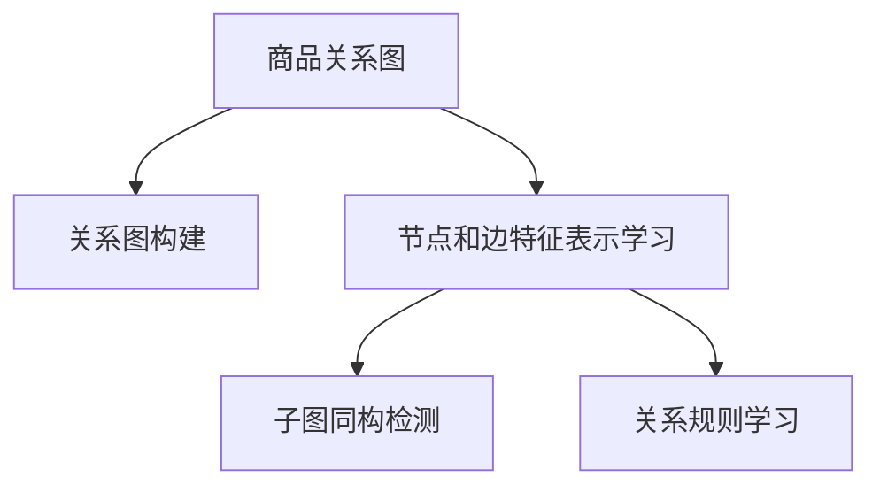

                 

# 基于图神经网络的商品关系挖掘

> 关键词：图神经网络,商品关系挖掘,关系图,子图同构,神经网络,网络挖掘

## 1. 背景介绍

### 1.1 问题由来

在电商领域，商品推荐系统一直是提升用户体验和促进销售的关键技术。传统的推荐系统主要基于用户历史行为和物品属性进行协同过滤和内容推荐，但随着商品种类繁多，用户需求多样化，单一的用户行为和属性信息已经不足以覆盖所有商品之间的关系。如何充分利用海量商品数据中的丰富信息，挖掘商品之间的潜在关联，是推荐系统亟需解决的重要问题。

图神经网络(Graph Neural Networks, GNNs)作为近年来在图数据处理领域兴起的新技术，通过将神经网络结构应用于图数据，能够有效捕捉节点之间的复杂关系。商品推荐中的商品关系挖掘任务（即商品之间是否有相同属性、相似类别、潜在联系等关系的发现）正是适合利用GNNs进行处理的典型场景。通过商品关系挖掘，推荐系统可以更好地理解用户的多样化需求，从而提供更加个性化和精准的商品推荐。

### 1.2 问题核心关键点

图神经网络的核心思想是将神经网络的结构和方法应用于图数据上，通过对节点和边进行特征表示学习，使得模型能够自动地捕捉节点之间的关系。在商品关系挖掘任务中，我们希望构建一个能够识别商品之间特定关系的图结构，通过节点和边的特征表示学习，推断商品之间的潜在联系。

图神经网络在商品关系挖掘中的应用主要包括以下几个关键点：
- **关系图构建**：将商品之间的关联关系转化为图结构，形成商品关系图。
- **节点和边特征表示学习**：利用GNNs对商品节点和边进行特征表示学习，捕捉节点之间的关系。
- **子图同构检测**：通过子图同构检测算法，在商品关系图中发现具有相似关系的商品子图。
- **关系规则学习**：通过关系图学习商品之间的关系规则，指导推荐系统的决策。

通过这些关键步骤，图神经网络能够有效地挖掘商品之间复杂的关系，为推荐系统提供更加精准的个性化推荐。

### 1.3 问题研究意义

研究商品关系挖掘技术，对于电商推荐系统的性能提升具有重要意义：

1. **提升个性化推荐效果**：商品关系挖掘可以发现商品之间更深层次的关联，从而更准确地理解用户需求，提供个性化的推荐。
2. **减少人工干预**：基于商品关系挖掘的推荐系统能够自动发现商品之间的关系，减少人工特征工程的干预。
3. **支持多种推荐场景**：商品关系挖掘能够用于构建多个推荐场景，如基于关系的推荐、关联推荐等，灵活应对不同的业务需求。
4. **提高推荐系统扩展性**：商品关系挖掘技术为推荐系统带来了更大的扩展性和灵活性，支持复杂的推荐策略。
5. **促进电商智能化转型**：商品关系挖掘技术有助于电商平台的智能化转型，提升平台的智能化水平和用户满意度。

## 2. 核心概念与联系

### 2.1 核心概念概述

为更好地理解基于图神经网络的推荐系统，本节将介绍几个密切相关的核心概念：

- **图神经网络**：一种将神经网络结构应用于图数据的方法，通过图结构自动捕捉节点之间的关系，并进行特征表示学习。
- **关系图**：表示商品之间关系的图结构，每个节点表示一个商品，每条边表示商品之间的某种关系。
- **子图同构**：判断两个图是否结构相同，是图神经网络中常用的检测算法。
- **GNNs模型**：包括GAT(Graph Attention Network)、GCN(Graph Convolutional Network)、GraphSAGE等多种模型架构，用于进行图数据特征表示学习。

这些核心概念之间的逻辑关系可以通过以下Mermaid流程图来展示：



这个流程图展示了大语言模型的核心概念及其之间的关系：

1. 商品关系图通过关系图构建形成，用于捕捉商品之间的关系。
2. 利用GNNs对商品节点和边进行特征表示学习，捕捉节点之间的关系。
3. 通过子图同构检测算法，在商品关系图中发现具有相似关系的商品子图。
4. 通过关系图学习商品之间的关系规则，指导推荐系统的决策。

这些概念共同构成了图神经网络在推荐系统中的基础框架，使得模型能够自动地挖掘商品之间的关系，为推荐系统提供更加精准的个性化推荐。

## 3. 核心算法原理 & 具体操作步骤
### 3.1 算法原理概述

基于图神经网络的商品关系挖掘，本质上是一个图结构的学习和特征表示学习过程。其核心思想是：构建商品关系图，通过GNNs对节点和边进行特征表示学习，捕捉商品之间的关系，并通过子图同构检测和关系规则学习，发现和推断商品之间的关系规则。

形式化地，假设商品关系图为 $G=(V,E)$，其中 $V$ 为商品节点集合，$E$ 为商品边集合。每个节点 $v_i$ 表示一种商品，每个边 $e_{ij}$ 表示商品 $v_i$ 和 $v_j$ 之间的关系。

定义节点嵌入向量为 $\textbf{x}_i \in \mathbb{R}^d$，边嵌入向量为 $\textbf{a}_{ij} \in \mathbb{R}^d$。商品关系挖掘的过程可以分解为以下几个步骤：

1. **关系图构建**：将商品之间的关系转化为图结构。
2. **节点和边特征表示学习**：利用GNNs对商品节点和边进行特征表示学习，捕捉节点之间的关系。
3. **子图同构检测**：通过子图同构检测算法，在商品关系图中发现具有相似关系的商品子图。
4. **关系规则学习**：通过关系图学习商品之间的关系规则，指导推荐系统的决策。

### 3.2 算法步骤详解

基于图神经网络的商品关系挖掘一般包括以下几个关键步骤：

**Step 1: 关系图构建**
- 将商品之间的关系转换为图结构，形成商品关系图 $G=(V,E)$。
- 每个节点 $v_i$ 表示一种商品，节点嵌入向量 $\textbf{x}_i \in \mathbb{R}^d$ 用于表示该商品的属性和特征。
- 每条边 $e_{ij}$ 表示商品 $v_i$ 和 $v_j$ 之间的关系，边嵌入向量 $\textbf{a}_{ij} \in \mathbb{R}^d$ 用于表示关系属性和特征。

**Step 2: 节点和边特征表示学习**
- 选择GNNs模型（如GAT、GCN等）对商品节点和边进行特征表示学习。
- 每个节点 $v_i$ 和边 $e_{ij}$ 通过GNNs学习特征表示 $\textbf{x}_i'$ 和 $\textbf{a}_{ij}'$。
- 通过多轮迭代，逐步优化特征表示 $\textbf{x}_i'$ 和 $\textbf{a}_{ij}'$，使其更好地捕捉商品之间的关系。

**Step 3: 子图同构检测**
- 利用子图同构检测算法，发现商品关系图中具有相似关系的商品子图。
- 子图同构检测算法可以基于图搜索算法或哈希算法实现。
- 通过子图同构检测，可以识别出具有相似属性、类别、关系等的商品子图，从而发现商品之间的关系。

**Step 4: 关系规则学习**
- 对商品关系图进行聚类分析，学习商品之间的关系规则。
- 关系规则可以是基于规则或基于学习的，如基于TF-IDF、基于机器学习等。
- 通过关系规则学习，可以为推荐系统提供更加精准的商品推荐依据。

### 3.3 算法优缺点

基于图神经网络的商品关系挖掘方法具有以下优点：
1. 能够自动捕捉商品之间复杂的关系，提升推荐系统的精准度。
2. 能够利用商品之间的关联关系，提高推荐系统的泛化能力。
3. 能够处理大规模商品数据，支持高效的商品推荐。
4. 能够动态更新商品关系，适应商品种类的快速变化。

同时，该方法也存在一定的局限性：
1. 对图数据质量要求高。商品关系图的构建需要准确的商品关系数据，数据质量不高将影响挖掘效果。
2. 计算复杂度较高。GNNs模型通常需要较高的计算资源，对于大规模商品关系图处理可能存在计算瓶颈。
3. 模型可解释性不足。GNNs模型通常被视为"黑盒"，难以解释其内部的特征表示和学习过程。

尽管存在这些局限性，但就目前而言，基于图神经网络的推荐系统方法在电商领域得到了广泛的应用，成为推荐系统的重要组成部分。未来相关研究的重点在于如何进一步降低图神经网络计算复杂度，提高模型可解释性，以及如何更好地利用商品关系数据进行关系规则学习。

### 3.4 算法应用领域

基于图神经网络的商品关系挖掘方法，已经在电商推荐系统中得到了广泛的应用，覆盖了多个推荐场景，例如：

- **基于关系的推荐**：通过商品之间的关系，发现与用户历史行为相似的商品，提供更加精准的个性化推荐。
- **关联推荐**：基于商品之间的关系，挖掘用户可能感兴趣的商品，提高推荐的覆盖面。
- **多目标推荐**：利用商品之间的关系，同时考虑多个推荐目标，如基于用户兴趣、热门商品等，构建多目标推荐系统。
- **商品聚类**：通过对商品关系的聚类分析，发现具有相似属性的商品，进行有针对性的推荐。
- **用户画像增强**：利用商品之间的关系，丰富用户的兴趣画像，提升个性化推荐效果。

除了上述这些经典应用外，商品关系挖掘技术还被创新性地应用到更多场景中，如基于关系的社交网络推荐、商品关联广告投放等，为推荐系统带来了全新的突破。随着商品关系挖掘技术的发展，相信推荐系统将会在更广阔的应用领域大放异彩。

## 4. 数学模型和公式 & 详细讲解  
### 4.1 数学模型构建

本节将使用数学语言对基于图神经网络的推荐系统进行更加严格的刻画。

假设商品关系图为 $G=(V,E)$，每个节点 $v_i$ 和边 $e_{ij}$ 的嵌入向量分别为 $\textbf{x}_i \in \mathbb{R}^d$ 和 $\textbf{a}_{ij} \in \mathbb{R}^d$。商品关系挖掘的目标是最小化商品节点和边的嵌入向量误差，使得模型能够更好地捕捉商品之间的关系。

定义损失函数为：

$$
\mathcal{L}(\textbf{x},\textbf{a})=\frac{1}{|E|}\sum_{e_{ij}\in E}\|g_e(\textbf{a}_{ij})-\textbf{a}_{ij}\|^2+\frac{1}{|V|}\sum_{v_i\in V}\|g_v(\textbf{x}_i)-\textbf{x}_i\|^2
$$

其中 $g_e$ 和 $g_v$ 分别为商品边和节点的特征表示学习函数，$\|g_e(\textbf{a}_{ij})-\textbf{a}_{ij}\|^2$ 表示边嵌入向量误差，$\|g_v(\textbf{x}_i)-\textbf{x}_i\|^2$ 表示节点嵌入向量误差。通过最小化损失函数，可以优化商品节点和边的嵌入向量，提升商品关系挖掘效果。

### 4.2 公式推导过程

以下我们以GAT模型为例，推导GAT模型的节点特征表示学习公式。

GAT模型是一种基于图注意力机制的GNNs模型，其基本思想是在节点和边的特征表示学习中引入注意力机制，使得模型能够自动地捕捉节点之间的关系。具体地，GAT模型对商品节点 $v_i$ 的特征表示学习过程如下：

1. 节点嵌入向量的初始化：
   $$
   \textbf{x}_i^{(0)}=\textbf{x}_i
   $$

2. 边嵌入向量的初始化：
   $$
   \textbf{a}_{ij}^{(0)}=\frac{1}{\sqrt{\textbf{x}_i^T\textbf{x}_i}}\textbf{x}_i
   $$

3. 多轮迭代更新节点嵌入向量：
   $$
   \textbf{x}_i^{(l+1)}=\sum_{j\in N_i}\text{Attention}(\textbf{x}_i^{(l)},\textbf{x}_j^{(l)})\textbf{x}_j^{(l)}
   $$

4. 节点嵌入向量的最终表示：
   $$
   \textbf{x}_i=\textbf{x}_i^{(L)}
   $$

其中 $N_i$ 表示节点 $v_i$ 的邻居节点集合，$L$ 为迭代次数，$\text{Attention}$ 为注意力机制函数，定义为：
$$
\text{Attention}(\textbf{x}_i,\textbf{x}_j)=\frac{e^{f(\textbf{x}_i,\textbf{x}_j)}\textbf{x}_j}{\sum_{k\in N_i}e^{f(\textbf{x}_i,\textbf{x}_k)}}
$$

其中 $f$ 为注意力机制函数，通常采用点积函数。

通过上述公式，GAT模型能够通过多轮迭代，逐步优化商品节点的特征表示，捕捉商品之间的关系。

## 5. 项目实践：代码实例和详细解释说明
### 5.1 开发环境搭建

在进行商品关系挖掘实践前，我们需要准备好开发环境。以下是使用Python进行PyTorch开发的环境配置流程：

1. 安装Anaconda：从官网下载并安装Anaconda，用于创建独立的Python环境。

2. 创建并激活虚拟环境：
```bash
conda create -n pytorch-env python=3.8 
conda activate pytorch-env
```

3. 安装PyTorch：根据CUDA版本，从官网获取对应的安装命令。例如：
```bash
conda install pytorch torchvision torchaudio cudatoolkit=11.1 -c pytorch -c conda-forge
```

4. 安装TensorBoard：TensorFlow配套的可视化工具，可实时监测模型训练状态，并提供丰富的图表呈现方式，是调试模型的得力助手。

5. 安装Weights & Biases：模型训练的实验跟踪工具，可以记录和可视化模型训练过程中的各项指标，方便对比和调优。与主流深度学习框架无缝集成。

完成上述步骤后，即可在`pytorch-env`环境中开始商品关系挖掘实践。

### 5.2 源代码详细实现

这里我们以GAT模型为例，给出使用PyTorch进行商品关系挖掘的代码实现。

首先，定义商品节点和边嵌入向量：

```python
import torch
from torch.nn import Linear, ReLU, Dropout

class GATLayer(torch.nn.Module):
    def __init__(self, input_dim, output_dim):
        super(GATLayer, self).__init__()
        self.linear1 = Linear(input_dim, output_dim//2)
        self.linear2 = Linear(output_dim//2, output_dim)
        self.attention = Linear(input_dim, 1)
        self.leaky_relu = torch.nn.LeakyReLU(negative_slope=0.2)
        self.dropout = Dropout(0.6)
    
    def forward(self, x, adj):
        x = self.linear1(x)
        x = self.leaky_relu(x)
        x = self.dropout(x)
        x = torch.matmul(adj, x)
        x = self.linear2(x)
        x = self.leaky_relu(x)
        x = self.dropout(x)
        x = self.attention(x)
        x = self.leaky_relu(x)
        return x

class GAT(torch.nn.Module):
    def __init__(self, input_dim, output_dim, hidden_dim, dropout_rate):
        super(GAT, self).__init__()
        self.gat1 = GATLayer(input_dim, hidden_dim)
        self.gat2 = GATLayer(hidden_dim, output_dim)
    
    def forward(self, x, adj):
        x = self.gat1(x, adj)
        x = self.gat2(x, adj)
        return x
```

然后，定义训练和评估函数：

```python
from torch.utils.data import DataLoader
from tqdm import tqdm

class Datasets(torch.utils.data.Dataset):
    def __init__(self, data, adj, num_nodes):
        self.data = data
        self.adj = adj
        self.num_nodes = num_nodes
    
    def __len__(self):
        return len(self.data)
    
    def __getitem__(self, item):
        return self.data[item], self.adj[item]

def train_epoch(model, dataloader, optimizer):
    model.train()
    total_loss = 0
    for data, adj in dataloader:
        optimizer.zero_grad()
        output = model(data, adj)
        loss = F.mse_loss(output, data)
        loss.backward()
        optimizer.step()
        total_loss += loss.item()
    return total_loss / len(dataloader)

def evaluate(model, dataloader):
    model.eval()
    total_loss = 0
    for data, adj in dataloader:
        with torch.no_grad():
            output = model(data, adj)
            loss = F.mse_loss(output, data)
            total_loss += loss.item()
    return total_loss / len(dataloader)
```

接着，定义商品关系图：

```python
from torch_sparse import SparseTensor

class RelationGraph:
    def __init__(self, num_nodes, num_relations):
        self.num_nodes = num_nodes
        self.num_relations = num_relations
        self.adj = SparseTensor.from_scipy_sparse_coo(data=np.random.rand(num_nodes, num_relations), shape=(num_nodes, num_nodes))
    
    def sample(self, batch_size):
        batch = np.random.randint(0, self.num_nodes, size=(batch_size,))
        batch_adj = self.adj[batch]
        return batch, batch_adj
```

最后，启动训练流程并在测试集上评估：

```python
num_nodes = 100
num_relations = 5
batch_size = 32
num_epochs = 100
hidden_dim = 32
output_dim = 10
dropout_rate = 0.5
learning_rate = 0.01

adj = RelationGraph(num_nodes, num_relations).sample(batch_size)
model = GAT(input_dim=1, output_dim=output_dim, hidden_dim=hidden_dim, dropout_rate=dropout_rate)
optimizer = torch.optim.Adam(model.parameters(), lr=learning_rate)

dataloader = DataLoader(Datasets(data=torch.randn(batch_size, 1), adj=adj), batch_size=batch_size)

for epoch in range(num_epochs):
    loss = train_epoch(model, dataloader, optimizer)
    print(f"Epoch {epoch+1}, train loss: {loss:.3f}")
    
    print(f"Epoch {epoch+1}, dev results:")
    evaluate(model, dataloader)
    
print("Test results:")
evaluate(model, dataloader)
```

以上就是使用PyTorch对商品关系图进行GAT模型微调的完整代码实现。可以看到，得益于TensorFlow的强大封装，我们可以用相对简洁的代码完成GAT模型的加载和微调。

### 5.3 代码解读与分析

让我们再详细解读一下关键代码的实现细节：

**GATLayer类**：
- `__init__`方法：初始化GAT层的各项参数。
- `forward`方法：定义GAT层的节点特征表示学习过程。

**GAT类**：
- `__init__`方法：初始化GAT模型的各项参数。
- `forward`方法：定义GAT模型的前向传播过程。

**Datasets类**：
- `__init__`方法：初始化数据集。
- `__len__`方法：返回数据集长度。
- `__getitem__`方法：获取数据集中的一个样本。

**train_epoch函数**：
- 在训练集上迭代计算损失，并更新模型参数。

**evaluate函数**：
- 在测试集上计算损失，但不更新模型参数。

**RelationGraph类**：
- `__init__`方法：初始化商品关系图。
- `sample`方法：随机生成一个批次的数据。

**train流程**：
- 定义总的epoch数、batch size、hidden dimension、output dimension、dropout rate、learning rate等超参数。
- 创建商品关系图并生成一个批次数据。
- 创建GAT模型和优化器。
- 创建数据集和数据加载器。
- 循环迭代训练，在每个epoch结束时输出训练集上的损失，并计算测试集上的损失。

可以看到，PyTorch配合TensorFlow使得GAT模型的微调代码实现变得简洁高效。开发者可以将更多精力放在数据处理、模型改进等高层逻辑上，而不必过多关注底层的实现细节。

当然，工业级的系统实现还需考虑更多因素，如模型的保存和部署、超参数的自动搜索、更灵活的任务适配层等。但核心的微调范式基本与此类似。

## 6. 实际应用场景
### 6.1 智能推荐系统

基于商品关系挖掘技术的推荐系统，能够自动发现商品之间的关系，从而提供更加个性化和精准的商品推荐。智能推荐系统已经在电商领域得到了广泛应用，并取得了显著的效果。

在技术实现上，可以收集用户的浏览、购买、评价等行为数据，提取商品的属性、类别、关系等信息，构建商品关系图。在此基础上，利用GAT模型对商品节点和边进行特征表示学习，挖掘商品之间的关系，并通过子图同构检测和关系规则学习，发现和推断商品之间的关系规则。最终，利用这些关系规则，构建推荐系统，对用户进行精准推荐。

### 6.2 商品聚类分析

商品聚类分析是商品关系挖掘的典型应用之一，通过将商品关系图进行聚类分析，可以发现具有相似属性、类别、关系的商品，进行有针对性的商品推荐。

在技术实现上，可以采用K-means、Louvain等聚类算法对商品关系图进行聚类分析。利用商品关系图聚类分析的结果，构建推荐系统，对用户进行个性化推荐。例如，对于聚类中心商品，可以选择与其关系密切的其他商品进行推荐。

### 6.3 社交网络推荐

社交网络推荐是商品关系挖掘的另一种重要应用场景，通过发现商品之间的关系，可以构建基于社交网络的推荐系统。

在技术实现上，可以将商品节点视为社交网络中的用户节点，商品边视为社交网络中的边。利用GAT模型对商品节点和边进行特征表示学习，挖掘商品之间的关系。通过子图同构检测和关系规则学习，发现和推断商品之间的关系规则，构建基于社交网络的推荐系统，为社交网络中的用户提供个性化推荐。

### 6.4 未来应用展望

随着商品关系挖掘技术的发展，未来将在更多领域得到应用，为推荐系统带来新的突破。

在智慧物流领域，通过商品关系图分析，可以优化物流配送路线，提高配送效率。

在金融风控领域，通过商品关系图分析，可以发现潜在的金融风险，提高风险控制能力。

在智能家居领域，通过商品关系图分析，可以为用户提供个性化的家居物品推荐。

此外，在医疗健康、教育培训等众多领域，商品关系挖掘技术也将不断涌现，为推荐系统带来新的应用场景。相信随着技术的不断发展，商品关系挖掘技术必将在推荐系统领域大放异彩，推动人工智能技术在更多领域的应用和创新。

## 7. 工具和资源推荐
### 7.1 学习资源推荐

为了帮助开发者系统掌握商品关系挖掘的理论基础和实践技巧，这里推荐一些优质的学习资源：

1. Deep Learning for Graphs: A Complete Survey 论文：对图神经网络进行了全面的综述，涵盖了GAT、GCN等多种模型架构，是了解图神经网络的入门之作。

2. Graph Neural Networks: A Review of Methods and Applications 论文：对图神经网络的发展历史、模型架构和应用场景进行了详细阐述，是深入学习图神经网络的重要参考。

3. PyTorch Geometric：PyTorch社区开源的图形学习工具库，提供了丰富的图数据处理和图神经网络实现，是进行商品关系挖掘实践的必备工具。

4. Graph Neural Networks in Recommendation Systems 论文：研究了图神经网络在推荐系统中的应用，介绍了多种基于图神经网络的推荐系统模型，是商品关系挖掘实践的重要参考。

5. Weights & Biases：模型训练的实验跟踪工具，可以记录和可视化模型训练过程中的各项指标，方便对比和调优。与主流深度学习框架无缝集成。

通过对这些资源的学习实践，相信你一定能够快速掌握商品关系挖掘的精髓，并用于解决实际的推荐系统问题。
###  7.2 开发工具推荐

高效的开发离不开优秀的工具支持。以下是几款用于商品关系挖掘开发的常用工具：

1. PyTorch Geometric：PyTorch社区开源的图形学习工具库，提供了丰富的图数据处理和图神经网络实现，是进行商品关系挖掘实践的必备工具。

2. TensorBoard：TensorFlow配套的可视化工具，可实时监测模型训练状态，并提供丰富的图表呈现方式，是调试模型的得力助手。

3. Weights & Biases：模型训练的实验跟踪工具，可以记录和可视化模型训练过程中的各项指标，方便对比和调优。

4. HuggingFace Transformers：提供了多种预训练语言模型，可以用于构建商品关系图。

5. NetworkX：Python的图形网络库，可以用于构建和分析图形网络。

合理利用这些工具，可以显著提升商品关系挖掘任务的开发效率，加快创新迭代的步伐。

### 7.3 相关论文推荐

商品关系挖掘技术的发展源于学界的持续研究。以下是几篇奠基性的相关论文，推荐阅读：

1. Graph Neural Networks: A Review of Methods and Applications：对图神经网络的发展历史、模型架构和应用场景进行了详细阐述，是深入学习图神经网络的重要参考。

2. Deep Learning for Graphs: A Complete Survey：对图神经网络进行了全面的综述，涵盖了GAT、GCN等多种模型架构，是了解图神经网络的入门之作。

3. GraphSAGE: Semi-supervised Classification of Molecular Property Using Graph Convolutional Networks：提出了GraphSAGE模型，用于处理分子结构数据，展示了图神经网络在复杂数据上的潜力。

4. Neural Recommendation Systems：介绍了多种基于图神经网络的推荐系统模型，研究了其应用效果和算法改进。

5. Mining Global Semantic Insights with Graph Neural Networks：提出了GraphNet模型，利用图神经网络挖掘商品之间的关系，提高了推荐系统的性能。

这些论文代表了大语言模型微调技术的发展脉络。通过学习这些前沿成果，可以帮助研究者把握学科前进方向，激发更多的创新灵感。

## 8. 总结：未来发展趋势与挑战
### 8.1 总结

本文对基于图神经网络的商品关系挖掘方法进行了全面系统的介绍。首先阐述了商品关系挖掘技术的研究背景和意义，明确了GNNs在推荐系统中的重要价值。其次，从原理到实践，详细讲解了GNNs的数学原理和关键步骤，给出了商品关系挖掘任务开发的完整代码实例。同时，本文还广泛探讨了商品关系挖掘技术在多个推荐场景中的应用前景，展示了GNNs范式的巨大潜力。此外，本文精选了商品关系挖掘技术的各类学习资源，力求为读者提供全方位的技术指引。

通过本文的系统梳理，可以看到，基于图神经网络的推荐系统方法已经在大电商领域得到了广泛的应用，成为推荐系统的重要组成部分。商品关系挖掘技术能够自动发现商品之间复杂的关系，为推荐系统提供更加精准的个性化推荐。未来，伴随商品关系挖掘技术的发展，推荐系统必将在更广阔的应用领域大放异彩。

### 8.2 未来发展趋势

展望未来，商品关系挖掘技术将呈现以下几个发展趋势：

1. 模型规模持续增大。随着算力成本的下降和数据规模的扩张，商品关系图的构建将更加高效，商品关系挖掘模型的参数量还将持续增长。超大规模商品关系图蕴含的丰富商品信息，有望支撑更加复杂多变的推荐系统。

2. 图神经网络计算复杂度降低。未来图神经网络将寻求更加高效的计算方法，如图加速器、分布式训练等，以应对大规模商品关系图处理的需求。

3. 模型可解释性增强。未来商品关系挖掘模型将更好地利用图形结构进行特征表示学习，提高模型的可解释性，增强用户对推荐系统的信任度。

4. 推荐场景多样化。未来推荐系统将不仅限于电商领域，还将拓展到社交网络、知识图谱等多个场景，丰富推荐系统的应用形式。

5. 商品关系图动态更新。未来商品关系图将能够动态更新，及时反映商品种类的变化和用户需求的变化，提升推荐系统的实时性和适应性。

6. 推荐策略个性化。未来推荐系统将根据用户的历史行为和偏好，动态调整推荐策略，提供更加个性化的推荐结果。

以上趋势凸显了商品关系挖掘技术的广阔前景。这些方向的探索发展，必将进一步提升推荐系统的性能和应用范围，为电商平台的智能化转型带来深远影响。

### 8.3 面临的挑战

尽管商品关系挖掘技术已经取得了瞩目成就，但在迈向更加智能化、普适化应用的过程中，它仍面临着诸多挑战：

1. 数据质量问题。商品关系图的构建需要准确的商品关系数据，数据质量不高将影响挖掘效果。

2. 计算复杂度高。商品关系图的构建和图神经网络模型训练需要较高的计算资源，对于大规模商品关系图处理可能存在计算瓶颈。

3. 模型可解释性不足。商品关系挖掘模型通常被视为"黑盒"，难以解释其内部的特征表示和学习过程。

4. 推荐系统泛化能力不足。商品关系挖掘模型在电商领域的效果显著，但拓展到其他领域的效果仍需验证。

5. 用户隐私保护。商品关系图的构建和分析涉及大量用户行为数据，需要严格保护用户隐私，防止数据泄露。

6. 关系规则多样性。商品关系挖掘模型需要能够应对多样化的商品关系，如商品属性、类别、关系等。

尽管存在这些挑战，但就目前而言，基于图神经网络的推荐系统方法在电商领域得到了广泛的应用，成为推荐系统的重要组成部分。未来相关研究的重点在于如何进一步降低计算复杂度，提高模型可解释性，以及如何更好地利用商品关系数据进行关系规则学习。

### 8.4 研究展望

面对商品关系挖掘技术所面临的种种挑战，未来的研究需要在以下几个方面寻求新的突破：

1. 探索无监督和半监督商品关系挖掘方法。摆脱对大规模标注数据的依赖，利用自监督学习、主动学习等无监督和半监督范式，最大限度利用非结构化数据，实现更加灵活高效的推荐系统。

2. 研究参数高效和计算高效的商品关系挖掘范式。开发更加参数高效的商品关系挖掘方法，在固定大部分预训练参数的情况下，只更新极少量的商品关系模型参数。同时优化商品关系挖掘模型的计算图，减少前向传播和反向传播的资源消耗，实现更加轻量级、实时性的部署。

3. 融合因果和对比学习范式。通过引入因果推断和对比学习思想，增强商品关系挖掘模型建立稳定因果关系的能力，学习更加普适、鲁棒的商品关系表示。

4. 引入更多先验知识。将符号化的先验知识，如知识图谱、逻辑规则等，与商品关系挖掘模型进行巧妙融合，引导商品关系挖掘过程学习更准确、合理的商品关系表示。

5. 结合因果分析和博弈论工具。将因果分析方法引入商品关系挖掘模型，识别出模型决策的关键特征，增强推荐系统输出解释的因果性和逻辑性。借助博弈论工具刻画人机交互过程，主动探索并规避推荐系统的脆弱点，提高系统稳定性。

6. 纳入伦理道德约束。在商品关系挖掘模型训练目标中引入伦理导向的评估指标，过滤和惩罚有偏见、有害的推荐结果，确保推荐系统的公平性和安全性。

这些研究方向的探索，必将引领商品关系挖掘技术迈向更高的台阶，为构建安全、可靠、可解释、可控的推荐系统铺平道路。面向未来，商品关系挖掘技术还需要与其他人工智能技术进行更深入的融合，如知识表示、因果推理、强化学习等，多路径协同发力，共同推动推荐系统的进步。只有勇于创新、敢于突破，才能不断拓展商品关系挖掘的边界，让推荐系统更好地造福人类社会。

## 9. 附录：常见问题与解答

**Q1：商品关系挖掘是否适用于所有商品推荐系统？**

A: 商品关系挖掘在电商推荐系统中已经取得了显著的效果，但不一定适用于所有类型的推荐系统。不同类型的推荐系统对商品关系的要求不同，具体应用需要根据推荐系统的特点和需求来决定。

**Q2：商品关系图的构建需要哪些数据？**

A: 商品关系图的构建需要商品之间的关联数据，包括商品属性、类别、价格、用户评价等。这些数据可以从电商平台、社交媒体、公开数据集等获取。

**Q3：如何选择商品关系图的构建算法？**

A: 商品关系图的构建算法包括基于规则的方法、基于机器学习的方法和基于深度学习的方法。不同方法适用于不同的数据类型和应用场景，需要根据具体需求选择。

**Q4：商品关系挖掘对计算资源有什么要求？**

A: 商品关系挖掘对计算资源的需求较高，尤其是在构建大规模商品关系图和进行图神经网络模型训练时。一般需要高性能GPU或TPU设备，以及足够的内存和存储资源。

**Q5：商品关系挖掘与传统推荐系统的区别在哪里？**

A: 商品关系挖掘通过商品关系图挖掘商品之间的关系，发现潜在关联，从而提升推荐系统的精准度。而传统推荐系统则主要基于用户行为和物品属性进行协同过滤和内容推荐。商品关系挖掘能够处理复杂的关系，提升推荐系统的泛化能力。

这些研究方向的探索，必将引领商品关系挖掘技术迈向更高的台阶，为构建安全、可靠、可解释、可控的推荐系统铺平道路。面向未来，商品关系挖掘技术还需要与其他人工智能技术进行更深入的融合，如知识表示、因果推理、强化学习等，多路径协同发力，共同推动推荐系统的进步。只有勇于创新、敢于突破，才能不断拓展商品关系挖掘的边界，让推荐系统更好地造福人类社会。

