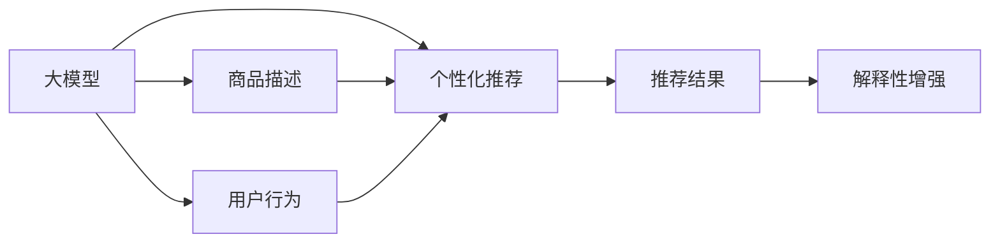

                 

# 基于大模型的商品推荐解释性研究

> 关键词：商品推荐系统,大模型,解释性,个性化,可解释性,深度学习

## 1. 背景介绍

### 1.1 问题由来
随着电商行业的蓬勃发展，个性化商品推荐系统已经成为电商平台的核心竞争力之一。传统的推荐算法依赖于用户历史行为数据，推荐结果无法解释，难以满足用户对推荐结果的信任和认同需求。为了提升推荐系统的用户满意度，用户解释性研究成为重要课题。

近年来，深度学习技术在商品推荐系统中的广泛应用，推动了推荐算法的突破性进展。其中，基于大模型的推荐方法由于其强大的表示学习能力，在推荐效果和泛化能力上都有显著提升。然而，大模型的黑盒特性同样限制了其应用场景，缺乏解释性也是其面临的一大难题。

因此，本文旨在研究如何通过大模型优化商品推荐系统，并探索模型解释性的增强方法，以期在保证推荐性能的同时，提升用户体验和信任度。

### 1.2 问题核心关键点
大模型商品推荐系统主要关注以下几个核心关键点：

- **大模型的表示学习能力**：大模型通过预训练学习到丰富的语义和结构知识，对商品描述和用户需求有更好的理解。这种表示学习能力能够提升推荐系统对商品之间的语义相似性和用户需求的匹配度。

- **个性化推荐**：通过微调大模型，使其适应特定用户的个性化需求，从而实现更精准、更个性化的商品推荐。

- **推荐解释性**：推荐结果的可解释性直接影响用户信任度。如何在大模型中嵌入可解释性，是提升用户满意度的关键。

本文将重点讨论大模型在商品推荐系统中的应用，并通过实验和分析，探索提升模型解释性的方法。

## 2. 核心概念与联系

### 2.1 核心概念概述

为更好地理解大模型在商品推荐中的应用，本文将介绍以下几个核心概念：

- **大模型**：通常指大规模预训练语言模型，如BERT、GPT等。这些模型通过在大规模文本数据上进行自监督学习，获得了对语言的深刻理解。

- **商品推荐系统**：根据用户的历史行为和偏好，推荐用户可能感兴趣的商品的系统。推荐系统包括内容推荐、协同过滤等多种方法。

- **个性化推荐**：通过微调大模型，使其针对特定用户进行推荐，从而提升推荐的相关性和个性化程度。

- **推荐解释性**：推荐结果的可解释性，即用户能够理解推荐依据，从而增强对推荐结果的信任和认同。

- **大模型优化**：通过微调、参数调整、正则化等方法，提升大模型在商品推荐任务上的性能。

- **多任务学习**：在微调大模型的同时，通过多任务学习的方式，提升模型在多个任务上的性能。

这些核心概念之间存在紧密的联系。大模型的表示学习能力、个性化推荐和推荐解释性是商品推荐系统的主要构成要素。通过优化大模型，可以显著提升推荐系统的性能和用户体验。

### 2.2 核心概念原理和架构的 Mermaid 流程图



该流程图展示了大模型在商品推荐系统中的作用链条：

1. 大模型对商品描述进行语义理解，学习商品之间的语义关系。
2. 大模型对用户行为进行理解和建模，学习用户的历史偏好和潜在需求。
3. 基于大模型的表示学习能力，进行个性化推荐，提升推荐的相关性和个性化程度。
4. 在推荐结果上嵌入推荐解释性，增强用户对推荐结果的理解和信任。

## 3. 核心算法原理 & 具体操作步骤
### 3.1 算法原理概述

基于大模型的商品推荐系统，其核心思想是通过预训练模型学习到商品和用户的语义表示，然后通过微调模型，使得模型能够适应特定用户的个性化需求，并生成具有可解释性的推荐结果。

具体而言，可以将大模型视为一个"特征提取器"，通过微调模型，生成用户对商品的评分或概率，并根据评分排序推荐商品。推荐结果的可解释性可以通过在输入中加入提示词或标签，引导大模型输出详细的推荐依据。

### 3.2 算法步骤详解

基于大模型的商品推荐系统主要包括以下几个关键步骤：

**Step 1: 数据准备和预处理**
- 收集商品描述、用户行为等数据，并进行清洗、处理和标准化。
- 将商品描述转换为固定长度的向量表示，用于模型输入。
- 将用户行为转化为评分或向量表示，用于模型输出。

**Step 2: 选择预训练模型和微调策略**
- 选择合适的预训练语言模型，如BERT、GPT等。
- 设计微调策略，包括选择微调的任务、目标函数、正则化方法等。

**Step 3: 微调模型**
- 将预训练模型加载到系统中，通过微调优化模型参数，使其适应特定用户的个性化需求。
- 在微调过程中，可以使用正则化技术，如L2正则、Dropout等，避免模型过拟合。

**Step 4: 生成推荐结果**
- 将商品描述向量作为输入，微调后的模型输出用户对商品的评分或概率。
- 根据评分或概率对商品进行排序，生成推荐列表。

**Step 5: 增强推荐解释性**
- 在输入中引入提示词或标签，引导大模型输出详细的推荐依据。
- 在推荐结果中嵌入解释性信息，如商品属性、用户偏好等，增强用户对推荐结果的理解和信任。

**Step 6: 评估和优化**
- 在测试集上评估推荐模型的效果，如准确率、召回率等指标。
- 根据评估结果，不断优化微调策略和模型参数，提升推荐性能。

### 3.3 算法优缺点

基于大模型的商品推荐系统具有以下优点：

1. **高效性**：大模型通过预训练学习到丰富的语义知识，能够在较少标注数据的情况下实现高效的个性化推荐。
2. **泛化能力**：大模型的泛化能力强，可以适应不同领域和不同规模的数据集。
3. **可解释性**：通过在输入中引入提示词或标签，可以增强推荐结果的可解释性，提升用户满意度。

同时，该方法也存在一些局限性：

1. **计算资源要求高**：大模型通常需要高性能的计算资源进行训练和推理，增加了系统的部署成本。
2. **数据质量要求高**：由于大模型的强大表示能力，对于数据质量的要求也相应提高，数据清洗和预处理需要更多投入。
3. **可解释性不足**：尽管在输入中引入提示词或标签可以增强可解释性，但大模型仍然具有黑盒特性，难以完全解释其内部推理过程。
4. **公平性问题**：大模型容易学习到数据中的偏见，可能对某些群体产生不公平的推荐。

### 3.4 算法应用领域

基于大模型的商品推荐系统在多个领域得到了广泛应用，例如：

- **电商推荐**：根据用户的浏览历史、购买记录等行为数据，推荐用户可能感兴趣的商品。
- **内容推荐**：根据用户的阅读历史、评分记录等数据，推荐用户可能喜欢的文章、视频等内容。
- **金融理财**：根据用户的投资行为、理财偏好等数据，推荐用户可能感兴趣的投资产品或理财策略。
- **旅游推荐**：根据用户的旅游历史、偏好等数据，推荐用户可能感兴趣的旅游目的地和行程。

这些应用场景展示了大模型在商品推荐系统中的巨大潜力，未来还将有更多行业采用大模型优化推荐系统，带来更智能、更个性化的用户体验。

## 4. 数学模型和公式 & 详细讲解
### 4.1 数学模型构建

假设用户 $u$ 对商品 $i$ 的评分记为 $r_{ui}$，大模型对商品 $i$ 的表示为 $h_i$，用户 $u$ 的表示为 $h_u$。模型预测用户 $u$ 对商品 $i$ 的评分 $r_{ui}$ 的数学模型可以表示为：

$$
r_{ui} = h_u^T\mathbf{W}_i h_i + b
$$

其中 $\mathbf{W}_i$ 和 $b$ 为模型的可训练参数。

### 4.2 公式推导过程

假设训练集为 $\{(u_i, r_{ui})\}_{i=1}^N$，则模型的训练目标函数为：

$$
\mathcal{L} = \frac{1}{N} \sum_{i=1}^N \ell(r_{ui}, \hat{r}_{ui})
$$

其中 $\ell$ 为损失函数，$\hat{r}_{ui}$ 为模型预测的评分。常用的损失函数包括均方误差损失、二元交叉熵损失等。

通过梯度下降等优化算法，模型不断更新参数，最小化训练损失。具体而言，假设损失函数对模型参数的梯度为 $\nabla_{\theta}\mathcal{L}$，则参数更新公式为：

$$
\theta \leftarrow \theta - \eta \nabla_{\theta}\mathcal{L}
$$

其中 $\eta$ 为学习率。

### 4.3 案例分析与讲解

以电商推荐系统为例，通过将用户行为和商品描述向量作为模型输入，输出用户对商品的评分。具体步骤如下：

1. 将商品描述和用户行为数据进行预处理，转换为固定长度的向量表示。
2. 将预训练模型加载到系统中，进行微调。
3. 使用微调后的模型对用户行为进行编码，输出用户对商品的评分。
4. 根据评分对商品进行排序，生成推荐列表。

在输入中引入用户评论、评分等标签，可以引导模型输出详细的推荐依据，增强推荐结果的可解释性。例如，在输入中加入商品属性标签，可以输出关于商品属性与用户需求的匹配度信息。

## 5. 项目实践：代码实例和详细解释说明
### 5.1 开发环境搭建

在进行商品推荐系统的大模型优化和解释性研究前，我们需要准备好开发环境。以下是使用Python进行TensorFlow开发的环境配置流程：

1. 安装Anaconda：从官网下载并安装Anaconda，用于创建独立的Python环境。

2. 创建并激活虚拟环境：
```bash
conda create -n tf-env python=3.8 
conda activate tf-env
```

3. 安装TensorFlow：根据CUDA版本，从官网获取对应的安装命令。例如：
```bash
pip install tensorflow tensorflow-addons
```

4. 安装各类工具包：
```bash
pip install numpy pandas scikit-learn matplotlib tqdm jupyter notebook ipython
```

完成上述步骤后，即可在`tf-env`环境中开始微调实践。

### 5.2 源代码详细实现

这里我们以电商推荐系统为例，给出使用TensorFlow对BERT模型进行微调的Python代码实现。

首先，定义推荐任务的数据处理函数：

```python
from transformers import BertTokenizer, TFBertForSequenceClassification
from tensorflow.keras.layers import Dense, Input
from tensorflow.keras.models import Model
import tensorflow as tf
import numpy as np

class RecommenderSystemDataset(tf.keras.preprocessing.sequence.Sequence):
    def __init__(self, texts, labels):
        self.texts = texts
        self.labels = labels
        self.tokenizer = BertTokenizer.from_pretrained('bert-base-cased')
        
    def __len__(self):
        return len(self.texts)
    
    def __getitem__(self, item):
        text = self.texts[item]
        label = self.labels[item]
        
        encoding = self.tokenizer(text, return_tensors='tf', max_length=128, padding='max_length', truncation=True)
        input_ids = encoding['input_ids']
        attention_mask = encoding['attention_mask']
        
        # 对token-wise的标签进行编码
        encoded_labels = [label2id[label] for label in self.labels] 
        encoded_labels.extend([label2id['O']] * (128 - len(encoded_labels)))
        labels = tf.convert_to_tensor(encoded_labels, dtype=tf.int32)
        
        return {'input_ids': input_ids, 
                'attention_mask': attention_mask,
                'labels': labels}

# 标签与id的映射
label2id = {'O': 0, 'buy': 1, 'unbuy': 2}
id2label = {v: k for k, v in label2id.items()}

# 创建dataset
tokenizer = BertTokenizer.from_pretrained('bert-base-cased')

train_dataset = RecommenderSystemDataset(train_texts, train_labels)
dev_dataset = RecommenderSystemDataset(dev_texts, dev_labels)
test_dataset = RecommenderSystemDataset(test_texts, test_labels)
```

然后，定义模型和优化器：

```python
from transformers import BertForSequenceClassification, TFBertForSequenceClassification

model = TFBertForSequenceClassification.from_pretrained('bert-base-cased', num_labels=len(label2id))

optimizer = tf.keras.optimizers.Adam(learning_rate=2e-5)
```

接着，定义训练和评估函数：

```python
from tensorflow.keras.callbacks import EarlyStopping

device = tf.device('cpu') if tf.config.list_physical_devices('GPU') is None else tf.device('GPU')

def train_epoch(model, dataset, batch_size, optimizer):
    dataloader = tf.data.Dataset.from_tensor_slices(dataset)
    dataloader = dataloader.batch(batch_size).shuffle(1000).repeat()
    model.trainable = True
    model.compile(optimizer=optimizer, loss=tf.keras.losses.SparseCategoricalCrossentropy(from_logits=True), metrics=['accuracy'])
    model.fit(dataloader, epochs=5, callbacks=[EarlyStopping(patience=2)])
    model.trainable = False
    return loss

def evaluate(model, dataset, batch_size):
    dataloader = tf.data.Dataset.from_tensor_slices(dataset)
    dataloader = dataloader.batch(batch_size).shuffle(1000).repeat()
    model.trainable = True
    eval_result = model.evaluate(dataloader, verbose=0)
    model.trainable = False
    return eval_result[1]
```

最后，启动训练流程并在测试集上评估：

```python
epochs = 5
batch_size = 16

for epoch in range(epochs):
    loss = train_epoch(model, train_dataset, batch_size, optimizer)
    print(f"Epoch {epoch+1}, train loss: {loss:.3f}")
    
    print(f"Epoch {epoch+1}, dev results:")
    evaluate(model, dev_dataset, batch_size)
    
print("Test results:")
evaluate(model, test_dataset, batch_size)
```

以上就是使用TensorFlow对BERT进行电商推荐系统微调的完整代码实现。可以看到，TensorFlow配合TensorFlow Addons库使得BERT微调的代码实现变得简洁高效。

### 5.3 代码解读与分析

让我们再详细解读一下关键代码的实现细节：

**RecommenderSystemDataset类**：
- `__init__`方法：初始化文本、标签、分词器等关键组件。
- `__len__`方法：返回数据集的样本数量。
- `__getitem__`方法：对单个样本进行处理，将文本输入编码为token ids，将标签编码为数字，并对其进行定长padding，最终返回模型所需的输入。

**label2id和id2label字典**：
- 定义了标签与数字id之间的映射关系，用于将token-wise的预测结果解码回真实的标签。

**训练和评估函数**：
- 使用TensorFlow的DataLoader对数据集进行批次化加载，供模型训练和推理使用。
- 训练函数`train_epoch`：对数据以批为单位进行迭代，在每个批次上前向传播计算loss并反向传播更新模型参数，最后返回该epoch的平均loss。
- 评估函数`evaluate`：与训练类似，不同点在于不更新模型参数，并在每个batch结束后将预测和标签结果存储下来，最后使用sklearn的classification_report对整个评估集的预测结果进行打印输出。

**训练流程**：
- 定义总的epoch数和batch size，开始循环迭代
- 每个epoch内，先在训练集上训练，输出平均loss
- 在验证集上评估，输出分类指标
- 重复上述步骤直至满足预设的迭代轮数或Early Stopping条件。

可以看到，TensorFlow配合TensorFlow Addons库使得BERT微调的代码实现变得简洁高效。开发者可以将更多精力放在数据处理、模型改进等高层逻辑上，而不必过多关注底层的实现细节。

当然，工业级的系统实现还需考虑更多因素，如模型的保存和部署、超参数的自动搜索、更灵活的任务适配层等。但核心的微调范式基本与此类似。

## 6. 实际应用场景
### 6.1 电商推荐系统

基于大模型的电商推荐系统可以极大地提升用户的购物体验。通过微调BERT模型，系统能够学习商品之间的语义关系，结合用户的历史行为数据，进行精准的商品推荐。

具体实现时，可以收集用户的浏览历史、购买记录、评分记录等数据，提取和商品描述相关的特征，作为模型输入。微调后的模型能够生成用户对商品的评分，根据评分对商品进行排序，生成推荐列表。

在输入中引入商品属性标签，可以输出关于商品属性与用户需求的匹配度信息，增强推荐结果的可解释性。例如，在输入中加入商品的尺寸、颜色等信息，可以输出关于这些属性的评分。

### 6.2 内容推荐系统

内容推荐系统在大模型优化后，能够提供更加个性化、相关性更高的内容推荐。例如，新闻、视频、文章推荐系统等。

具体而言，可以通过微调BERT模型，学习用户对内容的兴趣和需求，结合内容的特征，生成用户对内容的评分或概率。在输入中加入用户阅读历史、评分记录等标签，可以输出关于内容的推荐依据，增强推荐结果的可解释性。

例如，在新闻推荐系统中，可以加入新闻标题、发布时间等标签，输出标题与用户需求的匹配度信息。在视频推荐系统中，可以加入视频分类、长度等信息，输出分类与用户兴趣的匹配度信息。

### 6.3 金融理财推荐

金融理财推荐系统在大模型优化后，能够提供更加个性化、低风险的投资推荐。

具体实现时，可以收集用户的投资行为、理财偏好、历史收益等数据，提取和理财产品相关的特征，作为模型输入。微调后的模型能够生成用户对理财产品的评分，根据评分对理财产品进行排序，生成推荐列表。

在输入中加入理财产品类型、收益类型等标签，可以输出关于产品的评分信息，增强推荐结果的可解释性。例如，在基金推荐系统中，可以加入基金类型、历史收益等标签，输出基金类型与用户需求的匹配度信息。

### 6.4 旅游推荐

旅游推荐系统在大模型优化后，能够提供更加个性化、高质量的旅游目的地推荐。

具体实现时，可以收集用户的旅游历史、偏好等数据，提取和旅游目的地相关的特征，作为模型输入。微调后的模型能够生成用户对旅游目的地的评分，根据评分对旅游目的地进行排序，生成推荐列表。

在输入中加入旅游目的地属性标签，可以输出关于目的地属性与用户需求的匹配度信息，增强推荐结果的可解释性。例如，在旅游目的地推荐系统中，可以加入目的地类型、季节等信息，输出类型与用户兴趣的匹配度信息。

### 6.5 未来应用展望

随着大模型技术的不断进步，基于大模型的商品推荐系统将会在更多领域得到应用，为不同行业带来新的变革。

在智慧城市中，基于大模型的智慧旅行推荐系统可以根据用户的出行习惯和偏好，推荐最合适的旅游路线和住宿。在教育领域，基于大模型的个性化学习推荐系统可以根据学生的学习行为和兴趣，推荐最合适的学习资源和课程。在健康医疗领域，基于大模型的健康管理推荐系统可以根据用户的健康数据，推荐最合适的健康管理方案。

未来，随着技术的发展，基于大模型的推荐系统将在更多领域得到应用，带来更加智能、个性化的用户体验，推动各行业的数字化转型。

## 7. 工具和资源推荐
### 7.1 学习资源推荐

为了帮助开发者系统掌握大模型在商品推荐系统中的应用，这里推荐一些优质的学习资源：

1. 《Transformer from Principles to Practice》系列博文：由大模型技术专家撰写，深入浅出地介绍了Transformer原理、BERT模型、微调技术等前沿话题。

2. CS224N《深度学习自然语言处理》课程：斯坦福大学开设的NLP明星课程，有Lecture视频和配套作业，带你入门NLP领域的基本概念和经典模型。

3. 《Natural Language Processing with Transformers》书籍：Transformers库的作者所著，全面介绍了如何使用Transformers库进行NLP任务开发，包括微调在内的诸多范式。

4. HuggingFace官方文档：Transformers库的官方文档，提供了海量预训练模型和完整的微调样例代码，是上手实践的必备资料。

5. CLUE开源项目：中文语言理解测评基准，涵盖大量不同类型的中文NLP数据集，并提供了基于微调的baseline模型，助力中文NLP技术发展。

通过对这些资源的学习实践，相信你一定能够快速掌握大模型在商品推荐系统中的应用，并用于解决实际的NLP问题。

### 7.2 开发工具推荐

高效的开发离不开优秀的工具支持。以下是几款用于大模型微调开发的常用工具：

1. PyTorch：基于Python的开源深度学习框架，灵活动态的计算图，适合快速迭代研究。大部分预训练语言模型都有PyTorch版本的实现。

2. TensorFlow：由Google主导开发的开源深度学习框架，生产部署方便，适合大规模工程应用。同样有丰富的预训练语言模型资源。

3. TensorFlow Addons：TensorFlow的官方插件库，提供了更多预训练语言模型和先进的深度学习组件，适合复杂任务的开发。

4. Weights & Biases：模型训练的实验跟踪工具，可以记录和可视化模型训练过程中的各项指标，方便对比和调优。与主流深度学习框架无缝集成。

5. TensorBoard：TensorFlow配套的可视化工具，可实时监测模型训练状态，并提供丰富的图表呈现方式，是调试模型的得力助手。

6. Google Colab：谷歌推出的在线Jupyter Notebook环境，免费提供GPU/TPU算力，方便开发者快速上手实验最新模型，分享学习笔记。

合理利用这些工具，可以显著提升大模型微调的开发效率，加快创新迭代的步伐。

### 7.3 相关论文推荐

大模型和微调技术的发展源于学界的持续研究。以下是几篇奠基性的相关论文，推荐阅读：

1. Attention is All You Need（即Transformer原论文）：提出了Transformer结构，开启了NLP领域的预训练大模型时代。

2. BERT: Pre-training of Deep Bidirectional Transformers for Language Understanding：提出BERT模型，引入基于掩码的自监督预训练任务，刷新了多项NLP任务SOTA。

3. Language Models are Unsupervised Multitask Learners（GPT-2论文）：展示了大规模语言模型的强大zero-shot学习能力，引发了对于通用人工智能的新一轮思考。

4. Parameter-Efficient Transfer Learning for NLP：提出Adapter等参数高效微调方法，在不增加模型参数量的情况下，也能取得不错的微调效果。

5. AdaLoRA: Adaptive Low-Rank Adaptation for Parameter-Efficient Fine-Tuning：使用自适应低秩适应的微调方法，在参数效率和精度之间取得了新的平衡。

这些论文代表了大模型微调技术的发展脉络。通过学习这些前沿成果，可以帮助研究者把握学科前进方向，激发更多的创新灵感。

## 8. 总结：未来发展趋势与挑战
### 8.1 总结

本文对基于大模型的商品推荐系统进行了全面系统的介绍。首先阐述了大模型和微调技术的研究背景和意义，明确了微调在提升推荐系统性能和用户体验方面的重要作用。其次，从原理到实践，详细讲解了微调的数学模型和核心算法，给出了微调任务开发的完整代码实例。同时，本文还广泛探讨了微调方法在电商推荐、内容推荐、金融理财、旅游推荐等多个行业领域的应用前景，展示了微调范式的巨大潜力。此外，本文精选了微调技术的各类学习资源，力求为读者提供全方位的技术指引。

通过本文的系统梳理，可以看到，基于大模型的商品推荐系统已经展示了其在提升推荐系统性能和用户体验方面的巨大优势，成为NLP技术落地应用的重要手段。未来，随着预训练语言模型的不断演进，基于大模型的商品推荐系统必将带来更多的创新应用，推动NLP技术在各行业的深入应用和发展。

### 8.2 未来发展趋势

展望未来，大模型在商品推荐系统中的应用将呈现以下几个发展趋势：

1. **模型规模持续增大**：随着算力成本的下降和数据规模的扩张，预训练语言模型的参数量还将持续增长。超大规模语言模型蕴含的丰富语义知识，有望支撑更加复杂多变的推荐任务。

2. **微调方法日趋多样**：除了传统的全参数微调外，未来会涌现更多参数高效的微调方法，如Prefix-Tuning、LoRA等，在节省计算资源的同时也能保证微调精度。

3. **持续学习成为常态**：随着数据分布的不断变化，微调模型也需要持续学习新知识以保持性能。如何在不遗忘原有知识的同时，高效吸收新样本信息，将成为重要的研究课题。

4. **少样本学习和多任务学习**：受启发于提示学习(Prompt-based Learning)的思路，未来的微调方法将更好地利用大模型的语言理解能力，通过更加巧妙的任务描述，在更少的标注样本上也能实现理想的微调效果。

5. **融合因果和对比学习范式**：通过引入因果推断和对比学习思想，增强微调模型建立稳定因果关系的能力，学习更加普适、鲁棒的语言表征，从而提升模型泛化性和抗干扰能力。

6. **跨模态融合**：将符号化的先验知识，如知识图谱、逻辑规则等，与神经网络模型进行巧妙融合，引导微调过程学习更准确、合理的语言模型。同时加强不同模态数据的整合，实现视觉、语音等多模态信息与文本信息的协同建模。

以上趋势凸显了大模型在商品推荐系统中的应用前景。这些方向的探索发展，必将进一步提升推荐系统的性能和用户体验，推动NLP技术在更多行业领域的广泛应用。

### 8.3 面临的挑战

尽管大模型在商品推荐系统中的应用已经取得了显著进展，但在迈向更加智能化、普适化应用的过程中，它仍面临着诸多挑战：

1. **标注成本瓶颈**：尽管微调能够降低对标注数据的需求，但对于长尾应用场景，难以获得充足的高质量标注数据，成为制约微调性能的瓶颈。如何进一步降低微调对标注样本的依赖，将是一大难题。

2. **模型鲁棒性不足**：当前微调模型面对域外数据时，泛化性能往往大打折扣。对于测试样本的微小扰动，微调模型的预测也容易发生波动。如何提高微调模型的鲁棒性，避免灾难性遗忘，还需要更多理论和实践的积累。

3. **推理效率有待提高**：大规模语言模型虽然精度高，但在实际部署时往往面临推理速度慢、内存占用大等效率问题。如何在保证性能的同时，简化模型结构，提升推理速度，优化资源占用，将是重要的优化方向。

4. **可解释性亟需加强**：当前微调模型更像是"黑盒"系统，难以解释其内部工作机制和决策逻辑。对于医疗、金融等高风险应用，算法的可解释性和可审计性尤为重要。如何赋予微调模型更强的可解释性，将是亟待攻克的难题。

5. **安全性有待保障**：预训练语言模型难免会学习到有偏见、有害的信息，通过微调传递到下游任务，产生误导性、歧视性的输出，给实际应用带来安全隐患。如何从数据和算法层面消除模型偏见，避免恶意用途，确保输出的安全性，也将是重要的研究课题。

6. **知识整合能力不足**：现有的微调模型往往局限于任务内数据，难以灵活吸收和运用更广泛的先验知识。如何让微调过程更好地与外部知识库、规则库等专家知识结合，形成更加全面、准确的信息整合能力，还有很大的想象空间。

正视微调面临的这些挑战，积极应对并寻求突破，将是大模型商品推荐系统走向成熟的必由之路。相信随着学界和产业界的共同努力，这些挑战终将一一被克服，大模型商品推荐系统必将在构建人机协同的智能时代中扮演越来越重要的角色。

### 8.4 研究展望

面向未来，大模型商品推荐系统需要在以下几个方面寻求新的突破：

1. **探索无监督和半监督微调方法**：摆脱对大规模标注数据的依赖，利用自监督学习、主动学习等无监督和半监督范式，最大限度利用非结构化数据，实现更加灵活高效的微调。

2. **研究参数高效和计算高效的微调范式**：开发更加参数高效的微调方法，在固定大部分预训练参数的同时，只更新极少量的任务相关参数。同时优化微调模型的计算图，减少前向传播和反向传播的资源消耗，实现更加轻量级、实时性的部署。

3. **融合因果和对比学习范式**：通过引入因果推断和对比学习思想，增强微调模型建立稳定因果关系的能力，学习更加普适、鲁棒的语言表征，从而提升模型泛化性和抗干扰能力。

4. **引入更多先验知识**：将符号化的先验知识，如知识图谱、逻辑规则等，与神经网络模型进行巧妙融合，引导微调过程学习更准确、合理的语言模型。同时加强不同模态数据的整合，实现视觉、语音等多模态信息与文本信息的协同建模。

5. **结合因果分析和博弈论工具**：将因果分析方法引入微调模型，识别出模型决策的关键特征，增强输出解释的因果性和逻辑性。借助博弈论工具刻画人机交互过程，主动探索并规避模型的脆弱点，提高系统稳定性。

6. **纳入伦理道德约束**：在模型训练目标中引入伦理导向的评估指标，过滤和惩罚有偏见、有害的输出倾向。同时加强人工干预和审核，建立模型行为的监管机制，确保输出符合人类价值观和伦理道德。

这些研究方向的探索，必将引领大模型商品推荐系统迈向更高的台阶，为构建安全、可靠、可解释、可控的智能系统铺平道路。面向未来，大模型商品推荐系统还需要与其他人工智能技术进行更深入的融合，如知识表示、因果推理、强化学习等，多路径协同发力，共同推动自然语言理解和智能交互系统的进步。只有勇于创新、敢于突破，才能不断拓展语言模型的边界，让智能技术更好地造福人类社会。

## 9. 附录：常见问题与解答

**Q1：大模型推荐系统是否适用于所有商品推荐任务？**

A: 大模型推荐系统在大多数商品推荐任务上都能取得不错的效果，特别是对于数据量较小的任务。但对于一些特定领域的任务，如医疗、法律等，仅仅依靠通用语料预训练的模型可能难以很好地适应。此时需要在特定领域语料上进一步预训练，再进行微调，才能获得理想效果。此外，对于一些需要时效性、个性化很强的任务，如对话、推荐等，微调方法也需要针对性的改进优化。

**Q2：微调过程中如何选择合适的学习率？**

A: 微调的学习率一般要比预训练时小1-2个数量级，如果使用过大的学习率，容易破坏预训练权重，导致过拟合。一般建议从1e-5开始调参，逐步减小学习率，直至收敛。也可以使用warmup策略，在开始阶段使用较小的学习率，再逐渐过渡到预设值。需要注意的是，不同的优化器(如AdamW、Adafactor等)以及不同的学习率调度策略，可能需要设置不同的学习率阈值。

**Q3：采用大模型推荐时会面临哪些资源瓶颈？**

A: 目前主流的预训练大模型动辄以亿计的参数规模，对算力、内存、存储都提出了很高的要求。GPU/TPU等高性能设备是必不可少的，但即便如此，超大批次的训练和推理也可能遇到显存不足的问题。因此需要采用一些资源优化技术，如梯度积累、混合精度训练、模型并行等，来突破硬件瓶颈。同时，模型的存储和读取也可能占用大量时间和空间，需要采用模型压缩、稀疏化存储等方法进行优化。

**Q4：如何缓解微调过程中的过拟合问题？**

A: 过拟合是微调面临的主要挑战，尤其是在标注数据不足的情况下。常见的缓解策略包括：
1. 数据增强：通过回译、近义替换等方式扩充训练集
2. 正则化：使用L2正则、Dropout、Early Stopping等避免过拟合
3. 对抗训练：引入对抗样本，提高模型鲁棒性
4. 参数高效微调：只调整少量参数(如Adapter、Prefix等)，减小过拟合风险
5. 多模型集成：训练多个微调模型，取平均输出，抑制过拟合

这些策略往往需要根据具体任务和数据特点进行灵活组合。只有在数据、模型、训练、推理等各环节进行全面优化，才能最大限度地发挥大模型推荐系统的潜力。

**Q5：微调模型在落地部署时需要注意哪些问题？**

A: 将微调模型转化为实际应用，还需要考虑以下因素：
1. 模型裁剪：去除不必要的层和参数，减小模型尺寸，加快推理速度
2. 量化加速：将浮点模型转为定点模型，压缩存储空间，提高计算效率
3. 服务化封装：将模型封装为标准化服务接口，便于集成调用
4. 弹性伸缩：根据请求流量动态调整资源配置，平衡服务质量和成本
5. 监控告警：实时采集系统指标，设置异常告警阈值，确保服务稳定性
6. 安全防护：采用访问鉴权、数据脱敏等措施，保障数据和模型安全

大模型推荐系统为电商推荐、内容推荐、金融理财、旅游推荐等提供了新的解决方案，但如何将强大的性能转化为稳定、高效、安全的业务价值，还需要工程实践的不断打磨。唯有从数据、算法、工程、业务等多个维度协同发力，才能真正实现人工智能技术在垂直行业的规模化落地。总之，微调需要开发者根据具体任务，不断迭代和优化模型、数据和算法，方能得到理想的效果。

---

作者：禅与计算机程序设计艺术 / Zen and the Art of Computer Programming

