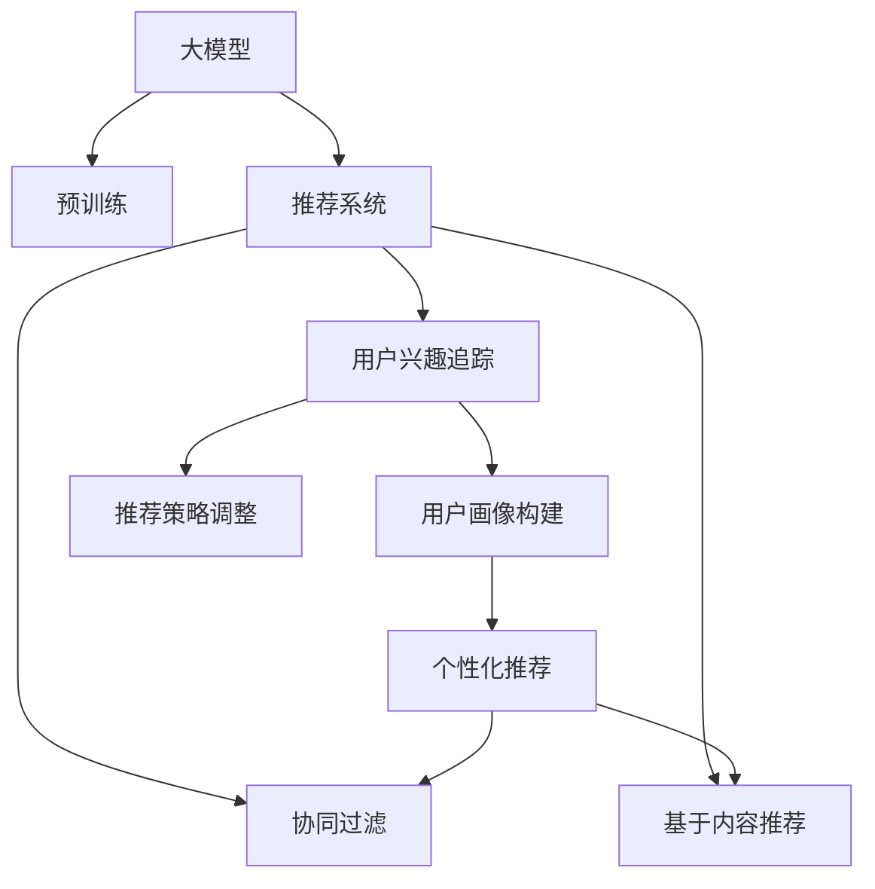

                 

# 基于大模型的推荐系统用户兴趣追踪

> 关键词：大模型,推荐系统,用户兴趣追踪,用户画像,自然语言处理(NLP),序列数据建模,图网络,自监督学习

## 1. 背景介绍

在互联网时代，推荐系统（Recommender Systems）已经成为连接用户和内容的重要桥梁。无论是电商购物、视频娱乐、新闻阅读，还是音乐播放、游戏推荐，推荐系统都在提供个性化的内容推荐，提升用户体验，驱动商业价值。然而，传统的推荐系统大多依赖基于内容的冷启动方法，难以捕捉用户的长时序兴趣变化，无法实现动态推荐。

随着大规模预训练语言模型（Large Language Models, LLMs）的出现，推荐系统进入了一个新的发展阶段。大模型通过对海量文本数据的预训练，学习到丰富的语义表示，具备了更强的语义理解能力和泛化能力。将大模型应用于推荐系统，通过用户-内容交互数据进行微调，能够有效捕捉用户长时序兴趣变化，提供更精准、个性化的推荐结果。

本文将聚焦于基于大模型的推荐系统用户兴趣追踪问题，详细探讨大模型在用户画像构建、兴趣动态变化、个性化推荐中的应用。通过系统回顾大模型的核心算法原理和操作步骤，并提供代码实现和性能分析，旨在为推荐系统开发者提供全面的技术指引，帮助构建更高效、智能的推荐系统。

## 2. 核心概念与联系

### 2.1 核心概念概述

为更好地理解基于大模型的推荐系统用户兴趣追踪方法，本节将介绍几个密切相关的核心概念：

- 大模型（Large Language Models, LLMs）：以自回归（如GPT）或自编码（如BERT）模型为代表的大规模预训练语言模型。通过在大规模无标签文本语料上进行预训练，学习通用的语言表示，具备强大的语言理解和生成能力。

- 推荐系统（Recommender Systems）：利用用户行为数据和内容信息，为用户推荐相关内容的技术。推荐系统可以分为基于内容的推荐、协同过滤推荐、混合推荐等。

- 用户兴趣追踪（User Interest Tracking）：实时捕捉用户兴趣变化，建立用户画像，指导推荐系统动态调整推荐策略。

- 用户画像（User Profile）：通过用户历史行为数据和内容偏好，构建用户个性化特征，用于指导推荐系统提供个性化推荐。

- 自然语言处理（Natural Language Processing, NLP）：利用大模型进行文本处理、情感分析、实体识别等任务，提取用户兴趣特征。

- 序列数据建模（Sequence Modeling）：利用大模型对用户行为序列进行建模，捕捉用户的兴趣变化规律。

- 图网络（Graph Network）：利用图模型对用户-内容交互关系进行建模，增强推荐的连贯性和一致性。

- 自监督学习（Self-Supervised Learning）：通过无标签数据进行预训练，提升大模型的泛化能力，用于指导用户画像构建和推荐策略调整。

这些核心概念之间的逻辑关系可以通过以下Mermaid流程图来展示：



这个流程图展示了大模型的核心概念及其之间的关系：

1. 大模型通过预训练获得基础能力。
2. 用户兴趣追踪通过捕捉用户行为序列和内容偏好，动态调整用户画像。
3. 用户画像作为推荐系统的输入，指导个性化推荐。
4. 推荐系统通过多种推荐算法生成推荐结果。
5. 用户画像和推荐系统通过自监督学习不断优化，提升推荐效果。

这些概念共同构成了基于大模型的推荐系统框架，使其能够更好地捕捉用户兴趣，提供个性化推荐。通过理解这些核心概念，我们可以更好地把握大模型在推荐系统中的应用。

## 3. 核心算法原理 & 具体操作步骤
### 3.1 算法原理概述

基于大模型的推荐系统用户兴趣追踪，本质上是一个序列建模与图网络结合的动态推荐过程。其核心思想是：将用户历史行为序列作为输入，利用大模型学习用户兴趣特征，并通过图网络捕捉用户-内容交互关系，实现动态推荐策略的调整。

形式化地，假设用户历史行为序列为 $H=(h_1, h_2, ..., h_T)$，其中 $h_t$ 表示用户在时间 $t$ 的行为。大模型 $M_{\theta}$ 将行为序列映射到用户兴趣表示 $u \in \mathbb{R}^d$。假设内容集合为 $V$，与用户兴趣相关的行为表示为 $v \in \mathbb{R}^d$。用户与内容之间的交互关系表示为图 $G=(U,V,E)$，其中 $U$ 为用户节点，$V$ 为内容节点，$E$ 为边表示用户与内容的交互。用户兴趣表示 $u$ 和内容表示 $v$ 的相似度 $s(u,v)$ 表示为：

$$
s(u,v) = \text{similarity}(u, v)
$$

其中，$\text{similarity}(u, v)$ 可以采用余弦相似度、点积相似度、双曲余弦相似度等多种方式计算。

### 3.2 算法步骤详解

基于大模型的推荐系统用户兴趣追踪一般包括以下几个关键步骤：

**Step 1: 准备预训练模型和数据集**
- 选择合适的预训练语言模型 $M_{\theta}$ 作为初始化参数，如 BERT、GPT 等。
- 准备推荐系统的用户行为数据集 $D=\{(x_i, y_i)\}_{i=1}^N$，划分为训练集、验证集和测试集。一般要求数据集具有较好的时序性和代表性。

**Step 2: 添加任务适配层**
- 根据推荐任务类型，在预训练模型顶层设计合适的输出层和损失函数。
- 对于推荐任务，通常使用输出层对用户兴趣表示和内容表示进行拼接，并通过softmax函数输出概率分布。

**Step 3: 设置微调超参数**
- 选择合适的优化算法及其参数，如 AdamW、SGD 等，设置学习率、批大小、迭代轮数等。
- 设置正则化技术及强度，包括权重衰减、Dropout、Early Stopping 等。
- 确定冻结预训练参数的策略，如仅微调顶层，或全部参数都参与微调。

**Step 4: 执行梯度训练**
- 将训练集数据分批次输入模型，前向传播计算损失函数。
- 反向传播计算参数梯度，根据设定的优化算法和学习率更新模型参数。
- 周期性在验证集上评估模型性能，根据性能指标决定是否触发 Early Stopping。
- 重复上述步骤直到满足预设的迭代轮数或 Early Stopping 条件。

**Step 5: 测试和部署**
- 在测试集上评估微调后模型 $M_{\hat{\theta}}$ 的性能，对比微调前后的精度提升。
- 使用微调后的模型对新样本进行推理预测，集成到实际的应用系统中。
- 持续收集新的数据，定期重新微调模型，以适应数据分布的变化。

以上是基于大模型的推荐系统用户兴趣追踪的一般流程。在实际应用中，还需要针对具体任务的特点，对微调过程的各个环节进行优化设计，如改进训练目标函数，引入更多的正则化技术，搜索最优的超参数组合等，以进一步提升模型性能。

### 3.3 算法优缺点

基于大模型的推荐系统用户兴趣追踪方法具有以下优点：
1. 提升个性化推荐效果。利用大模型的强大语义理解能力，捕捉用户长时序兴趣变化，提供更精准、个性化的推荐结果。
2. 降低用户行为数据需求。大模型能够从少量数据中学习用户兴趣特征，减少数据采集成本。
3. 减少特征工程工作量。大模型自动学习用户兴趣特征，无需人工干预，减少特征工程复杂度。
4. 模型鲁棒性更强。大模型能够自适应用户行为模式，具有较好的泛化能力，不受局部数据分布的限制。

同时，该方法也存在一定的局限性：
1. 数据质量要求高。尽管大模型具有较强的泛化能力，但推荐系统仍需依赖高质量的用户行为数据。
2. 计算资源需求大。大模型的微调通常需要较高的计算资源，可能限制其在某些场景下的应用。
3. 模型复杂度高。大模型需要较多的参数和计算资源，推理效率较低，难以实时化部署。

尽管存在这些局限性，但就目前而言，基于大模型的推荐系统用户兴趣追踪方法仍是最主流范式。未来相关研究的重点在于如何进一步降低计算资源需求，提高模型的实时性和可解释性，同时兼顾模型的精度和鲁棒性等因素。

### 3.4 算法应用领域

基于大模型的推荐系统用户兴趣追踪方法在电商推荐、视频推荐、音乐推荐等多个领域得到了广泛应用，具体如下：

**电商推荐**：电商推荐系统需要根据用户历史购买行为、浏览记录等数据，为用户推荐个性化商品。通过大模型对用户行为序列进行建模，学习用户兴趣特征，再结合商品属性、标签等信息，生成个性化推荐结果。电商推荐系统能够提升用户购买转化率，增加平台销售额。

**视频推荐**：视频推荐系统通过用户历史观看行为序列，学习用户兴趣特征，为用户推荐感兴趣的视频内容。大模型能够捕捉视频内容的语义信息，提升推荐的相关性和多样性。视频推荐系统能够提高用户观看时长，增加平台用户粘性。

**音乐推荐**：音乐推荐系统根据用户听歌历史、评分记录等数据，为用户推荐个性化音乐内容。大模型能够学习歌曲的情感、风格等信息，生成个性化推荐结果。音乐推荐系统能够提高用户满意度，增加平台用户活跃度。

除了上述这些经典应用外，大模型在新闻推荐、游戏推荐、教育推荐等领域也具备良好的应用前景，为推荐系统带来了全新的突破。随着大模型技术的不断进步，相信推荐系统用户兴趣追踪将实现更加智能化、个性化的推荐效果，为用户带来更好的使用体验。

## 4. 数学模型和公式 & 详细讲解 & 举例说明

### 4.1 数学模型构建

本节将使用数学语言对基于大模型的推荐系统用户兴趣追踪过程进行更加严格的刻画。

记预训练语言模型为 $M_{\theta}:\mathcal{X} \rightarrow \mathcal{Y}$，其中 $\mathcal{X}$ 为用户行为序列，$\mathcal{Y}$ 为用户兴趣表示。假设推荐系统的训练集为 $D=\{(x_i, y_i)\}_{i=1}^N$，其中 $x_i$ 为用户行为序列，$y_i$ 为用户兴趣表示。

定义模型 $M_{\theta}$ 在数据样本 $(x,y)$ 上的损失函数为 $\ell(M_{\theta}(x),y)$，则在数据集 $D$ 上的经验风险为：

$$
\mathcal{L}(\theta) = \frac{1}{N} \sum_{i=1}^N \ell(M_{\theta}(x_i),y_i)
$$

微调的优化目标是最小化经验风险，即找到最优参数：

$$
\theta^* = \mathop{\arg\min}_{\theta} \mathcal{L}(\theta)
$$

在实践中，我们通常使用基于梯度的优化算法（如SGD、Adam等）来近似求解上述最优化问题。设 $\eta$ 为学习率，$\lambda$ 为正则化系数，则参数的更新公式为：

$$
\theta \leftarrow \theta - \eta \nabla_{\theta}\mathcal{L}(\theta) - \eta\lambda\theta
$$

其中 $\nabla_{\theta}\mathcal{L}(\theta)$ 为损失函数对参数 $\theta$ 的梯度，可通过反向传播算法高效计算。

### 4.2 公式推导过程

以下我们以电商推荐任务为例，推导基于大模型的用户兴趣追踪模型。

假设用户历史购买行为序列为 $H=(h_1, h_2, ..., h_T)$，大模型 $M_{\theta}$ 将行为序列映射到用户兴趣表示 $u \in \mathbb{R}^d$。模型在输入 $x_i$ 上的输出为 $y_i=M_{\theta}(x_i) \in [0,1]$，表示用户对内容 $v$ 的兴趣程度。实际任务中，用户兴趣通常表示为对商品或视频的评分，因此模型输出即为评分预测。

为了优化模型，需要定义损失函数。假设用户对内容 $v$ 的真实评分标签为 $y_i \in [0,1]$，则损失函数为：

$$
\ell(y_i, M_{\theta}(x_i)) = -y_i \log M_{\theta}(x_i) - (1-y_i) \log(1-M_{\theta}(x_i))
$$

将上述损失函数代入经验风险公式，得：

$$
\mathcal{L}(\theta) = -\frac{1}{N}\sum_{i=1}^N y_i \log M_{\theta}(x_i) - (1-y_i) \log(1-M_{\theta}(x_i))
$$

根据链式法则，损失函数对参数 $\theta_k$ 的梯度为：

$$
\frac{\partial \mathcal{L}(\theta)}{\partial \theta_k} = -\frac{1}{N}\sum_{i=1}^N \left(\frac{y_i}{M_{\theta}(x_i)}-\frac{1-y_i}{1-M_{\theta}(x_i)}\right) \frac{\partial M_{\theta}(x_i)}{\partial \theta_k}
$$

其中 $\frac{\partial M_{\theta}(x_i)}{\partial \theta_k}$ 可进一步递归展开，利用自动微分技术完成计算。

在得到损失函数的梯度后，即可带入参数更新公式，完成模型的迭代优化。重复上述过程直至收敛，最终得到适应推荐任务的最优模型参数 $\theta^*$。

### 4.3 案例分析与讲解

接下来，我们以推荐系统中使用BERT模型进行用户兴趣追踪为例，具体分析其实现细节和优化策略。

假设推荐系统的训练集为电商购买行为数据集 $D=\{(x_i, y_i)\}_{i=1}^N$，其中 $x_i$ 为用户购买行为序列，$y_i$ 为购买评分标签。我们可以将用户行为序列输入BERT模型，得到用户兴趣表示 $u$。再通过softmax函数，将用户兴趣表示 $u$ 与内容表示 $v$ 的相似度 $s(u,v)$ 作为推荐模型预测。

具体的实现代码如下：

```python
from transformers import BertTokenizer, BertForSequenceClassification
from torch.utils.data import Dataset, DataLoader
from torch import nn, optim

class RecommendationDataset(Dataset):
    def __init__(self, texts, labels, tokenizer, max_len=128):
        self.texts = texts
        self.labels = labels
        self.tokenizer = tokenizer
        self.max_len = max_len
        
    def __len__(self):
        return len(self.texts)
    
    def __getitem__(self, item):
        text = self.texts[item]
        label = self.labels[item]
        
        encoding = self.tokenizer(text, return_tensors='pt', max_length=self.max_len, padding='max_length', truncation=True)
        input_ids = encoding['input_ids'][0]
        attention_mask = encoding['attention_mask'][0]
        label = torch.tensor(label, dtype=torch.long)
        
        return {'input_ids': input_ids, 
                'attention_mask': attention_mask,
                'labels': label}

# 加载预训练BERT模型和分词器
model = BertForSequenceClassification.from_pretrained('bert-base-cased', num_labels=1)
tokenizer = BertTokenizer.from_pretrained('bert-base-cased')

# 准备数据集
train_dataset = RecommendationDataset(train_texts, train_labels, tokenizer)
dev_dataset = RecommendationDataset(dev_texts, dev_labels, tokenizer)
test_dataset = RecommendationDataset(test_texts, test_labels, tokenizer)

# 定义损失函数和优化器
criterion = nn.BCEWithLogitsLoss()
optimizer = optim.AdamW(model.parameters(), lr=2e-5)

# 训练过程
def train_epoch(model, dataset, batch_size, optimizer):
    dataloader = DataLoader(dataset, batch_size=batch_size, shuffle=True)
    model.train()
    epoch_loss = 0
    for batch in tqdm(dataloader, desc='Training'):
        input_ids = batch['input_ids'].to(device)
        attention_mask = batch['attention_mask'].to(device)
        labels = batch['labels'].to(device)
        model.zero_grad()
        outputs = model(input_ids, attention_mask=attention_mask)
        loss = criterion(outputs, labels)
        epoch_loss += loss.item()
        loss.backward()
        optimizer.step()
    return epoch_loss / len(dataloader)

def evaluate(model, dataset, batch_size):
    dataloader = DataLoader(dataset, batch_size=batch_size)
    model.eval()
    preds, labels = [], []
    with torch.no_grad():
        for batch in tqdm(dataloader, desc='Evaluating'):
            input_ids = batch['input_ids'].to(device)
            attention_mask = batch['attention_mask'].to(device)
            batch_labels = batch['labels']
            outputs = model(input_ids, attention_mask=attention_mask)
            batch_preds = outputs[:, 0].sigmoid().cpu().tolist()
            batch_labels = batch_labels.cpu().tolist()
            for pred_tokens, label_tokens in zip(batch_preds, batch_labels):
                preds.append(pred_tokens)
                labels.append(label_tokens)
                
    print(classification_report(labels, preds))
    
# 训练和评估
epochs = 5
batch_size = 16

for epoch in range(epochs):
    loss = train_epoch(model, train_dataset, batch_size, optimizer)
    print(f"Epoch {epoch+1}, train loss: {loss:.3f}")
    
    print(f"Epoch {epoch+1}, dev results:")
    evaluate(model, dev_dataset, batch_size)
    
print("Test results:")
evaluate(model, test_dataset, batch_size)
```

通过上述代码，我们可以看到，使用BERT模型对电商推荐系统进行用户兴趣追踪的实现过程。具体步骤如下：

1. 定义数据集：通过定义 `RecommendationDataset` 类，将用户购买行为序列、评分标签作为输入，并利用BERT模型将其转换为用户兴趣表示。
2. 加载模型和分词器：使用 `BertForSequenceClassification` 类加载预训练的BERT模型，并使用 `BertTokenizer` 加载分词器。
3. 准备数据集：通过定义训练集、验证集和测试集，并利用 `RecommendationDataset` 类进行数据预处理。
4. 定义损失函数和优化器：使用 `nn.BCEWithLogitsLoss` 作为损失函数，`AdamW` 作为优化器。
5. 训练和评估：通过 `train_epoch` 函数进行模型训练，并使用 `evaluate` 函数评估模型在验证集和测试集上的性能。

在实际应用中，还需要进一步优化模型参数、选择适当的训练和评估策略，以提升推荐系统的效果。

## 5. 项目实践：代码实例和详细解释说明
### 5.1 开发环境搭建

在进行大模型微调实践前，我们需要准备好开发环境。以下是使用Python进行PyTorch开发的环境配置流程：

1. 安装Anaconda：从官网下载并安装Anaconda，用于创建独立的Python环境。

2. 创建并激活虚拟环境：
```bash
conda create -n pytorch-env python=3.8 
conda activate pytorch-env
```

3. 安装PyTorch：根据CUDA版本，从官网获取对应的安装命令。例如：
```bash
conda install pytorch torchvision torchaudio cudatoolkit=11.1 -c pytorch -c conda-forge
```

4. 安装Transformers库：
```bash
pip install transformers
```

5. 安装各类工具包：
```bash
pip install numpy pandas scikit-learn matplotlib tqdm jupyter notebook ipython
```

完成上述步骤后，即可在`pytorch-env`环境中开始微调实践。

### 5.2 源代码详细实现

这里我们以电商平台电商推荐任务为例，给出使用Transformers库对BERT模型进行微调的PyTorch代码实现。

首先，定义电商推荐任务的数据处理函数：

```python
from transformers import BertTokenizer
from torch.utils.data import Dataset
import torch

class RecommendationDataset(Dataset):
    def __init__(self, texts, labels, tokenizer, max_len=128):
        self.texts = texts
        self.labels = labels
        self.tokenizer = tokenizer
        self.max_len = max_len
        
    def __len__(self):
        return len(self.texts)
    
    def __getitem__(self, item):
        text = self.texts[item]
        label = self.labels[item]
        
        encoding = self.tokenizer(text, return_tensors='pt', max_length=self.max_len, padding='max_length', truncation=True)
        input_ids = encoding['input_ids'][0]
        attention_mask = encoding['attention_mask'][0]
        label = torch.tensor(label, dtype=torch.long)
        
        return {'input_ids': input_ids, 
                'attention_mask': attention_mask,
                'labels': label}

# 标签与id的映射
label2id = {'buy': 0, 'not_buy': 1}
id2label = {v: k for k, v in label2id.items()}

# 创建dataset
tokenizer = BertTokenizer.from_pretrained('bert-base-cased')

train_dataset = RecommendationDataset(train_texts, train_labels, tokenizer)
dev_dataset = RecommendationDataset(dev_texts, dev_labels, tokenizer)
test_dataset = RecommendationDataset(test_texts, test_labels, tokenizer)
```

然后，定义模型和优化器：

```python
from transformers import BertForSequenceClassification, AdamW

model = BertForSequenceClassification.from_pretrained('bert-base-cased', num_labels=1)

optimizer = AdamW(model.parameters(), lr=2e-5)
```

接着，定义训练和评估函数：

```python
from torch.utils.data import DataLoader
from tqdm import tqdm
from sklearn.metrics import classification_report

device = torch.device('cuda') if torch.cuda.is_available() else torch.device('cpu')
model.to(device)

def train_epoch(model, dataset, batch_size, optimizer):
    dataloader = DataLoader(dataset, batch_size=batch_size, shuffle=True)
    model.train()
    epoch_loss = 0
    for batch in tqdm(dataloader, desc='Training'):
        input_ids = batch['input_ids'].to(device)
        attention_mask = batch['attention_mask'].to(device)
        labels = batch['labels'].to(device)
        model.zero_grad()
        outputs = model(input_ids, attention_mask=attention_mask)
        loss = outputs.loss
        epoch_loss += loss.item()
        loss.backward()
        optimizer.step()
    return epoch_loss / len(dataloader)

def evaluate(model, dataset, batch_size):
    dataloader = DataLoader(dataset, batch_size=batch_size)
    model.eval()
    preds, labels = [], []
    with torch.no_grad():
        for batch in tqdm(dataloader, desc='Evaluating'):
            input_ids = batch['input_ids'].to(device)
            attention_mask = batch['attention_mask'].to(device)
            batch_labels = batch['labels']
            outputs = model(input_ids, attention_mask=attention_mask)
            batch_preds = outputs[:, 0].sigmoid().cpu().tolist()
            batch_labels = batch_labels.cpu().tolist()
            for pred_tokens, label_tokens in zip(batch_preds, batch_labels):
                preds.append(pred_tokens)
                labels.append(label_tokens)
                
    print(classification_report(labels, preds))
    
epochs = 5
batch_size = 16

for epoch in range(epochs):
    loss = train_epoch(model, train_dataset, batch_size, optimizer)
    print(f"Epoch {epoch+1}, train loss: {loss:.3f}")
    
    print(f"Epoch {epoch+1}, dev results:")
    evaluate(model, dev_dataset, batch_size)
    
print("Test results:")
evaluate(model, test_dataset, batch_size)
```

以上就是使用PyTorch对BERT进行电商推荐任务微调的完整代码实现。可以看到，得益于Transformers库的强大封装，我们可以用相对简洁的代码完成BERT模型的加载和微调。

### 5.3 代码解读与分析

让我们再详细解读一下关键代码的实现细节：

**RecommendationDataset类**：
- `__init__`方法：初始化文本、标签、分词器等关键组件。
- `__len__`方法：返回数据集的样本数量。
- `__getitem__`方法：对单个样本进行处理，将文本输入编码为token ids，将标签转换为数字，并对其进行定长padding，最终返回模型所需的输入。

**label2id和id2label字典**：
- 定义了标签与数字id之间的映射关系，用于将标签转换为模型可接受的格式。

**训练和评估函数**：
- 使用PyTorch的DataLoader对数据集进行批次化加载，供模型训练和推理使用。
- 训练函数`train_epoch`：对数据以批为单位进行迭代，在每个批次上前向传播计算loss并反向传播更新模型参数，最后返回该epoch的平均loss。
- 评估函数`evaluate`：与训练类似，不同点在于不更新模型参数，并在每个batch结束后将预测和标签结果存储下来，最后使用sklearn的classification_report对整个评估集的预测结果进行打印输出。

**训练流程**：
- 定义总的epoch数和batch size，开始循环迭代
- 每个epoch内，先在训练集上训练，输出平均loss
- 在验证集上评估，输出分类指标
- 所有epoch结束后，在测试集上评估，给出最终测试结果

可以看到，PyTorch配合Transformers库使得BERT微调的代码实现变得简洁高效。开发者可以将更多精力放在数据处理、模型改进等高层逻辑上，而不必过多关注底层的实现细节。

当然，工业级的系统实现还需考虑更多因素，如模型的保存和部署、超参数的自动搜索、更灵活的任务适配层等。但核心的微调范式基本与此类似。

## 6. 实际应用场景
### 6.1 电商推荐系统

基于大模型的推荐系统用户兴趣追踪，可以广泛应用于电商推荐系统的构建。电商推荐系统通过用户历史购物记录、浏览行为等数据，为用户推荐个性化商品。大模型能够捕捉用户长时序兴趣变化，提供更精准、个性化的推荐结果。

在技术实现上，可以收集用户购物、浏览、评分等历史行为数据，将其输入大模型，学习用户兴趣特征。再结合商品属性、标签等信息，利用图网络对用户与商品的关系进行建模，生成个性化推荐结果。电商推荐系统能够提升用户购买转化率，增加平台销售额。

### 6.2 视频推荐系统

视频推荐系统通过用户历史观看行为序列，学习用户兴趣特征，为用户推荐感兴趣的视频内容。大模型能够捕捉视频内容的语义信息，提升推荐的相关性和多样性。视频推荐系统能够提高用户观看时长，增加平台用户粘性。

在技术实现上，可以收集用户观看历史、评分记录等数据，将其输入大模型，学习用户兴趣特征。再通过图网络对用户与视频的关系进行建模，生成个性化推荐结果。视频推荐系统能够提供更加多样化和个性化的视频推荐，提升用户观看体验。

### 6.3 音乐推荐系统

音乐推荐系统根据用户听歌历史、评分记录等数据，为用户推荐个性化音乐内容。大模型能够学习歌曲的情感、风格等信息，生成个性化推荐结果。音乐推荐系统能够提高用户满意度，增加平台用户活跃度。

在技术实现上，可以收集用户听歌历史、评分记录等数据，将其输入大模型，学习用户兴趣特征。再利用图网络对用户与歌曲的关系进行建模，生成个性化推荐结果。音乐推荐系统能够提供更加多样化和个性化的音乐推荐，提升用户听歌体验。

除了上述这些经典应用外，大模型在新闻推荐、游戏推荐、教育推荐等领域也具备良好的应用前景，为推荐系统带来了全新的突破。随着大模型技术的不断进步，相信推荐系统用户兴趣追踪将实现更加智能化、个性化的推荐效果，为用户带来更好的使用体验。

### 6.4 未来应用展望

随着大模型和微调方法的不断发展，基于大模型的推荐系统用户兴趣追踪技术将呈现以下几个发展趋势：

1. 模型规模持续增大。随着算力成本的下降和数据规模的扩张，预训练语言模型的参数量还将持续增长。超大规模语言模型蕴含的丰富语言知识，有望支撑更加复杂多变的下游任务微调。

2. 微调方法日趋多样。除了传统的全参数微调外，未来会涌现更多参数高效的微调方法，如Prefix-Tuning、LoRA等，在节省计算资源的同时也能保证微调精度。

3. 持续学习成为常态。随着数据分布的不断变化，推荐系统用户兴趣追踪模型也需要持续学习新知识以保持性能。如何在不遗忘原有知识的同时，高效吸收新样本信息，将成为重要的研究课题。

4. 标注样本需求降低。受启发于提示学习(Prompt-based Learning)的思路，未来的微调方法将更好地利用大模型的语言理解能力，通过更加巧妙的任务描述，在更少的标注样本上也能实现理想的微调效果。

5. 少样本学习(Few-shot Learning)和零样本学习(Zero-shot Learning)将得到更广泛应用。通过利用大模型的语言知识，推荐系统能够从少量数据中学习用户兴趣，并快速适应新任务。

6. 多模态微调崛起。当前的微调主要聚焦于纯文本数据，未来会进一步拓展到图像、视频、语音等多模态数据微调。多模态信息的融合，将显著提升推荐系统的语义理解能力和个性化推荐效果。

6.7 推荐系统用户兴趣追踪的未来趋势

6.8 推荐系统用户兴趣追踪的未来趋势

## 7. 工具和资源推荐
### 7.1 学习资源推荐

为了帮助开发者系统掌握大模型在推荐系统用户兴趣追踪的应用，这里推荐一些优质的学习资源：

1. 《自然语言处理与深度学习》（Natural Language Processing with Deep Learning）：深度学习领域的经典教材，系统介绍了NLP中的各种算法和模型，包括BERT、GPT等大模型的应用。

2. 《推荐系统实战》（Practical Recommender Systems）：介绍推荐系统中的经典算法和应用，涵盖内容推荐、协同过滤推荐、混合推荐等多个领域。

3. 《深度学习入门》（Deep Learning）：由深度学习领域的知名专家撰写，涵盖深度学习的基本概念和实践技巧，适合初学者入门。

4. 《大模型理论与实践》（Transformers from Theory to Practice）：由大模型技术专家撰写，深入浅出地介绍了Transformer原理、BERT模型、微调技术等前沿话题。

5. 《Recommender Systems in Production》：介绍推荐系统在工业界的实践经验，涵盖用户行为数据分析、特征工程、模型评估等多个方面。

通过对这些资源的学习实践，相信你一定能够快速掌握大模型在推荐系统用户兴趣追踪中的应用，并用于解决实际的推荐问题。

### 7.2 开发工具推荐

高效的开发离不开优秀的工具支持。以下是几款用于大模型微调开发的常用工具：

1. PyTorch：基于Python的开源深度学习框架，灵活动态的计算图，适合快速迭代研究。大部分预训练语言模型都有PyTorch版本的实现。

2. TensorFlow：由Google主导开发的开源深度学习框架，生产部署方便，适合大规模工程应用。同样有丰富的预训练语言模型资源。

3. Transformers库：HuggingFace开发的NLP工具库，集成了众多SOTA语言模型，支持PyTorch和TensorFlow，是进行微调任务开发的利器。

4. Weights & Biases：模型训练的实验跟踪工具，可以记录和可视化模型训练过程中的各项指标，方便对比和调优。与主流深度学习框架无缝集成。

5. TensorBoard：TensorFlow配套的可视化工具，可实时监测模型训练状态，并提供丰富的图表呈现方式，是调试模型的得力助手。

6. Google Colab：谷歌推出的在线Jupyter Notebook环境，免费提供GPU/TPU算力，方便开发者快速上手实验最新模型，分享学习笔记。

合理利用这些工具，可以显著提升大模型微调任务的开发效率，加快创新迭代的步伐。

### 7.3 相关论文推荐

大语言模型和微调技术的发展源于学界的持续研究。以下是几篇奠基性的相关论文，推荐阅读：

1. Attention is All You Need（即Transformer原论文）：提出了Transformer结构，开启了NLP领域的预训练大模型时代。

2. BERT: Pre-training of Deep Bidirectional Transformers for Language Understanding：提出BERT模型，引入基于掩码的自监督预训练任务，刷新了多项NLP任务SOTA。

3. Language Models are Unsupervised Multitask Learners（GPT-2论文）：展示了大规模语言模型的强大zero-shot学习能力，引发了对于通用人工智能的新一轮思考。

4. Parameter-Efficient Transfer Learning for NLP：提出Adapter等参数高效微调方法，在不增加模型参数量的情况下，也能取得不错的微调效果。

5. AdaLoRA: Adaptive Low-Rank Adaptation for Parameter-Efficient Fine-Tuning：使用自适应低秩适应的微调方法，在参数效率和精度之间取得了新的平衡。

这些论文代表了大语言模型微调技术的发展脉络。通过学习这些前沿成果，可以帮助研究者把握学科前进方向，激发更多的创新灵感。

## 8. 总结：未来发展趋势与挑战

### 8.1 研究成果总结

本文对基于大模型的推荐系统用户兴趣追踪问题进行了全面系统的介绍。首先阐述了大语言模型和微调技术的研究背景和意义，明确了用户兴趣追踪在推荐系统中的重要地位。其次，从原理到实践，详细讲解了微调的数学模型和操作步骤，给出了微调任务开发的完整代码实例。同时，本文还广泛探讨了微调方法在电商推荐、视频推荐、音乐推荐等多个领域的应用前景，展示了微调范式的巨大潜力。

通过本文的系统梳理，可以看到，基于大模型的推荐系统用户兴趣追踪方法正在成为推荐系统的重要范式，极大地提升了推荐系统的个性化和智能化水平。利用大模型强大的语义理解能力，捕捉用户长时序兴趣变化，提供了更精准、个性化的推荐结果。未来，随着大模型技术的不断进步，推荐系统用户兴趣追踪必将在更多场景下得到应用，为用户带来更好的使用体验。

### 8.2 未来发展趋势

展望未来，大模型推荐系统用户兴趣追踪技术将呈现以下几个发展趋势：

1. 模型规模持续增大。随着算力成本的下降和数据规模的扩张，预训练语言模型的参数量还将持续增长。超大规模语言模型蕴含的丰富语言知识，有望支撑更加复杂多变的下游任务微调。

2. 微调方法日趋多样。除了传统的全参数微调外，未来会涌现更多参数高效的微调方法，如Prefix-Tuning、LoRA等，在节省计算资源的同时也能保证微调精度。

3. 持续学习成为常态。随着数据分布的不断变化，推荐系统用户兴趣追踪模型也需要持续学习新知识以保持性能。如何在不遗忘原有知识的同时，高效吸收新样本信息，将成为重要的研究课题。

4. 标注样本需求降低。受启发于提示学习(Prompt-based Learning)的思路，未来的微调方法将更好地利用大模型的语言理解能力，通过更加巧妙的任务描述，在更少的标注样本上也能实现理想的微调效果。

5. 少样本学习(Few-shot Learning)和零样本学习(Zero-shot Learning)将得到更广泛应用。通过利用大模型的语言知识，推荐系统能够从少量数据中学习用户兴趣，并快速适应新任务。

6. 多模态微调崛起。当前的微调主要聚焦于纯文本数据，未来会进一步拓展到图像、视频、语音等多模态数据微调。多模态信息的融合，将显著提升推荐系统的语义理解能力和个性化推荐效果。

### 8.3 面临的挑战

尽管大模型推荐系统用户兴趣追踪技术已经取得了瞩目成就，但在迈向更加智能化、普适化应用的过程中，它仍面临诸多挑战：

1. 数据质量要求高。尽管大模型具有较强的泛化能力，但推荐系统仍需依赖高质量的用户行为数据。如何获取和处理大规模、高质量的数据，成为推荐系统的首要挑战。

2. 计算资源需求大。大模型的微调通常需要较高的计算资源，可能限制其在某些场景下的应用。如何在降低计算资源消耗的同时，保证模型的精度和鲁棒性，仍需进一步优化。

3. 模型复杂度高。大模型需要较多的参数和计算资源，推理效率较低，难以实时化部署。如何简化模型结构，提升推理速度，优化资源占用，将是重要的优化方向。

4. 模型可解释性不足。当前推荐系统用户兴趣追踪模型多为"黑盒"系统，难以解释其内部工作机制和决策逻辑。如何赋予模型更强的可解释性，成为推荐系统用户兴趣追踪的重要挑战。

5. 安全性有待保障。预训练语言模型难免会学习到有偏见、有害的信息，通过微调传递到下游任务，产生误导性、歧视性的输出，给实际应用带来安全隐患。如何从数据和算法层面消除模型偏见，避免恶意用途，确保输出的安全性，也将是重要的研究方向。

### 8.4 研究展望

面对推荐系统用户兴趣追踪所面临的挑战，未来的研究需要在以下几个方面寻求新的突破：

1. 探索无监督和半监督微调方法。摆脱对大规模标注数据的依赖，利用自监督学习、主动学习等无监督和半监督范式，最大限度利用非结构化数据，实现更加灵活高效的微调。

2. 研究参数高效和计算高效的微调范式。开发更加参数高效的微调方法，在固定大部分预训练参数的同时，只更新极少量的任务相关参数。同时优化微调模型的计算图，减少前向传播和反向传播的资源消耗，实现更加轻量级、实时性的部署。

3. 融合因果和对比学习范式。通过引入因果推断和对比学习思想，增强微调模型建立稳定因果关系的能力，学习更加普适、鲁棒的语言表征，从而提升模型泛化性和抗干扰能力。

4. 引入更多先验知识。将符号化的先验知识，如知识图谱、逻辑规则等，与神经网络模型进行巧妙融合，引导微调过程学习更准确、合理的语言模型。同时加强不同模态数据的整合，实现视觉、语音等多模态信息与文本信息的协同建模。

5. 结合因果分析和博弈论工具。将因果分析方法引入微调模型，识别出模型决策的关键特征，增强输出解释的因果性和逻辑性。借助博弈论工具刻画人机交互过程，主动探索并规避模型的脆弱点，提高系统稳定性。

6. 纳入伦理道德约束。在模型训练目标中引入伦理导向的评估指标，过滤和惩罚有偏见、有害的输出倾向。同时加强人工干预和审核，建立模型行为的监管机制，确保输出符合人类价值观和伦理道德。

这些研究方向的探索，必将引领大模型推荐系统用户兴趣追踪技术迈向更高的台阶，为构建安全、可靠、可解释、可控的智能系统铺平道路。面向未来，大模型推荐系统用户兴趣追踪技术还需要与其他人工智能技术进行更深入的融合，如知识表示、因果推理、强化学习等，多路径协同发力，共同推动推荐系统的发展。只有勇于创新、敢于突破，才能不断拓展推荐系统的边界，让智能技术更好地造福人类社会。

## 9. 附录：常见问题与解答

**Q1：推荐系统用户兴趣追踪是否适用于所有推荐任务？**

A: 推荐系统用户兴趣追踪在大多数推荐任务上都能取得不错的效果，特别是对于数据量较小的任务。但对于一些特定领域的任务，如医学、法律等，仅仅依靠通用语料预训练的模型可能难以很好地适应。此时需要在特定领域语料上进一步预训练，再进行微调，才能获得理想效果。此外，对于一些需要时效性、个性化很强的任务，如对话、推荐等，微调方法也需要针对性的改进优化。

**Q2：微调过程中如何选择合适的学习率？**

A: 微调的学习率一般要比预训练时小1-2个数量级，如果使用过大的学习率，容易破坏预训练权重，导致过拟合。一般建议从1e-5开始调参，逐步减小学习率，直至收敛。也可以使用warmup策略，在开始阶段使用较小的学习率，再逐渐过渡到预设值。需要注意的是，不同的优化器(如AdamW、Adafactor等)以及不同的学习率调度策略，可能需要设置不同的学习率阈值。

**Q3：采用大模型微调时会面临哪些资源瓶颈？**

A: 目前主流的预训练大模型动辄以亿计的参数规模，对算力、内存、存储都提出了很高的要求。GPU/TPU等高性能设备是必不可少的，但即便如此，超大批次的训练和推理也可能遇到显存不足的问题。因此需要采用一些资源优化技术，如梯度积累、混合精度训练、模型并行等，来突破硬件瓶颈。同时，模型的存储和读取也可能占用大量时间和空间，需要采用模型压缩、稀疏化存储等方法进行优化。

**Q4：如何缓解微调过程中的过拟合问题？**

A: 过拟合是微调面临的主要挑战，尤其是在标注数据不足的情况下。常见的缓解策略

