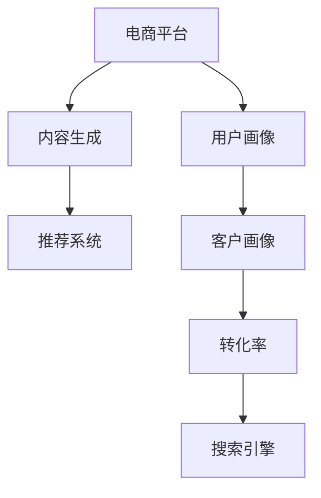

                 

# 基于大模型的电商平台内容营销

> 关键词：电商平台,内容营销,大模型,推荐系统,搜索引擎,转化率,用户行为,客户画像,自动化内容生成

## 1. 背景介绍

### 1.1 问题由来

随着电子商务的蓬勃发展，电商平台已成为商品销售、品牌展示的重要渠道。然而，面对日益激烈的竞争，如何在有限的展示资源下，最大化提升用户转化率和平台收益，成为电商企业亟需解决的问题。传统的内容营销方法依赖于人工策划和编辑，不仅成本高昂，且难以动态适配用户需求。因此，如何利用先进的技术手段，实现电商平台的自动化内容生成和精准推荐，提升用户互动体验，是电商企业转型升级的关键。

### 1.2 问题核心关键点

大模型在内容营销中的应用，其核心在于利用深度学习技术，对海量用户数据进行学习和建模，从而实现个性化推荐和自动化内容生成。具体来说，关键点包括以下几个方面：

- 用户行为数据的收集与分析：通过电商平台的用户浏览、购买、评价等行为数据，构建用户画像，挖掘用户兴趣和需求。
- 内容生成模型的训练与优化：基于用户画像，训练大模型进行商品描述、评论生成等任务，提升内容自然度和吸引力。
- 推荐系统的构建与调优：将用户画像和商品特征输入推荐模型，生成个性化推荐结果，优化电商平台的商品布局和推荐策略。
- 自动化内容的部署与应用：将生成和推荐的结果集成到电商平台，提升用户体验和转化率。

### 1.3 问题研究意义

大模型在电商平台内容营销中的应用，对于提升电商平台的运营效率、降低内容生成成本、提高用户满意度具有重要意义：

1. 提升运营效率：通过自动化内容生成和推荐，大幅降低人工编辑成本，释放更多资源用于业务拓展和客户服务。
2. 优化用户体验：利用用户画像和个性化推荐，精准匹配用户需求，提升用户满意度和转化率，提升品牌竞争力。
3. 降低内容成本：减少人工编辑的劳动强度和时间成本，实现内容生产的规模化和标准化。
4. 增强用户粘性：通过个性化内容和互动，增加用户停留时间，提升平台忠诚度和用户粘性。
5. 提升收益水平：通过精准推荐，提高用户转化率和复购率，为电商企业带来更高的收益。

## 2. 核心概念与联系

### 2.1 核心概念概述

为更好地理解基于大模型的电商平台内容营销方法，本节将介绍几个密切相关的核心概念：

- **电商平台**：提供在线商品展示、交易、评论、评分等功能，连接买家和卖家，提供商品搜索、推荐等服务。
- **内容营销**：通过生成高质量、有吸引力的内容，提升用户对品牌的认知度和信任度，增加转化率和客户粘性。
- **大模型**：基于深度学习技术训练的庞大神经网络模型，具有强大的数据建模和预测能力。
- **推荐系统**：利用用户行为和商品特征，为用户推荐个性化商品或内容，提高用户满意度和平台收益。
- **搜索引擎**：基于自然语言处理和深度学习技术，实现商品搜索和推荐功能的系统。
- **转化率**：指用户从浏览到购买的过程转换率，反映电商平台的运营效果和用户满意度。
- **用户画像**：通过分析用户行为数据，构建用户画像，提供用户兴趣、偏好、行为特征等。
- **客户画像**：在用户画像的基础上，进一步分析客户价值、忠诚度、流失风险等。
- **自动化内容生成**：利用深度学习技术，自动生成商品描述、评论、推荐文案等内容。

这些核心概念之间的逻辑关系可以通过以下Mermaid流程图来展示：



这个流程图展示了大模型在电商平台内容营销中的核心概念及其之间的关系：

1. 电商平台收集用户数据，通过用户画像和客户画像，构建用户行为模型。
2. 利用大模型进行内容生成和推荐，提高内容质量和用户满意度。
3. 结合搜索引擎技术，提升用户查找商品的便利性和准确性。
4. 最终，通过提升转化率和用户体验，实现电商平台的收益最大化。

## 3. 核心算法原理 & 具体操作步骤
### 3.1 算法原理概述

基于大模型的电商平台内容营销方法，主要包括以下几个步骤：

1. **数据收集与预处理**：收集电商平台的用户行为数据、商品特征等，进行清洗、标注和预处理。
2. **用户画像建模**：利用机器学习算法，如聚类、分类等，构建用户画像，挖掘用户兴趣和需求。
3. **内容生成模型训练**：基于用户画像，训练大模型进行内容生成，如商品描述、评论、推荐文案等。
4. **推荐系统构建与优化**：将用户画像和商品特征输入推荐模型，生成个性化推荐结果，优化商品布局和推荐策略。
5. **内容部署与应用**：将生成和推荐的内容集成到电商平台，提升用户体验和转化率。

### 3.2 算法步骤详解

以下详细介绍基于大模型的电商平台内容营销方法的具体操作步骤：

**Step 1: 数据收集与预处理**

1. **数据收集**：从电商平台获取用户行为数据，如浏览记录、购买记录、评价记录等。同时收集商品特征，如价格、类别、品牌等。

2. **数据清洗与标注**：对收集到的数据进行去重、去噪、缺失值填补等清洗操作。标注用户的兴趣、需求等标签，如喜欢、不喜欢、无感等。

3. **数据划分**：将数据划分为训练集、验证集和测试集，保证模型训练、验证和测试的独立性。

**Step 2: 用户画像建模**

1. **特征工程**：提取用户行为数据中的关键特征，如浏览时长、购买频率、评分等，构建特征向量。

2. **聚类与分类**：利用K-means、LDA等聚类算法，或Logistic回归、决策树等分类算法，构建用户画像。

3. **画像扩展**：通过社交网络、兴趣标签等外部数据源，进一步扩展用户画像。

**Step 3: 内容生成模型训练**

1. **模型选择**：选择合适的预训练语言模型，如GPT-3、BERT等，作为内容生成模型的初始化参数。

2. **任务适配**：根据内容生成任务设计任务适配层，如语言模型解码器、文本生成器等。

3. **模型微调**：利用用户画像和商品特征，对预训练模型进行微调，优化生成效果。

**Step 4: 推荐系统构建与优化**

1. **推荐模型选择**：选择合适的推荐算法，如协同过滤、矩阵分解、深度学习等，作为推荐系统的初始化模型。

2. **特征融合**：将用户画像和商品特征进行融合，生成综合特征向量。

3. **模型训练与优化**：利用综合特征向量训练推荐模型，优化模型参数。

**Step 5: 内容部署与应用**

1. **内容集成**：将生成和推荐的内容集成到电商平台，如商品描述、评论、推荐文案等。

2. **效果评估**：利用A/B测试等方法，评估内容营销的效果，如转化率、用户满意度等。

3. **持续优化**：根据评估结果，不断优化内容生成和推荐策略，提升用户体验和转化率。

### 3.3 算法优缺点

基于大模型的电商平台内容营销方法具有以下优点：

1. **高自动化**：通过自动化内容生成和推荐，大幅降低人工编辑成本，提高内容生成效率。
2. **高个性化**：利用用户画像和推荐系统，实现个性化内容推荐，提高用户满意度和转化率。
3. **高覆盖率**：大模型具备强大的数据建模能力，可以覆盖更多的用户需求和商品特性。
4. **高灵活性**：根据电商平台的业务需求，灵活调整内容生成和推荐策略，适应不同的业务场景。

同时，该方法也存在一定的局限性：

1. **数据依赖性高**：需要大量的用户行为数据和商品特征，数据获取和处理成本较高。
2. **模型复杂度高**：大模型参数量巨大，训练和推理资源消耗较高。
3. **可解释性不足**：大模型内部的决策逻辑复杂，难以解释其内容生成的过程和原因。
4. **对抗攻击风险**：用户生成的对抗性内容可能会对推荐系统造成干扰，降低推荐效果。

尽管存在这些局限性，但大模型在电商平台内容营销中的应用仍然具有显著优势，未来仍有巨大的发展潜力。

### 3.4 算法应用领域

基于大模型的电商平台内容营销方法，已经在各大电商平台得到广泛应用，例如：

1. **商品描述生成**：利用大模型自动生成商品描述，提升商品展示效果。
2. **用户评论生成**：基于用户画像，自动生成商品评价，提升用户互动体验。
3. **个性化推荐**：根据用户画像和商品特征，生成个性化推荐结果，提升用户转化率和粘性。
4. **内容营销策略优化**：利用内容营销效果数据，优化内容生成和推荐策略。
5. **搜索引擎优化**：通过自然语言处理和深度学习技术，优化商品搜索和推荐功能。

除了上述这些经典应用外，大模型还被创新性地应用到更多场景中，如智能客服、商品推荐、用户画像构建等，为电商平台的运营提供了新的技术支撑。

## 4. 数学模型和公式 & 详细讲解 & 举例说明

### 4.1 数学模型构建

本节将使用数学语言对基于大模型的电商平台内容营销方法进行更加严格的刻画。

记电商平台为用户和商品组成的集合 $U$ 和 $I$，用户行为数据为 $D=\{(x_i,y_i)\}_{i=1}^N, x_i \in \mathcal{X}, y_i \in \mathcal{Y}$，其中 $x_i$ 为商品特征向量，$y_i$ 为用户行为标签。

假设大模型为 $M_{\theta}:\mathcal{X} \rightarrow \mathcal{Y}$，其中 $\theta$ 为模型参数。模型的任务是最大化用户转化率 $\mathcal{C}$，即：

$$
\mathcal{C} = \max_{\theta} \sum_{i=1}^N p(y_i|x_i; M_{\theta})
$$

其中 $p(y_i|x_i; M_{\theta})$ 为模型在给定商品特征 $x_i$ 下生成用户行为标签 $y_i$ 的概率分布。

### 4.2 公式推导过程

以下我们以推荐系统为例，推导大模型在电商平台推荐中的应用。

假设推荐模型 $M_{\theta}$ 在商品特征 $x$ 上的预测结果为 $y=M_{\theta}(x) \in [0,1]$，表示商品被用户点击的概率。真实标签 $y \in \{0,1\}$。则推荐系统的损失函数为：

$$
\ell(M_{\theta}(x),y) = -[y\log M_{\theta}(x)+(1-y)\log(1-M_{\theta}(x))]
$$

将其代入经验风险公式，得：

$$
\mathcal{L}(\theta) = -\frac{1}{N}\sum_{i=1}^N [y_i\log M_{\theta}(x_i)+(1-y_i)\log(1-M_{\theta}(x_i))]
$$

根据链式法则，损失函数对参数 $\theta_k$ 的梯度为：

$$
\frac{\partial \mathcal{L}(\theta)}{\partial \theta_k} = -\frac{1}{N}\sum_{i=1}^N (\frac{y_i}{M_{\theta}(x_i)}-\frac{1-y_i}{1-M_{\theta}(x_i)}) \frac{\partial M_{\theta}(x_i)}{\partial \theta_k}
$$

其中 $\frac{\partial M_{\theta}(x_i)}{\partial \theta_k}$ 可进一步递归展开，利用自动微分技术完成计算。

在得到损失函数的梯度后，即可带入参数更新公式，完成模型的迭代优化。重复上述过程直至收敛，最终得到适应电商平台推荐任务的最优模型参数 $\theta^*$。

## 5. 项目实践：代码实例和详细解释说明
### 5.1 开发环境搭建

在进行内容营销实践前，我们需要准备好开发环境。以下是使用Python进行PyTorch开发的环境配置流程：

1. 安装Anaconda：从官网下载并安装Anaconda，用于创建独立的Python环境。

2. 创建并激活虚拟环境：
```bash
conda create -n pytorch-env python=3.8 
conda activate pytorch-env
```

3. 安装PyTorch：根据CUDA版本，从官网获取对应的安装命令。例如：
```bash
conda install pytorch torchvision torchaudio cudatoolkit=11.1 -c pytorch -c conda-forge
```

4. 安装Transformers库：
```bash
pip install transformers
```

5. 安装各类工具包：
```bash
pip install numpy pandas scikit-learn matplotlib tqdm jupyter notebook ipython
```

完成上述步骤后，即可在`pytorch-env`环境中开始内容营销实践。

### 5.2 源代码详细实现

下面我以电商平台推荐系统为例，给出使用Transformers库对BERT模型进行推荐微调的PyTorch代码实现。

首先，定义推荐任务的数据处理函数：

```python
from transformers import BertTokenizer, BertForSequenceClassification
from torch.utils.data import Dataset
import torch

class RecommendDataset(Dataset):
    def __init__(self, features, labels, tokenizer, max_len=128):
        self.features = features
        self.labels = labels
        self.tokenizer = tokenizer
        self.max_len = max_len
        
    def __len__(self):
        return len(self.features)
    
    def __getitem__(self, item):
        feature = self.features[item]
        label = self.labels[item]
        
        encoding = self.tokenizer(feature, return_tensors='pt', max_length=self.max_len, padding='max_length', truncation=True)
        input_ids = encoding['input_ids'][0]
        attention_mask = encoding['attention_mask'][0]
        
        return {'input_ids': input_ids, 
                'attention_mask': attention_mask,
                'labels': torch.tensor(label, dtype=torch.long)}
```

然后，定义模型和优化器：

```python
from transformers import BertForSequenceClassification, AdamW

model = BertForSequenceClassification.from_pretrained('bert-base-cased', num_labels=2)

optimizer = AdamW(model.parameters(), lr=2e-5)
```

接着，定义训练和评估函数：

```python
from torch.utils.data import DataLoader
from tqdm import tqdm
from sklearn.metrics import accuracy_score

device = torch.device('cuda') if torch.cuda.is_available() else torch.device('cpu')
model.to(device)

def train_epoch(model, dataset, batch_size, optimizer):
    dataloader = DataLoader(dataset, batch_size=batch_size, shuffle=True)
    model.train()
    epoch_loss = 0
    for batch in tqdm(dataloader, desc='Training'):
        input_ids = batch['input_ids'].to(device)
        attention_mask = batch['attention_mask'].to(device)
        labels = batch['labels'].to(device)
        model.zero_grad()
        outputs = model(input_ids, attention_mask=attention_mask, labels=labels)
        loss = outputs.loss
        epoch_loss += loss.item()
        loss.backward()
        optimizer.step()
    return epoch_loss / len(dataloader)

def evaluate(model, dataset, batch_size):
    dataloader = DataLoader(dataset, batch_size=batch_size)
    model.eval()
    preds, labels = [], []
    with torch.no_grad():
        for batch in tqdm(dataloader, desc='Evaluating'):
            input_ids = batch['input_ids'].to(device)
            attention_mask = batch['attention_mask'].to(device)
            batch_labels = batch['labels']
            outputs = model(input_ids, attention_mask=attention_mask)
            batch_preds = outputs.logits.argmax(dim=2).to('cpu').tolist()
            batch_labels = batch_labels.to('cpu').tolist()
            for pred, label in zip(batch_preds, batch_labels):
                preds.append(pred)
                labels.append(label)
                
    print('Accuracy: {:.2f}%'.format(accuracy_score(labels, preds)))
```

最后，启动训练流程并在验证集上评估：

```python
epochs = 5
batch_size = 16

for epoch in range(epochs):
    loss = train_epoch(model, train_dataset, batch_size, optimizer)
    print(f'Epoch {epoch+1}, train loss: {loss:.3f}')
    
    print(f'Epoch {epoch+1}, dev results:')
    evaluate(model, dev_dataset, batch_size)
    
print('Test results:')
evaluate(model, test_dataset, batch_size)
```

以上就是使用PyTorch对BERT进行电商平台推荐任务微调的完整代码实现。可以看到，得益于Transformers库的强大封装，我们可以用相对简洁的代码完成BERT模型的加载和微调。

### 5.3 代码解读与分析

让我们再详细解读一下关键代码的实现细节：

**RecommendDataset类**：
- `__init__`方法：初始化特征、标签、分词器等关键组件。
- `__len__`方法：返回数据集的样本数量。
- `__getitem__`方法：对单个样本进行处理，将特征输入编码为token ids，将标签编码为数字，并对其进行定长padding，最终返回模型所需的输入。

**Accuracy的计算**：
- 在评估函数`evaluate`中，计算预测值和真实值之间的准确率。

**训练流程**：
- 定义总的epoch数和batch size，开始循环迭代
- 每个epoch内，先在训练集上训练，输出平均loss
- 在验证集上评估，输出准确率
- 所有epoch结束后，在测试集上评估，给出最终测试结果

可以看到，PyTorch配合Transformers库使得BERT微调的代码实现变得简洁高效。开发者可以将更多精力放在数据处理、模型改进等高层逻辑上，而不必过多关注底层的实现细节。

当然，工业级的系统实现还需考虑更多因素，如模型的保存和部署、超参数的自动搜索、更灵活的任务适配层等。但核心的微调范式基本与此类似。

## 6. 实际应用场景
### 6.1 智能客服系统

基于大模型推荐系统，可以广泛应用于智能客服系统的构建。传统客服往往需要配备大量人力，高峰期响应缓慢，且一致性和专业性难以保证。而使用推荐系统推荐最匹配的客服，可以使客户快速得到满意回复，提升客户体验和满意度。

在技术实现上，可以收集企业内部的历史客服对话记录，将问题-回答对作为监督数据，训练推荐模型推荐最合适的客服应答。微调后的推荐模型能够自动理解用户意图，匹配最合适的客服回复，减少客服工作量，提高服务效率和质量。

### 6.2 个性化推荐系统

当前的推荐系统往往只依赖用户的历史行为数据进行物品推荐，难以深入理解用户的真实兴趣和需求。基于大模型推荐系统，个性化推荐系统可以更好地挖掘用户行为背后的语义信息，从而实现更精准、多样化的推荐。

在实践中，可以收集用户浏览、点击、评价、分享等行为数据，提取和商品交互的物品标题、描述、标签等文本内容。将文本内容作为模型输入，用户的后续行为（如是否点击、购买等）作为监督信号，在此基础上微调预训练语言模型。微调后的模型能够从文本内容中准确把握用户的兴趣点。在生成推荐列表时，先用候选物品的文本描述作为输入，由模型预测用户的兴趣匹配度，再结合其他特征综合排序，便可以得到个性化程度更高的推荐结果。

### 6.3 广告投放优化

电商平台通过推荐系统，可以向用户精准推送广告内容，提升广告投放效果。利用用户画像和推荐模型，可以实时优化广告内容，提高用户点击率和转化率。

在广告推荐优化中，可以利用大模型进行内容生成，自动生成广告文案和图片。通过用户画像，推荐系统可以动态调整广告内容，使其更加贴合用户兴趣和需求。此外，还可以利用广告效果数据，微调推荐模型，不断优化广告投放策略，提升广告投放ROI。

### 6.4 未来应用展望

随着大模型推荐系统的不断发展，基于推荐范式将在更多领域得到应用，为传统行业带来变革性影响。

在智慧医疗领域，基于推荐系统的医学知识推荐系统，可以辅助医生进行疾病诊断和治疗方案推荐，提升医疗服务的智能化水平，加速新药开发进程。

在智能教育领域，推荐系统可应用于作业批改、学情分析、知识推荐等方面，因材施教，促进教育公平，提高教学质量。

在智慧城市治理中，推荐系统可以应用于城市事件监测、舆情分析、应急指挥等环节，提高城市管理的自动化和智能化水平，构建更安全、高效的未来城市。

此外，在企业生产、社会治理、文娱传媒等众多领域，基于大模型推荐系统的人工智能应用也将不断涌现，为经济社会发展注入新的动力。相信随着技术的日益成熟，推荐系统必将在更广阔的应用领域大放异彩。

## 7. 工具和资源推荐
### 7.1 学习资源推荐

为了帮助开发者系统掌握大模型推荐系统理论基础和实践技巧，这里推荐一些优质的学习资源：

1. 《深度学习推荐系统》书籍：介绍推荐系统的经典算法和前沿技术，适合初学者入门。

2. 斯坦福大学《深度学习课程》（CS231n）：介绍深度学习在计算机视觉和自然语言处理中的应用，适合有一定基础的开发者。

3. 《推荐系统实战》书籍：介绍推荐系统从模型选择到上线部署的详细实现过程，适合工程实践开发者。

4. 《TensorFlow实战推荐系统》书籍：介绍TensorFlow在推荐系统中的应用，适合使用TensorFlow的开发者。

5. HuggingFace官方文档：提供丰富的预训练语言模型和推荐系统资源，是进行微调任务开发的利器。

通过对这些资源的学习实践，相信你一定能够快速掌握大模型推荐系统的精髓，并用于解决实际的推荐问题。
###  7.2 开发工具推荐

高效的开发离不开优秀的工具支持。以下是几款用于大模型推荐系统开发的常用工具：

1. PyTorch：基于Python的开源深度学习框架，灵活动态的计算图，适合快速迭代研究。大部分预训练语言模型都有PyTorch版本的实现。

2. TensorFlow：由Google主导开发的开源深度学习框架，生产部署方便，适合大规模工程应用。同样有丰富的预训练语言模型资源。

3. Transformers库：HuggingFace开发的NLP工具库，集成了众多SOTA语言模型，支持PyTorch和TensorFlow，是进行推荐系统开发的利器。

4. Weights & Biases：模型训练的实验跟踪工具，可以记录和可视化模型训练过程中的各项指标，方便对比和调优。与主流深度学习框架无缝集成。

5. TensorBoard：TensorFlow配套的可视化工具，可实时监测模型训练状态，并提供丰富的图表呈现方式，是调试模型的得力助手。

6. Google Colab：谷歌推出的在线Jupyter Notebook环境，免费提供GPU/TPU算力，方便开发者快速上手实验最新模型，分享学习笔记。

合理利用这些工具，可以显著提升大模型推荐系统的开发效率，加快创新迭代的步伐。

### 7.3 相关论文推荐

大模型推荐系统的研究源于学界的持续研究。以下是几篇奠基性的相关论文，推荐阅读：

1. Introduction to the Theory of Recommendation Systems（推荐系统理论综述）：综述推荐系统的主要算法和理论，为深入理解推荐系统提供基础。

2. Recommender Systems in E-commerce：介绍电商平台的推荐系统应用，涵盖商品推荐、广告投放等场景。

3. Deep Learning for Recommendation Engines：综述深度学习在推荐系统中的应用，提供丰富的实例和算法。

4. Generative Adversarial Networks in Recommendation Systems：引入生成对抗网络（GAN）技术，提高推荐系统的生成效果和多样性。

5. Multi-view Matrix Factorization for Recommendation：提出多视图矩阵分解方法，提升推荐系统的鲁棒性和泛化能力。

这些论文代表了大模型推荐系统的发展脉络。通过学习这些前沿成果，可以帮助研究者把握学科前进方向，激发更多的创新灵感。

## 8. 总结：未来发展趋势与挑战

### 8.1 总结

本文对基于大模型的电商平台内容营销方法进行了全面系统的介绍。首先阐述了大模型推荐系统在电商平台中的应用背景和重要性，明确了推荐系统在提高用户体验和平台收益方面的独特价值。其次，从原理到实践，详细讲解了大模型在内容营销中的数学模型和关键步骤，给出了推荐任务开发的完整代码实例。同时，本文还广泛探讨了大模型推荐系统在智能客服、个性化推荐、广告投放等多个行业领域的应用前景，展示了推荐系统范式的强大潜力。此外，本文精选了推荐系统的各类学习资源，力求为开发者提供全方位的技术指引。

通过本文的系统梳理，可以看到，基于大模型的电商平台推荐系统已经成为电商企业内容营销的重要手段，极大地提升了用户互动体验和平台收益。未来，伴随推荐系统的持续演进，基于推荐范式将在更多领域得到应用，为传统行业带来变革性影响。

### 8.2 未来发展趋势

展望未来，大模型推荐系统将呈现以下几个发展趋势：

1. 模型规模持续增大。随着算力成本的下降和数据规模的扩张，推荐模型的参数量还将持续增长。超大规模推荐模型蕴含的丰富商品和用户特征，有望支撑更加复杂多变的推荐场景。

2. 推荐方法日趋多样。除了传统的协同过滤、矩阵分解外，未来会涌现更多深度学习推荐方法，如注意力机制、序列推荐等，在提升推荐效果的同时，减小计算资源消耗。

3. 多模态推荐崛起。当前的推荐系统主要聚焦于文本数据，未来会进一步拓展到图像、视频、音频等多模态数据推荐。多模态信息的融合，将显著提升推荐系统的感知和理解能力。

4. 动态推荐能力增强。利用实时数据流和大模型，推荐系统可以实现动态生成推荐结果，实时响应用户需求变化，提升用户体验。

5. 混合推荐体系构建。结合多种推荐算法，构建混合推荐体系，融合不同算法的优点，提升推荐系统的效果和稳定性。

6. 强化学习在推荐中的应用。将强化学习引入推荐系统，利用用户互动数据优化推荐策略，实现更精准的个性化推荐。

以上趋势凸显了大模型推荐系统的广阔前景。这些方向的探索发展，必将进一步提升推荐系统的性能和应用范围，为电商平台的运营和用户互动带来新的突破。

### 8.3 面临的挑战

尽管大模型推荐系统已经取得了显著成就，但在迈向更加智能化、普适化应用的过程中，它仍面临诸多挑战：

1. 数据依赖性高。需要大量的用户行为数据和商品特征，数据获取和处理成本较高。
2. 模型复杂度高。推荐模型参数量巨大，训练和推理资源消耗较高。
3. 可解释性不足。大模型内部的决策逻辑复杂，难以解释其推荐过程和原因。
4. 对抗攻击风险。用户生成的对抗性内容可能会对推荐系统造成干扰，降低推荐效果。
5. 用户隐私保护。在收集用户行为数据时，如何保护用户隐私，避免数据泄露，是一个重要问题。

尽管存在这些挑战，但大模型推荐系统仍然具有显著优势，未来仍有巨大的发展潜力。

### 8.4 研究展望

面对大模型推荐系统所面临的挑战，未来的研究需要在以下几个方面寻求新的突破：

1. 探索无监督和半监督推荐方法。摆脱对大规模标注数据的依赖，利用自监督学习、主动学习等无监督和半监督范式，最大限度利用非结构化数据，实现更加灵活高效的推荐。

2. 研究参数高效和计算高效的推荐范式。开发更加参数高效的推荐方法，在固定大部分推荐参数的情况下，只更新极少量的任务相关参数。同时优化推荐模型的计算图，减少前向传播和反向传播的资源消耗，实现更加轻量级、实时性的部署。

3. 融合因果和对比学习范式。通过引入因果推断和对比学习思想，增强推荐系统建立稳定因果关系的能力，学习更加普适、鲁棒的用户和商品表征，从而提升推荐系统泛化性和抗干扰能力。

4. 引入更多先验知识。将符号化的先验知识，如知识图谱、逻辑规则等，与神经网络模型进行巧妙融合，引导推荐过程学习更准确、合理的用户和商品模型。同时加强不同模态数据的整合，实现视觉、语音等多模态信息与文本信息的协同建模。

5. 结合因果分析和博弈论工具。将因果分析方法引入推荐系统，识别出推荐决策的关键特征，增强推荐过程的因果性和逻辑性。借助博弈论工具刻画人机交互过程，主动探索并规避推荐系统的脆弱点，提高系统稳定性。

6. 纳入伦理道德约束。在推荐系统训练目标中引入伦理导向的评估指标，过滤和惩罚有偏见、有害的推荐内容，确保推荐系统的输出符合人类价值观和伦理道德。

这些研究方向的探索，必将引领大模型推荐系统迈向更高的台阶，为构建安全、可靠、可解释、可控的智能系统铺平道路。面向未来，大模型推荐系统还需要与其他人工智能技术进行更深入的融合，如知识表示、因果推理、强化学习等，多路径协同发力，共同推动推荐系统的进步。只有勇于创新、敢于突破，才能不断拓展推荐系统的边界，让智能技术更好地造福人类社会。

## 9. 附录：常见问题与解答

**Q1：电商平台推荐系统如何平衡个性化和多样性？**

A: 电商平台推荐系统需要平衡个性化和多样性，以提升用户满意度和平台收益。常见的策略包括：

1. **模型多样性增强**：通过引入多模型融合、集成学习等技术，提升推荐的丰富性和多样性。
2. **特征多样化引入**：除了商品特征，还引入用户社交网络、兴趣爱好、地理位置等多样化特征，扩大推荐范围。
3. **反推荐机制设计**：在推荐结果中加入随机噪声或多样性促进算法，防止过度个性化导致的推荐同质化。
4. **数据多样性扩展**：通过多样化的数据来源，如电商数据、社交网络数据、公共数据等，增强推荐的覆盖面和多样性。
5. **用户反馈机制引入**：利用用户反馈数据，不断优化推荐策略，提升推荐的相关性和多样性。

**Q2：如何缓解推荐系统中的冷启动问题？**

A: 推荐系统中的冷启动问题指新用户或新商品进入系统时，难以快速提供有效推荐。常见的缓解策略包括：

1. **用户初始化**：通过用户历史行为数据或社交网络信息，对新用户进行初步建模，提供基本推荐。
2. **商品初始化**：利用热门商品、热门属性等数据，对新商品进行初步建模，提升推荐效果。
3. **基线推荐策略**：引入基线推荐算法，如随机推荐、热门商品推荐等，提供初始推荐结果。
4. **内容推荐**：对新用户推荐一些热门内容，如新品推荐、热门活动等，帮助用户快速了解平台。
5. **互动增强**：通过邀请用户互动，如点击、评价等行为，积累更多数据，提升推荐效果。

**Q3：推荐系统的推荐算法有哪些？**

A: 推荐系统的推荐算法主要包括：

1. **协同过滤算法**：基于用户和商品的历史行为数据，通过矩阵分解、向量分解等方法，构建用户-商品关联矩阵，进行推荐。
2. **基于内容的推荐算法**：根据用户画像和商品特征，进行特征匹配和推荐。
3. **深度学习推荐算法**：利用神经网络模型，对用户和商品进行建模，生成推荐结果。
4. **混合推荐算法**：结合多种推荐算法，提升推荐效果和鲁棒性。
5. **多臂赌博机算法**：通过多臂赌博机模型，探索最优推荐策略，提升推荐效果。

以上是常用的推荐算法，具体应用时需根据业务需求和数据特点进行选择和优化。

**Q4：推荐系统在实际应用中如何保证公平性？**

A: 推荐系统在实际应用中需要保证公平性，以避免对特定用户或群体的歧视。常见的策略包括：

1. **数据公平性**：确保数据集覆盖不同人群，避免数据偏见。
2. **算法公平性**：采用公平性评估指标，如De-biasing、Fairness等，过滤和惩罚有偏见的内容。
3. **多样性促进**：在推荐结果中加入多样性促进算法，防止过度个性化导致的推荐同质化。
4. **用户反馈机制**：利用用户反馈数据，不断优化推荐策略，提升推荐公平性。
5. **隐私保护**：在推荐过程中保护用户隐私，避免数据泄露和滥用。

**Q5：推荐系统如何应对动态变化的用户需求？**

A: 推荐系统需要应对动态变化的用户需求，以提高用户体验和平台收益。常见的策略包括：

1. **实时数据流处理**：利用实时数据流，动态生成推荐结果，及时响应用户需求变化。
2. **用户行为预测**：通过机器学习算法，预测用户未来的行为，提前调整推荐策略。
3. **用户兴趣变化检测**：利用用户行为数据，检测用户兴趣的变化，动态调整推荐内容。
4. **推荐系统优化**：利用A/B测试等方法，不断优化推荐策略，提升推荐效果。
5. **推荐内容更新**：根据用户反馈和行为数据，动态更新推荐内容，保持推荐的相关性和多样性。

这些策略可以使推荐系统更好地应对动态变化的用户需求，提升用户体验和平台收益。

**Q6：推荐系统在推荐过程中如何考虑用户隐私？**

A: 推荐系统在推荐过程中需要考虑用户隐私，以保护用户数据安全和用户隐私权。常见的策略包括：

1. **匿名化处理**：对用户数据进行匿名化处理，避免数据泄露和滥用。
2. **用户授权机制**：在数据收集和使用过程中，明确告知用户并获取其授权。
3. **数据加密**：对用户数据进行加密存储和传输，防止数据泄露。
4. **隐私保护算法**：引入隐私保护算法，如差分隐私、联邦学习等，保护用户隐私。
5. **安全访问控制**：对推荐系统进行安全访问控制，限制数据访问权限。

这些策略可以有效地保护用户隐私，确保推荐系统的安全性和合法性。

---

作者：禅与计算机程序设计艺术 / Zen and the Art of Computer Programming

