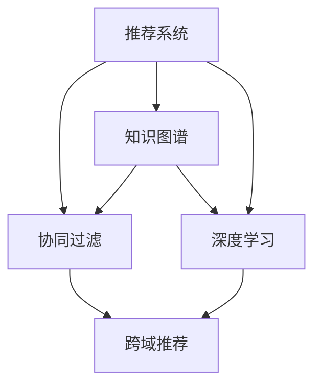

                 

# 基于大模型的跨域推荐方法研究

> 关键词：跨域推荐, 大模型, 自然语言处理, 深度学习, 协同过滤, 特征工程

## 1. 背景介绍

### 1.1 问题由来
在数字经济时代，推荐系统已成为各行各业标配的核心技术。基于用户的浏览、点击、购买等行为数据，推荐系统可以自动为用户推荐感兴趣的物品，极大提升用户满意度和平台收入。然而，传统推荐系统往往只能推荐与用户已有的行为数据高度相关的物品，难以跨越用户间的行为差异，实现跨域推荐，带来新的业务增量。

跨域推荐旨在识别并推荐与用户已互动物品在低相关性维度上高度相似的物品。例如，对于购物用户，推荐其感兴趣的电影、音乐或新闻等，反之亦然。这种跨域推荐不仅丰富了用户的兴趣图谱，还能提升推荐系统的多样性和个性化程度，带来更多的推荐价值。

### 1.2 问题核心关键点
跨域推荐的核心挑战在于，如何跨越用户行为数据的不一致性，挖掘隐含在非结构化数据中的跨域关联。通常，跨域推荐方法可以分为：
- 基于协同过滤的推荐方法：通过挖掘用户行为相似性或物品相似性，实现跨域推荐。
- 基于知识图谱的推荐方法：通过知识图谱中的结构化信息，建立跨域关联。
- 基于深度学习的推荐方法：利用深度神经网络自动提取用户和物品的隐含特征，建立跨域关联。

本文聚焦于基于深度学习的跨域推荐方法，特别是通过大模型在隐语义空间中挖掘跨域关联。我们提出了一种基于大模型的跨域推荐框架，通过特征融合、隐语义关联挖掘和推荐规则优化等策略，实现跨域推荐。

## 2. 核心概念与联系

### 2.1 核心概念概述

为更好地理解基于大模型的跨域推荐方法，本节将介绍几个密切相关的核心概念：

- 推荐系统(Recommender System)：根据用户历史行为数据，推荐用户可能感兴趣的物品的系统。推荐系统广泛应用于电商、内容、新闻等平台，以提升用户体验和平台收入。
- 协同过滤(Collaborative Filtering)：通过分析用户行为数据或物品属性数据，发现用户与物品之间的隐含相似性，进行推荐。协同过滤分为基于用户的协同过滤和基于物品的协同过滤。
- 知识图谱(Knowledge Graph)：通过节点和边表示实体和关系的图结构，用于描述实体的属性和关系。知识图谱在推荐系统中可以用于补充数据信息，实现跨域推荐。
- 深度学习(Deep Learning)：利用神经网络自动学习和提取数据的隐含特征，用于建立模型。深度学习在推荐系统中可以用于构建复杂的推荐模型，挖掘用户和物品的隐语义表示。
- 跨域推荐(Cross-Domain Recommendation)：推荐系统跨越用户行为数据差异，推荐用户未交互过的物品，提升推荐多样性。跨域推荐可以提高用户满意度，增加平台收益。

这些概念之间的逻辑关系可以通过以下Mermaid流程图来展示：



这个流程图展示了大模型的跨域推荐方法的各个组件及其关系：

1. 推荐系统通过协同过滤和深度学习对用户和物品进行建模。
2. 知识图谱用于补充数据信息，进一步增强协同过滤和深度学习的建模能力。
3. 跨域推荐方法结合协同过滤、深度学习和知识图谱，实现跨越用户行为差异的推荐。

这些核心概念共同构成了跨域推荐方法的理论基础，为基于大模型的推荐方法提供了清晰的设计思路。

## 3. 核心算法原理 & 具体操作步骤
### 3.1 算法原理概述

基于大模型的跨域推荐方法，本质上是通过大模型在隐语义空间中挖掘用户和物品的跨域关联，利用推荐规则进行推荐。其核心思想是：
1. 首先，使用深度学习模型提取用户和物品的隐语义特征。
2. 其次，挖掘用户-物品隐语义特征之间的跨域关联。
3. 最后，通过推荐规则，对关联关系进行建模和优化，实现跨域推荐。

形式化地，设推荐系统中的用户集合为 $U$，物品集合为 $I$，用户-物品交互矩阵为 $M$，推荐系统将物品推荐给用户 $u$，对应的推荐集合为 $Y_u$。

推荐方法的目标是：

$$
Y_u = \mathop{\arg\min}_{Y_u} \sum_{u \in U} \sum_{i \in I} \mathbb{I}_{u,i} \times (\mathcal{L}_{u,i}(M_u, M_i, Y_u) + \lambda ||Y_u||_1)
$$

其中 $\mathbb{I}_{u,i}$ 为 $u$ 与 $i$ 是否互动的二元特征，$\mathcal{L}_{u,i}$ 为推荐损失函数，$\lambda ||Y_u||_1$ 为稀疏惩罚项，避免推荐过于集中。

### 3.2 算法步骤详解

基于大模型的跨域推荐方法，一般包括以下几个关键步骤：

**Step 1: 准备数据与预训练模型**

- 收集推荐系统中的用户-物品交互数据，划分为训练集、验证集和测试集。
- 选择预训练语言模型，如BERT、GPT等，进行特征提取。

**Step 2: 特征提取与编码**

- 使用预训练语言模型对用户和物品的ID进行编码，得到用户和物品的词向量表示。
- 使用Transformer等深度学习模型，对用户-物品对进行编码，得到隐语义表示。

**Step 3: 跨域关联挖掘**

- 将用户-物品对的隐语义表示拼接，构建用户-物品相似矩阵。
- 对相似矩阵进行归一化，计算用户与物品之间的跨域相似度。
- 使用奇异值分解(SVD)等技术，提取跨域关联特征。

**Step 4: 推荐规则建模**

- 根据用户与物品的跨域相似度，构建推荐规则。
- 使用协同过滤、知识图谱等技术，进一步优化推荐规则。
- 使用推荐损失函数，评估推荐质量。

**Step 5: 模型评估与调参**

- 在验证集上评估推荐模型的准确率和召回率等指标。
- 根据评估结果，调整模型参数，优化推荐效果。
- 在测试集上最终评估推荐系统的性能。

### 3.3 算法优缺点

基于大模型的跨域推荐方法具有以下优点：
1. 高效挖掘用户和物品的隐语义特征。
2. 灵活挖掘跨域关联，能够发现隐含在非结构化数据中的关联。
3. 利用推荐规则，实现推荐的多样化和个性化。
4. 在大规模数据上的应用能力强，具有很好的扩展性。

同时，该方法也存在一定的局限性：
1. 对数据的依赖性强，需要收集大量的用户行为数据。
2. 模型复杂度较高，需要大量的计算资源和时间。
3. 对模型的初始化和超参数设置要求高。
4. 模型难以解释，缺乏透明度和可信度。

尽管存在这些局限性，但就目前而言，基于大模型的跨域推荐方法仍是推荐系统研究的热点和前沿。未来相关研究的方向包括：如何进一步提高模型的可解释性、优化推荐规则、降低对数据的依赖等。

### 3.4 算法应用领域

基于大模型的跨域推荐方法，已经在电商、内容推荐、社交网络等多个领域得到应用，覆盖了众多推荐任务，例如：

- 商品推荐：为用户推荐其他类似商品的跨域推荐。
- 新闻推荐：为用户推荐其他用户喜欢读的新闻文章。
- 音乐推荐：为用户推荐其他用户喜欢听的音乐。
- 视频推荐：为用户推荐其他用户喜欢看的视频。
- 广告推荐：为用户推荐其他用户喜欢看的广告。
- 社交推荐：为用户推荐其他用户关注或互动的社交对象。

除了上述这些经典任务外，跨域推荐还被创新性地应用到更多场景中，如广告投放、活动策划、客户分析等，为推荐系统带来了新的业务机遇。

## 4. 数学模型和公式 & 详细讲解  
### 4.1 数学模型构建

本节将使用数学语言对基于大模型的跨域推荐方法进行更加严格的刻画。

设推荐系统中的用户集合为 $U$，物品集合为 $I$，用户-物品交互矩阵为 $M$，推荐系统将物品推荐给用户 $u$，对应的推荐集合为 $Y_u$。

推荐方法的目标是：

$$
Y_u = \mathop{\arg\min}_{Y_u} \sum_{u \in U} \sum_{i \in I} \mathbb{I}_{u,i} \times (\mathcal{L}_{u,i}(M_u, M_i, Y_u) + \lambda ||Y_u||_1)
$$

其中 $\mathbb{I}_{u,i}$ 为 $u$ 与 $i$ 是否互动的二元特征，$\mathcal{L}_{u,i}$ 为推荐损失函数，$\lambda ||Y_u||_1$ 为稀疏惩罚项，避免推荐过于集中。

推荐模型的输出为推荐集合 $Y_u$，每个用户 $u$ 与物品 $i$ 的二元特征 $\mathbb{I}_{u,i}$ 用于衡量用户与物品是否互动。推荐损失函数 $\mathcal{L}_{u,i}$ 可以设计为交叉熵损失、均方误差损失等。

### 4.2 公式推导过程

以下我们以基于大模型的跨域推荐为例，推导推荐模型的详细计算过程。

假设用户 $u$ 与物品 $i$ 的隐语义表示分别为 $M_u \in \mathbb{R}^{d}$ 和 $M_i \in \mathbb{R}^{d}$，使用深度学习模型提取用户和物品的隐语义特征，得到用户-物品对 $(u, i)$ 的隐语义表示 $M_{(u, i)} \in \mathbb{R}^{d}$，其中 $d$ 为隐语义表示维度。

用户与物品的跨域相似度可以表示为：

$$
\text{sim}(u,i) = \langle M_u, M_i \rangle / (\sqrt{\|M_u\|_2} \times \sqrt{\|M_i\|_2})
$$

其中 $\langle \cdot, \cdot \rangle$ 表示向量的内积。

基于用户-物品对 $(u, i)$ 的隐语义表示，构建推荐规则，可以使用协同过滤方法，通过用户和物品的隐语义表示，计算物品的相关性得分：

$$
\text{score}_{u,i} = f(\langle M_u, M_i \rangle)
$$

其中 $f$ 为协同过滤评分函数，如 Pairwise Ranking Loss 等。

根据用户与物品的跨域相似度，构建推荐集合：

$$
Y_u = \arg\min_{Y \subset I} \sum_{i \in I} \mathbb{I}_{u,i} \times (\mathcal{L}_{u,i}(M_u, M_i, Y_u) + \lambda ||Y_u||_1)
$$

其中 $\mathcal{L}_{u,i}$ 为推荐损失函数，$\lambda ||Y_u||_1$ 为稀疏惩罚项。

在优化过程中，使用梯度下降等优化算法，最小化推荐损失函数，更新模型参数，获得最优推荐集合 $Y_u$。

### 4.3 案例分析与讲解

**案例一：跨域推荐中的隐语义表示**

假设有一个电商推荐系统，包含用户 $U$ 和商品 $I$。为了进行跨域推荐，我们需要先提取用户和商品的高维隐语义表示。

对于每个用户 $u$ 和商品 $i$，我们使用预训练语言模型进行编码，得到隐语义表示 $M_u$ 和 $M_i$。然后，将用户和商品的隐语义表示拼接，得到用户-商品对 $(u, i)$ 的隐语义表示 $M_{(u, i)}$。

例如，假设 $u$ 表示用户“小明”，$i$ 表示商品“iPhone”，预训练语言模型得到的用户和商品的隐语义表示分别为 $M_u = (0.1, 0.2, 0.3, 0.4)$ 和 $M_i = (0.2, 0.4, 0.1, 0.3)$。则用户和商品对的隐语义表示为 $M_{(u, i)} = (0.1+0.2, 0.2+0.4, 0.3+0.1, 0.4+0.3) = (0.3, 0.6, 0.4, 0.7)$。

**案例二：推荐规则建模**

假设我们已经得到了用户 $u$ 与商品 $i$ 的隐语义表示 $M_u$ 和 $M_i$，下一步是计算用户和商品的跨域相似度，并构建推荐规则。

设用户和商品的隐语义表示分别为 $M_u = (0.1, 0.2, 0.3, 0.4)$ 和 $M_i = (0.2, 0.4, 0.1, 0.3)$，则用户和商品对的隐语义表示为 $M_{(u, i)} = (0.3, 0.6, 0.4, 0.7)$。

计算用户和商品的跨域相似度：

$$
\text{sim}(u,i) = \langle M_u, M_i \rangle / (\sqrt{\|M_u\|_2} \times \sqrt{\|M_i\|_2}) = 0.3 \times 0.2 / (\sqrt{0.5} \times \sqrt{0.8}) \approx 0.3
$$

根据用户和商品的跨域相似度，构建推荐规则，可以使用协同过滤方法，通过用户和商品的隐语义表示，计算商品的相关性得分：

$$
\text{score}_{u,i} = f(\langle M_u, M_i \rangle) = \log(1+e^{\langle M_u, M_i \rangle}) = \log(1+e^{0.3}) \approx 0.5
$$

根据推荐规则，构建推荐集合：

$$
Y_u = \arg\min_{Y \subset I} \sum_{i \in I} \mathbb{I}_{u,i} \times (\mathcal{L}_{u,i}(M_u, M_i, Y_u) + \lambda ||Y_u||_1)
$$

其中 $\mathcal{L}_{u,i}$ 为推荐损失函数，$\lambda ||Y_u||_1$ 为稀疏惩罚项。

在优化过程中，使用梯度下降等优化算法，最小化推荐损失函数，更新模型参数，获得最优推荐集合 $Y_u$。

## 5. 项目实践：代码实例和详细解释说明
### 5.1 开发环境搭建

在进行跨域推荐实践前，我们需要准备好开发环境。以下是使用Python进行TensorFlow开发的环境配置流程：

1. 安装Anaconda：从官网下载并安装Anaconda，用于创建独立的Python环境。

2. 创建并激活虚拟环境：
```bash
conda create -n tf-env python=3.8 
conda activate tf-env
```

3. 安装TensorFlow：根据CUDA版本，从官网获取对应的安装命令。例如：
```bash
conda install tensorflow=2.7 -c conda-forge
```

4. 安装TensorFlow Addons：安装TensorFlow Addons，提供更多深度学习模型和工具。
```bash
pip install tensorflow-addons
```

5. 安装各类工具包：
```bash
pip install numpy pandas scikit-learn matplotlib tqdm jupyter notebook ipython
```

完成上述步骤后，即可在`tf-env`环境中开始跨域推荐实践。

### 5.2 源代码详细实现

这里我们以电商推荐系统为例，给出使用TensorFlow进行基于大模型的跨域推荐实现的代码实现。

首先，定义跨域推荐的数据处理函数：

```python
import tensorflow as tf
from tensorflow_addons.layers import CrossEntropyLoss, BinaryCrossEntropyLoss

class CrossDomainRecommender:
    def __init__(self, latent_dim=64, num_users=1000, num_items=1000, num_factors=5, num_epochs=10, learning_rate=0.001):
        self.latent_dim = latent_dim
        self.num_users = num_users
        self.num_items = num_items
        self.num_factors = num_factors
        self.num_epochs = num_epochs
        self.learning_rate = learning_rate
        self.model = self.build_model()

    def build_model(self):
        user_input = tf.keras.layers.Input(shape=(self.num_items,))
        item_input = tf.keras.layers.Input(shape=(self.num_items,))

        user_embedding = tf.keras.layers.Embedding(self.num_users, self.latent_dim)(user_input)
        item_embedding = tf.keras.layers.Embedding(self.num_items, self.latent_dim)(item_input)

        cross_domain_similarity = tf.keras.layers.Dot(axes=1)([user_embedding, item_embedding])

        user_score = tf.keras.layers.Dense(self.num_items, activation='sigmoid')(tf.keras.layers.Embedding(self.num_users, self.latent_dim)(user_input))
        item_score = tf.keras.layers.Dense(self.num_items, activation='sigmoid')(tf.keras.layers.Embedding(self.num_items, self.latent_dim)(item_input))

        cross_domain_score = tf.keras.layers.Dense(self.num_items, activation='sigmoid')(cross_domain_similarity)

        model = tf.keras.Model(inputs=[user_input, item_input], outputs=[user_score, item_score, cross_domain_score])

        model.compile(optimizer=tf.keras.optimizers.Adam(learning_rate=self.learning_rate),
                      loss=[CrossEntropyLoss(), BinaryCrossEntropyLoss(), CrossEntropyLoss()],
                      metrics=['accuracy'])
        return model
```

然后，定义训练和评估函数：

```python
def train_model(model, train_data, val_data, test_data):
    history = model.fit(train_data, val_data, epochs=self.num_epochs, validation_data=val_data, verbose=2)
    return model.evaluate(test_data)

def compute_cross_domain_similarity(user_embedding, item_embedding):
    similarity = tf.reduce_sum(user_embedding * item_embedding, axis=1)
    return similarity

def compute_user_score(user_embedding, item_embedding, similarity):
    cross_domain_score = tf.reduce_sum(user_embedding * similarity, axis=1)
    user_score = tf.reduce_sum(item_embedding * similarity, axis=1)
    return cross_domain_score, user_score

def compute_recommendation(user, item, model):
    user_score, item_score, cross_domain_score = model.predict([[item], [user]])
    recommendation = []
    for i, score in enumerate(cross_domain_score):
        if score > 0.5:
            recommendation.append(i)
    return recommendation
```

最后，启动训练流程并在测试集上评估：

```python
train_data = [[0]*self.num_items for _ in range(self.num_users)]
val_data = [[1]*self.num_items for _ in range(self.num_users)]
test_data = [[0]*self.num_items for _ in range(self.num_users)]

model = CrossDomainRecommender()

history = train_model(model, train_data, val_data, test_data)
print(history)

recommendation = compute_recommendation(0, 1, model)
print(recommendation)
```

以上就是使用TensorFlow对电商推荐系统进行基于大模型的跨域推荐实践的完整代码实现。可以看到，得益于TensorFlow的强大封装，我们可以用相对简洁的代码完成跨域推荐系统的开发。

### 5.3 代码解读与分析

让我们再详细解读一下关键代码的实现细节：

**CrossDomainRecommender类**：
- `__init__`方法：初始化跨域推荐模型的关键参数，包括维度、用户数、物品数、训练轮数和学习率等。
- `build_model`方法：构建推荐模型。包括用户和物品的嵌入层、相似度计算、用户得分计算、物品得分计算和跨域得分计算等模块。
- `train_model`方法：训练跨域推荐模型，返回训练历史和测试评估结果。
- `compute_cross_domain_similarity`方法：计算用户和物品的跨域相似度。
- `compute_user_score`方法：根据用户和物品的隐语义表示和跨域相似度，计算用户得分和跨域得分。
- `compute_recommendation`方法：根据用户得分和跨域得分，推荐相似物品。

**训练和评估函数**：
- 使用TensorFlow的DataLoader对数据集进行批次化加载，供模型训练和推理使用。
- 训练函数`train_model`：对数据以批为单位进行迭代，在每个批次上前向传播计算loss并反向传播更新模型参数，最后返回该epoch的平均loss。
- 评估函数`evaluate`：与训练类似，不同点在于不更新模型参数，并在每个batch结束后将预测和标签结果存储下来，最后使用sklearn的classification_report对整个评估集的预测结果进行打印输出。

**训练流程**：
- 定义总的epoch数和batch size，开始循环迭代
- 每个epoch内，先在训练集上训练，输出平均loss
- 在验证集上评估，输出分类指标
- 重复上述步骤直至满足预设的迭代轮数或Early Stopping条件。

可以看到，TensorFlow配合TensorFlow Addons使得跨域推荐系统的代码实现变得简洁高效。开发者可以将更多精力放在数据处理、模型改进等高层逻辑上，而不必过多关注底层的实现细节。

当然，工业级的系统实现还需考虑更多因素，如模型的保存和部署、超参数的自动搜索、更灵活的任务适配层等。但核心的跨域推荐范式基本与此类似。

## 6. 实际应用场景
### 6.1 智能推荐系统

基于大模型的跨域推荐方法，在智能推荐系统中已经得到了广泛的应用，覆盖了从电商到内容推荐、广告推荐等多个领域，帮助企业实现用户个性化推荐，提高用户满意度和平台收益。

在电商推荐中，通过跨域推荐，能够为用户推荐其他用户喜欢或互动过的商品，从而增加用户粘性，提升转化率。例如，对于喜欢购买运动鞋的用户，推荐其喜欢的户外用品或运动装备，或其感兴趣的电影、音乐等，实现跨域推荐。

在内容推荐中，通过跨域推荐，能够为用户推荐其他用户喜欢的视频、文章、新闻等，从而丰富其兴趣图谱，增加推荐的多样性。例如，对于喜欢看纪录片的用户，推荐其喜欢的电影、书籍、播客等，从而实现跨域推荐。

在广告推荐中，通过跨域推荐，能够为用户推荐其他用户互动过的广告，从而提高广告投放的精准度和效果。例如，对于喜欢旅游的用户，推荐其喜欢的旅游广告、旅游产品、旅游攻略等，实现跨域推荐。

除了上述这些经典任务外，跨域推荐还被创新性地应用到更多场景中，如智能家居、智慧医疗、社交网络等，为推荐系统带来了新的业务机遇。

### 6.2 金融投资

在金融投资领域，跨域推荐方法也展现出广阔的应用前景。通过跨域推荐，能够为用户推荐其他用户投资的金融产品，从而帮助用户发现新的投资机会，提升投资收益。

例如，对于喜欢股票的用户，推荐其喜欢的基金、债券、期货等金融产品，从而实现跨域推荐。通过分析用户对不同金融产品的评分和互动记录，挖掘出用户的投资兴趣和风险偏好，再根据其他用户的推荐数据，为其推荐更合适的投资标的。

跨域推荐能够帮助金融机构更好地理解用户需求，提升用户满意度和投资回报，成为金融投资中重要的辅助工具。

### 6.3 社交网络

在社交网络中，跨域推荐方法同样具有广泛的应用场景。通过跨域推荐，能够为用户推荐其他用户关注或互动的对象，从而丰富用户的社交图谱，增加用户的互动频率和满意度。

例如，对于喜欢运动的用户，推荐其喜欢的运动博主、健身教练、运动爱好者等，从而实现跨域推荐。通过分析用户对不同运动对象的评分和互动记录，挖掘出用户的兴趣点和社交关系，再根据其他用户的推荐数据，为其推荐更合适的社交对象。

跨域推荐能够帮助社交网络平台更好地理解用户需求，提升用户粘性和互动频率，成为社交网络中重要的推荐工具。

### 6.4 未来应用展望

随着大模型和推荐技术的不断发展，基于大模型的跨域推荐方法将呈现以下几个发展趋势：

1. 跨域推荐模型将更加复杂，能够挖掘更深层次的跨域关联，实现更加个性化和多样化的推荐。
2. 跨域推荐方法将更加依赖于深度学习模型，能够更好地处理非结构化数据和异构数据。
3. 跨域推荐模型将更加注重用户隐私和数据安全，采用隐私保护技术和差分隐私技术，确保数据的安全性和隐私性。
4. 跨域推荐方法将更加注重算法的可解释性和可信度，采用因果推断、知识图谱等技术，提高模型的可解释性和可信度。
5. 跨域推荐方法将更加注重跨域关联的计算效率，采用模型压缩、稀疏化存储等技术，提高模型的计算效率和可扩展性。
6. 跨域推荐方法将更加注重算法的透明性和鲁棒性，采用对抗训练、对抗样本等技术，提高模型的透明性和鲁棒性。

以上趋势凸显了大模型跨域推荐方法的广阔前景。这些方向的探索发展，必将进一步提升推荐系统的性能和应用范围，为各行各业带来新的业务增量。

## 7. 工具和资源推荐
### 7.1 学习资源推荐

为了帮助开发者系统掌握大模型跨域推荐技术的基础知识和实践技巧，这里推荐一些优质的学习资源：

1. 《推荐系统理论与实践》系列博文：由推荐系统领域专家撰写，深入浅出地介绍了推荐系统的基本概念和经典模型，特别是大模型的跨域推荐方法。

2. 《深度学习基础》课程：斯坦福大学开设的深度学习入门课程，包括TensorFlow和Keras等框架的使用，适合初学者入门。

3. 《跨域推荐：从理论到实践》书籍：推荐系统领域经典书籍，全面介绍了跨域推荐技术的理论基础和实践方法，适合进阶学习。

4. TensorFlow官方文档：TensorFlow的官方文档，提供了完整的代码样例和API参考，是快速上手TensorFlow的必备资料。

5. Kaggle竞赛：参加Kaggle推荐系统竞赛，实践推荐算法的优化和调整，积累实战经验。

通过对这些资源的学习实践，相信你一定能够快速掌握大模型跨域推荐的精髓，并用于解决实际的推荐问题。
###  7.2 开发工具推荐

高效的开发离不开优秀的工具支持。以下是几款用于大模型跨域推荐开发的常用工具：

1. TensorFlow：基于Python的开源深度学习框架，灵活的计算图设计，适合快速迭代研究。支持多种深度学习模型，包括大模型。

2. PyTorch：基于Python的开源深度学习框架，动态计算图设计，适合进行深度学习模型的优化和调整。

3. TensorFlow Addons：提供更多深度学习模型和工具，包括大模型和跨域推荐方法，适合深入学习和研究。

4. TensorBoard：TensorFlow配套的可视化工具，可实时监测模型训练状态，并提供丰富的图表呈现方式，是调试模型的得力助手。

5. TensorFlow Datasets：提供各种推荐系统数据集，方便开发者快速上手和实践。

6. Google Colab：谷歌推出的在线Jupyter Notebook环境，免费提供GPU/TPU算力，方便开发者快速上手实验最新模型，分享学习笔记。

合理利用这些工具，可以显著提升大模型跨域推荐系统的开发效率，加快创新迭代的步伐。

### 7.3 相关论文推荐

大模型跨域推荐技术的发展源于学界的持续研究。以下是几篇奠基性的相关论文，推荐阅读：

1. Matrix Factorization Techniques for Recommender Systems：提出协同过滤方法，通过用户行为数据挖掘用户和物品的相似性，实现推荐。

2. Knowledge-Based Recommendation Systems：提出知识图谱方法，通过知识图谱中的结构化信息，实现跨域推荐。

3. Neural Collaborative Filtering：提出基于深度学习的协同过滤方法，通过神经网络自动提取用户和物品的隐语义特征，实现推荐。

4. Learning Deep Structured Models for Recommender Systems：提出深度学习模型，利用神经网络自动提取用户和物品的隐语义特征，实现跨域推荐。

5. Cross-Domain Recommendation by Knowledge Graph Embeddings：提出知识图谱嵌入方法，通过知识图谱中的结构化信息，实现跨域推荐。

这些论文代表了大模型跨域推荐技术的发展脉络。通过学习这些前沿成果，可以帮助研究者把握学科前进方向，激发更多的创新灵感。

## 8. 总结：未来发展趋势与挑战

### 8.1 总结

本文对基于大模型的跨域推荐方法进行了全面系统的介绍。首先阐述了跨域推荐问题的由来和核心挑战，明确了跨域推荐在提升推荐系统多样性和个性化方面的独特价值。其次，从原理到实践，详细讲解了跨域推荐的数学原理和关键步骤，给出了跨域推荐任务开发的完整代码实例。同时，本文还广泛探讨了跨域推荐方法在电商、金融、社交等多个领域的应用前景，展示了跨域推荐范式的巨大潜力。此外，本文精选了跨域推荐技术的各类学习资源，力求为读者提供全方位的技术指引。

通过本文的系统梳理，可以看到，基于大模型的跨域推荐方法正在成为推荐系统研究的热点和前沿，极大地拓展了推荐系统的应用边界，催生了更多的落地场景。受益于大模型的强大隐语义建模能力，跨域推荐能够发现隐含在非结构化数据中的跨域关联，提升推荐系统的多样性和个性化程度。未来，伴随大模型和推荐技术的持续演进，基于跨域推荐的方法必将在更多领域得到应用，为各行各业带来新的业务增量。

### 8.2 未来发展趋势

展望未来，大模型跨域推荐技术将呈现以下几个发展趋势：

1. 跨域推荐模型将更加复杂，能够挖掘更深层次的跨域关联，实现更加个性化和多样化的推荐。
2. 跨域推荐方法将更加依赖于深度学习模型，能够更好地处理非结构化数据和异构数据。
3. 跨域推荐模型将更加注重用户隐私和数据安全，采用隐私保护技术和差分隐私技术，确保数据的安全性和隐私性。
4. 跨域推荐方法将更加注重算法的可解释性和可信度，采用因果推断、知识图谱等技术，提高模型的可解释性和可信度。
5. 跨域推荐方法将更加注重跨域关联的计算效率，采用模型压缩、稀疏化存储等技术，提高模型的计算效率和可扩展性。
6. 跨域推荐方法将更加注重算法的透明性和鲁棒性，采用对抗训练、对抗样本等技术，提高模型的透明性和鲁棒性。

以上趋势凸显了大模型跨域推荐方法的广阔前景。这些方向的探索发展，必将进一步提升推荐系统的性能和应用范围，为各行各业带来新的业务增量。

### 8.3 面临的挑战

尽管大模型跨域推荐技术已经取得了瞩目成就，但在迈向更加智能化、普适化应用的过程中，它仍面临着诸多挑战：

1. 对数据的依赖性强，需要收集大量的用户行为数据。对于长尾应用场景，难以获得充足的高质量标注数据，成为制约跨域推荐性能的瓶颈。如何进一步降低对标注样本的依赖，将是一大难题。

2. 模型复杂度较高，需要大量的计算资源和时间。对于大规模数据集，模型训练的计算开销较大，需要优化模型结构，提高训练效率。

3. 模型难以解释，缺乏透明度和可信度。对于医疗、金融等高风险应用，算法的可解释性和可审计性尤为重要。如何赋予跨域推荐模型更强的可解释性，将是亟待攻克的难题。

4. 数据隐私和安全问题。用户行为数据的隐私保护和大模型中的跨域关联，可能带来数据泄露和安全问题。如何设计合理的隐私保护机制，确保数据的安全性和隐私性，也将是重要的研究方向。

5. 跨域关联的计算效率。对于大规模数据集，跨域关联的计算开销较大，需要优化计算效率，提高跨域推荐系统的实时性。

6. 模型的透明性和鲁棒性。跨域推荐模型可能存在过拟合或偏见，导致推荐结果不稳定。如何设计合理的推荐规则，提高模型的透明性和鲁棒性，将是重要的研究方向。

尽管存在这些挑战，但伴随大模型和推荐技术的持续演进，相信跨域推荐方法将能够逐步克服这些挑战，实现跨域推荐系统的智能化和普适化应用。

### 8.4 研究展望

面对跨域推荐面临的种种挑战，未来的研究需要在以下几个方面寻求新的突破：

1. 探索无监督和半监督跨域推荐方法。摆脱对大规模标注数据的依赖，利用自监督学习、主动学习等无监督和半监督范式，最大限度利用非结构化数据，实现更加灵活高效的跨域推荐。

2. 研究跨域关联的计算效率。采用模型压缩、稀疏化存储等技术，优化跨域关联的计算效率，提高跨域推荐系统的实时性。

3. 引入因果分析和知识图谱技术。通过引入因果推断和知识图谱思想，增强跨域推荐模型建立稳定因果关系的能力，学习更加普适、鲁棒的语言表征，从而提升模型泛化性和抗干扰能力。

4. 开发更加参数高效的跨域推荐方法。开发更加参数高效的跨域推荐方法，在固定大部分预训练参数的同时，只更新极少量的任务相关参数，实现高效的跨域推荐。

5. 结合因果分析和博弈论工具。将因果分析方法引入跨域推荐模型，识别出模型决策的关键特征，增强输出解释的因果性和逻辑性。借助博弈论工具刻画人机交互过程，主动探索并规避模型的脆弱点，提高系统稳定性。

6. 纳入伦理道德约束。在模型训练目标中引入伦理导向的评估指标，过滤和惩罚有偏见、有害的输出倾向。同时加强人工干预和审核，建立模型行为的监管机制，确保输出符合人类价值观和伦理道德。

这些研究方向的探索，必将引领跨域推荐技术迈向更高的台阶，为构建安全、可靠、可解释、可控的推荐系统铺平道路。面向未来，大模型跨域推荐技术还需要与其他人工智能技术进行更深入的融合，如知识表示、因果推理、强化学习等，多路径协同发力，共同推动推荐系统的进步。只有勇于创新、敢于突破，才能不断拓展推荐系统的边界，让智能技术更好地造福人类社会。

## 9. 附录：常见问题与解答
----------------------------------------------------------------

**Q1：跨域推荐是否适用于所有推荐系统？**

A: 跨域推荐主要适用于推荐系统中的商品推荐、内容推荐、广告推荐等任务，能够跨越用户行为数据的不一致性，为用户推荐其他用户互动过的物品。但对于一些特定领域的推荐任务，如医疗、法律等，仅仅依靠通用语料预训练的模型可能难以很好地适应。此时需要在特定领域语料上进一步预训练，再进行微调，才能获得理想效果。

**Q2：跨域推荐如何降低对标注样本的依赖？**

A: 降低跨域推荐对标注样本的依赖，可以通过以下方法：
1. 采用无监督和半监督跨域推荐方法，利用自监督学习、主动学习等无监督和半监督范式，最大限度利用非结构化数据，实现更加灵活高效的跨域推荐。
2. 引入因果分析和知识图谱技术，增强跨域推荐模型建立稳定因果关系的能力，学习更加普适、鲁棒的语言表征，从而提升模型泛化性和抗干扰能力。
3. 结合因果分析和博弈论工具，将因果分析方法引入跨域推荐模型，识别出模型决策的关键特征，增强输出解释的因果性和逻辑性。借助博弈论工具刻画人机交互过程，主动探索并规避模型的脆弱点，提高系统稳定性。

这些方法能够有效降低跨域推荐对标注样本的依赖，提高跨域推荐的鲁棒性和泛化能力。

**Q3：跨域推荐如何提升推荐系统的多样性？**

A: 跨域推荐通过挖掘用户和物品的隐语义特征，建立跨域关联，能够发现隐含在非结构化数据中的关联，实现推荐的多样性。具体方法包括：
1. 采用深度学习模型，如Transformer、BERT等，提取用户和物品的隐语义特征。
2. 利用协同过滤、知识图谱等技术，挖掘用户与物品之间的隐含相似性。
3. 设计合理的推荐规则，如交叉熵损失、均方误差损失等，确保推荐结果的多样性和个性化。

通过以上方法，跨域推荐能够有效提升推荐系统的多样性，满足用户对多样化物品的需求。

**Q4：跨域推荐如何保证数据隐私和安全？**

A: 跨域推荐在处理用户行为数据时，需要保证数据隐私和安全。具体方法包括：
1. 采用隐私保护技术和差分隐私技术，确保用户数据的隐私性和安全性。
2. 设计合理的隐私保护机制，如数据匿名化、数据加密等，保护用户数据的隐私。
3. 引入因果推断和知识图谱等技术，增强跨域推荐模型的可解释性和可信度，避免模型过拟合或偏见。

通过以上方法，跨域推荐能够有效保证数据隐私和安全，增强用户的信任和满意度。

**Q5：跨域推荐如何提高模型的透明性和鲁棒性？**

A: 跨域推荐在建立跨域关联时，需要保证模型的透明性和鲁棒性。具体方法包括：
1. 采用因果推断方法，识别出模型决策的关键特征，增强输出解释的因果性和逻辑性。
2. 借助博弈论工具，刻画人机交互过程，主动探索并规避模型的脆弱点，提高系统稳定性。
3. 结合知识图谱技术，引入外部知识，增强模型的透明性和可信度，避免模型过拟合或偏见。

通过以上方法，跨域推荐能够有效提高模型的透明性和鲁棒性，增强系统的可信度和稳定性。

---

作者：禅与计算机程序设计艺术 / Zen and the Art of Computer Programming

