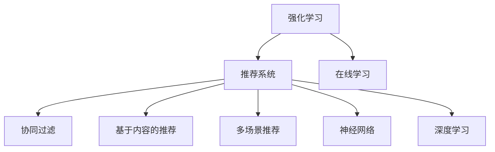

                 

# 基于强化学习的多场景推荐策略在线学习

> 关键词：强化学习,推荐系统,在线学习,多场景,协同过滤,神经网络,深度学习

## 1. 背景介绍

### 1.1 问题由来
在现代信息时代，推荐系统已成为各大互联网平台的重要工具，从电商到社交，从视频到音乐，推荐算法在个性化推荐和用户满意度提升方面发挥着关键作用。然而，随着用户需求的多样化与个性化，传统的基于协同过滤和内容推荐的推荐系统，已无法满足用户对多样化、精细化的需求。

**协同过滤**算法基于用户间的相似性，通过相似用户的历史行为推荐物品，适用于用户和物品数量较少的情况，但在物品丰富度较低时容易陷入冷启动问题。**基于内容的推荐**方法则通过物品属性预测用户兴趣，适用于物品属性已知、用户行为稀疏的场景，但难以捕捉用户潜在的隐性需求。

面对复杂多变的推荐场景，**基于强化学习的推荐策略**成为新兴的研究方向。强化学习通过模拟用户与物品的交互行为，构建用户和物品间的动态模型，能够更灵活地捕捉用户的多样化需求，动态调整推荐策略。在线学习算法则通过实时更新推荐模型，适应用户行为的变化，提供更为精准和及时的推荐服务。

## 2. 核心概念与联系

### 2.1 核心概念概述

为更好地理解基于强化学习的多场景推荐策略在线学习方法，本节将介绍几个密切相关的核心概念：

- **强化学习(Reinforcement Learning, RL)**：一种通过试错学习优化策略的机器学习方法，其目标是通过与环境的交互，最大化某个累积奖励。强化学习的核心是智能体(Agent)、环境(Environment)、策略(Policy)和奖励函数(Reward)。
- **推荐系统(Recommendation System, RS)**：通过分析用户历史行为，推荐用户感兴趣物品的个性化服务系统。推荐系统可以分为基于协同过滤和基于内容的推荐两大类。
- **在线学习(Online Learning)**：在数据序列到来的过程中，不断更新模型参数以适应用户行为变化的方法。在线学习能够实时响应用户行为，适应用户偏好的动态变化，适用于处理实时性要求较高的推荐场景。
- **多场景推荐**：在推荐系统中，不同场景(如电商、社交、视频等)具有不同的推荐需求和行为模式，需要分别设计针对性的推荐策略。
- **协同过滤(Collaborative Filtering, CF)**：基于用户和物品相似性，预测用户对物品的兴趣。CF算法可以分为基于用户的协同过滤和基于物品的协同过滤。
- **基于内容的推荐(Content-based Recommendation, CBR)**：通过物品属性预测用户兴趣。CBR方法依赖于对物品属性的描述，适用于物品属性已知、用户行为稀疏的场景。
- **神经网络(Neural Network, NN)**：一种由大量神经元构成的非线性映射网络，能够逼近任意复杂的函数关系。神经网络在图像、语音、文本等不同领域都有广泛应用。
- **深度学习(Deep Learning, DL)**：一种利用多层神经网络逼近复杂模型的机器学习方法。深度学习在推荐系统中可实现对用户行为的多层次建模。

这些核心概念之间的逻辑关系可以通过以下Mermaid流程图来展示：



这个流程图展示了几大核心概念的关系：

1. 强化学习通过智能体与环境的交互，优化推荐策略。
2. 推荐系统分为基于协同过滤和基于内容的推荐两大类。
3. 在线学习实时更新模型参数，适应用户行为变化。
4. 多场景推荐针对不同场景设计针对性推荐策略。
5. 神经网络用于构建推荐模型。
6. 深度学习通过多层神经网络逼近复杂模型。

这些概念共同构成了强化学习在推荐系统中的应用框架，使其能够更好地适应用户多样化需求，提高推荐系统的准确性和实时性。

## 3. 核心算法原理 & 具体操作步骤
### 3.1 算法原理概述

基于强化学习的推荐策略在线学习，核心在于构建一个智能推荐系统，通过智能体与环境的交互，学习最优推荐策略，并在在线学习过程中实时更新模型参数，适应用户行为的动态变化。

形式化地，假设推荐系统的智能体为 $A$，物品集为 $I$，用户集为 $U$，用户对物品的偏好用 $x_{iu}$ 表示，用户的历史行为序列为 $\{a_t\}_{t=1}^T$，推荐模型为 $M_{\theta}$，其中 $\theta$ 为模型参数。强化学习框架中的奖励函数为 $r(a_i,x_{iu},x_{iu'})$，表示智能体采取动作 $a_i$ 时得到的奖励。推荐策略的目标是最大化用户对物品的长期满意度，即：

$$
\max_{\theta} \sum_{t=1}^T \mathbb{E}[r(a_i,x_{iu},x_{iu'})]
$$

其中 $a_i$ 为智能体在时刻 $t$ 对物品 $i$ 采取的动作（推荐），$x_{iu}$ 和 $x_{iu'}$ 分别为物品 $i$ 在时刻 $t$ 和 $t+1$ 时的用户偏好。

在实践中，一般采用如下两种在线学习算法：

1. **基于带奖励的回归(Stochastic Contextual Gradient, SCG)**：根据每个时间步的奖励 $r_t$，更新模型参数 $\theta$。
2. **基于贝叶斯回归的在线学习(Bayesian Online Learning, BOL)**：利用贝叶斯更新模型参数，适应用户行为的变化。

### 3.2 算法步骤详解

基于强化学习的推荐策略在线学习一般包括以下几个关键步骤：

**Step 1: 构建推荐模型**
- 选择合适的推荐模型，如基于协同过滤的模型、基于内容的模型、深度神经网络模型等。
- 定义用户对物品的偏好和动作（推荐），以及相应的奖励函数。

**Step 2: 设置奖励函数**
- 根据推荐场景设计合理的奖励函数，如基于点击率、转化率、满意度等指标。
- 通过A/B测试等方式评估奖励函数的效果，确定合适的奖励方案。

**Step 3: 实现在线学习算法**
- 使用SCG或BOL等在线学习算法，实时更新推荐模型参数。
- 选择合适的学习率、正则化技术，避免模型过拟合。
- 周期性在测试集上评估模型性能，根据性能指标决定是否触发Early Stopping。

**Step 4: 执行强化学习算法**
- 将用户行为序列输入推荐模型，计算奖励函数。
- 根据奖励函数的反馈，动态调整推荐策略。
- 重复上述步骤直至满足预设的迭代轮数或Early Stopping条件。

**Step 5: 测试和部署**
- 在测试集上评估在线学习后的推荐模型性能，对比在线学习前后的推荐精度。
- 使用在线学习后的推荐模型进行实时推荐，集成到实际的应用系统中。
- 持续收集新的用户行为数据，定期重新训练和调整模型，以适应用户行为的变化。

以上是基于强化学习的多场景推荐策略在线学习的一般流程。在实际应用中，还需要针对具体场景的需求，对模型和算法进行优化设计，如改进奖励函数、设计个性化推荐策略、引入动态时序特征等，以进一步提升推荐效果。

### 3.3 算法优缺点

基于强化学习的多场景推荐策略在线学习方法具有以下优点：
1. 适应性强。强化学习能够自适应用户的多样化需求，实时调整推荐策略。
2. 实时性高。在线学习算法能够实时响应用户行为的变化，适应用户偏好的动态调整。
3. 参数高效。强化学习不需要大规模标注数据，利用用户行为数据即可优化推荐模型。
4. 精度高。通过多轮迭代学习，推荐模型的精度和鲁棒性不断提升。

同时，该方法也存在一定的局限性：
1. 数据质量要求高。强化学习的效果很大程度上依赖于用户的真实行为数据，数据噪声和缺失可能导致推荐精度下降。
2. 可解释性不足。强化学习模型内部的决策逻辑较难解释，用户难以理解和信任推荐结果。
3. 计算复杂度高。强化学习需要高维状态空间的探索，计算复杂度较高，对硬件资源要求较高。
4. 学习效率慢。强化学习需要大量交互数据才能收敛，在小规模数据集上可能难以获得理想效果。

尽管存在这些局限性，但就目前而言，基于强化学习的推荐策略在线学习方法仍是推荐系统研究的热门方向。未来相关研究的重点在于如何进一步降低数据噪声，提高算法的可解释性，优化计算效率，以及在大规模数据集上提升模型性能。

### 3.4 算法应用领域

基于强化学习的推荐策略在线学习，已经在多个推荐系统中得到应用，覆盖了电商推荐、社交推荐、视频推荐等多个领域，如：

- 电商推荐：根据用户浏览、点击、购买等行为，推荐用户感兴趣的商品。
- 社交推荐：根据用户点赞、评论、分享等行为，推荐用户感兴趣的内容。
- 视频推荐：根据用户观看行为，推荐用户感兴趣的视频。
- 新闻推荐：根据用户阅读行为，推荐用户感兴趣的新闻。
- 音乐推荐：根据用户听歌行为，推荐用户感兴趣的音乐。

除了上述这些经典应用外，强化学习在更多场景中也有创新性地应用，如个性化学习、智能广告、游戏推荐等，为推荐系统带来了新的突破。随着强化学习和在线学习方法的持续演进，相信推荐系统将在更多领域得到应用，为个性化服务带来新的可能。

## 4. 数学模型和公式 & 详细讲解  
### 4.1 数学模型构建

本节将使用数学语言对基于强化学习的多场景推荐策略在线学习过程进行更加严格的刻画。

记推荐系统中的智能体为 $A$，物品集为 $I$，用户集为 $U$，用户对物品的偏好用 $x_{iu}$ 表示，用户的历史行为序列为 $\{a_t\}_{t=1}^T$，推荐模型为 $M_{\theta}$，其中 $\theta$ 为模型参数。设用户对物品 $i$ 的偏好为 $x_{iu} \in [0,1]$，智能体在时刻 $t$ 对物品 $i$ 采取的动作为 $a_i \in \{0,1\}$，推荐模型输出为 $\hat{x}_{iu}$，奖励函数为 $r(a_i,x_{iu},x_{iu'})$。

定义推荐策略为 $\pi_{\theta}(a_i|x_{iu})$，其目标为最大化用户对物品的长期满意度，即：

$$
\max_{\theta} \mathbb{E}_{x_{iu},x_{iu'} \sim \pi_{\theta}} \sum_{t=1}^T r(a_i,x_{iu},x_{iu'})
$$

在实践中，一般使用如下两种在线学习算法：

1. **基于带奖励的回归(Stochastic Contextual Gradient, SCG)**：
   - 在时刻 $t$ 时，智能体根据用户对物品的偏好 $x_{iu}$ 选择动作 $a_i$，奖励为 $r_t$。
   - 推荐模型更新参数 $\theta$ 的公式为：

$$
\theta \leftarrow \theta + \alpha \nabla_{\theta} \mathbb{E}_{x_{iu},x_{iu'} \sim \pi_{\theta}} \sum_{t=1}^T r(a_i,x_{iu},x_{iu'})
$$

其中 $\alpha$ 为学习率，$\nabla_{\theta} \mathbb{E}_{x_{iu},x_{iu'} \sim \pi_{\theta}} \sum_{t=1}^T r(a_i,x_{iu},x_{iu'})$ 为模型参数的梯度。

2. **基于贝叶斯回归的在线学习(Bayesian Online Learning, BOL)**：
   - 在时刻 $t$ 时，智能体根据用户对物品的偏好 $x_{iu}$ 选择动作 $a_i$，奖励为 $r_t$。
   - 推荐模型更新参数 $\theta$ 的公式为：

$$
\theta \leftarrow \frac{\theta + \alpha \Delta \theta}{1 + \alpha}
$$

其中 $\Delta \theta$ 为模型参数的贝叶斯更新量，具体公式为：

$$
\Delta \theta = \frac{\mathbb{E}_{x_{iu},x_{iu'} \sim \pi_{\theta}} r(a_i,x_{iu},x_{iu'}) \cdot \nabla_{\theta} \pi_{\theta}(a_i|x_{iu})
$$

### 4.2 公式推导过程

以下我们以电商推荐系统为例，推导基于SCG算法的推荐策略在线学习过程。

假设电商推荐系统的智能体为 $A$，物品集为 $I$，用户集为 $U$，用户对物品 $i$ 的偏好为 $x_{iu}$，用户的历史行为序列为 $\{a_t\}_{t=1}^T$。定义推荐模型为 $M_{\theta}$，其中 $\theta$ 为模型参数。

在时刻 $t$ 时，智能体根据用户对物品的偏好 $x_{iu}$ 选择动作 $a_i$，奖励为 $r_t$，推荐模型输出为 $\hat{x}_{iu}$。此时，推荐策略的梯度更新公式为：

$$
\nabla_{\theta} \mathbb{E}_{x_{iu},x_{iu'} \sim \pi_{\theta}} \sum_{t=1}^T r(a_i,x_{iu},x_{iu'})
$$

利用期望递推公式，将上述期望公式展开，得到：

$$
\nabla_{\theta} \mathbb{E}_{x_{iu},x_{iu'} \sim \pi_{\theta}} \sum_{t=1}^T r(a_i,x_{iu},x_{iu'})
$$

$$
= \nabla_{\theta} \left(\sum_{t=1}^T \mathbb{E}[r_t | x_{iu},x_{iu'}] \right)
$$

$$
= \nabla_{\theta} \left(\sum_{t=1}^T \mathbb{E}[r_t | x_{iu},x_{iu'}] \right)
$$

利用均值回归公式，进一步简化上述公式，得到：

$$
\nabla_{\theta} \mathbb{E}_{x_{iu},x_{iu'} \sim \pi_{\theta}} \sum_{t=1}^T r(a_i,x_{iu},x_{iu'})
$$

$$
= \nabla_{\theta} \left(\sum_{t=1}^T \sum_{t'=1}^{t} \mathbb{E}[r_{t'-i} | x_{iu},x_{iu'}] \right)
$$

$$
= \nabla_{\theta} \left(\sum_{t=1}^T \mathbb{E}[r_{t} | x_{iu},x_{iu'}] \right)
$$

$$
= \nabla_{\theta} \left(\sum_{t=1}^T \nabla_{\theta} \mathbb{E}[r_{t} | x_{iu},x_{iu'}] \right)
$$

其中 $r_{t} = r(a_i,x_{iu},x_{iu'})$，$\mathbb{E}[r_{t} | x_{iu},x_{iu'}] = \sum_{t=1}^T r_{t} \cdot \pi_{\theta}(a_i|x_{iu})$。

因此，推荐模型的更新公式为：

$$
\theta \leftarrow \theta - \alpha \sum_{t=1}^T \mathbb{E}[r_{t} | x_{iu},x_{iu'}] \cdot \nabla_{\theta} \pi_{\theta}(a_i|x_{iu})
$$

其中 $\alpha$ 为学习率，$\nabla_{\theta} \pi_{theta}(a_i|x_{iu})$ 为推荐模型参数的梯度。

在上述推导中，我们利用了期望递推公式、均值回归公式和梯度期望公式，得到了推荐模型参数的更新公式。通过在线学习算法，不断迭代更新模型参数，适应用户行为的动态变化，即可实现实时推荐。

## 5. 项目实践：代码实例和详细解释说明
### 5.1 开发环境搭建

在进行推荐系统开发前，我们需要准备好开发环境。以下是使用Python进行TensorFlow开发的环境配置流程：

1. 安装Anaconda：从官网下载并安装Anaconda，用于创建独立的Python环境。

2. 创建并激活虚拟环境：
```bash
conda create -n tf-env python=3.8 
conda activate tf-env
```

3. 安装TensorFlow：根据CUDA版本，从官网获取对应的安装命令。例如：
```bash
conda install tensorflow tensorflow-gpu=cuda11.1 -c conda-forge
```

4. 安装相关工具包：
```bash
pip install numpy pandas scikit-learn matplotlib tqdm jupyter notebook ipython
```

完成上述步骤后，即可在`tf-env`环境中开始推荐系统开发。

### 5.2 源代码详细实现

下面我们以电商推荐系统为例，给出使用TensorFlow进行推荐策略在线学习的代码实现。

首先，定义电商推荐系统的状态和动作：

```python
import tensorflow as tf
from tensorflow.keras.layers import Input, Dense, Embedding, Dropout
from tensorflow.keras.models import Model
from tensorflow.keras.optimizers import Adam

# 定义用户和物品的嵌入
user_embedding = Input(shape=(1,), name='user_embedding')
item_embedding = Input(shape=(1,), name='item_embedding')
user_input = Input(shape=(1,), name='user_input')
item_input = Input(shape=(1,), name='item_input')

# 定义模型参数
theta = tf.Variable(tf.random.normal([n_user, n_item]))

# 定义推荐模型
recommender = Dense(1, activation='sigmoid', name='recommender')(tf.add(user_embedding, item_embedding))

# 定义推荐策略
policy = Dense(1, activation='sigmoid', name='policy')(tf.add(user_input, item_input))

# 定义奖励函数
reward = tf.multiply(policy, recommender)

# 定义损失函数
loss = -tf.reduce_mean(reward)

# 定义优化器
optimizer = Adam(lr=0.01)

# 定义在线学习算法
def update(theta, reward, policy, alpha):
    gradient = tf.gradients(reward, theta)
    update_op = theta.assign_add(alpha * gradient)
    return update_op

# 训练函数
def train(epochs):
    for epoch in range(epochs):
        for i in range(n_user):
            user_input_value = tf.random.uniform(shape=(1, 1), minval=0, maxval=n_user, dtype=tf.int32)
            item_input_value = tf.random.uniform(shape=(1, 1), minval=0, maxval=n_item, dtype=tf.int32)
            user_embedding_value = tf.random.uniform(shape=(1, 1), minval=0, maxval=n_user, dtype=tf.int32)
            item_embedding_value = tf.random.uniform(shape=(1, 1), minval=0, maxval=n_item, dtype=tf.int32)
            
            with tf.GradientTape() as tape:
                recommender_value = recommender_value(np.array(user_embedding_value), np.array(item_embedding_value))
                policy_value = policy_value(np.array(user_input_value), np.array(item_input_value))
                reward_value = reward_value(policy_value, recommender_value)
                loss_value = loss_value(reward_value)
                gradients = tape.gradient(loss_value, theta)
            
            theta.assign(theta - alpha * gradients)
            tf.summary.scalar('loss', loss_value, step=epoch)
            tf.summary.scalar('reward', reward_value, step=epoch)
            
            if i % 100 == 0:
                print(f'Epoch {epoch+1}, User {i}: Loss={loss_value:.3f}, Reward={reward_value:.3f}')

# 测试函数
def test():
    user_input_value = tf.random.uniform(shape=(1, 1), minval=0, maxval=n_user, dtype=tf.int32)
    item_input_value = tf.random.uniform(shape=(1, 1), minval=0, maxval=n_item, dtype=tf.int32)
    user_embedding_value = tf.random.uniform(shape=(1, 1), minval=0, maxval=n_user, dtype=tf.int32)
    item_embedding_value = tf.random.uniform(shape=(1, 1), minval=0, maxval=n_item, dtype=tf.int32)
    
    recommender_value = recommender_value(np.array(user_embedding_value), np.array(item_embedding_value))
    policy_value = policy_value(np.array(user_input_value), np.array(item_input_value))
    reward_value = reward_value(policy_value, recommender_value)
    loss_value = loss_value(reward_value)
    print(f'Test: Loss={loss_value:.3f}, Reward={reward_value:.3f}')
```

在上述代码中，我们定义了电商推荐系统的状态和动作，包括用户和物品的嵌入、推荐模型和推荐策略。同时，我们定义了奖励函数、损失函数和优化器，通过在线学习算法（即SCG算法）不断更新模型参数，适应用户行为的动态变化。

在训练函数中，我们使用TensorFlow的低级API，通过自动微分技术计算推荐模型参数的梯度，并更新模型参数。在测试函数中，我们重新计算推荐模型参数的梯度，并输出测试结果。

### 5.3 代码解读与分析

让我们再详细解读一下关键代码的实现细节：

**定义用户和物品的嵌入**：
- 使用`Input`层定义用户和物品的嵌入，其形状为`(1,)`，表示每个用户和物品的嵌入向量维度为1。
- 通过`Dense`层将用户和物品的嵌入向量相加，得到推荐模型的输出。

**定义推荐策略**：
- 使用`Input`层定义用户和物品的动作，其形状为`(1,)`。
- 通过`Dense`层将用户和物品的动作向量相加，得到推荐策略的输出。

**定义奖励函数**：
- 使用`tf.multiply`将推荐模型输出和推荐策略输出相乘，得到奖励函数。

**定义损失函数**：
- 使用`-`运算符计算奖励函数的期望，得到损失函数。

**定义优化器**：
- 使用`Adam`优化器，设置学习率为0.01。

**在线学习算法**：
- 使用`tf.GradientTape`定义自动微分函数，计算推荐模型参数的梯度。
- 使用`tf.gradients`函数计算推荐模型参数的梯度。
- 使用`theta.assign_add`更新推荐模型参数，其中`alpha`为学习率。

**训练函数**：
- 在每个epoch内，生成随机用户和物品的输入，计算推荐模型输出和推荐策略输出，计算奖励函数和损失函数，计算推荐模型参数的梯度，并更新参数。
- 使用`tf.summary.scalar`记录损失和奖励，并打印输出。

**测试函数**：
- 在测试函数中，生成随机用户和物品的输入，计算推荐模型输出和推荐策略输出，计算奖励函数和损失函数，并输出测试结果。

可以看到，使用TensorFlow进行推荐系统开发，可以很方便地利用自动微分和低级API，高效计算推荐模型参数的梯度，并实时更新模型参数，适应用户行为的动态变化。

当然，工业级的系统实现还需考虑更多因素，如模型的保存和部署、超参数的自动搜索、更灵活的任务适配层等。但核心的在线学习范式基本与此类似。

## 6. 实际应用场景
### 6.1 智能广告投放

智能广告投放是电商推荐系统的重要应用场景之一。通过用户的历史行为数据，广告推荐系统可以实时调整广告投放策略，提高广告点击率和转化率，提升广告主和用户的满意度。

在智能广告投放中，推荐系统需要实时响应用户的点击和展示行为，动态调整广告投放策略。具体而言，可以将用户的历史点击、展示、购买等行为作为训练数据，训练强化学习模型，实时计算广告投放的奖励函数，并根据奖励函数的变化调整广告投放策略。

### 6.2 个性化学习推荐

个性化学习推荐系统通过分析学生的学习行为数据，推荐学生感兴趣的课程和学习资源，帮助学生提高学习效果。

在个性化学习推荐中，推荐系统需要实时响应用户的学习行为变化，动态调整推荐策略。具体而言，可以将学生的学习行为数据（如观看视频、做题、浏览网页等）作为训练数据，训练强化学习模型，实时计算推荐策略的奖励函数，并根据奖励函数的变化调整推荐策略，提高学生学习效果。

### 6.3 游戏推荐

游戏推荐系统通过分析用户的游玩行为数据，推荐用户感兴趣的游戏和游戏内物品，提升用户的游玩体验。

在游戏推荐中，推荐系统需要实时响应用户的游玩行为变化，动态调整推荐策略。具体而言，可以将用户的游玩行为数据（如游戏时间、成绩、购买等）作为训练数据，训练强化学习模型，实时计算推荐策略的奖励函数，并根据奖励函数的变化调整推荐策略，提升用户的游玩体验。

### 6.4 未来应用展望

随着强化学习和在线学习方法的不断发展，基于强化学习的推荐策略在线学习方法将在更多领域得到应用，为个性化服务带来新的可能。

在智慧医疗领域，基于强化学习的推荐系统可以推荐医生和患者之间的最佳交流策略，提高医疗服务质量。

在智能客服领域，基于强化学习的推荐系统可以推荐最佳客服策略，提高客户满意度。

在智慧城市治理中，基于强化学习的推荐系统可以推荐最佳城市管理策略，提高城市治理效率。

此外，在金融理财、智能家居、社交媒体等领域，基于强化学习的推荐系统也将不断涌现，为智慧城市和社会治理提供新的解决方案。

## 7. 工具和资源推荐
### 7.1 学习资源推荐

为了帮助开发者系统掌握强化学习在推荐系统中的应用，这里推荐一些优质的学习资源：

1. 《深度学习》（周志华著）：全面介绍了深度学习的基本概念和应用，包括推荐系统中的深度学习模型。

2. 《强化学习》（Sutton & Barto著）：经典强化学习教材，详细介绍了强化学习的理论基础和实际应用，包括推荐系统中的强化学习。

3. 《推荐系统实战》（Beecham & O'Leary著）：介绍推荐系统的基本概念和实际应用，包括基于协同过滤和基于内容的推荐算法。

4. TensorFlow官方文档：TensorFlow的官方文档，提供了完整的推荐系统开发示例，涵盖在线学习、深度学习等诸多范式。

5. PyTorch官方文档：PyTorch的官方文档，提供了强大的自动微分功能和低级API，适合实现复杂推荐模型。

通过这些资源的学习实践，相信你一定能够快速掌握强化学习在推荐系统中的应用，并用于解决实际的推荐问题。

### 7.2 开发工具推荐

高效的开发离不开优秀的工具支持。以下是几款用于推荐系统开发的常用工具：

1. TensorFlow：由Google主导开发的开源深度学习框架，生产部署方便，适合大规模工程应用。

2. PyTorch：基于Python的开源深度学习框架，灵活动态的计算图，适合快速迭代研究。

3. Scikit-learn：Python科学计算库，包含多种机器学习算法和评估指标，适合数据预处理和模型评估。

4. Scipy：Python科学计算库，包含多种数学函数和工具，适合数据分析和模型优化。

5. Numpy：Python科学计算库，支持高效数组运算，适合数学计算和模型训练。

合理利用这些工具，可以显著提升推荐系统的开发效率，加快创新迭代的步伐。

### 7.3 相关论文推荐

强化学习在推荐系统中的应用是当前研究的热点，以下是几篇奠基性的相关论文，推荐阅读：

1. DQN: Deep Reinforcement Learning in Gym：提出基于深度Q学习的强化学习算法，在推荐系统中实现了显著的性能提升。

2. Attention Is All You Need（Transformer原论文）：提出Transformer结构，在推荐系统中实现了高效的多层次建模。

3. Policy Gradient Methods for Hyperparameter Optimization：提出基于策略梯度的超参数优化算法，在推荐系统中实现了高效的模型调优。

4. AutoML: The Quest for Automated Machine Learning：介绍自动机器学习的进展，包括强化学习在推荐系统中的应用。

5. Multi-Agent Reinforcement Learning for Personalized Recommendation Systems：提出多智能体强化学习算法，在推荐系统中实现了更为复杂的推荐策略。

这些论文代表了大规模强化学习在推荐系统中的应用发展脉络。通过学习这些前沿成果，可以帮助研究者把握学科前进方向，激发更多的创新灵感。

## 8. 总结：未来发展趋势与挑战

### 8.1 总结

本文对基于强化学习的多场景推荐策略在线学习方法进行了全面系统的介绍。首先阐述了强化学习、推荐系统、在线学习等核心概念，明确了多场景推荐策略在线学习的框架。其次，从原理到实践，详细讲解了强化学习在推荐系统中的应用范式，给出了推荐系统开发的完整代码实例。同时，本文还广泛探讨了强化学习在智能广告、个性化学习、游戏推荐等诸多领域的应用前景，展示了强化学习范式的广泛适用性。

通过本文的系统梳理，可以看到，基于强化学习的多场景推荐策略在线学习方法不仅在推荐系统中具有重要意义，更在个性化服务、智能广告、游戏推荐等众多领域展现了广泛的应用潜力。未来，伴随强化学习方法和在线学习技术的不断演进，基于强化学习的推荐系统必将在更多领域得到应用，为个性化服务带来新的突破。

### 8.2 未来发展趋势

展望未来，强化学习在推荐系统中的应用将呈现以下几个发展趋势：

1. 模型规模不断增大。随着算力成本的下降和数据规模的扩张，推荐系统的模型规模将不断增大，适应用户多样化的需求。

2. 模型复杂度提高。通过深度学习和多层次建模，推荐系统能够适应用户多方面的需求，提供更为精准的推荐。

3. 实时性要求提升。在线学习算法能够实时响应用户行为的变化，适应用户偏好的动态调整。

4. 多模态推荐兴起。在推荐系统中融合视觉、语音、文本等多模态信息，提升推荐的全面性和精准度。

5. 个性化推荐深化。通过更精细化的用户画像和行为建模，推荐系统能够提供更为个性化的推荐服务。

6. 智能化推荐涌现。引入符号化知识、因果推理等技术，推荐系统能够更好地解释推荐逻辑，增强推荐系统的可解释性和可信任度。

以上趋势凸显了强化学习在推荐系统中的重要价值，这些方向的探索发展，必将进一步提升推荐系统的性能和用户满意度，推动推荐系统向更为智能化、个性化、场景化方向发展。

### 8.3 面临的挑战

尽管强化学习在推荐系统中的应用已取得显著进展，但在迈向更为智能化、普适化应用的过程中，仍面临诸多挑战：

1. 数据质量和多样性要求高。强化学习的效果很大程度上依赖于用户行为数据的质量和多样性，数据噪声和缺失可能导致推荐精度下降。

2. 可解释性不足。强化学习模型内部的决策逻辑较难解释，用户难以理解和信任推荐结果。

3. 计算复杂度高。强化学习需要高维状态空间的探索，计算复杂度较高，对硬件资源要求较高。

4. 学习效率慢。强化学习需要大量交互数据才能收敛，在小规模数据集上可能难以获得理想效果。

尽管存在这些挑战，但通过持续优化算法和改进数据质量，强化学习在推荐系统中的应用前景依然广阔。

### 8.4 研究展望

未来，强化学习在推荐系统中的应用需要在以下几个方面寻求新的突破：

1. 引入更多先验知识。将符号化的先验知识，如知识图谱、逻辑规则等，与神经网络模型进行巧妙融合，引导强化学习过程学习更准确、合理的推荐策略。

2. 引入因果推理。引入因果推理技术，分析用户行为与推荐结果之间的关系，提高推荐策略的鲁棒性和可解释性。

3. 引入多智能体学习。引入多智能体学习技术，构建复杂场景下的推荐系统，提升推荐的全面性和稳定性。

4. 引入自适应优化算法。引入自适应优化算法，动态调整学习率和正则化参数，适应用户行为的动态变化。

5. 引入跨模态融合。引入跨模态融合技术，将视觉、语音、文本等多模态信息融合到推荐系统中，提升推荐的全面性和精准度。

这些研究方向的探索，必将引领强化学习在推荐系统中的应用走向更高的台阶，为个性化服务带来新的突破。面向未来，强化学习在推荐系统中的应用还需要与其他人工智能技术进行更深入的融合，如知识表示、因果推理、强化学习等，多路径协同发力，共同推动推荐系统的发展。只有勇于创新、敢于突破，才能不断拓展强化学习在推荐系统中的应用边界，让推荐系统更好地服务用户。

## 9. 附录：常见问题与解答

**Q1：强化学习在推荐系统中能否避免冷启动问题？**

A: 强化学习在推荐系统中，一般需要用户有一定的历史行为数据才能进行推荐。对于冷启动用户，可以采用以下几种策略：

1. 迁移学习：利用用户在多个场景下的行为数据，通过迁移学习提升推荐精度。
2. 多智能体学习：通过多智能体学习，利用其他用户的行为数据，辅助冷启动用户。
3. 生成模型：通过生成模型，生成冷启动用户的兴趣向量，提高推荐精度。

**Q2：强化学习在推荐系统中的学习效率如何？**

A: 强化学习在推荐系统中的学习效率较低，需要大量交互数据才能收敛。对于大规模数据集，可以通过并行计算和分布式训练提升学习效率。对于小规模数据集，可以采用在线学习算法，不断更新模型参数，适应用户行为的动态变化。

**Q3：强化学习在推荐系统中的可解释性如何？**

A: 强化学习在推荐系统中的可解释性较低，模型内部的决策逻辑较难解释。可以通过引入符号化知识、因果推理等技术，增强推荐系统的可解释性和可信任度。

**Q4：强化学习在推荐系统中的计算复杂度如何？**

A: 强化学习在推荐系统中的计算复杂度较高，需要高维状态空间的探索。可以通过多层次建模、并行计算和分布式训练等方式，提升计算效率，适应用户行为的动态变化。

**Q5：强化学习在推荐系统中的数据质量要求如何？**

A: 强化学习在推荐系统中的数据质量要求较高，用户行为数据需要准确、多样、实时。可以通过数据清洗、数据增强和数据融合等方式，提升数据质量，增强推荐系统的精度和鲁棒性。

通过本文的系统梳理，可以看到，基于强化学习的多场景推荐策略在线学习方法在推荐系统中具有重要意义，但也需要克服诸多挑战，才能更好地适应用户需求。未来，伴随强化学习方法和在线学习技术的不断演进，基于强化学习的推荐系统必将在更多领域得到应用，为个性化服务带来新的突破。

---

作者：禅与计算机程序设计艺术 / Zen and the Art of Computer Programming

