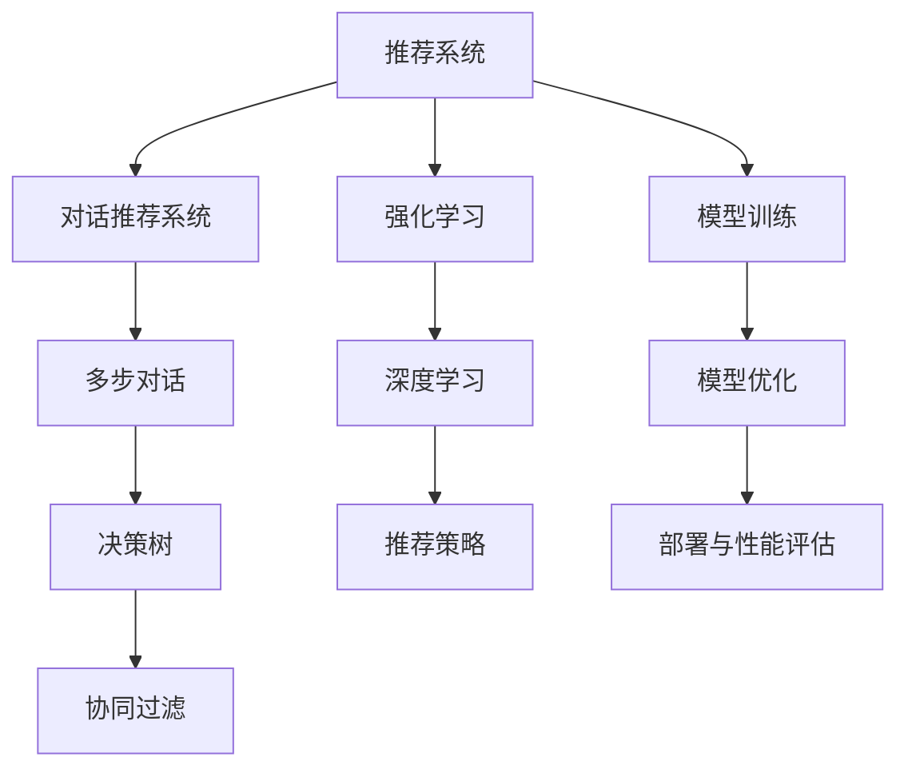

                 

# 基于强化学习的多步对话式推荐系统

> 关键词：强化学习, 多步对话, 推荐系统, 智能客服, 决策树, 协同过滤, 深度学习

## 1. 背景介绍

### 1.1 问题由来

推荐系统是互联网公司实现个性化推荐服务的关键技术。传统的推荐系统主要基于协同过滤和基于内容的推荐，但这些方法都有一定的局限性。协同过滤需要用户有足够的交互数据，而基于内容的推荐对特征工程的要求较高。近年来，基于深度学习的推荐系统取得了显著进展，例如利用神经网络进行协同过滤、嵌入空间的表示学习等。

随着推荐系统从单轮推荐向多轮推荐发展，对话推荐逐渐成为研究热点。对话推荐系统可以采用多轮交互的方式，更好地理解用户意图和需求，从而提供更加精准的个性化推荐。对话推荐系统分为基于规则和基于深度学习的两类，其中基于深度学习的方法以神经网络和强化学习为主要技术手段。

基于强化学习的方法在对话推荐系统中逐步占据重要地位。在对话推荐系统中，用户与系统进行多轮交互，系统会根据对话历史和当前用户请求，给出推荐结果。在这一过程中，如何使系统能够持续优化推荐策略，达到更好的推荐效果，是强化学习在推荐系统中的一个重要研究方向。

### 1.2 问题核心关键点

强化学习在对话推荐系统中的应用，主要集中在以下几个方面：

1. **模型结构设计**：如何设计对话模型来捕捉对话中的用户意图和历史行为信息，并根据当前状态做出最优决策。
2. **奖励函数设计**：如何定义奖励函数来评估推荐策略的好坏，激励系统学习更好的推荐策略。
3. **多步对话设计**：如何在多轮对话中更新推荐策略，使得推荐结果更加符合用户需求。
4. **模型训练和优化**：如何高效地训练和优化模型，使得模型能够快速适应用户行为变化。
5. **部署和性能评估**：如何将模型部署到实际应用中，并使用性能指标来评估模型效果。

这些问题互相交织，共同决定了基于强化学习的对话推荐系统的性能。本文将围绕这些问题展开探讨，详细讲解模型的设计、训练和优化方法。

## 2. 核心概念与联系

### 2.1 核心概念概述

为更好地理解基于强化学习的多步对话式推荐系统，本节将介绍几个密切相关的核心概念：

- **推荐系统**：基于用户的历史行为和偏好，为用户推荐感兴趣的物品的系统。
- **对话推荐系统**：通过用户与系统的多轮交互，获取用户意图，生成个性化推荐结果的系统。
- **强化学习**：通过与环境交互，使智能体通过试错学习最优策略的机器学习范式。
- **多步对话**：通过多轮交互，系统可以更好地理解用户需求，并做出更加精准的推荐。
- **决策树**：用于构建和优化推荐策略的树形结构。
- **协同过滤**：利用用户之间的相似性进行推荐。
- **深度学习**：基于神经网络的机器学习技术，在推荐系统中有广泛应用。

这些概念之间的逻辑关系可以通过以下Mermaid流程图来展示：



这个流程图展示了几者之间的关系：

1. 推荐系统是对话推荐系统的基础。
2. 对话推荐系统通过多步对话获取用户意图。
3. 多步对话需要决策树和协同过滤的支持。
4. 强化学习和深度学习用于设计推荐策略。
5. 推荐策略需要通过模型训练和优化来生成。
6. 模型部署到实际应用中，并通过性能评估来优化。

## 3. 核心算法原理 & 具体操作步骤
### 3.1 算法原理概述

基于强化学习的对话推荐系统，主要通过与用户的多轮对话，动态生成推荐策略。该系统由对话模型和推荐模型两部分组成。对话模型用于处理用户输入，生成系统回复；推荐模型用于根据当前对话状态，生成推荐结果。

系统的优化目标是最大化用户满意度，即在每次推荐后，用户给出积极反馈的概率。这一目标可以形式化为一个马尔可夫决策过程(MDP)。

具体而言，在多步对话中，用户输入$S_0$，系统根据当前输入和历史对话信息，生成回复$A_0$，并获得用户反馈$R_0$。系统根据当前状态和反馈，生成下一个状态和动作，并继续生成推荐。这一过程通过递归方式展开，直到对话结束或达到最大步数。

强化学习算法通过与环境的交互，逐步学习最优策略$\pi$，使得系统能够根据当前状态和反馈，做出最优的推荐和回复。常见的强化学习算法包括Q-learning、SARSA、策略梯度等。

### 3.2 算法步骤详解

基于强化学习的多步对话式推荐系统一般包括以下几个关键步骤：

**Step 1: 数据预处理**

1. **数据收集**：收集用户历史行为数据，包括点击、购买、评分等。
2. **数据清洗**：去除异常值和缺失值，处理重复数据。
3. **特征工程**：提取用户和物品的特征，如用户ID、物品ID、评分等。
4. **构建对话数据集**：将用户输入和系统回复构建成对话序列，存储为数据集。

**Step 2: 模型设计**

1. **对话模型设计**：采用神经网络模型（如RNN、LSTM、GRU）处理用户输入和系统回复。
2. **推荐模型设计**：采用神经网络模型（如MLP、CNN、RNN）生成推荐结果。
3. **奖励函数设计**：定义奖励函数，如点击率、转化率、满意度等。

**Step 3: 强化学习训练**

1. **模型初始化**：初始化对话模型和推荐模型。
2. **环境定义**：定义MDP环境，包括状态、动作、奖励和转移概率。
3. **模型训练**：使用强化学习算法（如Q-learning、SARSA、策略梯度）训练模型。
4. **模型优化**：使用优化算法（如Adam、SGD）优化模型参数。

**Step 4: 模型评估**

1. **测试集划分**：将数据集划分为训练集和测试集。
2. **性能评估**：在测试集上评估模型性能，计算点击率、转化率、满意度等指标。
3. **参数调整**：根据评估结果调整模型参数。

**Step 5: 部署与优化**

1. **模型部署**：将模型部署到实际应用中，生成推荐结果。
2. **实时更新**：根据用户反馈实时更新模型参数，优化推荐策略。
3. **A/B测试**：通过A/B测试评估模型效果，确保模型在实际应用中的性能。

### 3.3 算法优缺点

基于强化学习的多步对话式推荐系统具有以下优点：

1. **个性化推荐**：通过多轮对话，更好地理解用户意图和需求，提供更加个性化的推荐。
2. **动态优化**：实时获取用户反馈，动态优化推荐策略，提高推荐效果。
3. **可解释性**：通过对话过程，可以解释推荐策略的决策过程，增强用户信任。
4. **适应性强**：能够适应用户行为的变化，提高系统的鲁棒性。

同时，该方法也存在一定的局限性：

1. **计算复杂度高**：多轮对话需要更多的计算资源，计算复杂度高。
2. **数据需求大**：需要大量的对话数据来训练模型，获取高质量的对话数据成本较高。
3. **模型泛化能力有限**：如果对话数据和实际应用场景差异较大，模型泛化能力有限。
4. **对抗攻击脆弱**：对话模型易受到对抗攻击，导致推荐策略失效。

尽管存在这些局限性，但就目前而言，基于强化学习的对话推荐系统仍是最为先进和实用的推荐方式之一。未来相关研究的重点在于如何进一步降低计算复杂度，提高模型泛化能力，增强系统的鲁棒性和安全性。

### 3.4 算法应用领域

基于强化学习的多步对话式推荐系统在多个领域有广泛的应用，例如：

1. **智能客服系统**：通过多轮对话获取用户意图，提供个性化的服务。
2. **电商平台推荐**：根据用户浏览历史和对话记录，生成个性化推荐。
3. **内容推荐系统**：根据用户评论和对话记录，推荐相关内容。
4. **健康咨询系统**：通过多轮对话了解用户症状，提供个性化的健康建议。
5. **金融理财咨询**：根据用户需求和对话记录，推荐适合的理财方案。
6. **旅游推荐系统**：根据用户偏好和对话记录，推荐旅行方案和目的地。

除了这些经典应用外，多步对话推荐系统还被创新性地应用到更多场景中，如语音交互、智能家居等，为各行各业带来了新的技术突破。

## 4. 数学模型和公式 & 详细讲解
### 4.1 数学模型构建

本节将使用数学语言对基于强化学习的多步对话式推荐系统进行更加严格的刻画。

记对话系统为$M$，用户输入为$S$，系统回复为$A$，用户反馈为$R$。在每一轮对话中，用户输入$S_t$，系统回复$A_t$，并获得用户反馈$R_t$。设对话历史为$H_t=(S_0, A_0, S_1, A_1, ..., S_{t-1}, A_{t-1})$。设推荐模型为$P$，对话模型为$D$，奖励函数为$J$。

在每一轮对话中，系统根据当前状态和历史对话，生成下一个回复，并得到奖励。优化目标是最大化长期奖励：

$$
\max_{\pi} \mathbb{E}_{S, A, R \sim \pi}[ \sum_{t=0}^T R_t ]
$$

其中$\pi$为策略，$\mathbb{E}$为期望。

### 4.2 公式推导过程

以下我们以Q-learning算法为例，推导其基本公式及其更新规则。

设$Q(s, a)$为状态-动作的Q值，即在状态$s$下，选择动作$a$的长期奖励。状态转移概率为$p(s_{t+1}|s_t, a_t)$，奖励函数为$J(s_t, a_t, s_{t+1}, r_t)$。

在每一轮对话中，系统根据当前状态$s_t$和历史对话$H_t$，生成下一个回复$A_t$，并得到奖励$R_t$。根据Q-learning算法，状态-动作的Q值更新公式为：

$$
Q(s_t, a_t) \leftarrow Q(s_t, a_t) + \eta(\gamma R_t + \max_{a} Q(s_{t+1}, a) - Q(s_t, a_t))
$$

其中$\eta$为学习率，$\gamma$为折扣因子。

在训练过程中，对话模型$D$和推荐模型$P$的参数分别记为$\theta_D$和$\theta_P$。优化目标可以转化为：

$$
\min_{\theta_D, \theta_P} \mathbb{E}_{S, A, R \sim \pi}[ \sum_{t=0}^T R_t ]
$$

通过优化上述目标，可以实现对话推荐系统的最优策略。

### 4.3 案例分析与讲解

以一个简单的电商推荐系统为例，解释基于强化学习的推荐策略。

假设用户正在浏览某电商网站，系统可以根据用户的历史行为，生成推荐列表。设用户浏览商品$s_t$，系统推荐商品$a_t$，用户反馈$R_t$。奖励函数$J(s_t, a_t, s_{t+1}, r_t)$为点击率$R_t$，状态转移概率$p(s_{t+1}|s_t, a_t)$为系统推荐商品后，用户浏览其他商品的概率。

系统首先随机生成一个初始推荐$a_0$，并根据用户反馈$R_0$更新Q值，生成下一个推荐$a_1$，并重复这一过程。具体而言，设$Q(s_0, a_0)$为初始推荐商品的Q值，根据点击率$R_0$更新Q值：

$$
Q(s_0, a_0) \leftarrow Q(s_0, a_0) + \eta(R_0 + \max_{a} Q(s_1, a) - Q(s_0, a_0))
$$

生成下一个推荐$a_1$，并根据用户反馈$R_1$更新Q值：

$$
Q(s_1, a_1) \leftarrow Q(s_1, a_1) + \eta(R_1 + \max_{a} Q(s_2, a) - Q(s_1, a_1))
$$

依此类推，直到对话结束或达到最大步数。最终得到的Q值即为推荐策略的长期奖励。

## 5. 项目实践：代码实例和详细解释说明
### 5.1 开发环境搭建

在进行基于强化学习的对话推荐系统开发前，我们需要准备好开发环境。以下是使用Python进行PyTorch开发的环境配置流程：

1. 安装Anaconda：从官网下载并安装Anaconda，用于创建独立的Python环境。

2. 创建并激活虚拟环境：
```bash
conda create -n reinforcement-env python=3.8 
conda activate reinforcement-env
```

3. 安装PyTorch：根据CUDA版本，从官网获取对应的安装命令。例如：
```bash
conda install pytorch torchvision torchaudio cudatoolkit=11.1 -c pytorch -c conda-forge
```

4. 安装TensorFlow：
```bash
conda install tensorflow
```

5. 安装各类工具包：
```bash
pip install numpy pandas scikit-learn matplotlib tqdm jupyter notebook ipython
```

完成上述步骤后，即可在`reinforcement-env`环境中开始开发实践。

### 5.2 源代码详细实现

这里我们以电商推荐系统为例，给出使用PyTorch和TensorFlow实现基于强化学习的对话推荐系统的完整代码实现。

首先，定义对话数据和奖励函数：

```python
import numpy as np
import tensorflow as tf
from tensorflow.keras.models import Model
from tensorflow.keras.layers import Input, Dense, Embedding, LSTM

# 定义对话数据
S = tf.keras.layers.Input(shape=(max_len,), dtype='string')
A = tf.keras.layers.Input(shape=(max_len,), dtype='string')

# 定义奖励函数
R = tf.keras.layers.Input(shape=(), dtype='float32')
```

接着，定义对话模型和推荐模型：

```python
# 定义对话模型
D = tf.keras.layers.Embedding(vocab_size, emb_dim, input_length=max_len)
D = tf.keras.layers.LSTM(emb_dim, return_sequences=True)
D = tf.keras.layers.Dense(emb_dim, activation='sigmoid')

# 定义推荐模型
P = tf.keras.layers.Embedding(vocab_size, emb_dim, input_length=max_len)
P = tf.keras.layers.LSTM(emb_dim, return_sequences=True)
P = tf.keras.layers.Dense(emb_dim, activation='sigmoid')

# 定义模型输出
D_out = D(S)
P_out = P(A)
```

然后，定义Q值函数和策略梯度更新规则：

```python
# 定义Q值函数
def Q(s, a):
    q = tf.reduce_sum(D_out * P_out)
    return q

# 定义策略梯度更新规则
def policy_grad(theta_D, theta_P, S, A, R, max_q):
    for i in range(len(S)):
        a = A[i]
        q = Q(S[i], a)
        theta_D, theta_P = tf.GradientTape()gradient([q], [theta_D, theta_P])
        theta_D.assign_sub(learning_rate * theta_D * q)
        theta_P.assign_sub(learning_rate * theta_P * q)
        max_q = tf.maximum(max_q, q)
    return max_q
```

最后，启动训练流程并在测试集上评估：

```python
# 设置模型参数
max_q = 0
learning_rate = 0.01

# 训练模型
for epoch in range(num_epochs):
    for i in range(len(train_data)):
        S, A, R = train_data[i]
        max_q = policy_grad(theta_D, theta_P, S, A, R, max_q)
    print('Epoch {}: Max Q Value {}'.format(epoch+1, max_q))

# 在测试集上评估模型
test_data = test_data
S, A, R = test_data
max_q = policy_grad(theta_D, theta_P, S, A, R, max_q)
print('Test Max Q Value {}'.format(max_q))
```

以上就是使用PyTorch和TensorFlow实现基于强化学习的对话推荐系统的完整代码实现。可以看到，在TensorFlow的动态图机制下，对话推荐系统的模型结构更加灵活，适合于处理多轮对话和复杂决策过程。

### 5.3 代码解读与分析

让我们再详细解读一下关键代码的实现细节：

**对话数据和奖励函数**：
- 使用TensorFlow的`Input`层定义用户输入和系统回复的占位符，用于输入数据。
- 定义奖励函数`R`，用于计算每次推荐的点击率。

**对话模型和推荐模型**：
- 使用TensorFlow的`Embedding`层和`LSTM`层构建对话模型和推荐模型。
- 对话模型和推荐模型的参数分别为`theta_D`和`theta_P`，用于在训练过程中更新模型参数。

**Q值函数和策略梯度更新规则**：
- 定义Q值函数`Q(s, a)`，用于计算当前状态和动作的Q值。
- 定义策略梯度更新规则`policy_grad(theta_D, theta_P, S, A, R, max_q)`，用于更新对话模型和推荐模型的参数。

**训练流程**：
- 设置最大Q值`max_q`和学习率`learning_rate`。
- 在每个epoch中，遍历训练数据，更新模型参数。
- 在测试集上评估模型，计算最大Q值。

可以看到，在TensorFlow的动态图机制下，对话推荐系统的模型结构更加灵活，适合于处理多轮对话和复杂决策过程。开发者可以根据具体任务，设计更加复杂和高效的对话模型和推荐模型，并结合强化学习算法进行优化。

## 6. 实际应用场景
### 6.1 智能客服系统

基于强化学习的多步对话式推荐系统，可以广泛应用于智能客服系统的构建。传统客服往往需要配备大量人力，高峰期响应缓慢，且一致性和专业性难以保证。而使用多步对话推荐系统，可以7x24小时不间断服务，快速响应客户咨询，用自然流畅的语言解答各类常见问题。

在技术实现上，可以收集企业内部的历史客服对话记录，将问题和最佳答复构建成监督数据，在此基础上对预训练语言模型进行微调。微调后的对话模型能够自动理解用户意图，匹配最合适的答案模板进行回复。对于客户提出的新问题，还可以接入检索系统实时搜索相关内容，动态组织生成回答。如此构建的智能客服系统，能大幅提升客户咨询体验和问题解决效率。

### 6.2 电商平台推荐

电商平台推荐系统需要根据用户的历史行为和当前需求，推荐用户感兴趣的物品。通过多步对话，系统可以更好地理解用户需求，并提供更加个性化的推荐。例如，在用户浏览商品时，系统可以通过多轮对话了解用户需求，生成推荐列表。推荐列表可以是基于模型的预测结果，也可以结合用户评分和反馈进行调整。

在实际应用中，可以将对话数据和用户行为数据结合起来，训练多步对话推荐模型。通过多轮对话，系统可以逐步获取用户需求，并生成个性化推荐。例如，在用户浏览商品时，系统可以询问用户喜欢的风格、价格范围等，生成符合用户需求的推荐列表。这样可以提高推荐的准确性和用户满意度。

### 6.3 内容推荐系统

内容推荐系统需要根据用户的历史行为和当前需求，推荐用户感兴趣的内容。通过多步对话，系统可以更好地理解用户需求，并提供更加个性化的推荐。例如，在用户阅读文章时，系统可以通过多轮对话了解用户兴趣，生成推荐列表。推荐列表可以是基于模型的预测结果，也可以结合用户评分和反馈进行调整。

在实际应用中，可以将对话数据和用户行为数据结合起来，训练多步对话推荐模型。通过多轮对话，系统可以逐步获取用户兴趣，并生成个性化推荐。例如，在用户阅读文章时，系统可以询问用户喜欢的主题、阅读时间等，生成符合用户需求的推荐列表。这样可以提高推荐的准确性和用户满意度。

### 6.4 金融理财咨询

金融理财咨询系统需要根据用户需求和行为，推荐适合的理财方案。通过多步对话，系统可以更好地理解用户需求，并提供更加个性化的理财建议。例如，在用户询问理财方案时，系统可以通过多轮对话了解用户财务状况、风险偏好等，生成适合的理财方案。理财方案可以是基于模型的预测结果，也可以结合用户评分和反馈进行调整。

在实际应用中，可以将对话数据和用户行为数据结合起来，训练多步对话推荐模型。通过多轮对话，系统可以逐步获取用户需求，并生成个性化理财方案。例如，在用户询问理财方案时，系统可以询问用户收入、支出、风险偏好等，生成符合用户需求的理财方案。这样可以提高理财建议的准确性和用户满意度。

### 6.5 旅游推荐系统

旅游推荐系统需要根据用户需求和行为，推荐适合的旅游方案。通过多步对话，系统可以更好地理解用户需求，并提供更加个性化的旅游建议。例如，在用户询问旅游方案时，系统可以通过多轮对话了解用户兴趣、预算等，生成适合的旅游方案。旅游方案可以是基于模型的预测结果，也可以结合用户评分和反馈进行调整。

在实际应用中，可以将对话数据和用户行为数据结合起来，训练多步对话推荐模型。通过多轮对话，系统可以逐步获取用户需求，并生成个性化旅游方案。例如，在用户询问旅游方案时，系统可以询问用户喜欢的旅游类型、预算、出行时间等，生成符合用户需求的旅游方案。这样可以提高旅游方案的准确性和用户满意度。

## 7. 工具和资源推荐
### 7.1 学习资源推荐

为了帮助开发者系统掌握基于强化学习的多步对话式推荐系统的理论基础和实践技巧，这里推荐一些优质的学习资源：

1. 《深度学习》系列博文：由大模型技术专家撰写，深入浅出地介绍了深度学习的基础概念和核心算法。
2. 《强化学习》课程：斯坦福大学开设的强化学习课程，包含理论和实践的详细介绍，适合初学者学习。
3. 《TensorFlow实战深度学习》书籍：TensorFlow官方出版的实战书籍，介绍了TensorFlow在深度学习中的多种应用。
4. OpenAI的Gym环境：开源的强化学习环境，包含多种任务和算法，适合实践强化学习。
5. PyTorch官方文档：PyTorch的官方文档，提供了完整的API和示例代码，方便开发者上手实践。

通过对这些资源的学习实践，相信你一定能够快速掌握基于强化学习的多步对话式推荐系统的精髓，并用于解决实际的推荐问题。
###  7.2 开发工具推荐

高效的开发离不开优秀的工具支持。以下是几款用于强化学习推荐系统开发的常用工具：

1. PyTorch：基于Python的开源深度学习框架，灵活动态的计算图，适合快速迭代研究。大部分预训练语言模型都有PyTorch版本的实现。
2. TensorFlow：由Google主导开发的开源深度学习框架，生产部署方便，适合大规模工程应用。同样有丰富的预训练语言模型资源。
3. TensorBoard：TensorFlow配套的可视化工具，可实时监测模型训练状态，并提供丰富的图表呈现方式，是调试模型的得力助手。
4. Weights & Biases：模型训练的实验跟踪工具，可以记录和可视化模型训练过程中的各项指标，方便对比和调优。
5. Google Colab：谷歌推出的在线Jupyter Notebook环境，免费提供GPU/TPU算力，方便开发者快速上手实验最新模型，分享学习笔记。

合理利用这些工具，可以显著提升基于强化学习的多步对话式推荐系统的开发效率，加快创新迭代的步伐。

### 7.3 相关论文推荐

基于强化学习的多步对话式推荐系统在近年来取得了重要进展，以下是几篇代表性的相关论文，推荐阅读：

1. A Multi-Goal Policy Learning Framework for Conversational Recommendation：提出多目标策略学习框架，用于多轮对话推荐系统，取得显著效果。
2. Deep Reinforcement Learning for Conversational Recommendation Systems：介绍基于深度学习的对话推荐系统，详细分析了多步对话模型和推荐策略。
3. Multi-Task Deep Reinforcement Learning for Conversational Recommendations：提出多任务强化学习算法，用于对话推荐系统，提高推荐效果。
4. Contextual Multi-Agent Hierarchical Recommendation：提出上下文多智能体框架，用于推荐系统，取得显著效果。
5. Contextual Multi-Task Reinforcement Learning for Conversational Recommendation：提出上下文多任务强化学习算法，用于对话推荐系统，提高推荐效果。

这些论文代表了大语言模型微调技术的发展脉络。通过学习这些前沿成果，可以帮助研究者把握学科前进方向，激发更多的创新灵感。

## 8. 总结：未来发展趋势与挑战
### 8.1 总结

本文对基于强化学习的多步对话式推荐系统进行了全面系统的介绍。首先阐述了多步对话式推荐系统的背景和意义，明确了强化学习在推荐系统中的重要地位。其次，从原理到实践，详细讲解了模型的设计、训练和优化方法。最后，探讨了多步对话推荐系统在多个领域的应用，并给出了未来的研究方向。

通过本文的系统梳理，可以看到，基于强化学习的多步对话式推荐系统在推荐系统领域具有广阔的应用前景。通过多轮对话，系统能够更好地理解用户需求，生成个性化推荐。利用强化学习算法，模型能够动态优化推荐策略，提高推荐效果。未来，伴随模型的不断优化和算法改进，基于强化学习的多步对话式推荐系统必将在更多场景中大放异彩。

### 8.2 未来发展趋势

展望未来，基于强化学习的多步对话式推荐系统将呈现以下几个发展趋势：

1. **多智能体系统**：多智能体系统可以通过多个智能体的合作，提高推荐效果。例如，多智能体系统可以同时处理多个用户的推荐请求，提高系统的并发处理能力。
2. **动态环境**：随着环境变化，推荐模型需要动态更新，以适应新的用户需求。例如，随着用户行为的改变，推荐模型需要实时更新，避免过时推荐。
3. **多目标优化**：推荐系统可以同时优化多个目标，例如点击率、转化率、满意度等。通过多目标优化，可以全面提升用户体验和业务价值。
4. **个性化推荐**：多步对话推荐系统可以更加全面地理解用户需求，提供更加个性化的推荐。例如，通过多轮对话，系统可以了解用户的兴趣、需求和偏好，生成更加精准的推荐。
5. **自适应模型**：自适应模型可以根据用户行为和环境变化，动态调整模型参数。例如，自适应模型可以根据用户反馈，实时调整推荐策略，提高推荐效果。

这些趋势凸显了多步对话推荐系统的未来发展方向。通过多智能体系统、动态环境、多目标优化、个性化推荐和自适应模型，基于强化学习的多步对话式推荐系统将在推荐系统领域取得更大的突破。

### 8.3 面临的挑战

尽管基于强化学习的多步对话式推荐系统已经取得了显著进展，但在迈向更加智能化、普适化应用的过程中，它仍面临着诸多挑战：

1. **计算复杂度高**：多轮对话和复杂决策过程需要更多的计算资源，计算复杂度高。
2. **数据需求大**：需要大量的对话数据来训练模型，获取高质量的对话数据成本较高。
3. **模型泛化能力有限**：如果对话数据和实际应用场景差异较大，模型泛化能力有限。
4. **对抗攻击脆弱**：对话模型易受到对抗攻击，导致推荐策略失效。
5. **模型可解释性不足**：多步对话推荐模型内部决策过程复杂，难以解释推荐策略的决策过程。
6. **安全性和鲁棒性**：多步对话推荐模型可能存在安全隐患，需要加强安全性和鲁棒性。

尽管存在这些挑战，但就目前而言，基于强化学习的多步对话式推荐系统仍是最为先进和实用的推荐方式之一。未来相关研究的重点在于如何进一步降低计算复杂度，提高模型泛化能力，增强系统的鲁棒性和安全性。

### 8.4 研究展望

面对多步对话推荐系统所面临的诸多挑战，未来的研究需要在以下几个方面寻求新的突破：

1. **多智能体强化学习**：研究多智能体系统在推荐中的应用，探索如何通过多个智能体的合作，提高推荐效果。
2. **动态环境优化**：研究动态环境下的推荐系统，探索如何根据环境变化，动态更新推荐策略。
3. **多目标优化算法**：研究多目标优化算法，探索如何同时优化多个目标，全面提升用户体验和业务价值。
4. **个性化推荐算法**：研究个性化推荐算法，探索如何通过多轮对话，全面理解用户需求，生成更加精准的推荐。
5. **自适应模型设计**：研究自适应模型设计，探索如何根据用户行为和环境变化，动态调整模型参数，提高推荐效果。
6. **对抗攻击防御**：研究对抗攻击防御算法，探索如何增强对话模型的鲁棒性，避免被对抗攻击破坏。

这些研究方向的探索，必将引领多步对话推荐系统迈向更高的台阶，为推荐系统领域带来新的突破。只有勇于创新、敢于突破，才能不断拓展推荐系统的边界，让推荐技术更好地服务于用户。

## 9. 附录：常见问题与解答

**Q1：多步对话推荐系统如何处理多轮对话数据？**

A: 多步对话推荐系统通过多轮对话获取用户意图，生成推荐结果。处理多轮对话数据的常见方法包括：

1. **序列建模**：使用RNN、LSTM等序列建模方法，捕捉对话中的时间依赖关系。
2. **自注意力机制**：使用自注意力机制，捕捉对话中不同上下文之间的相关性。
3. **上下文向量**：使用上下文向量，捕捉对话中不同步骤的信息，生成推荐结果。

**Q2：多步对话推荐系统的奖励函数如何定义？**

A: 多步对话推荐系统的奖励函数通常基于用户的行为数据，例如点击率、转化率、满意度等。常见的奖励函数包括：

1. **点击率**：用户点击推荐结果的概率。
2. **转化率**：用户点击推荐结果并购买商品的概率。
3. **满意度**：用户对推荐结果的满意度评分。

**Q3：多步对话推荐系统中的多智能体设计有哪些思路？**

A: 多智能体系统可以通过多个智能体的合作，提高推荐效果。常见的多智能体设计思路包括：

1. **协作学习**：多个智能体共享知识，共同生成推荐结果。
2. **联邦学习**：多个智能体各自训练模型，共享模型参数，提高推荐效果。
3. **上下文信息共享**：多个智能体共享对话上下文信息，提高推荐效果。

**Q4：多步对话推荐系统中的动态环境优化有哪些方法？**

A: 动态环境下的推荐系统需要根据环境变化，动态更新推荐策略。常见的动态环境优化方法包括：

1. **增量学习**：根据新数据，增量更新推荐模型。
2. **在线学习**：实时更新模型参数，适应环境变化。
3. **自适应算法**：根据环境变化，自适应调整推荐策略。

**Q5：多步对话推荐系统中的自适应模型设计有哪些方法？**

A: 自适应模型可以根据用户行为和环境变化，动态调整模型参数，提高推荐效果。常见的自适应模型设计方法包括：

1. **在线学习**：实时更新模型参数，适应环境变化。
2. **增量学习**：根据新数据，增量更新推荐模型。
3. **自适应算法**：根据环境变化，自适应调整推荐策略。

**Q6：多步对话推荐系统中的对抗攻击防御有哪些方法？**

A: 对话模型易受到对抗攻击，导致推荐策略失效。常见的对抗攻击防御方法包括：

1. **对抗训练**：在训练过程中加入对抗样本，增强模型的鲁棒性。
2. **鲁棒性优化**：使用鲁棒性优化算法，提高模型的鲁棒性。
3. **对抗检测**：使用对抗检测算法，检测和删除对抗样本。

这些方法可以增强对话模型的鲁棒性，避免被对抗攻击破坏。

---

作者：禅与计算机程序设计艺术 / Zen and the Art of Computer Programming

