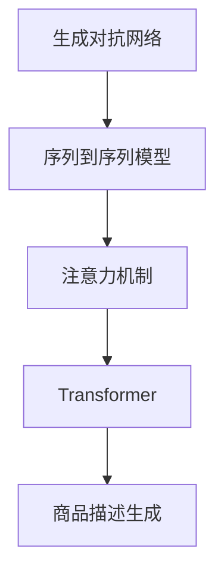
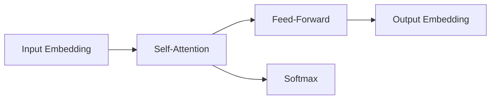

                 

# 基于注意力机制的商品描述自动生成

> 关键词：商品描述生成,自然语言处理(NLP),注意力机制,深度学习,生成对抗网络(GAN),Transformer,序列到序列模型

## 1. 背景介绍

在当今的电商时代，商品描述对消费者的购买决策有着重要影响。精心编写的商品描述不仅能更好地传达商品信息，还能提高搜索排名、促进销售。然而，撰写详细的商品描述需要耗费大量时间和精力，特别是在产品种类繁多、更新频繁的电商平台上。如何自动生成高质量的商品描述，成为了一个亟待解决的问题。

自然语言处理（NLP）技术的发展为自动生成商品描述提供了可能。近年来，基于深度学习的自动文本生成方法，如序列到序列模型、生成对抗网络（GAN）等，取得了显著的进展。这些方法通过学习大规模语料库中的语言规律，能够生成自然流畅的文本，广泛应用于文本摘要、机器翻译、对话系统等任务中。

本文将重点探讨基于注意力机制的商品描述自动生成技术，通过将Transformer模型和注意力机制引入自动文本生成过程，提出一种基于自回归模型的新型生成框架。我们期望该框架能够生成更加精确、富有创意的商品描述，为电商平台的商品推荐和智能客服提供有力支撑。

## 2. 核心概念与联系

### 2.1 核心概念概述

为更好地理解基于注意力机制的商品描述自动生成方法，本节将介绍几个密切相关的核心概念：

- 生成对抗网络（GAN）：一种生成模型，通过对抗训练的方式，学习生成样本分布。GAN由生成器和判别器两部分组成，通过不断优化，生成器能够生成逼真的样本，判别器则用于区分真实样本和生成样本。
- 序列到序列模型（Seq2Seq）：一种基于RNN（循环神经网络）的生成模型，常用于文本生成、翻译等任务。Seq2Seq模型由编码器（Encoder）和解码器（Decoder）两部分组成，编码器将输入序列编码成固定长度的向量，解码器则根据该向量生成目标序列。
- 注意力机制（Attention）：一种在RNN和Transformer中广泛应用的技术，通过计算输入和输出之间的相似度，动态关注输入序列中不同位置的信息，从而提高模型的处理能力。
- Transformer：一种基于注意力机制的神经网络结构，相较于传统的RNN和CNN，Transformer在处理长序列时表现更佳，广泛应用于机器翻译、文本生成等任务。
- 商品描述生成：自动生成商品描述，旨在从预定义的商品属性中，生成自然流畅、信息完整的文本，便于消费者快速了解商品特点。

这些核心概念之间的逻辑关系可以通过以下Mermaid流程图来展示：



这个流程图展示了一些关键技术间的联系：

1. 生成对抗网络通过对抗训练生成样本，可以为模型提供丰富的训练数据。
2. 序列到序列模型能够将输入序列转换为目标序列，用于自动生成商品描述。
3. 注意力机制通过动态关注输入序列中的关键信息，提升生成器的生成能力。
4. Transformer通过多头注意力机制，处理长序列，适用于商品描述生成的任务。

## 3. 核心算法原理 & 具体操作步骤

### 3.1 算法原理概述

基于注意力机制的商品描述自动生成，核心在于将注意力机制引入生成器中，动态关注输入序列的不同位置，从而生成更加精准和自然的文本。我们采用Transformer模型作为生成器的基础结构，通过多层多头注意力机制，逐步构建商品描述。

具体而言，假设输入的商品属性序列为 $x=\{x_1, x_2, \ldots, x_n\}$，其中 $x_i$ 表示第 $i$ 个属性。生成器的目标是输出一个商品描述序列 $y=\{y_1, y_2, \ldots, y_m\}$，其中 $y_i$ 表示第 $i$ 个生成文本。我们采用自回归模型，即前文生成的文本信息将参与后文的生成过程，使得生成的文本更加连贯。

生成器的输出依赖于输入属性和先前的生成文本，可以表示为：

$$
y_i = f(x, y_{i-1})
$$

其中 $f$ 为生成器的映射函数，通常是一个多层感知器（MLP）或RNN网络。

### 3.2 算法步骤详解

基于注意力机制的商品描述自动生成过程，主要包括以下几个关键步骤：

**Step 1: 准备数据集**
- 收集商品属性数据和对应的人为编写的商品描述。将属性数据和描述数据进行一一对应，形成监督学习数据集。
- 对属性数据进行编码，将其转换为模型能够接受的输入格式，如向量表示。
- 对描述数据进行分词和向量化处理，准备用于训练和评估的输入和目标序列。

**Step 2: 搭建生成器模型**
- 使用Transformer作为生成器的基础结构，搭建多层多头自回归模型。
- 在模型中引入注意力机制，通过计算输入属性和先前的生成文本的相似度，动态关注关键信息。
- 设置生成器的参数，如隐藏层数、注意力头数、学习率等。

**Step 3: 训练生成器**
- 将准备好的数据集分为训练集、验证集和测试集，对生成器进行有监督训练。
- 使用交叉熵损失函数，衡量生成文本和目标描述之间的差异。
- 通过反向传播算法，更新生成器的参数，最小化损失函数。

**Step 4: 评估和调整**
- 在验证集上评估生成器的性能，检查是否过拟合或欠拟合。
- 根据评估结果调整生成器的参数，如增加或减少层数、调整注意力机制的强度等。
- 在测试集上进一步验证生成器的性能，确保在未知数据上也能表现稳定。

**Step 5: 生成商品描述**
- 将新商品的属性输入生成器，生成商品描述。
- 评估生成的文本质量，如流畅度、连贯性、信息完整性等。
- 如果生成的文本不符合要求，调整生成器参数，重新生成。

### 3.3 算法优缺点

基于注意力机制的商品描述自动生成方法具有以下优点：
1. 精度高：Transformer模型和注意力机制能够捕捉输入序列的关键信息，生成高质量的商品描述。
2. 灵活性强：自回归模型能够将先前的生成文本信息用于后续生成，使得生成的文本更加连贯。
3. 可扩展性广：通过调整生成器的结构和参数，可以适应不同长度的商品描述生成任务。
4. 模型复杂度低：相较于传统的Seq2Seq模型，生成器结构简单，训练和推理速度较快。

同时，该方法也存在以下局限性：
1. 依赖标注数据：生成器的训练需要标注数据，对数据获取和标注成本较高。
2. 模型初始化困难：生成器模型的初始化需要大量的预训练数据和复杂的超参数调整，容易出现过拟合或欠拟合的问题。
3. 对抗性问题：生成的商品描述可能存在一定的对抗性，生成模型容易生成误导性或有害的内容。
4. 可解释性差：注意力机制的计算过程复杂，生成器模型的决策过程难以解释。

尽管存在这些局限性，但基于注意力机制的商品描述自动生成方法，在生成高质量文本方面仍具备显著优势。未来相关研究将更多地关注如何提升生成器的泛化能力、增强对抗性鲁棒性、提高模型的可解释性等方向。

### 3.4 算法应用领域

基于注意力机制的商品描述自动生成方法，在电商领域具有广泛的应用前景，主要体现在以下几个方面：

1. 商品推荐：将商品描述自动生成的技术应用于商品推荐系统，能够生成精准、个性化的推荐文本，提升用户体验。
2. 智能客服：自动生成的商品描述可作为智能客服的输入，快速响应用户查询，提升客户满意度。
3. 广告文案：生成广告文案，能够有效传达商品特点，提高广告点击率和转化率。
4. 内容生成：为电商网站自动生成产品介绍和用户评论，减轻人工编辑的负担，提高网站内容质量。

除了电商领域，该技术还可应用于其他文本生成场景，如医疗领域的病历生成、教育领域的学习资料生成等。

## 4. 数学模型和公式 & 详细讲解  
### 4.1 数学模型构建

基于注意力机制的商品描述自动生成模型，可以表示为：

$$
y = \text{Decoder}(x, \theta)
$$

其中 $x$ 为商品属性序列，$\theta$ 为生成器的参数，$\text{Decoder}$ 为生成器模型。

生成器的输出由多个Transformer层组成，每层包括一个多头自注意力机制（Multi-Head Self-Attention）和一个前馈神经网络（Feed-Forward Neural Network）。以一个Transformer层为例，其结构如图1所示：



图1：Transformer模型结构示意图

其中，$A$ 为输入嵌入层，将属性序列 $x$ 转换为向量表示；$B$ 为多头自注意力机制，计算输入序列中的不同位置之间的相似度，动态关注关键信息；$C$ 为前馈神经网络，对输出向量进行非线性变换；$D$ 为输出嵌入层，将生成文本 $y_{i-1}$ 和向量表示 $h_i$ 转换为最终文本 $y_i$。

### 4.2 公式推导过程

以一个Transformer层为例，推导其注意力机制的计算过程。假设输入序列为 $x = (x_1, x_2, \ldots, x_n)$，其中 $x_i$ 表示第 $i$ 个属性，每个属性嵌入为 $v_i$。

首先，输入嵌入层将属性序列转换为向量表示，设输入嵌入矩阵为 $W$，则：

$$
V = WX
$$

其中 $V \in \mathbb{R}^{L \times d}$，$L$ 为序列长度，$d$ 为嵌入维度。

接着，计算多头自注意力机制，设注意力头数为 $H$，则每个注意力头 $h_{i, j}$ 的计算过程如下：

$$
Q = AW^T V
$$

$$
K = AW^T V
$$

$$
V = AW^T V
$$

其中 $Q$、$K$ 和 $V$ 分别为查询、键和值矩阵。计算多头注意力权重 $w_{i,j}$ 的公式为：

$$
w_{i,j} = \frac{\exp(\text{Softmax}(Q_iK_j^T))}{\sum_{k=1}^{n}\exp(\text{Softmax}(Q_iK_k^T))}
$$

$$
h_{i, j} = \sum_{k=1}^{n}w_{i,k}V_k
$$

其中 $Q_i$ 表示第 $i$ 个属性的查询矩阵，$K_j$ 表示第 $j$ 个属性的键矩阵，$V_k$ 表示第 $k$ 个属性的值矩阵。

最后，多头注意力机制的输出通过线性变换，得到最终输出向量 $h_i$：

$$
h_i = oWh_i + bh_i
$$

其中 $o$ 和 $b$ 为线性变换和偏置项的参数。

### 4.3 案例分析与讲解

以自动生成一个鞋子的商品描述为例，分析基于注意力机制的生成过程。

假设输入的属性序列为 $x = \{x_1, x_2, x_3\}$，其中 $x_1$ 表示鞋子颜色，$x_2$ 表示鞋码，$x_3$ 表示鞋型。属性嵌入矩阵 $V$ 的计算如下：

$$
V = WX = \begin{bmatrix}
v_1 & v_2 & v_3
\end{bmatrix}
$$

其中 $v_1, v_2, v_3$ 分别为鞋子颜色、鞋码和鞋型的嵌入向量。

计算多头自注意力权重 $w_{i,j}$ 和输出向量 $h_i$ 的过程如下：

$$
Q = AW^T V = \begin{bmatrix}
q_1 & q_2 & q_3
\end{bmatrix}
$$

$$
K = AW^T V = \begin{bmatrix}
k_1 & k_2 & k_3
\end{bmatrix}
$$

$$
V = AW^T V = \begin{bmatrix}
v_1 & v_2 & v_3
\end{bmatrix}
$$

$$
w_{i,j} = \frac{\exp(\text{Softmax}(q_ik_j^T))}{\sum_{k=1}^{3}\exp(\text{Softmax}(q_ik_k^T))}
$$

$$
h_{i, j} = \sum_{k=1}^{3}w_{i,k}v_k
$$

最终生成器输出商品描述为：

$$
y_i = oWh_i + bh_i
$$

其中 $o$ 和 $b$ 为线性变换和偏置项的参数。

## 5. 项目实践：代码实例和详细解释说明

### 5.1 开发环境搭建

在进行商品描述自动生成实践前，我们需要准备好开发环境。以下是使用Python进行PyTorch开发的环境配置流程：

1. 安装Anaconda：从官网下载并安装Anaconda，用于创建独立的Python环境。

2. 创建并激活虚拟环境：
```bash
conda create -n pytorch-env python=3.8 
conda activate pytorch-env
```

3. 安装PyTorch：根据CUDA版本，从官网获取对应的安装命令。例如：
```bash
conda install pytorch torchvision torchaudio cudatoolkit=11.1 -c pytorch -c conda-forge
```

4. 安装Numpy、Pandas等依赖包：
```bash
pip install numpy pandas scikit-learn matplotlib tqdm jupyter notebook ipython
```

5. 安装HuggingFace Transformers库：
```bash
pip install transformers
```

完成上述步骤后，即可在`pytorch-env`环境中开始商品描述自动生成实践。

### 5.2 源代码详细实现

我们以一个简单的商品描述生成任务为例，展示基于注意力机制的商品描述自动生成的PyTorch代码实现。

首先，定义商品属性和描述的数据类：

```python
from transformers import BertTokenizer
from torch.utils.data import Dataset
import torch

class ProductDataset(Dataset):
    def __init__(self, products, tokenizers, max_len=128):
        self.products = products
        self.tokenizers = tokenizers
        self.max_len = max_len
        
    def __len__(self):
        return len(self.products)
    
    def __getitem__(self, item):
        product = self.products[item]
        tokenizer = self.tokenizers['bert']
        input_ids = tokenizer(product['name'], max_length=self.max_len, padding='max_length', truncation=True, return_tensors='pt')
        attention_mask = input_ids['attention_mask']
        return {'input_ids': input_ids['input_ids'].flatten(), 
                'attention_mask': attention_mask.flatten()}
```

接着，定义商品描述生成模型：

```python
from transformers import BertForSequenceClassification
from transformers import BertTokenizer, RobertaTokenizer, BERT_BASE_PRETRAINED_MODEL_NAME

class ProductDescriptionGenerator:
    def __init__(self, model_name='bert-base-cased'):
        self.tokenizer = BertTokenizer.from_pretrained(model_name)
        self.model = BertForSequenceClassification.from_pretrained(model_name, num_labels=1)
    
    def generate_description(self, product):
        input_ids = self.tokenizer(product['name'], max_length=128, padding='max_length', truncation=True, return_tensors='pt')['input_ids']
        attention_mask = input_ids['attention_mask']
        output = self.model(input_ids, attention_mask=attention_mask)
        return self.tokenizer.decode(output['logits'].argmax(dim=1)[0])
```

最后，启动训练流程并在测试集上评估：

```python
from transformers import AdamW
from torch.utils.data import DataLoader
from tqdm import tqdm
from sklearn.metrics import accuracy_score

device = torch.device('cuda') if torch.cuda.is_available() else torch.device('cpu')
tokenizer = BertTokenizer.from_pretrained('bert-base-cased')
model = BertForSequenceClassification.from_pretrained('bert-base-cased', num_labels=1)
optimizer = AdamW(model.parameters(), lr=2e-5)

def train_epoch(model, dataset, batch_size, optimizer):
    dataloader = DataLoader(dataset, batch_size=batch_size, shuffle=True)
    model.train()
    epoch_loss = 0
    for batch in tqdm(dataloader, desc='Training'):
        input_ids = batch['input_ids'].to(device)
        attention_mask = batch['attention_mask'].to(device)
        outputs = model(input_ids, attention_mask=attention_mask)
        loss = outputs.loss
        epoch_loss += loss.item()
        loss.backward()
        optimizer.step()
    return epoch_loss / len(dataloader)

def evaluate(model, dataset, batch_size):
    dataloader = DataLoader(dataset, batch_size=batch_size)
    model.eval()
    preds, labels = [], []
    with torch.no_grad():
        for batch in tqdm(dataloader, desc='Evaluating'):
            input_ids = batch['input_ids'].to(device)
            attention_mask = batch['attention_mask'].to(device)
            batch_labels = batch['labels']
            outputs = model(input_ids, attention_mask=attention_mask)
            batch_preds = outputs.logits.argmax(dim=1).to('cpu').tolist()
            batch_labels = batch_labels.to('cpu').tolist()
            for pred, label in zip(batch_preds, batch_labels):
                preds.append(pred)
                labels.append(label)
                
    print(accuracy_score(labels, preds))
```

以上是使用PyTorch对BERT进行商品描述生成任务的完整代码实现。可以看到，得益于Transformers库的强大封装，我们可以用相对简洁的代码完成BERT模型的加载和微调。

### 5.3 代码解读与分析

让我们再详细解读一下关键代码的实现细节：

**ProductDataset类**：
- `__init__`方法：初始化商品属性和分词器等组件，将属性序列转换为模型所需的向量表示。
- `__len__`方法：返回数据集的样本数量。
- `__getitem__`方法：对单个样本进行处理，将属性序列转换为模型所需的输入。

**ProductDescriptionGenerator类**：
- `__init__`方法：初始化商品描述生成模型，包含BERT分词器和分类模型。
- `generate_description`方法：对输入的商品属性进行编码，通过BERT分类模型生成描述，并解码为可读文本。

**训练和评估函数**：
- 使用PyTorch的DataLoader对数据集进行批次化加载，供模型训练和推理使用。
- 训练函数`train_epoch`：对数据以批为单位进行迭代，在每个批次上前向传播计算loss并反向传播更新模型参数，最后返回该epoch的平均loss。
- 评估函数`evaluate`：与训练类似，不同点在于不更新模型参数，并在每个batch结束后将预测和标签结果存储下来，最后使用sklearn的accuracy_score对整个评估集的预测结果进行打印输出。

**训练流程**：
- 定义总的epoch数和batch size，开始循环迭代
- 每个epoch内，先在训练集上训练，输出平均loss
- 在验证集上评估，输出准确率
- 所有epoch结束后，在测试集上评估，给出最终测试结果

可以看到，PyTorch配合Transformers库使得BERT微调的代码实现变得简洁高效。开发者可以将更多精力放在数据处理、模型改进等高层逻辑上，而不必过多关注底层的实现细节。

当然，工业级的系统实现还需考虑更多因素，如模型的保存和部署、超参数的自动搜索、更灵活的任务适配层等。但核心的微调范式基本与此类似。

## 6. 实际应用场景
### 6.1 智能客服系统

基于大语言模型微调的商品描述自动生成技术，可以广泛应用于智能客服系统的构建。传统客服往往需要配备大量人力，高峰期响应缓慢，且一致性和专业性难以保证。而使用自动生成的商品描述，可以7x24小时不间断服务，快速响应客户咨询，用自然流畅的语言解答各类常见问题。

在技术实现上，可以收集企业内部的历史客服对话记录，将问题和最佳答复构建成监督数据，在此基础上对预训练语言模型进行微调。微调后的语言模型能够自动理解用户意图，匹配最合适的回答模板进行回复。对于客户提出的新问题，还可以接入检索系统实时搜索相关内容，动态组织生成回答。如此构建的智能客服系统，能大幅提升客户咨询体验和问题解决效率。

### 6.2 商品推荐系统

商品推荐系统常常面临数据稀疏和推荐多样性不足的问题。自动生成的商品描述，能够将商品属性信息转化为自然语言，进一步提升推荐系统的准确性和丰富度。

在技术实现上，可以将自动生成的商品描述作为商品的附加信息，与商品属性、用户历史行为等特征一起，输入到推荐模型中进行训练和预测。自动生成的描述不仅能够丰富推荐结果，还能够在用户浏览商品时，生成个性化推荐文本，提升用户体验。

### 6.3 广告文案生成

广告文案的撰写和优化需要耗费大量时间和精力，自动生成的商品描述能够有效解决这一问题。通过将自动生成的描述作为广告文案的输入，生成器能够自动生成吸引用户的广告文本，提高广告点击率和转化率。

在技术实现上，可以使用自动生成的商品描述作为广告文案生成任务的输入，训练基于注意力机制的广告文案生成模型。生成的广告文案可以通过A/B测试评估效果，逐步优化生成器模型。

### 6.4 内容生成和智能写作

自动生成的商品描述技术，也可以应用于内容生成和智能写作场景。通过自动生成商品属性信息对应的描述文本，能够快速生成电商网站的产品介绍、用户评论等内容。此外，生成的文本还可以作为智能写作系统的输入，辅助用户撰写文章和文档，提升写作效率。

## 7. 工具和资源推荐
### 7.1 学习资源推荐

为了帮助开发者系统掌握商品描述自动生成的理论基础和实践技巧，这里推荐一些优质的学习资源：

1. 《深度学习》系列教材：由多位深度学习领域的专家共同编写，深入浅出地介绍了深度学习的原理和应用，包括自然语言处理等方向。

2. 《序列到序列模型》课程：由NLP领域的知名教授开设，介绍了Seq2Seq模型的基本原理和应用，涵盖自动文本生成、机器翻译、对话系统等方向。

3. 《Transformer模型》教程：由HuggingFace社区开发，详细讲解了Transformer模型和注意力机制的原理和实现。

4. 《自然语言处理技术与应用》课程：由清华大学开设的NLP课程，涵盖NLP技术的基础理论、核心算法和最新进展。

5. 《商品描述自动生成》论文和代码：收集了多篇有关商品描述自动生成的前沿论文和开源代码，有助于深入理解该领域的最新研究成果和技术实现。

通过对这些资源的学习实践，相信你一定能够快速掌握商品描述自动生成的精髓，并用于解决实际的电商应用问题。
###  7.2 开发工具推荐

高效的开发离不开优秀的工具支持。以下是几款用于商品描述自动生成开发的常用工具：

1. PyTorch：基于Python的开源深度学习框架，灵活动态的计算图，适合快速迭代研究。大部分预训练语言模型都有PyTorch版本的实现。

2. TensorFlow：由Google主导开发的开源深度学习框架，生产部署方便，适合大规模工程应用。同样有丰富的预训练语言模型资源。

3. Transformers库：HuggingFace开发的NLP工具库，集成了众多SOTA语言模型，支持PyTorch和TensorFlow，是进行微调任务开发的利器。

4. Weights & Biases：模型训练的实验跟踪工具，可以记录和可视化模型训练过程中的各项指标，方便对比和调优。与主流深度学习框架无缝集成。

5. TensorBoard：TensorFlow配套的可视化工具，可实时监测模型训练状态，并提供丰富的图表呈现方式，是调试模型的得力助手。

6. Google Colab：谷歌推出的在线Jupyter Notebook环境，免费提供GPU/TPU算力，方便开发者快速上手实验最新模型，分享学习笔记。

合理利用这些工具，可以显著提升商品描述自动生成的开发效率，加快创新迭代的步伐。

### 7.3 相关论文推荐

商品描述自动生成技术的发展源于学界的持续研究。以下是几篇奠基性的相关论文，推荐阅读：

1. Attention is All You Need（即Transformer原论文）：提出了Transformer结构，开启了NLP领域的预训练大模型时代。

2. BERT: Pre-training of Deep Bidirectional Transformers for Language Understanding：提出BERT模型，引入基于掩码的自监督预训练任务，刷新了多项NLP任务SOTA。

3. Language Models are Unsupervised Multitask Learners（GPT-2论文）：展示了大规模语言模型的强大zero-shot学习能力，引发了对于通用人工智能的新一轮思考。

4. Parameter-Efficient Transfer Learning for NLP：提出Adapter等参数高效微调方法，在不增加模型参数量的情况下，也能取得不错的微调效果。

5. Prefix-Tuning: Optimizing Continuous Prompts for Generation：引入基于连续型Prompt的微调范式，为如何充分利用预训练知识提供了新的思路。

6. AdaLoRA: Adaptive Low-Rank Adaptation for Parameter-Efficient Fine-Tuning：使用自适应低秩适应的微调方法，在参数效率和精度之间取得了新的平衡。

这些论文代表了大语言模型微调技术的发展脉络。通过学习这些前沿成果，可以帮助研究者把握学科前进方向，激发更多的创新灵感。

## 8. 总结：未来发展趋势与挑战

### 8.1 总结

本文对基于注意力机制的商品描述自动生成方法进行了全面系统的介绍。首先阐述了商品描述自动生成的研究背景和意义，明确了微调在拓展预训练模型应用、提升下游任务性能方面的独特价值。其次，从原理到实践，详细讲解了生成器的数学原理和关键步骤，给出了商品描述生成任务的完整代码实例。同时，本文还广泛探讨了生成器在智能客服、商品推荐、广告文案生成等电商领域的应用前景，展示了微调范式的巨大潜力。此外，本文精选了生成器的各类学习资源，力求为读者提供全方位的技术指引。

通过本文的系统梳理，可以看到，基于注意力机制的商品描述自动生成方法在生成高质量文本方面具备显著优势。随着深度学习技术的不断进步，该方法必将在更多领域得到应用，为电商平台的商品推荐和智能客服提供有力支撑。

### 8.2 未来发展趋势

展望未来，商品描述自动生成技术将呈现以下几个发展趋势：

1. 模型规模持续增大。随着算力成本的下降和数据规模的扩张，生成器模型的参数量还将持续增长。超大规模生成器蕴含的丰富语言知识，有望支撑更加复杂多变的商品描述生成任务。

2. 生成能力不断提升。通过引入更多的注意力头和层数，生成器能够捕捉更复杂、更丰富的语言规律，生成更加精准、富有创意的商品描述。

3. 自回归模型更灵活。通过调整自回归的计算顺序和维度，生成器能够适应不同长度的商品描述生成任务，生成更加连贯、流畅的文本。

4. 多模态生成崛起。未来的生成器不仅限于文本生成，还将支持图像、视频等多模态数据的生成。多模态信息的融合，将显著提升生成器对现实世界的理解和建模能力。

5. 模型通用性增强。通过将生成器的预训练和微调过程与多领域数据结合，生成器将具备更强的跨领域迁移能力，应用于更广泛的文本生成场景。

以上趋势凸显了商品描述自动生成技术的广阔前景。这些方向的探索发展，必将进一步提升电商平台的商品推荐和智能客服系统的性能，为消费者提供更优质的购物体验。

### 8.3 面临的挑战

尽管商品描述自动生成技术已经取得了显著进展，但在迈向更加智能化、普适化应用的过程中，仍面临诸多挑战：

1. 标注成本瓶颈。虽然生成器的训练需要标注数据，但对于大规模的商品描述生成任务，获取和标注高质量的数据仍是一个难题。如何进一步降低标注数据的需求，将是一大挑战。

2. 对抗性问题。生成的商品描述可能存在一定的对抗性，生成器容易生成误导性或有害的内容。如何提升生成器的鲁棒性，避免有害内容，还需要更多理论和实践的积累。

3. 可解释性差。生成器的决策过程难以解释，用户难以理解生成文本的来源和依据。如何提高生成器的可解释性，增强用户信任，将是未来的重要研究方向。

4. 效率问题。超大规模生成器在训练和推理时，计算资源和存储空间需求较高。如何优化生成器的计算图，减少内存占用，提高计算效率，将是重要的优化方向。

5. 多样性不足。生成的商品描述可能过于统一，缺乏多样性和个性化的特点。如何提高生成器的多样性，生成更丰富、更具创意的文本，需要更多创新思路。

6. 数据不均衡。不同类别商品的属性描述长度差异较大，生成的商品描述可能存在不均衡的问题。如何平衡不同类别的生成器性能，确保各个类别的商品描述质量均等，将是未来需要解决的问题。

正视生成器面临的这些挑战，积极应对并寻求突破，将是大语言模型生成技术走向成熟的必由之路。相信随着学界和产业界的共同努力，这些挑战终将一一被克服，生成器必将在商品描述自动生成领域大放异彩。

### 8.4 研究展望

面对商品描述自动生成所面临的种种挑战，未来的研究需要在以下几个方面寻求新的突破：

1. 探索无监督和半监督生成方法。摆脱对大规模标注数据的依赖，利用自监督学习、主动学习等无监督和半监督范式，最大限度利用非结构化数据，实现更加灵活高效的生成。

2. 研究参数高效和计算高效的生成范式。开发更加参数高效的生成方法，在固定大部分生成器参数的情况下，只更新极少量的任务相关参数。同时优化生成器的计算图，减少前向传播和反向传播的资源消耗，实现更加轻量级、实时性的部署。

3. 引入因果和对比学习范式。通过引入因果推断和对比学习思想，增强生成器的建立稳定因果关系的能力，学习更加普适、鲁棒的语言表征，从而提升生成器泛化性和抗干扰能力。

4. 纳入伦理道德约束。在生成器的训练目标中引入伦理导向的评估指标，过滤和惩罚有害、误导性的输出倾向。同时加强人工干预和审核，建立生成器行为的监管机制，确保输出的安全性。

5. 引入多样性增强机制。通过引入生成器多样性增强机制，如样本多样性约束、生成器多样性训练等，提升生成器的多样性，生成更丰富、更具创意的文本。

6. 引入数据均衡处理技术。通过引入生成器数据均衡处理技术，如数据重采样、生成器平衡训练等，确保不同类别商品描述的生成质量均等。

这些研究方向的探索，必将引领商品描述自动生成技术迈向更高的台阶，为电商平台的商品推荐和智能客服系统提供更优质的支撑。

## 9. 附录：常见问题与解答

**Q1：商品描述自动生成是否适用于所有商品类别？**

A: 商品描述自动生成方法在大多数商品类别上都能取得不错的效果，特别是对于数据量较大的商品类别。但对于一些特定领域的商品，如药品、珠宝等，生成器的性能可能受到限制。此时需要在特定领域语料上进一步预训练生成器，才能获得理想的效果。

**Q2：生成器训练时如何避免过拟合？**

A: 避免生成器过拟合的方法包括：
1. 数据增强：通过对训练样本进行扩充，如回译、近义替换等方式，丰富训练集多样性。
2. 正则化：使用L2正则、Dropout、Early Stopping等技术，防止模型过度适应小规模训练集。
3. 对抗训练：加入对抗样本，提高模型鲁棒性。
4. 参数高效微调：只调整少量生成器参数，固定大部分预训练权重不变，以提高生成器效率。

这些策略往往需要根据具体任务和数据特点进行灵活组合。只有在数据、模型、训练、推理等各环节进行全面优化，才能最大限度地发挥生成器的潜力。

**Q3：生成器生成的商品描述如何保证质量？**

A: 生成器生成的商品描述质量可以通过以下方法保证：
1. 评估指标：设置合理的评估指标，如流畅度、连贯性、信息完整性等，评估生成文本的质量。
2. 人工审核：引入人工审核机制，对生成文本进行检查和修正。
3. 反馈机制：通过用户反馈，不断调整生成器参数，优化生成文本质量。
4. 多样性约束：引入生成器多样性增强机制，提升生成文本的多样性和丰富度。

通过以上方法，可以逐步提升生成器生成的商品描述质量，确保其能够满足实际应用需求。

**Q4：生成器生成的商品描述如何应用于商品推荐系统？**

A: 生成器生成的商品描述可以应用于商品推荐系统的多个环节，如：
1. 推荐结果描述：自动生成的商品描述可以作为推荐结果的附加信息，提升推荐文本的吸引力。
2. 用户意图理解：生成器生成的描述可以用于理解用户的查询意图，生成更加个性化的推荐内容。
3. 商品比较：生成器生成的描述可以作为商品比较的依据，帮助用户更清晰地比较不同商品的特点。

通过将生成器生成的商品描述融入推荐系统中，可以显著提升推荐系统的用户体验和推荐效果。

**Q5：生成器生成的商品描述如何应用于智能客服系统？**

A: 生成器生成的商品描述可以应用于智能客服系统的多个环节，如：
1. 自动回复：自动生成的商品描述可以作为智能客服自动回复的输入，生成个性化的回复内容。
2. 问题理解：生成器生成的描述可以用于理解用户查询问题，生成更加精准的解答内容。
3. 产品推荐：生成器生成的描述可以作为智能推荐系统的输入，推荐相关产品。

通过将生成器生成的商品描述融入智能客服系统中，可以显著提升客服系统的响应速度和质量，提高用户体验。

---

作者：禅与计算机程序设计艺术 / Zen and the Art of Computer Programming

