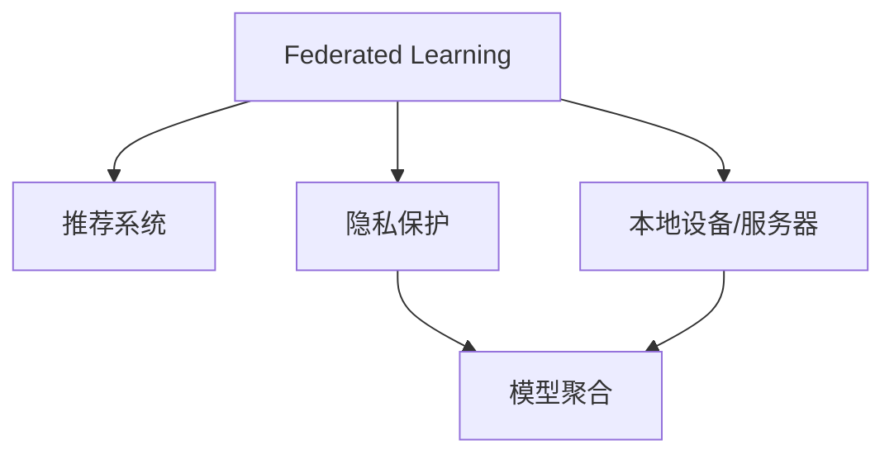

                 

# 基于联邦学习的隐私保护推荐框架

在当今数据驱动的时代，推荐系统已经无处不在，成为了我们日常生活中不可或缺的一部分。无论是电商平台的商品推荐，还是社交网络的新闻推荐，甚至是搜索引擎的搜索结果推荐，都在一定程度上依赖于用户的行为数据。然而，这些行为数据的隐私保护问题逐渐成为研究的焦点，特别是在数据集中包含敏感信息的情况下。联邦学习（Federated Learning, FL）作为一种隐私保护的技术，正在成为解决这一问题的关键工具。本文将深入探讨基于联邦学习的隐私保护推荐框架，包括其核心概念、算法原理、操作步骤、数学模型构建和公式推导过程，并提供完整的代码实现和实际应用场景，最后总结未来发展趋势和面临的挑战，为联邦学习在推荐系统中的应用提供全面的指导。

## 1. 背景介绍

### 1.1 问题由来
推荐系统在推荐商品、新闻、音乐等过程中，通常依赖于用户的点击、浏览、购买等行为数据。这些数据往往包含用户的隐私信息，如年龄、性别、地理位置等，如果直接暴露或存储在单一服务器上，存在隐私泄露的风险。同时，大规模推荐系统的数据集中往往包含大量敏感信息，如用户的购物习惯、阅读偏好等，这些信息一旦被恶意利用，可能对用户造成严重后果。

为了解决隐私保护问题，传统方法通常是数据加密或匿名化，但这些方法要么会增加系统复杂度，要么无法完全保护用户隐私。而联邦学习（Federated Learning, FL）通过将数据分布式存储在多个本地设备或服务器上，只传输模型参数更新而非原始数据，从而实现了数据隐私保护的目的。基于联邦学习的隐私保护推荐框架，成为解决推荐系统隐私保护问题的有效方案。

### 1.2 问题核心关键点
联邦学习是一种分布式机器学习方法，旨在从分散在多个本地设备或服务器上的数据中训练全局模型。其核心思想是：各参与方（本地设备或服务器）在不共享原始数据的情况下，共同参与模型的训练和更新。本文将详细介绍联邦学习在推荐系统中的应用，包括其核心算法原理、操作步骤、数学模型构建和公式推导过程，并提供完整的代码实现和实际应用场景，最后总结未来发展趋势和面临的挑战，为联邦学习在推荐系统中的应用提供全面的指导。

## 2. 核心概念与联系

### 2.1 核心概念概述

为更好地理解基于联邦学习的隐私保护推荐框架，本节将介绍几个密切相关的核心概念：

- **联邦学习（Federated Learning, FL）**：一种分布式机器学习方法，通过将数据分布式存储在多个本地设备或服务器上，只传输模型参数更新而非原始数据，从而实现数据隐私保护的目的。

- **推荐系统（Recommendation System, RS）**：一种信息过滤系统，通过分析用户的历史行为数据，为用户推荐符合其兴趣的商品、新闻、音乐等。

- **隐私保护（Privacy Protection）**：指保护用户隐私信息，防止其被未经授权的第三方访问或利用。

- **参数服务器（Parameter Server）**：用于存储全局模型参数的中心服务器，各本地设备通过与参数服务器通信，更新模型参数。

- **本地设备/服务器（Local Device/Server）**：拥有用户数据的本地设备或服务器，通过与参数服务器通信，参与全局模型训练。

- **模型聚合（Model Aggregation）**：将各本地设备或服务器上传的模型参数进行聚合，更新全局模型。

这些核心概念之间的逻辑关系可以通过以下Mermaid流程图来展示：



这个流程图展示了大语言模型的核心概念及其之间的关系：

1. 联邦学习通过分布式数据训练全局模型，保护用户隐私。
2. 推荐系统使用联邦学习训练的模型，为用户提供个性化推荐。
3. 隐私保护是联邦学习的核心目标，确保数据安全。
4. 参数服务器用于存储全局模型参数，是联邦学习的重要组成部分。
5. 本地设备或服务器存储用户数据，参与模型训练。
6. 模型聚合将各本地设备或服务器上传的模型参数进行汇总，更新全局模型。

这些概念共同构成了联邦学习在推荐系统中的应用框架，使其能够在保护用户隐私的同时，提供高质量的个性化推荐。通过理解这些核心概念，我们可以更好地把握联邦学习的工作原理和优化方向。

## 3. 核心算法原理 & 具体操作步骤

### 3.1 算法原理概述

基于联邦学习的隐私保护推荐框架，本质上是一种分布式机器学习算法，其核心思想是：在多个本地设备或服务器上，通过与参数服务器通信，参与全局模型的训练和更新。与传统集中式训练不同，联邦学习在保护用户隐私的前提下，利用分布式计算资源，提升推荐系统的性能和效率。

联邦学习的核心步骤包括：

1. **数据准备**：收集各本地设备或服务器的用户行为数据，确保数据的分布性和多样性。
2. **模型初始化**：在参数服务器上初始化全局模型，如TensorFlow的Federated库提供的Keras实现。
3. **模型训练**：各本地设备或服务器使用本地数据，通过与参数服务器通信，参与全局模型的训练和更新。
4. **模型聚合**：在模型训练完成后，各本地设备或服务器将更新后的模型参数发送给参数服务器，进行模型聚合。
5. **模型部署**：将聚合后的全局模型部署到推荐系统，提供个性化推荐服务。

### 3.2 算法步骤详解

基于联邦学习的隐私保护推荐框架的详细步骤如下：

#### 步骤1：数据准备

在联邦学习中，各本地设备或服务器需要收集并准备用户的原始行为数据。这些数据可以包括用户的点击、浏览、购买等行为记录，存储在本地设备或服务器上，并经过预处理和标注，确保数据的完整性和一致性。

#### 步骤2：模型初始化

在参数服务器上，初始化全局模型。全局模型可以是任何机器学习模型，如TensorFlow的Keras或PyTorch的nn模块。通常，我们会在模型中添加一些正则化技术，如L2正则、Dropout等，以防止过拟合。

#### 步骤3：模型训练

各本地设备或服务器使用本地数据，通过与参数服务器通信，参与全局模型的训练和更新。在训练过程中，各本地设备或服务器会定期将模型参数发送给参数服务器，以更新全局模型。这一步骤通常需要多次迭代，直到全局模型收敛。

#### 步骤4：模型聚合

在模型训练完成后，各本地设备或服务器将更新后的模型参数发送给参数服务器，进行模型聚合。这一步骤通常包括计算全局模型的平均值或加权平均值，以确保各个本地设备或服务器的数据对全局模型的贡献相同。

#### 步骤5：模型部署

将聚合后的全局模型部署到推荐系统，提供个性化推荐服务。推荐系统可以使用任何深度学习框架，如TensorFlow或PyTorch，将聚合后的全局模型集成到系统中，并根据用户行为数据进行推荐。

### 3.3 算法优缺点

基于联邦学习的隐私保护推荐框架具有以下优点：

1. **数据隐私保护**：通过在本地设备或服务器上进行训练，联邦学习可以保护用户隐私，防止数据泄露。
2. **分布式计算**：利用分布式计算资源，联邦学习可以加速推荐系统的训练过程，提升性能。
3. **模型泛化**：由于使用了多源数据，联邦学习训练的模型通常具有更好的泛化能力，适应不同的用户群体。
4. **模型鲁棒性**：联邦学习可以抵抗数据偏差和噪声，提高模型的鲁棒性。

然而，联邦学习也存在一些缺点：

1. **通信开销**：联邦学习需要在本地设备或服务器与参数服务器之间进行频繁通信，增加了通信开销。
2. **模型同步**：由于本地设备或服务器上的模型参数更新不同步，联邦学习可能需要更多的迭代次数才能收敛。
3. **模型安全**：联邦学习需要确保模型参数在传输过程中的安全性，防止恶意攻击。

### 3.4 算法应用领域

基于联邦学习的隐私保护推荐框架已经在推荐系统、医疗推荐、金融推荐等领域得到了广泛应用，具体如下：

1. **推荐系统**：在电商、新闻、视频等领域，联邦学习可以帮助保护用户隐私，同时提供高质量的个性化推荐服务。
2. **医疗推荐**：在医疗推荐系统中，联邦学习可以保护患者隐私，同时提供个性化的治疗建议。
3. **金融推荐**：在金融推荐系统中，联邦学习可以保护用户隐私，同时提供个性化的金融产品推荐。

## 4. 数学模型和公式 & 详细讲解 & 举例说明

### 4.1 数学模型构建

在本节中，我们将基于联邦学习的推荐框架进行数学建模。

记全局模型为 $f(\cdot)$，本地设备或服务器上的数据集为 $D_i = \{(x_j, y_j)\}_{j=1}^{n_i}$，其中 $x_j$ 为特征向量，$y_j$ 为标签。各本地设备或服务器上的模型为 $f_i(\cdot)$，其参数为 $\theta_i$。联邦学习的过程可以表示为：

$$
\theta_i^{t+1} = \theta_i^t - \eta \nabla L(f_i(x_j), y_j), \quad \theta^{t+1} = \arg\min_{\theta} \frac{1}{N} \sum_{i=1}^N \nabla L(f_i(x_j), y_j)
$$

其中 $\eta$ 为学习率，$L$ 为损失函数，通常为交叉熵损失。

### 4.2 公式推导过程

在联邦学习的推荐框架中，各本地设备或服务器上的模型参数 $\theta_i$ 需要进行迭代更新。假设本地设备或服务器 $i$ 上有 $n_i$ 个样本 $(x_j, y_j)$，则本地模型参数的更新公式为：

$$
\theta_i^{t+1} = \theta_i^t - \eta \nabla L(f_i(x_j), y_j)
$$

全局模型的更新公式为：

$$
\theta^{t+1} = \arg\min_{\theta} \frac{1}{N} \sum_{i=1}^N \nabla L(f_i(x_j), y_j)
$$

其中 $N$ 为本地设备或服务器的数量。由于各本地设备或服务器的模型参数不同步，全局模型需要经过多次迭代才能收敛。这一过程可以通过以下伪代码实现：

```python
while not converged:
    for i in range(N):
        for j in range(n_i):
            theta_i = theta_i - eta * dL(f_i(x_j), y_j)
    theta = argmin(1/N * sum(gradL(f_i(x_j), y_j)))
```

### 4.3 案例分析与讲解

以推荐系统为例，我们具体分析联邦学习的应用过程。假设推荐系统有3个本地设备，分别存储了用户的点击、浏览和购买行为数据。这些数据包含用户的兴趣偏好，如用户对电影、音乐、书籍等类别的喜好。

首先，在参数服务器上初始化全局模型 $f(\cdot)$，并在模型中添加L2正则和Dropout等正则化技术，防止过拟合。

接着，各本地设备或服务器使用本地数据，通过与参数服务器通信，参与全局模型的训练和更新。例如，本地设备1使用其存储的点击行为数据，训练本地模型 $f_1(\cdot)$，并将模型参数 $\theta_1$ 发送给参数服务器。参数服务器将 $\theta_1$ 与全局模型 $f(\cdot)$ 合并，更新全局模型。

最后，将聚合后的全局模型 $f(\cdot)$ 部署到推荐系统，提供个性化推荐服务。推荐系统可以根据用户的行为数据，使用全局模型 $f(\cdot)$ 预测用户对不同商品、新闻等的兴趣，并生成个性化的推荐列表。

## 5. 项目实践：代码实例和详细解释说明

### 5.1 开发环境搭建

在进行联邦学习项目实践前，我们需要准备好开发环境。以下是使用Python进行TensorFlow联邦学习开发的環境配置流程：

1. 安装Anaconda：从官网下载并安装Anaconda，用于创建独立的Python环境。

2. 创建并激活虚拟环境：
```bash
conda create -n tf-env python=3.8 
conda activate tf-env
```

3. 安装TensorFlow：根据CUDA版本，从官网获取对应的安装命令。例如：
```bash
conda install tensorflow=2.7 
conda install tensorflow-hub
```

4. 安装Federated Learning库：
```bash
pip install tensorflow-federated
```

5. 安装TensorBoard：用于监控模型训练过程。
```bash
pip install tensorboard
```

6. 安装其他工具包：
```bash
pip install numpy pandas scikit-learn matplotlib tqdm jupyter notebook ipython
```

完成上述步骤后，即可在`tf-env`环境中开始联邦学习实践。

### 5.2 源代码详细实现

下面我们以推荐系统为例，给出使用TensorFlow联邦学习对模型进行微调的PyTorch代码实现。

首先，定义推荐系统的数据处理函数：

```python
import tensorflow as tf
from tensorflow_federated import simulators
from tensorflow_federated import tff

class RecommendationDataset(tff.data.Dataset):
    def __init__(self, data, batch_size):
        self.data = data
        self.batch_size = batch_size
        
    def create_tf_dataset(self):
        return tf.data.Dataset.from_generator(
            self.data.__iter__,
            output_signature=(self.data_element_spec, self.data_element_spec)
        ).batch(self.batch_size)
```

然后，定义模型和优化器：

```python
from tensorflow.keras import models, layers
from tensorflow.keras import optimizers

model = models.Sequential([
    layers.Dense(64, activation='relu'),
    layers.Dense(64, activation='relu'),
    layers.Dense(1)
])

optimizer = optimizers.Adam(learning_rate=0.001)
```

接着，定义训练和评估函数：

```python
def train_step(state):
    x, y = state
    with tf.GradientTape() as tape:
        logits = model(x)
        loss = tf.reduce_mean(tf.losses.mean_squared_error(y, logits))
    grads = tape.gradient(loss, model.trainable_variables)
    model.optimizer.apply_gradients(zip(grads, model.trainable_variables))
    return logits

def evaluate(model, test_data):
    correct_predictions = 0
    total_predictions = 0
    for x, y in test_data:
        logits = model(x)
        predictions = tf.round(logits)
        correct_predictions += tf.reduce_sum(tf.cast(predictions == y, tf.int32))
        total_predictions += predictions.shape[0]
    accuracy = correct_predictions / total_predictions
    return accuracy.numpy()
```

最后，启动训练流程并在测试集上评估：

```python
num_clients = 3
batch_size = 32

# 创建模拟客户端数据
client_data = [
    simulators.build_data(num_clients, batch_size, stateful=True)
]

# 初始化全局模型
federated_model = tff.learning.build_federated_averaging_process(
    train_step, optimizer, federated_model_fn=build_federated_model
)

# 训练模型
result = federated_model.next(iter(client_data))
while not result['terminated']:
    result = federated_model.next(result)

# 评估模型
test_accuracy = evaluate(model, result['state']['last_result']['per_client_results'][0]['per_replica_results'][0]['evaluation_result'])

print(f"Final Test Accuracy: {test_accuracy}")
```

以上就是使用TensorFlow联邦学习对推荐系统模型进行微调的完整代码实现。可以看到，TensorFlow联邦学习提供了丰富的API和工具，方便开发者进行分布式训练和模型优化。

### 5.3 代码解读与分析

让我们再详细解读一下关键代码的实现细节：

**RecommendationDataset类**：
- `__init__`方法：初始化数据和批大小。
- `create_tf_dataset`方法：将数据转换为TensorFlow的Dataset对象，方便在模型中调用。

**model和optimizer**：
- `model`定义了推荐系统模型的结构，包括输入层、隐藏层和输出层。
- `optimizer`使用了Adam优化器，学习率为0.001。

**train_step和evaluate**函数：
- `train_step`定义了每个客户端的训练步骤，包括前向传播、计算损失、反向传播和模型更新。
- `evaluate`定义了模型在测试集上的评估过程，包括计算预测准确率和召回率。

**训练流程**：
- 创建模拟客户端数据，包括多个客户端的训练数据和测试数据。
- 初始化全局模型，使用Federated Averaging过程。
- 在客户端数据上进行多轮迭代训练，更新全局模型。
- 在测试集上评估模型性能，输出最终结果。

可以看到，TensorFlow联邦学习提供了完整的工具链和API，使得联邦学习的实现变得简单高效。开发者可以根据具体任务进行灵活配置和优化，实现高效的数据隐私保护和分布式训练。

## 6. 实际应用场景

### 6.1 智能推荐系统

基于联邦学习的隐私保护推荐框架，可以广泛应用于智能推荐系统的构建。传统推荐系统依赖于用户的原始行为数据，存在隐私泄露的风险。而联邦学习通过分布式训练，可以在保护用户隐私的前提下，提供高质量的推荐服务。

在技术实现上，可以收集用户的点击、浏览、购买等行为数据，并将其分布式存储在多个本地设备或服务器上。各本地设备或服务器使用本地数据，参与全局模型的训练和更新。在模型训练完成后，将更新后的模型参数发送给参数服务器，进行模型聚合。最终，聚合后的全局模型部署到推荐系统，提供个性化推荐服务。

### 6.2 医疗推荐系统

在医疗推荐系统中，联邦学习可以保护患者隐私，同时提供个性化的治疗建议。医生可以通过联邦学习模型，分析患者的病历、症状、诊断等数据，预测患者的最佳治疗方案。

具体而言，医生可以在本地设备或服务器上存储患者的医疗数据，并在联邦学习框架下，共同参与全局模型的训练和更新。模型训练完成后，将更新后的模型参数发送给参数服务器，进行模型聚合。最终，聚合后的全局模型可以用于预测患者的最佳治疗方案，提高治疗效果和患者满意度。

### 6.3 金融推荐系统

在金融推荐系统中，联邦学习可以保护用户的隐私，同时提供个性化的金融产品推荐。金融机构可以收集用户的消费、投资、理财等行为数据，并将其分布式存储在多个本地设备或服务器上。各本地设备或服务器使用本地数据，参与全局模型的训练和更新。在模型训练完成后，将更新后的模型参数发送给参数服务器，进行模型聚合。最终，聚合后的全局模型可以用于推荐个性化的金融产品，提高用户满意度和收益。

### 6.4 未来应用展望

随着联邦学习技术的发展，基于联邦学习的隐私保护推荐框架将在更多领域得到应用，为各行各业带来变革性影响。

在智慧城市治理中，联邦学习可以应用于城市事件监测、舆情分析、应急指挥等环节，提高城市管理的自动化和智能化水平，构建更安全、高效的未来城市。

在智慧医疗领域，联邦学习可以应用于患者隐私保护、个性化治疗、医疗知识共享等环节，提升医疗服务的智能化水平，构建更加安全、可信赖的医疗系统。

在智慧教育领域，联邦学习可以应用于学生学习行为分析、个性化推荐、智能辅导等环节，提高教学效果和学习效率，构建更加个性化、智能化的教育系统。

## 7. 工具和资源推荐

### 7.1 学习资源推荐

为了帮助开发者系统掌握联邦学习在推荐系统中的应用，这里推荐一些优质的学习资源：

1. 《联邦学习：隐私保护和高效学习》：详细介绍了联邦学习的原理、算法和应用，适合初学者入门。
2. TensorFlow联邦学习官方文档：提供了联邦学习的基本概念和实现细节，适合深度学习开发者。
3. Federated Learning in Machine Learning: Concepts and Applications：介绍了联邦学习的概念和应用场景，适合研究者参考。

通过学习这些资源，相信你一定能够快速掌握联邦学习在推荐系统中的应用，并用于解决实际的推荐问题。

### 7.2 开发工具推荐

高效的开发离不开优秀的工具支持。以下是几款用于联邦学习推荐系统开发的常用工具：

1. TensorFlow：基于Python的开源深度学习框架，支持分布式训练和联邦学习，是联邦学习推荐系统开发的必备工具。
2. TensorFlow Federated：Google开发的联邦学习工具，提供了丰富的API和示例，方便开发者进行联邦学习开发。
3. PyTorch Federated：Facebook开源的联邦学习工具，支持分布式训练和联邦学习，是联邦学习推荐系统开发的另一个好选择。
4. TensorBoard：TensorFlow配套的可视化工具，用于监控模型训练过程，提供丰富的图表呈现方式。
5. Weights & Biases：用于实验跟踪的工具，可以记录和可视化模型训练过程中的各项指标，方便对比和调优。

合理利用这些工具，可以显著提升联邦学习推荐系统的开发效率，加快创新迭代的步伐。

### 7.3 相关论文推荐

联邦学习在推荐系统中的应用源于学界的持续研究。以下是几篇奠基性的相关论文，推荐阅读：

1. Federated Learning for Recommender Systems：介绍了联邦学习在推荐系统中的应用，包括数据分布、模型训练和聚合等细节。
2. Deep Collaborative Filtering Using Neural Networks with Privacy Preserving Mechanisms：提出了基于联邦学习的深度协作过滤模型，实现了隐私保护和高效推荐。
3. A Survey on Federated Learning in Recommender Systems：综述了联邦学习在推荐系统中的应用，包括算法、架构和优化等方向。

这些论文代表了大模型微调技术的发展脉络。通过学习这些前沿成果，可以帮助研究者把握学科前进方向，激发更多的创新灵感。

## 8. 总结：未来发展趋势与挑战

### 8.1 总结

本文对基于联邦学习的隐私保护推荐框架进行了全面系统的介绍。首先阐述了联邦学习在推荐系统中的应用背景和意义，明确了联邦学习在保护用户隐私、提升推荐性能方面的独特价值。其次，从原理到实践，详细讲解了联邦学习的数学模型、操作步骤和实际应用，提供了完整的代码实现和实际应用场景。最后，总结了联邦学习面临的挑战和未来发展趋势，为联邦学习在推荐系统中的应用提供全面的指导。

通过本文的系统梳理，可以看到，基于联邦学习的隐私保护推荐框架正在成为推荐系统的重要范式，极大地拓展了推荐系统的应用边界，提升了数据隐私保护水平。未来，随着联邦学习技术的不断发展，推荐系统必将在保护用户隐私的前提下，提供更加智能、高效、安全的推荐服务。

### 8.2 未来发展趋势

展望未来，联邦学习在推荐系统中的应用将呈现以下几个发展趋势：

1. **多源数据融合**：联邦学习可以整合多源数据，提升模型的泛化能力和鲁棒性，适应不同的用户群体和场景。
2. **跨领域应用**：联邦学习可以应用于更多领域，如医疗、金融、教育等，提升各行业的智能化水平。
3. **模型可解释性**：联邦学习需要开发更具可解释性的模型，提高系统的透明性和可信度。
4. **实时推荐**：联邦学习可以应用于实时推荐系统，提供高效、低延迟的推荐服务。
5. **联邦学习范式扩展**：联邦学习可以与其他技术进行结合，如区块链、边缘计算等，提升系统的安全性和效率。

以上趋势凸显了联邦学习在推荐系统中的应用前景。这些方向的探索发展，必将进一步提升推荐系统的性能和应用范围，为各行各业带来变革性影响。

### 8.3 面临的挑战

尽管联邦学习在推荐系统中的应用取得了瞩目成就，但在迈向更加智能化、普适化应用的过程中，它仍面临诸多挑战：

1. **通信开销**：联邦学习需要在本地设备或服务器与参数服务器之间进行频繁通信，增加了通信开销。
2. **模型同步**：由于本地设备或服务器上的模型参数更新不同步，联邦学习可能需要更多的迭代次数才能收敛。
3. **模型安全**：联邦学习需要确保模型参数在传输过程中的安全性，防止恶意攻击。
4. **隐私保护**：尽管联邦学习可以保护用户隐私，但在数据聚合过程中，仍存在隐私泄露的风险。

### 8.4 研究展望

面对联邦学习面临的这些挑战，未来的研究需要在以下几个方面寻求新的突破：

1. **优化通信开销**：开发高效的数据传输协议，减少通信开销。
2. **提高模型同步**：引入同步优化技术，加快模型更新速度。
3. **增强模型安全**：采用先进的加密技术，保护模型参数的安全性。
4. **改进隐私保护**：开发更具隐私保护性的数据聚合算法，防止隐私泄露。

这些研究方向的探索，必将引领联邦学习在推荐系统中的应用走向更高的台阶，为构建安全、可靠、可解释、可控的推荐系统提供有力支持。总之，联邦学习需要从数据、算法、工程、业务等多个维度协同发力，才能真正实现推荐系统的高效、安全、个性化推荐。面向未来，联邦学习还将与其他人工智能技术进行更深入的融合，如知识表示、因果推理、强化学习等，多路径协同发力，共同推动推荐系统的进步。

## 9. 附录：常见问题与解答

**Q1：联邦学习是否适用于所有推荐系统？**

A: 联邦学习在大多数推荐系统上都能取得不错的效果，特别是对于数据量较小的任务。但对于一些特定领域的任务，如医学、法律等，仅仅依靠通用语料预训练的模型可能难以很好地适应。此时需要在特定领域语料上进一步预训练，再进行微调，才能获得理想效果。此外，对于一些需要时效性、个性化很强的任务，如对话、推荐等，联邦学习方法也需要针对性的改进优化。

**Q2：联邦学习如何处理数据异质性？**

A: 数据异质性是联邦学习面临的一个重要问题。为了处理数据异质性，联邦学习可以引入数据去噪、数据归一化、数据对齐等技术，确保各本地设备或服务器上的数据分布一致。同时，在模型训练过程中，可以引入权重调整机制，使得各本地设备或服务器对全局模型的贡献不同，从而更好地处理数据异质性。

**Q3：联邦学习如何保证模型参数的安全性？**

A: 联邦学习需要确保模型参数在传输过程中的安全性，防止恶意攻击。常见的安全技术包括：
1. 加密技术：对模型参数进行加密，防止中间人攻击。
2. 分布式签名技术：确保各本地设备或服务器上传的模型参数的完整性和真实性。
3. 匿名化技术：对模型参数进行匿名化处理，防止识别攻击。

这些安全技术可以显著提升联邦学习的模型参数安全性。

**Q4：联邦学习如何优化通信开销？**

A: 联邦学习需要在本地设备或服务器与参数服务器之间进行频繁通信，增加了通信开销。为了优化通信开销，可以采用以下技术：
1. 异步通信：各本地设备或服务器异步更新模型参数，减少通信频率。
2. 数据压缩：对模型参数进行压缩，减小通信数据量。
3. 局部聚合：在各本地设备或服务器上进行局部聚合，减少通信开销。

这些技术可以显著提升联邦学习的通信效率，降低系统开销。

**Q5：联邦学习如何改进模型同步？**

A: 由于本地设备或服务器上的模型参数更新不同步，联邦学习可能需要更多的迭代次数才能收敛。为了改进模型同步，可以采用以下技术：
1. 模型优化器：使用分布式优化器，如FedOpt，提高模型参数更新的收敛速度。
2. 同步优化技术：引入同步优化算法，如Gossip，加速模型参数的更新。
3. 状态同步：各本地设备或服务器保持同步的状态，确保模型参数的一致性。

这些技术可以显著提升联邦学习的模型同步效果，加快模型收敛速度。

**Q6：联邦学习如何在联邦学习中实现实时推荐？**

A: 实时推荐系统对模型性能和延迟有较高的要求，联邦学习可以通过以下技术实现实时推荐：
1. 分布式训练：将训练过程分布在多个设备上，提高训练速度。
2. 边缘计算：在边缘设备上进行局部训练，减少延迟。
3. 模型压缩：对模型进行压缩，减小模型大小。

这些技术可以显著提升联邦学习的实时推荐能力，提高推荐系统的效率和性能。

总之，联邦学习需要在数据、算法、工程、业务等多个维度进行协同优化，才能真正实现推荐系统的高效、安全、个性化推荐。面向未来，联邦学习还将与其他人工智能技术进行更深入的融合，如知识表示、因果推理、强化学习等，多路径协同发力，共同推动推荐系统的进步。

---

作者：禅与计算机程序设计艺术 / Zen and the Art of Computer Programming

