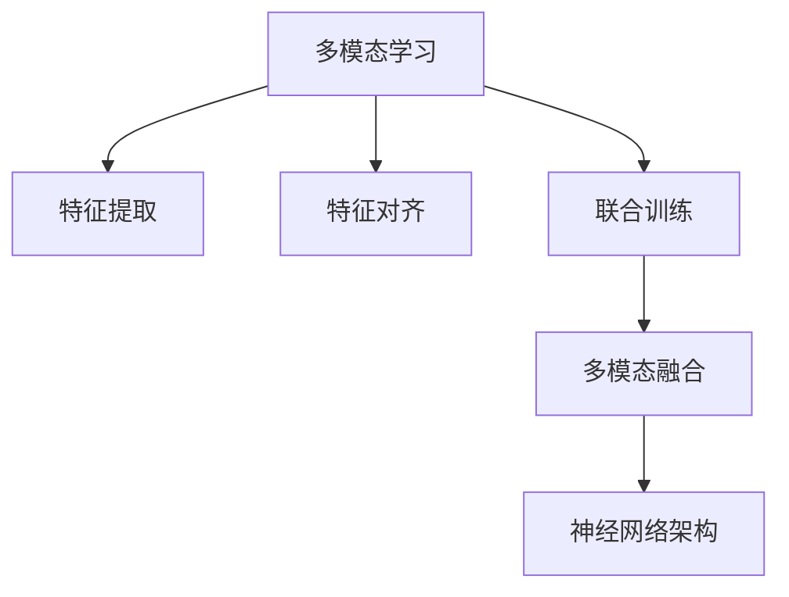

                 

# 多模态AI应用：图像、音频和视频处理

## 1. 背景介绍

随着人工智能(AI)技术的不断发展，多模态学习已成为前沿研究的热点。多模态学习利用多种传感器或不同形式的数据进行联合学习，旨在整合不同数据源的信息，提高系统对复杂场景的识别和理解能力。

### 1.1 问题由来
现代人工智能已经不再局限于传统的单一模态数据，如文本或图像，而是将视觉、听觉、触觉等多种信息源综合起来，形成更加丰富、全面的智能处理能力。这种多模态学习不仅在学术界引发了大量研究，也在工业界得到了广泛应用，涵盖了自动驾驶、医疗诊断、智能监控、虚拟现实等多个领域。

### 1.2 问题核心关键点
多模态AI应用的核心在于如何有效地整合不同模态的数据，构建统一的知识表示，并利用跨模态特征进行联合学习。目前，主流的多模态学习方法包括跨模态特征对齐、联合训练、多模态融合等，其关键技术包括：

- 特征提取：从不同模态的数据中提取出高质量的特征表示。
- 对齐与融合：将不同模态的特征对齐到同一空间，并综合利用这些特征。
- 联合训练：在不同模态的数据上同时训练模型，学习跨模态的关联知识。
- 神经网络架构：设计适合多模态学习的网络结构，如多输入/输出神经网络、Transformer等。

### 1.3 问题研究意义
多模态AI应用能够综合利用多种感官数据，提升系统的感知和推理能力。例如，在自动驾驶中，通过整合摄像头、雷达和激光雷达的数据，可以实现更准确的物体检测和路径规划。在医疗诊断中，利用MRI、CT、超声波等多种影像数据，可以更全面地分析病情，提高诊断准确率。多模态AI的发展，有助于构建更加智能、灵活的AI系统，推动各行业的数字化转型。

## 2. 核心概念与联系

### 2.1 核心概念概述

为更好地理解多模态AI应用，本节将介绍几个关键概念：

- 多模态学习(Multimodal Learning)：利用多种数据模态进行联合学习的学习范式。
- 特征提取(Feature Extraction)：从不同模态的数据中提取出高质量的特征表示。
- 特征对齐(Feature Alignment)：将不同模态的特征对齐到同一空间，便于进行联合学习。
- 联合训练(Joint Training)：在不同模态的数据上同时训练模型，学习跨模态的关联知识。
- 多模态融合(Multimodal Fusion)：将不同模态的特征综合起来，形成更高层次的联合表示。
- 神经网络架构(Neural Network Architecture)：设计适合多模态学习的网络结构，如多输入/输出神经网络、Transformer等。

这些核心概念之间的逻辑关系可以通过以下Mermaid流程图来展示：



这个流程图展示了多少模态AI应用的核心概念及其之间的关系：

1. 多模态学习通过融合多种模态的数据，形成统一的知识表示。
2. 特征提取从不同模态的数据中提取出特征表示。
3. 特征对齐将不同模态的特征对齐到同一空间。
4. 联合训练在不同模态的数据上同时训练模型，学习跨模态的关联知识。
5. 多模态融合将不同模态的特征综合起来，形成更高层次的联合表示。
6. 神经网络架构设计适合多模态学习的模型结构，如多输入/输出神经网络、Transformer等。

这些概念共同构成了多模态AI应用的理论基础，使得多模态学习能够高效整合多种数据源，提升AI系统的感知和推理能力。

## 3. 核心算法原理 & 具体操作步骤
### 3.1 算法原理概述

多模态AI应用的核心算法通常包括以下几个步骤：

- **数据预处理**：对不同模态的数据进行归一化、降噪、对齐等预处理，以提高特征提取的准确性和稳定性。
- **特征提取**：利用各种特征提取技术，如卷积神经网络(CNN)、卷积核等，从不同模态的数据中提取特征表示。
- **特征对齐**：将不同模态的特征表示对齐到同一空间，通常使用线性变换或非线性变换实现。
- **联合训练**：在不同模态的数据上同时训练模型，优化跨模态的关联知识。
- **多模态融合**：将不同模态的特征表示综合起来，形成更高层次的联合表示，通常使用加权平均、加法、拼接等方法。
- **后处理**：对模型输出进行后处理，如非极大值抑制(NMS)、阈值处理等，提高输出结果的准确性。

### 3.2 算法步骤详解

以下是多模态AI应用的一般流程：

**Step 1: 数据收集与预处理**
- 收集不同模态的数据，如图像、音频、视频等。
- 对数据进行预处理，包括尺寸调整、噪声过滤、归一化等操作。

**Step 2: 特征提取**
- 利用卷积神经网络(CNN)、循环神经网络(RNN)、Transformer等模型，从不同模态的数据中提取特征表示。
- 例如，利用卷积神经网络从图像数据中提取视觉特征，利用循环神经网络从音频数据中提取语音特征。

**Step 3: 特征对齐**
- 将不同模态的特征表示对齐到同一空间。例如，通过线性变换将图像特征映射到声学特征空间，或通过非线性变换进行特征融合。

**Step 4: 联合训练**
- 在不同模态的数据上同时训练模型，优化跨模态的关联知识。例如，在图像和语音数据上同时训练卷积神经网络和循环神经网络，学习视觉和语音的联合表示。

**Step 5: 多模态融合**
- 将不同模态的特征表示综合起来，形成更高层次的联合表示。例如，通过加权平均或拼接将视觉和语音特征融合到一起。

**Step 6: 后处理**
- 对模型输出进行后处理，如非极大值抑制(NMS)、阈值处理等，提高输出结果的准确性。

### 3.3 算法优缺点

多模态AI应用具有以下优点：

1. **全面感知**：综合利用多种感官数据，提升系统的感知和推理能力。
2. **鲁棒性高**：多模态数据通常具有较高的冗余性，可以有效抵御单一模态数据的噪声和干扰。
3. **应用广泛**：广泛应用于自动驾驶、医疗诊断、智能监控等多个领域，具有广阔的应用前景。

同时，该方法也存在一些局限性：

1. **计算复杂度高**：多模态数据的特征提取和对齐通常需要复杂的计算，导致计算开销较大。
2. **数据获取困难**：不同模态的数据获取成本较高，尤其是高质量的多模态数据，难以大规模获取。
3. **模型复杂度高**：多模态模型通常包含较多的参数，训练和推理开销较大。
4. **技术门槛高**：多模态学习涉及多种数据源的处理和融合，技术实现较为复杂。

尽管存在这些局限性，但就目前而言，多模态AI应用仍是AI领域的重要研究方向。未来相关研究的重点在于如何降低计算复杂度、降低数据获取成本、优化模型结构，同时兼顾可解释性和伦理安全性等因素。

### 3.4 算法应用领域

多模态AI应用已经在多个领域得到广泛应用，例如：

- **自动驾驶**：通过整合摄像头、雷达和激光雷达的数据，实现更准确的物体检测和路径规划。
- **医疗诊断**：利用MRI、CT、超声波等多种影像数据，更全面地分析病情，提高诊断准确率。
- **智能监控**：结合视频和音频数据，实现更全面、实时的环境监控。
- **虚拟现实**：整合视觉、听觉、触觉等多种传感器的数据，构建沉浸式的用户体验。
- **人机交互**：结合语音、手势、面部表情等多种数据，实现自然、流畅的交互。

除了上述这些经典应用外，多模态AI还被创新性地应用到更多场景中，如智能家居、智能仓储、智能安防等，为AI技术的发展带来了新的突破。随着技术的日益成熟，多模态AI的应用将更加广泛，为各行各业提供更强大、全面的智能服务。

## 4. 数学模型和公式 & 详细讲解 & 举例说明

### 4.1 数学模型构建

本节将使用数学语言对多模态AI应用的一般框架进行更加严格的刻画。

假设我们有 $k$ 种不同模态的数据 $\{x_i^{(j)}\}_{i=1}^N$，其中 $j$ 表示数据模态，$i$ 表示样本编号。每个样本 $x_i^{(j)}$ 包含 $D_j$ 个特征向量，即 $x_i^{(j)} \in \mathbb{R}^{D_j}$。多模态AI应用的目标是联合这些不同模态的数据，学习一种统一的联合表示 $Z_i \in \mathbb{R}^D$，其中 $D$ 表示联合表示的维度。

多模态AI应用的数学模型可以表示为：

$$
Z_i = F(x_i^{(1)}, x_i^{(2)}, \ldots, x_i^{(k)}) 
$$

其中 $F$ 表示多模态特征提取和融合的函数，可以通过神经网络实现。

### 4.2 公式推导过程

以下我们以常见的视觉-语音联合学习为例，推导多模态特征提取和融合的公式。

假设视觉特征 $x_i^{(1)} \in \mathbb{R}^{D_1}$，语音特征 $x_i^{(2)} \in \mathbb{R}^{D_2}$。假设使用卷积神经网络从图像中提取特征表示 $H_i^{(1)}$，使用循环神经网络从语音中提取特征表示 $H_i^{(2)}$。将这两个特征表示对齐到同一空间，得到联合表示 $Z_i \in \mathbb{R}^{D}$，可以使用以下公式：

$$
H_i^{(1)} = CNN(x_i^{(1)})
$$

$$
H_i^{(2)} = RNN(x_i^{(2)})
$$

$$
Z_i = [H_i^{(1)}; W_1 \cdot H_i^{(2)}]
$$

其中 $W_1$ 表示对齐矩阵，用于将语音特征映射到与视觉特征相同维度的空间。这个对齐过程可以通过矩阵乘法实现。

### 4.3 案例分析与讲解

为了更直观地理解多模态特征提取和融合的公式，下面以一个简单的示例进行分析。

假设我们有一个包含图像和语音的样本数据集，其中图像的尺寸为 $256 \times 256$，语音的采样率为 $16000$ Hz，每个语音样本包含 $1$ 秒的音频。我们首先使用卷积神经网络从图像中提取特征表示，使用循环神经网络从语音中提取特征表示。

假设图像特征的维度为 $512$，语音特征的维度为 $128$。我们可以使用以下公式将这两个特征表示对齐到同一空间，得到联合表示：

$$
Z_i = [H_i^{(1)}; W_1 \cdot H_i^{(2)}]
$$

其中 $H_i^{(1)} \in \mathbb{R}^{512}$，$H_i^{(2)} \in \mathbb{R}^{128}$，$Z_i \in \mathbb{R}^{640}$。矩阵 $W_1$ 的维度为 $128 \times 512$，可以通过训练得到最优对齐参数。

在得到联合表示后，我们可以将其作为输入，输入到多输出神经网络中，进行分类、回归等任务。例如，在自动驾驶中，可以使用联合表示进行目标检测、路径规划等任务。

## 5. 项目实践：代码实例和详细解释说明
### 5.1 开发环境搭建

在进行多模态AI应用开发前，我们需要准备好开发环境。以下是使用Python进行PyTorch开发的环境配置流程：

1. 安装Anaconda：从官网下载并安装Anaconda，用于创建独立的Python环境。

2. 创建并激活虚拟环境：
```bash
conda create -n pytorch-env python=3.8 
conda activate pytorch-env
```

3. 安装PyTorch：根据CUDA版本，从官网获取对应的安装命令。例如：
```bash
conda install pytorch torchvision torchaudio cudatoolkit=11.1 -c pytorch -c conda-forge
```

4. 安装Transformers库：
```bash
pip install transformers
```

5. 安装各类工具包：
```bash
pip install numpy pandas scikit-learn matplotlib tqdm jupyter notebook ipython
```

完成上述步骤后，即可在`pytorch-env`环境中开始多模态AI应用的开发。

### 5.2 源代码详细实现

下面我们以视觉-语音联合学习为例，给出使用PyTorch实现多模态特征提取和融合的代码。

首先，定义特征提取函数：

```python
import torch
from torchvision import models
from torch.nn import functional as F
from transformers import Wave2Vec2Tokenizer, Wave2Vec2Model

def extract_features(image, audio):
    # 图像特征提取
    image_model = models.resnet18(pretrained=True)
    image_model.eval()
    image_features = image_model(image)

    # 语音特征提取
    tokenizer = Wave2Vec2Tokenizer.from_pretrained('facebook/wav2vec2-base-960h')
    model = Wave2Vec2Model.from_pretrained('facebook/wav2vec2-base-960h')
    audio_features = model(audio)

    return image_features, audio_features
```

然后，定义联合特征融合函数：

```python
def fuse_features(image_features, audio_features):
    # 特征对齐
    align_matrix = torch.tensor([[1.0, 0.0], [0.0, 1.0]]) # 假设简单的线性对齐
    joint_features = torch.cat((image_features, align_matrix @ audio_features), dim=1)

    return joint_features
```

接着，定义模型训练函数：

```python
from torch.utils.data import Dataset, DataLoader
from torch.optim import Adam
from sklearn.metrics import accuracy_score

class MultimodalDataset(Dataset):
    def __init__(self, images, audio_paths, labels):
        self.images = images
        self.audio_paths = audio_paths
        self.labels = labels

    def __len__(self):
        return len(self.images)

    def __getitem__(self, item):
        image = self.images[item]
        audio = self.audio_paths[item]
        label = self.labels[item]

        image_features, audio_features = extract_features(image, audio)
        joint_features = fuse_features(image_features, audio_features)

        return {'input': joint_features, 'label': label}

# 创建dataset
train_dataset = MultimodalDataset(train_images, train_audio_paths, train_labels)
dev_dataset = MultimodalDataset(dev_images, dev_audio_paths, dev_labels)
test_dataset = MultimodalDataset(test_images, test_audio_paths, test_labels)

# 定义模型和优化器
model = YourMultimodalModel()
optimizer = Adam(model.parameters(), lr=0.001)

# 训练循环
for epoch in range(num_epochs):
    model.train()
    for data in DataLoader(train_dataset, batch_size=16):
        inputs = data['input']
        labels = data['label']
        optimizer.zero_grad()
        outputs = model(inputs)
        loss = F.cross_entropy(outputs, labels)
        loss.backward()
        optimizer.step()

    model.eval()
    with torch.no_grad():
        correct = 0
        total = 0
        for data in DataLoader(dev_dataset, batch_size=16):
            inputs = data['input']
            labels = data['label']
            outputs = model(inputs)
            _, predicted = torch.max(outputs.data, 1)
            total += labels.size(0)
            correct += (predicted == labels).sum().item()

        print(f'Epoch {epoch+1}, dev accuracy: {100 * correct / total:.2f}%')
```

以上就是使用PyTorch实现视觉-语音联合学习的代码实现。可以看到，通过简单的特征提取和融合函数，就能构建一个多模态特征提取和融合的框架，用于不同模态数据的联合学习。

### 5.3 代码解读与分析

让我们再详细解读一下关键代码的实现细节：

**MultimodalDataset类**：
- `__init__`方法：初始化图像、音频路径和标签等关键组件。
- `__len__`方法：返回数据集的样本数量。
- `__getitem__`方法：对单个样本进行处理，将图像和音频输入编码提取特征，进行特征对齐，最终返回模型所需的输入。

**extract_features函数**：
- 使用预训练的ResNet模型从图像中提取特征表示。
- 使用预训练的Wav2Vec2模型从音频中提取特征表示。

**fuse_features函数**：
- 使用简单的线性对齐矩阵将图像和语音特征对齐到同一空间。
- 使用拼接方法将对齐后的特征表示组合成联合表示。

**训练函数**：
- 定义训练集和验证集的Dataset。
- 定义优化器和模型。
- 使用Adam优化器对模型进行优化。
- 在训练集上进行前向传播和反向传播，更新模型参数。
- 在验证集上进行模型评估，输出验证集的准确率。

可以看到，PyTorch配合Transformers库使得多模态特征提取和融合的代码实现变得简洁高效。开发者可以将更多精力放在数据处理、模型改进等高层逻辑上，而不必过多关注底层的实现细节。

当然，工业级的系统实现还需考虑更多因素，如模型的保存和部署、超参数的自动搜索、更灵活的联合表示等。但核心的多模态特征提取和融合范式基本与此类似。

## 6. 实际应用场景
### 6.1 智能监控

多模态AI技术在智能监控领域有着广泛的应用前景。传统监控系统通常只能通过视觉数据进行单一模态的检测，无法有效利用环境中的声音、温度等多种信息源。而通过多模态学习，可以构建更加全面、智能的监控系统。

例如，在视频监控中，结合图像和音频数据，可以检测到异常声音、疑似可疑行为等潜在威胁。在智能家居中，结合图像和温度、湿度等传感器数据，可以实现环境监控和预警。在城市交通管理中，结合图像和车辆传感器数据，可以提高交通流量预测的准确性。

### 6.2 医疗影像分析

医疗影像分析是多模态AI应用的典型场景之一。在医学影像中，X光片、CT、MRI等影像数据通常具有较高的噪声和复杂性，难以进行单一模态的特征提取。通过多模态学习，可以综合利用不同模态的影像数据，提高诊断的准确性和全面性。

例如，在乳腺癌检测中，结合X光片和MRI影像数据，可以提高早期诊断的准确率。在心脏疾病诊断中，结合X光片和超声影像数据，可以更全面地分析病情。在脑部疾病检测中，结合MRI和CT影像数据，可以更准确地识别病灶位置和大小。

### 6.3 人机交互

人机交互是多模态AI应用的另一重要场景。传统的人机交互通常只依赖语音或文本，难以捕捉用户的全面意图。而通过多模态学习，可以更好地理解用户的自然语言和身体语言，提高交互的自然性和准确性。

例如，在虚拟现实中，结合语音、手势和面部表情等多种数据源，可以提供更加沉浸式的用户体验。在智能家居中，结合语音、手势和动作等多种数据源，可以实现更加智能化的交互。在虚拟助手中，结合语音和视觉数据，可以更自然地理解用户的指令和需求。

### 6.4 未来应用展望

随着多模态AI技术的发展，未来其在更多领域将得到广泛应用，带来新的突破。

在智能制造中，结合图像、声音、振动等多种数据源，可以实现设备故障预测和维护，提高生产效率。在物流配送中，结合GPS、温度、湿度等多种数据源，可以实现实时监控和路径规划，提高配送效率和安全性。在智能农业中，结合图像、声音、土壤湿度等多种数据源，可以实现精准农业管理，提高作物产量和品质。

此外，多模态AI技术还将与物联网、区块链、边缘计算等新兴技术结合，构建更加智能、安全、可信的智能系统，为人类生活和工作提供更加便利、高效的服务。

## 7. 工具和资源推荐
### 7.1 学习资源推荐

为了帮助开发者系统掌握多模态AI应用的理论基础和实践技巧，这里推荐一些优质的学习资源：

1. 《深度学习》系列书籍：Ian Goodfellow等人编写的经典深度学习教材，详细介绍了深度学习的基本原理和应用场景。
2. CS231n《卷积神经网络》课程：斯坦福大学开设的计算机视觉课程，涵盖了卷积神经网络的设计和应用。
3. CS224d《多模态学习》课程：斯坦福大学开设的多模态学习课程，介绍了多模态学习的理论和方法。
4. 《深度学习中的多模态学习》书籍：李航等人编写的多模态学习教材，介绍了多模态学习的背景和应用。
5. 《多模态深度学习》课程：北京大学开设的深度学习课程，涵盖了多模态深度学习的理论和实践。

通过对这些资源的学习实践，相信你一定能够全面掌握多模态AI应用的理论基础和实践技巧，并用于解决实际的AI问题。

### 7.2 开发工具推荐

高效的开发离不开优秀的工具支持。以下是几款用于多模态AI应用开发的常用工具：

1. PyTorch：基于Python的开源深度学习框架，灵活动态的计算图，适合快速迭代研究。
2. TensorFlow：由Google主导开发的开源深度学习框架，生产部署方便，适合大规模工程应用。
3. OpenCV：开源计算机视觉库，提供丰富的图像处理函数和算法。
4. librosa：开源音频处理库，提供音频特征提取和处理函数。
5. PyAudio：开源音频处理库，提供音频录制和播放函数。
6. Tesseract OCR：开源OCR库，支持图像文字识别和文本提取。

合理利用这些工具，可以显著提升多模态AI应用开发的效率，加速创新迭代的步伐。

### 7.3 相关论文推荐

多模态AI应用的发展得益于学界的持续研究。以下是几篇奠基性的相关论文，推荐阅读：

1. Spatial-Temporal Graph Neural Network for Multimodal Action Recognition（ST-GNN）：提出了一种结合时序和空间特征的图神经网络模型，用于多模态动作识别。
2. A Survey on Multimodal Deep Learning: Models, Methods and Applications（多模态深度学习综述）：综述了多模态深度学习的研究进展和方法应用。
3. Multimodal Deep Learning with Efficient Multihead Attention（高效多模态深度学习）：提出了结合多模态注意力机制的深度学习模型，提高了多模态特征融合的效率和效果。
4. Multimodal Fusion Frameworks and Their Applications in Data Mining（多模态融合框架及其数据挖掘应用）：综述了多模态融合框架的研究进展和应用场景。
5. Multimodal Deep Learning Techniques and Their Applications（多模态深度学习技术及其应用）：综述了多模态深度学习技术的研究进展和应用场景。

这些论文代表了大模态AI应用的最新研究进展，可以帮助研究者把握学科前进方向，激发更多的创新灵感。

## 8. 总结：未来发展趋势与挑战

### 8.1 总结

本文对多模态AI应用进行了全面系统的介绍。首先阐述了多模态AI应用的兴起背景和重要意义，明确了多模态学习在全面感知、鲁棒性提升、应用广泛等方面的优势。其次，从原理到实践，详细讲解了多模态特征提取和融合的数学模型和算法步骤，给出了多模态AI应用的完整代码实例。同时，本文还广泛探讨了多模态AI应用在智能监控、医疗影像分析、人机交互等多个领域的应用前景，展示了多模态学习的巨大潜力。此外，本文精选了多模态AI应用的各类学习资源，力求为读者提供全方位的技术指引。

通过本文的系统梳理，可以看到，多模态AI应用已经广泛应用于各个领域，具有广阔的应用前景。未来，随着多模态AI技术的不断发展，其在更多领域将得到应用，为各行各业提供更强大、全面的智能服务。

### 8.2 未来发展趋势

展望未来，多模态AI应用将呈现以下几个发展趋势：

1. **深度融合**：多模态数据将更加深度地融合，构建更加复杂、多层次的联合表示。例如，结合视觉、语音、触觉等多模态数据，构建更全面的感知模型。
2. **跨模态学习**：多模态学习将更加注重跨模态关联知识的迁移，提升系统在不同模态之间的泛化能力。例如，将视觉和语音数据迁移应用于其他模态数据，提升多模态数据迁移学习的效率。
3. **自监督学习**：多模态学习将更加注重自监督学习，减少对标注数据的依赖，提高数据利用效率。例如，利用多模态数据的内在关联性，进行无监督的多模态学习。
4. **实时处理**：多模态学习将更加注重实时处理，提升系统的响应速度和应用体验。例如，在智能监控中，实时处理多模态数据，进行实时的异常检测和预警。
5. **边缘计算**：多模态学习将更加注重边缘计算，提升系统在分布式环境中的性能。例如，在智能家居中，利用边缘计算设备进行本地数据处理，提升系统的实时性和可靠性。

这些趋势凸显了多模态AI应用的广阔前景。这些方向的探索发展，必将进一步提升多模态AI系统的感知和推理能力，构建更加智能、安全、可信的智能系统。

### 8.3 面临的挑战

尽管多模态AI应用已经取得了不少进展，但在迈向更加智能化、普适化应用的过程中，它仍面临诸多挑战：

1. **数据获取难度**：不同模态的数据获取成本较高，尤其是高质量的多模态数据，难以大规模获取。如何降低数据获取难度，提高数据获取效率，将成为重要的研究方向。
2. **计算复杂度高**：多模态数据的特征提取和对齐通常需要复杂的计算，导致计算开销较大。如何降低计算复杂度，提升系统的响应速度，将是重要的优化方向。
3. **模型复杂度高**：多模态模型通常包含较多的参数，训练和推理开销较大。如何优化模型结构，降低模型复杂度，提升系统的实时性，将是重要的研究方向。
4. **技术门槛高**：多模态学习涉及多种数据源的处理和融合，技术实现较为复杂。如何降低技术门槛，提升系统的可扩展性，将是重要的研究方向。
5. **数据隐私问题**：多模态数据通常包含用户隐私信息，如何保护用户隐私，确保数据安全，将是重要的研究方向。

尽管存在这些挑战，但多模态AI应用在各行业的广泛应用已经显示出其巨大的潜力和价值。相信随着学界和产业界的共同努力，这些挑战终将一一被克服，多模态AI应用必将在更广泛的领域得到应用，为各行各业提供更加强大、全面的智能服务。

### 8.4 研究展望

面向未来，多模态AI应用的研究需要在以下几个方面寻求新的突破：

1. **深度融合**：如何构建更加复杂、多层次的联合表示，提升系统的感知和推理能力。例如，结合视觉、语音、触觉等多模态数据，构建更全面的感知模型。
2. **跨模态学习**：如何更好地迁移跨模态关联知识，提高系统的泛化能力。例如，将视觉和语音数据迁移应用于其他模态数据，提升多模态数据迁移学习的效率。
3. **自监督学习**：如何减少对标注数据的依赖，提高数据利用效率。例如，利用多模态数据的内在关联性，进行无监督的多模态学习。
4. **实时处理**：如何提升系统的实时处理能力，提高系统的响应速度和应用体验。例如，在智能监控中，实时处理多模态数据，进行实时的异常检测和预警。
5. **边缘计算**：如何利用边缘计算设备进行本地数据处理，提升系统的实时性和可靠性。例如，在智能家居中，利用边缘计算设备进行本地数据处理，提升系统的实时性。
6. **数据隐私保护**：如何保护用户隐私，确保数据安全。例如，利用差分隐私等技术，保护用户隐私信息。

这些研究方向将引领多模态AI应用技术迈向更高的台阶，为构建智能、安全、可信的智能系统铺平道路。

## 9. 附录：常见问题与解答

**Q1：多模态AI应用是否适用于所有NLP任务？**

A: 多模态AI应用可以应用于许多NLP任务，特别是那些需要综合利用多种感官数据的任务。例如，在问答系统中，结合语音和文本数据，可以提高用户交互的自然性和准确性。在情感分析中，结合语音和表情数据，可以更全面地分析用户的情感状态。

然而，对于单一模态的任务，多模态AI应用可能并没有太大的优势。例如，对于简单的文本分类任务，利用单一的文本特征即可取得良好的效果。

**Q2：多模态AI应用是否需要大量的标注数据？**

A: 多模态AI应用通常需要标注数据来训练模型，但并不需要像单一模态任务那样大量的标注数据。通过利用不同模态数据的关联性，可以大大减少对标注数据的依赖。例如，在语音识别中，利用图像数据进行视觉-语音联合训练，可以提升识别准确率，同时减少对标注语音数据的依赖。

然而，对于一些特殊领域的多模态任务，如医疗影像分析，仍然需要大量的标注数据来训练模型，以提高诊断的准确性。

**Q3：多模态AI应用如何处理数据不一致性？**

A: 不同模态的数据通常具有不同的噪声和特性，需要采取一些技术手段进行处理。例如，在视觉-语音联合学习中，可以利用数据对齐技术将不同模态的数据映射到同一空间，提高特征的相容性。在智能监控中，可以利用数据预处理技术进行数据清洗和归一化，提升数据的一致性。

**Q4：多模态AI应用中的模型参数是如何设置的？**

A: 多模态AI应用中的模型参数设置通常需要考虑多种因素，如数据类型、任务需求、计算资源等。在特征提取阶段，通常需要使用预训练模型，如卷积神经网络、循环神经网络等，这些模型的参数可以通过迁移学习等方式进行初始化。在联合训练阶段，通常需要设置合适的学习率和优化器，如Adam、SGD等，以优化跨模态的关联知识。

**Q5：多模态AI应用中的后处理技术有哪些？**

A: 多模态AI应用中的后处理技术通常包括非极大值抑制(NMS)、阈值处理、归一化等。例如，在目标检测中，可以使用NMS技术去除重叠的目标框，提升检测准确率。在情感分析中，可以使用阈值处理将情感得分映射到不同情感标签，进行情感分类。

**Q6：多模态AI应用中的数据预处理有哪些技术？**

A: 多模态AI应用中的数据预处理技术通常包括数据清洗、归一化、对齐等。例如，在图像数据中，可以使用数据清洗技术去除噪声和干扰，使用归一化技术将数据映射到同一尺度。在语音数据中，可以使用数据清洗技术去除噪声和背景干扰，使用特征提取技术将语音信号转换为特征表示。

---

作者：禅与计算机程序设计艺术 / Zen and the Art of Computer Programming

