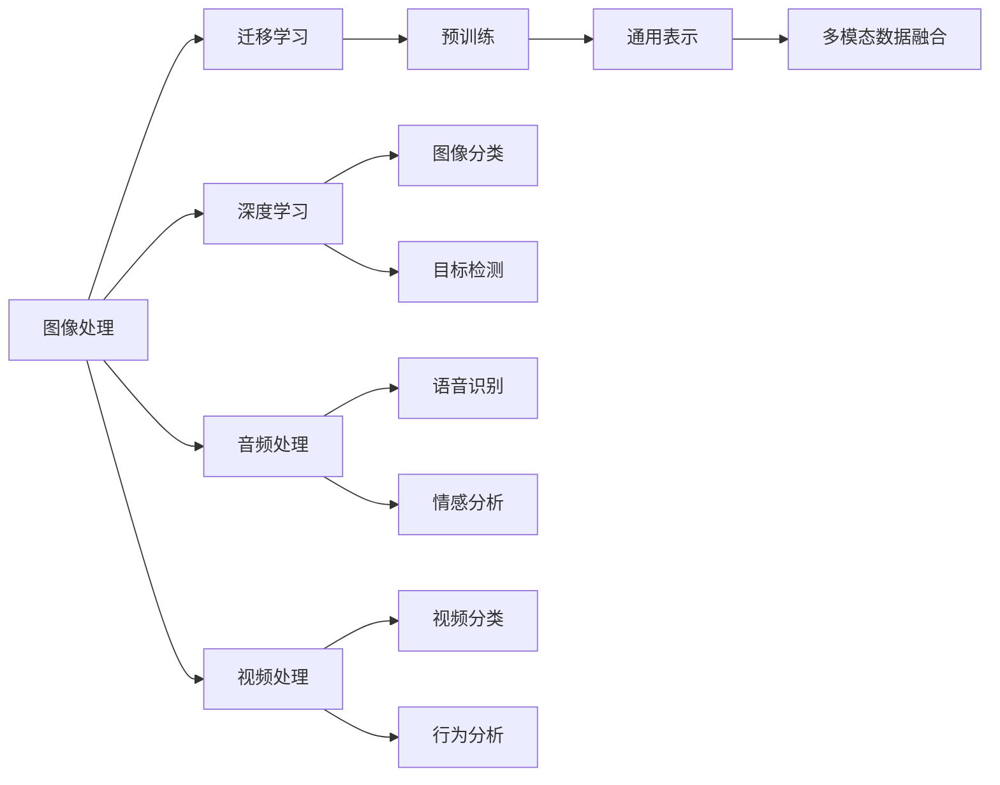

                 

# 多模态AI应用：图像、音频和视频处理技术

> 关键词：多模态AI, 图像处理, 音频处理, 视频处理, 混合模型, 深度学习, 融合算法, 应用实例

## 1. 背景介绍

随着人工智能技术的迅猛发展，多模态AI在各个领域得到了广泛应用。多模态AI是指利用图像、音频、视频等多种数据源进行协同处理，从而提升人工智能系统的性能。例如，在图像识别、语音识别、视频分析等任务中，单模态的AI系统可能面临数据稀疏、信息丢失等问题，而多模态AI可以综合多种感官信息，提升系统的准确性和鲁棒性。

近年来，深度学习技术在多模态AI中得到了广泛应用，尤其是在图像、音频、视频处理等任务中取得了显著的成果。例如，卷积神经网络(CNN)在图像处理中取得了重大突破，循环神经网络(RNN)和长短时记忆网络(LSTM)在语音识别和视频分析中表现优异。此外，迁移学习、预训练等技术也广泛应用于多模态AI中，使得多模态AI技术能够更好地应对复杂的现实世界问题。

本文将系统介绍多模态AI在图像、音频和视频处理中的应用，涵盖从理论到实践的全方位内容。文章内容包括多模态AI的核心概念、关键算法、项目实践、实际应用和未来发展趋势等。

## 2. 核心概念与联系

### 2.1 核心概念概述

在多模态AI中，图像、音频和视频是常见的数据模态。为了更好地理解多模态AI，首先需要介绍几种核心概念：

- 图像处理：利用计算机视觉技术对图像进行获取、处理和分析的过程。主要任务包括图像分类、目标检测、图像分割等。
- 音频处理：利用语音处理技术对音频进行获取、处理和分析的过程。主要任务包括语音识别、语音合成、情感分析等。
- 视频处理：利用视频处理技术对视频进行获取、处理和分析的过程。主要任务包括视频分类、行为分析、人脸识别等。
- 深度学习：一种基于神经网络的学习范式，能够自动从数据中学习到复杂的高维表示，广泛应用于图像、音频和视频处理中。
- 迁移学习：利用预训练模型在新任务上进行微调的过程，可以显著提升模型的性能。
- 预训练：在大规模数据集上训练深度学习模型，学习通用的表示，用于提升新任务的性能。
- 多模态数据融合：将不同模态的数据进行综合处理，提升系统的性能和鲁棒性。

### 2.2 核心概念原理和架构的 Mermaid 流程图



上述Mermaid流程图展示了多模态AI的核心概念及其相互联系。图像处理、音频处理和视频处理分别使用深度学习、迁移学习和预训练等技术，最终通过多模态数据融合提升系统的性能。

## 3. 核心算法原理 & 具体操作步骤

### 3.1 算法原理概述

多模态AI的核心算法包括深度学习、迁移学习和多模态数据融合等。这些算法在图像、音频和视频处理中得到了广泛应用，极大地提升了系统的性能和鲁棒性。

深度学习算法利用神经网络模型学习复杂的高维表示，能够自动从数据中提取特征，广泛应用于图像、音频和视频处理中。常用的深度学习算法包括卷积神经网络(CNN)、循环神经网络(RNN)、长短时记忆网络(LSTM)等。

迁移学习算法利用预训练模型在新任务上进行微调，可以显著提升模型的性能。预训练模型在大规模数据集上学习到通用的表示，用于提升新任务的性能。常用的迁移学习算法包括微调、特征适配等。

多模态数据融合算法将不同模态的数据进行综合处理，提升系统的性能和鲁棒性。常用的多模态数据融合算法包括特征融合、数据增强、跨模态对齐等。

### 3.2 算法步骤详解

以下以图像分类任务为例，介绍基于深度学习的图像处理算法的基本步骤：

1. **数据预处理**：包括数据清洗、归一化、数据增强等步骤，确保数据的质量和多样性。

2. **模型构建**：选择合适的深度学习模型，如卷积神经网络(CNN)，并进行初始化。

3. **模型训练**：在训练集上使用梯度下降等优化算法，最小化损失函数，更新模型参数。

4. **模型评估**：在验证集上评估模型性能，调整超参数。

5. **模型部署**：将训练好的模型部署到实际应用中，进行推理预测。

### 3.3 算法优缺点

深度学习算法的优点包括：
- 能够自动从数据中学习到复杂的高维表示。
- 具有很强的泛化能力，能够处理复杂的数据。
- 能够适应大规模数据集，具有很好的扩展性。

深度学习算法的缺点包括：
- 需要大量标注数据，数据获取成本较高。
- 模型训练时间较长，计算资源消耗较大。
- 模型复杂度较高，难以解释。

迁移学习算法的优点包括：
- 能够利用预训练模型学习到通用的表示，提升新任务的性能。
- 需要较少的标注数据，数据获取成本较低。
- 模型训练时间较短，计算资源消耗较小。

迁移学习算法的缺点包括：
- 预训练模型需要在大规模数据集上进行训练，计算资源消耗较大。
- 预训练模型可能存在过拟合问题，需要进行微调。
- 预训练模型可能存在领域差异，需要进行特征适配。

多模态数据融合算法的优点包括：
- 能够综合不同模态的数据，提升系统的性能和鲁棒性。
- 能够处理复杂的多模态数据，具有很好的扩展性。
- 能够提高系统的可解释性和可控性。

多模态数据融合算法的缺点包括：
- 数据融合过程较为复杂，需要综合多种模态的信息。
- 数据融合过程中可能会出现信息丢失或冲突。
- 数据融合需要额外的计算资源和计算时间。

### 3.4 算法应用领域

多模态AI在图像、音频和视频处理中得到了广泛应用，具体应用领域包括：

- **图像处理**：包括图像分类、目标检测、图像分割等任务。
- **音频处理**：包括语音识别、情感分析、语音合成等任务。
- **视频处理**：包括视频分类、行为分析、人脸识别等任务。

## 4. 数学模型和公式 & 详细讲解 & 举例说明

### 4.1 数学模型构建

多模态AI的数学模型可以表示为：

$$
y = f(x_1, x_2, ..., x_n)
$$

其中，$x_1, x_2, ..., x_n$ 表示不同模态的数据，$y$ 表示输出结果。

以图像分类任务为例，输入数据为图像像素值 $x$，输出结果为图像类别 $y$。数学模型可以表示为：

$$
y = f(x)
$$

其中，$f$ 表示图像分类模型，$x$ 表示输入图像像素值，$y$ 表示图像类别。

### 4.2 公式推导过程

以卷积神经网络(CNN)为例，推导其基本的数学公式。

卷积神经网络由卷积层、池化层、全连接层等组成。卷积层的主要操作包括卷积、偏置、激活函数等。其基本数学公式可以表示为：

$$
f(x) = W * x + b
$$

其中，$W$ 表示卷积核，$x$ 表示输入数据，$b$ 表示偏置，$f(x)$ 表示卷积操作后的结果。

池化层的主要操作包括最大池化、平均池化等。其基本数学公式可以表示为：

$$
g(x) = max(x) / k
$$

其中，$g(x)$ 表示池化操作后的结果，$x$ 表示输入数据，$k$ 表示池化核的大小。

全连接层的主要操作包括线性变换、激活函数等。其基本数学公式可以表示为：

$$
h(x) = W * x + b
$$

其中，$h(x)$ 表示全连接操作后的结果，$W$ 表示权重矩阵，$x$ 表示输入数据，$b$ 表示偏置。

### 4.3 案例分析与讲解

以图像分类任务为例，介绍卷积神经网络的基本工作原理。

卷积神经网络主要由卷积层、池化层和全连接层等组成。卷积层的主要操作包括卷积、偏置和激活函数等。池化层的主要操作包括最大池化和平均池化等。全连接层的主要操作包括线性变换和激活函数等。

卷积神经网络的输入数据为图像像素值，输出结果为图像类别。通过多层的卷积和池化操作，卷积神经网络能够自动从图像中提取特征，并利用全连接层将特征映射到图像类别。

## 5. 项目实践：代码实例和详细解释说明

### 5.1 开发环境搭建

在项目实践中，需要搭建合适的开发环境。以下以PyTorch为例，介绍开发环境的搭建过程：

1. **安装Python**：选择Python 3.7或更高版本进行安装。

2. **安装PyTorch**：使用以下命令安装PyTorch：

```bash
pip install torch torchvision torchaudio
```

3. **安装其他工具包**：安装numpy、scipy、matplotlib等常用工具包。

4. **设置开发环境**：创建虚拟环境，并激活虚拟环境。

```bash
conda create -n pytorch-env python=3.7
conda activate pytorch-env
```

### 5.2 源代码详细实现

以下是一个简单的图像分类项目，使用PyTorch和CNN实现。

```python
import torch
import torch.nn as nn
import torchvision.transforms as transforms
from torchvision.datasets import CIFAR10
from torchvision.models import AlexNet

# 数据预处理
transform_train = transforms.Compose([
    transforms.RandomCrop(32, padding=4),
    transforms.RandomHorizontalFlip(),
    transforms.ToTensor(),
    transforms.Normalize(mean=[0.4914, 0.4822, 0.4465], std=[0.2023, 0.1994, 0.2010]),
])

transform_test = transforms.Compose([
    transforms.ToTensor(),
    transforms.Normalize(mean=[0.4914, 0.4822, 0.4465], std=[0.2023, 0.1994, 0.2010]),
])

train_dataset = CIFAR10(root='./data', train=True, download=True, transform=transform_train)
test_dataset = CIFAR10(root='./data', train=False, download=True, transform=transform_test)

# 模型构建
model = AlexNet()

# 模型训练
criterion = nn.CrossEntropyLoss()
optimizer = torch.optim.SGD(model.parameters(), lr=0.01, momentum=0.9)

for epoch in range(10):
    train_loss = 0.0
    for i, (inputs, labels) in enumerate(train_loader):
        inputs, labels = inputs.to(device), labels.to(device)
        optimizer.zero_grad()
        outputs = model(inputs)
        loss = criterion(outputs, labels)
        loss.backward()
        optimizer.step()
        train_loss += loss.item()

    print(f'Epoch [{epoch+1}/{10}], Loss: {train_loss / len(train_loader)}')

# 模型评估
test_loss = 0.0
for i, (inputs, labels) in enumerate(test_loader):
    inputs, labels = inputs.to(device), labels.to(device)
    outputs = model(inputs)
    loss = criterion(outputs, labels)
    test_loss += loss.item()

print(f'Test Loss: {test_loss / len(test_loader)}')
```

### 5.3 代码解读与分析

上述代码实现了基于CNN的图像分类模型训练过程。主要步骤包括数据预处理、模型构建、模型训练、模型评估等。

数据预处理步骤包括随机裁剪、翻转、归一化等操作，确保数据的质量和多样性。模型构建步骤包括选择CNN模型，并进行初始化。模型训练步骤包括定义损失函数、优化器，并在训练集上迭代训练模型。模型评估步骤包括在测试集上计算损失函数，并输出评估结果。

## 6. 实际应用场景

### 6.1 智能监控系统

智能监控系统是图像处理的重要应用场景。通过多模态AI技术，智能监控系统能够实现人脸识别、行为分析、异常检测等功能，提高系统的智能性和鲁棒性。

以视频行为分析为例，多模态AI能够综合视频图像和音频数据，实时监测视频内容，并识别异常行为。例如，在视频中检测到异常行为（如打斗、翻越栏杆等），系统会立即发出警报，并通知安保人员进行应急处理。

### 6.2 医疗影像分析

医疗影像分析是图像处理的重要应用场景。多模态AI技术能够综合医学影像和病历数据，提升诊断的准确性和效率。

以医学影像分类为例，多模态AI能够综合CT、MRI等医学影像和病历数据，自动分类医学影像，并生成诊断报告。例如，在医学影像中检测到肿瘤，系统会立即发出警报，并通知医生进行进一步检查和治疗。

### 6.3 自动驾驶

自动驾驶是图像处理的重要应用场景。通过多模态AI技术，自动驾驶系统能够实现行人检测、交通标志识别、车道线识别等功能，提升自动驾驶的智能性和安全性。

以交通标志识别为例，多模态AI能够综合摄像头图像和激光雷达数据，实时识别交通标志，并生成驾驶指令。例如，在交通标志识别中检测到红灯，系统会立即减速并停车，避免交通事故的发生。

## 7. 工具和资源推荐

### 7.1 学习资源推荐

以下推荐一些优质的学习资源，帮助开发者掌握多模态AI的核心技术和实践技巧：

1. 《深度学习》课程：斯坦福大学开设的深度学习课程，系统讲解深度学习的原理和应用。

2. 《多模态学习》书籍：介绍多模态AI的核心技术和应用场景，涵盖图像、音频、视频处理等。

3. 《多模态数据融合》书籍：介绍多模态数据融合的算法和应用，涵盖特征融合、跨模态对齐等。

4. HuggingFace官方文档：介绍多模态AI的主要模型和应用，提供丰富的样例代码和文档。

5. Kaggle竞赛：参与Kaggle的多模态AI竞赛，提升实际应用能力和算法优化技巧。

### 7.2 开发工具推荐

以下推荐一些常用的开发工具，帮助开发者高效开发多模态AI应用：

1. PyTorch：基于Python的深度学习框架，支持CNN、RNN、LSTM等模型。

2. TensorFlow：基于C++的深度学习框架，支持TensorFlow Lite等轻量级模型。

3. OpenCV：计算机视觉库，支持图像处理、视频处理等任务。

4. Kaldi：语音处理库，支持语音识别、情感分析等任务。

5. VGGFace：人脸识别库，支持人脸检测、识别等任务。

### 7.3 相关论文推荐

以下推荐一些多模态AI领域的经典论文，帮助开发者深入理解多模态AI的核心技术：

1. "Convolutional Neural Networks for Sentence Classification"：介绍CNN在文本分类中的应用。

2. "A Baseline for Open-World Named Entity Recognition"：介绍多模态学习在命名实体识别中的应用。

3. "Deep Residual Learning for Image Recognition"：介绍残差网络在图像分类中的应用。

4. "Towards End-to-End Speech Recognition with Recurrent Neural Networks"：介绍RNN在语音识别中的应用。

5. "Video Classification with Convolutional Neural Networks"：介绍CNN在视频分类中的应用。

## 8. 总结：未来发展趋势与挑战

### 8.1 研究成果总结

多模态AI在图像、音频和视频处理中得到了广泛应用，提升了系统的智能性和鲁棒性。深度学习、迁移学习、多模态数据融合等技术在多模态AI中得到了广泛应用，取得了显著的成果。

### 8.2 未来发展趋势

多模态AI未来的发展趋势包括：

1. 模型规模持续增大：随着算力成本的下降和数据规模的扩张，预训练语言模型的参数量还将持续增长。超大规模语言模型蕴含的丰富语言知识，有望支撑更加复杂多变的下游任务微调。

2. 微调方法日趋多样：除了传统的全参数微调外，未来会涌现更多参数高效的微调方法，如Prompt-based Learning等，在节省计算资源的同时也能保证微调精度。

3. 持续学习成为常态：随着数据分布的不断变化，微调模型也需要持续学习新知识以保持性能。如何在不遗忘原有知识的同时，高效吸收新样本信息，将成为重要的研究课题。

4. 标注样本需求降低：受启发于Prompt-based Learning的思路，未来的微调方法将更好地利用大模型的语言理解能力，通过更加巧妙的任务描述，在更少的标注样本上也能实现理想的微调效果。

5. 多模态融合更加灵活：未来的多模态融合算法将更加灵活，能够更好地综合不同模态的数据，提升系统的性能和鲁棒性。

### 8.3 面临的挑战

多模态AI在实际应用中仍然面临诸多挑战：

1. 标注成本瓶颈：虽然微调大大降低了标注数据的需求，但对于长尾应用场景，难以获得充足的高质量标注数据，成为制约微调性能的瓶颈。如何进一步降低微调对标注样本的依赖，将是一大难题。

2. 模型鲁棒性不足：当前微调模型面对域外数据时，泛化性能往往大打折扣。对于测试样本的微小扰动，微调模型的预测也容易发生波动。如何提高微调模型的鲁棒性，避免灾难性遗忘，还需要更多理论和实践的积累。

3. 推理效率有待提高：大规模语言模型虽然精度高，但在实际部署时往往面临推理速度慢、内存占用大等效率问题。如何在保证性能的同时，简化模型结构，提升推理速度，优化资源占用，将是重要的优化方向。

4. 可解释性亟需加强：当前微调模型更像是"黑盒"系统，难以解释其内部工作机制和决策逻辑。对于医疗、金融等高风险应用，算法的可解释性和可审计性尤为重要。如何赋予微调模型更强的可解释性，将是亟待攻克的难题。

5. 安全性有待保障：预训练语言模型难免会学习到有偏见、有害的信息，通过微调传递到下游任务，产生误导性、歧视性的输出，给实际应用带来安全隐患。如何从数据和算法层面消除模型偏见，避免恶意用途，确保输出的安全性，也将是重要的研究课题。

### 8.4 研究展望

面对多模态AI所面临的种种挑战，未来的研究需要在以下几个方面寻求新的突破：

1. 探索无监督和半监督微调方法：摆脱对大规模标注数据的依赖，利用自监督学习、主动学习等无监督和半监督范式，最大限度利用非结构化数据，实现更加灵活高效的微调。

2. 研究参数高效和计算高效的微调范式：开发更加参数高效的微调方法，在固定大部分预训练参数的同时，只更新极少量的任务相关参数。同时优化微调模型的计算图，减少前向传播和反向传播的资源消耗，实现更加轻量级、实时性的部署。

3. 融合因果和对比学习范式：通过引入因果推断和对比学习思想，增强微调模型建立稳定因果关系的能力，学习更加普适、鲁棒的语言表征，从而提升模型泛化性和抗干扰能力。

4. 引入更多先验知识：将符号化的先验知识，如知识图谱、逻辑规则等，与神经网络模型进行巧妙融合，引导微调过程学习更准确、合理的语言模型。同时加强不同模态数据的整合，实现视觉、语音等多模态信息与文本信息的协同建模。

5. 结合因果分析和博弈论工具：将因果分析方法引入微调模型，识别出模型决策的关键特征，增强输出解释的因果性和逻辑性。借助博弈论工具刻画人机交互过程，主动探索并规避模型的脆弱点，提高系统稳定性。

6. 纳入伦理道德约束：在模型训练目标中引入伦理导向的评估指标，过滤和惩罚有偏见、有害的输出倾向。同时加强人工干预和审核，建立模型行为的监管机制，确保输出符合人类价值观和伦理道德。

这些研究方向的探索，必将引领多模态AI技术迈向更高的台阶，为构建安全、可靠、可解释、可控的智能系统铺平道路。面向未来，多模态AI还需要与其他人工智能技术进行更深入的融合，如知识表示、因果推理、强化学习等，多路径协同发力，共同推动自然语言理解和智能交互系统的进步。只有勇于创新、敢于突破，才能不断拓展多模态AI的边界，让智能技术更好地造福人类社会。

## 9. 附录：常见问题与解答

**Q1：多模态AI是否适用于所有NLP任务？**

A: 多模态AI在大多数NLP任务上都能取得不错的效果，特别是对于数据量较小的任务。但对于一些特定领域的任务，如医学、法律等，仅仅依靠通用语料预训练的模型可能难以很好地适应。此时需要在特定领域语料上进一步预训练，再进行微调，才能获得理想效果。此外，对于一些需要时效性、个性化很强的任务，如对话、推荐等，多模态AI也需要针对性的改进优化。

**Q2：多模态AI如何处理不同模态的数据？**

A: 多模态AI处理不同模态的数据时，需要综合考虑数据的表示方式和融合方式。通常有以下几种方法：

1. 特征融合：将不同模态的特征进行拼接或堆叠，得到综合特征向量。

2. 数据增强：通过数据增强技术，如回译、近义替换等方式扩充不同模态的数据。

3. 跨模态对齐：通过跨模态对齐技术，将不同模态的数据映射到相同的特征空间中。

4. 混合模型：构建多模态的混合模型，综合不同模态的信息。

以上方法需要根据具体任务和数据特点进行灵活组合，以提高多模态AI的性能和鲁棒性。

**Q3：多模态AI在实际应用中需要注意哪些问题？**

A: 多模态AI在实际应用中需要注意以下问题：

1. 数据获取成本：多模态AI需要大量不同模态的数据，数据获取成本较高。

2. 数据融合复杂性：多模态数据融合过程较为复杂，需要综合多种模态的信息。

3. 模型复杂度：多模态AI模型通常较为复杂，需要大量计算资源和时间。

4. 可解释性：多模态AI模型更像是"黑盒"系统，难以解释其内部工作机制和决策逻辑。

5. 安全性：多模态AI模型可能学习到有偏见、有害的信息，给实际应用带来安全隐患。

6. 实时性：多模态AI模型通常计算复杂度较高，需要考虑实时性问题。

**Q4：多模态AI如何提升系统的性能和鲁棒性？**

A: 多模态AI通过综合不同模态的数据，能够提升系统的性能和鲁棒性。具体来说，可以通过以下方法：

1. 数据融合：综合不同模态的数据，得到更加全面、准确的信息。

2. 特征融合：将不同模态的特征进行拼接或堆叠，得到综合特征向量。

3. 模型融合：构建多模态的混合模型，综合不同模态的信息。

4. 数据增强：通过数据增强技术，如回译、近义替换等方式扩充不同模态的数据。

5. 跨模态对齐：通过跨模态对齐技术，将不同模态的数据映射到相同的特征空间中。

以上方法需要根据具体任务和数据特点进行灵活组合，以提高多模态AI的性能和鲁棒性。

**Q5：多模态AI的开发过程中需要注意哪些问题？**

A: 多模态AI的开发过程中需要注意以下问题：

1. 数据预处理：确保数据的质量和多样性，包括数据清洗、归一化、数据增强等。

2. 模型构建：选择合适的深度学习模型，并进行初始化。

3. 模型训练：定义损失函数、优化器，并在训练集上迭代训练模型。

4. 模型评估：在验证集上评估模型性能，调整超参数。

5. 模型部署：将训练好的模型部署到实际应用中，进行推理预测。

6. 系统优化：考虑数据获取成本、计算资源和时间等资源问题，进行系统优化。

以上问题需要综合考虑，以确保多模态AI的开发过程高效、稳定、可靠。

综上所述，多模态AI在图像、音频和视频处理中得到了广泛应用，提升了系统的性能和鲁棒性。通过深度学习、迁移学习和多模态数据融合等技术，多模态AI能够综合不同模态的数据，提升系统的性能和鲁棒性。随着技术的不断发展，多模态AI将在更多领域得到应用，推动人工智能技术的进步。

