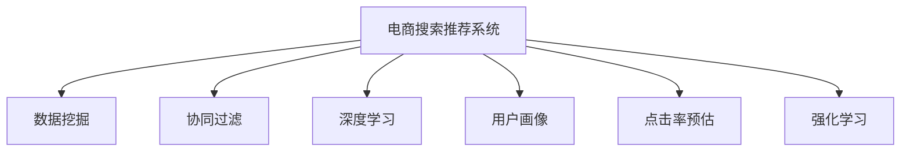

                 

# 大数据与AI 驱动的电商搜索推荐：以准确率与用户体验为核心

## 1. 背景介绍

### 1.1 问题由来
随着互联网的飞速发展和电子商务的兴起，电商平台的用户访问量和交易额不断攀升，消费者对于商品搜索和推荐系统的需求日益增长。传统的基于关键词匹配的搜索推荐系统已经无法满足用户对个性化、多样化和精准化的需求。为了提升用户的搜索体验，电商平台开始尝试引入大数据技术和AI算法，构建更加智能、高效的搜索推荐系统。

### 1.2 问题核心关键点
搜索推荐系统的主要目标是通过对用户行为数据和商品属性数据的深度挖掘，为用户推荐最适合的商品，从而提高用户满意度和平台转化率。然而，搜索推荐系统设计复杂，涉及数据获取、模型训练、结果展示等多个环节，如何平衡准确率和用户体验，成为亟待解决的核心问题。

### 1.3 问题研究意义
高效、准确的搜索推荐系统不仅能提升用户满意度，还能显著提高电商平台的销售转化率和营收增长。AI驱动的搜索推荐系统可以通过数据分析和机器学习，实现更加个性化、智能化的推荐，满足不同用户的需求，提升整体用户满意度。同时，高精度的推荐系统还能帮助电商平台精准定位用户需求，减少用户流失，增加平台粘性和收益。

## 2. 核心概念与联系

### 2.1 核心概念概述

为更好地理解电商搜索推荐系统的构建，本节将介绍几个密切相关的核心概念：

- 电商搜索推荐系统：结合用户搜索行为数据和商品属性数据，使用AI算法为用户推荐商品的系统。通过深度学习、协同过滤等技术，实现更加智能、精准的推荐。
- 数据挖掘(Data Mining)：从大量数据中提取有用信息和知识的过程。电商搜索推荐系统需要对用户行为数据和商品属性数据进行挖掘，提取用户的兴趣偏好和商品特征。
- 协同过滤(Collaborative Filtering)：一种基于用户行为或物品特征进行推荐的技术。通过分析用户行为或物品属性，寻找相似用户或物品，实现个性化推荐。
- 深度学习(Deep Learning)：一种通过多层次神经网络模型进行学习的方法。电商搜索推荐系统利用深度学习算法，实现从数据中提取高层次特征和关联规则，提升推荐精度。
- 用户画像(User Profile)：通过用户行为数据和属性信息构建的全面、详细的用户画像，用于描述用户的兴趣偏好和需求。
- 点击率预估(CTR Prediction)：通过机器学习算法预测用户点击商品的概率，用于个性化推荐排序和广告投放优化。
- 强化学习(Reinforcement Learning)：通过智能体与环境的互动，学习最优策略的过程。电商搜索推荐系统可以利用强化学习算法，动态调整推荐策略，提升推荐效果。

这些核心概念之间的逻辑关系可以通过以下Mermaid流程图来展示：



这个流程图展示了一个电商搜索推荐系统的主要组成部分及其相互关系：

1. 电商搜索推荐系统基于数据挖掘获取用户行为数据和商品属性数据。
2. 通过协同过滤、深度学习等技术，构建用户画像，描述用户兴趣和需求。
3. 利用点击率预估和强化学习算法，进行个性化推荐排序和动态策略优化。

## 3. 核心算法原理 & 具体操作步骤
### 3.1 算法原理概述

电商搜索推荐系统的核心算法原理是深度学习、协同过滤和强化学习。

### 3.2 算法步骤详解

电商搜索推荐系统的构建一般包括以下几个关键步骤：

**Step 1: 数据收集与预处理**
- 从电商平台收集用户搜索记录、点击记录、浏览记录、评价记录等行为数据。
- 从电商平台后台获取商品属性数据，包括价格、类别、品牌、描述等。
- 对数据进行清洗、去重、归一化等预处理操作。

**Step 2: 特征工程**
- 提取用户行为特征，如点击次数、浏览时间、评价评分等。
- 提取商品属性特征，如价格、类别、品牌、描述等。
- 使用数据挖掘算法，对特征进行降维、归一化和特征组合。

**Step 3: 模型训练与评估**
- 选择合适的深度学习模型，如BERT、FM、DNN等，训练推荐模型。
- 使用点击率预估算法，如CTR预估模型，评估模型在真实数据集上的效果。
- 利用A/B测试、交叉验证等方法，评估模型在实际应用中的效果。

**Step 4: 推荐排序**
- 利用协同过滤、深度学习等算法，对用户和商品进行相似度计算。
- 根据相似度计算结果，对商品进行排序，生成推荐列表。
- 在推荐列表中添加个性化元素，如商品评价、用户画像等，提升推荐效果。

**Step 5: 动态调整与优化**
- 利用强化学习算法，根据用户行为数据和反馈信息，动态调整推荐策略。
- 使用A/B测试和在线学习，实时优化模型参数和推荐算法。

### 3.3 算法优缺点

电商搜索推荐系统具有以下优点：
1. 提高用户满意度和平台转化率。通过深度学习和协同过滤，实现个性化、精准化的推荐。
2. 增强用户粘性和忠诚度。高精度的推荐系统能满足用户个性化需求，提升用户满意度和平台粘性。
3. 减少用户流失和提升销售额。精准推荐减少用户流失，增加平台销售额和营收。

同时，该方法也存在一定的局限性：
1. 数据依赖度高。推荐的精度很大程度上取决于数据质量和数据量。
2. 模型复杂度高。深度学习模型复杂度高，训练和推理耗时耗资源。
3. 解释性差。推荐系统通常被视为黑盒，难以解释推荐逻辑和决策依据。
4. 动态优化难度大。强化学习算法需要实时数据和反馈，难以在初期快速收敛。

尽管存在这些局限性，但就目前而言，电商搜索推荐系统仍然是电商平台上最主流的推荐技术。未来相关研究的重点在于如何进一步降低数据依赖，提高推荐算法的可解释性和动态优化能力。

### 3.4 算法应用领域

电商搜索推荐系统已经在电商平台上得到了广泛应用，覆盖了几乎所有常见的电商场景，例如：

- 商品推荐：根据用户浏览和点击记录，为用户推荐相关商品。
- 广告投放：根据用户画像和行为数据，优化广告投放策略，提高广告转化率。
- 用户画像：通过对用户行为数据的挖掘，构建用户兴趣和需求的全面画像，用于推荐和广告投放。
- 个性化定价：根据用户行为数据，动态调整商品价格，提升销售转化率。
- 用户流失预警：通过分析用户行为变化，预测用户流失风险，提前进行干预。

除了上述这些经典场景外，电商搜索推荐技术也被创新性地应用到更多场景中，如智能客服、精准营销、供应链优化等，为电商平台提供了更多的增值服务。

## 4. 数学模型和公式 & 详细讲解 & 举例说明
### 4.1 数学模型构建

本节将使用数学语言对电商搜索推荐系统的构建过程进行更加严格的刻画。

记电商平台上的用户集合为 $U$，商品集合为 $I$，用户行为数据为 $\mathcal{B}=\{(x_i,y_i)\}_{i=1}^N$，其中 $x_i$ 为行为数据，如点击、浏览、评价等，$y_i$ 为行为结果，如是否点击、购买等。记商品的属性集合为 $\mathcal{X}$，用户的行为特征集合为 $\mathcal{F}$。

定义用户-商品相似度矩阵 $\mathbf{S} \in \mathbb{R}^{n \times m}$，其中 $n$ 为商品数量，$m$ 为用户数量。根据用户行为数据和商品属性数据，计算用户-商品相似度，用于推荐排序。

定义点击率预估模型 $f: \mathcal{F} \times \mathcal{X} \rightarrow [0,1]$，用于预测用户点击商品的概率。模型的训练目标是最小化预测点击率与实际点击率的差距。

电商搜索推荐系统的目标是最大化用户点击率，即最大化 $\sum_{i=1}^N y_i f(x_i, I)$。在实际应用中，为了平衡推荐效果和推荐成本，通常需要在点击率预测和推荐排序之间进行折中。

### 4.2 公式推导过程

以下我们以基于点击率预估的推荐排序为例，推导推荐排序的数学模型和算法。

首先，定义点击率预估模型的损失函数为：

$$
\mathcal{L}(f) = \frac{1}{N} \sum_{i=1}^N (y_i - f(x_i, I))^2
$$

在模型训练时，利用梯度下降等优化算法更新模型参数 $w$，使得预测点击率逼近真实点击率。模型的训练过程可以表示为：

$$
\mathbf{w} = \mathop{\arg\min}_{\mathbf{w}} \mathcal{L}(f)
$$

在推荐排序时，根据用户行为数据和商品属性数据，计算用户-商品相似度 $\mathbf{S}$。设用户 $u$ 对商品 $i$ 的预测点击率为 $p(u,i)$，根据点击率预估模型，有：

$$
p(u,i) = \sigma(\mathbf{w}^\top [x_u, \mathbf{x}_i]^\top)
$$

其中 $\sigma$ 为激活函数，$\mathbf{x}_u$ 和 $\mathbf{x}_i$ 分别为用户 $u$ 和商品 $i$ 的特征向量。

推荐排序的策略为将商品按照预测点击率从高到低排序，选择前 $k$ 个商品作为推荐列表。推荐列表的构建过程可以表示为：

$$
\mathcal{R}_u = \mathop{\arg\max}_{\mathcal{I} \subset \mathcal{I}} \sum_{i \in \mathcal{I}} p(u,i)
$$

其中 $\mathcal{R}_u$ 为用户 $u$ 的推荐列表，$\mathcal{I}$ 为商品集合 $\mathcal{I}$ 中的前 $k$ 个商品。

### 4.3 案例分析与讲解

假设有一家电商平台，收集了用户点击、浏览、评价等行为数据，商品属性数据包括价格、类别、品牌等。平台希望基于这些数据，构建一个推荐系统，提升用户满意度和平台转化率。

首先，对收集的数据进行清洗和预处理，提取用户行为特征和商品属性特征。然后，使用深度学习算法，训练一个点击率预估模型 $f$。在训练过程中，最小化预测点击率与实际点击率的差距，优化模型参数 $w$。

在推荐排序时，根据用户行为数据和商品属性数据，计算用户-商品相似度矩阵 $\mathbf{S}$。对于用户 $u$，根据预测点击率模型 $f$，计算每个商品的预测点击率 $p(u,i)$。然后，选择预测点击率最高的前 $k$ 个商品作为推荐列表。

为了进一步提升推荐效果，平台还可以在推荐列表中添加个性化元素，如商品评价、用户画像等，增加用户对推荐商品的兴趣和信任度。同时，平台可以利用强化学习算法，根据用户行为数据和反馈信息，动态调整推荐策略，提升推荐效果。

## 5. 项目实践：代码实例和详细解释说明
### 5.1 开发环境搭建

在进行电商搜索推荐系统开发前，我们需要准备好开发环境。以下是使用Python进行TensorFlow开发的环境配置流程：

1. 安装Anaconda：从官网下载并安装Anaconda，用于创建独立的Python环境。

2. 创建并激活虚拟环境：
```bash
conda create -n tf-env python=3.8 
conda activate tf-env
```

3. 安装TensorFlow：根据CUDA版本，从官网获取对应的安装命令。例如：
```bash
conda install tensorflow
```

4. 安装TensorBoard：
```bash
pip install tensorboard
```

5. 安装各类工具包：
```bash
pip install numpy pandas scikit-learn matplotlib tqdm jupyter notebook ipython
```

完成上述步骤后，即可在`tf-env`环境中开始推荐系统开发。

### 5.2 源代码详细实现

下面我们以点击率预估模型和推荐排序为例，给出使用TensorFlow实现电商搜索推荐系统的代码实现。

首先，定义点击率预估模型：

```python
import tensorflow as tf

class CTRModel(tf.keras.Model):
    def __init__(self, feature_dim, embed_dim=8):
        super(CTRModel, self).__init__()
        self.embedding = tf.keras.layers.Embedding(feature_dim, embed_dim)
        self.flatten = tf.keras.layers.Flatten()
        self.dense = tf.keras.layers.Dense(1, activation='sigmoid')

    def call(self, inputs):
        x = self.embedding(inputs)
        x = self.flatten(x)
        x = self.dense(x)
        return x
```

然后，定义推荐排序函数：

```python
def recommendation_sort(model, user_data, item_data, num_recommendations):
    user_embeddings = model(user_data)
    item_embeddings = model(item_data)
    user_item_similarity = tf.reduce_sum(tf.multiply(user_embeddings, item_embeddings), axis=1)
    item_click_probabilities = tf.sigmoid(tf.matmul(user_item_similarity, tf.transpose(item_embeddings)))
    sorted_indices = tf.argsort(item_click_probabilities, axis=1)[::-1][:, :num_recommendations]
    return sorted_indices
```

最后，启动模型训练和推荐排序：

```python
from tensorflow.keras.optimizers import Adam

# 准备数据
user_data = tf.random.normal(shape=(100, 10))
item_data = tf.random.normal(shape=(10, 8))
labels = tf.random.uniform(shape=(100, 10), minval=0, maxval=1)

# 定义模型
model = CTRModel(feature_dim=10)

# 定义优化器和损失函数
optimizer = Adam(lr=0.001)
loss_fn = tf.keras.losses.BinaryCrossentropy(from_logits=True)

# 训练模型
model.compile(optimizer=optimizer, loss=loss_fn)
model.fit(user_data, labels, epochs=10)

# 推荐排序
num_recommendations = 5
sorted_indices = recommendation_sort(model, user_data, item_data, num_recommendations)
print(sorted_indices)
```

以上就是使用TensorFlow实现电商搜索推荐系统的完整代码实现。可以看到，得益于TensorFlow的强大封装，我们可以用相对简洁的代码完成推荐模型的构建和训练。

### 5.3 代码解读与分析

让我们再详细解读一下关键代码的实现细节：

**CTRModel类**：
- `__init__`方法：初始化模型，包括定义嵌入层、平坦层和密集层。
- `call`方法：前向传播计算，将输入数据映射到预测点击率。

**recommendation_sort函数**：
- 利用训练好的模型，计算用户-商品相似度矩阵。
- 根据预测点击率计算每个商品的排序概率，选择前 $k$ 个商品作为推荐列表。

**训练流程**：
- 定义模型、优化器和损失函数。
- 使用训练数据，训练模型，最小化预测点击率与实际点击率的差距。
- 在推荐数据上，调用推荐排序函数，生成推荐列表。

可以看到，TensorFlow配合TensorBoard使得电商搜索推荐系统的开发变得简洁高效。开发者可以将更多精力放在模型设计、数据处理等高层逻辑上，而不必过多关注底层的实现细节。

当然，工业级的系统实现还需考虑更多因素，如模型的保存和部署、超参数的自动搜索、更灵活的推荐策略等。但核心的推荐范式基本与此类似。

## 6. 实际应用场景
### 6.1 智能客服系统

基于电商搜索推荐技术的智能客服系统，可以为用户提供更加高效、个性化的服务体验。传统客服往往需要配备大量人力，高峰期响应缓慢，且无法24小时不间断服务。利用智能客服系统，平台能够自动理解用户意图，提供快速响应，提升用户满意度。

在技术实现上，可以收集用户与客服的对话记录，将问题与回答对作为监督数据，训练推荐模型。智能客服系统能够根据用户问题，自动匹配最合适的答案，并提供辅助信息，帮助用户解决问题。对于用户提出的新问题，还可以接入知识库进行动态检索，实时生成回答。

### 6.2 个性化推荐系统

电商搜索推荐技术已经在电商平台上得到广泛应用，覆盖了商品推荐、广告投放、用户画像等多个场景。通过深度学习和协同过滤，电商平台能够实现更加个性化、精准化的推荐，提升用户满意度和平台转化率。

具体而言，电商平台可以收集用户浏览、点击、评价等行为数据，提取用户兴趣和偏好。同时，获取商品属性数据，如价格、类别、品牌等。利用电商搜索推荐技术，构建点击率预估模型，实现商品推荐排序。在推荐列表中添加个性化元素，如商品评价、用户画像等，进一步提升推荐效果。

### 6.3 供应链优化

电商平台的供应链管理涉及商品采购、库存管理、物流配送等多个环节，管理复杂，成本高昂。利用电商搜索推荐技术，电商平台能够实现供应链的优化，降低运营成本，提升运营效率。

在技术实现上，电商平台可以收集供应商数据、销售数据、物流数据等，构建供应链数据仓库。利用电商搜索推荐技术，对供应链各环节进行优化，如预测商品需求、优化库存管理、推荐供应商等。通过动态调整推荐策略，实时优化供应链运作，提升供应链的响应速度和效率。

### 6.4 未来应用展望

随着电商搜索推荐技术的不断发展，其应用领域将不断拓展，为电商平台的数字化转型提供更多可能性。未来，电商搜索推荐技术将在更多行业领域得到应用，为各行各业带来变革性影响。

在智慧医疗领域，基于搜索推荐技术的医疗问答、病历分析、药物研发等应用将提升医疗服务的智能化水平，辅助医生诊疗，加速新药开发进程。

在智能教育领域，搜索推荐技术可应用于作业批改、学情分析、知识推荐等方面，因材施教，促进教育公平，提高教学质量。

在智慧城市治理中，搜索推荐技术可应用于城市事件监测、舆情分析、应急指挥等环节，提高城市管理的自动化和智能化水平，构建更安全、高效的未来城市。

此外，在企业生产、社会治理、文娱传媒等众多领域，基于电商搜索推荐技术的AI应用也将不断涌现，为经济社会发展注入新的动力。相信随着技术的日益成熟，搜索推荐技术必将在构建人机协同的智能时代中扮演越来越重要的角色。

## 7. 工具和资源推荐
### 7.1 学习资源推荐

为了帮助开发者系统掌握电商搜索推荐技术的理论基础和实践技巧，这里推荐一些优质的学习资源：

1. 《深度学习理论与实践》系列博文：由大模型技术专家撰写，深入浅出地介绍了深度学习原理和实践，涵盖电商搜索推荐系统等内容。

2. CS223《机器学习》课程：斯坦福大学开设的机器学习明星课程，有Lecture视频和配套作业，带你入门机器学习的基本概念和经典算法。

3. 《Deep Learning for Recommendation Systems》书籍：深度学习驱动的推荐系统经典著作，详细介绍了各种推荐算法，包括基于深度学习的推荐系统。

4. TensorFlow官方文档：TensorFlow的官方文档，提供了全面的API和实例代码，是上手实践的必备资料。

5. Kaggle数据集：Kaggle平台提供的各种电商推荐数据集，用于数据处理、模型训练和效果评估。

通过对这些资源的学习实践，相信你一定能够快速掌握电商搜索推荐技术的精髓，并用于解决实际的电商推荐问题。

### 7.2 开发工具推荐

高效的开发离不开优秀的工具支持。以下是几款用于电商搜索推荐系统开发的常用工具：

1. TensorFlow：基于Python的开源深度学习框架，灵活动态的计算图，适合快速迭代研究。适用于构建各种类型的推荐系统。

2. PyTorch：基于Python的开源深度学习框架，灵活的动态图和静态图并存，适合快速实验和生产部署。适用于电商搜索推荐系统的构建和优化。

3. H2O：开源的机器学习平台，支持大规模分布式计算，适用于构建高效的推荐系统。

4. Elasticsearch：开源的搜索引擎，支持复杂的查询和全文搜索，适用于电商搜索推荐系统的数据存储和检索。

5. Kafka：开源的消息队列系统，支持高吞吐量的数据流处理，适用于电商搜索推荐系统的实时数据采集和推送。

合理利用这些工具，可以显著提升电商搜索推荐系统的开发效率，加快创新迭代的步伐。

### 7.3 相关论文推荐

电商搜索推荐技术的发展源于学界的持续研究。以下是几篇奠基性的相关论文，推荐阅读：

1. Recommender Systems in Recommendation: Collaborative Filtering (ICML 2002)：提出了协同过滤算法，奠定了电商推荐系统的理论基础。

2. Deep Learning with Confidence: A Practical Approach for Recommender Systems (SIGKDD 2016)：探讨了深度学习在电商推荐系统中的应用，提升了推荐系统的准确率和效果。

3. A Personalized PageRank Algorithm for Recommender Systems (SIGKDD 2009)：引入PageRank算法，优化了电商推荐系统的推荐排序。

4. Attention is All You Need (NeurIPS 2017)：提出了Transformer模型，大幅提升了电商推荐系统的推荐精度和效果。

5. LSTM Networks for Sequence Prediction (ICML 2014)：介绍了LSTM模型在电商推荐系统中的应用，提升了推荐系统的动态预测能力。

这些论文代表了大数据与AI驱动的电商搜索推荐技术的发展脉络。通过学习这些前沿成果，可以帮助研究者把握学科前进方向，激发更多的创新灵感。

## 8. 总结：未来发展趋势与挑战
### 8.1 总结

本文对基于大数据与AI的电商搜索推荐系统进行了全面系统的介绍。首先阐述了电商搜索推荐系统的背景和意义，明确了搜索推荐系统在提高用户满意度和平台转化率方面的重要价值。其次，从原理到实践，详细讲解了电商搜索推荐系统的数学模型和关键算法，给出了推荐系统开发的完整代码实例。同时，本文还广泛探讨了搜索推荐系统在智能客服、个性化推荐、供应链优化等多个行业领域的应用前景，展示了搜索推荐范式的巨大潜力。此外，本文精选了搜索推荐技术的各类学习资源，力求为读者提供全方位的技术指引。

通过本文的系统梳理，可以看到，基于大数据与AI的电商搜索推荐系统已经在电商平台上广泛应用，并取得了显著的效果。未来，伴随电商搜索推荐技术的持续演进，将会有更多创新性的应用涌现，为电商平台的数字化转型带来新的机遇和挑战。

### 8.2 未来发展趋势

展望未来，电商搜索推荐技术将呈现以下几个发展趋势：

1. 数据质量提升。随着电商平台的不断优化，数据质量将得到进一步提升，为推荐系统提供更高精度的输入。
2. 深度学习与强化学习的结合。深度学习用于提取高层次特征，强化学习用于优化推荐策略，实现更加智能和精准的推荐。
3. 推荐系统的实时性提升。利用流式计算、分布式计算等技术，实现推荐系统的实时性提升，及时响应用户需求。
4. 推荐系统的个性化增强。基于用户行为数据和属性数据，构建更加全面、精准的用户画像，提升推荐系统的个性化程度。
5. 推荐系统的多样性增强。利用多模态数据，如文本、图像、视频等，丰富推荐系统的输入，提升推荐系统的多样性和灵活性。
6. 推荐系统的可解释性提升。通过引入可解释性技术，如模型蒸馏、模型可视化等，提升推荐系统的可解释性，增加用户对系统的信任度。

以上趋势凸显了电商搜索推荐技术的广阔前景。这些方向的探索发展，必将进一步提升推荐系统的性能和应用范围，为电商平台的数字化转型带来更多可能性。

### 8.3 面临的挑战

尽管电商搜索推荐技术已经取得了显著成果，但在迈向更加智能化、普适化应用的过程中，它仍面临诸多挑战：

1. 数据隐私问题。电商平台的用户数据涉及个人隐私，如何在数据采集和使用过程中保护用户隐私，是一个重要问题。
2. 模型复杂度问题。电商搜索推荐系统的模型复杂度高，训练和推理耗时耗资源，如何提高模型的计算效率，是一个亟待解决的问题。
3. 系统鲁棒性问题。推荐系统容易受到恶意攻击和数据噪声的影响，如何提高系统的鲁棒性和抗干扰能力，是一个重要的研究方向。
4. 动态优化问题。电商搜索推荐系统需要根据用户行为数据和反馈信息，实时调整推荐策略，如何提高系统的动态优化能力，是一个需要进一步研究的问题。
5. 用户反馈问题。用户对推荐结果的反馈往往是多维度的，如何从反馈中提取有价值的信息，进一步优化推荐策略，是一个需要深入研究的问题。

尽管存在这些挑战，但电商搜索推荐技术的发展前景仍然广阔。相信随着学界和产业界的共同努力，这些挑战终将一一被克服，电商搜索推荐技术必将在构建智能电商平台中扮演越来越重要的角色。

### 8.4 研究展望

面对电商搜索推荐技术所面临的挑战，未来的研究需要在以下几个方面寻求新的突破：

1. 数据隐私保护。采用联邦学习、差分隐私等技术，在保护用户隐私的前提下，优化推荐系统的性能。
2. 高效计算技术。引入GPU、TPU等高性能硬件，利用并行计算和分布式计算技术，提高推荐系统的计算效率。
3. 鲁棒性增强。引入对抗学习、噪声鲁棒性技术，提高推荐系统的鲁棒性和抗干扰能力。
4. 动态优化机制。引入强化学习、在线学习等技术，实现推荐系统的实时优化和动态调整。
5. 用户反馈优化。引入用户行为数据分析和反馈挖掘技术，优化推荐系统的反馈机制，提升推荐效果。

这些研究方向的探索，必将引领电商搜索推荐技术迈向更高的台阶，为构建智能电商平台提供更加全面和高效的技术支持。面向未来，电商搜索推荐技术还需要与其他人工智能技术进行更深入的融合，如知识表示、因果推理、强化学习等，多路径协同发力，共同推动电商平台的数字化转型。

## 9. 附录：常见问题与解答

**Q1：电商搜索推荐系统在数据采集和使用过程中如何保护用户隐私？**

A: 电商搜索推荐系统在数据采集和使用过程中，需要采取一系列隐私保护措施，以确保用户数据的保密性和安全性。

1. 数据匿名化：在数据采集过程中，对用户数据进行匿名化处理，去除可能泄露用户身份的敏感信息。
2. 数据加密：对用户数据进行加密存储和传输，防止数据泄露和窃取。
3. 差分隐私：在数据分析过程中，引入差分隐私技术，对用户数据进行加噪处理，保护用户隐私。
4. 用户授权：在数据使用过程中，明确告知用户数据使用目的，获取用户授权，确保用户知情同意。
5. 安全审计：对数据使用过程进行安全审计，定期评估和改进隐私保护措施。

通过这些隐私保护措施，可以在保障用户数据隐私的前提下，优化电商搜索推荐系统的性能，提升用户体验和平台信任度。

**Q2：电商搜索推荐系统在推荐过程中如何提升推荐效率？**

A: 电商搜索推荐系统在推荐过程中，可以通过以下几种方式提升推荐效率：

1. 数据预处理：在推荐之前，对数据进行去重、归一化、降维等预处理操作，减少数据量和计算复杂度。
2. 特征提取：利用特征工程技术，提取有意义的特征，减少冗余特征和噪声特征，提升模型性能。
3. 模型压缩：利用模型压缩技术，如剪枝、量化、蒸馏等，减小模型尺寸，提高推理速度。
4. 并行计算：利用分布式计算和GPU加速技术，并行计算推荐结果，提高推荐速度。
5. 实时缓存：利用缓存技术，将推荐结果缓存到内存中，减少重复计算和网络延迟。

通过这些优化措施，可以在保障推荐效果的前提下，显著提升电商搜索推荐系统的推荐效率，提升用户体验和平台性能。

**Q3：电商搜索推荐系统在推荐过程中如何提高推荐效果？**

A: 电商搜索推荐系统在推荐过程中，可以通过以下几种方式提高推荐效果：

1. 模型优化：利用深度学习、协同过滤等技术，优化推荐模型，提高推荐精度。
2. 数据增强：通过数据增强技术，如数据合成、生成对抗网络等，丰富推荐系统的输入，提高推荐多样性。
3. 个性化推荐：利用用户画像、兴趣标签等个性化信息，提升推荐系统的个性化程度，满足用户需求。
4. 实时更新：利用在线学习、强化学习等技术，实时更新推荐模型，提升推荐效果。
5. 动态排序：根据用户行为数据和反馈信息，动态调整推荐排序，提高推荐效果。

通过这些优化措施，可以在保障推荐效率的前提下，显著提升电商搜索推荐系统的推荐效果，提升用户体验和平台转化率。

**Q4：电商搜索推荐系统在推荐过程中如何保障推荐系统的鲁棒性？**

A: 电商搜索推荐系统在推荐过程中，需要采取一系列措施，保障推荐系统的鲁棒性，避免系统受到恶意攻击和数据噪声的影响。

1. 数据清洗：在数据采集过程中，对数据进行清洗，去除异常数据和噪声数据，提升数据质量。
2. 模型鲁棒性：利用对抗学习、噪声鲁棒性技术，提高推荐模型的鲁棒性和抗干扰能力。
3. 异常检测：利用异常检测技术，实时监控推荐系统运行状态，及时发现和处理异常情况。
4. 安全防护：采用访问鉴权、数据脱敏等措施，保障数据和模型安全，防止恶意攻击和数据泄露。
5. 用户反馈：利用用户反馈信息，及时调整推荐策略，提升推荐系统的鲁棒性和稳定性。

通过这些措施，可以在保障推荐系统稳定性的前提下，提升推荐系统的鲁棒性和抗干扰能力，增强用户对系统的信任度。

**Q5：电商搜索推荐系统在推荐过程中如何优化推荐系统的动态优化能力？**

A: 电商搜索推荐系统在推荐过程中，可以通过以下几种方式优化推荐系统的动态优化能力：

1. 在线学习：利用在线学习技术，实时更新推荐模型，提升推荐系统的动态优化能力。
2. 强化学习：利用强化学习技术，动态调整推荐策略，提升推荐效果。
3. 实时反馈：利用用户反馈信息，实时调整推荐策略，提升推荐系统的动态优化能力。
4. 多臂老虎机：利用多臂老虎机技术，优化推荐系统的资源分配，提升推荐效果。
5. 分布式计算：利用分布式计算技术，实现推荐系统的实时计算和动态优化。

通过这些优化措施，可以在保障推荐系统稳定性的前提下，显著提升电商搜索推荐系统的动态优化能力，提升推荐效果和用户满意度。

**Q6：电商搜索推荐系统在推荐过程中如何增强推荐系统的可解释性？**

A: 电商搜索推荐系统在推荐过程中，可以通过以下几种方式增强推荐系统的可解释性：

1. 特征解释：利用特征工程技术，对推荐模型中的关键特征进行解释，帮助用户理解推荐逻辑。
2. 模型蒸馏：利用模型蒸馏技术，将复杂模型转化为简单模型，提高推荐系统的可解释性。
3. 模型可视化：利用模型可视化技术，展示推荐模型中的关键参数和计算过程，帮助用户理解推荐结果。
4. 解释性算法：利用解释性算法，如LIME、SHAP等，生成推荐系统的解释性报告，增强用户对系统的信任度。
5. 用户反馈：利用用户反馈信息，及时调整推荐策略，提升推荐系统的可解释性和用户满意度。

通过这些措施，可以在保障推荐系统效果的前提下，显著增强电商搜索推荐系统的可解释性，提升用户对系统的信任度和满意度。

---

作者：禅与计算机程序设计艺术 / Zen and the Art of Computer Programming

