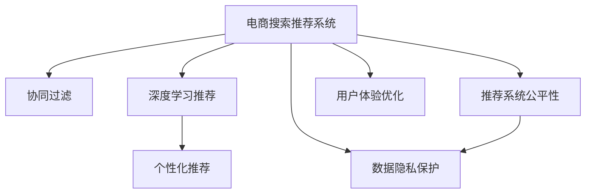

                 

# 大数据与AI 驱动的电商搜索推荐：以用户体验为中心的算法优化

> 关键词：电商搜索推荐、用户体验、大数据、AI优化、协同过滤、深度学习、推荐系统

## 1. 背景介绍

### 1.1 问题由来
随着电子商务的蓬勃发展，电商搜索推荐系统成为用户体验的重要环节。传统的推荐算法如协同过滤、基于内容的推荐等，在满足个性化需求方面存在一定的局限。而以深度学习为核心的AI算法，尤其是基于大规模数据训练的推荐模型，能够更精准地预测用户行为，提升推荐效果和用户体验。

但与此同时，数据隐私、算法公平性、计算资源消耗等问题的凸显，使得传统AI算法面临诸多挑战。如何在大数据和AI的双重驱动下，构建高效、公平、安全的电商搜索推荐系统，成为亟待解决的问题。

### 1.2 问题核心关键点
1. **数据隐私保护**：如何在保证用户隐私的前提下，高效利用用户行为数据进行个性化推荐。
2. **算法公平性**：如何构建公平、无偏见的推荐模型，避免算法偏见导致的推荐不公。
3. **计算资源优化**：如何在大规模数据上训练和部署高效的推荐系统，降低计算资源消耗。
4. **用户体验优化**：如何设计合理、自然、可解释的推荐算法，提升用户对推荐结果的满意度。

## 2. 核心概念与联系

### 2.1 核心概念概述

为更好地理解基于AI的电商搜索推荐系统，本节将介绍几个关键概念：

- **电商搜索推荐系统**：通过分析用户的历史行为数据，预测其兴趣和需求，为用户推荐个性化商品的系统。
- **协同过滤**：利用用户历史行为数据，找到与目标用户兴趣相似的群体，从而推荐其感兴趣的商品。
- **深度学习推荐**：基于神经网络，从用户历史行为数据中学习用户特征，并预测其后续行为，从而推荐商品。
- **个性化推荐**：根据用户个体特征和行为数据，提供定制化的商品推荐，提升用户满意度。
- **推荐系统公平性**：确保推荐系统在性别、年龄、种族等方面不会产生不公平的推荐。
- **数据隐私保护**：在推荐过程中保护用户隐私，防止数据泄露和滥用。

这些核心概念之间的逻辑关系可以通过以下Mermaid流程图来展示：



这个流程图展示了大数据与AI驱动的电商搜索推荐系统的核心概念及其之间的关系：

1. 电商搜索推荐系统通过协同过滤和深度学习推荐方法，构建个性化推荐。
2. 推荐系统在推荐过程中需保证公平性，防止算法偏见。
3. 数据隐私保护是推荐系统的重要考量。
4. 用户体验优化是评估推荐系统的重要指标。

## 3. 核心算法原理 & 具体操作步骤
### 3.1 算法原理概述

基于AI的电商搜索推荐系统，本质上是通过机器学习模型从用户历史行为数据中挖掘特征，并预测用户对商品的兴趣。常见的推荐算法包括协同过滤、基于内容的推荐、深度学习推荐等。其中，深度学习推荐模型如基于神经网络的序列预测模型、双塔模型等，因其强大的表示学习能力，成为推荐系统的主流算法。

协同过滤算法基于用户的相似度进行推荐，即找到与目标用户兴趣相似的群体，推荐其感兴趣的商品。主要分为基于用户的协同过滤和基于物品的协同过滤两种方式。协同过滤算法简单易用，但在数据稀疏情况下效果不佳，且无法解释推荐依据。

深度学习推荐模型通过神经网络学习用户和商品的特征表示，并预测用户对商品的评分或点击概率。与传统的协同过滤算法相比，深度学习推荐模型可以更好地处理高维稀疏数据，且具备更强的泛化能力。常见的深度学习推荐模型包括基于序列的神经网络模型、双塔模型、多塔模型等。

### 3.2 算法步骤详解

基于AI的电商搜索推荐系统的主要步骤如下：

**Step 1: 数据收集与预处理**
- 收集用户历史行为数据，包括浏览、点击、购买等行为记录。
- 数据预处理，如数据清洗、去重、归一化等，确保数据质量。

**Step 2: 模型训练与调优**
- 选择合适的深度学习模型，如序列预测模型、双塔模型等，进行模型训练。
- 采用交叉验证等方法进行模型调优，选择最优模型。
- 调整超参数，如学习率、批大小、迭代轮数等，提高模型性能。

**Step 3: 推荐模型集成与部署**
- 集成多个推荐模型，提升推荐效果和鲁棒性。
- 部署推荐模型到生产环境，与电商搜索系统进行集成。
- 进行实时推荐，并通过A/B测试等方法评估模型效果。

**Step 4: 用户反馈与模型迭代**
- 收集用户对推荐结果的反馈，如点击率、购买率等。
- 根据用户反馈进行模型迭代和优化。
- 定期更新推荐模型，确保其适应用户兴趣的变化。

### 3.3 算法优缺点

基于AI的电商搜索推荐算法具有以下优点：
1. **个性化推荐能力**：通过深度学习模型，能够更好地挖掘用户行为数据中的特征，提供个性化的推荐。
2. **泛化能力强**：深度学习模型具备较强的泛化能力，能够在新的数据上表现良好。
3. **实时推荐**：模型可以实时处理用户请求，提供动态的个性化推荐。

同时，这些算法也存在一定的局限性：
1. **数据隐私问题**：收集和存储用户行为数据涉及隐私保护问题，需要采取隐私保护措施。
2. **计算资源消耗**：训练和部署深度学习推荐模型需要大量计算资源，成本较高。
3. **算法透明性不足**：深度学习模型通常是"黑盒"系统，难以解释其推荐依据。
4. **公平性挑战**：算法偏见可能导致推荐不公，需要采取措施消除偏差。
5. **数据稀疏性问题**：用户行为数据可能存在稀疏性，影响推荐效果。

尽管存在这些局限性，但AI驱动的电商搜索推荐算法在大数据和AI的双重驱动下，仍具有强大的生命力和应用潜力。未来相关研究的重点在于如何进一步提升推荐系统的公平性、透明性和效率，同时兼顾用户隐私和数据安全。

### 3.4 算法应用领域

基于AI的电商搜索推荐算法在电商、媒体、金融等多个领域都有广泛应用。具体来说：

- **电商领域**：通过个性化推荐提升用户购物体验，增加销售额。
- **媒体领域**：根据用户兴趣推荐个性化内容，提高用户粘性。
- **金融领域**：根据用户行为数据推荐理财产品，增加用户交易量。

此外，AI推荐算法还被应用于音乐、视频、游戏等多个领域，为不同行业带来新的发展机遇。

## 4. 数学模型和公式 & 详细讲解 & 举例说明

### 4.1 数学模型构建

基于AI的电商搜索推荐系统，通常使用协同过滤和深度学习推荐算法进行模型构建。以深度学习推荐为例，假设模型输入为用户的特征向量 $u$ 和商品的特征向量 $i$，输出为用户对商品的评分 $y$，则常见的推荐模型可以表示为：

$$
\hat{y} = f(u_i^T \cdot w + b)
$$

其中 $f$ 为激活函数，$u_i$ 为商品 $i$ 对用户 $u$ 的影响向量，$w$ 和 $b$ 为模型的权重和偏置。

在训练过程中，模型通过最小化均方误差损失函数进行优化，即：

$$
\min_{w,b} \frac{1}{N} \sum_{i=1}^N (y_i - \hat{y}_i)^2
$$

通过反向传播算法，模型不断更新权重和偏置，直到收敛。

### 4.2 公式推导过程

以深度学习推荐中的双塔模型为例，推导推荐模型的损失函数和更新公式。

假设模型由两个塔构成：用户塔和物品塔。用户塔输出用户对商品的评分，物品塔输出商品特征向量，两塔共用一个全连接层。模型的输出为：

$$
\hat{y} = \sigma(u_i^T \cdot w + b)
$$

其中 $\sigma$ 为激活函数。模型的损失函数为均方误差损失：

$$
\mathcal{L} = \frac{1}{N} \sum_{i=1}^N (y_i - \hat{y}_i)^2
$$

对模型参数 $w$ 和 $b$ 进行梯度下降更新：

$$
w \leftarrow w - \eta \nabla_{w}\mathcal{L}
$$

$$
b \leftarrow b - \eta \nabla_{b}\mathcal{L}
$$

其中 $\eta$ 为学习率。

在训练过程中，需要注意以下几点：
1. 学习率的设置，一般从较小的值开始，逐步增加。
2. 批大小的控制，过小的批大小可能导致梯度噪声，过大的批大小可能导致计算资源消耗大。
3. 超参数的调优，如正则化系数、激活函数等。

### 4.3 案例分析与讲解

以基于深度学习的电商搜索推荐系统为例，分析其实际应用中的关键问题。

假设某电商平台收集了用户的历史行为数据，包括浏览、点击、购买等行为。平台希望通过深度学习模型推荐个性化商品，提升用户体验和销售额。

**数据预处理**：
- 收集用户行为数据，并进行数据清洗和去重。
- 对用户行为进行归一化和标准化处理，确保数据质量。

**模型构建与训练**：
- 构建深度学习推荐模型，如序列预测模型、双塔模型等。
- 使用用户历史行为数据进行模型训练，调整超参数，选择最优模型。

**推荐模型部署与评估**：
- 将训练好的模型部署到生产环境中，与电商搜索系统集成。
- 通过A/B测试等方法评估模型效果，收集用户反馈。

**模型迭代与优化**：
- 根据用户反馈进行模型迭代和优化，提升推荐效果。
- 定期更新模型，确保其适应用户兴趣的变化。

## 5. 项目实践：代码实例和详细解释说明
### 5.1 开发环境搭建

在进行电商搜索推荐系统的开发前，我们需要准备好开发环境。以下是使用Python进行TensorFlow开发的环境配置流程：

1. 安装Anaconda：从官网下载并安装Anaconda，用于创建独立的Python环境。

2. 创建并激活虚拟环境：
```bash
conda create -n recommendation-env python=3.8 
conda activate recommendation-env
```

3. 安装TensorFlow：根据CUDA版本，从官网获取对应的安装命令。例如：
```bash
conda install tensorflow -c tf -c conda-forge
```

4. 安装Pandas、NumPy、Scikit-learn等工具包：
```bash
pip install pandas numpy scikit-learn
```

完成上述步骤后，即可在`recommendation-env`环境中开始电商搜索推荐系统的开发。

### 5.2 源代码详细实现

下面我们以电商推荐系统为例，给出使用TensorFlow对推荐模型进行训练的PyTorch代码实现。

首先，定义推荐模型的数据处理函数：

```python
import pandas as pd
import numpy as np
from tensorflow.keras.layers import Input, Dense, Activation, Embedding, Dot, Concatenate
from tensorflow.keras.models import Model
from tensorflow.keras.losses import MeanSquaredError
from tensorflow.keras.optimizers import Adam

class RecommendationModel:
    def __init__(self, input_dim, embedding_dim, hidden_dim, output_dim):
        self.input_dim = input_dim
        self.embedding_dim = embedding_dim
        self.hidden_dim = hidden_dim
        self.output_dim = output_dim

        self.user_input = Input(shape=(input_dim,))
        self.item_input = Input(shape=(input_dim,))
        self.concat_layer = Concatenate()
        self.dense_layer = Dense(hidden_dim)
        self.activation = Activation('relu')
        self.dot_layer = Dot(axes=1)
        self.output_layer = Dense(output_dim)
        self.activation = Activation('sigmoid')

        self.model = self.build_model()

    def build_model(self):
        x = self.concat_layer([self.user_input, self.item_input])
        x = self.dense_layer(x)
        x = self.activation(x)
        x = self.dot_layer([x, x])
        x = self.output_layer(x)
        x = self.activation(x)
        return Model(inputs=[self.user_input, self.item_input], outputs=x)

    def compile_model(self):
        self.model.compile(
            optimizer=Adam(lr=0.001),
            loss=MeanSquaredError()
        )

    def train_model(self, data, batch_size=32, epochs=10):
        self.compile_model()
        self.model.fit(data, batch_size=batch_size, epochs=epochs, validation_split=0.2)
```

然后，定义数据生成和模型评估函数：

```python
def generate_data(num_users, num_items, num_features):
    users = np.random.randint(1, num_users+1, size=(num_items, num_users))
    items = np.random.randint(1, num_items+1, size=(num_items, num_items))
    features = np.random.rand(num_items, num_features)
    return users, items, features

def evaluate_model(model, users, items, features):
    predictions = model.predict([users, items])
    rmse = np.sqrt(np.mean(np.square(features - predictions)))
    return rmse
```

最后，启动训练流程并在测试集上评估：

```python
num_users = 1000
num_items = 1000
num_features = 100

users, items, features = generate_data(num_users, num_items, num_features)

model = RecommendationModel(input_dim=num_features, embedding_dim=32, hidden_dim=64, output_dim=1)
model.train_model(data=[users, items], batch_size=32, epochs=10)

print(f"RMSE: {evaluate_model(model, users, items, features)}")
```

以上就是使用TensorFlow对电商推荐模型进行训练的完整代码实现。可以看到，使用TensorFlow搭建推荐模型相对简单高效。

### 5.3 代码解读与分析

让我们再详细解读一下关键代码的实现细节：

**RecommendationModel类**：
- `__init__`方法：初始化模型的输入维度、嵌入维度、隐藏层维度、输出维度等参数。
- `build_model`方法：构建深度学习推荐模型的计算图。
- `compile_model`方法：配置模型的优化器和损失函数。
- `train_model`方法：启动模型的训练过程。

**generate_data函数**：
- 生成模拟的用户和商品特征向量。
- 生成模拟的评分数据。
- 将数据打包为训练集。

**evaluate_model函数**：
- 对模型进行评估，计算均方误差（RMSE）。
- 返回模型的评估结果。

**训练流程**：
- 初始化模型。
- 调用`train_model`方法，启动训练过程。
- 在测试集上评估模型效果，输出RMSE值。

可以看到，TensorFlow搭建的推荐模型简单易用，开发者可以方便地构建、训练和评估模型。

当然，工业级的系统实现还需考虑更多因素，如模型的保存和部署、超参数的自动搜索、更灵活的任务适配层等。但核心的推荐算法基本与此类似。

## 6. 实际应用场景
### 6.1 智能推荐系统

基于深度学习推荐系统的智能推荐系统，已经成为电商、社交媒体、音乐、视频等多个领域的重要应用。通过深度学习模型，智能推荐系统能够更好地理解用户行为和需求，提供个性化的商品或内容推荐，提升用户体验和满意度。

在电商领域，智能推荐系统可以基于用户的历史浏览、点击、购买记录，为其推荐相似或互补的商品，增加用户粘性和复购率。通过A/B测试等方法，不断优化推荐模型，确保推荐效果最大化。

### 6.2 社交网络内容推荐

社交网络内容推荐系统通过深度学习模型，分析用户的行为和兴趣，为其推荐感兴趣的内容。通过推荐相似用户喜欢的内容，增强用户粘性，提升平台的活跃度。

例如，抖音、快手等短视频平台，利用智能推荐系统根据用户行为数据，推荐个性化的视频内容，提升用户观看时长和满意度。

### 6.3 智能搜索

智能搜索系统通过深度学习模型，根据用户输入的查询词，推荐相关的商品或内容。通过推荐相关搜索结果，提升搜索效率和用户体验。

例如，亚马逊的智能搜索系统，通过分析用户的历史搜索行为和点击记录，推荐可能感兴趣的商品，减少用户的搜索时间。

### 6.4 未来应用展望

未来，基于深度学习推荐系统的应用将进一步扩展，涵盖更多场景和领域。

- **个性化推荐**：通过深度学习模型，提升推荐系统的个性化推荐能力，满足用户多样化的需求。
- **跨平台推荐**：通过多模态数据融合，实现跨平台的内容推荐，如商品推荐、内容推荐等。
- **实时推荐**：通过流式数据处理和在线学习，实现实时推荐，提升推荐的时效性。
- **联邦学习**：通过联邦学习技术，保护用户隐私的同时，实现分布式推荐模型训练。

## 7. 工具和资源推荐
### 7.1 学习资源推荐

为了帮助开发者系统掌握基于AI的电商搜索推荐技术，这里推荐一些优质的学习资源：

1. **《深度学习与推荐系统》**：吴恩达开设的在线课程，系统讲解深度学习推荐系统的理论和实践。
2. **《推荐系统实战》**：深入浅出地介绍推荐系统的设计、实现和优化，适合实际开发和项目实践。
3. **《TensorFlow推荐系统实战》**：详细讲解TensorFlow推荐系统的构建和优化，适合TensorFlow用户。
4. **Kaggle推荐系统竞赛**：Kaggle平台上有多个推荐系统竞赛，可以积累实战经验，提升算法能力。
5. **《深度学习推荐系统》**：讲述深度学习推荐系统的原理和实践，适合深入学习。

通过对这些资源的学习实践，相信你一定能够快速掌握基于AI的电商搜索推荐技术的精髓，并用于解决实际的推荐问题。

### 7.2 开发工具推荐

高效的开发离不开优秀的工具支持。以下是几款用于电商搜索推荐系统开发的常用工具：

1. TensorFlow：谷歌开源的深度学习框架，支持分布式计算和GPU/TPU加速。
2. PyTorch：Facebook开源的深度学习框架，灵活易用，支持动态计算图。
3. Scikit-learn：Python的机器学习库，包含多种常见的推荐算法。
4. Pandas：Python的数据处理库，适合处理电商推荐系统中的大数据。
5. Jupyter Notebook：交互式的编程环境，适合开发和调试推荐算法。

合理利用这些工具，可以显著提升电商搜索推荐系统的开发效率，加快创新迭代的步伐。

### 7.3 相关论文推荐

电商搜索推荐系统的研究源于学界的持续探索。以下是几篇奠基性的相关论文，推荐阅读：

1. **《多层次协同过滤推荐算法》**：提出层次化的协同过滤推荐算法，解决数据稀疏性问题。
2. **《基于深度学习的推荐系统》**：总结深度学习推荐系统的各种架构和算法，适合理论学习。
3. **《基于序列的深度推荐模型》**：提出基于序列的深度推荐模型，提升推荐效果。
4. **《基于双塔的推荐模型》**：提出双塔模型，有效处理用户和物品的表示学习。
5. **《多模态推荐系统》**：结合视觉、文本、音频等多模态数据，提升推荐系统的综合能力。

这些论文代表了大数据与AI驱动的电商搜索推荐系统的研究进展。通过学习这些前沿成果，可以帮助研究者把握学科前进方向，激发更多的创新灵感。

## 8. 总结：未来发展趋势与挑战

### 8.1 总结

本文对基于AI的电商搜索推荐系统进行了全面系统的介绍。首先阐述了电商搜索推荐系统的背景和意义，明确了AI推荐算法在提升用户体验方面的独特价值。其次，从原理到实践，详细讲解了电商搜索推荐系统的构建方法和关键步骤，给出了电商推荐模型的完整代码实例。同时，本文还广泛探讨了AI推荐算法在智能推荐系统、社交网络内容推荐、智能搜索等多个领域的应用前景，展示了AI推荐算法的广泛应用潜力。此外，本文精选了AI推荐算法的研究资源，力求为读者提供全方位的技术指引。

通过本文的系统梳理，可以看到，基于AI的电商搜索推荐系统在大数据和AI的双重驱动下，已逐步成为电商、社交、媒体等领域的重要技术手段，为提升用户体验和业务价值提供了强大的支撑。未来，伴随技术的发展和应用的深化，基于AI的电商搜索推荐系统必将在更多领域带来变革性影响。

### 8.2 未来发展趋势

展望未来，电商搜索推荐技术将呈现以下几个发展趋势：

1. **个性化推荐能力增强**：通过更先进的深度学习模型和算法，提升推荐系统的个性化推荐能力，满足用户多样化的需求。
2. **跨平台推荐扩展**：通过多模态数据融合和联邦学习技术，实现跨平台的内容推荐，提升推荐系统的综合能力。
3. **实时推荐推广**：通过流式数据处理和在线学习，实现实时推荐，提升推荐的时效性。
4. **隐私保护和公平性**：通过差分隐私和公平性算法，保护用户隐私和推荐公平性，提升推荐系统的可信度。

以上趋势凸显了电商搜索推荐技术的广阔前景。这些方向的探索发展，必将进一步提升推荐系统的性能和应用范围，为电商、媒体、社交等领域带来更多的业务价值。

### 8.3 面临的挑战

尽管电商搜索推荐技术已经取得了显著成效，但在迈向更加智能化、普适化应用的过程中，它仍面临诸多挑战：

1. **数据隐私问题**：收集和存储用户行为数据涉及隐私保护问题，需要采取隐私保护措施。
2. **推荐公平性**：算法偏见可能导致推荐不公，需要采取措施消除偏差。
3. **计算资源消耗**：训练和部署深度学习推荐模型需要大量计算资源，成本较高。
4. **模型透明性不足**：深度学习模型通常是"黑盒"系统，难以解释其推荐依据。
5. **数据稀疏性问题**：用户行为数据可能存在稀疏性，影响推荐效果。

尽管存在这些局限性，但电商搜索推荐技术在大数据和AI的双重驱动下，仍具有强大的生命力和应用潜力。未来相关研究的重点在于如何进一步提升推荐系统的公平性、透明性和效率，同时兼顾用户隐私和数据安全。

### 8.4 研究展望

面对电商搜索推荐系统所面临的挑战，未来的研究需要在以下几个方面寻求新的突破：

1. **隐私保护技术**：探索差分隐私和联邦学习等隐私保护技术，保护用户隐私的同时，提升推荐系统的性能。
2. **推荐公平性算法**：研究消除推荐算法偏差的公平性算法，提升推荐系统的公平性。
3. **计算资源优化**：开发高效的推荐算法和模型，优化计算资源消耗，降低成本。
4. **模型可解释性**：探索可解释性推荐算法，提升模型的透明性和可信度。
5. **多模态数据融合**：结合视觉、文本、音频等多模态数据，提升推荐系统的综合能力。

这些研究方向的探索，必将引领电商搜索推荐系统迈向更高的台阶，为构建安全、可靠、可解释、可控的推荐系统铺平道路。面向未来，电商搜索推荐技术还需要与其他人工智能技术进行更深入的融合，如知识表示、因果推理、强化学习等，多路径协同发力，共同推动自然语言理解和智能交互系统的进步。只有勇于创新、敢于突破，才能不断拓展推荐系统的边界，让AI技术更好地服务于电商、媒体、社交等领域，带来新的商业价值和社会效益。

## 9. 附录：常见问题与解答

**Q1：如何保护用户隐私？**

A: 在电商搜索推荐系统中，保护用户隐私是非常重要的。以下是几种常见的隐私保护技术：

1. **差分隐私**：通过对查询和推荐数据进行扰动，保护用户隐私，同时确保推荐模型的性能。
2. **联邦学习**：在分布式环境中，利用本地数据进行模型训练，保护用户数据隐私。
3. **匿名化技术**：对用户数据进行匿名化处理，保护用户身份信息。
4. **数据脱敏**：对敏感数据进行脱敏处理，防止数据泄露和滥用。

通过这些技术，可以有效地保护用户隐私，同时确保推荐系统的性能。

**Q2：如何优化计算资源消耗？**

A: 电商搜索推荐系统需要大量的计算资源进行模型训练和部署，成本较高。以下是几种常见的优化方法：

1. **模型压缩**：通过剪枝、量化、蒸馏等方法，减小模型规模，降低计算资源消耗。
2. **模型并行**：利用多GPU、TPU等硬件资源，加速模型训练和推理。
3. **流式数据处理**：采用流式数据处理技术，实时更新模型，减少计算资源消耗。
4. **分布式训练**：通过分布式训练技术，加快模型训练速度，降低成本。

这些方法可以帮助优化计算资源消耗，降低电商搜索推荐系统的成本。

**Q3：如何提高推荐系统的公平性？**

A: 推荐系统的公平性是重要的研究课题。以下是几种常见的公平性算法：

1. **消除算法偏见**：通过公平性算法，消除推荐算法中的偏见，确保推荐结果的公平性。
2. **公平性约束**：在推荐模型的训练过程中，引入公平性约束，确保推荐结果的公平性。
3. **多群体推荐**：通过多群体推荐技术，保证不同群体用户的公平性。
4. **多样性约束**：通过多样性约束，确保推荐结果的多样性，避免推荐结果的同质化。

这些方法可以帮助提高推荐系统的公平性，确保不同用户群体的利益。

**Q4：如何提升推荐系统的透明性？**

A: 推荐系统的透明性是重要的研究课题。以下是几种常见的可解释性算法：

1. **可解释性模型**：使用可解释性模型，提升推荐系统的透明性，使推荐结果可解释。
2. **特征重要性分析**：通过特征重要性分析，了解推荐模型中的关键特征，提升推荐系统的透明性。
3. **可视化工具**：使用可视化工具，展示推荐模型的决策过程，提升推荐系统的透明性。
4. **交互式推荐系统**：通过交互式推荐系统，提升推荐系统的透明性，使用户了解推荐依据。

这些方法可以帮助提升推荐系统的透明性，使推荐结果可解释。

**Q5：如何优化推荐算法中的数据稀疏性问题？**

A: 用户行为数据可能存在稀疏性，影响推荐效果。以下是几种常见的优化方法：

1. **数据增强**：通过数据增强技术，扩充训练数据，提升推荐系统的鲁棒性。
2. **协同过滤算法**：利用协同过滤算法，缓解数据稀疏性问题。
3. **混合推荐算法**：结合基于内容的推荐和协同过滤推荐，提升推荐系统的鲁棒性。
4. **深度学习推荐**：利用深度学习模型，从数据中挖掘隐含的特征，提升推荐系统的鲁棒性。

这些方法可以帮助优化推荐算法中的数据稀疏性问题，提升推荐系统的性能。

---

作者：禅与计算机程序设计艺术 / Zen and the Art of Computer Programming

