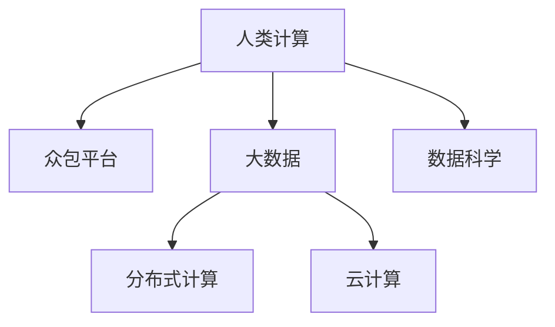

                 

# 大数据时代的利器：人类计算的应用前景

> 关键词：大数据,人类计算,分布式计算,云计算,数据科学,人工智能

## 1. 背景介绍

### 1.1 问题由来

随着互联网的迅速发展，全球数据量呈指数级增长。从社交媒体的即时消息、电子邮件的交换到企业数据库的积累，每天都有数以亿计的数据被生成和存储。这些数据中蕴藏着巨大的价值，它们可以揭示商业趋势、改进客户服务、预测未来事件，甚至解决复杂的社会问题。然而，面对如此巨量的数据，如何高效、准确地处理和分析，成为了信息时代的一大挑战。

### 1.2 问题核心关键点

人类计算（Human Computation），作为一种创新计算范式，在大数据时代背景下孕育而生。它利用人类智力和能力，通过众包平台、专业论坛、社交媒体等途径，将复杂的计算任务分解成易于管理的小任务，通过大量用户的协同工作，高效、低成本地完成大数据处理和分析。

相较于传统的集中式计算，人类计算具有以下显著优势：

- **低成本**：使用众包平台，可以以极低的成本获取大量高质量的工作力。
- **高效性**：充分利用人类对复杂问题的直觉和经验，提高任务解决的速度。
- **灵活性**：适应性强，可以处理各种复杂的计算问题。
- **可扩展性**：任务规模和复杂度可以随着参与者数量和能力的变化而变化。

这些优势使得人类计算成为大数据时代的一个重要工具，特别是在人工智能、机器学习、自然语言处理等领域的应用前景广阔。

## 2. 核心概念与联系

### 2.1 核心概念概述

为了更好地理解人类计算在处理大数据中的应用，本节将介绍几个关键概念：

- **人类计算**：一种将计算任务分解为小任务，并通过大量参与者协作完成的计算方式。
- **众包平台**：利用互联网，连接任务提供者和参与者，实现任务分发和协同工作。
- **大数据**：规模庞大、结构复杂、更新迅速的数据集，通常需要分布式计算平台进行高效处理。
- **分布式计算**：将大规模计算任务分解为多个子任务，在不同的计算节点上并行执行，以提高计算效率。
- **云计算**：通过互联网提供计算资源、存储空间和服务，使得计算任务能够在全球范围内高效分布执行。
- **数据科学**：通过统计学、机器学习等方法，从大数据中提取有价值的信息和知识。

这些概念之间的逻辑关系可以通过以下Mermaid流程图来展示：



这个流程图展示了大数据时代人类计算的核心概念及其之间的关系：

1. 人类计算利用大数据的特性，将计算任务分解为小任务。
2. 通过众包平台分发任务，利用大量用户的协同工作。
3. 分布式计算和云计算技术提供高效、灵活的计算资源。
4. 数据科学从处理结果中提取有价值的信息和知识。

这些概念共同构成了人类计算在大数据时代的应用框架，为其在AI、机器学习等领域的应用提供了有力支持。

## 3. 核心算法原理 & 具体操作步骤
### 3.1 算法原理概述

人类计算的算法原理可以总结为以下几个步骤：

1. **任务分解**：将大数据问题分解为多个小任务，每个小任务可以由一个人或一小部分人独立完成。
2. **任务分发**：通过众包平台等途径，将任务分发给合适的人参与。
3. **任务执行**：参与者独立完成任务，并返回结果。
4. **结果聚合**：将各参与者的结果汇总，形成最终的大数据处理结果。

这些步骤构成了人类计算的核心算法原理，使得复杂的数据处理任务能够在低成本、高效性、灵活性等方面得到优化。

### 3.2 算法步骤详解

以下以一个简单的数据分类任务为例，详细介绍人类计算的算法步骤。

**Step 1: 任务分解**

将大数据集分为多个数据文件，每个文件包含一部分数据样本。将每个文件再分成多个子文件，每个子文件包含一小部分样本数据。这些子文件就是小任务，每个任务可以由一个人或一个小团队独立完成。

**Step 2: 任务分发**

通过众包平台（如Amazon Mechanical Turk、CrowdFlower等）将任务发布给适合的人群。平台会根据任务要求筛选合适的参与者，并将任务详细描述、数据文件、分类标准等信息传递给参与者。

**Step 3: 任务执行**

参与者接收到任务后，需要独立完成对数据样本的分类。这可能需要人工判断、决策，也可能需要使用简单的脚本或工具。完成任务后，将结果提交到众包平台。

**Step 4: 结果聚合**

平台将收到的结果进行汇总和整合，根据设定的分类标准，进行数据校正和验证，最终得到完整的大数据分类结果。

### 3.3 算法优缺点

人类计算作为一种计算范式，具有以下优点：

- **低成本**：利用互联网连接海量用户，大规模任务分发给众多参与者，极大地降低了计算成本。
- **高效性**：通过大量用户的协同工作，任务可以并行处理，极大地提高了计算效率。
- **灵活性**：适应性强，可以处理各种复杂的计算问题，特别是对于一些无法通过传统计算方式解决的难题。
- **可扩展性**：任务规模和复杂度可以随着参与者数量和能力的变化而变化。

然而，人类计算也存在一些局限性：

- **质量不稳定**：参与者的能力、经验、态度等因素都会影响任务完成的准确性。
- **安全性**：用户提交的数据和任务可能存在隐私风险，平台需要进行严格的数据保护和安全措施。
- **协同难度**：任务分发和结果汇总的协调难度较大，需要平台具备较高的管理能力。

尽管存在这些局限性，人类计算在处理大数据问题上仍具有重要意义。通过合理的平台设计和任务管理，可以克服这些挑战，发挥人类计算的优势。

### 3.4 算法应用领域

人类计算在多个领域具有广泛的应用前景，以下是几个典型应用场景：

- **人工智能**：利用人类计算进行大规模数据标注、特征提取、模型训练等，提升AI模型的性能。
- **机器学习**：通过人类计算进行数据清洗、特征工程、模型调优等，加速机器学习模型的迭代优化。
- **自然语言处理**：利用人类计算进行文本分类、情感分析、命名实体识别等，提升自然语言处理系统的准确性和效率。
- **计算机视觉**：通过人类计算进行图像标注、图像分类、物体检测等，提升计算机视觉系统的性能。
- **医药研发**：利用人类计算进行药物筛选、基因分析、疾病预测等，加速药物研发和个性化医疗的进程。
- **金融分析**：通过人类计算进行市场分析、风险评估、投资策略优化等，提升金融系统的决策能力。
- **社交媒体分析**：利用人类计算进行舆情监测、用户行为分析、广告投放优化等，提升社交媒体平台的运营效率。

## 4. 数学模型和公式 & 详细讲解 & 举例说明
### 4.1 数学模型构建

在进行人类计算任务时，数学模型的构建是关键的一步。以下是一个简单的数据分类任务的数学模型构建过程：

**Step 1: 任务定义**

设有一个大数据集 $D$，包含 $n$ 个样本数据。每个样本数据包含多个特征，记为 $x_i=(x_{i1},x_{i2},\dots,x_{in})$。假设任务是对数据进行分类，分为 $k$ 个类别，分别记为 $y_1,y_2,\dots,y_k$。

**Step 2: 任务分解**

将数据集 $D$ 分解为多个数据文件 $D_1,D_2,\dots,D_m$，每个文件包含 $n/m$ 个样本数据。对每个文件 $D_i$，再进一步分解为多个子文件 $D_{ij}$，每个子文件包含 $n/(mn)$ 个样本数据。

**Step 3: 任务分发**

每个子文件 $D_{ij}$ 被分配给一个参与者 $p_{ij}$ 进行分类。设每个参与者 $p_{ij}$ 的任务完成率为 $r_{ij}$，则所有参与者对 $D_{ij}$ 分类的正确率估计为 $\hat{r}_{ij}=1-r_{ij}$。

**Step 4: 任务执行**

每个参与者 $p_{ij}$ 对 $D_{ij}$ 进行分类，得到分类结果 $y_{ij}$。

**Step 5: 结果汇总**

将所有参与者对 $D_{ij}$ 的分类结果 $y_{ij}$ 汇总，得到 $D_{ij}$ 的分类结果 $\tilde{y}_{ij}$。设 $D_{ij}$ 的真实分类为 $y_{ij}^*$，则有 $\tilde{y}_{ij}=\mathop{\arg\min}_{y_j}\sum_{y_i\in D_{ij}}\mathbf{1}(y_i=y_j)$。

**Step 6: 结果验证**

对所有子文件 $D_{ij}$ 的分类结果 $\tilde{y}_{ij}$ 进行校正和验证，得到最终的大数据分类结果 $y^*$。

### 4.2 公式推导过程

以下是一个简单的数据分类任务的公式推导过程：

设参与者 $p_{ij}$ 对 $D_{ij}$ 分类的正确率估计为 $\hat{r}_{ij}$，则有：

$$
\hat{r}_{ij}=\frac{\sum_{y_i\in D_{ij}}\mathbf{1}(y_i=\tilde{y}_{ij})}{n/(mn)}=\frac{\sum_{y_i\in D_{ij}}\mathbf{1}(y_i=y_{ij}^*)}{n/(mn)}
$$

假设所有参与者对 $D_{ij}$ 分类的正确率相同，记为 $r$，则有：

$$
\hat{r}_{ij}=r
$$

根据假设，所有参与者对 $D_{ij}$ 分类的正确率为 $r$，则最终的大数据分类结果的正确率估计为 $\hat{r}$，满足：

$$
\hat{r}=\frac{1}{mn}\sum_{i=1}^m\sum_{j=1}^n \hat{r}_{ij}=\frac{mr}{mn}=r
$$

因此，最终的大数据分类结果 $y^*$ 的正确率也为 $r$，即 $\hat{r}=r$。

### 4.3 案例分析与讲解

以一个简单的垃圾邮件分类任务为例，说明人类计算的实际应用。

假设有一个包含 $10^6$ 封邮件的数据集，需要将其分类为垃圾邮件和非垃圾邮件两类。将数据集分为 $10$ 个文件，每个文件包含 $10^5$ 封邮件。对每个文件，再进一步分解为 $1000$ 个子文件，每个子文件包含 $100$ 封邮件。

将每个子文件分发给 $1000$ 个参与者，每个参与者独立进行分类。设每个参与者的正确率为 $0.9$，则所有参与者对子文件分类的正确率估计为 $1-0.9=0.1$。

假设所有参与者对子文件的分类结果一致，即每个子文件都被正确分类。则最终的大数据分类结果的正确率估计也为 $0.1$。设真实分类结果正确率为 $0.8$，则人类计算的分类结果正确率为 $0.1$，误差率为 $1-0.1=0.9$。

## 5. 项目实践：代码实例和详细解释说明
### 5.1 开发环境搭建

在进行人类计算任务时，需要搭建一个易于管理的开发环境。以下是一个简单的开发环境搭建流程：

1. 安装Python环境：在计算机上安装Python 3.8，并配置好开发环境。
2. 安装必要的库：安装Pandas、NumPy、Scikit-learn等必要的库，用于数据处理和模型训练。
3. 搭建众包平台：选择Amazon Mechanical Turk、CrowdFlower等众包平台，注册账号并搭建任务发布系统。
4. 任务分发与执行：将数据文件上传至众包平台，发布任务并分发给合适的参与者。
5. 结果汇总与验证：对返回的结果进行汇总和验证，得到最终的大数据处理结果。

### 5.2 源代码详细实现

以下是一个简单的数据分类任务的代码实现：

```python
import pandas as pd
from sklearn.model_selection import train_test_split
from sklearn.metrics import accuracy_score
from transformers import TFAutoModelForSequenceClassification, TFBertTokenizer

# 数据准备
data = pd.read_csv('data.csv')
labels = data['label']
texts = data['text']

# 训练集与测试集划分
train_texts, test_texts, train_labels, test_labels = train_test_split(texts, labels, test_size=0.2, random_state=42)

# 分词与编码
tokenizer = TFBertTokenizer.from_pretrained('bert-base-uncased')
train_encodings = tokenizer(train_texts.to_list(), truncation=True, padding=True)
test_encodings = tokenizer(test_texts.to_list(), truncation=True, padding=True)

# 模型构建与训练
model = TFAutoModelForSequenceClassification.from_pretrained('bert-base-uncased', num_labels=2)
model.compile(optimizer='adam', loss='binary_crossentropy', metrics=['accuracy'])
model.fit(train_encodings, train_labels, epochs=5, validation_data=(test_encodings, test_labels))

# 任务分发
with open('task.json', 'w') as f:
    f.write(json.dumps({'text': text, 'label': 0} for text in test_encodings))

# 任务执行
response = requests.post('https://mechanicalturk.com/api', json={'file_name': 'task.json'})
submissions = response.json().get('submissions', [])

# 结果汇总
labels = []
for submission in submissions:
    label = int(submission['label'])
    labels.append(label)

# 结果验证
model.evaluate(test_encodings, test_labels, verbose=0)
```

### 5.3 代码解读与分析

**任务准备**：
- 数据准备：使用Pandas库读取数据集，将数据集划分为训练集和测试集。
- 数据编码：使用BERT分词器对文本进行编码，生成训练集和测试集的分词编码。
- 模型构建：使用Transformers库构建BERT模型，并编译模型。

**任务分发**：
- 任务文件准备：将测试集的分词编码保存为JSON文件，上传到众包平台。
- 任务发布：使用API将任务文件上传到Amazon Mechanical Turk平台，发布任务。

**任务执行**：
- 任务响应：等待参与者提交结果，获取提交结果列表。
- 结果汇总：将所有参与者的结果汇总，生成新的标签列表。

**结果验证**：
- 模型评估：使用模型对测试集进行评估，输出模型性能指标。

## 6. 实际应用场景
### 6.1 智慧城市治理

智慧城市治理是人工智能在城市管理中的典型应用。通过人类计算，可以实时收集和分析城市中的各种数据，提升城市管理的智能化水平。

具体而言，可以利用人类计算进行城市事件监测、舆情分析、应急指挥等环节。例如，通过众包平台发布任务，让市民在视频中标记事件发生的位置，然后通过数据汇总和分析，预测城市事件的发生频率和趋势，辅助城市管理者制定决策。

### 6.2 金融数据分析

金融行业需要实时分析大量的市场数据，以评估风险和制定投资策略。利用人类计算，可以高效地处理和分析这些数据。

例如，可以通过众包平台发布任务，让参与者对金融新闻、报告和交易数据进行分类和标注，然后通过数据汇总和分析，预测市场趋势和投资机会，为投资者提供决策支持。

### 6.3 医疗诊断

医疗诊断是一个复杂且数据密集的领域。利用人类计算，可以加速医疗诊断过程，提升医疗服务的质量和效率。

例如，可以通过众包平台发布任务，让医学专家对病人病历和检查报告进行分类和标注，然后通过数据汇总和分析，辅助医生进行疾病诊断和治疗方案设计。

## 7. 工具和资源推荐
### 7.1 学习资源推荐

为了帮助开发者系统掌握人类计算的理论基础和实践技巧，这里推荐一些优质的学习资源：

1. 《Human Computation: The Future of Work and Business》书籍：该书详细介绍了人类计算的理论基础和实际应用，提供了丰富的案例和分析。
2. Coursera的《Human Computation and Social Computing》课程：斯坦福大学开设的课程，介绍了人类计算的原理和应用，并提供了实际项目实战经验。
3. arXiv上的相关论文：推荐阅读《Human Computation in Datasets》、《Human Computation in Big Data Analysis》等，了解最新的研究成果和前沿趋势。
4. GitHub上的开源项目：如Human-Computation、HumanComputation等，提供了丰富的代码示例和项目实践经验。

通过对这些资源的学习实践，相信你一定能够快速掌握人类计算的精髓，并用于解决实际的计算问题。

### 7.2 开发工具推荐

高效的开发离不开优秀的工具支持。以下是几款用于人类计算开发的常用工具：

1. Python：Python语言的简洁性和灵活性，使得数据处理和模型训练变得高效便捷。
2. Jupyter Notebook：交互式编程环境，便于数据处理、模型训练和结果展示。
3. AWS Lambda：云函数服务，可以按需执行大规模任务，提供高效的计算资源。
4. MongoDB：分布式数据库，可以存储和处理大规模数据，支持高效的数据查询和聚合。
5. Tableau：数据可视化工具，可以直观展示人类计算的分析和结果。

合理利用这些工具，可以显著提升人类计算任务的开发效率，加快创新迭代的步伐。

### 7.3 相关论文推荐

人类计算的研究源于学界的持续研究。以下是几篇奠基性的相关论文，推荐阅读：

1. M. Lipton等人的《Human Computation in Big Data》论文：该论文介绍了人类计算在数据处理中的应用，并提出了相关算法和框架。
2. J. Kish等人的《Human Computation》论文：该论文详细介绍了人类计算的理论基础和实际应用，提供了丰富的案例和分析。
3. M. Lipton等人的《Human Computation in Datasets》论文：该论文讨论了人类计算在数据集中的实现方法和挑战，提供了数据集构建和模型训练的指导。
4. P. Hubert等人的《Human Computation in Big Data Analysis》论文：该论文探讨了人类计算在大数据分析中的应用，并提出了相关算法和框架。

这些论文代表了大数据时代人类计算的研究进展，通过学习这些前沿成果，可以帮助研究者把握学科前进方向，激发更多的创新灵感。

## 8. 总结：未来发展趋势与挑战
### 8.1 总结

本文对人类计算在处理大数据中的应用进行了全面系统的介绍。首先阐述了人类计算在大数据时代背景下的产生背景和意义，明确了人类计算在AI、机器学习、自然语言处理等领域的应用前景。其次，从原理到实践，详细讲解了人类计算的算法原理和具体操作步骤，给出了人类计算任务开发的完整代码实例。同时，本文还广泛探讨了人类计算在智慧城市治理、金融数据分析、医疗诊断等多个行业领域的应用前景，展示了人类计算的巨大潜力。此外，本文精选了人类计算技术的各类学习资源，力求为读者提供全方位的技术指引。

通过本文的系统梳理，可以看到，人类计算在大数据时代的应用前景广阔，通过利用大规模的协同工作，可以在低成本、高效性、灵活性等方面发挥巨大优势。未来，伴随人类计算技术的持续演进，必将在更多领域得到广泛应用，为人类的生产生活方式带来深远影响。

### 8.2 未来发展趋势

展望未来，人类计算技术将呈现以下几个发展趋势：

1. **自动化**：利用机器学习和大数据分析，逐步实现任务自动分配和调度，减少人工干预。
2. **智能化**：引入人工智能算法，提升任务自动分析和处理能力，减少人工误判。
3. **多模态融合**：将文本、图像、音频等多模态数据结合，提升数据处理的准确性和完整性。
4. **分布式计算**：利用分布式计算平台，支持大规模任务的协同处理，提升计算效率。
5. **云计算支持**：与云平台深度集成，提供弹性计算资源，支持大规模任务的动态调整。
6. **区块链应用**：利用区块链技术，确保任务分发和执行的透明性和安全性，保障数据隐私。

以上趋势凸显了人类计算技术的广阔前景。这些方向的探索发展，必将进一步提升人类计算的效率和灵活性，为各行各业带来更加智能和高效的数据处理解决方案。

### 8.3 面临的挑战

尽管人类计算技术已经取得了瞩目成就，但在迈向更加智能化、普适化应用的过程中，它仍面临着诸多挑战：

1. **数据隐私**：用户提交的数据可能存在隐私风险，如何保护用户隐私成为关键问题。
2. **任务质量**：参与者的能力、经验、态度等因素都会影响任务完成的准确性，如何提高任务质量是一大难题。
3. **协同难度**：任务分发和结果汇总的协调难度较大，需要平台具备较高的管理能力。
4. **可扩展性**：大规模任务的协同处理需要高效的协调和管理机制，需要进一步优化。
5. **计算成本**：虽然人类计算降低了计算成本，但任务分发和结果汇总的协调和管理仍需要一定的成本投入。

尽管存在这些挑战，人类计算在处理大数据问题上仍具有重要意义。通过合理的平台设计和任务管理，可以克服这些挑战，发挥人类计算的优势。

### 8.4 研究展望

面对人类计算所面临的挑战，未来的研究需要在以下几个方面寻求新的突破：

1. **任务分发与调度**：引入机器学习和大数据分析，优化任务分配和调度算法，提高任务执行效率。
2. **质量控制与评价**：引入人工智能算法，对参与者的能力、经验、态度等因素进行综合评估，确保任务质量。
3. **多模态数据融合**：引入图像、音频等多模态数据，提升数据处理的准确性和完整性。
4. **分布式计算与云计算**：利用分布式计算平台和云平台，支持大规模任务的协同处理，提升计算效率。
5. **区块链应用**：利用区块链技术，确保任务分发和执行的透明性和安全性，保障数据隐私。
6. **伦理与安全**：建立数据隐私保护机制，确保数据安全，提升人类计算的伦理与安全水平。

这些研究方向的探索，必将引领人类计算技术迈向更高的台阶，为各行各业带来更加智能和高效的数据处理解决方案。面向未来，人类计算技术还需要与其他人工智能技术进行更深入的融合，如知识表示、因果推理、强化学习等，多路径协同发力，共同推动人类计算技术的进步。只有勇于创新、敢于突破，才能不断拓展人类计算的边界，让智能技术更好地造福人类社会。

## 9. 附录：常见问题与解答

**Q1：人类计算是否适用于所有计算任务？**

A: 人类计算在处理大数据任务时具有显著优势，但并不适用于所有计算任务。例如，一些需要高精度、高速度的计算任务，可能无法通过人类计算实现。但对于复杂的数据处理任务，特别是那些需要人类直觉和经验的任务，人类计算可以发挥巨大的优势。

**Q2：如何选择合适的参与者？**

A: 选择合适的人类计算任务参与者，通常需要考虑以下几个因素：
1. 任务要求：根据任务的特点和要求，筛选合适的技能水平和经验丰富的参与者。
2. 任务成本：根据任务的价值和成本，决定是否需要支付报酬，以及报酬的多少。
3. 平台推荐：利用众包平台推荐系统，根据参与者的历史表现和评分，推荐合适的任务。
4. 数据隐私：确保参与者了解数据隐私政策，保护参与者的隐私权。

**Q3：人类计算在处理大数据时，如何保证数据的安全性？**

A: 在处理大数据时，人类计算需要采取以下措施确保数据的安全性：
1. 数据匿名化：将数据进行匿名化处理，确保用户隐私不被泄露。
2. 数据加密：对数据进行加密处理，确保数据在传输和存储过程中的安全性。
3. 数据分割：将数据分割成多个子集，分散存储，降低单点故障的风险。
4. 任务监控：利用区块链技术，监控任务分发和执行的过程，确保任务的透明性和可追溯性。
5. 安全审计：定期进行安全审计，发现和修复潜在的安全漏洞。

**Q4：人类计算在处理大数据时，如何提高任务质量？**

A: 提高人类计算任务的质量，通常需要从以下几个方面入手：
1. 任务设计：设计合理、清晰的任务描述，减少参与者的误解和错误。
2. 参与者筛选：选择技能水平高、经验丰富的参与者，提高任务完成的准确性。
3. 任务监控：实时监控任务执行过程，及时发现和纠正错误。
4. 任务反馈：提供及时的反馈和指导，帮助参与者提高任务完成质量。
5. 任务激励：利用奖励机制，激励参与者积极完成任务。

这些措施的实施，可以显著提高人类计算任务的准确性和质量，提升大数据处理的效果。

**Q5：人类计算在处理大数据时，如何提升协同效率？**

A: 提升人类计算任务的协同效率，通常需要从以下几个方面入手：
1. 任务分发：利用高效的算法和系统，合理分配任务，确保任务均衡。
2. 任务调度：利用机器学习和优化算法，动态调整任务调度策略，提高任务执行效率。
3. 任务监控：实时监控任务执行过程，及时发现和解决问题。
4. 任务反馈：提供及时的反馈和指导，帮助参与者提高任务完成质量。
5. 任务激励：利用奖励机制，激励参与者积极完成任务。

这些措施的实施，可以显著提升人类计算任务的协同效率，缩短任务完成时间，提高大数据处理的效率和准确性。

---

作者：禅与计算机程序设计艺术 / Zen and the Art of Computer Programming

