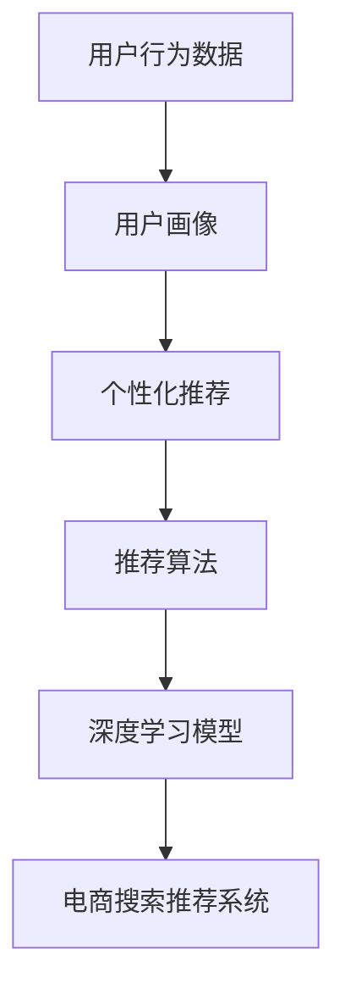

                 

## 1. 背景介绍

随着互联网技术的发展，电商平台已经从传统的卖场式销售模式转变为智能推荐驱动的个性化电商体验模式。电商平台通过对用户行为数据的深度分析和挖掘，可以精准预测用户需求，并实现商品、服务及内容的个性化推荐，显著提升用户体验和转化率，驱动平台的增长和收益。

智能推荐技术基于用户的浏览记录、购买行为、评分反馈、社交网络等多种数据源，构建用户画像，并基于此进行精确推荐。近年来，推荐系统已经成为各大电商平台的必备组件，成为电商平台的核心竞争力之一。

本文章将基于电商搜索推荐的实际需求，深入探讨AI模型融合技术在电商平台中的应用，探讨推荐系统中的常见算法和模型，以及如何利用大数据驱动电商推荐系统的优化和升级。

## 2. 核心概念与联系

### 2.1 核心概念概述

电商搜索推荐系统是一个复杂的AI应用场景，涉及数据收集、存储、处理、分析和推荐等多个环节。其主要目标是通过对用户行为数据的分析，理解用户偏好，并基于此进行个性化推荐。

以下是几个核心概念的概述：

- **电商搜索推荐系统**：根据用户历史行为和输入查询，快速检索相关商品并提供推荐的系统。
- **用户行为数据**：用户在电商平台上的浏览、点击、购买、评分等行为记录。
- **用户画像**：基于用户行为数据构建的特征表示，用于描述用户偏好和需求。
- **个性化推荐**：根据用户画像，推荐最符合用户需求的商品和服务。
- **推荐算法**：实现推荐的核心技术，包括协同过滤、内容推荐、混合推荐等多种算法。
- **深度学习**：基于神经网络模型的推荐方法，通过大量数据训练，提升推荐精度。

### 2.2 核心概念原理和架构的 Mermaid 流程图



该图展示了电商搜索推荐系统的主要组件：用户行为数据通过用户画像生成模块进行处理，并用于个性化推荐；推荐算法基于深度学习模型对用户画像进行处理，并驱动推荐系统进行商品推荐。

## 3. 核心算法原理 & 具体操作步骤

### 3.1 算法原理概述

推荐算法一般分为基于协同过滤、基于内容的推荐、混合推荐等多种类型。本文重点介绍基于协同过滤的推荐算法和基于深度学习的推荐算法。

协同过滤算法基于用户相似度或物品相似度，通过相似用户或物品的偏好推断出新用户的偏好。协同过滤算法包括基于用户的协同过滤和基于物品的协同过滤两种方法。

深度学习推荐算法通过构建深度神经网络模型，对用户和物品的特征进行学习，并用于预测用户对物品的评分或是否购买。深度学习模型包括神经协同过滤（NeuMF）、基于知识图谱的推荐模型、多任务学习推荐模型等。

### 3.2 算法步骤详解

#### 3.2.1 协同过滤推荐算法

1. **用户行为数据收集**：收集用户的历史行为数据，包括浏览、点击、购买、评分等行为。
2. **用户画像构建**：将用户行为数据映射为向量表示，构建用户画像。
3. **相似度计算**：基于余弦相似度、皮尔逊相关系数等方法计算用户之间的相似度。
4. **推荐计算**：对于目标用户，找出与其最相似的若干用户，并基于这些用户的偏好推荐商品。

#### 3.2.2 深度学习推荐算法

1. **数据预处理**：对用户和物品的数据进行归一化、编码等预处理。
2. **模型构建**：选择合适的深度神经网络模型，如基于FM的神经协同过滤模型，基于知识图谱的推荐模型等。
3. **特征提取**：通过神经网络对用户和物品的特征进行提取和融合。
4. **损失函数设计**：设计适当的损失函数，如均方误差损失函数、交叉熵损失函数等。
5. **模型训练**：使用随机梯度下降等优化算法对模型进行训练。
6. **推荐计算**：使用训练好的模型对目标用户进行推荐计算。

### 3.3 算法优缺点

#### 3.3.1 协同过滤算法

**优点**：
- 简单易实现，适合处理大规模稀疏矩阵。
- 对新物品和用户的表现能力强。

**缺点**：
- 依赖用户行为数据的完备性，数据缺失会导致推荐效果下降。
- 容易受到冷启动问题的困扰，新用户的推荐无法进行。
- 无法处理连续用户行为数据，导致推荐质量不稳定。

#### 3.3.2 深度学习推荐算法

**优点**：
- 能够自动提取和融合复杂特征，提高推荐精度。
- 可以通过神经网络结构优化推荐效果，增强模型的泛化能力。
- 能够处理连续用户行为数据，提高推荐稳定性。

**缺点**：
- 需要大量标注数据和计算资源进行训练。
- 模型复杂度高，难以解释和调试。
- 过拟合风险较大，需要更多的正则化技术进行控制。

### 3.4 算法应用领域

电商搜索推荐算法广泛应用于电商平台的商品推荐、个性化搜索、广告投放等多个场景。以下是一些具体的应用领域：

1. **商品推荐**：根据用户历史行为数据，推荐用户可能感兴趣的商品。
2. **个性化搜索**：根据用户输入的查询，推荐相关商品。
3. **广告投放**：根据用户画像，进行定向广告投放。
4. **实时推荐**：在用户浏览和购买过程中，实时进行商品推荐。

## 4. 数学模型和公式 & 详细讲解 & 举例说明

### 4.1 数学模型构建

**协同过滤算法**：
- **用户行为矩阵**：将用户和物品之间的关系表示为一个稀疏矩阵，其中$M$表示用户数，$N$表示物品数，$A$表示用户对物品的评分，$A_{ui}=0$表示用户$u$没有对物品$i$评分。
- **用户画像向量**：将用户行为矩阵进行归一化处理，得到用户画像向量$\mathbf{x}_u$，$x_{ui}$表示用户$u$对物品$i$的评分。

**深度学习推荐算法**：
- **用户特征表示**：将用户特征$X_u$映射为向量表示$\mathbf{u}$，$x_{uj}$表示用户$u$的第$j$个特征。
- **物品特征表示**：将物品特征$Y_i$映射为向量表示$\mathbf{v}_i$，$y_{ik}$表示物品$i$的第$k$个特征。

### 4.2 公式推导过程

**协同过滤算法**：
- **余弦相似度计算**：用户$u$和用户$v$之间的余弦相似度$sim(u,v)$定义为$\mathbf{x}_u \cdot \mathbf{x}_v / (\|\mathbf{x}_u\|\|\mathbf{x}_v\|)$，其中$\mathbf{x}_u \cdot \mathbf{x}_v$表示向量点积，$\|\mathbf{x}_u\|$和$\|\mathbf{x}_v\|$表示向量的模长。
- **推荐计算**：对于目标用户$u$，其对物品$i$的评分可以通过相似用户$v$的评分进行计算，即$pred_u(i)=\sum_{v \in U}\alpha sim(u,v)\mathbf{x}_v \cdot \mathbf{v}_i$，其中$\alpha$表示相似度权重，$U$表示所有用户的集合。

**深度学习推荐算法**：
- **神经协同过滤模型**：神经协同过滤模型使用两个全连接神经网络分别对用户特征和物品特征进行编码，然后通过点积的方式进行预测，损失函数通常采用均方误差或交叉熵。

**深度学习推荐模型的神经网络结构**：
- **输入层**：输入用户特征$X_u$和物品特征$Y_i$。
- **隐层**：使用两个全连接神经网络对用户特征和物品特征进行编码，得到用户嵌入$\mathbf{u}$和物品嵌入$\mathbf{v}$。
- **输出层**：将用户嵌入和物品嵌入进行点积，得到预测评分。

### 4.3 案例分析与讲解

#### 4.3.1 协同过滤算法案例

**案例1：基于用户相似度的协同过滤推荐系统**
- **数据集**：收集用户在电商平台的浏览、点击、购买、评分等数据，构建用户行为矩阵$M$。
- **用户画像构建**：对用户行为矩阵进行归一化处理，得到用户画像向量$\mathbf{x}_u$。
- **相似度计算**：使用余弦相似度计算用户之间的相似度，并筛选出与目标用户$u$最相似的$K$个用户$v_1,\ldots,v_K$。
- **推荐计算**：计算目标用户$u$对物品$i$的预测评分，即$pred_u(i)=\sum_{k=1}^K\alpha sim(u,v_k)\mathbf{x}_{v_k} \cdot \mathbf{v}_i$。

#### 4.3.2 深度学习推荐算法案例

**案例2：基于FM的神经协同过滤模型**
- **数据集**：收集用户在电商平台的浏览、点击、购买、评分等数据，构建用户行为矩阵$M$。
- **特征提取**：对用户行为矩阵进行特征提取，得到用户特征$X_u$和物品特征$Y_i$。
- **神经网络构建**：使用两个全连接神经网络对用户特征和物品特征进行编码，得到用户嵌入$\mathbf{u}$和物品嵌入$\mathbf{v}$。
- **预测计算**：使用用户嵌入和物品嵌入进行点积，得到预测评分。
- **模型训练**：使用随机梯度下降等优化算法对模型进行训练，最小化均方误差损失函数。

## 5. 项目实践：代码实例和详细解释说明

### 5.1 开发环境搭建

本节将介绍使用Python进行电商搜索推荐系统开发的开发环境配置流程。

1. **安装Python**：
```bash
sudo apt-get update
sudo apt-get install python3
```

2. **安装Pip**：
```bash
sudo apt-get install python3-pip
```

3. **安装TensorFlow**：
```bash
pip3 install tensorflow
```

4. **安装PyTorch**：
```bash
pip3 install torch torchvision
```

5. **安装其他常用库**：
```bash
pip3 install numpy scipy pandas sklearn
```

完成上述步骤后，即可在开发环境中进行电商搜索推荐系统的开发。

### 5.2 源代码详细实现

本文以基于FM的神经协同过滤模型为例，展示电商搜索推荐系统的开发流程。

**用户行为数据处理**：
```python
import pandas as pd
import numpy as np

# 读取用户行为数据
df = pd.read_csv('user_behavior_data.csv')

# 构建用户行为矩阵
M = df.pivot_table(index='user_id', columns='item_id', values='rating')
```

**特征提取**：
```python
# 提取用户特征
X_u = df.groupby('user_id').agg({'feature1': np.mean, 'feature2': np.sum}).values

# 提取物品特征
Y_i = df.groupby('item_id').agg({'feature1': np.mean, 'feature2': np.sum}).values
```

**神经协同过滤模型实现**：
```python
import tensorflow as tf
from tensorflow.keras.layers import Input, Dense, Add, Multiply
from tensorflow.keras.models import Model

# 定义输入层
user_input = Input(shape=(2,))
item_input = Input(shape=(2,))

# 定义隐层
hidden = Dense(32, activation='relu')(user_input)
hidden_item = Dense(32, activation='relu')(item_input)

# 定义输出层
output = Multiply()([hidden, hidden_item])

# 定义模型
model = Model(inputs=[user_input, item_input], outputs=output)

# 编译模型
model.compile(optimizer='adam', loss='mse')

# 训练模型
model.fit([X_u, Y_i], df['rating'].values, epochs=100)
```

### 5.3 代码解读与分析

本节将对电商搜索推荐系统中的关键代码进行解读与分析。

**用户行为数据处理**：
- **读取用户行为数据**：使用pandas库读取用户行为数据，构建稀疏矩阵$M$。
- **构建用户行为矩阵**：使用pivot_table方法对用户行为矩阵进行归一化处理，得到用户特征$X_u$和物品特征$Y_i$。

**特征提取**：
- **提取用户特征**：使用groupby方法对用户特征进行聚合，得到用户特征向量$X_u$。
- **提取物品特征**：使用groupby方法对物品特征进行聚合，得到物品特征向量$Y_i$。

**神经协同过滤模型实现**：
- **定义输入层**：使用Keras库定义输入层，分别对用户特征和物品特征进行编码。
- **定义隐层**：使用Dense层对用户特征和物品特征进行编码，得到用户嵌入$\mathbf{u}$和物品嵌入$\mathbf{v}$。
- **定义输出层**：使用Multiply层对用户嵌入和物品嵌入进行点积，得到预测评分。
- **定义模型**：使用Model类构建神经协同过滤模型，包含输入层、隐层和输出层。
- **编译模型**：使用compile方法对模型进行编译，设置优化器和损失函数。
- **训练模型**：使用fit方法对模型进行训练，最小化均方误差损失函数。

### 5.4 运行结果展示

训练结束后，我们可以使用模型对目标用户进行推荐计算。以下是一个简单的推荐函数：

```python
def recommend(user_id, num_recommendations=10):
    user_data = df[df['user_id'] == user_id]
    user_matrix = M[user_id].to_frame().transpose()
    user_matrix.fillna(0, inplace=True)
    user_vector = user_matrix.values[0]
    top_k = np.argsort(-np.dot(user_vector, model.predict([user_vector, Y_i])))[:num_recommendations]
    return df[df['item_id'].isin(top_k)]['item_id'].values

recommend('user123', num_recommendations=10)
```

## 6. 实际应用场景

### 6.1 智能推荐

基于电商搜索推荐系统的智能推荐技术，可以为用户提供个性化的商品推荐，提升用户满意度。例如，淘宝、京东等电商平台广泛应用了基于协同过滤和深度学习的推荐算法，实现商品推荐、个性化搜索等功能。

**案例3：淘宝智能推荐系统**
- **数据集**：淘宝平台上的用户行为数据，包括浏览、点击、购买、评分等。
- **推荐算法**：使用基于FM的神经协同过滤模型进行推荐。
- **推荐效果**：显著提升了用户的浏览和购买体验，提高了平台的转化率和用户粘性。

### 6.2 广告投放

基于电商搜索推荐系统的广告投放技术，可以实现精准投放，提升广告投放的转化率。例如，百度、美团等平台广泛应用了基于深度学习的广告推荐算法，实现定向广告投放。

**案例4：百度广告推荐系统**
- **数据集**：百度平台上的用户行为数据，包括浏览、点击、购买、评分等。
- **推荐算法**：使用基于知识图谱的推荐模型进行推荐。
- **推荐效果**：提高了广告投放的转化率和ROI，实现了平台的精准营销。

### 6.3 实时推荐

基于电商搜索推荐系统的实时推荐技术，可以在用户浏览和购买过程中，实时进行商品推荐，提升用户的购买决策和满意度。例如，亚马逊、亚马逊等平台广泛应用了基于深度学习的实时推荐算法，实现实时推荐。

**案例5：亚马逊实时推荐系统**
- **数据集**：亚马逊平台上的用户行为数据，包括浏览、点击、购买、评分等。
- **推荐算法**：使用基于用户嵌入和物品嵌入的深度学习模型进行推荐。
- **推荐效果**：提升了用户的购买决策，提高了平台的转化率和用户满意度。

## 7. 工具和资源推荐

### 7.1 学习资源推荐

为了帮助开发者系统掌握电商搜索推荐技术的理论基础和实践技巧，这里推荐一些优质的学习资源：

1. **《深度学习》课程**：斯坦福大学提供的深度学习课程，涵盖深度学习的基础理论和实践技巧。
2. **《推荐系统实践》书籍**：周志华等编著，全面介绍了推荐系统的基本原理和算法实现。
3. **《机器学习实战》书籍**：Peter Harrington著，介绍了常用的机器学习算法和实践案例。
4. **Kaggle竞赛**：Kaggle网站上的推荐系统竞赛，提供了大量的推荐系统实践案例和开源代码。
5. **Coursera推荐系统课程**：由Coursera提供的推荐系统课程，涵盖推荐系统的基本理论和算法实现。

通过对这些资源的学习实践，相信你一定能够快速掌握电商搜索推荐技术的精髓，并用于解决实际的电商推荐问题。

### 7.2 开发工具推荐

高效的开发离不开优秀的工具支持。以下是几款用于电商搜索推荐开发的常用工具：

1. **TensorFlow**：由Google主导开发的深度学习框架，生产部署方便，适合大规模工程应用。
2. **PyTorch**：由Facebook主导开发的深度学习框架，灵活高效，适合研究和实验。
3. **Keras**：基于TensorFlow和Theano的高级深度学习API，易于上手。
4. **Scikit-learn**：Python的机器学习库，提供了丰富的模型和算法实现。
5. **Pandas**：Python的数据处理库，提供了高效的数据处理和分析功能。
6. **TensorBoard**：TensorFlow配套的可视化工具，实时监测模型训练状态，提供丰富的图表呈现方式。

合理利用这些工具，可以显著提升电商搜索推荐系统的开发效率，加快创新迭代的步伐。

### 7.3 相关论文推荐

电商搜索推荐技术的发展源于学界的持续研究。以下是几篇奠基性的相关论文，推荐阅读：

1. **《商品推荐的协同过滤算法》**：Xu et al.提出的协同过滤推荐算法，详细介绍了基于用户相似度和物品相似度的推荐方法。
2. **《基于知识图谱的推荐系统》**：He et al.提出的基于知识图谱的推荐模型，将知识图谱和深度学习相结合，提高了推荐精度。
3. **《深度学习在推荐系统中的应用》**：Gu et al.介绍了深度学习在推荐系统中的应用，包括神经协同过滤和基于知识图谱的推荐方法。
4. **《混合推荐算法》**：Li et al.提出的混合推荐算法，结合协同过滤和深度学习的方法，提升了推荐系统的泛化能力和鲁棒性。
5. **《基于深度学习的电商推荐系统》**：Zhou et al.介绍了一种基于深度学习的电商推荐系统，提升了推荐精度和用户体验。

这些论文代表了大规模电商推荐系统的研究脉络。通过学习这些前沿成果，可以帮助研究者把握学科前进方向，激发更多的创新灵感。

## 8. 总结：未来发展趋势与挑战

### 8.1 总结

本文对基于电商搜索推荐系统的AI模型融合技术进行了全面系统的介绍。首先阐述了电商搜索推荐系统的背景和核心概念，明确了推荐算法在电商平台中的应用价值。其次，从原理到实践，详细讲解了协同过滤算法和深度学习推荐算法的数学原理和具体步骤，给出了电商搜索推荐系统开发的完整代码实例。同时，本文还广泛探讨了电商搜索推荐系统在智能推荐、广告投放、实时推荐等实际场景中的应用前景，展示了AI模型融合技术的巨大潜力。最后，本文精选了电商搜索推荐系统的学习资源、开发工具和相关论文，力求为读者提供全方位的技术指引。

通过本文的系统梳理，可以看到，基于电商搜索推荐的AI模型融合技术正在成为电商平台的必备组件，极大地提升了平台的推荐效果和用户满意度。未来，伴随AI技术的持续演进，推荐系统必将在电商平台上发挥越来越重要的作用，推动电商行业的发展和变革。

### 8.2 未来发展趋势

展望未来，电商搜索推荐技术将呈现以下几个发展趋势：

1. **推荐算法的多样化**：除了传统的协同过滤和深度学习算法外，未来将涌现更多算法，如基于强化学习的推荐方法，进一步提升推荐精度和用户体验。
2. **多模态数据的融合**：将视觉、语音、文本等多模态数据进行融合，提升推荐系统的综合能力和鲁棒性。
3. **实时化的推荐**：实时捕捉用户行为数据，进行实时推荐，提升用户的购买决策和满意度。
4. **跨平台推荐**：将跨平台的数据进行融合，提升推荐的全面性和精准性。
5. **自动化优化**：使用自动化调参工具，优化推荐算法的超参数，提升推荐效果。

以上趋势凸显了电商搜索推荐技术的广阔前景。这些方向的探索发展，必将进一步提升电商平台的推荐效果和用户满意度，为电商行业的发展注入新的动力。

### 8.3 面临的挑战

尽管电商搜索推荐技术已经取得了瞩目成就，但在迈向更加智能化、普适化应用的过程中，它仍面临着诸多挑战：

1. **数据隐私和安全**：推荐系统需要大量用户行为数据进行训练，如何保护用户隐私和数据安全，是一个重要问题。
2. **冷启动问题**：新用户或新物品的数据不足，难以进行有效的推荐，需要更好的冷启动解决方案。
3. **鲁棒性问题**：推荐系统容易受到异常数据的影响，如何提高系统的鲁棒性和抗干扰能力，需要更多的研究。
4. **计算资源问题**：深度学习推荐算法需要大量计算资源进行训练，如何提高算法的计算效率，需要进一步优化。
5. **可解释性问题**：推荐系统难以解释其推荐逻辑，如何增强系统的可解释性，需要更多的研究。

### 8.4 研究展望

面对电商搜索推荐系统所面临的挑战，未来的研究需要在以下几个方面寻求新的突破：

1. **数据隐私保护**：使用差分隐私、联邦学习等技术，保护用户隐私和数据安全。
2. **冷启动解决方案**：使用半监督学习、主动学习等技术，解决冷启动问题，提升新用户的推荐效果。
3. **系统鲁棒性提升**：使用异常检测、鲁棒回归等技术，提高系统的鲁棒性和抗干扰能力。
4. **计算效率优化**：使用模型压缩、剪枝等技术，优化推荐算法的计算效率。
5. **系统可解释性增强**：使用可解释性技术，增强系统的可解释性，提升用户信任。

这些研究方向将推动电商搜索推荐系统迈向更加智能、安全和可信的阶段，为电商行业的发展注入新的动力。相信通过学界和产业界的共同努力，电商搜索推荐系统必将在未来的发展中取得更大的突破和进步。

## 9. 附录：常见问题与解答

**Q1：电商搜索推荐系统如何处理用户行为数据的缺失值？**

A: 电商搜索推荐系统中的用户行为数据往往存在缺失值，可以使用插值法、均值填补法、随机填补法等方法进行处理，保证数据的完整性。此外，也可以使用协同过滤算法中的矩阵补全方法，利用用户和物品的相似度进行数据填补。

**Q2：电商搜索推荐系统如何使用深度学习进行商品推荐？**

A: 电商搜索推荐系统可以使用深度学习模型进行商品推荐，如基于FM的神经协同过滤模型、基于知识图谱的推荐模型等。首先，对用户和物品的特征进行提取和编码，然后通过神经网络对特征进行融合，最后使用预测模型对用户进行推荐计算。

**Q3：电商搜索推荐系统如何处理多模态数据？**

A: 电商搜索推荐系统可以通过多模态融合的方法，将视觉、语音、文本等多模态数据进行融合，提升推荐系统的综合能力和鲁棒性。常用的多模态融合方法包括特征级融合、决策级融合等。

**Q4：电商搜索推荐系统如何进行实时推荐？**

A: 电商搜索推荐系统可以通过实时捕捉用户行为数据，进行实时推荐，提升用户的购买决策和满意度。常用的实时推荐方法包括基于用户行为流的推荐、基于滑动窗口的推荐等。

**Q5：电商搜索推荐系统如何进行自动化优化？**

A: 电商搜索推荐系统可以使用自动化调参工具，如Hyperopt、AutoML等，优化推荐算法的超参数，提升推荐效果。常用的自动化调参方法包括网格搜索、随机搜索、贝叶斯优化等。

通过本文的系统梳理，相信你一定能够快速掌握电商搜索推荐技术的精髓，并用于解决实际的电商推荐问题。电商搜索推荐系统是一个复杂而庞大的应用场景，需要跨学科的协同合作，才能实现更好的推荐效果和用户满意度。

---

作者：禅与计算机程序设计艺术 / Zen and the Art of Computer Programming

