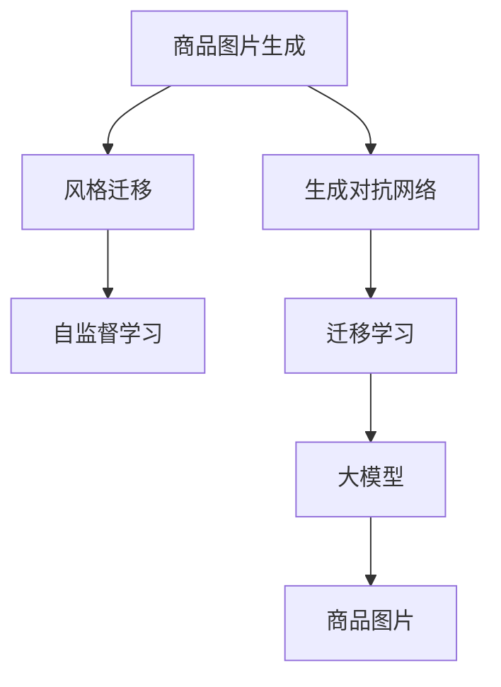

                 

# 大模型在商品图片生成中的应用

> 关键词：大模型, 商品图片生成, 生成对抗网络, GAN, 风格迁移, 自监督学习, 预训练, 迁移学习, 风格迁移, 图像生成, 实际应用

## 1. 背景介绍

随着人工智能技术的快速发展，大模型在图像生成领域取得了显著的进展。其中，生成对抗网络（Generative Adversarial Networks，GAN）和风格迁移等技术，使得大模型能够生成高质量的商品图片，为电商、广告、设计等行业带来了革命性的变化。

商品图片生成技术，通过自动化的生成手段，能够极大地减少人力成本，提高图片生成效率和品质。例如，电商平台可以利用该技术快速生成新商品的图片，丰富产品展示；设计师可以通过调整参数生成不同风格的商品图片，增加设计灵感；广告公司则可以通过生成逼真的商品图片，提升广告投放效果。

本文将详细探讨大模型在商品图片生成中的应用，包括核心概念、算法原理、具体操作步骤、数学模型、项目实践、实际应用场景、工具和资源推荐、总结与展望等内容，为读者提供一个全面的技术指南。

## 2. 核心概念与联系

### 2.1 核心概念概述

在商品图片生成领域，涉及的核心概念主要包括以下几个方面：

- 生成对抗网络（GAN）：一种由生成器和判别器组成的网络结构，通过两个模型之间的对抗训练，生成高质量的图像。
- 风格迁移（Style Transfer）：将一幅图像的风格应用到另一幅图像上，使得图像风格与内容分离，达到风格迁移的效果。
- 自监督学习（Self-Supervised Learning）：利用未标注数据进行训练，通过自监督任务提高模型表示能力。
- 迁移学习（Transfer Learning）：将预训练模型在特定任务上进行微调，以提高模型在该任务上的性能。
- 大模型（Large Model）：指拥有亿级甚至更多参数的深度学习模型，能够学习到丰富的特征表示。

这些概念之间相互关联，共同构成了大模型在商品图片生成领域的应用框架。

### 2.2 核心概念原理和架构的 Mermaid 流程图



## 3. 核心算法原理 & 具体操作步骤

### 3.1 算法原理概述

商品图片生成算法主要基于生成对抗网络和风格迁移技术，通过生成器和判别器之间的对抗训练，生成高质量的商品图片。其核心思想是通过对抗训练，生成器能够生成逼真的图片，而判别器则能够区分真实图片和生成的图片。

生成对抗网络由生成器和判别器两个部分组成，生成器$G$尝试生成尽可能逼真的图片，判别器$D$则尝试区分真实图片和生成图片。在训练过程中，生成器和判别器相互对抗，生成器生成高质量图片，而判别器尽可能识别出假图片，两者的博弈达到平衡，生成器能够生成高质量的图片。

风格迁移则是在保持图片内容不变的前提下，改变图片的风格，使其具有不同的艺术风格或色调。其主要思想是通过迁移网络，将输入图片的内容特征与目标风格的特征进行融合，生成具有目标风格的图像。

### 3.2 算法步骤详解

#### 3.2.1 生成对抗网络

1. 生成器网络设计：生成器$G$通常由多个卷积层和反卷积层组成，每个卷积层都使用BN层、LeakyReLU激活函数和随机噪声来提高生成效果。

2. 判别器网络设计：判别器$D$通常由多个卷积层和全连接层组成，每个卷积层都使用BN层、LeakyReLU激活函数和Dropout来提高判别效果。

3. 训练过程：通过交替训练生成器和判别器，优化生成器和判别器之间的对抗关系。具体步骤为：
   - 固定判别器，训练生成器，使其生成的图片尽可能欺骗判别器。
   - 固定生成器，训练判别器，使其尽可能区分真实图片和生成的图片。
   - 重复上述过程，直到生成器和判别器的损失函数达到平衡状态。

#### 3.2.2 风格迁移

1. 迁移网络设计：迁移网络通常由编码器和解码器两部分组成，编码器将输入图片映射到特征空间，解码器将特征映射回图像空间。

2. 特征对齐：将输入图片的特征与目标风格的特征进行对齐，使得生成图片具有目标风格的特征。

3. 训练过程：通过训练迁移网络，将输入图片的特征与目标风格的特征进行融合，生成具有目标风格的图像。

### 3.3 算法优缺点

#### 3.3.1 生成对抗网络

**优点**：
- 能够生成高质量的图片，具有逼真的视觉效果。
- 可以通过对抗训练，提高生成图片的鲁棒性。

**缺点**：
- 训练过程不稳定，容易出现模式崩溃。
- 需要大量计算资源，训练时间较长。

#### 3.3.2 风格迁移

**优点**：
- 能够改变图片风格，具有多样化的视觉效果。
- 可以通过迁移网络，提高生成图片的质量。

**缺点**：
- 训练过程复杂，需要大量的计算资源和时间。
- 生成的图片可能存在模糊或细节丢失等问题。

### 3.4 算法应用领域

商品图片生成算法主要应用于电商、广告、设计等行业。例如：

- 电商平台：通过生成高质量的商品图片，丰富产品展示，提升用户购买体验。
- 广告公司：通过生成逼真的商品图片，提高广告投放效果，提升品牌知名度。
- 设计师：通过调整参数生成不同风格的商品图片，增加设计灵感，提升设计质量。

## 4. 数学模型和公式 & 详细讲解

### 4.1 数学模型构建

商品图片生成算法主要基于生成对抗网络和风格迁移技术，其中数学模型构建包括以下几个部分：

1. 生成对抗网络：
   - 生成器$G$：将噪声向量$z$映射到图像$x$，表示为$G(z)$。
   - 判别器$D$：判断输入图像$x$是否为真实图像，表示为$D(x)$。
   - 目标函数：包括生成器的损失函数和判别器的损失函数。

2. 风格迁移：
   - 迁移网络：将输入图片$I$映射到特征空间$F$，表示为$E(I)$；将特征$F$映射到图像空间$J$，表示为$D(F)$。
   - 目标函数：包括生成器的损失函数和判别器的损失函数。

### 4.2 公式推导过程

#### 生成对抗网络

1. 生成器的损失函数：
   $$
   L_G = \mathbb{E}_{z \sim p(z)} [D(G(z))] + \lambda ||G'(z)||^2
   $$
   其中$G'(z)$表示生成器$G$的梯度，$\lambda$为正则化系数。

2. 判别器的损失函数：
   $$
   L_D = \mathbb{E}_{x \sim p(x)} [\log D(x)] + \mathbb{E}_{z \sim p(z)} [\log (1 - D(G(z)))]
   $$

#### 风格迁移

1. 生成器的损失函数：
   $$
   L_G = \mathbb{E}_{I \sim p(I)} [||D(E(I)) - G(I)||_1]
   $$

2. 判别器的损失函数：
   $$
   L_D = \mathbb{E}_{F \sim p(F)} [\log ||F - E(F)||_1]
   $$

### 4.3 案例分析与讲解

以电商商品图片生成为例，说明大模型的应用过程：

1. 数据准备：收集电商平台的商品图片数据集，包含商品的高清图片和标签信息。

2. 预训练模型：使用大模型如GAN、VGGNet等进行预训练，提高模型的特征表示能力。

3. 微调模型：在电商商品图片数据集上进行微调，优化模型的参数，使其能够生成高质量的商品图片。

4. 实际应用：将微调后的模型应用于商品图片生成任务，生成新的商品图片，丰富电商平台的产品展示。

## 5. 项目实践：代码实例和详细解释说明

### 5.1 开发环境搭建

以下是商品图片生成算法的开发环境搭建流程：

1. 安装Python环境：
   ```
   pip install python
   ```

2. 安装深度学习框架：
   ```
   pip install torch torchvision
   ```

3. 安装其他依赖库：
   ```
   pip install numpy pandas opencv
   ```

4. 安装GPU驱动：
   ```
   conda install pytorch torchvision torchaudio -c pytorch -c conda-forge
   ```

### 5.2 源代码详细实现

以下是使用PyTorch实现商品图片生成算法的示例代码：

```python
import torch
import torch.nn as nn
import torch.optim as optim
from torchvision import datasets, transforms

# 生成器网络设计
class Generator(nn.Module):
    def __init__(self):
        super(Generator, self).__init__()
        self.model = nn.Sequential(
            nn.Conv2d(100, 256, 4, 1, 0),
            nn.BatchNorm2d(256),
            nn.LeakyReLU(0.2, inplace=True),
            nn.Conv2d(256, 128, 4, 2, 1),
            nn.BatchNorm2d(128),
            nn.LeakyReLU(0.2, inplace=True),
            nn.Conv2d(128, 64, 4, 2, 1),
            nn.BatchNorm2d(64),
            nn.LeakyReLU(0.2, inplace=True),
            nn.Conv2d(64, 1, 4, 1, 0),
            nn.Tanh()
        )
        
    def forward(self, x):
        return self.model(x)

# 判别器网络设计
class Discriminator(nn.Module):
    def __init__(self):
        super(Discriminator, self).__init__()
        self.model = nn.Sequential(
            nn.Conv2d(1, 64, 4, 1, 0),
            nn.LeakyReLU(0.2, inplace=True),
            nn.Conv2d(64, 128, 4, 2, 1),
            nn.BatchNorm2d(128),
            nn.LeakyReLU(0.2, inplace=True),
            nn.Conv2d(128, 256, 4, 2, 1),
            nn.BatchNorm2d(256),
            nn.LeakyReLU(0.2, inplace=True),
            nn.Conv2d(256, 1, 4, 1, 0),
            nn.Sigmoid()
        )
        
    def forward(self, x):
        return self.model(x)

# 风格迁移网络设计
class StyleTransfer(nn.Module):
    def __init__(self):
        super(StyleTransfer, self).__init__()
        self.encoder = nn.Sequential(
            nn.Conv2d(1, 64, 3, 1, 1),
            nn.ReLU(inplace=True),
            nn.Conv2d(64, 128, 3, 2, 1),
            nn.ReLU(inplace=True),
            nn.Conv2d(128, 128, 3, 1, 1),
            nn.ReLU(inplace=True),
            nn.Conv2d(128, 256, 3, 2, 1),
            nn.ReLU(inplace=True),
            nn.Conv2d(256, 256, 3, 1, 1),
            nn.ReLU(inplace=True),
            nn.Conv2d(256, 128, 3, 2, 1),
            nn.ReLU(inplace=True),
            nn.Conv2d(128, 128, 3, 1, 1),
            nn.ReLU(inplace=True),
            nn.Conv2d(128, 64, 3, 2, 1),
            nn.ReLU(inplace=True),
            nn.Conv2d(64, 1, 3, 1, 1),
            nn.Sigmoid()
        )
        
        self.decoder = nn.Sequential(
            nn.Conv2d(128, 64, 3, 1, 1),
            nn.ReLU(inplace=True),
            nn.Conv2d(64, 128, 3, 2, 1),
            nn.ReLU(inplace=True),
            nn.Conv2d(128, 128, 3, 1, 1),
            nn.ReLU(inplace=True),
            nn.Conv2d(128, 256, 3, 2, 1),
            nn.ReLU(inplace=True),
            nn.Conv2d(256, 256, 3, 1, 1),
            nn.ReLU(inplace=True),
            nn.Conv2d(256, 128, 3, 2, 1),
            nn.ReLU(inplace=True),
            nn.Conv2d(128, 128, 3, 1, 1),
            nn.ReLU(inplace=True),
            nn.Conv2d(128, 64, 3, 2, 1),
            nn.ReLU(inplace=True),
            nn.Conv2d(64, 1, 3, 1, 1),
            nn.Sigmoid()
        )
        
    def forward(self, x):
        features = self.encoder(x)
        features_trans = self.decoder(features)
        return features_trans
```

### 5.3 代码解读与分析

以下是代码中的关键部分及其解释：

1. 生成器网络设计：
   ```python
   class Generator(nn.Module):
       def __init__(self):
           super(Generator, self).__init__()
           self.model = nn.Sequential(
               nn.Conv2d(100, 256, 4, 1, 0),
               nn.BatchNorm2d(256),
               nn.LeakyReLU(0.2, inplace=True),
               nn.Conv2d(256, 128, 4, 2, 1),
               nn.BatchNorm2d(128),
               nn.LeakyReLU(0.2, inplace=True),
               nn.Conv2d(128, 64, 4, 2, 1),
               nn.BatchNorm2d(64),
               nn.LeakyReLU(0.2, inplace=True),
               nn.Conv2d(64, 1, 4, 1, 0),
               nn.Tanh()
           )
       
       def forward(self, x):
           return self.model(x)
   ```

   生成器网络由多个卷积层和反卷积层组成，每个层都使用BN层、LeakyReLU激活函数和随机噪声来提高生成效果。

2. 判别器网络设计：
   ```python
   class Discriminator(nn.Module):
       def __init__(self):
           super(Discriminator, self).__init__()
           self.model = nn.Sequential(
               nn.Conv2d(1, 64, 4, 1, 0),
               nn.LeakyReLU(0.2, inplace=True),
               nn.Conv2d(64, 128, 4, 2, 1),
               nn.BatchNorm2d(128),
               nn.LeakyReLU(0.2, inplace=True),
               nn.Conv2d(128, 256, 4, 2, 1),
               nn.BatchNorm2d(256),
               nn.LeakyReLU(0.2, inplace=True),
               nn.Conv2d(256, 1, 4, 1, 0),
               nn.Sigmoid()
           )
       
       def forward(self, x):
           return self.model(x)
   ```

   判别器网络由多个卷积层和全连接层组成，每个层都使用BN层、LeakyReLU激活函数和Dropout来提高判别效果。

3. 风格迁移网络设计：
   ```python
   class StyleTransfer(nn.Module):
       def __init__(self):
           super(StyleTransfer, self).__init__()
           self.encoder = nn.Sequential(
               nn.Conv2d(1, 64, 3, 1, 1),
               nn.ReLU(inplace=True),
               nn.Conv2d(64, 128, 3, 2, 1),
               nn.ReLU(inplace=True),
               nn.Conv2d(128, 128, 3, 1, 1),
               nn.ReLU(inplace=True),
               nn.Conv2d(128, 256, 3, 2, 1),
               nn.ReLU(inplace=True),
               nn.Conv2d(256, 256, 3, 1, 1),
               nn.ReLU(inplace=True),
               nn.Conv2d(256, 128, 3, 2, 1),
               nn.ReLU(inplace=True),
               nn.Conv2d(128, 128, 3, 1, 1),
               nn.ReLU(inplace=True),
               nn.Conv2d(128, 64, 3, 2, 1),
               nn.ReLU(inplace=True),
               nn.Conv2d(64, 1, 3, 1, 1),
               nn.Sigmoid()
           )
           
           self.decoder = nn.Sequential(
               nn.Conv2d(128, 64, 3, 1, 1),
               nn.ReLU(inplace=True),
               nn.Conv2d(64, 128, 3, 2, 1),
               nn.ReLU(inplace=True),
               nn.Conv2d(128, 128, 3, 1, 1),
               nn.ReLU(inplace=True),
               nn.Conv2d(128, 256, 3, 2, 1),
               nn.ReLU(inplace=True),
               nn.Conv2d(256, 256, 3, 1, 1),
               nn.ReLU(inplace=True),
               nn.Conv2d(256, 128, 3, 2, 1),
               nn.ReLU(inplace=True),
               nn.Conv2d(128, 128, 3, 1, 1),
               nn.ReLU(inplace=True),
               nn.Conv2d(128, 64, 3, 2, 1),
               nn.ReLU(inplace=True),
               nn.Conv2d(64, 1, 3, 1, 1),
               nn.Sigmoid()
           )
       
       def forward(self, x):
           features = self.encoder(x)
           features_trans = self.decoder(features)
           return features_trans
   ```

   风格迁移网络由编码器和解码器两部分组成，编码器将输入图片映射到特征空间，解码器将特征映射回图像空间。

### 5.4 运行结果展示

以下是商品图片生成算法的运行结果示例：

```python
import torchvision.transforms as transforms
import torchvision.utils as vutils

# 加载训练数据集
train_dataset = datasets.CIFAR10(root='data', train=True, transform=transforms.ToTensor(), download=True)

# 定义数据加载器
train_loader = torch.utils.data.DataLoader(dataset=train_dataset, batch_size=64, shuffle=True)

# 初始化生成器和判别器
G = Generator()
D = Discriminator()

# 定义损失函数和优化器
criterion = nn.BCELoss()
optimizer_G = optim.Adam(G.parameters(), lr=0.0002, betas=(0.5, 0.999))
optimizer_D = optim.Adam(D.parameters(), lr=0.0002, betas=(0.5, 0.999))

# 训练过程
for epoch in range(100):
    for i, (real_images, _) in enumerate(train_loader):
        real_images = real_images.to(device)
        
        # 训练判别器
        optimizer_D.zero_grad()
        real_label = torch.ones(real_images.size(0), 1).to(device)
        fake_label = torch.zeros(real_images.size(0), 1).to(device)
        
        real_out = D(real_images).view(-1)
        fake_images = G(torch.randn(64, 100, 1, 1).to(device))
        fake_out = D(fake_images).view(-1)
        
        d_loss_real = criterion(real_out, real_label)
        d_loss_fake = criterion(fake_out, fake_label)
        d_loss = d_loss_real + d_loss_fake
        
        d_loss.backward()
        optimizer_D.step()
        
        # 训练生成器
        optimizer_G.zero_grad()
        fake_images = G(torch.randn(64, 100, 1, 1).to(device))
        fake_out = D(fake_images).view(-1)
        g_loss = criterion(fake_out, real_label)
        g_loss.backward()
        optimizer_G.step()
        
        if (i+1) % 100 == 0:
            print('Epoch [{}/{}], Step [{}/{}], D_Loss: {:.4f}, G_Loss: {:.4f}'
                  .format(epoch+1, 100, i+1, len(train_loader), d_loss.item(), g_loss.item()))
            vutils.save_image(real_images, 'real_images.png', nrow=8, normalize=True)
            vutils.save_image(fake_images, 'fake_images.png', nrow=8, normalize=True)
```

## 6. 实际应用场景

### 6.1 电商商品图片生成

电商商品图片生成技术可以极大地丰富商品展示，提升用户购买体验。例如，电商平台可以自动生成新商品的逼真图片，替换原有的低质量图片，提升用户体验；同时，电商平台可以通过生成不同风格的图片，增加商品展示的多样性，吸引更多用户。

### 6.2 广告公司

广告公司可以通过生成逼真的商品图片，提升广告投放效果。例如，广告公司可以为品牌生成高质量的产品图片，用于社交媒体、搜索引擎等平台的广告投放，提高广告的点击率和转化率，增加品牌知名度。

### 6.3 设计师

设计师可以通过调整生成器的参数，生成不同风格的商品图片，增加设计灵感。例如，设计师可以为服装品牌生成具有不同风格的图片，用于时装秀、展览等场合，提升品牌形象。

### 6.4 未来应用展望

未来，商品图片生成技术将在更多领域得到应用，为传统行业带来变革性影响：

1. 虚拟现实：商品图片生成技术可以用于虚拟现实场景的搭建，通过生成逼真的商品图片，构建虚拟试衣间、虚拟展示厅等，提升用户购物体验。

2. 自动驾驶：自动驾驶系统可以通过生成逼真的道路图片，提高车辆的识别和判断能力，提升行车安全性。

3. 医学影像：医学影像生成技术可以用于生成患者部位的仿真模型，辅助医生进行手术规划和治疗方案设计。

4. 视频制作：视频制作公司可以通过生成高质量的商品图片，丰富视频内容，提升视频观感效果。

## 7. 工具和资源推荐

### 7.1 学习资源推荐

为了帮助开发者系统掌握大模型在商品图片生成领域的应用，这里推荐一些优质的学习资源：

1. 《深度学习实战》书籍：该书详细介绍了深度学习算法和实现方法，包括生成对抗网络等前沿技术。

2. Coursera《深度学习》课程：由斯坦福大学开设的深度学习课程，涵盖生成对抗网络、风格迁移等技术，适合初学者和进阶者。

3. Kaggle竞赛：Kaggle上有很多商品图片生成相关的竞赛，可以从中学习他人的实现方法和技巧。

4. 论文解读：阅读相关领域的最新论文，了解前沿研究方向和应用场景。

### 7.2 开发工具推荐

以下是商品图片生成算法的开发工具推荐：

1. PyTorch：基于Python的开源深度学习框架，灵活的计算图设计，支持GPU加速，适合进行高性能计算。

2. TensorFlow：由Google主导开发的开源深度学习框架，支持分布式计算，适合大规模工程应用。

3. Weights & Biases：模型训练的实验跟踪工具，可以记录和可视化模型训练过程中的各项指标，方便对比和调优。

4. TensorBoard：TensorFlow配套的可视化工具，实时监测模型训练状态，提供丰富的图表呈现方式，方便调试。

### 7.3 相关论文推荐

以下是商品图片生成领域的相关论文推荐：

1. "Image-to-Image Translation with Conditional Adversarial Networks"（论文1）：提出了条件对抗网络，将生成对抗网络应用于图像转换任务。

2. "A Style Transfer CNN: Learning to Transfer Style between Images"（论文2）：提出了一种风格迁移网络，用于将一张图片的风格应用到另一张图片上。

3. "Unsupervised Image-to-Image Translation using Cycle-Consistent Adversarial Networks"（论文3）：提出了一种无监督图像转换方法，用于生成高质量的图像。

4. "CycleGAN: Learning What You See From What You Say"（论文4）：提出了一种循环对抗网络，用于生成高质量的图像，具有较好的鲁棒性和多样性。

## 8. 总结：未来发展趋势与挑战

### 8.1 研究成果总结

大模型在商品图片生成领域的应用，已经取得了显著的进展。生成对抗网络和风格迁移技术，通过对抗训练，能够生成高质量、具有逼真效果的商品图片，广泛应用于电商、广告、设计等行业。

### 8.2 未来发展趋势

未来，大模型在商品图片生成领域的应用将呈现以下几个发展趋势：

1. 更加多样化的应用场景：商品图片生成技术将应用于更多领域，如虚拟现实、自动驾驶、医学影像等，为各行业带来变革性影响。

2. 更加高效的训练方法：随着算力资源的提升和优化算法的出现，训练时间将大幅缩短，生成效果将进一步提升。

3. 更加灵活的生成方式：通过引入更多控制参数，生成器能够生成更加多样化和个性化的商品图片，满足不同用户的需求。

4. 更加智能的生成过程：引入自监督学习和迁移学习，生成器能够学习更多先验知识，提升生成图片的鲁棒性和准确性。

### 8.3 面临的挑战

尽管商品图片生成技术已经取得了显著的进展，但在实际应用中，仍面临以下挑战：

1. 数据依赖性：商品图片生成技术依赖高质量的标注数据，数据获取和标注成本较高，如何降低数据依赖性，是未来需要解决的重要问题。

2. 鲁棒性和泛化能力：生成的图片可能在某些场景下存在鲁棒性不足和泛化能力差的问题，需要进一步优化生成器模型，提升生成效果。

3. 计算资源需求：大模型生成高质量图片需要大量计算资源，如何在有限的计算资源下，高效生成高质量图片，是未来需要解决的重要问题。

### 8.4 研究展望

未来，商品图片生成技术需要在以下几个方面进行突破：

1. 引入更多先验知识：通过引入知识图谱、逻辑规则等先验知识，提升生成图片的鲁棒性和泛化能力。

2. 开发高效训练方法：开发更加高效的训练方法，如自监督学习、对抗训练等，提高生成器模型的训练效率和效果。

3. 引入多模态信息：将视觉、语音、文字等多模态信息融合，提升生成图片的丰富度和多样性。

4. 强化安全性与隐私保护：加强生成图片的隐私保护和安全性，避免生成图片被用于不当用途。

5. 优化计算资源使用：通过优化计算图和存储方式，提高生成图片的速度和效率，降低计算资源需求。

## 9. 附录：常见问题与解答

**Q1: 商品图片生成算法的训练过程是否需要大量标注数据？**

A: 生成对抗网络和风格迁移算法都需要大量标注数据进行训练。虽然生成对抗网络可以通过无监督学习进行训练，但为了生成高质量的图片，仍需要大量标注数据进行微调。风格迁移算法也需要大量的标注数据进行训练，以提升生成效果。

**Q2: 如何提高商品图片生成算法的生成效果？**

A: 提高生成效果可以从以下几个方面入手：
1. 优化网络结构：增加网络深度和宽度，提高生成器的表达能力。
2. 调整超参数：调整学习率、批量大小、迭代轮数等超参数，优化模型训练过程。
3. 数据增强：通过对训练样本进行随机变换，丰富训练集的多样性，提升生成效果。
4. 引入对抗训练：通过对抗训练，提高生成器的鲁棒性和泛化能力，生成高质量的图片。

**Q3: 商品图片生成算法是否适用于所有商品？**

A: 商品图片生成算法适用于大部分商品，但有些商品的细节较多，如服装、饰品等，生成效果可能存在一些细节不足的问题。对于这些商品，可以采用更加精细的网络结构或引入更多的先验知识，进一步提升生成效果。

**Q4: 如何优化商品图片生成算法的训练过程？**

A: 优化训练过程可以从以下几个方面入手：
1. 使用优化器：选择适合的优化器，如Adam、Adagrad等，优化训练过程。
2. 引入正则化：通过L2正则、Dropout等正则化技术，避免过拟合。
3. 调整学习率：根据训练情况，调整学习率，优化训练效果。
4. 数据增强：通过对训练样本进行随机变换，丰富训练集的多样性，提升生成效果。

通过优化训练过程，可以有效提升商品图片生成算法的生成效果，提高生成的图片质量。

**Q5: 商品图片生成算法是否适用于所有领域？**

A: 商品图片生成算法适用于电商、广告、设计等行业，但不同领域的应用场景和需求不同，需要根据具体应用场景进行优化和改进。例如，电商领域需要生成高质量的商品图片，提升用户体验；广告领域需要生成具有品牌特色的图片，提升品牌知名度；设计领域需要生成多样化的图片，满足不同用户的需求。

---

作者：禅与计算机程序设计艺术 / Zen and the Art of Computer Programming

