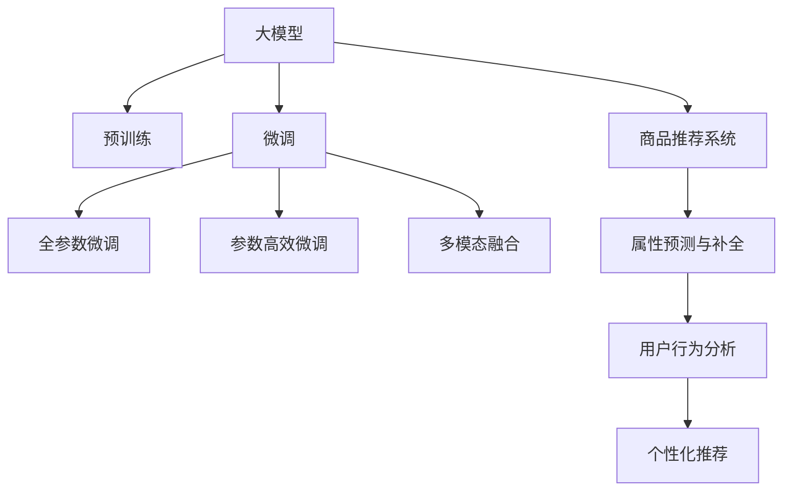

                 

# 大模型在商品属性预测与补全中的应用

> 关键词：大模型,商品属性预测,补全,商品推荐系统,深度学习,Transformer,自然语言处理(NLP),BERT,特征工程

## 1. 背景介绍

### 1.1 问题由来
在电商行业中，商品推荐系统一直是提高用户购物体验和转化率的关键技术。然而，商品推荐系统的核心依赖于商品属性预测和补全。传统上，商品属性预测和补全大多基于简单的规则或统计模型，难以应对商品属性多样性和复杂性带来的挑战。近年来，随着深度学习技术的发展，大模型在电商领域的成功应用为商品属性预测和补全提供了新的解决方案。

大模型通过在大规模无标签或弱标签数据上进行预训练，学习到了丰富的语义和特征表示。当应用于电商领域时，大模型能够自动挖掘商品描述和图片中的关键信息，预测和补全缺失的属性，从而大幅提升商品推荐的准确性和多样性。目前，大模型已经在商品推荐、智能客服、个性化广告等多个电商应用场景中展现了强大的能力和潜力。

### 1.2 问题核心关键点
大模型在电商商品属性预测与补全中的应用，关键在于如何将大模型的预训练能力转化为有效的属性预测与补全模型。具体来说，需要解决以下几个核心问题：
1. **预训练与微调的结合**：如何利用大模型在通用领域的预训练知识，结合电商领域的特点，进行有针对性的微调，得到高精度的属性预测与补全模型。
2. **多模态数据的融合**：如何将商品图片、描述等多模态数据与文本属性信息融合，得到更全面的商品表示。
3. **属性预测与补全的算法设计**：如何设计高效的预测与补全算法，提升模型的性能和鲁棒性。
4. **模型部署与优化**：如何将训练好的大模型部署到生产环境中，进行实时预测和补全，同时优化模型的推理速度和资源占用。

## 2. 核心概念与联系

### 2.1 核心概念概述

为更好地理解大模型在商品属性预测与补全中的应用，本节将介绍几个密切相关的核心概念：

- 大模型(Large Model)：指预训练模型，如BERT、GPT等，在大规模无标签或弱标签数据上进行预训练，学习到通用的语言和特征表示。
- 预训练(Pre-training)：指在大规模无标签或弱标签数据上，通过自监督学习任务训练通用语言或特征表示的过程。
- 微调(Fine-tuning)：指在预训练模型的基础上，使用任务相关的标注数据，通过有监督学习优化模型在该任务上的性能。
- 多模态数据(Multi-modal Data)：指同时包含文本、图片、视频等多种数据类型的复杂数据集，如商品描述、图片、用户行为记录等。
- 商品推荐系统(Recommendation System)：指通过分析用户行为和商品特征，推荐用户可能感兴趣的商品的系统。
- Transformer：一种常用的深度学习模型结构，能够高效处理序列数据，广泛应用在大模型的预训练和微调中。
- BERT：一种基于Transformer架构的预训练语言模型，能够学习到丰富的语言表示，广泛应用于文本分类、实体识别等任务。

这些核心概念之间的逻辑关系可以通过以下Mermaid流程图来展示：



这个流程图展示了大模型在商品推荐系统中的应用框架：

1. 大模型通过预训练获得通用表示。
2. 微调使模型适应电商领域的具体任务，如属性预测与补全。
3. 多模态数据融合提高模型的表示能力。
4. 将微调后的模型应用到商品推荐系统中，提升推荐效果。

## 3. 核心算法原理 & 具体操作步骤
### 3.1 算法原理概述

大模型在商品属性预测与补全中的应用，本质上是一个多模态学习过程。其核心思想是：将大模型作为特征提取器，通过有监督地训练来优化模型在特定任务上的性能，即商品属性预测与补全。

具体来说，假设预训练模型为 $M_{\theta}$，其中 $\theta$ 为预训练得到的模型参数。给定商品的属性标注数据集 $D=\{(x_i, y_i)\}_{i=1}^N$，其中 $x_i$ 为商品图片、描述等，$y_i$ 为商品的属性标签，如颜色、大小等。微调的目标是找到新的模型参数 $\hat{\theta}$，使得：

$$
\hat{\theta}=\mathop{\arg\min}_{\theta} \mathcal{L}(M_{\theta},D)
$$

其中 $\mathcal{L}$ 为针对任务设计的损失函数，用于衡量模型预测输出与真实标签之间的差异。常见的损失函数包括交叉熵损失、均方误差损失等。

通过梯度下降等优化算法，微调过程不断更新模型参数 $\theta$，最小化损失函数 $\mathcal{L}$，使得模型输出逼近真实标签。由于 $\theta$ 已经通过预训练获得了较好的初始化，因此即便在商品属性预测与补全这样的少样本情况下，也能较快收敛到理想的模型参数 $\hat{\theta}$。

### 3.2 算法步骤详解

基于大模型在商品属性预测与补全中的应用，一般包括以下几个关键步骤：

**Step 1: 准备预训练模型和数据集**
- 选择合适的预训练模型 $M_{\theta}$ 作为初始化参数，如 BERT、GPT 等。
- 准备商品属性标注数据集 $D$，划分为训练集、验证集和测试集。一般要求标注数据与预训练数据的分布不要差异过大。

**Step 2: 添加任务适配层**
- 根据任务类型，在预训练模型顶层设计合适的输出层和损失函数。
- 对于分类任务，通常在顶层添加线性分类器和交叉熵损失函数。
- 对于生成任务，通常使用语言模型的解码器输出概率分布，并以负对数似然为损失函数。

**Step 3: 设置微调超参数**
- 选择合适的优化算法及其参数，如 AdamW、SGD 等，设置学习率、批大小、迭代轮数等。
- 设置正则化技术及强度，包括权重衰减、Dropout、Early Stopping等。
- 确定冻结预训练参数的策略，如仅微调顶层，或全部参数都参与微调。

**Step 4: 执行梯度训练**
- 将训练集数据分批次输入模型，前向传播计算损失函数。
- 反向传播计算参数梯度，根据设定的优化算法和学习率更新模型参数。
- 周期性在验证集上评估模型性能，根据性能指标决定是否触发 Early Stopping。
- 重复上述步骤直到满足预设的迭代轮数或 Early Stopping 条件。

**Step 5: 测试和部署**
- 在测试集上评估微调后模型 $M_{\hat{\theta}}$ 的性能，对比微调前后的精度提升。
- 使用微调后的模型对新商品进行属性预测与补全，集成到实际的应用系统中。
- 持续收集新的数据，定期重新微调模型，以适应数据分布的变化。

以上是基于大模型在商品属性预测与补全中的应用的一般流程。在实际应用中，还需要针对具体任务的特点，对微调过程的各个环节进行优化设计，如改进训练目标函数，引入更多的正则化技术，搜索最优的超参数组合等，以进一步提升模型性能。

### 3.3 算法优缺点

基于大模型在商品属性预测与补全中的应用，具有以下优点：
1. 精度高：大模型的预训练能力使其能够学习到丰富的特征表示，从而提升属性预测与补全的准确性。
2. 泛化能力强：大模型在通用领域的预训练知识，能够迁移到商品属性预测与补全任务中，提升模型的泛化能力。
3. 可解释性好：大模型输出的预测结果和推理过程具有较高的可解释性，有助于模型调优和问题诊断。
4. 实时性好：大模型在推理阶段具有较高的计算效率，能够实时进行属性预测与补全。

同时，该方法也存在一定的局限性：
1. 对标注数据依赖度高：商品属性预测与补全任务通常需要高质量的标注数据，标注成本高，标注质量难以保证。
2. 预训练数据相关性不足：如果预训练数据与商品领域差异较大，大模型的预训练知识可能难以直接迁移到商品属性预测与补全任务中。
3. 计算资源消耗大：大模型的推理和训练需要大量的计算资源，增加了系统的部署成本。

尽管存在这些局限性，但就目前而言，基于大模型的方法仍然是商品属性预测与补全的主流范式。未来相关研究的重点在于如何进一步降低微调对标注数据的依赖，提高模型的少样本学习和跨领域迁移能力，同时兼顾可解释性和资源效率。

### 3.4 算法应用领域

大模型在商品属性预测与补全中的应用，已经在电商行业得到了广泛的应用，覆盖了商品推荐、个性化广告、智能客服等多个领域。具体来说，主要应用于以下场景：

- **商品推荐系统**：根据用户历史行为和商品属性，预测用户可能感兴趣的商品，并根据预测结果进行推荐。
- **个性化广告**：通过分析用户属性和行为，预测用户可能感兴趣的商品广告，并投放定向广告。
- **智能客服**：利用大模型回答用户关于商品属性的问题，提升客户服务质量。
- **属性补全**：自动生成商品的缺失属性，如大小、颜色、材质等，提升商品信息准确性。

除了上述这些经典应用外，大模型在商品属性预测与补全中还有更多创新性的应用场景，如基于图片的多模态属性预测，基于自然语言查询的商品信息补全等，为大模型在电商领域的应用带来了新的可能性。

## 4. 数学模型和公式 & 详细讲解  
### 4.1 数学模型构建

本节将使用数学语言对基于大模型在商品属性预测与补全中的应用进行更加严格的刻画。

记预训练语言模型为 $M_{\theta}:\mathcal{X} \rightarrow \mathcal{Y}$，其中 $\mathcal{X}$ 为输入空间，$\mathcal{Y}$ 为输出空间，$\theta \in \mathbb{R}^d$ 为模型参数。假设商品属性预测与补全任务为二分类任务，即给定商品属性 $y_i \in \{0, 1\}$，预测模型输出 $\hat{y}_i=M_{\theta}(x_i) \in [0,1]$。

定义模型 $M_{\theta}$ 在商品属性数据集 $D=\{(x_i, y_i)\}_{i=1}^N$ 上的损失函数为 $\ell(M_{\theta}(x_i),y_i)$，则在数据集 $D$ 上的经验风险为：

$$
\mathcal{L}(\theta) = \frac{1}{N} \sum_{i=1}^N \ell(M_{\theta}(x_i),y_i)
$$

其中 $\ell$ 为交叉熵损失函数，即：

$$
\ell(M_{\theta}(x_i),y_i) = -y_i\log M_{\theta}(x_i) - (1-y_i)\log (1-M_{\theta}(x_i))
$$

微调的优化目标是最小化经验风险，即找到最优参数：

$$
\theta^* = \mathop{\arg\min}_{\theta} \mathcal{L}(\theta)
$$

在实践中，我们通常使用基于梯度的优化算法（如SGD、Adam等）来近似求解上述最优化问题。设 $\eta$ 为学习率，$\lambda$ 为正则化系数，则参数的更新公式为：

$$
\theta \leftarrow \theta - \eta \nabla_{\theta}\mathcal{L}(\theta) - \eta\lambda\theta
$$

其中 $\nabla_{\theta}\mathcal{L}(\theta)$ 为损失函数对参数 $\theta$ 的梯度，可通过反向传播算法高效计算。

### 4.2 公式推导过程

以下我们以商品属性预测任务为例，推导交叉熵损失函数及其梯度的计算公式。

假设模型 $M_{\theta}$ 在输入 $x_i$ 上的输出为 $\hat{y}_i=M_{\theta}(x_i) \in [0,1]$，表示商品属性为1的概率。真实标签 $y_i \in \{0, 1\}$。则二分类交叉熵损失函数定义为：

$$
\ell(M_{\theta}(x_i),y_i) = -[y_i\log \hat{y}_i + (1-y_i)\log (1-\hat{y}_i)]
$$

将其代入经验风险公式，得：

$$
\mathcal{L}(\theta) = -\frac{1}{N}\sum_{i=1}^N [y_i\log M_{\theta}(x_i)+(1-y_i)\log(1-M_{\theta}(x_i))]
$$

根据链式法则，损失函数对参数 $\theta_k$ 的梯度为：

$$
\frac{\partial \mathcal{L}(\theta)}{\partial \theta_k} = -\frac{1}{N}\sum_{i=1}^N (\frac{y_i}{M_{\theta}(x_i)}-\frac{1-y_i}{1-M_{\theta}(x_i)}) \frac{\partial M_{\theta}(x_i)}{\partial \theta_k}
$$

其中 $\frac{\partial M_{\theta}(x_i)}{\partial \theta_k}$ 可进一步递归展开，利用自动微分技术完成计算。

在得到损失函数的梯度后，即可带入参数更新公式，完成模型的迭代优化。重复上述过程直至收敛，最终得到适应商品属性预测任务的最优模型参数 $\theta^*$。

## 5. 项目实践：代码实例和详细解释说明
### 5.1 开发环境搭建

在进行商品属性预测与补全任务开发前，我们需要准备好开发环境。以下是使用Python进行PyTorch开发的环境配置流程：

1. 安装Anaconda：从官网下载并安装Anaconda，用于创建独立的Python环境。

2. 创建并激活虚拟环境：
```bash
conda create -n pytorch-env python=3.8 
conda activate pytorch-env
```

3. 安装PyTorch：根据CUDA版本，从官网获取对应的安装命令。例如：
```bash
conda install pytorch torchvision torchaudio cudatoolkit=11.1 -c pytorch -c conda-forge
```

4. 安装Transformers库：
```bash
pip install transformers
```

5. 安装各类工具包：
```bash
pip install numpy pandas scikit-learn matplotlib tqdm jupyter notebook ipython
```

完成上述步骤后，即可在`pytorch-env`环境中开始商品属性预测与补全任务的开发。

### 5.2 源代码详细实现

下面我们以商品属性预测任务为例，给出使用Transformers库对BERT模型进行商品属性预测的PyTorch代码实现。

首先，定义商品属性预测任务的数据处理函数：

```python
from transformers import BertTokenizer
from torch.utils.data import Dataset
import torch

class商品的Dataset(Dataset):
    def __init__(self, texts, tags, tokenizer, max_len=128):
        self.texts = texts
        self.tags = tags
        self.tokenizer = tokenizer
        self.max_len = max_len
        
    def __len__(self):
        return len(self.texts)
    
    def __getitem__(self, item):
        text = self.texts[item]
        tags = self.tags[item]
        
        encoding = self.tokenizer(text, return_tensors='pt', max_length=self.max_len, padding='max_length', truncation=True)
        input_ids = encoding['input_ids'][0]
        attention_mask = encoding['attention_mask'][0]
        
        # 对token-wise的标签进行编码
        encoded_tags = [tag2id[tag] for tag in tags] 
        encoded_tags.extend([tag2id['O']] * (self.max_len - len(encoded_tags)))
        labels = torch.tensor(encoded_tags, dtype=torch.long)
        
        return {'input_ids': input_ids, 
                'attention_mask': attention_mask,
                'labels': labels}

# 标签与id的映射
tag2id = {'O': 0, '红色': 1, '蓝色': 2, '黑色': 3, '白色': 4, '大': 5, '小': 6}
id2tag = {v: k for k, v in tag2id.items()}

# 创建dataset
tokenizer = BertTokenizer.from_pretrained('bert-base-cased')

train_dataset =商品的Dataset(train_texts, train_tags, tokenizer)
dev_dataset =商品的Dataset(dev_texts, dev_tags, tokenizer)
test_dataset =商品的Dataset(test_texts, test_tags, tokenizer)
```

然后，定义模型和优化器：

```python
from transformers import BertForTokenClassification, AdamW

model = BertForTokenClassification.from_pretrained('bert-base-cased', num_labels=len(tag2id))

optimizer = AdamW(model.parameters(), lr=2e-5)
```

接着，定义训练和评估函数：

```python
from torch.utils.data import DataLoader
from tqdm import tqdm
from sklearn.metrics import classification_report

device = torch.device('cuda') if torch.cuda.is_available() else torch.device('cpu')
model.to(device)

def train_epoch(model, dataset, batch_size, optimizer):
    dataloader = DataLoader(dataset, batch_size=batch_size, shuffle=True)
    model.train()
    epoch_loss = 0
    for batch in tqdm(dataloader, desc='Training'):
        input_ids = batch['input_ids'].to(device)
        attention_mask = batch['attention_mask'].to(device)
        labels = batch['labels'].to(device)
        model.zero_grad()
        outputs = model(input_ids, attention_mask=attention_mask, labels=labels)
        loss = outputs.loss
        epoch_loss += loss.item()
        loss.backward()
        optimizer.step()
    return epoch_loss / len(dataloader)

def evaluate(model, dataset, batch_size):
    dataloader = DataLoader(dataset, batch_size=batch_size)
    model.eval()
    preds, labels = [], []
    with torch.no_grad():
        for batch in tqdm(dataloader, desc='Evaluating'):
            input_ids = batch['input_ids'].to(device)
            attention_mask = batch['attention_mask'].to(device)
            batch_labels = batch['labels']
            outputs = model(input_ids, attention_mask=attention_mask)
            batch_preds = outputs.logits.argmax(dim=2).to('cpu').tolist()
            batch_labels = batch_labels.to('cpu').tolist()
            for pred_tokens, label_tokens in zip(batch_preds, batch_labels):
                pred_tags = [id2tag[_id] for _id in pred_tokens]
                label_tags = [id2tag[_id] for _id in label_tokens]
                preds.append(pred_tags[:len(label_tags)])
                labels.append(label_tags)
                
    print(classification_report(labels, preds))
```

最后，启动训练流程并在测试集上评估：

```python
epochs = 5
batch_size = 16

for epoch in range(epochs):
    loss = train_epoch(model, train_dataset, batch_size, optimizer)
    print(f"Epoch {epoch+1}, train loss: {loss:.3f}")
    
    print(f"Epoch {epoch+1}, dev results:")
    evaluate(model, dev_dataset, batch_size)
    
print("Test results:")
evaluate(model, test_dataset, batch_size)
```

以上就是使用PyTorch对BERT进行商品属性预测任务的完整代码实现。可以看到，得益于Transformers库的强大封装，我们可以用相对简洁的代码完成BERT模型的加载和微调。

### 5.3 代码解读与分析

让我们再详细解读一下关键代码的实现细节：

**商品的Dataset类**：
- `__init__`方法：初始化文本、标签、分词器等关键组件。
- `__len__`方法：返回数据集的样本数量。
- `__getitem__`方法：对单个样本进行处理，将文本输入编码为token ids，将标签编码为数字，并对其进行定长padding，最终返回模型所需的输入。

**tag2id和id2tag字典**：
- 定义了标签与数字id之间的映射关系，用于将token-wise的预测结果解码回真实的标签。

**训练和评估函数**：
- 使用PyTorch的DataLoader对数据集进行批次化加载，供模型训练和推理使用。
- 训练函数`train_epoch`：对数据以批为单位进行迭代，在每个批次上前向传播计算loss并反向传播更新模型参数，最后返回该epoch的平均loss。
- 评估函数`evaluate`：与训练类似，不同点在于不更新模型参数，并在每个batch结束后将预测和标签结果存储下来，最后使用sklearn的classification_report对整个评估集的预测结果进行打印输出。

**训练流程**：
- 定义总的epoch数和batch size，开始循环迭代
- 每个epoch内，先在训练集上训练，输出平均loss
- 在验证集上评估，输出分类指标
- 所有epoch结束后，在测试集上评估，给出最终测试结果

可以看到，PyTorch配合Transformers库使得BERT微调的代码实现变得简洁高效。开发者可以将更多精力放在数据处理、模型改进等高层逻辑上，而不必过多关注底层的实现细节。

当然，工业级的系统实现还需考虑更多因素，如模型的保存和部署、超参数的自动搜索、更灵活的任务适配层等。但核心的微调范式基本与此类似。

## 6. 实际应用场景
### 6.1 智能客服系统

基于大模型在商品属性预测与补全中的应用，智能客服系统可以显著提升客户体验和效率。传统客服系统依赖人工响应，响应速度慢，准确性受限。而利用微调后的商品属性预测模型，智能客服系统能够实时预测商品属性，自动回复用户问题，提供快速准确的答案。

例如，当用户询问某商品的尺寸、颜色等信息时，智能客服系统可以自动从商品描述中提取属性信息，给出精确的回答。对于用户未提及的属性，系统还可以基于多模态数据预测并补全，进一步提升服务质量。

### 6.2 个性化推荐系统

个性化推荐系统能够根据用户历史行为和商品属性，推荐用户可能感兴趣的商品。通过微调大模型，个性化推荐系统可以学习到商品属性间的关联性，提升推荐的准确性和多样性。

具体而言，系统可以收集用户浏览、点击、购买等行为数据，并将这些数据与商品属性进行融合。利用微调后的模型，系统可以预测用户对不同属性的偏好，并生成推荐结果。此外，系统还可以利用多模态数据，如商品图片、用户评价等，进一步增强推荐的性能。

### 6.3 商品详情页优化

商品详情页是电商平台上展示商品信息的主要界面。通过微调大模型，商品详情页可以自动生成商品属性的文字描述，提升用户阅读体验。

例如，当用户浏览某商品详情页时，系统可以自动从商品图片和描述中提取属性信息，并生成简洁易读的描述文本。对于某些难以用文字描述的属性，如复杂设计、特殊材质等，系统还可以基于图片或视频自动生成多媒体描述，进一步提升用户体验。

### 6.4 未来应用展望

随着大模型和微调方法的不断发展，商品属性预测与补全技术将在更多电商领域得到应用，为电商行业带来变革性影响。

在智慧物流领域，通过分析商品属性和用户行为，物流系统可以优化物流配送路线和库存管理，提升物流效率。

在智能营销领域，利用商品属性预测与补全技术，智能营销系统可以精准定位用户需求，生成个性化广告，提升广告投放效果。

在智慧农业领域，通过分析商品属性和环境数据，智能农业系统可以优化种植方案，提升农业生产效率和产品质量。

此外，在智慧零售、智慧制造、智慧医疗等众多领域，基于大模型和微调的电商技术也将不断涌现，为各行各业带来新的发展机遇。相信随着技术的日益成熟，商品属性预测与补全技术将成为电商领域的重要基础设施，为构建更加智能、高效的电商生态提供新的动力。

## 7. 工具和资源推荐
### 7.1 学习资源推荐

为了帮助开发者系统掌握大模型在商品属性预测与补全中的应用，这里推荐一些优质的学习资源：

1. 《Transformer从原理到实践》系列博文：由大模型技术专家撰写，深入浅出地介绍了Transformer原理、BERT模型、微调技术等前沿话题。

2. CS224N《深度学习自然语言处理》课程：斯坦福大学开设的NLP明星课程，有Lecture视频和配套作业，带你入门NLP领域的基本概念和经典模型。

3. 《Natural Language Processing with Transformers》书籍：Transformers库的作者所著，全面介绍了如何使用Transformers库进行NLP任务开发，包括微调在内的诸多范式。

4. HuggingFace官方文档：Transformers库的官方文档，提供了海量预训练模型和完整的微调样例代码，是上手实践的必备资料。

5. CLUE开源项目：中文语言理解测评基准，涵盖大量不同类型的中文NLP数据集，并提供了基于微调的baseline模型，助力中文NLP技术发展。

通过对这些资源的学习实践，相信你一定能够快速掌握大模型在商品属性预测与补全中的应用精髓，并用于解决实际的电商问题。
###  7.2 开发工具推荐

高效的开发离不开优秀的工具支持。以下是几款用于商品属性预测与补全任务开发的常用工具：

1. PyTorch：基于Python的开源深度学习框架，灵活动态的计算图，适合快速迭代研究。大部分预训练语言模型都有PyTorch版本的实现。

2. TensorFlow：由Google主导开发的开源深度学习框架，生产部署方便，适合大规模工程应用。同样有丰富的预训练语言模型资源。

3. Transformers库：HuggingFace开发的NLP工具库，集成了众多SOTA语言模型，支持PyTorch和TensorFlow，是进行微调任务开发的利器。

4. Weights & Biases：模型训练的实验跟踪工具，可以记录和可视化模型训练过程中的各项指标，方便对比和调优。与主流深度学习框架无缝集成。

5. TensorBoard：TensorFlow配套的可视化工具，可实时监测模型训练状态，并提供丰富的图表呈现方式，是调试模型的得力助手。

6. Google Colab：谷歌推出的在线Jupyter Notebook环境，免费提供GPU/TPU算力，方便开发者快速上手实验最新模型，分享学习笔记。

合理利用这些工具，可以显著提升商品属性预测与补全任务的开发效率，加快创新迭代的步伐。

### 7.3 相关论文推荐

大模型和微调技术的发展源于学界的持续研究。以下是几篇奠基性的相关论文，推荐阅读：

1. Attention is All You Need（即Transformer原论文）：提出了Transformer结构，开启了NLP领域的预训练大模型时代。

2. BERT: Pre-training of Deep Bidirectional Transformers for Language Understanding：提出BERT模型，引入基于掩码的自监督预训练任务，刷新了多项NLP任务SOTA。

3. Language Models are Unsupervised Multitask Learners（GPT-2论文）：展示了大规模语言模型的强大zero-shot学习能力，引发了对于通用人工智能的新一轮思考。

4. Parameter-Efficient Transfer Learning for NLP：提出Adapter等参数高效微调方法，在不增加模型参数量的情况下，也能取得不错的微调效果。

5. Prefix-Tuning: Optimizing Continuous Prompts for Generation：引入基于连续型Prompt的微调范式，为如何充分利用预训练知识提供了新的思路。

6. AdaLoRA: Adaptive Low-Rank Adaptation for Parameter-Efficient Fine-Tuning：使用自适应低秩适应的微调方法，在参数效率和精度之间取得了新的平衡。

这些论文代表了大模型微调技术的发展脉络。通过学习这些前沿成果，可以帮助研究者把握学科前进方向，激发更多的创新灵感。

## 8. 总结：未来发展趋势与挑战

### 8.1 总结

本文对基于大模型在商品属性预测与补全中的应用进行了全面系统的介绍。首先阐述了商品属性预测与补全任务的背景和意义，明确了大模型在微调前后的显著性能提升。其次，从原理到实践，详细讲解了微调方法的应用流程，给出了微调任务开发的完整代码实例。同时，本文还广泛探讨了大模型在电商领域的应用场景，展示了其巨大的应用潜力和价值。

通过本文的系统梳理，可以看到，基于大模型的商品属性预测与补全方法在电商领域取得了显著的成效，具备广阔的应用前景。大模型通过预训练学习到了丰富的语言和特征表示，利用微调进一步提升了在电商领域的应用能力。未来，随着大模型和微调方法的不断演进，商品属性预测与补全技术将能够处理更加复杂、多样化的电商场景，为电商行业带来革命性的变革。

### 8.2 未来发展趋势

展望未来，大模型在商品属性预测与补全中的应用将呈现以下几个发展趋势：

1. **预训练与微调的结合**：未来的模型将更加注重在大规模无标签或弱标签数据上进行预训练，结合电商领域的具体任务进行微调，提升模型的泛化能力和性能。
2. **多模态数据的融合**：商品属性预测与补全任务将更多地利用商品图片、视频等多模态数据，与文本属性信息进行融合，提升模型的表示能力。
3. **少样本学习与跨领域迁移**：未来的模型将更加注重在少样本条件下进行属性预测与补全，同时在不同领域间进行迁移学习，提升模型的适应性和鲁棒性。
4. **参数高效与计算高效的微调方法**：未来的微调方法将更加注重参数高效和计算高效的微调，通过固定大部分预训练参数，只微调少量任务相关参数，减少计算资源消耗。
5. **动态更新与持续学习**：未来的模型将更加注重动态更新和持续学习，不断从新数据中学习，提升模型的实时性和适应性。

以上趋势凸显了大模型在商品属性预测与补全技术的应用前景。这些方向的探索发展，必将进一步提升模型的性能和鲁棒性，为电商行业带来更加智能、高效的用户体验。

### 8.3 面临的挑战

尽管大模型在商品属性预测与补全技术中已经取得了瞩目成就，但在迈向更加智能化、普适化应用的过程中，它仍面临着诸多挑战：

1. **标注成本瓶颈**：虽然微调方法能够在较少标注数据下取得良好效果，但对于某些特定领域的商品属性预测与补全任务，高质量标注数据的获取成本仍然较高。如何进一步降低微调对标注数据的依赖，是亟需解决的问题。
2. **模型鲁棒性不足**：模型在面对未知或异常数据时，泛化性能往往大打折扣。如何提高模型的鲁棒性和泛化能力，避免在少样本情况下过拟合，是未来研究的重要方向。
3. **推理效率有待提高**：大模型在推理阶段具有较高的计算需求，推理速度较慢。如何优化模型结构，提高推理效率，减少计算资源消耗，是生产环境中的重要需求。
4. **可解释性亟需加强**：大模型输出的预测结果和推理过程难以解释，对于电商领域的用户需求分析和决策支持具有挑战。如何赋予模型更强的可解释性，是保障用户信任和满意度的关键。
5. **安全性有待保障**：模型在处理电商数据时，可能会学习到有害信息，给用户带来潜在风险。如何保障模型的安全性，防止有害信息的产生和传播，是研究中的重要课题。

尽管存在这些挑战，但大模型在商品属性预测与补全技术中仍具有广阔的应用前景。未来研究需要在标注、模型、推理、安全性等多个层面进行持续改进和优化，以充分发挥大模型的优势，推动电商领域的技术进步。

### 8.4 研究展望

面对大模型在商品属性预测与补全技术中面临的挑战，未来的研究需要在以下几个方面寻求新的突破：

1. **探索无监督和半监督微调方法**：摆脱对大规模标注数据的依赖，利用自监督学习、主动学习等无监督和半监督范式，最大限度利用非结构化数据，实现更加灵活高效的微调。
2. **研究参数高效和计算高效的微调范式**：开发更加参数高效和计算高效的微调方法，通过固定大部分预训练参数，只微调少量任务相关参数，减少计算资源消耗。
3. **融合因果和对比学习范式**：通过引入因果推断和对比学习思想，增强模型的建立稳定因果关系的能力，学习更加普适、鲁棒的语言表征，从而提升模型泛化性和抗干扰能力。
4. **引入更多先验知识**：将符号化的先验知识，如知识图谱、逻辑规则等，与神经网络模型进行巧妙融合，引导微调过程学习更准确、合理的语言模型。同时加强不同模态数据的整合，实现视觉、语音等多模态信息与文本信息的协同建模。
5. **结合因果分析和博弈论工具**：将因果分析方法引入微调模型，识别出模型决策的关键特征，增强输出解释的因果性和逻辑性。借助博弈论工具刻画人机交互过程，主动探索并规避模型的脆弱点，提高系统稳定性。
6. **纳入伦理道德约束**：在模型训练目标中引入伦理导向的评估指标，过滤和惩罚有偏见、有害的输出倾向。同时加强人工干预和审核，建立模型行为的监管机制，确保输出符合人类价值观和伦理道德。

这些研究方向的探索，必将引领大模型在商品属性预测与补全技术迈向更高的台阶，为构建智能、可靠、可解释、可控的电商系统提供新的技术支撑。面向未来，大模型在商品属性预测与补全技术中的应用还需要与其他人工智能技术进行更深入的融合，如知识表示、因果推理、强化学习等，多路径协同发力，共同推动电商领域的技术进步。只有勇于创新、敢于突破，才能不断拓展大模型的边界，让智能技术更好地造福电商行业。

## 9. 附录：常见问题与解答

**Q1：大模型在商品属性预测与补全中有什么优势？**

A: 大模型在商品属性预测与补全中的优势主要体现在以下几个方面：
1. 精度高：大模型的预训练能力使其能够学习到丰富的特征表示，从而提升属性预测与补全的准确性。
2. 泛化能力强：大模型在通用领域的预训练知识，能够迁移到商品属性预测与补全任务中，提升模型的泛化能力。
3. 可解释性好：大模型输出的预测结果和推理过程具有较高的可解释性，有助于模型调优和问题诊断。
4. 实时性好：大模型在推理阶段具有较高的计算效率，能够实时进行属性预测与补全。

**Q2：商品属性预测与补全任务中如何处理多模态数据？**

A: 在商品属性预测与补全任务中，处理多模态数据通常需要以下步骤：
1. 数据预处理：将不同模态的数据进行清洗、归一化等预处理，使其适合模型输入。
2. 特征提取：对每种模态数据分别提取特征表示，如商品图片通过卷积神经网络提取特征，商品描述通过预训练语言模型提取特征。
3. 特征融合：将不同模态的特征表示进行融合，得到更加全面的商品表示。常见的融合方法包括拼接、加权平均、注意力机制等。
4. 模型训练：利用融合后的多模态特征，在商品属性标注数据上进行微调，训练得到多模态的属性预测与补全模型。

通过上述步骤，可以充分利用商品图片、描述等多样化的数据源，提升模型的表现力和鲁棒性。

**Q3：商品属性预测与补全任务中如何选择预训练模型？**

A: 在选择预训练模型时，应考虑以下几个方面：
1. 任务相关性：选择与商品属性预测与补全任务相关的预训练模型，如BERT、GPT等，可以更好地利用预训练知识。
2. 预训练数据质量：选择预训练数据质量高、分布广泛的模型，可以更好地学习到通用的语言和特征表示。
3. 模型复杂度：选择模型参数量适中、计算资源消耗小的模型，可以更好地平衡模型性能和资源消耗。
4. 模型鲁棒性：选择鲁棒性较高的模型，可以在不同数据分布下保持较好的性能。

常见的预训练模型包括BERT、GPT、XLNet等，根据具体任务选择合适的模型，可以提升微调后的模型性能。

**Q4：商品属性预测与补全任务中如何处理标注数据的不平衡问题？**

A: 商品属性预测与补全任务中，标注数据往往存在不平衡问题，即某些属性类别样本数量较少，导致模型学习不均衡。为了解决这个问题，可以采取以下方法：
1. 数据增强：对少数类别数据进行数据增强，如增加样本数量、改变样本分布等，提升少数类别的样本数量。
2. 类别重采样：对少数类别数据进行过采样，或对多数类别数据进行欠采样，平衡不同类别的样本数量。
3. 分类阈值调整：调整模型输出分类的阈值，使得少数类别分类器的置信度更高，提升少数类别的分类效果。
4. 损失函数调整：在损失函数中加入类别权重，提升少数类别的分类效果。

通过上述方法，可以有效解决标注数据不平衡问题，提升模型在不同属性类别上的表现。

**Q5：商品属性预测与补全任务中如何优化模型推理速度？**

A: 优化模型推理速度可以通过以下方法：
1. 模型裁剪：去除不必要的层和参数，减小模型尺寸，加快推理速度。
2. 量化加速：将浮点模型转为定点模型，压缩存储空间，提高计算效率。
3. 推理加速：采用硬件加速、异步计算等技术，提升模型推理速度。
4. 分布式计算：利用分布式计算框架，将模型在多台机器上进行并行计算，提高推理效率。

通过上述方法，可以有效提升大模型在商品属性预测与补全任务中的推理速度，满足实际应用的需求。

---

作者：禅与计算机程序设计艺术 / Zen and the Art of Computer Programming

