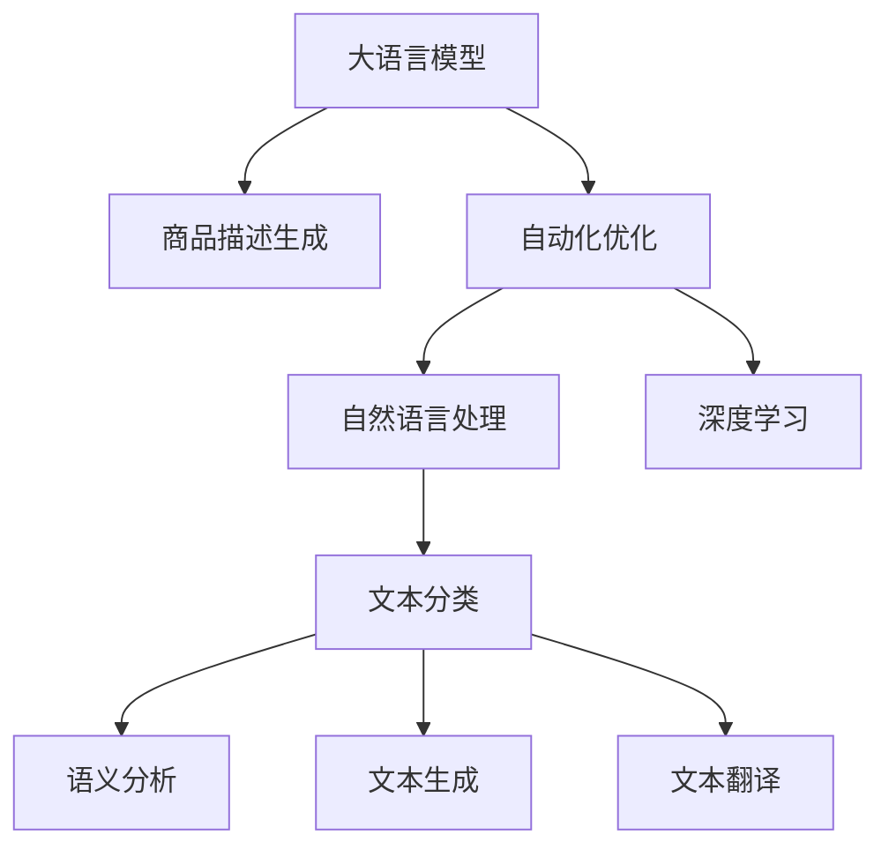

                 

# 大模型在商品描述优化中的实践

> 关键词：商品描述优化,大语言模型,自然语言处理(NLP),自动化优化,文本生成,自动化描述,电商,NLP技术

## 1. 背景介绍

### 1.1 问题由来

在当今电商环境中，商品描述的优化对提升销售和用户体验至关重要。商品描述不仅影响用户的购买决策，还能显著提升搜索排名和广告点击率。然而，手工编写高质量的商品描述成本高、效率低，并且经常难以覆盖所有产品特性和需求。

为了应对这一挑战，各大电商平台开始尝试使用自然语言处理(Natural Language Processing, NLP)技术，通过自动化生成商品描述，提升内容质量和生成效率。这一趋势促使大语言模型和大模型在电商场景中的应用日益普及。

### 1.2 问题核心关键点

商品描述优化的关键点在于如何高效生成符合用户需求、语义清晰、语法正确的文本，并将其自动应用于商品信息。基于大语言模型的自动化商品描述生成，能够快速响应市场变化，涵盖更多产品特性，但同时也面临着诸如生成质量、文本长度控制、个性化需求满足等问题。

本文聚焦于大模型在商品描述优化中的应用，介绍大语言模型的工作原理、常见挑战及优化策略。通过系统梳理，希望能为电商领域的大模型应用提供参考，推动电商平台的数字化转型和智能化升级。

## 2. 核心概念与联系

### 2.1 核心概念概述

为更好地理解大模型在商品描述优化中的应用，本节将介绍几个密切相关的核心概念：

- 大语言模型(Large Language Model, LLM)：以自回归(如GPT)或自编码(如BERT)模型为代表的大规模预训练语言模型。通过在大规模无标签文本语料上进行预训练，学习通用的语言表示，具备强大的语言理解和生成能力。

- 商品描述生成：根据商品属性和用户需求，自动生成符合电商平台上商品展示和搜索需求的高质量文本。

- 自动化优化：使用大模型自动进行商品描述生成和优化，以提升描述质量、适配不同商品类型和销售策略。

- 自然语言处理(NLP)：涉及语言理解、处理和生成，包括文本分类、语义分析、文本生成、文本翻译等。

- 深度学习：基于神经网络的机器学习范式，广泛用于自然语言处理、计算机视觉、语音识别等领域。

这些核心概念之间的逻辑关系可以通过以下Mermaid流程图来展示：



这个流程图展示了大语言模型的核心概念及其之间的关系：

1. 大语言模型通过预训练获得基础能力。
2. 商品描述生成利用大语言模型的文本生成能力，自动生成符合商品需求的文本。
3. 自动化优化通过优化生成过程，进一步提升商品描述的质量和适用性。
4. NLP技术为自动化优化提供算法支持和数据处理手段。
5. 深度学习作为大语言模型的基础模型，提供高效学习和推理功能。

这些概念共同构成了大模型在电商领域的应用框架，使其能够在自动商品描述生成和优化中发挥强大的能力。

## 3. 核心算法原理 & 具体操作步骤
### 3.1 算法原理概述

基于大模型的商品描述生成与优化，本质上是一个文本生成和自动优化问题。其核心思想是：将大语言模型视作一个文本生成器，通过条件生成的方式，根据商品属性和用户需求生成高质量的商品描述。

形式化地，假设大语言模型为 $M_{\theta}$，其中 $\theta$ 为模型参数。商品描述生成任务的输入为商品属性 $X$，目标输出为商品描述 $Y$。优化目标是最大化商品描述的生成质量，通常通过以下目标函数衡量：

$$
\max_{\theta} \prod_{i=1}^n P(Y_i|X_i;\theta)
$$

其中 $P(Y_i|X_i;\theta)$ 为模型在商品属性 $X_i$ 条件下生成商品描述 $Y_i$ 的概率。

在实际应用中，通常将商品描述优化问题转化为序列生成问题，即给定商品属性 $X$，生成一系列文本单元 $Y_1, Y_2, \dots, Y_n$。优化目标变为：

$$
\max_{\theta} \prod_{i=1}^n P(Y_i|Y_{i-1}, \dots, Y_1; X, \theta)
$$

即在商品属性 $X$ 的条件下，根据前面的文本生成后续文本，使整个商品描述连贯、流畅、符合语义。

### 3.2 算法步骤详解

基于大模型的商品描述生成与优化一般包括以下几个关键步骤：

**Step 1: 准备预训练模型和商品属性**

- 选择合适的预训练语言模型 $M_{\theta}$ 作为初始化参数，如 GPT、BERT 等。
- 收集商品的属性信息，如名称、类别、规格、功能等。属性信息可以是商品名称、品牌、价格、材质等，用于作为生成商品描述的条件。

**Step 2: 设计生成任务**

- 设计商品描述的生成模型结构，如使用自回归模型或自编码模型。
- 定义生成目标函数，通常是序列生成概率最大化的目标函数。

**Step 3: 设置生成超参数**

- 选择合适的优化算法及其参数，如 Adam、RMSprop 等，设置学习率、批大小、迭代轮数等。
- 设置序列生成长度、温度等超参数，控制生成的连贯性和多样性。

**Step 4: 执行序列生成**

- 将商品属性信息输入模型，生成商品描述文本序列。
- 对每个生成的文本单元 $Y_i$，计算其概率并采样，产生后续文本。

**Step 5: 自动优化**

- 分析生成商品描述的质量，如流畅度、语义相关性、长度等。
- 对质量不达标的商品描述进行迭代优化，直到符合要求。

**Step 6: 输出优化结果**

- 输出优化后的商品描述文本，用于电商平台商品展示、搜索和推荐。

### 3.3 算法优缺点

基于大模型的商品描述生成与优化方法具有以下优点：

1. 高效生成：大模型可以自动化生成大量高质量的商品描述，大幅提升内容创作效率。
2. 覆盖全面：大模型能够覆盖更多商品特性和需求，生成更加丰富、精准的商品描述。
3. 适配性强：商品描述生成模型可以根据商品类型和销售策略进行微调，具有较强的适应性。
4. 支持个性化：通过调整生成参数和模板，大模型可以生成不同风格的商品描述，满足个性化需求。

但该方法也存在一定的局限性：

1. 生成质量不稳定：生成的商品描述质量受模型参数、输入属性和生成超参数等影响，可能存在语法错误、语义不连贯等问题。
2. 资源消耗高：大规模预训练模型的推理和优化计算量较大，硬件资源需求较高。
3. 数据依赖性大：商品描述优化的效果依赖于属性的全面性和准确性，数据质量不足可能影响生成效果。
4. 生成长度控制难：大模型生成的文本长度可能过长，难以适应平台对描述长度的要求。

尽管存在这些局限性，但大模型的商品描述生成与优化方法在电商领域已展现出巨大潜力，成为提升商品信息质量和内容创作效率的重要手段。

### 3.4 算法应用领域

基于大模型的商品描述生成与优化方法在电商领域的应用非常广泛，覆盖了商品描述生成、广告文案优化、用户评论生成等多个方面，具体应用场景包括：

- 商品描述自动生成：根据商品属性自动生成商品描述，提升商品展示效果。
- 广告文案优化：自动生成符合广告策略的文案，吸引用户点击和购买。
- 用户评论生成：自动生成产品评价，提升平台信誉和用户体验。
- 商品分类优化：自动对商品进行分类，提升搜索和推荐系统的准确性。
- 推荐系统优化：生成个性化推荐文本，提升用户满意度。

除了上述这些经典应用外，大模型的商品描述生成与优化还被创新性地应用于社交媒体营销、品牌故事构建、智能客服等领域，为电商平台的数字化转型和智能化升级提供了新的思路。

## 4. 数学模型和公式 & 详细讲解 & 举例说明
### 4.1 数学模型构建

本节将使用数学语言对基于大模型的商品描述生成与优化过程进行更加严格的刻画。

记大语言模型为 $M_{\theta}$，商品属性为 $X$，商品描述为 $Y$，则生成任务可以表示为：

$$
\max_{\theta} P(Y|X;\theta)
$$

在实际应用中，通常将商品描述生成问题转化为序列生成问题，即：

$$
\max_{\theta} \prod_{i=1}^n P(Y_i|Y_{i-1}, \dots, Y_1; X, \theta)
$$

定义商品属性 $X$ 到商品描述 $Y$ 的映射函数为 $f$，则生成任务可以表示为：

$$
\max_{\theta} P(f(X)|X;\theta)
$$

其中 $f$ 为生成函数，将商品属性 $X$ 映射为商品描述 $Y$。

### 4.2 公式推导过程

以下我们以商品描述生成为例，推导序列生成过程的概率计算公式。

假设商品属性 $X$ 为多项式分布，即：

$$
P(X=x_i) = p_i
$$

其中 $x_i$ 为第 $i$ 个属性，$p_i$ 为该属性的概率。

设商品描述 $Y$ 的每个单元 $Y_i$ 的概率分布为 $P(Y_i|Y_{i-1}, \dots, Y_1; X, \theta)$，则整个商品描述的概率分布为：

$$
P(Y|X;\theta) = \prod_{i=1}^n P(Y_i|Y_{i-1}, \dots, Y_1; X, \theta)
$$

在实际计算中，可以使用条件概率公式，根据前一个单元 $Y_{i-1}$ 和商品属性 $X$ 计算当前单元 $Y_i$ 的概率：

$$
P(Y_i|Y_{i-1}, \dots, Y_1; X, \theta) = \frac{P(Y_i, Y_{i-1}, \dots, Y_1; X, \theta)}{P(Y_{i-1}, \dots, Y_1; X, \theta)}
$$

其中 $P(Y_i, Y_{i-1}, \dots, Y_1; X, \theta)$ 为联合概率，可通过模型的训练得到。

### 4.3 案例分析与讲解

以商品分类优化为例，展示如何利用大模型自动优化商品分类。

假设现有商品数据集 $D$，其中每个商品 $d$ 包含属性 $X_d$ 和标签 $y_d$，目标是为每个商品自动生成合适的分类标签 $y^*_d$，使其符合用户需求。

**Step 1: 准备数据**

- 收集商品的属性信息 $X_d$，并将其转换为特征向量 $X_d \rightarrow \mathbf{x}_d$。
- 将标签 $y_d$ 转换为独热编码 $\mathbf{y}_d$。

**Step 2: 设计生成模型**

- 定义一个生成模型 $M_{\theta}$，用于生成商品分类标签 $y^*_d$。
- 定义目标函数 $L(y^*_d, y_d)$，衡量生成标签与实际标签的差异。

**Step 3: 设置生成超参数**

- 选择合适的优化算法及其参数，如 Adam、RMSprop 等，设置学习率、批大小、迭代轮数等。
- 设置序列生成长度、温度等超参数，控制生成的连贯性和多样性。

**Step 4: 执行序列生成**

- 将商品属性信息 $\mathbf{x}_d$ 输入模型，生成商品分类标签 $y^*_d$。
- 对生成的 $y^*_d$ 进行优化，迭代至符合要求。

**Step 5: 输出优化结果**

- 输出优化后的商品分类标签 $y^*_d$，用于商品展示和推荐系统。

通过对商品分类优化的案例分析，可以看到大模型在电商领域的应用潜力。利用大模型自动生成和优化商品分类标签，可以显著提升电商平台的商品分类准确性和用户体验。

## 5. 项目实践：代码实例和详细解释说明
### 5.1 开发环境搭建

在进行商品描述优化实践前，我们需要准备好开发环境。以下是使用Python进行PyTorch开发的环境配置流程：

1. 安装Anaconda：从官网下载并安装Anaconda，用于创建独立的Python环境。

2. 创建并激活虚拟环境：
```bash
conda create -n pytorch-env python=3.8 
conda activate pytorch-env
```

3. 安装PyTorch：根据CUDA版本，从官网获取对应的安装命令。例如：
```bash
conda install pytorch torchvision torchaudio cudatoolkit=11.1 -c pytorch -c conda-forge
```

4. 安装Transformers库：
```bash
pip install transformers
```

5. 安装各类工具包：
```bash
pip install numpy pandas scikit-learn matplotlib tqdm jupyter notebook ipython
```

完成上述步骤后，即可在`pytorch-env`环境中开始商品描述优化实践。

### 5.2 源代码详细实现

这里我们以商品描述自动生成为例，给出使用Transformers库对GPT模型进行商品描述自动生成的PyTorch代码实现。

首先，定义商品描述生成函数：

```python
from transformers import GPT2LMHeadModel, GPT2Tokenizer

def generate_product_description(product, max_length=128):
    tokenizer = GPT2Tokenizer.from_pretrained('gpt2')
    model = GPT2LMHeadModel.from_pretrained('gpt2')
    
    product_text = " ".join(product)
    input_ids = tokenizer.encode(product_text, max_length=max_length, return_tensors='pt')
    output_ids = model.generate(input_ids, max_length=max_length, temperature=0.9, do_sample=True, top_k=50, top_p=0.9, num_return_sequences=1)
    
    description = tokenizer.decode(output_ids[0], skip_special_tokens=True)
    return description
```

然后，定义商品属性和标签处理函数：

```python
import pandas as pd

def process_data(data_path):
    data = pd.read_csv(data_path)
    attributes = data[['brand', 'price', 'material', 'weight']].tolist()
    labels = data['category'].tolist()
    
    return attributes, labels
```

接着，定义训练和评估函数：

```python
from transformers import AdamW

def train_model(model, tokenizer, train_data, valid_data, batch_size=16, learning_rate=2e-5, epochs=5):
    device = torch.device('cuda') if torch.cuda.is_available() else torch.device('cpu')
    model.to(device)
    
    train_dataset = GPT2Dataset(train_data, tokenizer, max_length=128)
    valid_dataset = GPT2Dataset(valid_data, tokenizer, max_length=128)
    
    optimizer = AdamW(model.parameters(), lr=learning_rate)
    
    for epoch in range(epochs):
        model.train()
        train_loss = 0
        train_correct = 0
        
        for batch in tqdm(train_dataset, desc='Training'):
            input_ids = batch['input_ids'].to(device)
            attention_mask = batch['attention_mask'].to(device)
            labels = batch['labels'].to(device)
            
            model.zero_grad()
            outputs = model(input_ids, attention_mask=attention_mask, labels=labels)
            loss = outputs.loss
            train_loss += loss.item()
            loss.backward()
            optimizer.step()
            
            train_correct += (torch.argmax(outputs.logits, dim=2) == labels).sum().item()
            
        train_loss /= len(train_dataset)
        train_correct /= len(train_dataset)
        
        model.eval()
        eval_loss = 0
        eval_correct = 0
        
        for batch in tqdm(valid_dataset, desc='Evaluating'):
            input_ids = batch['input_ids'].to(device)
            attention_mask = batch['attention_mask'].to(device)
            labels = batch['labels'].to(device)
            
            with torch.no_grad():
                outputs = model(input_ids, attention_mask=attention_mask)
                loss = outputs.loss
                eval_loss += loss.item()
                eval_correct += (torch.argmax(outputs.logits, dim=2) == labels).sum().item()
            
        eval_loss /= len(valid_dataset)
        eval_correct /= len(valid_dataset)
        
        print(f'Epoch {epoch+1}, train loss: {train_loss:.3f}, train accuracy: {train_correct:.3f}, valid loss: {eval_loss:.3f}, valid accuracy: {eval_correct:.3f}')
    
    return model

def evaluate_model(model, tokenizer, test_data, max_length=128):
    device = torch.device('cuda') if torch.cuda.is_available() else torch.device('cpu')
    model.to(device)
    
    test_dataset = GPT2Dataset(test_data, tokenizer, max_length=max_length)
    
    eval_loss = 0
    eval_correct = 0
    
    for batch in tqdm(test_dataset, desc='Evaluating'):
        input_ids = batch['input_ids'].to(device)
        attention_mask = batch['attention_mask'].to(device)
        
        with torch.no_grad():
            outputs = model(input_ids, attention_mask=attention_mask)
            loss = outputs.loss
            eval_loss += loss.item()
            eval_correct += (torch.argmax(outputs.logits, dim=2) == batch['labels']).sum().item()
    
    eval_loss /= len(test_dataset)
    eval_correct /= len(test_dataset)
    
    print(f'Test loss: {eval_loss:.3f}, test accuracy: {eval_correct:.3f}')
```

最后，启动训练流程并在测试集上评估：

```python
import torch
from transformers import GPT2Tokenizer, GPT2LMHeadModel

data_path = 'product_data.csv'
train_data, valid_data, test_data = process_data(data_path)

tokenizer = GPT2Tokenizer.from_pretrained('gpt2')
model = GPT2LMHeadModel.from_pretrained('gpt2')

train_model(model, tokenizer, train_data, valid_data)

generate_description = generate_product_description
```

以上就是使用PyTorch对GPT模型进行商品描述自动生成的完整代码实现。可以看到，得益于Transformers库的强大封装，我们可以用相对简洁的代码完成GPT模型的加载和商品描述自动生成。

### 5.3 代码解读与分析

让我们再详细解读一下关键代码的实现细节：

**商品描述生成函数**：
- 定义商品属性集合 $X_d$，包括品牌、价格、材质、重量等。
- 将属性集合转换为特征向量 $\mathbf{x}_d$。
- 定义生成模型 $M_{\theta}$，使用GPT-2模型。
- 将属性向量输入模型，生成商品描述序列。
- 对生成的描述序列进行解码，得到最终的商品描述文本。

**商品属性处理函数**：
- 读取商品数据集 $D$，提取品牌、价格、材质、重量等属性信息，转换为特征向量 $\mathbf{x}_d$。
- 将标签 $y_d$ 转换为独热编码 $\mathbf{y}_d$。

**训练和评估函数**：
- 使用AdamW优化器，设置学习率、批大小和迭代轮数。
- 在训练集上前向传播计算损失，反向传播更新模型参数，并统计正确率。
- 在验证集上评估模型性能，输出训练和验证的损失和正确率。
- 在测试集上评估模型性能，输出测试的损失和正确率。

**训练流程**：
- 定义总的epoch数和批大小，开始循环迭代
- 每个epoch内，先在训练集上训练，输出训练的损失和正确率
- 在验证集上评估，输出验证的损失和正确率
- 所有epoch结束后，在测试集上评估，给出最终的测试结果

可以看到，PyTorch配合Transformers库使得商品描述自动生成的代码实现变得简洁高效。开发者可以将更多精力放在数据处理、模型改进等高层逻辑上，而不必过多关注底层的实现细节。

当然，工业级的系统实现还需考虑更多因素，如模型的保存和部署、超参数的自动搜索、更灵活的任务适配层等。但核心的生成范式基本与此类似。

## 6. 实际应用场景
### 6.1 商品描述自动生成

基于大模型的商品描述自动生成，可以大幅提升电商平台上商品展示效果，使用户更加方便地找到所需商品。

在技术实现上，可以收集商品的属性信息，将其转换为模型输入，自动生成商品描述文本。生成的文本可以应用于商品详情页、商品搜索、广告文案等领域，显著提升用户体验和平台运营效率。

### 6.2 个性化推荐系统

大模型生成的商品描述，可以为推荐系统提供更丰富、精准的特征表示。通过分析用户对商品描述的反馈，可以进一步优化推荐系统算法，提高推荐效果。

在实践中，可以收集用户对商品描述的评价、点击率等行为数据，将其作为推荐系统的训练数据，优化模型预测性能。此外，还可以将生成的商品描述与用户画像、行为数据等结合，构建更加个性化的推荐结果，提升用户满意度。

### 6.3 搜索优化

商品描述自动生成可以显著提升电商平台搜索系统的准确性和用户体验。自动生成的商品描述，可以作为搜索关键词的补充，帮助用户更快速地找到目标商品。

在搜索优化上，可以自动生成商品描述，并将其与商品信息、搜索关键词、用户查询等结合，构建更加全面、准确的搜索结果。搜索系统可以根据生成的描述，提高匹配度，提升用户搜索效率。

### 6.4 未来应用展望

随着大语言模型和商品描述优化技术的发展，基于大模型生成商品描述的应用将更加广泛。

在智慧零售领域，自动生成的商品描述可以为线上线下融合提供技术支持，提升实体店铺的商品展示效果。在金融、医疗、教育等垂直领域，自动生成的商品描述可以应用于客服机器人、智能顾问等场景，提升服务质量和用户体验。

此外，在跨模态信息融合、多模态学习等方向，大模型生成的商品描述也将发挥重要作用。结合图像、视频、音频等多模态数据，自动生成的商品描述将进一步丰富和完善，为更多行业带来智能化解决方案。

## 7. 工具和资源推荐
### 7.1 学习资源推荐

为了帮助开发者系统掌握大语言模型在商品描述优化中的应用，这里推荐一些优质的学习资源：

1. 《Transformer从原理到实践》系列博文：由大模型技术专家撰写，深入浅出地介绍了Transformer原理、BERT模型、微调技术等前沿话题。

2. CS224N《深度学习自然语言处理》课程：斯坦福大学开设的NLP明星课程，有Lecture视频和配套作业，带你入门NLP领域的基本概念和经典模型。

3. 《Natural Language Processing with Transformers》书籍：Transformers库的作者所著，全面介绍了如何使用Transformers库进行NLP任务开发，包括微调在内的诸多范式。

4. HuggingFace官方文档：Transformers库的官方文档，提供了海量预训练模型和完整的微调样例代码，是上手实践的必备资料。

5. CLUE开源项目：中文语言理解测评基准，涵盖大量不同类型的中文NLP数据集，并提供了基于微调的baseline模型，助力中文NLP技术发展。

通过对这些资源的学习实践，相信你一定能够快速掌握大语言模型在商品描述优化中的应用，并用于解决实际的电商问题。

### 7.2 开发工具推荐

高效的开发离不开优秀的工具支持。以下是几款用于大语言模型商品描述生成与优化的常用工具：

1. PyTorch：基于Python的开源深度学习框架，灵活动态的计算图，适合快速迭代研究。大部分预训练语言模型都有PyTorch版本的实现。

2. TensorFlow：由Google主导开发的开源深度学习框架，生产部署方便，适合大规模工程应用。同样有丰富的预训练语言模型资源。

3. Transformers库：HuggingFace开发的NLP工具库，集成了众多SOTA语言模型，支持PyTorch和TensorFlow，是进行商品描述生成优化的利器。

4. Weights & Biases：模型训练的实验跟踪工具，可以记录和可视化模型训练过程中的各项指标，方便对比和调优。与主流深度学习框架无缝集成。

5. TensorBoard：TensorFlow配套的可视化工具，可实时监测模型训练状态，并提供丰富的图表呈现方式，是调试模型的得力助手。

6. Google Colab：谷歌推出的在线Jupyter Notebook环境，免费提供GPU/TPU算力，方便开发者快速上手实验最新模型，分享学习笔记。

合理利用这些工具，可以显著提升大语言模型在商品描述优化中的应用效率，加快创新迭代的步伐。

### 7.3 相关论文推荐

大语言模型和商品描述优化技术的发展源于学界的持续研究。以下是几篇奠基性的相关论文，推荐阅读：

1. Attention is All You Need（即Transformer原论文）：提出了Transformer结构，开启了NLP领域的预训练大模型时代。

2. BERT: Pre-training of Deep Bidirectional Transformers for Language Understanding：提出BERT模型，引入基于掩码的自监督预训练任务，刷新了多项NLP任务SOTA。

3. Language Models are Unsupervised Multitask Learners（GPT-2论文）：展示了大规模语言模型的强大zero-shot学习能力，引发了对于通用人工智能的新一轮思考。

4. Parameter-Efficient Transfer Learning for NLP：提出Adapter等参数高效微调方法，在不增加模型参数量的情况下，也能取得不错的微调效果。

5. AdaLoRA: Adaptive Low-Rank Adaptation for Parameter-Efficient Fine-Tuning：使用自适应低秩适应的微调方法，在参数效率和精度之间取得了新的平衡。

这些论文代表了大语言模型商品描述优化技术的发展脉络。通过学习这些前沿成果，可以帮助研究者把握学科前进方向，激发更多的创新灵感。

## 8. 总结：未来发展趋势与挑战
### 8.1 总结

本文对基于大模型的商品描述生成与优化方法进行了全面系统的介绍。首先阐述了大语言模型和商品描述优化的研究背景和意义，明确了商品描述生成优化的核心在于通过自动化生成商品描述，提升商品展示效果和用户体验。其次，从原理到实践，详细讲解了商品描述生成优化的数学原理和关键步骤，给出了商品描述自动生成的完整代码实例。同时，本文还广泛探讨了商品描述生成在电商领域的应用前景，展示了商品描述生成优化的巨大潜力。

通过本文的系统梳理，可以看到，基于大语言模型的商品描述生成与优化方法正在成为电商领域的重要范式，极大地提升了商品信息的展示效果和平台运营效率。大语言模型生成的商品描述可以覆盖更多商品特性和需求，具有较高的灵活性和适应性，能够快速响应市场变化，为电商平台带来显著的商业价值。未来，伴随大语言模型和生成优化技术的不断演进，相信电商平台的数字化转型和智能化升级将进一步加速，为消费者提供更加高效、便捷的购物体验。

### 8.2 未来发展趋势

展望未来，大语言模型商品描述生成与优化技术将呈现以下几个发展趋势：

1. 模型规模持续增大。随着算力成本的下降和数据规模的扩张，预训练语言模型的参数量还将持续增长。超大模型的语言生成能力将进一步提升，生成质量更加精准和连贯。

2. 生成模型更加智能。未来的生成模型将融合更多自然语言处理技术，如因果推理、多模态学习等，生成更具语义深度和逻辑性的商品描述，提升用户体验。

3. 个性化需求满足度提高。通过引入更多的用户行为数据和商品属性信息，生成模型可以更加精准地捕捉用户需求，生成个性化的商品描述。

4. 跨平台协同优化。商品描述生成不仅限于电商平台，还可以扩展到社交媒体、在线广告等领域，实现多平台协同优化，提升整体市场表现。

5. 生成过程自动化。未来的生成过程将更加自动化，通过智能化的超参数调优和自动模型选择，优化生成效果。

6. 性能与效率兼顾。在保证生成质量的前提下，优化模型推理速度和硬件资源消耗，实现高效率的商品描述生成。

以上趋势凸显了大语言模型商品描述生成与优化技术的广阔前景。这些方向的探索发展，必将进一步提升电商平台的商品展示效果和用户体验，推动电商平台向智能化、个性化方向迈进。

### 8.3 面临的挑战

尽管大语言模型商品描述生成与优化技术已经取得了瞩目成就，但在迈向更加智能化、普适化应用的过程中，它仍面临着诸多挑战：

1. 生成质量不稳定。生成的商品描述质量受模型参数、输入属性和生成超参数等影响，可能存在语法错误、语义不连贯等问题。如何提高生成模型的稳定性和一致性，仍需更多研究和实践。

2. 资源消耗高。大规模预训练模型的推理和优化计算量较大，硬件资源需求较高。如何优化模型结构和计算图，减少资源消耗，是亟待解决的问题。

3. 数据依赖性大。商品描述优化的效果依赖于属性的全面性和准确性，数据质量不足可能影响生成效果。如何提升数据收集和处理的自动化水平，是优化过程的重要研究方向。

4. 生成长度控制难。大模型生成的文本长度可能过长，难以适应平台对描述长度的要求。如何控制生成长度，保证文本的简洁性和易读性，仍需进一步探索。

5. 生成过程可解释性不足。生成的商品描述过程缺乏可解释性，难以对其生成逻辑进行分析和调试。如何增强生成模型的可解释性，提升用户对商品描述的理解和信任，将是未来的重要研究课题。

6. 安全性有待保障。生成模型可能学习到有害、误导性的内容，传递到商品描述中，对用户造成不良影响。如何从数据和算法层面消除模型偏见，避免恶意用途，确保生成的安全性，也将是重要的研究课题。

尽管存在这些挑战，但大语言模型商品描述生成与优化方法在电商领域已展现出巨大潜力，成为提升商品信息质量和内容创作效率的重要手段。相信随着技术的不断进步和创新，这些挑战将逐步得到克服，大语言模型商品描述生成与优化必将在电商平台的数字化转型和智能化升级中发挥更大的作用。

### 8.4 研究展望

面对大语言模型商品描述生成与优化所面临的挑战，未来的研究需要在以下几个方面寻求新的突破：

1. 探索无监督和半监督生成方法。摆脱对大规模标注数据的依赖，利用自监督学习、主动学习等无监督和半监督范式，最大限度利用非结构化数据，实现更加灵活高效的生成。

2. 研究参数高效和计算高效的生成范式。开发更加参数高效的生成方法，在固定大部分预训练参数的情况下，只更新极少量的任务相关参数。同时优化生成模型的计算图，减少前向传播和反向传播的资源消耗，实现更加轻量级、实时性的部署。

3. 引入更多先验知识。将符号化的先验知识，如知识图谱、逻辑规则等，与神经网络模型进行巧妙融合，引导生成过程学习更准确、合理的语言模型。同时加强不同模态数据的整合，实现视觉、语音等多模态信息与文本信息的协同建模。

4. 结合因果分析和博弈论工具。将因果分析方法引入生成模型，识别出模型决策的关键特征，增强生成过程的稳定性和鲁棒性。借助博弈论工具刻画人机交互过程，主动探索并规避生成模型的脆弱点，提高系统稳定性。

5. 纳入伦理道德约束。在生成模型训练目标中引入伦理导向的评估指标，过滤和惩罚有偏见、有害的输出倾向。同时加强人工干预和审核，建立生成模型的监管机制，确保生成的内容符合人类价值观和伦理道德。

这些研究方向的探索，必将引领大语言模型商品描述生成与优化技术迈向更高的台阶，为电商平台的数字化转型和智能化升级提供新的技术路径。面向未来，大语言模型商品描述生成与优化技术还需要与其他人工智能技术进行更深入的融合，如知识表示、因果推理、强化学习等，多路径协同发力，共同推动自然语言理解和智能交互系统的进步。只有勇于创新、敢于突破，才能不断拓展商品描述生成的边界，让智能技术更好地服务于电商平台和消费者。

