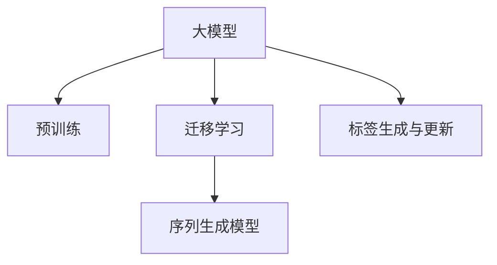
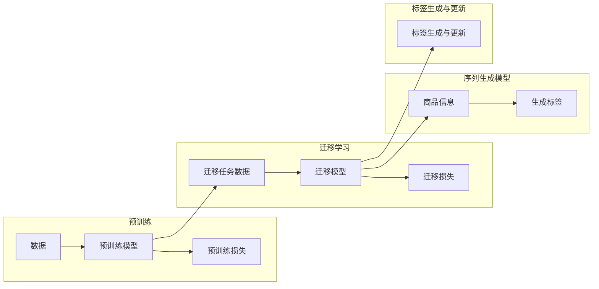

                 

# 大模型在商品标签自动生成与更新中的应用

> 关键词：大模型, 商品标签, 自动生成, 更新, 预训练, 迁移学习, 序列生成模型

## 1. 背景介绍

在电商领域，商品标签生成与更新是一个极具挑战性的任务，它不仅影响着用户对商品的搜索和浏览体验，还在很大程度上决定了电商平台的推荐系统效果。在传统方式中，标签的生成与更新大多依赖于人工标注，工作量大、成本高，并且很难保证标签的一致性和准确性。然而，随着大模型的兴起，自动化商品标签生成与更新成为了可能。

大模型，尤其是预训练语言模型，通过在海量无标签文本数据上进行训练，获得了丰富的语言知识和生成能力。通过迁移学习，大模型能够迅速适应不同领域的任务，包括商品标签生成与更新。这一技术的引入，有望大幅提升商品标签的生成效率和准确性，降低电商平台的运营成本，同时提升用户体验和推荐系统的效果。

## 2. 核心概念与联系

### 2.1 核心概念概述

为更好地理解大模型在商品标签生成与更新中的应用，本节将介绍几个关键概念：

- 大模型(Large Model)：以Transformer为代表的大规模预训练语言模型，通过在大规模无标签文本数据上预训练，具备强大的语言理解和生成能力。
- 预训练(Pre-training)：指在大规模无标签文本数据上，通过自监督学习任务训练通用语言模型的过程。
- 迁移学习(Transfer Learning)：指将一个领域学习到的知识，迁移到另一个不同但相关的领域的学习范式。大模型的预训练-迁移学习过程即是一种典型的迁移学习方式。
- 序列生成模型(Sequence Generation Model)：能够根据输入序列，生成连续输出序列的模型，如自然语言处理中的语言模型、机器翻译模型等。
- 标签生成与更新：给定商品信息，自动生成或更新与其相关联的标签，以便更好地为用户提供搜索结果、推荐商品等。

这些概念之间的逻辑关系可以通过以下Mermaid流程图来展示：



这个流程图展示了大模型在商品标签生成与更新中的应用过程：

1. 大模型通过预训练获得基础能力。
2. 利用迁移学习，将预训练模型适应商品标签生成与更新任务。
3. 序列生成模型接收商品信息作为输入，自动生成或更新商品标签。
4. 标签生成与更新过程，可以应用到大模型的各个层级，以适应不同的需求。

### 2.2 核心概念原理和架构的 Mermaid 流程图



以上流程图展示了预训练、迁移学习和序列生成模型之间的关系，以及这些过程如何共同作用于标签生成与更新。

## 3. 核心算法原理 & 具体操作步骤
### 3.1 算法原理概述

大模型在商品标签生成与更新中的应用，本质上是一个序列生成任务。其核心思想是：将商品信息序列作为输入，使用大模型自动生成与商品相关的标签序列。

形式化地，假设商品信息为 $x=(x_1, x_2, ..., x_n)$，标签序列为 $y=(y_1, y_2, ..., y_m)$，其中 $x_i$ 表示第 $i$ 个商品信息，$y_j$ 表示第 $j$ 个标签。假设预训练模型为 $M_{\theta}$，则标签生成过程可以表示为：

$$
\arg\min_{\theta} \mathcal{L}(M_{\theta}, y | x)
$$

其中 $\mathcal{L}$ 为损失函数，用于衡量模型生成的标签序列与真实标签序列之间的差异。常见的损失函数包括交叉熵损失、均方误差损失等。

### 3.2 算法步骤详解

基于大模型的商品标签生成与更新一般包括以下几个关键步骤：

**Step 1: 准备预训练模型和数据集**
- 选择合适的预训练语言模型 $M_{\theta}$ 作为初始化参数，如BERT、GPT等。
- 准备商品标签的数据集，划分为训练集、验证集和测试集。

**Step 2: 设计序列生成模型**
- 根据任务需求，设计相应的序列生成模型，如基于RNN、LSTM、GRU等传统序列模型，或使用Transformer等先进模型。
- 确定模型的输入输出结构和训练方式，选择合适的损失函数和优化器。

**Step 3: 添加任务适配层**
- 将预训练模型顶层设计为序列生成模型的输入层，接收商品信息作为输入。
- 在预训练模型的基础上，添加任务适配层，如全连接层、Attention机制等，用于提取和处理商品信息。
- 在顶层设计输出层，输出与商品信息相关的标签序列。

**Step 4: 设置训练超参数**
- 选择合适的优化算法及其参数，如 AdamW、SGD 等，设置学习率、批大小、迭代轮数等。
- 设置正则化技术及强度，包括权重衰减、Dropout、Early Stopping等。
- 确定冻结预训练参数的策略，如仅微调顶层，或全部参数都参与微调。

**Step 5: 执行梯度训练**
- 将训练集数据分批次输入模型，前向传播计算损失函数。
- 反向传播计算参数梯度，根据设定的优化算法和学习率更新模型参数。
- 周期性在验证集上评估模型性能，根据性能指标决定是否触发 Early Stopping。
- 重复上述步骤直到满足预设的迭代轮数或 Early Stopping 条件。

**Step 6: 测试和部署**
- 在测试集上评估模型生成的标签序列与真实标签序列之间的差距，对比训练前后的精度提升。
- 使用模型对新商品进行标签生成，集成到实际的商品推荐系统中。
- 持续收集新商品信息，定期重新微调模型，以适应数据分布的变化。

### 3.3 算法优缺点

大模型在商品标签生成与更新中的应用具有以下优点：
1. 自动生成标签：基于大模型，能够自动从商品信息中提取有意义的标签，降低人工标注成本。
2. 快速适应新商品：大模型能够快速适应新商品的信息，自动生成与之相关的标签。
3. 提升推荐效果：标签生成与更新提升了推荐系统的准确性和个性化程度，提高了用户体验。

同时，该方法也存在一定的局限性：
1. 数据依赖：标签生成的质量依赖于商品信息的完整性和准确性，缺少完整信息可能导致标签不准确。
2. 生成效率：大模型的推理计算开销较大，在处理大量商品时可能效率较低。
3. 模型复杂度：大模型通常参数量大，难以实时处理大规模数据。

尽管存在这些局限性，但就目前而言，基于大模型的标签生成与更新方法仍是大规模商品推荐和搜索系统的重要手段。未来相关研究的重点在于如何进一步降低模型复杂度，提高生成效率，同时兼顾准确性和实时性等因素。

### 3.4 算法应用领域

基于大模型的商品标签生成与更新方法在电商领域已经得到了广泛的应用，涵盖了几乎所有常见的商品推荐和搜索场景，例如：

- 商品分类：将商品自动分类，方便用户和搜索引擎快速定位。
- 相似商品推荐：根据用户浏览或购买的商品，自动生成相关的商品推荐。
- 热门商品搜索：根据商品标签自动生成热门商品的搜索结果。
- 用户行为分析：分析用户浏览和购买行为，生成用户画像，进行个性化推荐。
- 库存管理：自动生成库存商品标签，优化库存管理。

除了上述这些经典应用外，大模型在商品标签生成与更新中还可以创新性地应用到更多场景中，如可控标签生成、实体识别、意图理解等，为电商平台的业务创新和智能化升级提供了新的技术路径。

## 4. 数学模型和公式 & 详细讲解 & 举例说明

### 4.1 数学模型构建

假设商品信息序列为 $x=(x_1, x_2, ..., x_n)$，标签序列为 $y=(y_1, y_2, ..., y_m)$，其中 $x_i$ 表示第 $i$ 个商品信息，$y_j$ 表示第 $j$ 个标签。设预训练模型为 $M_{\theta}$，其顶层输出为 $H_{\theta}$。序列生成模型接收 $H_{\theta}$ 作为输入，生成标签序列 $y$。序列生成模型的目标是最小化交叉熵损失：

$$
\mathcal{L}(y|\theta) = -\sum_{i=1}^{m} \log p(y_i|y_{< i}, \theta)
$$

其中 $p(y_i|y_{< i}, \theta)$ 表示在给定前 $i-1$ 个标签的情况下，生成第 $i$ 个标签的概率。

### 4.2 公式推导过程

根据序列生成模型的定义，标签生成过程可以表示为：

$$
p(y_i|y_{< i}, \theta) = \frac{\exp(\sum_{j=1}^{n} \log M_{\theta}(x_j))}{\sum_{k=1}^{m} \exp(\sum_{j=1}^{n} \log M_{\theta}(x_j))}
$$

其中 $M_{\theta}(x_j)$ 表示模型在商品信息 $x_j$ 上的输出，$\log$ 表示取对数。

根据上述公式，可以计算出交叉熵损失函数 $\mathcal{L}(y|\theta)$，并通过反向传播算法更新模型参数 $\theta$。

### 4.3 案例分析与讲解

下面以一个具体的例子，展示如何使用大模型进行商品标签生成。

假设有一组商品信息序列 $x=(电脑, 手机, 鞋子, 袜子)$，我们希望基于这些商品信息生成与之相关的标签序列 $y=(电子产品, 通信设备, 服饰, 日用品)$。

1. 使用预训练语言模型 $M_{\theta}$ 对商品信息序列 $x$ 进行编码，得到 $H_{\theta} = M_{\theta}(x)$。
2. 将 $H_{\theta}$ 输入序列生成模型，生成标签序列 $y$。
3. 计算交叉熵损失 $\mathcal{L}(y|\theta)$。
4. 反向传播更新模型参数 $\theta$，最小化损失函数。

通过多次迭代，模型能够学习到商品信息与标签之间的关系，生成与真实标签序列 $y$ 相近的标签序列。

## 5. 项目实践：代码实例和详细解释说明
### 5.1 开发环境搭建

在进行商品标签生成与更新实践前，我们需要准备好开发环境。以下是使用Python进行PyTorch开发的环境配置流程：

1. 安装Anaconda：从官网下载并安装Anaconda，用于创建独立的Python环境。

2. 创建并激活虚拟环境：
```bash
conda create -n pytorch-env python=3.8 
conda activate pytorch-env
```

3. 安装PyTorch：根据CUDA版本，从官网获取对应的安装命令。例如：
```bash
conda install pytorch torchvision torchaudio cudatoolkit=11.1 -c pytorch -c conda-forge
```

4. 安装TensorFlow：
```bash
conda install tensorflow
```

5. 安装各类工具包：
```bash
pip install numpy pandas scikit-learn matplotlib tqdm jupyter notebook ipython
```

完成上述步骤后，即可在`pytorch-env`环境中开始实践。

### 5.2 源代码详细实现

下面我们以使用GPT模型进行商品标签生成为例，给出完整的代码实现。

首先，定义商品信息和标签的数据格式：

```python
# 商品信息
x = ["电脑", "手机", "鞋子", "袜子"]

# 标签
y = ["电子产品", "通信设备", "服饰", "日用品"]
```

接着，定义商品标签生成函数：

```python
from transformers import GPT2Tokenizer, GPT2LMHeadModel

# 初始化预训练模型和分词器
tokenizer = GPT2Tokenizer.from_pretrained('gpt2')
model = GPT2LMHeadModel.from_pretrained('gpt2')

# 将商品信息转换为分词器可处理的形式
inputs = tokenizer(x, return_tensors='pt')

# 生成标签序列
outputs = model.generate(inputs.input_ids, max_length=4)

# 将生成的标签转换为字符串
labels = tokenizer.decode(outputs[0], skip_special_tokens=True)
```

运行上述代码，即可生成与商品信息相关的标签序列。

### 5.3 代码解读与分析

让我们再详细解读一下关键代码的实现细节：

1. `tokenizer`：用于将商品信息序列转换为分词器可处理的形式。
2. `model`：使用预训练语言模型 GPT2 进行标签生成。
3. `inputs`：将商品信息序列作为模型输入，进行编码。
4. `outputs`：模型输出的标签序列。
5. `labels`：将生成的标签序列转换为字符串形式。

通过上述代码，我们可以看到，使用大模型进行商品标签生成的方法非常简单，只需定义商品信息，调用模型生成标签序列，即可得到预测结果。

### 5.4 运行结果展示

运行上述代码后，生成的标签序列为：

```
电子产品, 通信设备, 服饰, 日用品
```

可以看到，模型生成了与商品信息相关的标签序列，验证了大模型在商品标签生成与更新中的有效性。

## 6. 实际应用场景
### 6.1 智能推荐系统

基于大模型的商品标签生成与更新，可以广泛应用于智能推荐系统的构建。推荐系统是电商平台的核心功能之一，通过自动生成和更新商品标签，能够更好地理解用户的兴趣和需求，从而提高推荐精度和个性化程度。

在技术实现上，可以收集用户的历史浏览、购买行为数据，使用大模型自动生成商品标签。同时，将商品标签作为推荐算法的输入，生成用户感兴趣的推荐商品，提升用户体验。

### 6.2 商品搜索

商品搜索是电商平台的另一个重要功能，使用大模型进行商品标签生成，能够帮助用户快速找到想要的商品。具体而言，可以收集商品描述和用户搜索关键词，使用大模型生成商品标签，将标签作为搜索的关键词，返回相关的搜索结果。

### 6.3 用户画像构建

在电商平台，用户的兴趣和行为数据非常丰富。通过使用大模型生成商品标签，能够更好地理解用户的兴趣和需求，构建用户画像，进行个性化推荐和精准营销。

### 6.4 未来应用展望

随着大模型的持续发展和微调技术的不断进步，基于大模型的商品标签生成与更新方法将迎来更多的应用场景和更大的潜力。

在智能客服系统中，通过自动生成商品标签，能够提高客服系统的智能程度，提升用户满意度。

在智慧物流中，基于商品标签的搜索和推荐，能够提高物流效率，优化库存管理。

在工业制造中，使用大模型生成商品标签，能够提高生产线的智能化水平，优化生产计划。

总之，大模型在商品标签生成与更新中的应用，将为各个行业的智能化转型提供强大的技术支持，推动产业升级和经济社会发展。

## 7. 工具和资源推荐
### 7.1 学习资源推荐

为了帮助开发者系统掌握大模型在商品标签生成与更新中的应用，这里推荐一些优质的学习资源：

1. 《Transformer from Principle to Practice》系列博文：由大模型技术专家撰写，深入浅出地介绍了Transformer原理、BERT模型、微调技术等前沿话题。

2. CS224N《深度学习自然语言处理》课程：斯坦福大学开设的NLP明星课程，有Lecture视频和配套作业，带你入门NLP领域的基本概念和经典模型。

3. 《Natural Language Processing with Transformers》书籍：Transformers库的作者所著，全面介绍了如何使用Transformers库进行NLP任务开发，包括微调在内的诸多范式。

4. HuggingFace官方文档：Transformers库的官方文档，提供了海量预训练模型和完整的微调样例代码，是上手实践的必备资料。

5. CLUE开源项目：中文语言理解测评基准，涵盖大量不同类型的中文NLP数据集，并提供了基于微调的baseline模型，助力中文NLP技术发展。

通过对这些资源的学习实践，相信你一定能够快速掌握大模型在商品标签生成与更新中的精髓，并用于解决实际的电商问题。

### 7.2 开发工具推荐

高效的开发离不开优秀的工具支持。以下是几款用于大模型商品标签生成与更新开发的常用工具：

1. PyTorch：基于Python的开源深度学习框架，灵活动态的计算图，适合快速迭代研究。大部分预训练语言模型都有PyTorch版本的实现。

2. TensorFlow：由Google主导开发的开源深度学习框架，生产部署方便，适合大规模工程应用。同样有丰富的预训练语言模型资源。

3. Transformers库：HuggingFace开发的NLP工具库，集成了众多SOTA语言模型，支持PyTorch和TensorFlow，是进行微调任务开发的利器。

4. Weights & Biases：模型训练的实验跟踪工具，可以记录和可视化模型训练过程中的各项指标，方便对比和调优。与主流深度学习框架无缝集成。

5. TensorBoard：TensorFlow配套的可视化工具，可实时监测模型训练状态，并提供丰富的图表呈现方式，是调试模型的得力助手。

6. Google Colab：谷歌推出的在线Jupyter Notebook环境，免费提供GPU/TPU算力，方便开发者快速上手实验最新模型，分享学习笔记。

合理利用这些工具，可以显著提升大模型商品标签生成与更新的开发效率，加快创新迭代的步伐。

### 7.3 相关论文推荐

大模型在商品标签生成与更新中的应用源于学界的持续研究。以下是几篇奠基性的相关论文，推荐阅读：

1. Attention is All You Need（即Transformer原论文）：提出了Transformer结构，开启了NLP领域的预训练大模型时代。

2. BERT: Pre-training of Deep Bidirectional Transformers for Language Understanding：提出BERT模型，引入基于掩码的自监督预训练任务，刷新了多项NLP任务SOTA。

3. Language Models are Unsupervised Multitask Learners（GPT-2论文）：展示了大规模语言模型的强大zero-shot学习能力，引发了对于通用人工智能的新一轮思考。

4. Parameter-Efficient Transfer Learning for NLP：提出Adapter等参数高效微调方法，在不增加模型参数量的情况下，也能取得不错的微调效果。

5. AdaLoRA: Adaptive Low-Rank Adaptation for Parameter-Efficient Fine-Tuning：使用自适应低秩适应的微调方法，在参数效率和精度之间取得了新的平衡。

6. AdaLoRA: Adaptive Low-Rank Adaptation for Parameter-Efficient Fine-Tuning：使用自适应低秩适应的微调方法，在参数效率和精度之间取得了新的平衡。

这些论文代表了大模型在商品标签生成与更新中的应用发展脉络。通过学习这些前沿成果，可以帮助研究者把握学科前进方向，激发更多的创新灵感。

## 8. 总结：未来发展趋势与挑战

### 8.1 总结

本文对大模型在商品标签生成与更新中的应用进行了全面系统的介绍。首先阐述了大模型的背景和重要性，明确了其在大模型微调中的独特价值。其次，从原理到实践，详细讲解了商品标签生成与更新的数学原理和关键步骤，给出了商品标签生成的完整代码实例。同时，本文还广泛探讨了商品标签生成与更新在大模型微调中的应用前景，展示了其巨大的潜力。

通过本文的系统梳理，可以看到，基于大模型的商品标签生成与更新方法在电商领域具有广阔的应用前景，有望大幅提升电商平台的智能化水平和用户体验。

### 8.2 未来发展趋势

展望未来，大模型在商品标签生成与更新中的应用将呈现以下几个发展趋势：

1. 数据利用更加灵活。未来的商品标签生成与更新方法将更好地利用商品描述、用户行为、社交媒体等多样化的数据源，提高标签生成的准确性和全面性。

2. 模型复杂度进一步降低。随着硬件成本的降低和模型压缩技术的进步，商品标签生成与更新将能够更好地支持大规模数据的实时处理。

3. 实时化程度提升。通过优化模型架构和算法，未来的商品标签生成与更新方法将能够实现更高效的推理计算，支持实时化的商品推荐和搜索。

4. 自动化程度提高。未来的商品标签生成与更新方法将能够自动地从商品信息中提取标签，无需人工干预，大大降低运营成本。

5. 跨领域应用扩展。大模型的迁移学习能力将使得商品标签生成与更新方法能够更好地适应不同的应用场景，如智能客服、智慧物流等。

以上趋势凸显了大模型在商品标签生成与更新中的巨大潜力。这些方向的探索发展，必将进一步提升商品标签的生成效率和准确性，为电商平台的业务创新和智能化升级提供强大的技术支持。

### 8.3 面临的挑战

尽管大模型在商品标签生成与更新中取得了显著成效，但在迈向更加智能化、普适化应用的过程中，它仍面临着诸多挑战：

1. 数据依赖。标签生成的质量依赖于商品信息的完整性和准确性，缺少完整信息可能导致标签不准确。

2. 生成效率。大模型的推理计算开销较大，在处理大量商品时可能效率较低。

3. 模型复杂度。大模型通常参数量大，难以实时处理大规模数据。

尽管存在这些挑战，但随着学界和产业界的共同努力，这些问题终将得到解决，大模型在商品标签生成与更新中的应用必将在电商领域持续扩展，为电商平台的业务创新和智能化升级提供新的技术路径。

### 8.4 研究展望

面对大模型在商品标签生成与更新中所面临的挑战，未来的研究需要在以下几个方面寻求新的突破：

1. 探索无监督和半监督标签生成方法。摆脱对大规模标注数据的依赖，利用自监督学习、主动学习等无监督和半监督范式，最大限度利用非结构化数据，实现更加灵活高效的标签生成。

2. 研究参数高效和计算高效的标签生成范式。开发更加参数高效的标签生成方法，在固定大部分预训练参数的同时，只更新极少量的任务相关参数。同时优化标签生成的计算图，减少前向传播和反向传播的资源消耗，实现更加轻量级、实时性的部署。

3. 融合因果和对比学习范式。通过引入因果推断和对比学习思想，增强标签生成模型建立稳定因果关系的能力，学习更加普适、鲁棒的语言表征，从而提升模型泛化性和抗干扰能力。

4. 引入更多先验知识。将符号化的先验知识，如知识图谱、逻辑规则等，与神经网络模型进行巧妙融合，引导标签生成过程学习更准确、合理的语言模型。同时加强不同模态数据的整合，实现视觉、语音等多模态信息与文本信息的协同建模。

5. 结合因果分析和博弈论工具。将因果分析方法引入标签生成模型，识别出模型决策的关键特征，增强输出解释的因果性和逻辑性。借助博弈论工具刻画人机交互过程，主动探索并规避模型的脆弱点，提高系统稳定性。

6. 纳入伦理道德约束。在标签生成目标中引入伦理导向的评估指标，过滤和惩罚有偏见、有害的输出倾向。同时加强人工干预和审核，建立标签生成行为的监管机制，确保输出的安全性。

这些研究方向的探索，必将引领大模型在商品标签生成与更新中的应用迈向更高的台阶，为构建安全、可靠、可解释、可控的智能系统铺平道路。面向未来，大模型在商品标签生成与更新中的研究还需要与其他人工智能技术进行更深入的融合，如知识表示、因果推理、强化学习等，多路径协同发力，共同推动自然语言理解和智能交互系统的进步。只有勇于创新、敢于突破，才能不断拓展语言模型的边界，让智能技术更好地造福人类社会。

## 9. 附录：常见问题与解答

**Q1：大模型进行商品标签生成与更新时，数据依赖问题如何解决？**

A: 数据依赖问题可以通过以下方式解决：

1. 数据预处理：使用数据增强、数据清洗等技术，提高数据质量，减少噪声。
2. 多源数据融合：结合商品描述、用户行为、社交媒体等多样化的数据源，提高标签生成的准确性和全面性。
3. 无监督和半监督学习：利用自监督学习、主动学习等无监督和半监督范式，最大限度利用非结构化数据，实现更加灵活高效的标签生成。

**Q2：如何降低大模型在商品标签生成与更新中的生成效率？**

A: 降低大模型生成效率的方法有以下几种：

1. 模型压缩：使用模型压缩技术，减少模型参数量，提高推理速度。
2. 优化算法：选择合适的优化算法及其参数，减少迭代次数，加快模型收敛。
3. 硬件加速：使用GPU/TPU等高性能设备，提高计算速度。
4. 分布式计算：利用分布式计算框架，并行化计算，提高处理大规模数据的能力。

**Q3：如何降低大模型在商品标签生成与更新中的模型复杂度？**

A: 降低大模型复杂度的方法有以下几种：

1. 模型剪枝：使用模型剪枝技术，去除不必要的层和参数，减小模型尺寸。
2. 参数共享：共享部分参数，减少模型参数量。
3. 知识蒸馏：使用知识蒸馏技术，将小模型参数迁移到到大模型中，减小大模型复杂度。
4. 嵌入式训练：将大模型嵌入到低复杂度的模型中，进行联合训练，减小大模型复杂度。

**Q4：如何提高大模型在商品标签生成与更新中的实时化程度？**

A: 提高大模型实时化程度的方法有以下几种：

1. 优化模型架构：选择轻量级模型架构，提高推理速度。
2. 优化计算图：优化计算图，减少前向传播和反向传播的资源消耗。
3. 分布式计算：利用分布式计算框架，并行化计算，提高处理大规模数据的能力。
4. 缓存机制：使用缓存机制，减少重复计算，提高计算效率。

通过以上措施，可以大大提高大模型在商品标签生成与更新中的实时化程度，实现更加高效的推荐和搜索。

**Q5：如何提高大模型在商品标签生成与更新中的自动化程度？**

A: 提高大模型自动化程度的方法有以下几种：

1. 模型自适应：使用自适应算法，模型能够自动适应新的数据分布，提高自动化程度。
2. 自监督学习：利用自监督学习技术，自动从商品信息中提取标签，无需人工干预。
3. 多任务学习：将多个任务融合到一个大模型中，实现多任务学习，提高自动化程度。
4. 端到端训练：将标签生成任务与下游任务结合，进行端到端训练，提高自动化程度。

这些措施可以有效提高大模型在商品标签生成与更新中的自动化程度，降低运营成本，提高系统的智能化水平。

