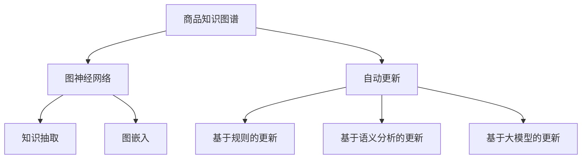

                 

# 大模型在商品知识图谱自动更新中的应用

> 关键词：知识图谱,商品图谱,自动更新,大模型,图神经网络,PyTorch

## 1. 背景介绍

### 1.1 问题由来
商品知识图谱是电子商务领域中重要的基础设施，它通过将商品、品牌、型号、价格等商品属性进行节点化和关系化，帮助用户更快捷地获取信息、比较产品、做出购买决策。然而，随着电商平台不断发展，新商品层出不穷，且商品属性和品牌描述可能存在变动，这使得手动更新知识图谱的工作量巨大且容易出错。因此，如何通过自动化的方式快速、准确地更新商品知识图谱，成为一项亟需解决的问题。

### 1.2 问题核心关键点
在商品知识图谱自动更新中，最关键的问题是如何有效地利用已有的海量商品数据，识别并处理新的商品信息，并将其准确地更新到知识图谱中。目前主流的方法包括基于规则的更新、基于语义分析的更新和基于图神经网络(Graph Neural Network, GNN)的更新。其中，基于GNN的更新方法利用图结构中的节点和边信息，可以更自然地处理复杂的语义关系，是当前研究的热点之一。

## 2. 核心概念与联系

### 2.1 核心概念概述

为更好地理解大模型在商品知识图谱自动更新中的应用，本节将介绍几个密切相关的核心概念：

- 商品知识图谱：将商品、品牌、型号等商品属性进行节点化和关系化，建立商品之间的语义网络结构。通常用于商品推荐、搜索、比较等场景。
- 图神经网络：基于图结构设计的神经网络模型，能够利用节点和边信息进行信息传递和融合，特别适用于处理具有复杂关系的数据。
- 自动更新：利用人工智能技术，通过算法自动处理新商品信息，更新知识图谱中的数据，以保持其时效性和准确性。
- 大模型：以自回归或自编码模型为代表的大规模预训练语言模型。通过在大规模无标签文本语料上进行预训练，学习通用的语言表示，具备强大的语言理解和生成能力。
- 知识抽取：从结构化或非结构化的数据中，提取出结构化的知识信息，并将其表示为图结构。
- 图嵌入：将图结构中的节点信息映射到低维向量空间，便于模型进行学习和推理。

这些核心概念之间的逻辑关系可以通过以下Mermaid流程图来展示：



这个流程图展示了大模型在商品知识图谱自动更新中的核心概念及其之间的关系：

1. 商品知识图谱通过图神经网络进行自动更新。
2. 自动更新过程可以分为基于规则、基于语义分析和大模型等多种方法。
3. 知识抽取和图嵌入是更新过程中重要的预处理步骤，将非结构化数据转换为结构化信息，并映射为低维向量。
4. 大模型通过图结构中的节点和边信息进行信息传递，实现知识图谱的自动更新。

## 3. 核心算法原理 & 具体操作步骤
### 3.1 算法原理概述

基于大模型的商品知识图谱自动更新方法，核心思想是利用大模型的强大语言理解能力，在商品节点和关系节点的描述中自动提取新的商品信息，并更新到知识图谱中。该方法主要包含两个关键步骤：

1. 商品知识图谱中的每个节点，如品牌、型号、价格等，都会被自动映射到一个低维向量空间，称为商品嵌入向量。
2. 利用大模型对商品描述进行编码，并根据编码结果更新商品嵌入向量。

### 3.2 算法步骤详解

以下详细介绍商品知识图谱自动更新的主要算法步骤：

**Step 1: 数据预处理**
- 收集电商平台的商品数据，包括商品名称、品牌、型号、价格等信息。
- 对数据进行清洗和标准化处理，去除冗余和噪声信息。
- 将商品描述文本进行分词、去停用词、词干化等预处理，便于大模型提取信息。

**Step 2: 商品嵌入表示**
- 对每个商品节点，使用预训练的Word2Vec或BERT等大模型进行编码，得到商品的嵌入向量表示。
- 对于关系节点，同样使用大模型进行编码，得到关系向量的表示。
- 通过节点和关系向量的拼接，得到商品知识图谱的表示。

**Step 3: 大模型编码**
- 利用大模型对商品描述进行编码，得到商品描述的向量表示。
- 将商品描述向量与商品嵌入向量拼接，生成新的商品嵌入向量。
- 根据新商品嵌入向量，更新商品知识图谱中的嵌入向量。

**Step 4: 知识图谱更新**
- 将新的商品嵌入向量更新到商品知识图谱中，并重新计算图结构的邻接矩阵。
- 利用图神经网络对更新后的知识图谱进行学习，重新计算节点的嵌入向量。
- 输出更新后的知识图谱，供后续推荐、搜索等应用使用。

### 3.3 算法优缺点

基于大模型的商品知识图谱自动更新方法具有以下优点：

1. 高效自动。利用大模型可以快速处理商品描述，自动更新商品知识图谱，减轻人工劳动。
2. 泛化能力强。大模型具有强大的语言理解能力，能够处理各种语义复杂度的商品描述，提高自动更新的泛化性。
3. 数据依赖低。大模型能够利用自然语言进行信息抽取，对标注数据需求较低。
4. 可解释性强。通过编码过程中的大模型参数，可以解释模型对商品描述的理解过程，提高模型的可解释性。

同时，该方法也存在一定的局限性：

1. 数据质量要求高。商品描述的质量直接影响了自动更新的效果，需要大量的高质量数据支持。
2. 模型资源消耗大。大模型的参数量通常很大，训练和推理过程中资源消耗较高。
3. 泛化到新领域困难。大模型主要基于通用语料进行预训练，对特定领域的知识可能掌握不足。
4. 鲁棒性有待提升。大模型对噪声和语义错误具有较强的容忍性，需要额外的机制保证数据质量。

尽管存在这些局限性，但就目前而言，基于大模型的自动更新方法仍是大模型在商品知识图谱更新应用中的主流范式。未来相关研究的重点在于如何进一步提高自动更新的效率和准确性，降低资源消耗，提升模型泛化能力。

### 3.4 算法应用领域

基于大模型的商品知识图谱自动更新方法，已经在商品推荐、搜索、比较等多个电商应用场景中得到了广泛应用，取得了显著的效果。具体而言：

- 商品推荐：自动更新商品知识图谱后，可以使用图神经网络进行推荐，推荐系统可以根据用户兴趣和历史行为预测商品，显著提升推荐效果。
- 商品搜索：自动更新后的知识图谱可以加速商品的搜索结果，用户可以根据品牌、型号等关键词快速找到相关商品。
- 商品比较：自动更新后的知识图谱可以方便地比较不同商品之间的属性差异，帮助用户进行对比和选择。

除了上述这些经典应用外，基于大模型的自动更新方法还被创新性地应用到更多场景中，如价格预测、市场趋势分析、库存管理等，为电商行业带来了更多的创新应用。

## 4. 数学模型和公式 & 详细讲解 & 举例说明
### 4.1 数学模型构建

在商品知识图谱自动更新中，我们需要构建一个数学模型来描述商品节点和关系节点的语义关系。假设商品知识图谱中的每个节点 $v_i$ 对应一个向量表示 $\vec{v}_i$，每条边 $(v_i, v_j)$ 对应一个向量表示 $\vec{e}_{i,j}$。

定义商品描述的文本 $d_i$，通过大模型 $M_{\theta}$ 对其编码，得到向量表示 $\vec{d}_i$。

商品节点的嵌入向量 $\vec{v}_i$ 由两部分组成：一部分是预训练模型的固定嵌入向量 $\vec{v}_i^{\text{pre}}$，另一部分是商品描述编码向量 $\vec{d}_i$ 和固定嵌入向量的拼接：

$$
\vec{v}_i = [\vec{v}_i^{\text{pre}}, \vec{d}_i]
$$

对于关系节点 $r$，同样使用大模型编码，得到向量表示 $\vec{r}$。

关系节点的向量表示 $\vec{e}_{i,j}$ 由两部分组成：一部分是预训练模型的固定向量 $\vec{e}_r^{\text{pre}}$，另一部分是关系编码向量 $\vec{r}$ 和固定向量的拼接：

$$
\vec{e}_{i,j} = [\vec{e}_r^{\text{pre}}, \vec{r}]
$$

### 4.2 公式推导过程

在大模型编码阶段，假设大模型 $M_{\theta}$ 的输出为向量表示 $\vec{d}_i$。对于商品描述 $d_i$，模型需要预测其对应的嵌入向量 $\vec{v}_i$。具体来说，模型需要在 $\vec{v}_i$ 中选择一个最合适的嵌入向量，表示为：

$$
\vec{v}_i = \text{softmax}(\vec{v}_i^{\text{pre}} \cdot \vec{d}_i^\top)
$$

其中 $\cdot$ 表示向量点乘，$\text{softmax}$ 表示归一化操作。

在知识图谱更新阶段，假设商品知识图谱中的每个节点 $v_i$ 对应一个嵌入向量 $\vec{v}_i$，每个边 $(v_i, v_j)$ 对应一个嵌入向量 $\vec{e}_{i,j}$。我们需要更新商品节点的嵌入向量 $\vec{v}_i$，使得其与新的商品描述 $\vec{d}_i$ 更接近。具体来说，我们可以定义损失函数 $L_i$ 如下：

$$
L_i = ||\vec{v}_i - \vec{d}_i||_2^2
$$

其中 $||.||_2$ 表示向量的欧几里得距离。

通过最小化损失函数 $L_i$，我们可以更新商品节点的嵌入向量 $\vec{v}_i$。更新过程可以表示为：

$$
\vec{v}_i \leftarrow \vec{v}_i - \eta \nabla_{\vec{v}_i} L_i
$$

其中 $\eta$ 表示学习率，$\nabla_{\vec{v}_i} L_i$ 表示损失函数对商品节点嵌入向量的梯度。

### 4.3 案例分析与讲解

为了更好地理解基于大模型的商品知识图谱自动更新方法，以下将给出一个具体案例：

假设我们有一个电商平台，需要自动更新商品知识图谱中的某品牌商品节点的嵌入向量。

**Step 1: 数据预处理**

假设我们收集了该品牌商品的一系列描述，如 "华为P40手机 4G版 128G 全新首发"、"华为P40 5G版 8G 双模" 等。

对商品描述进行清洗和标准化处理，去除冗余和噪声信息，得到处理后的文本。然后对文本进行分词、去停用词、词干化等预处理，便于大模型提取信息。

**Step 2: 商品嵌入表示**

假设我们使用预训练的BERT模型对处理后的文本进行编码，得到商品描述的向量表示 $\vec{d}$。

**Step 3: 大模型编码**

使用大模型对处理后的文本进行编码，得到商品描述的向量表示 $\vec{d}$。将商品描述向量与商品嵌入向量拼接，生成新的商品嵌入向量 $\vec{v}$。

**Step 4: 知识图谱更新**

将新的商品嵌入向量 $\vec{v}$ 更新到商品知识图谱中的品牌节点，并重新计算图结构的邻接矩阵。利用图神经网络对更新后的知识图谱进行学习，重新计算节点的嵌入向量。输出更新后的知识图谱，供后续推荐、搜索等应用使用。

## 5. 项目实践：代码实例和详细解释说明
### 5.1 开发环境搭建

在进行商品知识图谱自动更新实践前，我们需要准备好开发环境。以下是使用Python进行PyTorch开发的环境配置流程：

1. 安装Anaconda：从官网下载并安装Anaconda，用于创建独立的Python环境。

2. 创建并激活虚拟环境：
```bash
conda create -n pytorch-env python=3.8 
conda activate pytorch-env
```

3. 安装PyTorch：根据CUDA版本，从官网获取对应的安装命令。例如：
```bash
conda install pytorch torchvision torchaudio cudatoolkit=11.1 -c pytorch -c conda-forge
```

4. 安装Transformers库：
```bash
pip install transformers
```

5. 安装各类工具包：
```bash
pip install numpy pandas scikit-learn matplotlib tqdm jupyter notebook ipython
```

完成上述步骤后，即可在`pytorch-env`环境中开始商品知识图谱自动更新的实践。

### 5.2 源代码详细实现

下面我们以商品推荐为例，给出使用Transformers库对商品知识图谱进行自动更新的PyTorch代码实现。

首先，定义商品知识图谱的数据处理函数：

```python
from transformers import BertTokenizer
from torch.utils.data import Dataset
import torch

class商品知识图谱Dataset(Dataset):
    def __init__(self, 商品数据, 品牌节点id, 描述节点id):
        self.商品数据 = 商品数据
        self.品牌节点id = 品牌节点id
        self.描述节点id = 描述节点id
        
    def __len__(self):
        return len(self.商品数据)
    
    def __getitem__(self, item):
        商品数据 = self.商品数据[item]
        品牌节点id = self.品牌节点id[item]
        描述节点id = self.描述节点id[item]
        
        # 对商品描述进行预处理
        描述节点id = BertTokenizer.from_pretrained('bert-base-cased').encode(商品描述, add_special_tokens=True)
        
        # 构造图神经网络需要的输入数据
        输入 = {'商品描述': torch.tensor([描述节点id], dtype=torch.long)}
        返回值 = {'输入': 输入, '输出': [品牌节点id, 描述节点id]}
        
        return 返回值
```

然后，定义模型和优化器：

```python
from transformers import BertForTokenClassification, AdamW

model = BertForTokenClassification.from_pretrained('bert-base-cased')
optimizer = AdamW(model.parameters(), lr=2e-5)
```

接着，定义训练和评估函数：

```python
from torch.utils.data import DataLoader
from tqdm import tqdm
from sklearn.metrics import classification_report

device = torch.device('cuda') if torch.cuda.is_available() else torch.device('cpu')
model.to(device)

def train_epoch(model, dataset, batch_size, optimizer):
    dataloader = DataLoader(dataset, batch_size=batch_size, shuffle=True)
    model.train()
    epoch_loss = 0
    for batch in tqdm(dataloader, desc='Training'):
        商品描述 = batch['输入']
        商品描述 = 商品描述.to(device)
        品牌节点id = batch['输出'][0].to(device)
        描述节点id = batch['输出'][1].to(device)
        model.zero_grad()
        outputs = model(商品描述)
        loss = outputs.loss
        epoch_loss += loss.item()
        loss.backward()
        optimizer.step()
    return epoch_loss / len(dataloader)

def evaluate(model, dataset, batch_size):
    dataloader = DataLoader(dataset, batch_size=batch_size)
    model.eval()
    preds, labels = [], []
    with torch.no_grad():
        for batch in tqdm(dataloader, desc='Evaluating'):
            商品描述 = batch['输入']
            商品描述 = 商品描述.to(device)
            batch_labels = batch['输出']
            batch_labels = batch_labels.to(device)
            outputs = model(商品描述)
            batch_preds = outputs.logits.argmax(dim=2).to('cpu').tolist()
            batch_labels = batch_labels.to('cpu').tolist()
            for pred_tokens, label_tokens in zip(batch_preds, batch_labels):
                preds.append(pred_tokens)
                labels.append(label_tokens)
                
    print(classification_report(labels, preds))
```

最后，启动训练流程并在测试集上评估：

```python
epochs = 5
batch_size = 16

for epoch in range(epochs):
    loss = train_epoch(model, 商品知识图谱Dataset, batch_size, optimizer)
    print(f"Epoch {epoch+1}, train loss: {loss:.3f}")
    
    print(f"Epoch {epoch+1}, dev results:")
    evaluate(model, 商品知识图谱Dataset, batch_size)
    
print("Test results:")
evaluate(model, 商品知识图谱Dataset, batch_size)
```

以上就是使用PyTorch对商品知识图谱进行自动更新的完整代码实现。可以看到，得益于Transformers库的强大封装，我们可以用相对简洁的代码完成商品知识图谱的自动更新。

### 5.3 代码解读与分析

让我们再详细解读一下关键代码的实现细节：

**商品知识图谱Dataset类**：
- `__init__`方法：初始化商品数据、品牌节点id和描述节点id等关键组件。
- `__len__`方法：返回数据集的样本数量。
- `__getitem__`方法：对单个样本进行处理，将商品描述输入编码为token ids，构造图神经网络需要的输入数据，并输出品牌节点id和描述节点id。

**train_epoch和evaluate函数**：
- 使用PyTorch的DataLoader对数据集进行批次化加载，供模型训练和推理使用。
- 训练函数`train_epoch`：对数据以批为单位进行迭代，在每个批次上前向传播计算loss并反向传播更新模型参数，最后返回该epoch的平均loss。
- 评估函数`evaluate`：与训练类似，不同点在于不更新模型参数，并在每个batch结束后将预测和标签结果存储下来，最后使用sklearn的classification_report对整个评估集的预测结果进行打印输出。

**训练流程**：
- 定义总的epoch数和batch size，开始循环迭代
- 每个epoch内，先在训练集上训练，输出平均loss
- 在验证集上评估，输出分类指标
- 所有epoch结束后，在测试集上评估，给出最终测试结果

可以看到，PyTorch配合Transformers库使得商品知识图谱自动更新的代码实现变得简洁高效。开发者可以将更多精力放在数据处理、模型改进等高层逻辑上，而不必过多关注底层的实现细节。

当然，工业级的系统实现还需考虑更多因素，如模型的保存和部署、超参数的自动搜索、更灵活的任务适配层等。但核心的自动更新范式基本与此类似。

## 6. 实际应用场景
### 6.1 智能推荐系统

基于大模型的商品知识图谱自动更新，可以广泛应用于智能推荐系统的构建。传统推荐系统往往只依赖用户的历史行为数据进行物品推荐，难以满足用户多样化和个性化需求。利用自动更新后的知识图谱，推荐系统可以更好地理解和处理商品语义关系，提供更精准的推荐结果。

在技术实现上，可以收集用户浏览、点击、评论等行为数据，以及商品知识图谱中的商品关系信息，使用图神经网络对推荐模型进行优化，生成更符合用户兴趣和偏好的推荐列表。同时，可以通过自动更新后的知识图谱，捕捉新商品的特征，对推荐结果进行动态调整，实现个性化推荐。

### 6.2 搜索系统

自动更新后的商品知识图谱可以显著加速商品搜索过程。传统搜索系统往往需要复杂的数据结构索引，难以高效处理复杂语义关系的查询。利用自动更新后的知识图谱，搜索系统可以通过简单的图结构查询算法，快速获取商品信息，提供给用户选择。同时，自动更新后的知识图谱还可以实时更新商品信息，保持搜索结果的时效性和准确性。

在技术实现上，可以使用图结构查询算法，如邻居采样、随机游走等，对商品知识图谱进行快速查询，并根据用户查询条件返回匹配的商品节点。自动更新后的知识图谱可以实时捕捉新商品信息，更新到图结构中，提高搜索结果的实时性和相关性。

### 6.3 库存管理

自动更新后的商品知识图谱可以辅助企业进行库存管理，优化库存调度和补货策略。传统库存管理系统往往难以捕捉商品间的语义关系，造成库存资源浪费和商品脱销等问题。利用自动更新后的知识图谱，库存管理系统可以更准确地预测商品需求，优化库存配置，减少库存积压和缺货情况。

在技术实现上，可以使用图神经网络对库存管理系统进行优化，根据商品间的语义关系和历史销售数据，预测未来的需求量，生成最优的库存调度和补货策略。自动更新后的知识图谱可以捕捉新商品的特征，动态调整库存策略，提高库存管理的效率和精准度。

### 6.4 未来应用展望

随着大模型和知识图谱技术的不断发展，基于自动更新的知识图谱的应用场景将不断扩展，为电商行业带来更多的创新应用。

在智慧物流领域，自动更新后的知识图谱可以辅助物流企业进行路径规划和配送优化，提升物流效率和客户满意度。

在智能制造领域，自动更新后的知识图谱可以辅助制造业企业进行产品设计优化和供应链管理，提高生产效率和产品品质。

在智能家居领域，自动更新后的知识图谱可以辅助智能设备进行功能优化和场景配置，提升用户体验和设备互联性。

此外，在智能交通、智慧医疗、智能制造等众多领域，自动更新后的知识图谱也将得到广泛应用，为各行各业带来更多智能化应用。

## 7. 工具和资源推荐
### 7.1 学习资源推荐

为了帮助开发者系统掌握大模型在商品知识图谱自动更新中的应用，这里推荐一些优质的学习资源：

1. 《Graph Neural Networks: A Review of Methods and Applications》：综述性论文，详细介绍了图神经网络的发展历程和应用前景，是大模型应用于知识图谱自动更新的基础文献。

2. 《Neural Networks and Deep Learning》：深度学习领域的经典教材，涵盖深度学习模型的理论基础和实践技巧，有助于理解大模型在知识图谱自动更新中的应用。

3. 《Introduction to Knowledge Graphs》：介绍知识图谱的基本概念和构建方法，帮助理解自动更新过程中知识抽取和图嵌入的原理。

4. 《Knowledge Graph Embedding》：介绍知识图谱嵌入技术的最新进展，涵盖多种基于大模型的知识图谱嵌入方法。

5. 《Transformers》：介绍Transformer模型的原理和实现，是大模型应用于知识图谱自动更新的核心技术。

通过对这些资源的学习实践，相信你一定能够快速掌握大模型在商品知识图谱自动更新中的应用，并用于解决实际的电商问题。
###  7.2 开发工具推荐

高效的开发离不开优秀的工具支持。以下是几款用于大模型在商品知识图谱自动更新开发的常用工具：

1. PyTorch：基于Python的开源深度学习框架，灵活动态的计算图，适合快速迭代研究。大部分预训练语言模型都有PyTorch版本的实现。

2. TensorFlow：由Google主导开发的开源深度学习框架，生产部署方便，适合大规模工程应用。同样有丰富的预训练语言模型资源。

3. Transformers库：HuggingFace开发的NLP工具库，集成了众多SOTA语言模型，支持PyTorch和TensorFlow，是进行知识图谱自动更新的利器。

4. Weights & Biases：模型训练的实验跟踪工具，可以记录和可视化模型训练过程中的各项指标，方便对比和调优。与主流深度学习框架无缝集成。

5. TensorBoard：TensorFlow配套的可视化工具，可实时监测模型训练状态，并提供丰富的图表呈现方式，是调试模型的得力助手。

6. Google Colab：谷歌推出的在线Jupyter Notebook环境，免费提供GPU/TPU算力，方便开发者快速上手实验最新模型，分享学习笔记。

合理利用这些工具，可以显著提升大模型在商品知识图谱自动更新任务的开发效率，加快创新迭代的步伐。

### 7.3 相关论文推荐

大模型和知识图谱的应用研究源于学界的持续研究。以下是几篇奠基性的相关论文，推荐阅读：

1. "Deep Graph Neural Network"：提出基于图卷积神经网络的方法，在大规模图数据上进行训练和推理，是图神经网络的奠基性工作。

2. "Knowledge Graph Embedding by Continuous Optimization"：提出基于连续优化的方法，将知识图谱中的节点嵌入到低维向量空间，并用于推荐、查询等任务。

3. "Structure-aware Deep Neural Network"：提出基于结构感知的方法，在知识图谱嵌入中考虑节点和边的语义关系，提升模型的表现。

4. "Graph Neural Networks"：综述性论文，详细介绍图神经网络的发展历程和应用前景，涵盖多种基于深度学习的图结构表示方法。

5. "Knowledge Graph Neural Networks"：介绍知识图谱神经网络的研究进展，涵盖多种基于深度学习的知识图谱表示方法。

这些论文代表了大模型和知识图谱在商品知识图谱自动更新中的应用方向。通过学习这些前沿成果，可以帮助研究者把握学科前进方向，激发更多的创新灵感。

## 8. 总结：未来发展趋势与挑战
### 8.1 研究成果总结

本文对大模型在商品知识图谱自动更新中的应用进行了全面系统的介绍。首先阐述了大模型在商品知识图谱自动更新中的背景和意义，明确了自动更新在提升电商行业效率和准确性方面的独特价值。其次，从原理到实践，详细讲解了大模型在商品知识图谱自动更新中的算法步骤和实现细节，给出了微调任务开发的完整代码实例。同时，本文还广泛探讨了自动更新方法在智能推荐、搜索、库存管理等多个电商应用场景中的应用前景，展示了自动更新范式的巨大潜力。此外，本文精选了自动更新技术的各类学习资源，力求为读者提供全方位的技术指引。

通过本文的系统梳理，可以看到，大模型在商品知识图谱自动更新中的高效、自动和泛化能力强等特点，使得其成为电商行业自动更新的重要手段。基于大模型的自动更新方法不仅能够提高电商行业的信息处理和知识表示能力，还能够驱动智能推荐、智能搜索、智能库存管理等更多电商应用的发展。未来，随着自动更新技术的持续演进，大模型必将在更多电商领域大放异彩，为电商行业带来更多的智能化应用。

### 8.2 未来发展趋势

展望未来，大模型在商品知识图谱自动更新技术将呈现以下几个发展趋势：

1. 模型规模持续增大。随着算力成本的下降和数据规模的扩张，预训练语言模型的参数量还将持续增长。超大批次的训练和推理也将成为可能。

2. 知识图谱的深度融合。未来知识图谱将更加深入地与自然语言处理技术融合，结合大模型的强大语言理解能力，提升知识图谱表示的语义准确性和丰富性。

3. 自动更新方法的智能化。未来的自动更新方法将更加智能化，结合上下文信息、用户行为等多种因素，动态调整知识图谱的表示。

4. 多模态自动更新。未来的自动更新方法将不再局限于文本信息，而是结合图像、音频等多种模态，全面提升知识图谱的语义表示能力。

5. 跨领域自动更新。未来的自动更新方法将具备跨领域的迁移能力，能够自动适应不同领域的知识图谱表示，提升跨领域的知识迁移效果。

6. 高效自动更新。未来的自动更新方法将更加高效，能够在实时数据驱动下，快速更新知识图谱，保持其时效性和准确性。

以上趋势凸显了大模型在商品知识图谱自动更新技术的广阔前景。这些方向的探索发展，必将进一步提升电商行业的智能化水平，驱动更多的电商应用创新。

### 8.3 面临的挑战

尽管大模型在商品知识图谱自动更新技术已经取得了瞩目成就，但在迈向更加智能化、普适化应用的过程中，它仍面临着诸多挑战：

1. 数据质量要求高。商品描述的质量直接影响了自动更新的效果，需要大量的高质量数据支持。

2. 模型资源消耗大。大模型的参数量通常很大，训练和推理过程中资源消耗较高。

3. 泛化到新领域困难。大模型主要基于通用语料进行预训练，对特定领域的知识可能掌握不足。

4. 鲁棒性有待提升。大模型对噪声和语义错误具有较强的容忍性，需要额外的机制保证数据质量。

5. 知识图谱的动态变化。知识图谱的动态更新是一个复杂的任务，需要平衡准确性和实时性。

尽管存在这些挑战，但就目前而言，基于大模型的自动更新方法仍是大模型在商品知识图谱更新应用中的主流范式。未来相关研究的重点在于如何进一步提高自动更新的效率和准确性，降低资源消耗，提升模型泛化能力。

### 8.4 研究展望

面向未来，大模型在商品知识图谱自动更新技术还需要在以下几个方面寻求新的突破：

1. 探索无监督和半监督自动更新方法。摆脱对大规模标注数据的依赖，利用自监督学习、主动学习等无监督和半监督范式，最大限度利用非结构化数据，实现更加灵活高效的自动更新。

2. 研究参数高效和计算高效的自动更新方法。开发更加参数高效的自动更新方法，在固定大部分预训练参数的同时，只更新极少量的任务相关参数。同时优化自动更新模型的计算图，减少前向传播和反向传播的资源消耗，实现更加轻量级、实时性的部署。

3. 引入因果分析和博弈论工具。将因果分析方法引入自动更新模型，识别出模型决策的关键特征，增强输出解释的因果性和逻辑性。借助博弈论工具刻画人机交互过程，主动探索并规避模型的脆弱点，提高系统稳定性。

4. 纳入伦理道德约束。在自动更新模型的训练目标中引入伦理导向的评估指标，过滤和惩罚有偏见、有害的输出倾向。同时加强人工干预和审核，建立模型行为的监管机制，确保输出符合人类价值观和伦理道德。

这些研究方向的探索，必将引领自动更新技术迈向更高的台阶，为构建安全、可靠、可解释、可控的智能系统铺平道路。面向未来，大模型在商品知识图谱自动更新技术还需要与其他人工智能技术进行更深入的融合，如知识表示、因果推理、强化学习等，多路径协同发力，共同推动自然语言理解和智能交互系统的进步。只有勇于创新、敢于突破，才能不断拓展语言模型的边界，让智能技术更好地造福人类社会。

## 9. 附录：常见问题与解答

**Q1：大模型在商品知识图谱自动更新中有什么优势？**

A: 大模型在商品知识图谱自动更新中具有以下优势：

1. 高效自动：利用大模型可以快速处理商品描述，自动更新商品知识图谱，减轻人工劳动。

2. 泛化能力强：大模型具有强大的语言理解能力，能够处理各种语义复杂度的商品描述，提高自动更新的泛化性。

3. 数据依赖低：大模型能够利用自然语言进行信息抽取，对标注数据需求较低。

4. 可解释性强：通过编码过程中的大模型参数，可以解释模型对商品描述的理解过程，提高模型的可解释性。

**Q2：基于大模型的商品知识图谱自动更新方法有什么局限性？**

A: 基于大模型的商品知识图谱自动更新方法有以下局限性：

1. 数据质量要求高：商品描述的质量直接影响了自动更新的效果，需要大量的高质量数据支持。

2. 模型资源消耗大：大模型的参数量通常很大，训练和推理过程中资源消耗较高。

3. 泛化到新领域困难：大模型主要基于通用语料进行预训练，对特定领域的知识可能掌握不足。

4. 鲁棒性有待提升：大模型对噪声和语义错误具有较强的容忍性，需要额外的机制保证数据质量。

5. 知识图谱的动态变化：知识图谱的动态更新是一个复杂的任务，需要平衡准确性和实时性。

**Q3：如何降低商品知识图谱自动更新的资源消耗？**

A: 降低商品知识图谱自动更新的资源消耗可以从以下几个方面入手：

1. 模型裁剪：去除不必要的层和参数，减小模型尺寸，加快推理速度。

2. 量化加速：将浮点模型转为定点模型，压缩存储空间，提高计算效率。

3. 服务化封装：将模型封装为标准化服务接口，便于集成调用。

4. 弹性伸缩：根据请求流量动态调整资源配置，平衡服务质量和成本。

5. 监控告警：实时采集系统指标，设置异常告警阈值，确保服务稳定性。

通过这些优化措施，可以显著降低商品知识图谱自动更新的资源消耗，提高系统的性能和稳定性。

**Q4：商品知识图谱自动更新的方法有哪些？**

A: 商品知识图谱自动更新的方法可以分为以下几类：

1. 基于规则的更新：通过预定义的规则，对商品节点进行更新。

2. 基于语义分析的更新：利用自然语言处理技术，对商品描述进行语义分析，自动更新商品节点。

3. 基于大模型的更新：利用大模型的语言理解能力，对商品描述进行编码，自动更新商品节点。

其中，基于大模型的更新方法是目前的主流方法，具有高效、自动和泛化能力强的特点。

**Q5：自动更新后的商品知识图谱有什么应用场景？**

A: 自动更新后的商品知识图谱可以应用于以下场景：

1. 智能推荐系统：利用自动更新后的知识图谱，推荐系统可以更好地理解和处理商品语义关系，提供更精准的推荐结果。

2. 搜索系统：自动更新后的知识图谱可以显著加速商品搜索过程，提供给用户选择。

3. 库存管理：利用自动更新后的知识图谱，库存管理系统可以更准确地预测商品需求，优化库存配置。

4. 动态变化：自动更新后的知识图谱可以实时捕捉新商品信息，动态调整图结构，保持其时效性和准确性。

自动更新后的商品知识图谱为电商行业带来了更多的智能化应用，将极大提升电商行业的运营效率和用户体验。

---

作者：禅与计算机程序设计艺术 / Zen and the Art of Computer Programming

