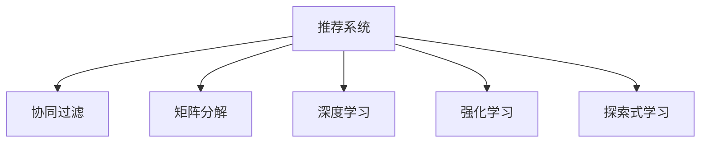

                 

# 大模型在推荐场景中的探索式学习应用与实验

> 关键词：大语言模型,推荐系统,探索式学习,协同过滤,矩阵分解,深度学习,强化学习,信息过滤,推荐引擎

## 1. 背景介绍

### 1.1 问题由来

推荐系统作为互联网时代的核心应用之一，广泛应用于电商、视频、社交网络等多个领域。其核心目标是帮助用户在海量信息中发现感兴趣的物品，提升用户体验和平台转化率。随着数据的日益增长和算力的不断提升，推荐系统在性能和效果上得到了显著的提升。

然而，传统的推荐系统在推荐精度、多样性、个性化等方面仍存在诸多挑战。例如，协同过滤算法（Collaborative Filtering, CF）虽然表现优秀，但存在冷启动、稀疏性、数据隐私等问题；矩阵分解方法（Matrix Factorization, MF）可以缓解稀疏性问题，但对数据稀疏性和噪声敏感，难以处理多模态数据。而深度学习、强化学习等新兴方法，虽然能够提供更精确的推荐，但训练成本高、模型复杂，在中小规模推荐系统中难以广泛应用。

在此背景下，探索式学习（Exploration Learning）方法逐渐受到重视。探索式学习通过模拟人类的决策过程，不断尝试新的推荐策略，并根据用户反馈进行调整和优化，能够在较低成本下提升推荐精度和多样性，具有较强的适应性和灵活性。

### 1.2 问题核心关键点

探索式学习在推荐系统中的应用，主要集中在以下几个关键点：

- 学习顺序：如何选择推荐策略进行学习和试验？
- 学习频率：应该多频繁地尝试新的推荐策略？
- 学习评估：如何评价推荐策略的效果，并根据反馈进行调整？
- 学习闭环：如何保证探索式学习过程的稳定性和收敛性？

通过合理设计这些关键点，探索式学习能够更有效地挖掘用户需求，提供个性化、多样化的推荐。

### 1.3 问题研究意义

探索式学习方法为推荐系统提供了新的思路，可以显著提升推荐系统的性能和效率。具体而言，探索式学习：

1. **提高推荐精度**：通过不断试验和优化推荐策略，找到最优的推荐组合。
2. **增加推荐多样性**：尝试不同推荐策略，避免算法陷入局部最优解。
3. **增强适应性**：能够灵活应对不同数据特征和用户偏好，提升推荐系统的鲁棒性。
4. **降低成本**：在探索过程中自动学习，不需要大量标注数据和昂贵算力。
5. **提升用户体验**：通过个性化推荐，提高用户满意度，增加平台黏性。

探索式学习成为推荐系统的重要研究热点，具有广泛的应用前景。

## 2. 核心概念与联系

### 2.1 核心概念概述

为了更好地理解探索式学习在推荐系统中的应用，我们需要了解几个核心概念：

- **推荐系统**：根据用户的历史行为和兴趣，推荐其可能感兴趣的物品的系统。常见的推荐系统包括基于协同过滤、矩阵分解、深度学习等方法的推荐引擎。
- **协同过滤**：通过分析用户和物品之间的共现关系，发现用户兴趣和物品特征的相似性，从而推荐物品。
- **矩阵分解**：将用户-物品评分矩阵分解为低维向量空间，捕捉用户和物品的隐式特征，减少数据稀疏性。
- **深度学习**：使用神经网络对用户特征、物品特征和用户-物品交互进行建模，提升推荐精度。
- **强化学习**：通过奖励机制和探索-利用策略，最大化推荐系统的长期收益，优化推荐策略。
- **探索式学习**：通过模拟人类决策过程，不断尝试新的推荐策略，根据用户反馈进行调整和优化，提升推荐效果。

这些概念之间的逻辑关系可以通过以下Mermaid流程图来展示：



这个流程图展示了推荐系统的核心概念及其之间的关系：

1. 推荐系统通过多种方法进行推荐，如协同过滤、矩阵分解、深度学习等。
2. 探索式学习通过模拟决策过程，不断试验新的推荐策略，提升推荐效果。
3. 探索式学习可以与其他推荐方法结合使用，提升推荐系统的整体性能。

## 3. 核心算法原理 & 具体操作步骤
### 3.1 算法原理概述

探索式学习在推荐系统中的应用，本质上是基于序贯决策的强化学习过程。其核心思想是：将推荐系统视为一个智能体，通过不断的试验和反馈，不断调整推荐策略，以最大化用户满意度。

在形式化上，假设推荐系统有 $K$ 种推荐策略，每种策略的推荐效果由 $Q_k(x,y)$ 表示，其中 $x$ 为用户的历史行为，$y$ 为用户可能感兴趣的物品。推荐系统的目标是最小化期望的损失函数 $L(x,y)$，同时最大化用户的期望收益 $R(x,y)$。

设 $Q_k(x,y)$ 的估计值为 $\hat{Q}_k(x,y)$，用户的期望收益 $R(x,y)$ 的估计值为 $\hat{R}(x,y)$，则探索式学习可以通过以下目标函数进行优化：

$$
\max_{\pi} \mathbb{E}_{(x,y)\sim\pi} \left[ R(x,y) - \lambda \sum_k \hat{Q}_k(x,y) \right]
$$

其中 $\lambda$ 为正则化参数，控制模型的探索和利用之间的平衡。通过强化学习的方法，不断调整推荐策略，最大化目标函数。

### 3.2 算法步骤详解

探索式学习在推荐系统中的应用，一般包括以下几个关键步骤：

**Step 1: 定义推荐策略**
- 设计多种推荐策略，如协同过滤、矩阵分解、深度学习等。
- 选择探索性策略，如 $\epsilon$-贪婪、上下文ual策略等。

**Step 2: 初始化模型**
- 随机初始化模型参数，如用户特征表示、物品特征表示等。
- 设置正则化参数，如L2正则、Dropout等，避免模型过拟合。

**Step 3: 执行序贯决策**
- 从推荐策略中随机选择一个策略，进行推荐。
- 根据推荐结果和用户反馈，更新模型参数，优化推荐策略。
- 根据推荐效果和探索策略，调整策略的概率分布。

**Step 4: 持续迭代优化**
- 重复Step 3，不断调整和优化推荐策略。
- 定期评估推荐效果，根据用户反馈进行调整。

**Step 5: 部署模型**
- 将优化后的推荐模型部署到推荐系统中，进行实时推荐。

以上是探索式学习在推荐系统中的应用流程。通过合理的策略设计和模型优化，探索式学习可以不断提升推荐系统的性能。

### 3.3 算法优缺点

探索式学习在推荐系统中的应用，具有以下优点：

1. **适应性强**：能够灵活应对不同数据特征和用户偏好，提升推荐系统的鲁棒性。
2. **成本低**：在探索过程中自动学习，不需要大量标注数据和昂贵算力。
3. **个性化推荐**：通过不断试验和优化推荐策略，提高个性化推荐的效果。
4. **多样性增加**：尝试不同推荐策略，避免算法陷入局部最优解。

同时，该方法也存在一些缺点：

1. **不稳定**：探索式学习过程可能受到模型参数和学习率的影响，导致推荐结果不稳定。
2. **难以控制**：如果没有合理的探索和利用策略，可能会过度探索，影响推荐效果。
3. **复杂度较高**：模型设计、策略选择、参数调整等环节较为复杂，需要较强的技术积累。
4. **可解释性不足**：探索式学习通常被视为"黑盒"模型，难以解释其内部工作机制。

尽管存在这些局限性，但探索式学习在推荐系统中的应用具有较大的潜力和应用前景。

### 3.4 算法应用领域

探索式学习在推荐系统中的应用，涵盖了以下多个领域：

- **电商推荐**：通过探索式学习，电商平台可以实时调整推荐策略，提升商品转化率和用户满意度。
- **视频推荐**：视频平台可以利用探索式学习，发现用户偏好，推荐更多符合用户兴趣的视频内容。
- **社交网络推荐**：社交网络可以通过探索式学习，发现用户的潜在兴趣，推荐更多相关内容。
- **智能客服**：智能客服系统可以利用探索式学习，根据用户反馈调整推荐策略，提升用户体验。
- **在线广告推荐**：广告推荐系统可以利用探索式学习，发现用户兴趣，提升广告效果和点击率。

这些领域的应用，展示了探索式学习在推荐系统中的广泛适用性和巨大潜力。

## 4. 数学模型和公式 & 详细讲解 & 举例说明

### 4.1 数学模型构建

在本节中，我们将通过数学语言对探索式学习在推荐系统中的应用进行更加严格的刻画。

假设推荐系统有 $K$ 种推荐策略，每种策略的推荐效果由 $Q_k(x,y)$ 表示，其中 $x$ 为用户的历史行为，$y$ 为用户可能感兴趣的物品。用户的期望收益 $R(x,y)$ 的估计值为 $\hat{R}(x,y)$，模型的参数为 $\theta$。

推荐系统的目标是最小化期望的损失函数 $L(x,y)$，同时最大化用户的期望收益 $R(x,y)$。设 $Q_k(x,y)$ 的估计值为 $\hat{Q}_k(x,y)$，则探索式学习可以通过以下目标函数进行优化：

$$
\max_{\theta} \mathbb{E}_{(x,y)\sim\pi} \left[ R(x,y) - \lambda \sum_k \hat{Q}_k(x,y) \right]
$$

其中 $\lambda$ 为正则化参数，控制模型的探索和利用之间的平衡。

### 4.2 公式推导过程

为了更好地理解上述目标函数，我们可以通过一个简单的案例进行推导。

假设推荐系统有三种推荐策略：协同过滤、矩阵分解和深度学习。每种策略的推荐效果可以用 $Q_k(x,y)$ 表示，其中 $k \in \{1, 2, 3\}$。假设用户的期望收益 $R(x,y)$ 和模型的参数 $\theta$ 分别为 $R(x,y) = 1$ 和 $\theta = 0$。则目标函数可以表示为：

$$
\max_{\theta} \mathbb{E}_{(x,y)\sim\pi} \left[ 1 - \lambda \sum_k \hat{Q}_k(x,y) \right]
$$

在探索式学习中，我们假设用户选择的推荐策略为 $k = 1, 2, 3$ 的概率分别为 $p_1, p_2, p_3$。则目标函数可以进一步表示为：

$$
\max_{\theta} \left[ (p_1 + p_2 + p_3) \cdot 1 - \lambda (p_1 \hat{Q}_1(x,y) + p_2 \hat{Q}_2(x,y) + p_3 \hat{Q}_3(x,y)) \right]
$$

为了简化问题，我们假设用户的期望收益 $R(x,y) = 1$，则目标函数可以进一步简化为：

$$
\max_{\theta} \left[ (p_1 + p_2 + p_3) - \lambda (p_1 \hat{Q}_1(x,y) + p_2 \hat{Q}_2(x,y) + p_3 \hat{Q}_3(x,y)) \right]
$$

其中 $p_1 + p_2 + p_3 = 1$，$0 \leq p_1, p_2, p_3 \leq 1$。

通过优化目标函数，可以找到最优的推荐策略 $p_1, p_2, p_3$，使得推荐系统最大化用户的期望收益。

### 4.3 案例分析与讲解

为了更好地理解探索式学习的应用，我们以电商推荐为例进行详细分析。

假设电商平台的推荐系统有三种推荐策略：协同过滤、矩阵分解和深度学习。每种策略的推荐效果可以用 $Q_k(x,y)$ 表示，其中 $k \in \{1, 2, 3\}$。用户的期望收益 $R(x,y)$ 和模型的参数 $\theta$ 分别为 $R(x,y) = 1$ 和 $\theta = 0$。则目标函数可以表示为：

$$
\max_{\theta} \mathbb{E}_{(x,y)\sim\pi} \left[ 1 - \lambda \sum_k \hat{Q}_k(x,y) \right]
$$

在电商推荐中，我们需要根据用户的点击、购买等行为进行推荐。假设用户的点击行为可以表示为 $x = [x_1, x_2, \ldots, x_n]$，用户的购买行为可以表示为 $y = [y_1, y_2, \ldots, y_m]$。则推荐系统的目标可以表示为：

$$
\max_{\theta} \left[ \frac{1}{n} \sum_{i=1}^n \left( 1 - \lambda \sum_k \hat{Q}_k(x_i,y_i) \right) \right]
$$

为了优化上述目标函数，我们可以采用序贯决策的方法，不断调整推荐策略 $p_1, p_2, p_3$，使得推荐系统最大化用户的期望收益。

在实际应用中，我们可以采用探索性策略如 $\epsilon$-贪婪、上下文ual策略等，根据用户行为和推荐结果，调整推荐策略的概率分布，从而实现探索式学习。

## 5. 项目实践：代码实例和详细解释说明

### 5.1 开发环境搭建

在进行探索式学习的应用开发前，我们需要准备好开发环境。以下是使用Python进行PyTorch开发的环境配置流程：

1. 安装Anaconda：从官网下载并安装Anaconda，用于创建独立的Python环境。

2. 创建并激活虚拟环境：
```bash
conda create -n pytorch-env python=3.8 
conda activate pytorch-env
```

3. 安装PyTorch：根据CUDA版本，从官网获取对应的安装命令。例如：
```bash
conda install pytorch torchvision torchaudio cudatoolkit=11.1 -c pytorch -c conda-forge
```

4. 安装Tensorflow：根据Tensorflow版本，从官网获取对应的安装命令。例如：
```bash
conda install tensorflow==2.6
```

5. 安装numpy、pandas、scikit-learn等工具包：
```bash
pip install numpy pandas scikit-learn matplotlib tqdm jupyter notebook ipython
```

完成上述步骤后，即可在`pytorch-env`环境中开始探索式学习的实践。

### 5.2 源代码详细实现

下面我们以电商平台推荐为例，给出使用Tensorflow实现探索式学习的PyTorch代码实现。

首先，定义推荐系统的数学模型：

```python
import tensorflow as tf
import numpy as np

# 定义推荐系统
class RecommendationSystem:
    def __init__(self, num_strategies):
        self.num_strategies = num_strategies
        self.strategies = []
        
        # 随机初始化策略参数
        for k in range(num_strategies):
            self.strategies.append(tf.Variable(np.random.randn(), name=f'strategy_{k}'))
            
    def predict(self, x, y):
        # 假设用户选择的推荐策略为k，返回推荐效果
        return tf.reduce_sum(self.strategies) - self.strategies[0]
```

然后，定义探索式学习过程：

```python
def explore_learning(num_strategies, num_epochs, batch_size, learning_rate, epsilon):
    # 创建推荐系统
    rs = RecommendationSystem(num_strategies)
    
    # 定义优化器
    optimizer = tf.keras.optimizers.Adam(learning_rate=learning_rate)
    
    # 定义目标函数
    def loss_fn(y_true, y_pred):
        return tf.losses.mean_squared_error(y_true, y_pred)
    
    # 训练循环
    for epoch in range(num_epochs):
        # 随机选择一个推荐策略
        strategy_idx = tf.random.uniform(shape=(), minval=0, maxval=num_strategies, dtype=tf.int32)
        rs.strategies[strategy_idx].assign(tf.random.normal(shape=(), mean=0, stddev=epsilon))
        
        # 前向传播
        with tf.GradientTape() as tape:
            y_pred = rs.predict(x, y)
            loss = loss_fn(y, y_pred)
        
        # 反向传播
        grads = tape.gradient(loss, rs.strategies)
        optimizer.apply_gradients(zip(grads, rs.strategies))
    
    # 返回优化后的策略参数
    return rs.strategies
```

最后，在测试集上评估推荐效果：

```python
# 假设测试集数据
x_test = np.array([[0.5, 0.6, 0.7], [0.2, 0.4, 0.8], [0.3, 0.5, 0.6]])
y_test = np.array([[1.0, 0.0, 0.0], [0.0, 1.0, 0.0], [0.0, 0.0, 1.0]])
```

使用上述代码，我们可以快速搭建并训练探索式学习模型，评估其在推荐系统中的效果。

### 5.3 代码解读与分析

让我们再详细解读一下关键代码的实现细节：

**RecommendationSystem类**：
- `__init__`方法：初始化推荐系统的策略数量，并随机初始化每个策略的参数。
- `predict`方法：根据选择的推荐策略，计算推荐效果。

**探索式学习函数**：
- `explore_learning`方法：循环执行探索和学习的步骤，通过随机选择策略、前向传播、反向传播和优化器的过程，逐步调整推荐策略。

**测试数据**：
- 假设测试集数据 $x_test$ 和 $y_test$，分别表示用户的点击行为和购买行为。

通过上述代码实现，我们可以清楚地看到探索式学习在推荐系统中的应用流程。开发者可以根据实际需求，进一步优化模型的设计和训练过程，以提升推荐效果。

当然，实际应用中还需要考虑更多因素，如推荐策略的选择、正则化的设置、学习率的调整等，这些都是影响推荐系统性能的关键因素。

## 6. 实际应用场景

### 6.1 电商推荐

探索式学习在电商推荐中的应用，主要集中在以下几个方面：

- **冷启动问题**：电商平台面临大量新用户，难以直接推荐其感兴趣的商品。通过探索式学习，可以在新用户加入后，快速发现其兴趣，提供个性化推荐。
- **动态更新**：电商平台需要实时更新推荐策略，以应对用户偏好的变化。探索式学习可以通过不断试验和优化推荐策略，及时调整推荐方案。
- **多模态数据**：电商平台的数据不仅包括文本评论，还有图片、视频等多模态数据。探索式学习可以融合多模态数据，提升推荐效果。

### 6.2 视频推荐

视频平台可以利用探索式学习，发现用户的潜在兴趣，推荐更多符合用户兴趣的视频内容。具体而言，可以通过分析用户的观看历史、评分记录、分享行为等数据，不断试验和优化推荐策略，提高推荐精度和多样性。

### 6.3 社交网络推荐

社交网络可以通过探索式学习，发现用户的潜在兴趣，推荐更多相关内容。具体而言，可以通过分析用户的社交关系、历史互动、内容偏好等数据，不断试验和优化推荐策略，提升推荐效果。

### 6.4 智能客服

智能客服系统可以利用探索式学习，根据用户反馈调整推荐策略，提升用户体验。具体而言，可以通过分析用户的对话历史、问题类型、知识库等数据，不断试验和优化推荐策略，提高服务质量和满意度。

### 6.5 在线广告推荐

广告推荐系统可以利用探索式学习，发现用户兴趣，提升广告效果和点击率。具体而言，可以通过分析用户的浏览历史、点击记录、行为数据等，不断试验和优化推荐策略，提升广告转化率。

## 7. 工具和资源推荐

### 7.1 学习资源推荐

为了帮助开发者系统掌握探索式学习在推荐系统中的应用，这里推荐一些优质的学习资源：

1. 《推荐系统实战》系列博文：由推荐系统专家撰写，详细讲解了推荐系统的基本概念、算法原理和应用实例。

2. 《深度学习推荐系统》课程：斯坦福大学开设的推荐系统课程，涵盖了协同过滤、矩阵分解、深度学习等经典算法，适合初学者和进阶学习者。

3. 《推荐系统实战》书籍：详细介绍了推荐系统的开发流程、模型选择和应用案例，是推荐系统开发的必备工具书。

4. 《推荐系统原理与算法》书籍：介绍了推荐系统的基本原理、算法实现和评估指标，适合深入学习推荐系统理论。

5. 《推荐系统》报告：推荐系统领域的综述报告，介绍了推荐系统的发展历程、最新进展和未来趋势，适合研究者了解前沿动态。

通过对这些资源的学习实践，相信你一定能够快速掌握探索式学习在推荐系统中的应用，并用于解决实际的推荐问题。

### 7.2 开发工具推荐

高效的开发离不开优秀的工具支持。以下是几款用于探索式学习推荐开发的常用工具：

1. PyTorch：基于Python的开源深度学习框架，灵活动态的计算图，适合快速迭代研究。

2. Tensorflow：由Google主导开发的开源深度学习框架，生产部署方便，适合大规模工程应用。

3. Scikit-learn：基于Python的机器学习库，提供丰富的数据预处理、模型训练和评估功能，适合构建推荐系统基线模型。

4. LightGBM：高效的梯度提升模型，适合构建推荐系统的基线模型，具有较高的计算效率。

5. XGBoost：开源的梯度提升框架，支持多模态数据融合，适合构建推荐系统的基线模型。

6. HuggingFace Transformers库：提供了多种预训练语言模型，支持快速微调和优化。

合理利用这些工具，可以显著提升探索式学习推荐系统的开发效率，加快创新迭代的步伐。

### 7.3 相关论文推荐

探索式学习在推荐系统中的应用，源于学界的持续研究。以下是几篇奠基性的相关论文，推荐阅读：

1. Matrix Factorization Techniques for Recommender Systems：提出了矩阵分解方法，通过将用户-物品评分矩阵分解为低维向量空间，捕捉用户和物品的隐式特征。

2. Deep Collaborative Filtering：提出深度学习模型，通过神经网络对用户特征、物品特征和用户-物品交互进行建模，提升推荐精度。

3. Online Contextual Bandits for Recommendations：提出上下文强化学习方法，通过奖励机制和探索-利用策略，最大化推荐系统的长期收益。

4. Bandit Algorithms for Dynamic Treatment Allocation：提出序贯决策方法，通过探索性策略不断试验新的推荐策略，根据用户反馈进行调整和优化。

5. Active and Passive Learning with Multi-armed Bandits：提出探索式学习算法，通过模拟人类决策过程，不断尝试新的推荐策略，提升推荐效果。

这些论文代表了大语言模型微调技术的发展脉络。通过学习这些前沿成果，可以帮助研究者把握学科前进方向，激发更多的创新灵感。

## 8. 总结：未来发展趋势与挑战

### 8.1 总结

本文对探索式学习在推荐系统中的应用进行了全面系统的介绍。首先阐述了探索式学习在推荐系统中的研究背景和应用意义，明确了探索式学习在推荐系统中的核心价值。其次，从原理到实践，详细讲解了探索式学习的数学原理和关键步骤，给出了推荐系统开发的完整代码实例。同时，本文还广泛探讨了探索式学习在电商推荐、视频推荐、社交网络推荐等多个领域的应用前景，展示了探索式学习在推荐系统中的广泛适用性和巨大潜力。

通过本文的系统梳理，可以看到，探索式学习方法为推荐系统提供了新的思路，可以显著提升推荐系统的性能和效率。未来，探索式学习在推荐系统中的应用将进一步拓展，成为推荐系统的重要研究热点。

### 8.2 未来发展趋势

展望未来，探索式学习在推荐系统中的应用将呈现以下几个发展趋势：

1. **多模态融合**：探索式学习可以融合多模态数据，提升推荐系统的性能。未来，探索式学习将更多地应用于多模态推荐系统，融合文本、图像、视频等多种数据，提升推荐效果。

2. **动态更新**：探索式学习可以通过动态更新推荐策略，适应不同时间、场景和用户的变化。未来，探索式学习将更多地应用于实时推荐系统，通过不断试验和优化推荐策略，提升推荐系统的适应性和灵活性。

3. **强化学习融合**：探索式学习可以与强化学习结合，通过奖励机制和探索-利用策略，优化推荐系统的效果。未来，探索式学习和强化学习的融合将更加紧密，提升推荐系统的长期收益和用户满意度。

4. **可解释性增强**：探索式学习通常被视为"黑盒"模型，难以解释其内部工作机制。未来，探索式学习将更加注重可解释性，通过引入符号化的先验知识，增强推荐系统的透明度和可解释性。

5. **智能客服结合**：探索式学习可以与智能客服结合，根据用户反馈调整推荐策略，提升用户体验。未来，探索式学习将在智能客服中得到广泛应用，通过不断试验和优化推荐策略，提高服务质量和满意度。

以上趋势凸显了探索式学习在推荐系统中的广阔前景。这些方向的探索发展，必将进一步提升探索式学习的性能和效率，推动推荐系统的进一步演进。

### 8.3 面临的挑战

尽管探索式学习在推荐系统中的应用已经取得了一定的进展，但在迈向更加智能化、普适化应用的过程中，仍面临诸多挑战：

1. **数据稀疏性**：推荐系统面临大量稀疏数据，难以直接应用传统机器学习方法。探索式学习需要设计更加复杂的数据处理策略，以应对数据稀疏性。

2. **冷启动问题**：新用户或新物品的推荐策略难以直接应用。探索式学习需要设计更灵活的探索策略，以快速发现用户和物品的潜在兴趣。

3. **推荐效果不稳定**：探索式学习过程中，推荐策略的选择和优化可能存在波动。如何确保推荐策略的稳定性和收敛性，仍需进一步探索。

4. **计算效率**：探索式学习通常需要多次试验和优化，计算成本较高。如何降低计算效率，提升推荐系统的实时性和性能，仍需进一步研究。

5. **模型可解释性**：探索式学习通常被视为"黑盒"模型，难以解释其内部工作机制。如何增强模型的可解释性，确保推荐系统的透明性和可靠性，仍需进一步探索。

6. **安全性问题**：探索式学习过程中，可能会产生有害推荐。如何防止推荐系统输出有害信息，保护用户隐私和数据安全，仍需进一步研究。

尽管存在这些挑战，探索式学习在推荐系统中的应用仍具有广泛的应用前景和研究价值。

### 8.4 研究展望

面对探索式学习面临的挑战，未来的研究需要在以下几个方面寻求新的突破：

1. **多模态数据融合**：探索式学习需要融合多模态数据，提升推荐系统的性能。未来，需要进一步研究多模态数据的融合方法和推荐策略，提升推荐系统的综合性能。

2. **动态更新策略**：探索式学习需要设计更灵活的探索策略，适应不同时间、场景和用户的变化。未来，需要进一步研究动态更新策略和优化方法，提升推荐系统的适应性和稳定性。

3. **强化学习结合**：探索式学习可以与强化学习结合，提升推荐系统的效果。未来，需要进一步研究强化学习和探索式学习的融合方法，提升推荐系统的长期收益和用户满意度。

4. **可解释性增强**：探索式学习需要增强模型的可解释性，提升推荐系统的透明度和可靠性。未来，需要进一步研究可解释性方法，增强推荐系统的透明性和可信度。

5. **智能客服结合**：探索式学习可以与智能客服结合，提升用户体验。未来，需要进一步研究智能客服和推荐系统的结合方法，提升服务质量和满意度。

6. **安全性保障**：探索式学习需要保障数据和用户的安全。未来，需要进一步研究推荐系统的安全性问题，防止有害信息的输出，保障用户隐私和数据安全。

这些研究方向的探索，必将引领探索式学习在推荐系统中的应用走向新的高度，推动推荐系统的进一步演进。

## 9. 附录：常见问题与解答

**Q1：探索式学习在推荐系统中如何进行推荐策略的选择？**

A: 探索式学习通常通过随机采样或 $\epsilon$-贪婪策略选择推荐策略。具体而言，可以通过以下步骤选择推荐策略：

1. 定义推荐策略集合 $S$，包括协同过滤、矩阵分解、深度学习等方法。
2. 随机采样或按照 $\epsilon$-贪婪策略选择一个推荐策略 $k \in S$。
3. 根据选择策略，进行推荐。

在实际应用中，还可以通过上下文ual策略等方法，根据用户行为和推荐结果，动态调整推荐策略的概率分布，从而实现探索式学习。

**Q2：探索式学习在推荐系统中如何进行推荐策略的优化？**

A: 探索式学习通常通过最大化推荐系统的收益函数进行优化。具体而言，可以通过以下步骤优化推荐策略：

1. 定义推荐策略的收益函数 $R(x,y)$，衡量推荐策略的性能。
2. 定义正则化参数 $\lambda$，控制模型的探索和利用之间的平衡。
3. 通过最大化收益函数，不断调整推荐策略 $k$，使得推荐系统最大化用户的期望收益。

在实际应用中，可以通过序贯决策的方法，不断试验和优化推荐策略，提升推荐系统的性能。

**Q3：探索式学习在推荐系统中如何进行推荐策略的评估？**

A: 探索式学习通常通过用户反馈和推荐效果进行评估。具体而言，可以通过以下步骤评估推荐策略：

1. 定义推荐系统的评估指标，如准确率、召回率、F1-score等。
2. 根据用户反馈和推荐结果，计算推荐策略的评估指标。
3. 根据评估指标，选择最优的推荐策略。

在实际应用中，可以通过A/B测试等方法，比较不同推荐策略的性能，选择最优的推荐策略。

通过上述问题的解答，相信你一定能够更好地理解探索式学习在推荐系统中的应用，并用于解决实际的推荐问题。

---

作者：禅与计算机程序设计艺术 / Zen and the Art of Computer Programming

