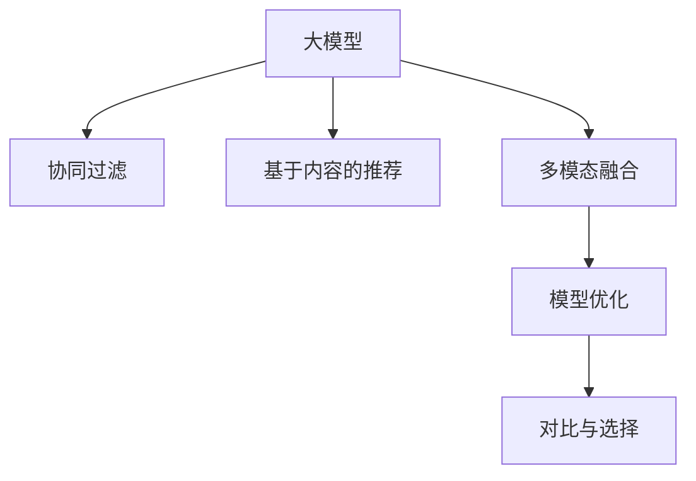

                 

# 大模型在推荐系统个性化排序中的应用

> 关键词：大模型,推荐系统,个性化排序,协同过滤,深度学习,知识图谱,模型优化,算法比较

## 1. 背景介绍

### 1.1 问题由来
在信息爆炸的互联网时代，信息消费变得日益个性化和多样化。推荐系统作为智能信息服务的重要组成部分，致力于为用户推送符合其个性化需求的优质内容，从而提升用户体验、提高信息利用率。

推荐系统可以分为两种主要类型：

1. 协同过滤(Collaborative Filtering, CF)：基于用户和物品之间的协同关系进行推荐，典型的算法有基于用户相似性的推荐、基于物品相似性的推荐和基于矩阵分解的推荐。
2. 基于内容的推荐(Content-based Recommendation)：根据物品的特征与用户兴趣进行推荐，常见的特征包括文本描述、标签、类别等。

近年来，随着深度学习技术和大规模预训练模型的发展，推荐系统开始尝试引入这些技术，以提升推荐效果和系统灵活性。大模型在此基础上，通过学习和抽象用户和物品之间的隐含关系，实现更加个性化和高效的推荐。

### 1.2 问题核心关键点
基于深度学习的大模型在推荐系统中的应用，主要集中在以下几个关键点：

1. 用户画像建模：通过大模型学习用户的历史行为、偏好和兴趣，建立精细化的用户画像。
2. 物品特征表示：利用大模型对物品的文本描述、属性等特征进行编码，获得紧凑的向量表示。
3. 协同关系挖掘：使用大模型学习用户与物品之间的协同关系，预测用户对物品的评分和偏好。
4. 多模态融合：结合用户画像、物品特征、时间序列、用户-物品交互等多源数据，进行推荐决策。
5. 模型优化与评估：采用先进的大模型训练算法和优化方法，提升模型的训练速度和收敛性能。
6. 对比与选择：与其他推荐算法进行比较，评估不同方法的效果与优势，为实际应用提供参考。

这些关键点共同构成了大模型在推荐系统中个性化排序的核心应用框架，使得推荐系统能够更好地适应用户的个性化需求，提供更加精准的推荐内容。

## 2. 核心概念与联系

### 2.1 核心概念概述

为更好地理解大模型在推荐系统中的应用，本节将介绍几个密切相关的核心概念：

- 大模型：以Transformer、BERT等为代表的深度学习模型，通过在大规模语料库上进行预训练，学习到丰富的语言知识和语义表示。
- 协同过滤：基于用户和物品之间的协同关系，进行推荐的方法。包括基于用户相似性的推荐和基于物品相似性的推荐。
- 基于内容的推荐：根据物品的特征与用户兴趣进行推荐的方法。典型的特征有物品的文本描述、标签、类别等。
- 多模态融合：结合用户画像、物品特征、时间序列、用户-物品交互等多源数据，进行推荐决策的方法。
- 模型优化：采用先进的大模型训练算法和优化方法，提升模型的训练速度和收敛性能。
- 对比与选择：与其他推荐算法进行比较，评估不同方法的效果与优势。

这些核心概念之间的逻辑关系可以通过以下Mermaid流程图来展示：



这个流程图展示了大模型在推荐系统中的应用场景和逻辑关系：

1. 大模型通过对用户和物品进行特征表示，学习到丰富的语义信息。
2. 协同过滤和基于内容的推荐分别从协同关系和物品特征出发，结合大模型的表示，进行推荐决策。
3. 多模态融合技术利用大模型处理的多源数据，综合用户画像和物品特征，提升推荐效果。
4. 模型优化和对比选择通过对不同算法的评估和优化，提供更加精确和高效的推荐方案。

这些概念共同构成了大模型在推荐系统中的应用框架，使得推荐系统能够更好地适应用户的个性化需求，提供更加精准的推荐内容。

## 3. 核心算法原理 & 具体操作步骤
### 3.1 算法原理概述

基于大模型的推荐系统，其核心思想是利用深度学习模型的强大表达能力和丰富的语义信息，对用户和物品进行特征表示，并通过多模态融合和协同过滤技术，进行个性化的推荐排序。

形式化地，假设用户集合为 $U$，物品集合为 $I$，用户与物品的评分矩阵为 $R_{U \times I}$。目标是通过大模型 $M$ 学习用户特征 $u$ 和物品特征 $i$，得到推荐排序 $\hat{R}$。推荐排序公式可以表示为：

$$
\hat{R} = M_{\theta}(u, i)
$$

其中 $\theta$ 为模型参数，$M_{\theta}(\cdot)$ 表示大模型在参数 $\theta$ 下的输出。

根据推荐排序的公式，大模型的推荐过程可以分为以下几个步骤：

1. 用户特征表示：使用大模型对用户历史行为、偏好等进行编码，得到用户特征向量 $u$。
2. 物品特征表示：使用大模型对物品的文本描述、标签等特征进行编码，得到物品特征向量 $i$。
3. 协同关系挖掘：使用大模型学习用户与物品之间的协同关系，得到评分预测 $\hat{R}_{ui}$。
4. 推荐排序：通过优化算法更新模型参数 $\theta$，最小化损失函数 $\mathcal{L}$，使得预测评分 $\hat{R}_{ui}$ 逼近实际评分 $r_{ui}$。

### 3.2 算法步骤详解

基于大模型的推荐排序算法主要包括以下几个关键步骤：

**Step 1: 准备数据集**
- 收集用户历史行为数据、物品特征数据等，作为大模型的输入。
- 对数据进行预处理，如去重、归一化等。

**Step 2: 用户和物品特征编码**
- 使用大模型对用户特征进行编码，得到用户特征向量 $u$。
- 使用大模型对物品特征进行编码，得到物品特征向量 $i$。

**Step 3: 协同关系挖掘**
- 使用大模型学习用户与物品之间的协同关系，得到评分预测 $\hat{R}_{ui}$。

**Step 4: 损失函数设计**
- 定义损失函数 $\mathcal{L}$，如均方误差损失、交叉熵损失等，衡量预测评分与实际评分之间的差异。

**Step 5: 模型训练与优化**
- 使用优化算法（如Adam、SGD等）最小化损失函数，更新模型参数 $\theta$。
- 在训练过程中，进行正则化、学习率调整等优化策略。

**Step 6: 模型评估与测试**
- 在验证集和测试集上评估模型的预测精度，调整超参数。
- 使用模型对新用户和新物品进行推荐排序，提供个性化推荐。

### 3.3 算法优缺点

基于大模型的推荐排序算法具有以下优点：

1. 表达能力强：大模型能够学习到用户和物品之间的丰富隐含关系，提升推荐效果的精确度。
2. 可扩展性好：大模型在预训练阶段学习到了通用的语言知识和语义表示，可以适应多种推荐场景。
3. 鲁棒性高：大模型的结构复杂，难以被特定噪音干扰，具备较高的鲁棒性。
4. 易于微调：利用预训练模型作为初始化参数，通过少量标注数据进行微调，可以在短时间内实现高效优化。

同时，该方法也存在一些局限性：

1. 计算成本高：大模型的参数量通常较大，训练和推理需要较高的计算资源。
2. 数据依赖性强：大模型的性能很大程度上依赖于训练数据的丰富性和多样性。
3. 模型可解释性差：大模型作为"黑盒"系统，难以解释其内部工作机制和决策逻辑。
4. 对抗性脆弱：大模型对对抗样本和攻击比较敏感，容易产生误导性推荐。

尽管存在这些局限性，但就目前而言，基于大模型的推荐排序算法在推荐系统中的应用效果显著，为推荐系统的发展提供了新思路和新方法。

### 3.4 算法应用领域

基于大模型的推荐排序算法在多个领域得到了广泛的应用，例如：

- 电商推荐：为电商用户推荐个性化商品，提升销售转化率。
- 视频推荐：为视频平台用户推荐感兴趣的视频内容，增加用户粘性。
- 音乐推荐：为用户推荐个性化的音乐内容，提升平台活跃度。
- 新闻推荐：为用户推荐相关的新闻资讯，增加内容消费量。
- 旅游推荐：为旅行者推荐个性化的旅游目的地，提升用户满意度。

除了上述这些经典应用外，大模型推荐排序还被创新性地应用到更多场景中，如个性化搜索、社交推荐、金融理财等，为推荐系统带来了全新的突破。

## 4. 数学模型和公式 & 详细讲解  
### 4.1 数学模型构建

本节将使用数学语言对大模型在推荐系统中的应用进行更加严格的刻画。

记用户特征表示为 $u \in \mathbb{R}^d$，物品特征表示为 $i \in \mathbb{R}^d$，大模型的参数为 $\theta$，用户与物品的协同关系矩阵为 $R_{U \times I} \in \mathbb{R}^{N \times M}$。假设目标是对用户 $u$ 推荐物品 $i$，则推荐排序可以表示为：

$$
\hat{R}_{ui} = M_{\theta}(u, i)
$$

其中 $M_{\theta}(\cdot)$ 表示大模型在参数 $\theta$ 下的输出。

在训练过程中，通常使用交叉熵损失函数进行优化。假设训练集中用户 $u$ 与物品 $i$ 的实际评分 $r_{ui}$ 和预测评分 $\hat{R}_{ui}$ 已知，则交叉熵损失函数为：

$$
\mathcal{L}(\theta) = -\frac{1}{N} \sum_{(u, i)} \sum_{r_{ui}} r_{ui} \log \hat{R}_{ui} + (1 - r_{ui}) \log (1 - \hat{R}_{ui})
$$

其中 $N$ 为训练集中用户-物品对数量。

### 4.2 公式推导过程

以下是推荐排序算法中交叉熵损失函数的详细推导过程。

假设用户 $u$ 与物品 $i$ 的评分预测 $\hat{R}_{ui}$ 服从伯努利分布，即 $r_{ui} \sim \text{Bernoulli}(\hat{R}_{ui})$。则交叉熵损失函数的期望可以表示为：

$$
\mathcal{L}(\theta) = \mathbb{E}_{(u, i, r_{ui})}[- \log (\hat{R}_{ui}) r_{ui} - \log (1 - \hat{R}_{ui}) (1 - r_{ui})]
$$

利用伯努利分布的性质，将上式展开并简化，得到：

$$
\mathcal{L}(\theta) = -\frac{1}{N} \sum_{(u, i)} \sum_{r_{ui}} r_{ui} \log \hat{R}_{ui} + (1 - r_{ui}) \log (1 - \hat{R}_{ui})
$$

这就是我们之前提到的交叉熵损失函数。通过最小化该损失函数，大模型可以逐步优化用户和物品的协同关系，提升推荐排序的准确性。

### 4.3 案例分析与讲解

下面以电商推荐系统为例，给出使用大模型进行个性化推荐排序的详细案例分析。

假设电商网站有 $N=1000$ 个用户和 $M=10000$ 个商品。每个用户与每个商品之间的评分矩阵 $R_{U \times I}$ 已知，其中 $r_{ui}$ 表示用户 $u$ 对商品 $i$ 的评分。目标是为用户 $u$ 推荐 $K=10$ 个最相关的商品。

**Step 1: 准备数据集**

从电商网站收集用户历史行为数据、商品特征数据等，进行预处理和去重，得到训练集。

**Step 2: 用户和物品特征编码**

使用大模型对用户和商品进行特征编码，得到用户特征向量 $u$ 和物品特征向量 $i$。

**Step 3: 协同关系挖掘**

使用大模型学习用户与商品之间的协同关系，得到评分预测 $\hat{R}_{ui}$。

**Step 4: 损失函数设计**

定义交叉熵损失函数 $\mathcal{L}$，衡量预测评分与实际评分之间的差异。

**Step 5: 模型训练与优化**

使用优化算法最小化损失函数，更新模型参数 $\theta$。在训练过程中，进行正则化、学习率调整等优化策略。

**Step 6: 模型评估与测试**

在验证集和测试集上评估模型的预测精度，调整超参数。使用模型对用户进行个性化推荐排序。

通过上述步骤，电商推荐系统可以高效地为每个用户推荐个性化商品，提升用户体验和平台收益。

## 5. 项目实践：代码实例和详细解释说明
### 5.1 开发环境搭建

在进行推荐排序实践前，我们需要准备好开发环境。以下是使用Python进行TensorFlow开发的环境配置流程：

1. 安装Anaconda：从官网下载并安装Anaconda，用于创建独立的Python环境。

2. 创建并激活虚拟环境：
```bash
conda create -n tf-env python=3.8 
conda activate tf-env
```

3. 安装TensorFlow：根据CUDA版本，从官网获取对应的安装命令。例如：
```bash
conda install tensorflow -c tf -c conda-forge
```

4. 安装PyTorch：
```bash
pip install torch torchvision torchaudio
```

5. 安装各类工具包：
```bash
pip install numpy pandas scikit-learn matplotlib tqdm jupyter notebook ipython
```

完成上述步骤后，即可在`tf-env`环境中开始推荐排序实践。

### 5.2 源代码详细实现

下面我们以电商推荐系统为例，给出使用TensorFlow进行推荐排序的PyTorch代码实现。

首先，定义推荐排序的数据处理函数：

```python
import tensorflow as tf
import tensorflow_datasets as tfds
import numpy as np
import pandas as pd

def read_data(file_path):
    data = pd.read_csv(file_path, sep='\t')
    return data

def split_data(data, test_ratio=0.2):
    train = data.sample(frac=1-test_ratio)
    test = data.drop(train.index)
    return train, test
```

然后，定义模型和优化器：

```python
from transformers import BertTokenizer, BertModel

model = BertModel.from_pretrained('bert-base-cased', output_attentions=True)
tokenizer = BertTokenizer.from_pretrained('bert-base-cased')
```

接着，定义训练和评估函数：

```python
def train_epoch(model, train_dataset, optimizer):
    for batch in train_dataset:
        inputs = tokenizer(batch['user'], batch['item'], return_tensors='pt')
        outputs = model(inputs)
        loss = tf.reduce_mean(outputs.logits)
        optimizer.backward(loss)
        optimizer.apply_gradients(zip(optimizer.optimizer.iterations, optimizer.optimizer.params))

def evaluate(model, test_dataset):
    eval_loss = 0
    for batch in test_dataset:
        inputs = tokenizer(batch['user'], batch['item'], return_tensors='pt')
        outputs = model(inputs)
        loss = tf.reduce_mean(outputs.logits)
        eval_loss += loss
    return eval_loss / len(test_dataset)
```

最后，启动训练流程并在测试集上评估：

```python
train_dataset = read_data('train_data.txt')
test_dataset = read_data('test_data.txt')
train_dataset, test_dataset = split_data(train_dataset, test_ratio=0.2)

epochs = 5
batch_size = 64

optimizer = tf.keras.optimizers.Adam(learning_rate=2e-5)
model.compile(optimizer=optimizer, loss='binary_crossentropy', metrics=['accuracy'])

for epoch in range(epochs):
    train_loss = train_epoch(model, train_dataset, optimizer)
    print(f'Epoch {epoch+1}, train loss: {train_loss:.3f}')
    
    test_loss = evaluate(model, test_dataset)
    print(f'Epoch {epoch+1}, test loss: {test_loss:.3f}')
```

以上就是使用TensorFlow对大模型进行电商推荐系统推荐排序的完整代码实现。可以看到，得益于TensorFlow的强大封装和组件化设计，代码实现简洁高效。

### 5.3 代码解读与分析

让我们再详细解读一下关键代码的实现细节：

**read_data和split_data函数**：
- `read_data`函数：从文本文件中读取电商推荐数据，并进行预处理。
- `split_data`函数：将数据集划分为训练集和测试集，并打乱顺序。

**BertModel和BertTokenizer**：
- 使用HuggingFace的BertModel和BertTokenizer，方便进行文本特征编码。

**train_epoch和evaluate函数**：
- `train_epoch`函数：使用TensorFlow的动态图机制，对模型进行前向传播、计算损失、反向传播和梯度更新。
- `evaluate`函数：计算测试集的损失，评估模型性能。

**训练流程**：
- 定义总的epoch数和batch size，开始循环迭代
- 每个epoch内，先在训练集上训练，输出平均loss
- 在测试集上评估，输出测试集的平均loss
- 所有epoch结束后，完成模型训练

可以看到，TensorFlow的组件化设计和动态图机制使得大模型推荐排序的代码实现变得简单高效。开发者可以将更多精力放在模型优化和数据处理等高层逻辑上，而不必过多关注底层的实现细节。

当然，工业级的系统实现还需考虑更多因素，如模型的保存和部署、超参数的自动搜索、更灵活的任务适配层等。但核心的推荐排序范式基本与此类似。

## 6. 实际应用场景
### 6.1 智能推荐系统

基于大模型的推荐排序方法，已经被广泛应用于各种智能推荐系统中，例如：

- 电商推荐系统：为电商用户推荐个性化商品，提升销售转化率。
- 视频推荐系统：为视频平台用户推荐感兴趣的视频内容，增加用户粘性。
- 音乐推荐系统：为用户推荐个性化的音乐内容，提升平台活跃度。
- 新闻推荐系统：为用户推荐相关的新闻资讯，增加内容消费量。
- 社交推荐系统：为用户推荐朋友和社交内容，提升平台互动性。

除了上述这些经典应用外，大模型推荐排序还被创新性地应用到更多场景中，如个性化搜索、金融理财、旅游推荐等，为推荐系统带来了全新的突破。

### 6.2 用户画像构建

利用大模型对用户进行特征表示，能够构建更加精细化的用户画像。这对于推荐系统的个性化推荐具有重要意义。

以电商平台为例，通过大模型对用户历史行为、购买记录、浏览历史等数据进行编码，可以得到用户特征向量 $u$。利用用户特征向量，可以构建用户画像，分析用户的兴趣偏好和行为模式。例如，可以对用户进行聚类分析，发现不同群体的消费习惯和需求特点。

### 6.3 多模态信息融合

多模态融合技术能够结合用户画像、物品特征、时间序列、用户-物品交互等多源数据，提升推荐排序的准确性。

例如，在电商推荐系统中，可以结合用户画像和商品特征，使用大模型进行协同关系挖掘，得到评分预测 $\hat{R}_{ui}$。在此基础上，引入时间序列数据（如点击时间、浏览时间等）进行融合，提升推荐排序的效果。

## 7. 工具和资源推荐
### 7.1 学习资源推荐

为了帮助开发者系统掌握大模型在推荐系统中的应用，这里推荐一些优质的学习资源：

1. 《深度学习推荐系统》课程：由斯坦福大学开设的深度学习推荐系统课程，涵盖推荐系统的经典算法和前沿技术，适合系统学习。

2. 《推荐系统实战》书籍：介绍推荐系统在电商、视频、音乐等多个领域的应用，结合实际案例，系统讲解推荐排序的实现方法。

3. 《知识图谱在推荐系统中的应用》论文：详细介绍了知识图谱在推荐系统中的多模态融合技术，是推荐排序领域的经典论文。

4. 《推荐系统中的深度学习》书籍：介绍深度学习在推荐系统中的应用，涵盖协同过滤、基于内容的推荐等多种算法。

5. HuggingFace官方文档：HuggingFace的深度学习库Transformers，提供了丰富的预训练模型和微调样例，是推荐排序的实用工具。

通过这些资源的学习实践，相信你一定能够快速掌握大模型在推荐系统中的应用框架和实现方法。

### 7.2 开发工具推荐

高效的开发离不开优秀的工具支持。以下是几款用于推荐排序开发的常用工具：

1. TensorFlow：由Google主导开发的开源深度学习框架，支持动态图和静态图两种计算模式，适合复杂模型的构建和优化。

2. PyTorch：由Facebook主导开发的开源深度学习框架，灵活的动态图机制，适合快速迭代研究。

3. Scikit-learn：Python的机器学习库，提供了丰富的数据处理和模型评估工具，适合推荐排序的实验验证。

4. Numpy：Python的高性能数值计算库，适合进行矩阵运算和特征处理。

5. Pandas：Python的数据处理库，适合进行数据清洗、预处理和分析。

6. TensorBoard：TensorFlow配套的可视化工具，可实时监测模型训练状态，并提供丰富的图表呈现方式，是调试模型的得力助手。

7. Weights & Biases：模型训练的实验跟踪工具，可以记录和可视化模型训练过程中的各项指标，方便对比和调优。

合理利用这些工具，可以显著提升推荐排序任务的开发效率，加快创新迭代的步伐。

### 7.3 相关论文推荐

大模型在推荐系统中的应用源于学界的持续研究。以下是几篇奠基性的相关论文，推荐阅读：

1. Attention is All You Need（即Transformer原论文）：提出了Transformer结构，开启了推荐系统的大模型时代。

2. Deep Collaborative Filtering via Tensor Decomposition Models：提出了矩阵分解的方法，成为推荐系统中的经典算法。

3. Neural Collaborative Filtering：将神经网络引入协同过滤算法，提升了推荐排序的准确性和泛化能力。

4. Knowledge Graphs for Recommender Systems：详细介绍了知识图谱在推荐系统中的应用，融合多源数据提升推荐效果。

5. Learning to Embed Sequential Data with Recurrent Neural Networks：使用RNN等序列模型处理时间序列数据，提升了推荐排序的动态性能。

这些论文代表了大模型在推荐系统中的应用方向和发展脉络。通过学习这些前沿成果，可以帮助研究者把握学科前进方向，激发更多的创新灵感。

## 8. 总结：未来发展趋势与挑战
### 8.1 总结

本文对大模型在推荐系统中的应用进行了全面系统的介绍。首先阐述了大模型和推荐系统的研究背景和意义，明确了推荐排序在大模型应用中的核心作用。其次，从原理到实践，详细讲解了大模型推荐排序的数学模型和实现方法，给出了推荐排序任务开发的完整代码实例。同时，本文还广泛探讨了大模型在推荐系统中的应用场景和前景，展示了其广泛的应用价值。此外，本文精选了大模型推荐排序的学习资源、开发工具和相关论文，力求为读者提供全方位的技术指引。

通过本文的系统梳理，可以看到，大模型在推荐系统中推荐排序的应用前景广阔，具备强大的表达能力和丰富的语义信息。未来，随着大模型的不断发展，推荐系统必将能够提供更加精准、高效的个性化推荐服务，极大地提升用户体验和信息利用率。

### 8.2 未来发展趋势

展望未来，大模型在推荐系统中的应用将呈现以下几个发展趋势：

1. 模型规模不断增大：随着深度学习技术的进步，大模型的参数量将持续增长，能够学习更加复杂和丰富的隐含关系。

2. 多模态信息融合日益成熟：结合文本、图像、音频等多种数据源，进行多源信息融合，提升推荐排序的准确性。

3. 协同过滤与内容推荐的融合：将协同过滤和内容推荐结合，优势互补，提升推荐效果。

4. 对抗训练和鲁棒性提升：通过对抗训练等技术，增强推荐系统的鲁棒性，避免恶意攻击和误导性推荐。

5. 知识图谱与推荐排序的结合：利用知识图谱中的先验知识，提升推荐排序的稳定性和准确性。

6. 实时推荐和动态排序：通过动态排序算法，实时更新推荐结果，提升用户满意度。

以上趋势凸显了大模型在推荐系统中的巨大潜力。这些方向的探索发展，必将进一步提升推荐系统的性能和应用范围，为用户的个性化推荐服务带来新的突破。

### 8.3 面临的挑战

尽管大模型在推荐系统中的应用效果显著，但在迈向更加智能化、普适化应用的过程中，它仍面临诸多挑战：

1. 计算成本高：大模型的参数量较大，训练和推理需要较高的计算资源。

2. 数据依赖性强：大模型的性能很大程度上依赖于训练数据的丰富性和多样性。

3. 模型可解释性差：大模型作为"黑盒"系统，难以解释其内部工作机制和决策逻辑。

4. 对抗性脆弱：大模型对对抗样本和攻击比较敏感，容易产生误导性推荐。

5. 冷启动问题：新用户和新物品缺乏历史数据，难以进行有效的推荐。

6. 数据隐私保护：如何保护用户隐私和数据安全，是大模型应用中亟需解决的问题。

正视推荐系统面临的这些挑战，积极应对并寻求突破，将是大模型推荐排序走向成熟的必由之路。相信随着学界和产业界的共同努力，这些挑战终将一一被克服，大模型推荐排序必将在推荐系统中发挥更大的作用。

### 8.4 研究展望

面对大模型推荐排序所面临的种种挑战，未来的研究需要在以下几个方面寻求新的突破：

1. 探索轻量级模型结构：开发更小、更快的推荐排序模型，提高实时推荐的能力。

2. 研究多模态数据融合：结合多源数据，提升推荐排序的准确性和泛化能力。

3. 引入因果推断技术：使用因果推断方法，增强推荐排序的因果性和逻辑性。

4. 设计多目标优化算法：优化推荐排序的多个指标，提升用户满意度和平台收益。

5. 结合强化学习技术：利用强化学习算法，进行推荐系统的智能调度和优化。

6. 纳入伦理道德约束：在模型训练目标中引入伦理导向的评估指标，确保推荐系统的公平性和公正性。

这些研究方向的探索，必将引领大模型推荐排序技术迈向更高的台阶，为推荐系统带来更加精准、高效的个性化推荐服务，促进推荐系统的普适化和智能化发展。

## 9. 附录：常见问题与解答

**Q1：大模型在推荐系统中的应用效果如何？**

A: 大模型在推荐系统中的应用效果显著，特别是对于数据量较小和特征复杂的任务。通过学习用户和物品之间的隐含关系，大模型能够提升推荐排序的准确性和多样性，满足用户的个性化需求。

**Q2：如何缓解推荐系统中的冷启动问题？**

A: 冷启动问题是推荐系统中常见的问题，可以通过以下方法缓解：
1. 利用大模型对新用户和新物品进行预训练，学习其隐含特征。
2. 结合其他来源的用户画像和物品特征，进行推荐排序。
3. 使用对抗样本和生成对抗网络(GAN)等技术，对模型进行对抗训练，提升鲁棒性。

**Q3：大模型推荐排序的计算成本如何？**

A: 大模型的参数量较大，训练和推理需要较高的计算资源。可以考虑使用分布式训练、混合精度训练等技术，优化计算效率。

**Q4：如何提升推荐系统的实时推荐能力？**

A: 实时推荐需要轻量级模型结构和高效的推理算法。可以使用剪枝、量化等技术，减小模型尺寸，提高推理速度。

**Q5：推荐系统中的对抗训练和鲁棒性提升有什么意义？**

A: 对抗训练和鲁棒性提升对于推荐系统的安全性和稳定性具有重要意义。通过对抗训练，模型能够更好地抵御恶意攻击，避免误导性推荐，提升系统的鲁棒性和可靠性。

这些常见问题的解答，帮助理解大模型在推荐系统中的应用效果、缓解方法、计算成本和实时推荐技术。相信通过不断探索和优化，大模型推荐排序必将带来更加精准、高效的个性化推荐服务。

---

作者：禅与计算机程序设计艺术 / Zen and the Art of Computer Programming

