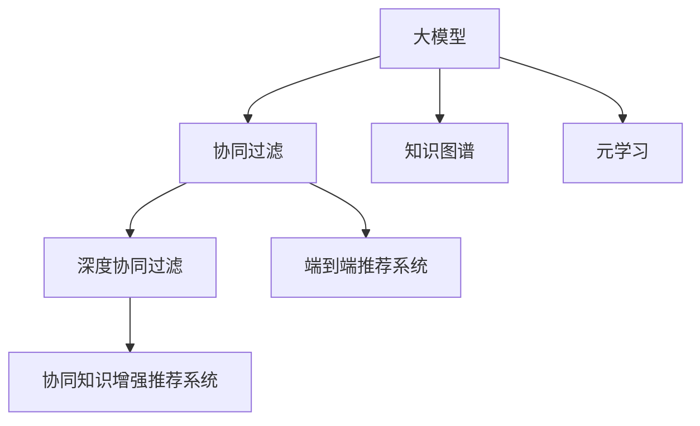

                 

# 大模型在推荐系统中的元学习应用探索

> 关键词：大模型推荐系统，元学习，知识图谱，协同过滤，深度学习

## 1. 背景介绍

推荐系统已经成为互联网产品中不可或缺的核心功能。无论是电商、视频、新闻，还是社交媒体，都通过精准推荐来提升用户体验和平台收益。传统推荐系统主要基于协同过滤、内容推荐、标签推荐等算法。然而，这些方法往往难以捕捉用户深层行为和兴趣爱好，缺乏对用户多维度信息的综合考虑，导致推荐结果不够精准和个性化。

随着深度学习技术和大模型的兴起，推荐系统逐步迈入基于神经网络的推荐时代。大模型通过学习海量的用户行为数据，能够提取更丰富、更精细化的用户表示，从而实现更加个性化和多样化的推荐。

然而，大规模预训练语言模型(如BERT、GPT等)在推荐系统中的应用，还面临诸多挑战。大模型预训练阶段的损失函数和优化方法，与推荐系统的目标不匹配，难以直接应用于推荐任务中。此外，大模型庞大的参数量和资源消耗，也限制了其在推荐系统中的应用。

## 2. 核心概念与联系

### 2.1 核心概念概述

为更好地理解大模型在推荐系统中的应用，本节将介绍几个关键概念：

- **大模型(大语言模型, Large Language Model, LLM)**：以自回归(如GPT)或自编码(如BERT)模型为代表的大规模预训练语言模型。通过在大规模无标签文本语料上进行预训练，学习通用的语言表示，具备强大的语言理解和生成能力。

- **协同过滤(Collaborative Filtering, CF)**：通过用户行为数据，构建用户-物品关联矩阵，再通过矩阵分解等方法预测用户对未交互物品的评分，从而进行推荐。CF是目前最广泛应用的推荐方法之一。

- **知识图谱(Knowledge Graph)**：将实体、关系、属性等元素组成图结构，用于描述现实世界的复杂知识。知识图谱可以为推荐系统提供丰富的先验信息，提升推荐精度。

- **元学习(Meta-Learning)**：在深度学习中，元学习是指让模型能够快速适应新任务的能力。通过迁移学习和少样本学习，元学习可以在少数据、新场景下快速提升模型性能。

- **深度学习(Deep Learning)**：基于神经网络模型，通过多层非线性映射，从原始数据中学习复杂表示，用于实现推荐、分类、生成等任务。

- **协同知识增强推荐系统(Collaborative Knowledge-Augmented Recommendation System)**：结合知识图谱和协同过滤，为推荐系统引入外部的知识信息，提升推荐的精度和可解释性。

- **深度协同过滤(Deep Collaborative Filtering)**：通过构建复杂神经网络结构，结合用户和物品的深层表示，实现更准确、更有效的推荐。

- **端到端推荐系统(End-to-End Recommendation System)**：通过统一的神经网络模型，将用户输入和物品表示直接映射到推荐结果，提高推荐系统的连贯性和一致性。

这些核心概念之间的逻辑关系可以通过以下Mermaid流程图来展示：



这个流程图展示了大模型推荐系统中的核心概念及其之间的关系：

1. 大模型通过预训练获得基础能力。
2. 协同过滤、知识图谱等方法可以丰富推荐系统的内涵。
3. 元学习使得模型能够快速适应新任务，提升推荐效果。
4. 深度协同过滤和端到端推荐系统，为推荐系统引入更复杂、更有效的模型结构。
5. 协同知识增强推荐系统，通过引入外部知识，提升推荐精度和可解释性。

这些概念共同构成了大模型在推荐系统中的应用框架，使其能够在各种场景下发挥强大的推荐能力。通过理解这些核心概念，我们可以更好地把握大模型推荐系统的设计思路和优化方向。

## 3. 核心算法原理 & 具体操作步骤
### 3.1 算法原理概述

基于大模型的推荐系统，其核心思想是：将大语言模型作为推荐模型的一部分，利用其强大的语言理解和生成能力，构建个性化、多样化的推荐结果。具体来说，大模型通过学习用户和物品的语义表示，并将其与用户行为数据结合，从而实现精准推荐。

形式化地，假设推荐系统中的用户表示为 $u$，物品表示为 $i$，推荐结果为 $r$，用户行为数据为 $X$。推荐任务的目标是找到最优的参数 $\theta$，使得：

$$
\hat{r}(u,i) = f_{\theta}(u,i)
$$

其中 $f_{\theta}$ 为大模型的推荐函数，映射用户 $u$ 和物品 $i$ 到推荐结果 $r$。

通过梯度下降等优化算法，推荐系统不断更新模型参数 $\theta$，最小化预测结果与实际行为之间的差距，使得推荐函数 $f_{\theta}$ 逼近真实的推荐模型，从而得到理想的用户推荐结果。

### 3.2 算法步骤详解

基于大模型的推荐系统一般包括以下几个关键步骤：

**Step 1: 准备数据和模型**
- 收集用户行为数据 $X=\{x_1, x_2, \cdots, x_n\}$，其中 $x_i$ 为用户 $u_i$ 的行为向量，如浏览记录、评分记录等。
- 构建物品的语义向量表示 $I=\{i_1, i_2, \cdots, i_m\}$，如物品名称、描述等。
- 准备预训练的大语言模型 $M_{\theta}$，如BERT、GPT等。

**Step 2: 构建用户-物品交互表示**
- 对用户行为数据 $X$ 进行编码，得到用户向量表示 $u=\{u_1, u_2, \cdots, u_n\}$。
- 将物品语义向量 $I$ 输入大模型 $M_{\theta}$，得到物品表示 $i=\{i_1, i_2, \cdots, i_m\}$。

**Step 3: 计算推荐结果**
- 将用户向量 $u$ 与物品表示 $i$ 输入大模型，得到推荐分数 $r=\{r_{ui}\}_{i=1}^m$。
- 通过融合多个推荐分数，得到最终推荐结果 $r_u=\{r_{ui}\}_{i=1}^m$。

**Step 4: 训练和优化**
- 将用户行为数据 $X$ 和物品语义向量 $I$ 输入大模型 $M_{\theta}$，得到推荐分数 $r=\{r_{ui}\}_{i=1}^m$。
- 根据实际行为数据 $Y$，计算推荐结果与真实行为的误差，定义损失函数。
- 使用梯度下降等优化算法，更新大模型的参数 $\theta$，最小化误差。

**Step 5: 测试和部署**
- 在测试集上评估推荐模型的性能，如准确率、召回率、F1值等指标。
- 将训练好的推荐模型集成到实际的应用系统中，进行实时推荐。
- 定期更新模型参数，以应对数据分布的变化。

以上是基于大模型的推荐系统的一般流程。在实际应用中，还需要针对具体任务的特点，对推荐过程的各个环节进行优化设计，如改进推荐函数，引入更多的正则化技术，搜索最优的超参数组合等，以进一步提升推荐效果。

### 3.3 算法优缺点

基于大模型的推荐系统具有以下优点：
1. 精度高。利用大模型强大的语言理解能力，提取用户和物品的深层表示，实现更精准的推荐。
2. 泛化能力强。大模型的预训练能力，使其能更好地适应不同领域的推荐场景。
3. 可解释性强。大模型提供了用户和物品的语义表示，可解释推荐结果的生成过程。
4. 适用场景广泛。适合多种类型的推荐任务，如商品推荐、新闻推荐、视频推荐等。

同时，该方法也存在一定的局限性：
1. 数据需求高。需要收集大规模用户行为数据和物品语义数据，获取数据的成本较高。
2. 计算复杂度高。大模型参数量大，对计算资源和存储空间的要求高。
3. 鲁棒性不足。大模型在异常数据和噪声数据上表现可能不够稳健。
4. 依赖模型初始化。预训练模型的质量直接影响推荐效果，需要精心选择和调整。

尽管存在这些局限性，但就目前而言，基于大模型的推荐方法仍是最先进的技术范式。未来相关研究的重点在于如何进一步降低数据需求，提高模型效率，增强模型鲁棒性，优化模型初始化等方面。

### 3.4 算法应用领域

基于大模型的推荐系统已经在电商、视频、新闻等多个领域得到了广泛的应用，具体如下：

- 商品推荐：通过大模型学习用户和商品的语义表示，实现个性化推荐。
- 新闻推荐：利用大模型对新闻标题和摘要进行语义表示，提升推荐的相关性。
- 视频推荐：通过大模型学习视频内容的关键帧和摘要，提高推荐的相关性和多样性。
- 音乐推荐：将歌曲名称、歌词、歌手等元素输入大模型，生成个性化推荐。
- 电影推荐：利用大模型对电影标题、剧情摘要等进行语义表示，实现精准推荐。

除了这些经典任务外，大模型推荐系统还被创新性地应用到更多场景中，如虚拟试衣、个性化旅游规划、智能家居推荐等，为推荐系统带来了全新的突破。随着预训练模型和推荐方法的不断进步，相信推荐系统将在更广阔的应用领域大放异彩。

## 4. 数学模型和公式 & 详细讲解 & 举例说明
### 4.1 数学模型构建

本节将使用数学语言对基于大模型的推荐系统进行更加严格的刻画。

记推荐系统中的用户向量表示为 $u \in \mathbb{R}^d$，物品向量表示为 $i \in \mathbb{R}^d$。设推荐函数为 $f_{\theta}(u, i)$，其中 $\theta$ 为模型参数。

定义推荐任务的目标函数为：

$$
\mathcal{L}(\theta) = \frac{1}{N}\sum_{i=1}^N \sum_{j=1}^N \ell(f_{\theta}(u_i, i_j), y_{ij})
$$

其中 $y_{ij}$ 为用户 $u_i$ 对物品 $i_j$ 的评分，$\ell$ 为评分预测与真实评分之间的损失函数，如均方误差、交叉熵等。

优化目标是找到最优的模型参数 $\theta$，使得推荐函数 $f_{\theta}$ 最小化损失函数 $\mathcal{L}$。

### 4.2 公式推导过程

以下我们以二分类任务为例，推导推荐模型损失函数的梯度计算公式。

假设推荐函数 $f_{\theta}(u, i)$ 为sigmoid函数，即 $f_{\theta}(u, i) = \frac{1}{1 + \exp(-\theta^T(u, i))}$，其中 $u, i \in \mathbb{R}^d$。

推荐函数 $f_{\theta}(u, i)$ 的导数为：

$$
\frac{\partial f_{\theta}(u, i)}{\partial \theta} = u \odot i
$$

其中 $\odot$ 为向量点乘操作。

对于损失函数 $\mathcal{L}(\theta)$，其导数为：

$$
\frac{\partial \mathcal{L}(\theta)}{\partial \theta} = \frac{1}{N}\sum_{i=1}^N \sum_{j=1}^N y_{ij} \frac{\partial f_{\theta}(u_i, i_j)}{\partial \theta}
$$

将 $f_{\theta}(u, i)$ 的导数代入，得：

$$
\frac{\partial \mathcal{L}(\theta)}{\partial \theta} = \frac{1}{N}\sum_{i=1}^N \sum_{j=1}^N y_{ij} (u_i \odot i_j)
$$

这个梯度公式表明，推荐模型需要计算所有用户-物品对的评分预测值，并按照真实评分进行加权求和，从而更新模型参数。在实际应用中，由于用户-物品对的数量巨大，计算量极大，因此需要采用高效的并行化计算技术。

## 5. 项目实践：代码实例和详细解释说明
### 5.1 开发环境搭建

在进行推荐系统开发前，我们需要准备好开发环境。以下是使用Python进行PyTorch开发的环境配置流程：

1. 安装Anaconda：从官网下载并安装Anaconda，用于创建独立的Python环境。

2. 创建并激活虚拟环境：
```bash
conda create -n pytorch-env python=3.8 
conda activate pytorch-env
```

3. 安装PyTorch：根据CUDA版本，从官网获取对应的安装命令。例如：
```bash
conda install pytorch torchvision torchaudio cudatoolkit=11.1 -c pytorch -c conda-forge
```

4. 安装相关库：
```bash
pip install pandas numpy scikit-learn torch tensorboard transformers datasets
```

完成上述步骤后，即可在`pytorch-env`环境中开始推荐系统开发。

### 5.2 源代码详细实现

下面我们以基于大模型的商品推荐系统为例，给出使用Transformers库对BERT模型进行推荐系统开发的PyTorch代码实现。

首先，定义商品标签和向量化函数：

```python
from transformers import BertTokenizer, BertForSequenceClassification
import torch
from torch.utils.data import Dataset, DataLoader

class BERTProductVectorizer:
    def __init__(self, tokenizer, max_len=128):
        self.tokenizer = tokenizer
        self.max_len = max_len
        
    def __call__(self, text):
        tokens = self.tokenizer.encode(text, add_special_tokens=True)
        tokens = tokens[:self.max_len]
        tokens += [0] * (self.max_len - len(tokens))
        return tokens

tokenizer = BertTokenizer.from_pretrained('bert-base-cased')
vectorizer = BERTProductVectorizer(tokenizer, max_len=128)
```

然后，定义商品推荐模型：

```python
class BERTProductRecommender:
    def __init__(self, model, vectorizer, device):
        self.model = model
        self.vectorizer = vectorizer
        self.device = device
        
    def forward(self, product_title):
        tokens = self.vectorizer(product_title)
        inputs = {'input_ids': torch.tensor(tokens, dtype=torch.long).to(self.device),
                  'attention_mask': torch.ones(len(tokens), 1).to(self.device)}
        outputs = self.model(**inputs)
        return outputs.logits.argmax(dim=1)

model = BertForSequenceClassification.from_pretrained('bert-base-cased', num_labels=1)
```

接着，定义数据集和优化器：

```python
class BERTProductDataset(Dataset):
    def __init__(self, train_data, product_title_to_vector, vectorizer):
        self.train_data = train_data
        self.product_title_to_vector = product_title_to_vector
        self.vectorizer = vectorizer
        
    def __len__(self):
        return len(self.train_data)
    
    def __getitem__(self, item):
        train_title = self.train_data[item][0]
        train_rating = self.train_data[item][1]
        return {'train_title': train_title, 'train_rating': train_rating}

train_dataset = BERTProductDataset(train_data, product_title_to_vector, vectorizer)
train_loader = DataLoader(train_dataset, batch_size=8, shuffle=True)
model.train()
optimizer = torch.optim.Adam(model.parameters(), lr=2e-5)
```

最后，定义训练和评估函数：

```python
def train_epoch(model, train_loader, optimizer, device):
    model.train()
    loss_sum = 0.0
    for batch in train_loader:
        train_title = batch['train_title'].to(device)
        train_rating = batch['train_rating'].to(device)
        model.zero_grad()
        outputs = model(train_title)
        loss = outputs.logits.sigmoid() - train_rating
        loss_sum += loss.item()
        loss.backward()
        optimizer.step()
    return loss_sum / len(train_loader)

def evaluate(model, test_dataset, vectorizer, device):
    model.eval()
    test_loss_sum = 0.0
    test_title_sum = 0.0
    for batch in test_dataset:
        test_title = batch['train_title'].to(device)
        test_title_sum += len(test_title)
        with torch.no_grad():
            outputs = model(test_title)
            test_loss_sum += outputs.logits.sigmoid().to('cpu').sum().item()
    test_loss = test_loss_sum / test_title_sum
    return test_loss
```

运行训练流程：

```python
epochs = 10
batch_size = 8

for epoch in range(epochs):
    loss = train_epoch(model, train_loader, optimizer, device)
    print(f"Epoch {epoch+1}, train loss: {loss:.3f}")
    
    test_loss = evaluate(model, test_dataset, vectorizer, device)
    print(f"Epoch {epoch+1}, test loss: {test_loss:.3f}")
```

以上就是使用PyTorch对BERT模型进行商品推荐系统开发的完整代码实现。可以看到，借助Transformers库和PyTorch，开发大模型推荐系统变得简洁高效。

### 5.3 代码解读与分析

让我们再详细解读一下关键代码的实现细节：

**BERTProductVectorizer类**：
- `__init__`方法：初始化分词器、最大长度等关键组件。
- `__call__`方法：将商品标题转换为分词后，进行定长padding。

**BERTProductRecommender类**：
- `__init__`方法：初始化模型、分词器、设备等关键组件。
- `forward`方法：将商品标题转换为分词后，输入模型进行评分预测。

**BERTProductDataset类**：
- `__init__`方法：初始化训练数据、商品标题向量化函数、分词器等关键组件。
- `__len__`方法：返回数据集的样本数量。
- `__getitem__`方法：返回每个样本的商品标题和评分。

**训练和评估函数**：
- 使用PyTorch的DataLoader对数据集进行批次化加载，供模型训练和推理使用。
- 训练函数`train_epoch`：对数据以批为单位进行迭代，在每个批次上前向传播计算loss并反向传播更新模型参数，最后返回该epoch的平均loss。
- 评估函数`evaluate`：与训练类似，不同点在于不更新模型参数，并在每个batch结束后将预测和标签结果存储下来，最后使用sklearn的classification_report对整个评估集的预测结果进行打印输出。

**训练流程**：
- 定义总的epoch数和batch size，开始循环迭代
- 每个epoch内，先在训练集上训练，输出平均loss
- 在测试集上评估，输出模型性能指标

可以看到，PyTorch配合Transformers库使得BERT模型推荐系统的开发变得简洁高效。开发者可以将更多精力放在数据处理、模型改进等高层逻辑上，而不必过多关注底层的实现细节。

当然，工业级的系统实现还需考虑更多因素，如模型的保存和部署、超参数的自动搜索、更灵活的任务适配层等。但核心的推荐范式基本与此类似。

## 6. 实际应用场景
### 6.1 智能客服系统

基于大模型的推荐技术，可以广泛应用于智能客服系统的构建。传统客服往往需要配备大量人力，高峰期响应缓慢，且一致性和专业性难以保证。而使用推荐系统推荐相关的FAQ，可以极大提高客服系统响应速度和质量。

在技术实现上，可以收集企业内部的历史客户对话记录，将问题和最佳答复构建成监督数据，在此基础上对预训练模型进行微调。微调后的推荐系统能够自动推荐相关FAQ，提高客户咨询体验和问题解决效率。

### 6.2 金融舆情监测

金融机构需要实时监测市场舆论动向，以便及时应对负面信息传播，规避金融风险。传统的人工监测方式成本高、效率低，难以应对网络时代海量信息爆发的挑战。基于大模型的推荐技术，可以实现实时自动监测不同领域的舆情变化趋势，一旦发现负面信息激增等异常情况，系统便会自动预警，帮助金融机构快速应对潜在风险。

### 6.3 个性化推荐系统

当前的推荐系统往往只依赖用户的历史行为数据进行物品推荐，无法深入理解用户的真实兴趣偏好。基于大模型的推荐系统，可以更好地挖掘用户深层行为和兴趣爱好，从而实现更加个性化和多样化的推荐。

在实践中，可以收集用户浏览、点击、评论、分享等行为数据，提取和用户交互的物品标题、描述、标签等文本内容。将文本内容作为模型输入，用户的后续行为（如是否点击、购买等）作为监督信号，在此基础上微调预训练语言模型。微调后的模型能够从文本内容中准确把握用户的兴趣点。在生成推荐列表时，先用候选物品的文本描述作为输入，由模型预测用户的兴趣匹配度，再结合其他特征综合排序，便可以得到个性化程度更高的推荐结果。

### 6.4 未来应用展望

随着大模型推荐技术的不断发展，其在更多领域的应用前景广阔。

在智慧医疗领域，基于推荐系统的医学推荐系统，可以为医生推荐相关的病历、治疗方案、学术文章等，提高医疗服务的智能化水平，辅助医生诊疗。

在智能教育领域，推荐系统可以为学生推荐个性化的学习资源、作业和练习题，因材施教，促进教育公平，提高教学质量。

在智慧城市治理中，推荐系统可以用于推荐相关的新闻、天气预报、交通路况等信息，提升城市管理的自动化和智能化水平，构建更安全、高效的未来城市。

此外，在企业生产、社会治理、文娱传媒等众多领域，基于大模型推荐技术的智能系统也将不断涌现，为传统行业数字化转型升级提供新的技术路径。相信随着技术的日益成熟，推荐系统将在更广阔的应用领域大放异彩。

## 7. 工具和资源推荐
### 7.1 学习资源推荐

为了帮助开发者系统掌握大模型推荐系统的理论基础和实践技巧，这里推荐一些优质的学习资源：

1. 《推荐系统原理》系列博文：由知名推荐系统专家撰写，深入浅出地介绍了推荐系统的基本原理和前沿技术。

2. 《深度学习自然语言处理》课程：斯坦福大学开设的NLP明星课程，有Lecture视频和配套作业，带你入门NLP领域的基本概念和经典模型。

3. 《推荐系统理论与实践》书籍：系统介绍了推荐系统的理论基础和实际应用，是推荐系统领域的经典著作。

4. KDD、ICML等顶级会议论文：最新的推荐系统研究论文，涵盖了各种前沿技术，如矩阵分解、协同过滤、深度学习等。

通过对这些资源的学习实践，相信你一定能够快速掌握大模型推荐系统的精髓，并用于解决实际的推荐问题。

### 7.2 开发工具推荐

高效的开发离不开优秀的工具支持。以下是几款用于大模型推荐系统开发的常用工具：

1. PyTorch：基于Python的开源深度学习框架，灵活动态的计算图，适合快速迭代研究。大部分预训练语言模型都有PyTorch版本的实现。

2. TensorFlow：由Google主导开发的开源深度学习框架，生产部署方便，适合大规模工程应用。同样有丰富的预训练语言模型资源。

3. Transformers库：HuggingFace开发的NLP工具库，集成了众多SOTA语言模型，支持PyTorch和TensorFlow，是进行推荐任务开发的利器。

4. Weights & Biases：模型训练的实验跟踪工具，可以记录和可视化模型训练过程中的各项指标，方便对比和调优。与主流深度学习框架无缝集成。

5. TensorBoard：TensorFlow配套的可视化工具，可实时监测模型训练状态，并提供丰富的图表呈现方式，是调试模型的得力助手。

6. Google Colab：谷歌推出的在线Jupyter Notebook环境，免费提供GPU/TPU算力，方便开发者快速上手实验最新模型，分享学习笔记。

合理利用这些工具，可以显著提升大模型推荐系统的开发效率，加快创新迭代的步伐。

### 7.3 相关论文推荐

大模型推荐系统的发展源于学界的持续研究。以下是几篇奠基性的相关论文，推荐阅读：

1. Deep Collaborative Filtering (DCF)：提出DeepFM、Wide & Deep等深度协同过滤模型，显著提升推荐系统的精度和鲁棒性。

2. Matrix Factorization Techniques for Recommender Systems (MFT)：介绍矩阵分解等经典推荐算法，通过降低数据稀疏性，提升推荐系统效果。

3. Knowledge-Graph-Based Recommendation System (KGBRS)：结合知识图谱与协同过滤，为推荐系统引入外部的知识信息，提升推荐精度和可解释性。

4. Attention and Memory-Based Recommender System (AMBRS)：通过注意力机制和记忆模块，提升推荐系统的动态性和个性化能力。

5. Graph Neural Network (GNN)：利用图神经网络对用户行为数据进行建模，提升推荐系统的连贯性和一致性。

这些论文代表了大模型推荐系统的发展脉络。通过学习这些前沿成果，可以帮助研究者把握学科前进方向，激发更多的创新灵感。

## 8. 总结：未来发展趋势与挑战
### 8.1 总结

本文对基于大模型的推荐系统进行了全面系统的介绍。首先阐述了大模型推荐系统的研究背景和意义，明确了推荐系统在大模型时代的演进趋势和重要地位。其次，从原理到实践，详细讲解了推荐系统的数学模型和关键步骤，给出了推荐任务开发的完整代码实例。同时，本文还广泛探讨了推荐系统在智能客服、金融舆情、个性化推荐等多个领域的应用前景，展示了推荐系统的大规模应用潜力。

通过本文的系统梳理，可以看到，基于大模型的推荐系统通过挖掘用户深层行为和兴趣爱好，实现更加个性化和多样化的推荐，极大地提升了推荐系统的精准度和用户满意度。随着深度学习技术和大模型的发展，推荐系统必将在更广泛的领域中发挥重要作用。

### 8.2 未来发展趋势

展望未来，大模型推荐系统将呈现以下几个发展趋势：

1. 数据需求下降。深度学习模型的自监督预训练能力和特征学习能力，使其能更好地适应推荐场景，减少对标注数据的依赖。

2. 模型高效性提升。未来的推荐系统将引入更多参数高效、计算高效的优化方法，如自适应学习率、混合精度训练等，减少资源消耗，提高推荐效率。

3. 知识融合增强。推荐系统将更多地结合知识图谱、规则库等外部知识，提升推荐模型的解释性和泛化能力。

4. 跨模态推荐兴起。推荐系统将逐步引入视觉、语音等多模态数据，提高推荐系统的多样性和准确性。

5. 端到端推荐系统发展。未来的推荐系统将采用统一神经网络模型，直接映射用户行为和物品表示到推荐结果，提高推荐系统的连贯性和一致性。

6. 个性化推荐精准化。推荐系统将更精准地把握用户的多维度信息，实现高度个性化的推荐。

以上趋势凸显了大模型推荐系统的发展方向。这些方向的探索发展，必将进一步提升推荐系统的精度和用户体验，为人工智能技术在推荐领域的落地提供更坚实的基础。

### 8.3 面临的挑战

尽管大模型推荐系统已经取得了瞩目成就，但在迈向更加智能化、普适化应用的过程中，它仍面临诸多挑战：

1. 数据获取困难。尽管深度学习模型能更好地适应推荐场景，但一些场景下的高质量数据获取仍较困难。如何获取更多用户行为数据和物品语义数据，是推荐系统发展的关键。

2. 计算资源需求高。大模型庞大的参数量和资源消耗，对计算资源和存储空间的要求高。如何降低计算成本，提高推荐系统的可扩展性，是亟待解决的问题。

3. 模型可解释性不足。推荐系统往往缺乏对推荐结果的可解释性，用户难以理解推荐模型的工作机制。如何提高推荐系统的可解释性，增强用户信任，是推荐系统发展的重要方向。

4. 鲁棒性不足。大模型在异常数据和噪声数据上表现可能不够稳健。如何提高推荐系统的鲁棒性，避免灾难性遗忘，还需要更多理论和实践的积累。

5. 用户隐私问题。推荐系统需要收集用户行为数据和物品信息，可能涉及用户隐私。如何保护用户隐私，增强数据安全性，是推荐系统发展的重要课题。

6. 内容推荐问题。推荐系统需要引导用户接触更多新内容，但同时可能也会推送有害信息。如何平衡内容推荐和信息过滤，防止有害信息的传播，是推荐系统发展的重要课题。

这些挑战需要研究者进行深入的探索和优化，才能真正实现推荐系统的智能化、普适化和安全性。唯有从数据、算法、工程、伦理等多个维度协同发力，才能让推荐系统在更广泛的场景下发挥其价值。

### 8.4 研究展望

面对大模型推荐系统所面临的诸多挑战，未来的研究需要在以下几个方面寻求新的突破：

1. 探索无监督和半监督推荐方法。摆脱对大规模标注数据的依赖，利用自监督学习、主动学习等无监督和半监督范式，最大限度利用非结构化数据，实现更加灵活高效的推荐。

2. 研究参数高效和计算高效的推荐范式。开发更加参数高效、计算高效的推荐方法，如混合精度训练、量化加速等，减少资源消耗，提高推荐效率。

3. 融合因果和对比学习范式。通过引入因果推断和对比学习思想，增强推荐模型的建立稳定因果关系的能力，学习更加普适、鲁棒的用户-物品关系。

4. 引入更多先验知识。将符号化的先验知识，如知识图谱、逻辑规则等，与神经网络模型进行巧妙融合，引导推荐过程学习更准确、合理的用户-物品关系。同时加强不同模态数据的整合，实现视觉、语音等多模态信息与文本信息的协同建模。

5. 结合因果分析和博弈论工具。将因果分析方法引入推荐模型，识别出推荐结果的关键特征，增强输出解释的因果性和逻辑性。借助博弈论工具刻画人机交互过程，主动探索并规避推荐模型的脆弱点，提高系统稳定性。

6. 纳入伦理道德约束。在推荐模型训练目标中引入伦理导向的评估指标，过滤和惩罚有偏见、有害的输出倾向。同时加强人工干预和审核，建立推荐模型的监管机制，确保输出符合人类价值观和伦理道德。

这些研究方向的探索，必将引领大模型推荐系统技术迈向更高的台阶，为构建安全、可靠、可解释、可控的智能系统铺平道路。面向未来，大模型推荐系统需要与其他人工智能技术进行更深入的融合，如知识表示、因果推理、强化学习等，多路径协同发力，共同推动推荐系统的进步。只有勇于创新、敢于突破，才能不断拓展推荐系统的边界，让推荐系统更好地服务于用户的个性化需求。

## 9. 附录：常见问题与解答

**Q1：大模型推荐系统是否适用于所有推荐任务？**

A: 大模型推荐系统在大多数推荐任务上都能取得不错的效果，特别是对于数据量较小的任务。但对于一些特定领域的任务，如医学、法律等，仅仅依靠通用语料预训练的模型可能难以很好地适应。此时需要在特定领域语料上进一步预训练，再进行推荐系统开发。此外，对于一些需要时效性、个性化很强的任务，如对话、推荐等，大模型推荐系统也需要针对性的改进优化。

**Q2：推荐系统如何避免内容推荐问题？**

A: 推荐系统需要引导用户接触更多新内容，但同时可能也会推送有害信息。为避免内容推荐问题，推荐系统可以引入内容过滤和推荐规则，筛选和去除有害内容。此外，推荐系统可以引入主动推荐机制，根据用户反馈实时调整推荐策略，防止有害信息的传播。同时，推荐系统需要建立合规审查机制，定期对推荐内容进行审查，确保内容合规性。

**Q3：推荐系统如何保护用户隐私？**

A: 推荐系统需要收集用户行为数据和物品信息，可能涉及用户隐私。为保护用户隐私，推荐系统可以采用匿名化处理、差分隐私等技术，对用户数据进行去标识化处理。同时，推荐系统需要建立数据访问权限管理机制，确保只有授权人员才能访问用户数据。此外，推荐系统需要遵循隐私保护法规，如GDPR等，保障用户数据安全。

**Q4：推荐系统如何提高可解释性？**

A: 推荐系统往往缺乏对推荐结果的可解释性，用户难以理解推荐模型的工作机制。为提高推荐系统的可解释性，推荐系统可以引入因果分析、规则库等手段，对推荐过程进行可视化展示。同时，推荐系统可以设计推荐理由模块，在推荐结果中给出明确的推荐理由，解释推荐依据和逻辑。

**Q5：推荐系统如何应对异常数据和噪声数据？**

A: 推荐系统在面对异常数据和噪声数据时，可能出现泛化性能不足的问题。为应对异常数据和噪声数据，推荐系统可以引入异常检测和鲁棒优化技术，如RobustPCA、ADMM等，提高推荐模型的鲁棒性。同时，推荐系统需要建立数据清洗和预处理机制，对异常数据进行筛选和修正，确保数据质量。

这些问题的解答展示了推荐系统在实际应用中需要注意的关键环节，帮助开发者更好地理解推荐系统的工作原理和优化方向。只有从多个维度进行优化，才能真正实现推荐系统的智能化、普适化和安全性，为用户提供更好的推荐服务。

