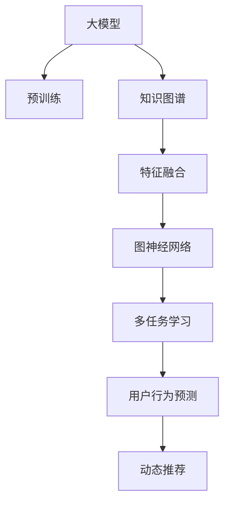

                 

# 大模型在推荐系统中的图神经网络应用

> 关键词：大模型,推荐系统,图神经网络,知识图谱,特征融合,深度学习,用户行为预测

## 1. 背景介绍

### 1.1 问题由来
随着互联网和移动互联网的快速发展，推荐系统已经深入到我们生活的方方面面，成为连接用户与信息的重要桥梁。无论是电商平台、社交平台还是视频平台，推荐系统都在不断优化用户体验，提升其互动性和满意度。而大模型，特别是预训练语言模型，在推荐系统中的应用，为推荐系统带来了全新的突破。

大模型通过在大规模语料库上进行预训练，学习到了丰富的语言知识和结构化的语义信息。这些预训练的知识可以极大地丰富推荐系统的特征空间，提升模型的表达能力和泛化性能。结合图神经网络(Graph Neural Network, GNN)，大模型能够处理更加复杂、丰富的关系数据，构建精准的推荐图谱。

### 1.2 问题核心关键点
大模型在推荐系统中的应用，主要体现在以下几个关键点：
1. 特征融合：利用大模型的语言理解能力，将自然语言文本与用户行为数据进行深度融合，丰富推荐特征。
2. 知识图谱：构建基于大模型的推荐知识图谱，提升用户行为预测的准确性和鲁棒性。
3. 多任务学习：在大模型上同时训练多个推荐任务，实现多任务联合训练和特征共享。
4. 动态更新：通过微调大模型，实现模型对用户行为动态适应的持续优化。

## 2. 核心概念与联系

### 2.1 核心概念概述

为更好地理解大模型在推荐系统中的图神经网络应用，本节将介绍几个密切相关的核心概念：

- 大模型(Large Model)：以自回归模型(如GPT)或自编码模型(如BERT)为代表的、通过大规模无标签文本数据预训练得到的语言模型。这些模型具备强大的语言理解能力，能够学习到丰富的语言知识，提升推荐系统的特征空间。

- 图神经网络(Graph Neural Network, GNN)：一种专门用于处理图结构数据的深度学习模型。GNN能够通过邻居聚合方式，将节点间的图结构信息融合进节点的特征表示中，用于图谱上的节点分类、回归、关系预测等任务。

- 知识图谱(Knowledge Graph)：基于实体和关系的结构化数据模型，用于表示现实世界中的各种实体和实体间的关系。知识图谱能够辅助大模型进行更准确的推荐，提升推荐系统的质量和效率。

- 特征融合(Feature Fusion)：将不同类型的特征进行深度融合，以构建更全面的用户画像和推荐特征。在大模型上进行的特征融合，可以借助其强大的语言理解能力，对用户行为数据进行更深刻的理解和表达。

- 动态推荐(Dynamic Recommendation)：根据用户的即时行为，不断更新模型，提升推荐的实时性和个性化。

- 多任务学习(Multi-Task Learning, MTL)：在大模型上同时训练多个推荐任务，实现多任务联合训练和特征共享，提升整体推荐系统的性能。

- 用户行为预测(User Behavior Prediction)：预测用户对物品的评分、点击、购买等行为，是推荐系统的重要任务。通过大模型和图神经网络的结合，可以更好地捕捉用户行为的多样性和复杂性。

这些核心概念之间的逻辑关系可以通过以下Mermaid流程图来展示：



这个流程图展示了大模型在推荐系统中的核心概念及其之间的关系：

1. 大模型通过预训练获得基础能力。
2. 知识图谱与大模型结合，构建推荐的知识图谱。
3. 通过特征融合，将用户行为数据与文本数据深度结合。
4. 结合图神经网络，处理复杂的图结构数据。
5. 通过多任务学习，提升模型对多个推荐任务的性能。
6. 用户行为预测和动态推荐，提升推荐系统的实时性和个性化。

这些概念共同构成了大模型在推荐系统中的应用框架，使得大模型能够更好地应用于复杂的推荐场景。

## 3. 核心算法原理 & 具体操作步骤
### 3.1 算法原理概述

大模型在推荐系统中的应用，主要基于以下几个核心算法：

- 基于大模型的特征融合：利用大模型对文本进行编码，提取高维语义特征，再结合用户行为数据进行特征融合。
- 知识图谱的构建和查询：构建基于大模型的知识图谱，并通过图神经网络对图谱进行表示学习，用于推荐系统的构建。
- 多任务学习和联合训练：在大模型上同时训练多个推荐任务，实现多任务联合训练和特征共享。
- 动态更新和微调：根据用户行为数据，不断更新大模型，提升推荐的实时性和个性化。

### 3.2 算法步骤详解

基于大模型的推荐系统构建，一般包括以下几个关键步骤：

**Step 1: 准备数据集**
- 收集用户行为数据，如浏览记录、点击行为、评分数据等。
- 收集物品描述、分类、属性等文本信息。
- 构建推荐知识图谱，包含用户、物品、实体间的关系等。

**Step 2: 预训练大模型**
- 选择合适的大模型，如BERT、GPT等，进行预训练。
- 对文本数据进行分词、编码，构建预训练模型所需的输入。

**Step 3: 特征提取**
- 利用大模型对文本进行编码，提取高维语义特征。
- 将用户行为数据转换为数字向量，作为推荐模型的输入特征。

**Step 4: 构建知识图谱**
- 构建推荐知识图谱，包含用户、物品、实体间的关系等。
- 使用GNN对知识图谱进行表示学习，提取图谱中的结构化信息。

**Step 5: 多任务学习**
- 在大模型上同时训练多个推荐任务，如评分预测、点击预测、推荐排序等。
- 实现多任务联合训练和特征共享，提升整体推荐系统的性能。

**Step 6: 动态更新和微调**
- 根据用户即时行为数据，动态更新大模型，提升推荐的实时性和个性化。
- 使用监督学习进行微调，优化模型在推荐任务上的性能。

**Step 7: 评估与部署**
- 在测试集上评估推荐模型的性能，如AUC、NDCG、MRR等指标。
- 部署推荐模型，接入实际应用系统，进行实时推荐。

以上是基于大模型的推荐系统构建的一般流程。在实际应用中，还需要针对具体任务的特点，对各个环节进行优化设计，如改进特征提取方式、优化GNN的聚合策略、寻找合适的多任务联合训练方法等。

### 3.3 算法优缺点

基于大模型的推荐系统具有以下优点：
1. 提升特征表达能力：通过大模型提取高维语义特征，提升推荐系统的特征空间，提升模型泛化性能。
2. 提高推荐效果：结合知识图谱和图神经网络，处理复杂的图结构数据，构建精准的推荐图谱。
3. 提升实时性：通过动态更新和微调，实现实时推荐，提升用户体验。
4. 多任务联合训练：在大模型上同时训练多个推荐任务，实现特征共享，提升整体推荐系统的性能。

同时，该方法也存在一定的局限性：
1. 数据需求高：需要大规模的文本数据和用户行为数据，数据获取和处理成本较高。
2. 模型复杂度高：预训练大模型的复杂度高，需要高性能的计算资源支持。
3. 实时性要求高：动态更新和微调模型，需要实时处理数据，对系统要求高。
4. 可解释性不足：大模型和图神经网络往往是黑盒系统，缺乏可解释性，难以调试和优化。

尽管存在这些局限性，但就目前而言，基于大模型的推荐系统依然是大数据推荐技术的代表，广泛应用于电商、社交、视频等多个领域，成为推荐系统领域的重要范式。

### 3.4 算法应用领域

基于大模型的推荐系统在以下几个领域得到了广泛应用：

- 电商推荐：如亚马逊、淘宝等电商平台，利用大模型进行商品推荐，提升用户购买转化率。
- 社交推荐：如Facebook、微信等社交平台，利用大模型进行内容推荐，提升用户互动率。
- 视频推荐：如Netflix、YouTube等视频平台，利用大模型进行内容推荐，提升用户观看时长和满意度。
- 新闻推荐：如今日头条、腾讯新闻等新闻平台，利用大模型进行内容推荐，提升用户停留时间和点击率。
- 音乐推荐：如Spotify、网易云音乐等音乐平台，利用大模型进行音乐推荐，提升用户听歌体验。

除了上述这些经典应用外，大模型在推荐系统中的应用还在不断拓展，如实时新闻推荐、商品搭配推荐、个性化广告推荐等，为推荐系统带来更多创新。

## 4. 数学模型和公式 & 详细讲解 & 举例说明
### 4.1 数学模型构建

本文将使用数学语言对大模型在推荐系统中的图神经网络应用进行更加严格的刻画。

记大模型为 $M_{\theta}(x)$，其中 $\theta$ 为模型参数，$x$ 为输入的文本或用户行为数据。设推荐系统的训练集为 $D=\{(x_i,y_i)\}_{i=1}^N$，其中 $x_i$ 为输入数据，$y_i$ 为标签，如评分、点击、购买等。

定义大模型在数据样本 $(x,y)$ 上的损失函数为 $\ell(M_{\theta}(x),y)$，则在数据集 $D$ 上的经验风险为：

$$
\mathcal{L}(\theta) = \frac{1}{N} \sum_{i=1}^N \ell(M_{\theta}(x_i),y_i)
$$

其中 $\ell$ 为针对特定推荐任务设计的损失函数，用于衡量模型预测输出与真实标签之间的差异。常见的损失函数包括均方误差损失、交叉熵损失等。

在大模型的基础上，我们可以进一步构建推荐系统。设推荐知识图谱为 $G=(V,E)$，其中 $V$ 为节点集合，$E$ 为边集合，每个节点 $v$ 表示一个用户或物品。节点的特征表示为 $h_v$，边的特征表示为 $h_e$。则节点 $v$ 的表示可以通过GNN模型进行迭代计算，具体如下：

$$
h_v^{(l+1)} = \frac{1}{|N(v)|}\sum_{e\in N(v)} [\text{Agg}(h_u^{(l)},h_e)] + \text{MLP}(h_v^{(l)})
$$

其中 $N(v)$ 为节点 $v$ 的邻居集合，$\text{Agg}$ 为邻居聚合函数，$\text{MLP}$ 为多层感知机。

最终，推荐模型可以对节点 $v$ 进行评分预测或点击预测，输出标签 $y_v$。

### 4.2 公式推导过程

下面以评分预测任务为例，推导大模型在推荐系统中的评分预测公式。

假设大模型 $M_{\theta}(x)$ 在输入 $x$ 上的输出为 $\hat{y}$，则评分预测任务的目标是最大化预测值与真实评分之间的相似度，即：

$$
\text{maximize} \quad y \cdot \hat{y} + \mu(1-y)(1-\hat{y})
$$

其中 $\mu$ 为拉格朗日乘子，用于限制预测值的取值范围。将 $\text{maximize}$ 转化为 $\text{minimize}$ 的形式，得：

$$
\min_{\theta} \quad \mathcal{L}(\theta) = -\frac{1}{N} \sum_{i=1}^N [y_i\log \hat{y_i} + (1-y_i)\log(1-\hat{y_i})] + \mu(1-\hat{y_i})
$$

其中 $\mathcal{L}$ 为评分预测任务的损失函数。将 $\hat{y_i}$ 带入大模型的输出，即 $\hat{y_i}=M_{\theta}(x_i)$，得：

$$
\min_{\theta} \quad \mathcal{L}(\theta) = -\frac{1}{N} \sum_{i=1}^N [y_i\log M_{\theta}(x_i) + (1-y_i)\log(1-M_{\theta}(x_i))] + \mu(1-M_{\theta}(x_i))
$$

这是评分预测任务的损失函数。在训练过程中，模型通过反向传播算法更新参数 $\theta$，最小化损失函数 $\mathcal{L}(\theta)$。最终得到的大模型 $M_{\theta}$ 可以用于评分预测，即对于新输入数据 $x$，输出预测评分 $\hat{y}=M_{\theta}(x)$。

### 4.3 案例分析与讲解

假设某电商平台的推荐系统，需要根据用户浏览记录预测用户对商品的评分。具体实现步骤如下：

1. 数据准备：收集用户浏览记录和商品评分数据，构建推荐知识图谱。

2. 特征提取：使用BERT模型对商品描述进行编码，提取高维语义特征。

3. 构建GNN模型：在知识图谱的基础上构建GNN模型，进行图谱上的节点表示学习。

4. 评分预测：将用户的浏览记录输入GNN模型，得到用户表示 $h_u$。将商品描述输入BERT模型，得到商品表示 $h_v$。使用评分预测公式，计算用户对商品的预测评分 $\hat{y}$。

5. 多任务联合训练：在GNN模型的基础上，同时训练评分预测任务和点击预测任务，实现特征共享。

6. 动态更新和微调：根据用户即时浏览记录，动态更新大模型，提升推荐模型的实时性。

7. 评估和部署：在测试集上评估推荐模型的性能，如AUC、NDCG、MRR等指标。部署推荐模型，接入实际应用系统，进行实时推荐。

## 5. 项目实践：代码实例和详细解释说明
### 5.1 开发环境搭建

在进行推荐系统开发前，我们需要准备好开发环境。以下是使用Python进行PyTorch开发的环境配置流程：

1. 安装Anaconda：从官网下载并安装Anaconda，用于创建独立的Python环境。

2. 创建并激活虚拟环境：
```bash
conda create -n pytorch-env python=3.8 
conda activate pytorch-env
```

3. 安装PyTorch：根据CUDA版本，从官网获取对应的安装命令。例如：
```bash
conda install pytorch torchvision torchaudio cudatoolkit=11.1 -c pytorch -c conda-forge
```

4. 安装Transformers库：
```bash
pip install transformers
```

5. 安装各类工具包：
```bash
pip install numpy pandas scikit-learn matplotlib tqdm jupyter notebook ipython
```

完成上述步骤后，即可在`pytorch-env`环境中开始推荐系统开发。

### 5.2 源代码详细实现

下面我们以电商推荐系统为例，给出使用PyTorch和Transformers库对BERT模型进行电商推荐系统的PyTorch代码实现。

首先，定义数据处理函数：

```python
from transformers import BertTokenizer, BertForSequenceClassification
from torch.utils.data import Dataset, DataLoader
import torch
import pandas as pd

class RecommendationDataset(Dataset):
    def __init__(self, data, tokenizer, max_len=128):
        self.data = data
        self.tokenizer = tokenizer
        self.max_len = max_len
        
    def __len__(self):
        return len(self.data)
    
    def __getitem__(self, item):
        review = self.data['review'].iloc[item]
        label = self.data['label'].iloc[item]
        
        encoding = self.tokenizer(review, return_tensors='pt', max_length=self.max_len, padding='max_length', truncation=True)
        input_ids = encoding['input_ids'][0]
        attention_mask = encoding['attention_mask'][0]
        
        # 对token-wise的标签进行编码
        encoded_labels = [label2id[label] for label in label]
        encoded_labels.extend([label2id['O']] * (self.max_len - len(encoded_labels)))
        labels = torch.tensor(encoded_labels, dtype=torch.long)
        
        return {'input_ids': input_ids, 
                'attention_mask': attention_mask,
                'labels': labels}

# 标签与id的映射
label2id = {'Positive': 1, 'Negative': 0, 'O': 0}
id2label = {v: k for k, v in label2id.items()}

# 创建dataset
tokenizer = BertTokenizer.from_pretrained('bert-base-cased')

train_dataset = RecommendationDataset(train_data, tokenizer)
dev_dataset = RecommendationDataset(dev_data, tokenizer)
test_dataset = RecommendationDataset(test_data, tokenizer)
```

然后，定义模型和优化器：

```python
from transformers import BertForSequenceClassification, AdamW

model = BertForSequenceClassification.from_pretrained('bert-base-cased', num_labels=len(label2id))

optimizer = AdamW(model.parameters(), lr=2e-5)
```

接着，定义训练和评估函数：

```python
from torch.utils.data import DataLoader
from tqdm import tqdm
from sklearn.metrics import classification_report

device = torch.device('cuda') if torch.cuda.is_available() else torch.device('cpu')
model.to(device)

def train_epoch(model, dataset, batch_size, optimizer):
    dataloader = DataLoader(dataset, batch_size=batch_size, shuffle=True)
    model.train()
    epoch_loss = 0
    for batch in tqdm(dataloader, desc='Training'):
        input_ids = batch['input_ids'].to(device)
        attention_mask = batch['attention_mask'].to(device)
        labels = batch['labels'].to(device)
        model.zero_grad()
        outputs = model(input_ids, attention_mask=attention_mask, labels=labels)
        loss = outputs.loss
        epoch_loss += loss.item()
        loss.backward()
        optimizer.step()
    return epoch_loss / len(dataloader)

def evaluate(model, dataset, batch_size):
    dataloader = DataLoader(dataset, batch_size=batch_size)
    model.eval()
    preds, labels = [], []
    with torch.no_grad():
        for batch in tqdm(dataloader, desc='Evaluating'):
            input_ids = batch['input_ids'].to(device)
            attention_mask = batch['attention_mask'].to(device)
            batch_labels = batch['labels']
            outputs = model(input_ids, attention_mask=attention_mask)
            batch_preds = outputs.logits.argmax(dim=2).to('cpu').tolist()
            batch_labels = batch_labels.to('cpu').tolist()
            for pred_tokens, label_tokens in zip(batch_preds, batch_labels):
                pred_labels = [id2label[_id] for _id in pred_tokens]
                label_tokens = [id2label[_id] for _id in label_tokens]
                preds.append(pred_labels[:len(label_tokens)])
                labels.append(label_tokens)
                
    print(classification_report(labels, preds))
```

最后，启动训练流程并在测试集上评估：

```python
epochs = 5
batch_size = 16

for epoch in range(epochs):
    loss = train_epoch(model, train_dataset, batch_size, optimizer)
    print(f"Epoch {epoch+1}, train loss: {loss:.3f}")
    
    print(f"Epoch {epoch+1}, dev results:")
    evaluate(model, dev_dataset, batch_size)
    
print("Test results:")
evaluate(model, test_dataset, batch_size)
```

以上就是使用PyTorch和Transformers库对BERT模型进行电商推荐系统的完整代码实现。可以看到，得益于Transformers库的强大封装，我们可以用相对简洁的代码完成BERT模型的加载和电商推荐系统的构建。

### 5.3 代码解读与分析

让我们再详细解读一下关键代码的实现细节：

**RecommendationDataset类**：
- `__init__`方法：初始化训练集、分词器等关键组件。
- `__len__`方法：返回数据集的样本数量。
- `__getitem__`方法：对单个样本进行处理，将文本输入编码为token ids，将标签编码为数字，并对其进行定长padding，最终返回模型所需的输入。

**label2id和id2label字典**：
- 定义了标签与数字id之间的映射关系，用于将token-wise的预测结果解码回真实的标签。

**训练和评估函数**：
- 使用PyTorch的DataLoader对数据集进行批次化加载，供模型训练和推理使用。
- 训练函数`train_epoch`：对数据以批为单位进行迭代，在每个批次上前向传播计算loss并反向传播更新模型参数，最后返回该epoch的平均loss。
- 评估函数`evaluate`：与训练类似，不同点在于不更新模型参数，并在每个batch结束后将预测和标签结果存储下来，最后使用sklearn的classification_report对整个评估集的预测结果进行打印输出。

**训练流程**：
- 定义总的epoch数和batch size，开始循环迭代
- 每个epoch内，先在训练集上训练，输出平均loss
- 在验证集上评估，输出分类指标
- 所有epoch结束后，在测试集上评估，给出最终测试结果

可以看到，PyTorch配合Transformers库使得BERT微调的代码实现变得简洁高效。开发者可以将更多精力放在数据处理、模型改进等高层逻辑上，而不必过多关注底层的实现细节。

当然，工业级的系统实现还需考虑更多因素，如模型的保存和部署、超参数的自动搜索、更灵活的任务适配层等。但核心的微调范式基本与此类似。

## 6. 实际应用场景
### 6.1 电商推荐

大模型在电商推荐系统中的应用，可以帮助电商平台更好地理解用户需求，提升商品推荐的准确性和个性化。电商平台往往需要处理海量数据，并实时推荐商品，这对推荐系统的实时性和个性化提出了很高要求。

在技术实现上，可以收集用户浏览记录、点击行为、评分数据等，使用BERT模型对商品描述进行编码，提取高维语义特征。构建基于大模型的推荐知识图谱，使用GNN对图谱进行表示学习，最终实现电商推荐。利用多任务学习和大模型微调，可以提升推荐系统的性能和效率。

### 6.2 社交推荐

社交推荐系统需要处理用户动态生成的大量内容，如何高效、准确地推荐内容，是一个重要挑战。通过大模型和图神经网络，可以更好地捕捉用户行为的多样性和复杂性，提升推荐系统的质量和效率。

具体而言，可以收集用户发布的内容、评论、点赞等行为数据，构建推荐知识图谱，使用GNN对图谱进行表示学习。在大模型上对用户行为进行编码，结合文本数据进行特征融合，最终实现社交推荐。

### 6.3 视频推荐

视频推荐系统需要处理大规模的图像和视频数据，对视频的推荐需要考虑图像和视频帧的结构化信息。通过大模型和图神经网络，可以更好地捕捉视频中的结构化信息，提升推荐系统的效果。

具体而言，可以收集用户观看记录、评分数据等，构建推荐知识图谱，使用GNN对图谱进行表示学习。在大模型上对视频进行编码，结合文本数据进行特征融合，最终实现视频推荐。

### 6.4 未来应用展望

随着大模型和图神经网络技术的不断发展，基于大模型的推荐系统将在更多领域得到应用，为推荐系统带来更多的创新：

1. 多模态推荐：结合图像、语音、视频等多模态数据，提升推荐系统的表达能力和多样性。
2. 动态推荐：实时更新推荐模型，提升推荐系统的实时性和个性化。
3. 异构推荐：结合各种推荐方法，实现异构推荐，提升推荐系统的性能和效果。
4. 跨领域推荐：结合不同领域的数据，实现跨领域推荐，提升推荐系统的覆盖范围。
5. 知识驱动推荐：结合知识图谱、逻辑规则等专家知识，实现知识驱动推荐，提升推荐系统的质量和效率。

大模型在推荐系统中的应用，将进一步推动推荐技术的创新和发展，为推荐系统的落地应用带来新的突破。未来，随着技术的不断进步，基于大模型的推荐系统将变得更加智能、高效、个性化，成为推荐系统领域的重要范式。

## 7. 工具和资源推荐
### 7.1 学习资源推荐

为了帮助开发者系统掌握大模型在推荐系统中的应用，这里推荐一些优质的学习资源：

1. 《Graph Neural Networks: A Review of Methods and Applications》论文：对GNN的原理和应用进行了全面综述，是理解GNN的良好入门材料。

2. 《Large Scale Image Recognition from Scratch》论文：展示了大模型在图像识别任务上的强大能力，为理解大模型的应用提供了参考。

3. 《Recommender Systems: The Textbook》书籍：推荐系统领域的经典教材，涵盖推荐系统的各种算法和技术，包括大模型在推荐系统中的应用。

4. 《Understanding Deep Learning》书籍：神经网络和深度学习领域的经典教材，详细介绍了神经网络模型的原理和应用，包括GNN和大模型的应用。

5. 《Python Machine Learning》书籍：Python机器学习领域的经典教材，涵盖机器学习的各种算法和技术，包括在大模型上的应用。

6. 《深度学习入门：基于PyTorch的理论与实现》书籍：介绍深度学习模型和框架的理论与实现，包括大模型和GNN的应用。

通过对这些资源的学习实践，相信你一定能够快速掌握大模型在推荐系统中的应用精髓，并用于解决实际的推荐问题。
###  7.2 开发工具推荐

高效的开发离不开优秀的工具支持。以下是几款用于大模型推荐系统开发的常用工具：

1. PyTorch：基于Python的开源深度学习框架，灵活动态的计算图，适合快速迭代研究。大部分预训练语言模型都有PyTorch版本的实现。

2. TensorFlow：由Google主导开发的开源深度学习框架，生产部署方便，适合大规模工程应用。同样有丰富的预训练语言模型资源。

3. Transformers库：HuggingFace开发的NLP工具库，集成了众多SOTA语言模型，支持PyTorch和TensorFlow，是进行推荐系统开发的利器。

4. Weights & Biases：模型训练的实验跟踪工具，可以记录和可视化模型训练过程中的各项指标，方便对比和调优。与主流深度学习框架无缝集成。

5. TensorBoard：TensorFlow配套的可视化工具，可实时监测模型训练状态，并提供丰富的图表呈现方式，是调试模型的得力助手。

6. Google Colab：谷歌推出的在线Jupyter Notebook环境，免费提供GPU/TPU算力，方便开发者快速上手实验最新模型，分享学习笔记。

合理利用这些工具，可以显著提升大模型推荐系统的开发效率，加快创新迭代的步伐。

### 7.3 相关论文推荐

大模型在推荐系统中的应用源于学界的持续研究。以下是几篇奠基性的相关论文，推荐阅读：

1. Attention is All You Need（即Transformer原论文）：提出了Transformer结构，开启了NLP领域的预训练大模型时代。

2. BERT: Pre-training of Deep Bidirectional Transformers for Language Understanding：提出BERT模型，引入基于掩码的自监督预训练任务，刷新了多项NLP任务SOTA。

3. Deep Recurrent Learning for Sequential Data：展示了大规模语言模型在序列数据上的强大能力，为理解大模型在推荐系统中的应用提供了参考。

4. Graph Neural Networks: A Review of Methods and Applications：对GNN的原理和应用进行了全面综述，是理解GNN的良好入门材料。

5. Knowledge Graphs for Recommendation Systems: A Survey of Approaches and Evaluation Frameworks：对知识图谱在推荐系统中的应用进行了全面综述，是理解知识图谱推荐的重要参考。

这些论文代表了大模型在推荐系统中的应用的发展脉络。通过学习这些前沿成果，可以帮助研究者把握学科前进方向，激发更多的创新灵感。

## 8. 总结：未来发展趋势与挑战

### 8.1 总结

本文对大模型在推荐系统中的应用进行了全面系统的介绍。首先阐述了大模型和图神经网络的基本概念和应用背景，明确了其在推荐系统中的核心价值。其次，从原理到实践，详细讲解了基于大模型的推荐系统的数学模型和关键算法，给出了推荐系统的完整代码实现。同时，本文还广泛探讨了推荐系统在大模型中的应用场景，展示了其广泛的应用前景。此外，本文精选了推荐系统的各类学习资源，力求为读者提供全方位的技术指引。

通过本文的系统梳理，可以看到，基于大模型的推荐系统正在成为推荐系统领域的重要范式，极大地拓展了推荐系统的特征空间和表达能力，提升了推荐系统的性能和效率。未来，伴随大模型和图神经网络技术的不断发展，基于大模型的推荐系统将变得更加智能、高效、个性化，成为推荐系统领域的重要方向。

### 8.2 未来发展趋势

展望未来，大模型在推荐系统中的应用将呈现以下几个发展趋势：

1. 提升特征表达能力：通过大模型提取高维语义特征，提升推荐系统的特征空间，提升模型泛化性能。
2. 增强动态推荐：结合知识图谱和图神经网络，处理复杂的图结构数据，构建精准的推荐图谱，提升推荐系统的实时性和个性化。
3. 多任务联合训练：在大模型上同时训练多个推荐任务，实现特征共享，提升整体推荐系统的性能。
4. 融合多模态数据：结合图像、语音、视频等多模态数据，提升推荐系统的表达能力和多样性。
5. 实现跨领域推荐：结合不同领域的数据，实现跨领域推荐，提升推荐系统的覆盖范围。
6. 结合专家知识：结合知识图谱、逻辑规则等专家知识，实现知识驱动推荐，提升推荐系统的质量和效率。

这些趋势凸显了大模型在推荐系统中的应用潜力。这些方向的探索发展，必将进一步提升推荐系统的性能和应用范围，为推荐系统的落地应用带来新的突破。

### 8.3 面临的挑战

尽管大模型在推荐系统中的应用已经取得了瞩目成就，但在迈向更加智能化、普适化应用的过程中，它仍面临着诸多挑战：

1. 数据需求高：需要大规模的文本数据和用户行为数据，数据获取和处理成本较高。
2. 模型复杂度高：预训练大模型的复杂度高，需要高性能的计算资源支持。
3. 实时性要求高：动态更新和微调模型，需要实时处理数据，对系统要求高。
4. 可解释性不足：大模型和图神经网络往往是黑盒系统，缺乏可解释性，难以调试和优化。
5. 模型偏见和有害信息：预训练语言模型可能学习到有偏见、有害的信息，传递到推荐系统，产生误导性、歧视性的输出。

尽管存在这些局限性，但就目前而言，基于大模型的推荐系统依然是大数据推荐技术的代表，广泛应用于电商、社交、视频等多个领域，成为推荐系统领域的重要范式。

### 8.4 未来突破

面对大模型在推荐系统中所面临的挑战，未来的研究需要在以下几个方面寻求新的突破：

1. 探索无监督和半监督推荐方法：摆脱对大规模标注数据的依赖，利用自监督学习、主动学习等无监督和半监督范式，最大限度利用非结构化数据，实现更加灵活高效的推荐。

2. 研究参数高效和计算高效的推荐方法：开发更加参数高效的推荐方法，在固定大部分预训练参数的同时，只更新极少量的任务相关参数。同时优化推荐模型的计算图，减少前向传播和反向传播的资源消耗，实现更加轻量级、实时性的部署。

3. 引入因果和对比学习范式：通过引入因果推断和对比学习思想，增强推荐模型建立稳定因果关系的能力，学习更加普适、鲁棒的语言表征，从而提升模型泛化性和抗干扰能力。

4. 融合专家知识和规则：将符号化的先验知识，如知识图谱、逻辑规则等，与神经网络模型进行巧妙融合，引导推荐过程学习更准确、合理的语言模型。同时加强不同模态数据的整合，实现视觉、语音等多模态信息与文本信息的协同建模。

5. 结合因果分析和博弈论工具：将因果分析方法引入推荐模型，识别出推荐模型的关键特征，增强输出解释的因果性和逻辑性。借助博弈论工具刻画人机交互过程，主动探索并规避模型的脆弱点，提高系统稳定性。

6. 纳入伦理道德约束：在推荐模型的训练目标中引入伦理导向的评估指标，过滤和惩罚有偏见、有害的输出倾向。同时加强人工干预和审核，建立推荐模型的监管机制，确保推荐系统的公正性和安全性。

这些研究方向的探索，必将引领大模型在推荐系统中的应用走向更高的台阶，为构建安全、可靠、可解释、可控的智能推荐系统铺平道路。面向未来，大模型在推荐系统中的应用还需要与其他人工智能技术进行更深入的融合，如知识表示、因果推理、强化学习等，多路径协同发力，共同推动推荐技术的进步。只有勇于创新、敢于突破，才能不断拓展推荐系统的边界，让智能推荐系统更好地服务于人类社会。

## 9. 附录：常见问题与解答
**Q1：大模型在推荐系统中的优势是什么？**

A: 大模型在推荐系统中的优势主要体现在以下几个方面：
1. 提升特征表达能力：通过大模型提取高维语义特征，提升推荐系统的特征空间，提升模型泛化性能。
2. 增强动态推荐：结合知识图谱和图神经网络，处理复杂的图结构数据，构建精准的推荐图谱，提升推荐系统的实时性和个性化。
3. 实现多任务联合训练：在大模型上同时训练多个推荐任务，实现特征共享，提升整体推荐系统的性能。

**Q2：大模型在推荐系统中的应用有哪些局限性？**

A: 大模型在推荐系统中的应用也存在一些局限性，主要体现在以下几个方面：
1. 数据需求高：需要大规模的文本数据和用户行为数据，数据获取和处理成本较高。
2. 模型复杂度高：预训练大模型的复杂度高，需要高性能的计算资源支持。
3. 实时性要求高：动态更新和微调模型，需要实时处理数据，对系统要求高。
4. 可解释性不足：大模型和图神经网络往往是黑盒系统，缺乏可解释性，难以调试和优化。
5. 模型偏见和有害信息：预训练语言模型可能学习到有偏见、有害的信息，传递到推荐系统，产生误导性、歧视性的输出。

**Q3：如何优化大模型在推荐系统中的性能？**

A: 优化大模型在推荐系统中的性能，可以从以下几个方面进行：
1. 数据增强：通过回译、近义替换等方式扩充训练集。
2. 正则化：使用L2正则、Dropout、Early Stopping等避免过拟合。
3. 对抗训练：引入对抗样本，提高模型鲁棒性。
4. 参数高效微调：只调整少量参数(如Adapter、Prefix等)，减小过拟合风险。
5. 多任务联合训练：在大模型上同时训练多个推荐任务，实现特征共享。

**Q4：推荐系统在大模型中的应用前景是什么？**

A: 推荐系统在大模型中的应用前景广阔，主要体现在以下几个方面：
1. 提升推荐效果：结合知识图谱和图神经网络，处理复杂的图结构数据，构建精准的推荐图谱。
2. 实现动态推荐：根据用户即时行为数据，动态更新大模型，提升推荐的实时性和个性化。
3. 提高推荐系统效率：利用大模型的语言理解能力，对用户行为数据进行更深刻的理解和表达，提升推荐系统的效率。

**Q5：推荐系统在大模型中的应用范式是什么？**

A: 推荐系统在大模型中的应用范式主要包括以下几个步骤：
1. 准备数据集：收集用户行为数据和物品描述数据，构建推荐知识图谱。
2. 预训练大模型：选择合适的大模型，进行预训练。
3. 特征提取：利用大模型对文本进行编码，提取高维语义特征。
4. 构建GNN模型：在知识图谱的基础上构建GNN模型，进行图谱上的节点表示学习。
5. 多任务学习和联合训练：在大模型上同时训练多个推荐任务，实现多任务联合训练和特征共享。
6. 动态更新和微调：根据用户即时行为数据，动态更新大模型，提升推荐的实时性和个性化。
7. 评估与部署：在测试集上评估推荐模型的性能，如AUC、NDCG、MRR等指标。部署推荐模型，接入实际应用系统，进行实时推荐。

通过以上步骤，可以构建一个高效、准确、个性化的推荐系统，提升用户体验和推荐效果。

**Q6：推荐系统在大模型中的应用存在哪些挑战？**

A: 推荐系统在大模型中的应用存在以下几个挑战：
1. 数据需求高：需要大规模的文本数据和用户行为数据，数据获取和处理成本较高。
2. 模型复杂度高：预训练大模型的复杂度高，需要高性能的计算资源支持。
3. 实时性要求高：动态更新和微调模型，需要实时处理数据，对系统要求高。
4. 可解释性不足：大模型和图神经网络往往是黑盒系统，缺乏可解释性，难以调试和优化。
5. 模型偏见和有害信息：预训练语言模型可能学习到有偏见、有害的信息，传递到推荐系统，产生误导性、歧视性的输出。

这些挑战需要通过持续的研究和技术创新，逐步克服，才能实现大模型在推荐系统中的广泛应用。

---

作者：禅与计算机程序设计艺术 / Zen and the Art of Computer Programming

