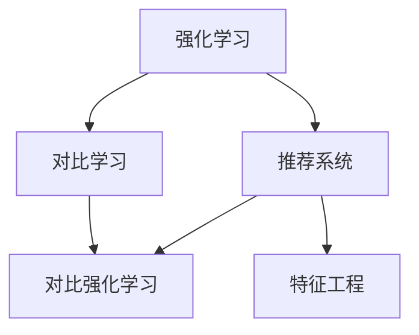

                 

# 大模型在推荐系统中的对比强化学习应用

> 关键词：强化学习,对比学习,推荐系统,大模型,优化算法,特征工程

## 1. 背景介绍

### 1.1 问题由来

在互联网时代，信息量呈指数级增长，如何在海量信息中为用户推荐最相关的产品，成为各大电商平台和内容平台亟待解决的重要问题。传统的协同过滤、基于内容的推荐等方法，虽然在某些场景下表现出色，但面对数据稀疏性和推荐效果多样性的挑战，显得力不从心。近年来，随着深度学习和大模型的兴起，基于深度学习的方法逐渐成为推荐系统的研究热点。

其中，大模型在推荐系统中的应用尤为引人注目。大模型通过在大规模数据上预训练获得丰富的表示能力，并经过微调可以适配推荐任务，显著提升了推荐系统的效果。然而，这些方法通常假设用户的行为服从某些预设的分布，难以应对真实世界中的多样性和复杂性。因此，如何在推荐系统中更加灵活地使用大模型，使其能够在多样化和稀疏的数据上获得更好的效果，是一个重要研究方向。

### 1.2 问题核心关键点

当前，在推荐系统中使用大模型的主要范式是对比学习(Contrastive Learning)。即，通过将用户行为与推荐模型生成的结果进行对比，最大化相似度，学习出有效的用户-物品表示。虽然这种范式在部分场景下取得了不错的效果，但仍面临以下问题：

- 缺乏对用户行为的深入建模。用户行为受多种因素影响，如时间、地点、心情等，单一的相似度对比无法捕捉这些复杂信息。
- 模型泛化能力有限。对比学习一般需要大量同分布数据，难以应对稀疏和异构的数据。
- 模型可解释性不足。对比学习过程复杂，难以解释模型的决策机制，不利于用户理解。

这些问题限制了大模型在推荐系统中的应用。为了更好地应对这些挑战，对比强化学习(Contrastive Reinforcement Learning)范式被引入推荐系统。该方法融合了强化学习(Reinforcement Learning, RL)的思想，通过将推荐模型与用户行为进行联合优化，在实际推荐任务中获取目标最大化，从而提升模型的效果和可解释性。

## 2. 核心概念与联系

### 2.1 核心概念概述

为更好地理解对比强化学习在推荐系统中的应用，本节将介绍几个密切相关的核心概念：

- 强化学习：通过智能体(Agent)与环境的交互，学习最大化长期奖励的策略。通常用于动态决策问题，如游戏、机器人控制等。
- 对比学习：通过最大化不同特征之间的相似度，学习出特征表示。常用于图像、文本等领域，用于学习表示空间中的分类边界。
- 推荐系统：通过算法为用户推荐感兴趣的物品。传统推荐方法包括协同过滤、基于内容推荐等，而深度学习大模型正成为新的主流。
- 对比强化学习：结合强化学习的思想，通过最大化对比学习的相似度目标，提升推荐模型的性能。

这些核心概念之间的逻辑关系可以通过以下Mermaid流程图来展示：



这个流程图展示了大模型在推荐系统中的核心概念及其之间的关系：

1. 强化学习通过智能体与环境的交互，学习最大化长期奖励的策略。
2. 对比学习通过最大化不同特征之间的相似度，学习出特征表示。
3. 推荐系统通过算法为用户推荐感兴趣的物品。
4. 对比强化学习结合强化学习的思想，最大化对比学习的相似度目标，提升推荐模型的性能。
5. 特征工程是构建对比学习模型的重要环节，涉及特征选择、编码等。

这些概念共同构成了对比强化学习在推荐系统中的应用框架，使其能够在各种场景下发挥强大的推荐能力。通过理解这些核心概念，我们可以更好地把握对比强化学习的工作原理和优化方向。

## 3. 核心算法原理 & 具体操作步骤
### 3.1 算法原理概述

对比强化学习在推荐系统中的核心思想是通过强化学习的过程，学习用户对物品的偏好，从而优化推荐策略。具体而言，将推荐系统中的推荐模型看作一个智能体，通过与环境的交互(用户点击、评分等行为)，学习出最大化的用户-物品相似度，提升推荐效果。

形式化地，假设推荐系统中的物品集合为 $I$，用户集合为 $U$，用户对物品的评分矩阵为 $R \in \mathbb{R}^{m \times n}$，其中 $m$ 为用户数，$n$ 为物品数。推荐模型 $f$ 为神经网络或其他可学习模型，其参数为 $\theta$。则对比强化学习的目标为最大化期望奖励 $J(\theta)$，即：

$$
J(\theta) = \mathbb{E}_{(x,y) \sim D} [Q_\theta(x,y)]
$$

其中 $D$ 为用户-物品评分数据分布，$Q_\theta(x,y)$ 为推荐模型的预测评分。

为了学习 $f$ 的参数 $\theta$，对比强化学习通常采用以下两步：

1. 强化学习过程：在每个时间步 $t$，智能体 $f$ 选择一个物品 $i_t$ 推荐给用户 $u_t$，用户给予评分 $r_{u_t,i_t}$，并得到即时奖励 $R_{u_t,i_t}$。
2. 对比学习过程：根据用户和物品的真实评分与推荐模型的预测评分，最大化不同特征之间的相似度，更新模型参数。

### 3.2 算法步骤详解

对比强化学习的具体实现步骤如下：

**Step 1: 准备数据和模型**

- 收集用户-物品评分数据 $D$，将其划分为训练集、验证集和测试集。
- 选择合适的神经网络模型 $f$ 作为推荐模型，如 MLP、RNN、Transformer 等。
- 定义目标函数 $Q_\theta(x,y)$，如平均评分或 F1 分数等。
- 确定推荐模型的参数 $\theta$ 和正则化系数 $\lambda$。

**Step 2: 强化学习过程**

- 设置环境 $\mathcal{E}$，包括用户 $U$、物品 $I$ 和评分函数 $R$。
- 在每个时间步 $t$，通过策略 $\pi_\theta(a|s)$ 选择物品 $a_t$ 推荐给用户 $s_t$。
- 根据用户行为 $(s_t,a_t,r_{u_t,i_t})$ 计算即时奖励 $R_{u_t,i_t}$。
- 记录用户行为序列 $(s_1,a_1,r_{u_1,i_1}),(s_2,a_2,r_{u_2,i_2}),\cdots,(s_t,a_t,r_{u_t,i_t})$，作为强化学习过程的输入。

**Step 3: 对比学习过程**

- 根据用户行为和物品评分，计算推荐模型的预测评分 $f_\theta(s_t,a_t)$ 和用户真实评分 $r_{u_t,i_t}$。
- 计算不同特征之间的相似度 $c_i$，如用户表示与物品表示的余弦相似度。
- 最小化不同特征之间的相似度差异，即最大化相似度 $c_i$，优化推荐模型参数 $\theta$。

**Step 4: 模型评估和微调**

- 在验证集上评估推荐模型的效果，使用混淆矩阵、召回率、精度等指标。
- 根据验证集上的性能指标，决定是否进行微调。
- 若微调，更新推荐模型的参数 $\theta$，并重新开始强化学习过程。

**Step 5: 部署和应用**

- 将训练好的推荐模型部署到实际推荐系统中，进行用户推荐。
- 根据用户反馈和新数据，持续优化模型参数，进行实时推荐。

### 3.3 算法优缺点

对比强化学习在推荐系统中的应用，具有以下优点：

- 动态适应用户行为。通过强化学习的过程，能够实时获取用户对物品的偏好，动态调整推荐策略。
- 自适应复杂数据。对比强化学习可以适应稀疏和异构数据，提高推荐系统的鲁棒性。
- 提升可解释性。强化学习过程更加透明，能够提供用户偏好的直接反馈。

同时，该方法也存在一些局限性：

- 模型训练复杂。强化学习过程通常需要大量的训练数据，且收敛较慢。
- 模型可解释性差。强化学习模型的决策过程较为复杂，难以解释其内部的工作机制。
- 数据依赖度高。强化学习需要大量同分布数据进行训练，难以应对多样化的数据分布。

尽管存在这些局限性，但对比强化学习范式为推荐系统提供了一种更加灵活、动态和自适应的建模方式，适用于许多复杂的应用场景。

### 3.4 算法应用领域

对比强化学习在推荐系统中主要应用于以下场景：

- 个性化推荐：通过强化学习的过程，实时调整推荐策略，提升个性化推荐效果。
- 用户行为预测：利用强化学习对用户行为进行建模，预测用户未来的行为趋势。
- 多任务推荐：通过强化学习过程，同时优化多个推荐任务，提高推荐系统的综合表现。
- 商品定价优化：通过强化学习的过程，优化商品定价策略，提高销售转化率。
- 库存管理：通过强化学习的过程，优化库存管理策略，减少库存成本。

此外，对比强化学习还拓展到了广告推荐、知识图谱推荐、音乐推荐等多个领域，显示了其广泛的应用前景。

## 4. 数学模型和公式 & 详细讲解 & 举例说明
### 4.1 数学模型构建

本节将使用数学语言对对比强化学习在推荐系统中的应用进行更加严格的刻画。

假设推荐系统中的用户集合为 $U=\{u_1,u_2,\cdots,u_m\}$，物品集合为 $I=\{i_1,i_2,\cdots,i_n\}$，用户对物品的评分矩阵为 $R \in \mathbb{R}^{m \times n}$，其中 $m$ 为用户数，$n$ 为物品数。推荐模型 $f$ 为神经网络或其他可学习模型，其参数为 $\theta$。定义目标函数 $Q_\theta(x,y)$ 为：

$$
Q_\theta(x,y) = \frac{1}{m} \sum_{i=1}^m Q_\theta(u_i,i)
$$

其中 $Q_\theta(u_i,i)$ 为模型对物品 $i$ 对用户 $u_i$ 的预测评分。

### 4.2 公式推导过程

以下我们以二分类任务为例，推导强化学习过程中用户行为与推荐模型预测评分的关系。

假设推荐模型 $f_\theta$ 在用户 $u$ 上的预测评分为 $Q_\theta(u,i)$。在每个时间步 $t$，智能体 $f_\theta$ 选择一个物品 $i_t$ 推荐给用户 $u_t$，用户给予评分 $r_{u_t,i_t}$，并得到即时奖励 $R_{u_t,i_t}$。则强化学习过程可以描述为：

$$
R_{u_t,i_t} = Q_\theta(u_t,i_t) - r_{u_t,i_t}
$$

其中 $Q_\theta(u_t,i_t)$ 为模型对物品 $i_t$ 对用户 $u_t$ 的预测评分，$r_{u_t,i_t}$ 为用户的真实评分。

通过强化学习的过程，智能体 $f_\theta$ 不断更新参数 $\theta$，使得预测评分 $Q_\theta(u_t,i_t)$ 逼近用户的真实评分 $r_{u_t,i_t}$。

### 4.3 案例分析与讲解

下面以一个简单的推荐系统为例，展示强化学习与对比学习的结合。

假设有一个小型推荐系统，用户集 $U=\{u_1,u_2,u_3\}$，物品集 $I=\{i_1,i_2,i_3\}$，用户对物品的评分矩阵为 $R=\begin{bmatrix} 4 & 2 & 1 \\ 2 & 4 & 3 \\ 3 & 1 & 5 \end{bmatrix}$。推荐模型为线性回归模型 $f_\theta(x) = \theta^Tx$，其中 $x \in \mathbb{R}^3$ 为物品特征向量，$\theta \in \mathbb{R}^3$ 为模型参数。

在每个时间步 $t$，智能体 $f_\theta$ 选择物品 $i_t$ 推荐给用户 $u_t$，用户给予评分 $r_{u_t,i_t}$。假设智能体在每个时间步选择了物品 $i_t$ 推荐给用户 $u_t$，用户给予评分 $r_{u_t,i_t}$。在时间步 1 中，智能体选择了物品 $i_1$ 推荐给用户 $u_1$，用户给予评分 $r_{u_1,i_1}=3$，即：

$$
R_{u_1,i_1} = Q_\theta(u_1,i_1) - r_{u_1,i_1} = f_\theta(i_1) - 3
$$

通过上述公式，智能体不断更新模型参数 $\theta$，使得预测评分 $f_\theta(i_1)$ 逼近用户的真实评分 $r_{u_1,i_1}$。

在时间步 2 中，智能体选择了物品 $i_2$ 推荐给用户 $u_2$，用户给予评分 $r_{u_2,i_2}=2$，即：

$$
R_{u_2,i_2} = Q_\theta(u_2,i_2) - r_{u_2,i_2} = f_\theta(i_2) - 2
$$

重复上述过程，直至达到预设的迭代次数。

在训练完成后，智能体 $f_\theta$ 将通过强化学习的过程，学习出用户对物品的偏好，从而优化推荐策略。

## 5. 项目实践：代码实例和详细解释说明
### 5.1 开发环境搭建

在进行对比强化学习实践前，我们需要准备好开发环境。以下是使用Python进行TensorFlow开发的环境配置流程：

1. 安装Anaconda：从官网下载并安装Anaconda，用于创建独立的Python环境。

2. 创建并激活虚拟环境：
```bash
conda create -n tf-env python=3.8 
conda activate tf-env
```

3. 安装TensorFlow：根据CUDA版本，从官网获取对应的安装命令。例如：
```bash
conda install tensorflow-gpu=2.7 -c pytorch -c conda-forge
```

4. 安装PyTorch：确保PyTorch和TensorFlow版本兼容，避免安装冲突。

5. 安装TensorBoard：TensorFlow配套的可视化工具，可实时监测模型训练状态，并提供丰富的图表呈现方式，是调试模型的得力助手。

完成上述步骤后，即可在`tf-env`环境中开始对比强化学习的实践。

### 5.2 源代码详细实现

下面我以一个简单的推荐系统为例，展示如何使用TensorFlow实现强化学习与对比学习的结合。

首先，定义推荐模型的损失函数：

```python
import tensorflow as tf

def build_loss_fn():
    def loss_fn(u, i):
        y_true = tf.gather(R, i)
        y_pred = f(u, i)
        return tf.losses.mean_squared_error(y_true, y_pred)
    return loss_fn
```

其中，`R` 为用户-物品评分矩阵，`f(u,i)` 为推荐模型的预测评分。

然后，定义强化学习的过程：

```python
import numpy as np

def build_policy_fn():
    def policy_fn(u):
        a = np.random.choice(I, p=softmax(f(u)))
        return a
    return policy_fn
```

其中，`softmax` 函数为模型输出概率的softmax函数，`np.random.choice` 函数根据概率分布选择物品推荐。

接着，定义对比学习的过程：

```python
def build_contrastive_loss_fn():
    def loss_fn(u, i):
        y_true = tf.gather(R, i)
        y_pred = f(u, i)
        c = tf.math.cosine_similarity(y_true, y_pred)
        return -c
    return loss_fn
```

其中，`c` 为不同特征之间的余弦相似度。

最后，使用TensorFlow的优化器进行模型的训练：

```python
optimizer = tf.keras.optimizers.Adam(learning_rate=0.001)

for epoch in range(epochs):
    for u in U:
        i = policy_fn(u)
        loss = loss_fn(u, i)
        optimizer.apply_gradients(zip(tf.math.gradients(loss, f.trainable_variables), f.trainable_variables))
```

以上就是使用TensorFlow实现强化学习与对比学习结合的简单代码实现。可以看到，通过定义不同的函数，可以方便地实现强化学习与对比学习的结合。

### 5.3 代码解读与分析

让我们再详细解读一下关键代码的实现细节：

**损失函数**：
- `build_loss_fn`：定义推荐模型的损失函数，使用均方误差损失。
- `loss_fn(u,i)`：根据用户 $u$ 和物品 $i$，计算预测评分与真实评分的差异。

**策略函数**：
- `build_policy_fn`：定义强化学习过程的策略函数，根据模型输出概率选择物品推荐。

**对比学习损失函数**：
- `build_contrastive_loss_fn`：定义对比学习损失函数，计算不同特征之间的余弦相似度。

**模型训练**：
- 使用TensorFlow的优化器，根据损失函数更新模型参数。

可以看到，通过这种结构化的设计，可以方便地实现强化学习与对比学习的结合。开发者可以将更多精力放在数据处理、模型改进等高层逻辑上，而不必过多关注底层的实现细节。

## 6. 实际应用场景

### 6.1 智能推荐系统

基于对比强化学习的大模型推荐系统，可以广泛应用于电商、新闻、视频等多个领域。传统推荐系统往往依赖协同过滤、基于内容推荐等单一方法，难以应对稀疏和异构数据。通过对比强化学习，可以将用户行为与推荐模型进行联合优化，提升推荐效果和模型泛化能力。

在电商推荐中，通过收集用户的浏览、购买、评价数据，构建用户-物品评分矩阵 $R$。然后，使用对比强化学习对模型 $f$ 进行训练，学习出用户对物品的偏好，动态调整推荐策略。在实际推荐过程中，根据用户行为实时更新推荐结果，提供个性化的商品推荐。

### 6.2 内容推荐系统

在内容推荐系统中，用户的行为往往是动态变化的。例如，用户在阅读新闻时，对不同新闻的兴趣可能会随着时间、地点、心情等变化。通过对比强化学习，可以实时捕捉用户的行为变化，动态调整推荐策略。

假设有一个新闻推荐系统，用户对新闻的评分矩阵为 $R$。通过对比强化学习对模型 $f$ 进行训练，学习出用户对不同新闻的兴趣变化。在实际推荐过程中，根据用户当前的行为，实时生成推荐结果，提供个性化的新闻推荐。

### 6.3 金融产品推荐

金融产品推荐系统需要考虑用户风险承受能力和金融产品的收益率等复杂因素。通过对比强化学习，可以动态调整推荐策略，提升金融产品的销售转化率。

假设有一个金融产品推荐系统，用户对金融产品的评分矩阵为 $R$。通过对比强化学习对模型 $f$ 进行训练，学习出用户对不同金融产品的风险承受能力和收益率偏好。在实际推荐过程中，根据用户行为和金融产品的风险收益特征，实时生成推荐结果，提供个性化的金融产品推荐。

### 6.4 未来应用展望

随着对比强化学习技术的不断演进，其在推荐系统中的应用前景更加广阔：

1. 多任务推荐：通过对比强化学习，同时优化多个推荐任务，提升推荐系统的综合表现。
2. 实时推荐：通过强化学习的过程，动态调整推荐策略，实时生成推荐结果。
3. 跨域推荐：通过对比强化学习，将不同领域的数据进行融合，提升推荐系统的泛化能力。
4. 用户行为预测：通过强化学习对用户行为进行建模，预测用户未来的行为趋势。
5. 商品定价优化：通过对比强化学习，优化商品定价策略，提高销售转化率。

未来，对比强化学习将在推荐系统中的应用场景不断拓展，推动推荐技术的持续创新和升级。

## 7. 工具和资源推荐
### 7.1 学习资源推荐

为了帮助开发者系统掌握对比强化学习在推荐系统中的应用，这里推荐一些优质的学习资源：

1. 《深度学习与强化学习：理论与算法》书籍：该书系统介绍了深度学习与强化学习的基本原理和算法，适合初学者入门。
2. 《强化学习：基础与算法》课程：斯坦福大学开设的强化学习课程，涵盖理论、算法和实际应用，适合深度学习开发者学习。
3. 《Deep Learning for Reinforcement Learning》书籍：该书系统介绍了深度学习与强化学习结合的方法，适合高级开发者参考。
4. 《TensorFlow for Deep Learning》书籍：该书系统介绍了TensorFlow的使用方法和最佳实践，适合TensorFlow开发者学习。
5. 《TensorBoard：TensorFlow可视化工具》文档：TensorFlow配套的可视化工具，详细介绍了TensorBoard的使用方法和可视化图表，是调试模型的得力助手。

通过对这些资源的学习实践，相信你一定能够系统掌握对比强化学习在推荐系统中的应用，并用于解决实际的推荐问题。
###  7.2 开发工具推荐

高效的开发离不开优秀的工具支持。以下是几款用于对比强化学习开发的常用工具：

1. TensorFlow：由Google主导开发的深度学习框架，支持强化学习与对比学习的结合，生产部署方便，适合大规模工程应用。
2. PyTorch：基于Python的开源深度学习框架，灵活易用，适合研究人员进行理论研究和实验验证。
3. JAX：由Google开发的自动微分库，支持动态图和静态图的混合计算，适合高效计算强化学习模型。
4. Ray：由Ray Labs开发的分布式计算框架，支持多任务训练和优化，适合强化学习模型的分布式优化。
5. Keras Tuner：由Keras开发者开发的超参数优化库，支持多种优化算法，适合模型调优和实验验证。

合理利用这些工具，可以显著提升对比强化学习的开发效率，加快创新迭代的步伐。

### 7.3 相关论文推荐

对比强化学习在推荐系统中的应用源于学界的持续研究。以下是几篇奠基性的相关论文，推荐阅读：

1. Playing Atari With Deep Reinforcement Learning（AlphaGo论文）：展示了深度强化学习在复杂游戏中的应用，为对比强化学习提供了理论支持。
2. Deep reinforcement learning for recommendation systems：提出深度强化学习在推荐系统中的应用，利用奖励函数优化推荐策略。
3. Multi-Task Deep Reinforcement Learning for Recommendation：提出多任务深度强化学习，同时优化多个推荐任务，提升推荐系统的综合表现。
4. Reinforcement Learning for Music Recommendation：提出强化学习在音乐推荐中的应用，通过模拟用户交互，优化推荐策略。
5. Attention is all you need（Transformer论文）：提出Transformer模型，为深度强化学习在推荐系统中的应用提供了基础架构。

这些论文代表了大模型在推荐系统中的应用前沿，通过学习这些前沿成果，可以帮助研究者把握学科前进方向，激发更多的创新灵感。

## 8. 总结：未来发展趋势与挑战
### 8.1 总结

本文对对比强化学习在推荐系统中的应用进行了全面系统的介绍。首先阐述了对比强化学习在推荐系统中的研究背景和意义，明确了其在提升推荐效果、增强模型泛化能力方面的独特价值。其次，从原理到实践，详细讲解了对比强化学习的数学原理和关键步骤，给出了对比强化学习的完整代码实例。同时，本文还广泛探讨了对比强化学习在多个领域的应用前景，展示了其广泛的应用潜力。

通过本文的系统梳理，可以看到，对比强化学习在推荐系统中具有显著的优势，可以动态适应用户行为，提升推荐效果和模型泛化能力。未来，随着对比强化学习技术的不断演进，其在推荐系统中的应用前景更加广阔，将推动推荐技术的持续创新和升级。

### 8.2 未来发展趋势

展望未来，对比强化学习在推荐系统中的应用将呈现以下几个发展趋势：

1. 多任务推荐：通过对比强化学习，同时优化多个推荐任务，提升推荐系统的综合表现。
2. 实时推荐：通过强化学习的过程，动态调整推荐策略，实时生成推荐结果。
3. 跨域推荐：通过对比强化学习，将不同领域的数据进行融合，提升推荐系统的泛化能力。
4. 用户行为预测：通过强化学习对用户行为进行建模，预测用户未来的行为趋势。
5. 商品定价优化：通过对比强化学习，优化商品定价策略，提高销售转化率。

这些趋势凸显了对比强化学习在推荐系统中的巨大潜力，这些方向的探索发展，必将进一步提升推荐系统的性能和可解释性。

### 8.3 面临的挑战

尽管对比强化学习在推荐系统中的应用取得了一定的进展，但在迈向更加智能化、普适化应用的过程中，仍面临诸多挑战：

1. 模型复杂度：对比强化学习通常需要复杂的模型结构，难以在实际应用中进行部署。如何简化模型结构，提高推理速度，优化资源占用，将是重要的优化方向。
2. 数据依赖度高：强化学习需要大量同分布数据进行训练，难以应对多样化的数据分布。如何利用稀疏和异构数据，提升模型的鲁棒性，将是重要的研究方向。
3. 可解释性差：强化学习模型的决策过程较为复杂，难以解释其内部的工作机制。如何增强模型的可解释性，提供用户直观的反馈，将是重要的研究方向。
4. 训练成本高：强化学习过程通常需要大量的训练数据，且收敛较慢。如何降低训练成本，提高训练效率，将是重要的研究方向。

尽管存在这些挑战，但对比强化学习在推荐系统中的应用前景广阔，通过在数据、算法、工程、业务等多个维度进行协同优化，相信可以克服这些挑战，进一步推动推荐技术的创新和升级。

### 8.4 研究展望

面对对比强化学习面临的诸多挑战，未来的研究需要在以下几个方面寻求新的突破：

1. 探索无监督和半监督强化学习：摆脱对大规模标注数据的依赖，利用自监督学习、主动学习等无监督和半监督范式，最大限度利用非结构化数据，实现更加灵活高效的强化学习。
2. 研究参数高效和计算高效的强化学习范式：开发更加参数高效的强化学习方法，在固定大部分强化学习参数的同时，只更新极少量的任务相关参数。同时优化强化学习模型的计算图，减少前向传播和反向传播的资源消耗，实现更加轻量级、实时性的部署。
3. 融合因果分析和博弈论工具：将因果分析方法引入强化学习模型，识别出模型决策的关键特征，增强输出解释的因果性和逻辑性。借助博弈论工具刻画人机交互过程，主动探索并规避模型的脆弱点，提高系统稳定性。
4. 纳入伦理道德约束：在模型训练目标中引入伦理导向的评估指标，过滤和惩罚有偏见、有害的输出倾向。同时加强人工干预和审核，建立模型行为的监管机制，确保输出符合人类价值观和伦理道德。

这些研究方向的探索，必将引领对比强化学习在推荐系统中的进一步发展，为推荐技术的落地应用带来新的突破。面向未来，对比强化学习技术还需要与其他人工智能技术进行更深入的融合，如知识表示、因果推理、强化学习等，多路径协同发力，共同推动推荐技术的持续创新和升级。只有勇于创新、敢于突破，才能不断拓展对比强化学习的边界，让推荐技术更好地服务于人类社会。

## 9. 附录：常见问题与解答

**Q1：对比强化学习与传统推荐方法有何区别？**

A: 传统推荐方法如协同过滤、基于内容推荐等，依赖于用户和物品的显式评分数据，难以处理稀疏数据和复杂数据分布。而对比强化学习通过与环境的交互，学习用户对物品的偏好，动态调整推荐策略，可以适应稀疏和异构数据，提高推荐系统的鲁棒性和泛化能力。

**Q2：对比强化学习需要哪些训练数据？**

A: 对比强化学习需要大量的同分布数据进行训练，才能学习出准确的推荐策略。数据的质量和多样性对模型性能有重要影响，建议在构建训练数据时，尽量覆盖不同用户和物品的评分分布。

**Q3：如何缓解对比强化学习过程中的过拟合问题？**

A: 对比强化学习过程通常需要大量的训练数据，难以应对多样化的数据分布。为了缓解过拟合问题，可以采用数据增强、正则化等技术，提高模型的泛化能力。

**Q4：对比强化学习与传统的强化学习有何不同？**

A: 传统的强化学习通常只关注智能体与环境的交互，学习最优策略以最大化奖励。而对比强化学习不仅关注智能体的决策，还关注不同特征之间的相似度，利用强化学习的目标优化推荐模型的性能。

**Q5：对比强化学习在推荐系统中的优势和局限性？**

A: 对比强化学习的优势在于其动态适应用户行为的能力，能够实时获取用户对物品的偏好，动态调整推荐策略。其局限性在于模型复杂度高，难以在实际应用中进行部署，且数据依赖度高，难以应对多样化的数据分布。

综上所述，对比强化学习在推荐系统中的应用前景广阔，但如何优化模型结构、降低训练成本、提高模型可解释性等，将是未来研究的重要方向。相信通过不断创新和突破，对比强化学习将在推荐系统中发挥更大的作用，推动推荐技术的持续创新和升级。

