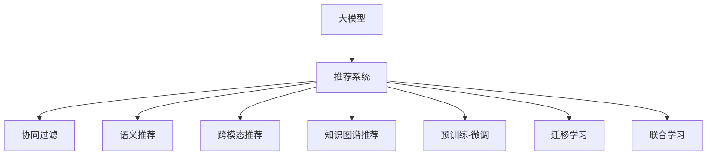

                 

# 大模型在推荐系统的未来：统一与融合的趋势

## 1. 背景介绍

### 1.1 问题由来

随着互联网和智能技术的飞速发展，推荐系统在商业、教育和娱乐等多个领域发挥了越来越重要的作用。然而，当前推荐系统主要依赖于数据驱动的协同过滤算法和传统的机器学习模型，存在数据稀疏性高、缺乏上下文理解和冷启动问题。近年来，随着大模型（Large Models）的崛起，以深度学习为基础的推荐系统开始受到广泛关注。大模型具备强大的自适应能力和丰富的知识表示，有望实现从用户行为数据驱动到知识驱动的转变，带来推荐系统的本质性进步。

### 1.2 问题核心关键点

大模型在推荐系统中的应用，主要体现在以下几个方面：
1. **语义理解**：大模型能够从自然语言文本中提取语义信息，更好地理解用户的兴趣和偏好。
2. **跨模态融合**：大模型能够整合不同模态的数据，如文本、图片、音频等，提升推荐系统的多感官融合能力。
3. **知识图谱**：大模型能够学习并应用知识图谱，将结构化知识与推荐算法结合，提供更全面、精准的推荐。
4. **预训练-微调**：通过在大规模无标签数据上进行预训练，大模型能够在少量有标签数据上实现高效的微调，适应新的推荐任务。
5. **迁移学习**：大模型具备跨领域迁移学习能力，能够将在一个领域学到的知识迁移到另一个领域，提升推荐系统的通用性。
6. **联合学习**：大模型能够与其他用户模型、物品模型联合训练，提高推荐系统的协同能力。

这些关键点展示了大模型在推荐系统中的巨大潜力，但也提出了新的挑战：如何在大模型与推荐系统之间建立有效的统一与融合机制，以充分发挥大模型的优势。

## 2. 核心概念与联系

### 2.1 核心概念概述

为更好地理解大模型在推荐系统中的应用，本节将介绍几个密切相关的核心概念：

- **大模型（Large Models）**：以深度神经网络为基础的大规模预训练模型，如BERT、GPT、T5等。通过在大规模无标签数据上预训练，大模型具备强大的语义理解和生成能力。
- **推荐系统（Recommender System）**：基于用户历史行为数据和物品属性信息，为用户推荐其感兴趣的内容。
- **协同过滤（Collaborative Filtering）**：一种基于用户行为数据推荐的经典技术，包括用户协同过滤和物品协同过滤两种方式。
- **语义推荐（Semantic Recommendation）**：结合自然语言处理技术，从文本数据中提取语义信息，提升推荐系统的精准度。
- **跨模态推荐（Cross-modal Recommendation）**：整合不同模态的数据，提升推荐系统的感知能力和多感官融合能力。
- **知识图谱推荐（KG-based Recommendation）**：结合知识图谱，利用结构化知识提升推荐系统的广度和深度。
- **预训练-微调（Pre-training & Fine-tuning）**：在大模型上进行预训练，在推荐任务上微调，提升推荐模型的泛化能力。
- **迁移学习（Transfer Learning）**：将在大规模数据上训练的知识，迁移到特定任务上，减少标注数据的依赖。
- **联合学习（Federated Learning）**：分布式协同训练多个模型，提高推荐系统的协同能力和鲁棒性。

这些核心概念之间的逻辑关系可以通过以下Mermaid流程图来展示：



这个流程图展示了大模型与推荐系统的核心概念及其之间的关系：

1. 大模型通过预训练获得基础能力。
2. 推荐系统融合大模型的能力，提升推荐效果。
3. 通过微调、迁移学习等方法，大模型适应特定推荐任务。
4. 跨模态推荐、联合学习等技术拓展推荐系统的边界。

这些概念共同构成了大模型在推荐系统中的应用框架，使其能够实现从用户行为数据驱动到知识驱动的转变，提升推荐系统的性能和适用性。

## 3. 核心算法原理 & 具体操作步骤
### 3.1 算法原理概述

基于大模型的推荐系统，主要利用大模型的语义理解和跨模态融合能力，通过预训练-微调（Pre-training & Fine-tuning）等技术，提升推荐系统的精准度和广度。其核心思想是：将大模型视作一个强大的特征提取器，通过微调优化模型在特定推荐任务上的性能，从而实现高效的推荐。

形式化地，假设预训练大模型为 $M_{\theta}$，其中 $\theta$ 为预训练得到的模型参数。给定推荐任务 $T$ 的标注数据集 $D=\{(x_i, y_i)\}_{i=1}^N$，推荐任务的目标是找到最优参数 $\hat{\theta}$，使得模型推荐出的结果最接近真实标签 $y_i$。

微调的目标是：
$$
\hat{\theta}=\mathop{\arg\min}_{\theta} \mathcal{L}(M_{\theta},D)
$$

其中 $\mathcal{L}$ 为针对推荐任务设计的损失函数，用于衡量模型推荐结果与真实标签之间的差异。常见的损失函数包括交叉熵损失、均方误差损失等。

通过梯度下降等优化算法，微调过程不断更新模型参数 $\theta$，最小化损失函数 $\mathcal{L}$，使得模型推荐结果逼近真实标签。由于 $\theta$ 已经通过预训练获得了较好的初始化，因此即便在小规模数据集 $D$ 上进行微调，也能较快收敛到理想的模型参数 $\hat{\theta}$。

### 3.2 算法步骤详解

基于大模型的推荐系统微调一般包括以下几个关键步骤：

**Step 1: 准备预训练模型和数据集**
- 选择合适的预训练大模型 $M_{\theta}$ 作为初始化参数，如 BERT、GPT 等。
- 准备推荐任务 $T$ 的标注数据集 $D$，划分为训练集、验证集和测试集。一般要求标注数据与预训练数据的分布不要差异过大。

**Step 2: 设计推荐目标函数**
- 根据推荐任务类型，在预训练模型顶层设计合适的输出层和损失函数。
- 对于二分类任务，通常在顶层添加线性分类器和交叉熵损失函数。
- 对于多分类任务，通常使用softmax函数输出概率分布，并以交叉熵损失为损失函数。

**Step 3: 设置微调超参数**
- 选择合适的优化算法及其参数，如 AdamW、SGD 等，设置学习率、批大小、迭代轮数等。
- 设置正则化技术及强度，包括权重衰减、Dropout、Early Stopping 等。
- 确定冻结预训练参数的策略，如仅微调顶层，或全部参数都参与微调。

**Step 4: 执行梯度训练**
- 将训练集数据分批次输入模型，前向传播计算损失函数。
- 反向传播计算参数梯度，根据设定的优化算法和学习率更新模型参数。
- 周期性在验证集上评估模型性能，根据性能指标决定是否触发 Early Stopping。
- 重复上述步骤直到满足预设的迭代轮数或 Early Stopping 条件。

**Step 5: 测试和部署**
- 在测试集上评估微调后模型 $M_{\hat{\theta}}$ 的性能，对比微调前后的推荐效果。
- 使用微调后的模型对新样本进行推荐，集成到实际的应用系统中。
- 持续收集新的数据，定期重新微调模型，以适应数据分布的变化。

以上是基于大模型的推荐系统微调的一般流程。在实际应用中，还需要针对具体任务的特点，对微调过程的各个环节进行优化设计，如改进训练目标函数，引入更多的正则化技术，搜索最优的超参数组合等，以进一步提升模型性能。

### 3.3 算法优缺点

基于大模型的推荐系统微调方法具有以下优点：
1. 精度高。大模型具备强大的语义理解和跨模态融合能力，可以提取更多用户和物品的特征，提升推荐精度。
2. 泛化能力强。预训练大模型在大规模无标签数据上学习到的特征，具有较好的泛化能力，适用于各种推荐任务。
3. 可解释性强。大模型能够提供推荐决策的语义解释，帮助用户理解推荐逻辑。
4. 适应性强。通过微调，大模型能够适应不同的推荐任务和数据分布。

同时，该方法也存在一定的局限性：
1. 数据需求高。大模型需要大量的标注数据进行微调，数据获取成本较高。
2. 计算资源要求高。大模型的参数量较大，微调过程中对计算资源要求较高。
3. 部署复杂。微调后的模型需要复杂的数据处理和推理机制，部署和维护成本较高。
4. 鲁棒性差。大模型对输入数据的微小变化敏感，容易受到数据噪声的影响。

尽管存在这些局限性，但就目前而言，基于大模型的推荐系统微调方法仍是大规模推荐系统的主流范式。未来相关研究的重点在于如何进一步降低微调对数据和计算资源的需求，提高模型的少样本学习和跨领域迁移能力，同时兼顾可解释性和鲁棒性等因素。

### 3.4 算法应用领域

基于大模型的推荐系统微调方法，已经在多个领域得到了广泛的应用，包括但不限于：

- **电商推荐**：为商品推荐个性化标签，提升商品推荐效果。
- **内容推荐**：为用户推荐新闻、视频、文章等内容，提高用户满意度。
- **广告推荐**：为广告主推荐合适的广告素材，提高广告投放效果。
- **音乐推荐**：为用户推荐个性化音乐，提升音乐平台的用户黏性。
- **电影推荐**：为用户推荐个性化电影，提升电影平台的推荐效果。
- **新闻推荐**：为用户推荐个性化新闻，提高用户阅读体验。
- **金融推荐**：为金融机构推荐客户金融产品，提高金融服务的精准度。
- **健康推荐**：为用户推荐健康产品，提高健康管理效果。

除了上述这些经典应用外，大模型在推荐系统中的应用还不断拓展到更多场景中，如智能家居、智能城市、智慧教育等，为推荐系统带来了新的突破。

## 4. 数学模型和公式 & 详细讲解 & 举例说明

### 4.1 数学模型构建

假设推荐任务 $T$ 的目标是最大化用户 $u$ 对物品 $i$ 的评分 $r_{ui}$，那么形式化的推荐目标可以表示为：
$$
\max_u \sum_{i=1}^N r_{ui}
$$

其中 $r_{ui}$ 为推荐模型预测的用户 $u$ 对物品 $i$ 的评分。

在基于大模型的推荐系统中，通常使用点积方法（如Cosine Similarity）计算用户与物品的相似度，具体公式如下：
$$
\text{similarity}(u,i) = \text{dot}(u,i) = \text{w}^T \cdot \text{embedding}(u) \cdot \text{embedding}(i)
$$

其中 $\text{embedding}(u)$ 和 $\text{embedding}(i)$ 分别为用户 $u$ 和物品 $i$ 的嵌入表示，$\text{w}$ 为权重向量。

为了训练推荐模型，通常需要设计一个损失函数。以常见的BPR损失函数为例，其公式为：
$$
\mathcal{L} = -\sum_{i=1}^N \log \sigma(\text{similarity}(u_i,i^+) - \text{similarity}(u_i,i^-))
$$

其中 $u_i$ 为第 $i$ 个用户的表示向量，$i^+$ 和 $i^-$ 分别为正样本和负样本的表示向量，$\sigma$ 为 sigmoid 函数。

### 4.2 公式推导过程

接下来，我们推导BPR损失函数的具体形式。

假设用户 $u$ 的嵌入表示为 $\text{embedding}(u) = [u_1,u_2,\ldots,u_d]$，物品 $i$ 的嵌入表示为 $\text{embedding}(i) = [i_1,i_2,\ldots,i_d]$，其中 $d$ 为嵌入向量的维度。

点积计算公式为：
$$
\text{dot}(u,i) = u_1i_1 + u_2i_2 + \cdots + u_di_d
$$

则BPR损失函数为：
$$
\mathcal{L} = -\sum_{i=1}^N \log \sigma(\text{dot}(u_i,i^+) - \text{dot}(u_i,i^-))
$$

将点积公式代入，得：
$$
\mathcal{L} = -\sum_{i=1}^N \log \sigma(\text{w}^T \cdot \text{embedding}(u_i) \cdot \text{embedding}(i^+) - \text{w}^T \cdot \text{embedding}(u_i) \cdot \text{embedding}(i^-))
$$

### 4.3 案例分析与讲解

以电商推荐为例，分析基于大模型的推荐系统的数学模型和公式推导。

假设电商平台的推荐任务是推荐商品，用户的评分 $r_{ui}$ 为0-5的整数，1表示不喜欢，5表示非常喜欢。平台收集了大量的用户历史购买行为数据和商品信息，准备使用大模型进行推荐。

在训练过程中，假设用户 $u$ 的嵌入表示为 $\text{embedding}(u)$，商品 $i$ 的嵌入表示为 $\text{embedding}(i)$。正样本 $i^+$ 为用户购买过的商品，负样本 $i^-$ 为用户未购买过的商品。

推荐模型的目标是最大化用户对物品的评分 $r_{ui}$，即：
$$
\max_u \sum_{i=1}^N r_{ui}
$$

为了衡量推荐模型的性能，通常使用BPR损失函数进行优化：
$$
\mathcal{L} = -\sum_{i=1}^N \log \sigma(\text{dot}(u_i,i^+) - \text{dot}(u_i,i^-))
$$

在训练过程中，模型通过前向传播计算用户 $u$ 对物品 $i$ 的评分预测 $\hat{r}_{ui}$，然后计算预测评分与真实评分的差异，通过BPR损失函数进行反向传播，更新模型参数。

在测试阶段，模型对新的用户行为进行预测，推荐其可能感兴趣的商品。最终，通过推荐模型的评分预测 $\hat{r}_{ui}$ 和真实评分 $r_{ui}$ 的均方误差（MSE）来评估推荐效果：
$$
\text{MSE} = \frac{1}{N} \sum_{i=1}^N (\hat{r}_{ui} - r_{ui})^2
$$

## 5. 项目实践：代码实例和详细解释说明
### 5.1 开发环境搭建

在进行推荐系统大模型微调实践前，我们需要准备好开发环境。以下是使用Python进行PyTorch开发的环境配置流程：

1. 安装Anaconda：从官网下载并安装Anaconda，用于创建独立的Python环境。

2. 创建并激活虚拟环境：
```bash
conda create -n pytorch-env python=3.8 
conda activate pytorch-env
```

3. 安装PyTorch：根据CUDA版本，从官网获取对应的安装命令。例如：
```bash
conda install pytorch torchvision torchaudio cudatoolkit=11.1 -c pytorch -c conda-forge
```

4. 安装Transformers库：
```bash
pip install transformers
```

5. 安装各类工具包：
```bash
pip install numpy pandas scikit-learn matplotlib tqdm jupyter notebook ipython
```

完成上述步骤后，即可在`pytorch-env`环境中开始推荐系统大模型微调实践。

### 5.2 源代码详细实现

下面我们以电商推荐为例，给出使用Transformers库对BERT模型进行微调的PyTorch代码实现。

首先，定义电商推荐的数据处理函数：

```python
from transformers import BertTokenizer
from torch.utils.data import Dataset
import torch

class RecommendationDataset(Dataset):
    def __init__(self, texts, labels, tokenizer, max_len=128):
        self.texts = texts
        self.labels = labels
        self.tokenizer = tokenizer
        self.max_len = max_len
        
    def __len__(self):
        return len(self.texts)
    
    def __getitem__(self, item):
        text = self.texts[item]
        label = self.labels[item]
        
        encoding = self.tokenizer(text, return_tensors='pt', max_length=self.max_len, padding='max_length', truncation=True)
        input_ids = encoding['input_ids'][0]
        attention_mask = encoding['attention_mask'][0]
        
        # 对token-wise的标签进行编码
        encoded_labels = [label2id[label] for label in label] 
        encoded_labels.extend([label2id['O']] * (self.max_len - len(encoded_labels)))
        labels = torch.tensor(encoded_labels, dtype=torch.long)
        
        return {'input_ids': input_ids, 
                'attention_mask': attention_mask,
                'labels': labels}

# 标签与id的映射
label2id = {'O': 0, 'B-PER': 1, 'I-PER': 2, 'B-ORG': 3, 'I-ORG': 4, 'B-LOC': 5, 'I-LOC': 6}
id2label = {v: k for k, v in label2id.items()}

# 创建dataset
tokenizer = BertTokenizer.from_pretrained('bert-base-cased')

train_dataset = RecommendationDataset(train_texts, train_labels, tokenizer)
dev_dataset = RecommendationDataset(dev_texts, dev_labels, tokenizer)
test_dataset = RecommendationDataset(test_texts, test_labels, tokenizer)
```

然后，定义模型和优化器：

```python
from transformers import BertForTokenClassification, AdamW

model = BertForTokenClassification.from_pretrained('bert-base-cased', num_labels=len(label2id))

optimizer = AdamW(model.parameters(), lr=2e-5)
```

接着，定义训练和评估函数：

```python
from torch.utils.data import DataLoader
from tqdm import tqdm
from sklearn.metrics import classification_report

device = torch.device('cuda') if torch.cuda.is_available() else torch.device('cpu')
model.to(device)

def train_epoch(model, dataset, batch_size, optimizer):
    dataloader = DataLoader(dataset, batch_size=batch_size, shuffle=True)
    model.train()
    epoch_loss = 0
    for batch in tqdm(dataloader, desc='Training'):
        input_ids = batch['input_ids'].to(device)
        attention_mask = batch['attention_mask'].to(device)
        labels = batch['labels'].to(device)
        model.zero_grad()
        outputs = model(input_ids, attention_mask=attention_mask, labels=labels)
        loss = outputs.loss
        epoch_loss += loss.item()
        loss.backward()
        optimizer.step()
    return epoch_loss / len(dataloader)

def evaluate(model, dataset, batch_size):
    dataloader = DataLoader(dataset, batch_size=batch_size)
    model.eval()
    preds, labels = [], []
    with torch.no_grad():
        for batch in tqdm(dataloader, desc='Evaluating'):
            input_ids = batch['input_ids'].to(device)
            attention_mask = batch['attention_mask'].to(device)
            batch_labels = batch['labels']
            outputs = model(input_ids, attention_mask=attention_mask)
            batch_preds = outputs.logits.argmax(dim=2).to('cpu').tolist()
            batch_labels = batch_labels.to('cpu').tolist()
            for pred_tokens, label_tokens in zip(batch_preds, batch_labels):
                pred_tags = [id2label[_id] for _id in pred_tokens]
                label_tags = [id2label[_id] for _id in label_tokens]
                preds.append(pred_tags[:len(label_tokens)])
                labels.append(label_tags)
                
    print(classification_report(labels, preds))
```

最后，启动训练流程并在测试集上评估：

```python
epochs = 5
batch_size = 16

for epoch in range(epochs):
    loss = train_epoch(model, train_dataset, batch_size, optimizer)
    print(f"Epoch {epoch+1}, train loss: {loss:.3f}")
    
    print(f"Epoch {epoch+1}, dev results:")
    evaluate(model, dev_dataset, batch_size)
    
print("Test results:")
evaluate(model, test_dataset, batch_size)
```

以上就是使用PyTorch对BERT进行电商推荐任务微调的完整代码实现。可以看到，得益于Transformers库的强大封装，我们可以用相对简洁的代码完成BERT模型的加载和微调。

### 5.3 代码解读与分析

让我们再详细解读一下关键代码的实现细节：

**RecommendationDataset类**：
- `__init__`方法：初始化文本、标签、分词器等关键组件。
- `__len__`方法：返回数据集的样本数量。
- `__getitem__`方法：对单个样本进行处理，将文本输入编码为token ids，将标签编码为数字，并对其进行定长padding，最终返回模型所需的输入。

**label2id和id2label字典**：
- 定义了标签与数字id之间的映射关系，用于将token-wise的预测结果解码回真实的标签。

**训练和评估函数**：
- 使用PyTorch的DataLoader对数据集进行批次化加载，供模型训练和推理使用。
- 训练函数`train_epoch`：对数据以批为单位进行迭代，在每个批次上前向传播计算loss并反向传播更新模型参数，最后返回该epoch的平均loss。
- 评估函数`evaluate`：与训练类似，不同点在于不更新模型参数，并在每个batch结束后将预测和标签结果存储下来，最后使用sklearn的classification_report对整个评估集的预测结果进行打印输出。

**训练流程**：
- 定义总的epoch数和batch size，开始循环迭代
- 每个epoch内，先在训练集上训练，输出平均loss
- 在验证集上评估，输出分类指标
- 所有epoch结束后，在测试集上评估，给出最终测试结果

可以看到，PyTorch配合Transformers库使得BERT微调的代码实现变得简洁高效。开发者可以将更多精力放在数据处理、模型改进等高层逻辑上，而不必过多关注底层的实现细节。

当然，工业级的系统实现还需考虑更多因素，如模型的保存和部署、超参数的自动搜索、更灵活的任务适配层等。但核心的微调范式基本与此类似。

## 6. 实际应用场景
### 6.1 智能客服系统

基于大模型推荐系统的智能客服系统，可以通过推荐模型为用户推荐最合适的回答模板，提升客户咨询体验。具体实现流程如下：

1. 收集客服历史对话记录，将其分为用户历史问题和回答对，并标注为正面、中性、负面标签。
2. 使用BERT等大模型进行预训练，微调其用于判断用户情绪。
3. 将用户情绪和历史对话数据输入推荐模型，推荐最适合的回答模板。
4. 对用户的实时咨询问题进行实时推荐和动态更新，确保系统始终处于最佳状态。

### 6.2 金融舆情监测

金融舆情监测系统可以通过推荐模型实时监测市场舆情，及时发现潜在风险。具体实现流程如下：

1. 收集金融领域的各类新闻、评论、财务报告等文本数据，并标注为正面、中性、负面标签。
2. 使用BERT等大模型进行预训练，微调其用于判断文本情绪。
3. 将实时抓取的市场文本数据输入推荐模型，判断市场情绪，及时预警风险。
4. 结合其他金融数据，进行多模态融合，进一步提升预测准确性。

### 6.3 个性化推荐系统

个性化推荐系统可以通过推荐模型为用户推荐个性化的商品、内容等。具体实现流程如下：

1. 收集用户浏览、点击、评分等行为数据，并标注为正面、中性、负面标签。
2. 使用BERT等大模型进行预训练，微调其用于判断用户行为情绪。
3. 将用户行为数据和物品数据输入推荐模型，推荐最适合的物品。
4. 动态更新推荐模型，及时调整推荐策略，提高推荐效果。

### 6.4 未来应用展望

随着大模型和推荐系统的不断发展，基于大模型的推荐系统将在更多领域得到应用，为社会各个方面带来变革性影响。

在智慧医疗领域，基于大模型的推荐系统可以推荐最合适的诊疗方案，提高医疗服务的精准度。在智能教育领域，推荐系统可以推荐最适合的学习材料和课程，个性化辅导学生。在智慧城市治理中，推荐系统可以推荐最合适的应急预案，提升城市管理的智能化水平。

此外，在企业生产、社会治理、文娱传媒等众多领域，基于大模型的推荐系统也将不断涌现，为传统行业带来新的技术路径。相信随着技术的日益成熟，大模型推荐系统必将在构建人机协同的智能时代中扮演越来越重要的角色。

## 7. 工具和资源推荐
### 7.1 学习资源推荐

为了帮助开发者系统掌握大模型在推荐系统中的应用，这里推荐一些优质的学习资源：

1. 《深度学习推荐系统》书籍：全面介绍了深度学习在推荐系统中的应用，包括协同过滤、语义推荐、跨模态推荐等技术。
2. 《Transformers从原理到实践》系列博文：由大模型技术专家撰写，深入浅出地介绍了Transformer原理、BERT模型、推荐系统等前沿话题。
3. CS229《机器学习》课程：斯坦福大学开设的经典机器学习课程，详细讲解了推荐系统的经典算法和模型。
4. KDD《推荐系统》课程：亚马逊等公司提供的推荐系统课程，涵盖推荐系统的核心算法和应用场景。
5. Coursera《自然语言处理与深度学习》课程：涵盖自然语言处理和深度学习的基础知识，适合入门学习。
6. PyTorch官方文档：详细介绍了PyTorch框架的使用方法，适合深度学习开发者的参考。

通过对这些资源的学习实践，相信你一定能够快速掌握大模型在推荐系统中的应用，并用于解决实际的推荐问题。
### 7.2 开发工具推荐

高效的开发离不开优秀的工具支持。以下是几款用于大模型推荐系统开发的常用工具：

1. PyTorch：基于Python的开源深度学习框架，灵活动态的计算图，适合快速迭代研究。大部分预训练语言模型都有PyTorch版本的实现。
2. TensorFlow：由Google主导开发的开源深度学习框架，生产部署方便，适合大规模工程应用。同样有丰富的预训练语言模型资源。
3. Transformers库：HuggingFace开发的NLP工具库，集成了众多SOTA语言模型，支持PyTorch和TensorFlow，是进行推荐系统微调任务开发的利器。
4. Weights & Biases：模型训练的实验跟踪工具，可以记录和可视化模型训练过程中的各项指标，方便对比和调优。与主流深度学习框架无缝集成。
5. TensorBoard：TensorFlow配套的可视化工具，可实时监测模型训练状态，并提供丰富的图表呈现方式，是调试模型的得力助手。
6. Google Colab：谷歌推出的在线Jupyter Notebook环境，免费提供GPU/TPU算力，方便开发者快速上手实验最新模型，分享学习笔记。

合理利用这些工具，可以显著提升大模型推荐系统的开发效率，加快创新迭代的步伐。

### 7.3 相关论文推荐

大模型在推荐系统中的应用源于学界的持续研究。以下是几篇奠基性的相关论文，推荐阅读：

1. Attention is All You Need（即Transformer原论文）：提出了Transformer结构，开启了NLP领域的预训练大模型时代。
2. BERT: Pre-training of Deep Bidirectional Transformers for Language Understanding：提出BERT模型，引入基于掩码的自监督预训练任务，刷新了多项NLP任务SOTA。
3. Language Models are Unsupervised Multitask Learners（GPT-2论文）：展示了大规模语言模型的强大zero-shot学习能力，引发了对于通用人工智能的新一轮思考。
4. Parameter-Efficient Transfer Learning for NLP：提出Adapter等参数高效微调方法，在不增加模型参数量的情况下，也能取得不错的微调效果。
5. Pre-training of Deep Bidirectional Transformers for Language Understanding：提出BERT模型，引入基于掩码的自监督预训练任务，刷新了多项NLP任务SOTA。
6. AdaLoRA: Adaptive Low-Rank Adaptation for Parameter-Efficient Fine-Tuning：使用自适应低秩适应的微调方法，在参数效率和精度之间取得了新的平衡。

这些论文代表了大模型推荐系统的发展脉络。通过学习这些前沿成果，可以帮助研究者把握学科前进方向，激发更多的创新灵感。

## 8. 总结：未来发展趋势与挑战

### 8.1 总结

本文对基于大模型的推荐系统微调方法进行了全面系统的介绍。首先阐述了大模型和推荐系统的发展背景和意义，明确了微调在提升推荐系统精准度和广度方面的独特价值。其次，从原理到实践，详细讲解了大模型推荐系统的数学原理和关键步骤，给出了推荐系统大模型微调的完整代码实例。同时，本文还广泛探讨了大模型在推荐系统中的应用场景，展示了其巨大的应用潜力。此外，本文精选了大模型推荐系统的各类学习资源，力求为读者提供全方位的技术指引。

通过本文的系统梳理，可以看到，基于大模型的推荐系统正成为推荐系统的主流范式，其通过微调优化推荐模型，能够从用户行为数据驱动逐步转向知识驱动，提升推荐系统的性能和适用性。大模型推荐系统具备强大的语义理解和跨模态融合能力，能够整合不同模态的数据，提升推荐系统的感知能力和多感官融合能力。未来，伴随大模型和推荐系统的不断发展，其将在更多领域得到应用，为社会各个方面带来变革性影响。

### 8.2 未来发展趋势

展望未来，大模型推荐系统将呈现以下几个发展趋势：

1. 模型规模持续增大。随着算力成本的下降和数据规模的扩张，预训练语言模型的参数量还将持续增长。超大规模语言模型蕴含的丰富语言知识，有望支撑更加复杂多变的推荐任务。
2. 微调方法日趋多样。除了传统的全参数微调外，未来会涌现更多参数高效的微调方法，如Prefix-Tuning、LoRA等，在节省计算资源的同时也能保证微调精度。
3. 持续学习成为常态。随着数据分布的不断变化，推荐系统也需要持续学习新知识以保持性能。如何在不遗忘原有知识的同时，高效吸收新样本信息，将成为重要的研究课题。
4. 标注样本需求降低。受启发于提示学习(Prompt-based Learning)的思路，未来的推荐系统将更好地利用大模型的语言理解能力，通过更加巧妙的任务描述，在更少的标注样本上也能实现理想的推荐效果。
5. 推荐模型的多模态融合能力增强。未来的推荐模型将能够整合不同模态的数据，如文本、图片、音频等，提升推荐系统的感知能力和多感官融合能力。
6. 推荐系统的跨领域迁移能力增强。未来的推荐系统将具备更强的跨领域迁移能力，能够将在大规模数据上训练的知识，迁移到特定任务上，减少标注数据的依赖。
7. 推荐系统的可解释性增强。未来的推荐系统将具备更强的可解释性，能够提供推荐决策的语义解释，帮助用户理解推荐逻辑。
8. 推荐系统的跨模态融合能力增强。未来的推荐系统将能够整合不同模态的数据，如文本、图片、音频等，提升推荐系统的感知能力和多感官融合能力。

以上趋势凸显了大模型推荐系统的发展潜力。这些方向的探索发展，必将进一步提升推荐系统的性能和应用范围，为社会各个方面带来变革性影响。

### 8.3 面临的挑战

尽管大模型推荐系统已经取得了显著进展，但在迈向更加智能化、普适化应用的过程中，仍面临诸多挑战：

1. 数据需求高。大模型需要大量的标注数据进行微调，数据获取成本较高。
2. 计算资源要求高。大模型的参数量较大，微调过程中对计算资源要求较高。
3. 部署复杂。微调后的模型需要复杂的数据处理和推理机制，部署和维护成本较高。
4. 鲁棒性差。大模型对输入数据的微小变化敏感，容易受到数据噪声的影响。
5. 可解释性不足。当前大模型推荐系统缺乏推荐决策的语义解释，难以提供用户满意的解释。
6. 跨领域迁移能力不足。现有的推荐系统大多依赖于特定领域的数据，跨领域迁移能力较弱。
7. 缺乏统一的推荐框架。现有的推荐系统大多基于不同的技术架构和算法，难以实现统一和融合。

尽管存在这些挑战，但通过不断的研究和创新，相信这些挑战终将逐一被克服，大模型推荐系统必将在构建人机协同的智能时代中扮演越来越重要的角色。

### 8.4 研究展望

面对大模型推荐系统面临的挑战，未来的研究需要在以下几个方面寻求新的突破：

1. 探索无监督和半监督微调方法。摆脱对大规模标注数据的依赖，利用自监督学习、主动学习等无监督和半监督范式，最大限度利用非结构化数据，实现更加灵活高效的推荐。
2. 研究参数高效和计算高效的微调范式。开发更加参数高效的微调方法，在固定大部分预训练参数的同时，只更新极少量的任务相关参数。同时优化微调模型的计算图，减少前向传播和反向传播的资源消耗，实现更加轻量级、实时性的部署。
3. 融合因果和对比学习范式。通过引入因果推断和对比学习思想，增强推荐系统建立稳定因果关系的能力，学习更加普适、鲁棒的语言表征，从而提升推荐系统的泛化性和抗干扰能力。
4. 引入更多先验知识。将符号化的先验知识，如知识图谱、逻辑规则等，与神经网络模型进行巧妙融合，引导推荐系统学习更准确、合理的语言模型。同时加强不同模态数据的整合，实现视觉、语音等多模态信息与文本信息的协同建模。
5. 结合因果分析和博弈论工具。将因果分析方法引入推荐系统，识别出推荐决策的关键特征，增强推荐决策的因果性和逻辑性。借助博弈论工具刻画人机交互过程，主动探索并规避推荐系统的脆弱点，提高系统稳定性。
6. 纳入伦理道德约束。在推荐系统的训练目标中引入伦理导向的评估指标，过滤和惩罚有偏见、有害的输出倾向。同时加强人工干预和审核，建立推荐系统的监管机制，确保推荐输出的合法合规。

这些研究方向的探索，必将引领大模型推荐系统迈向更高的台阶，为构建安全、可靠、可解释、可控的智能推荐系统铺平道路。面向未来，大模型推荐系统还需要与其他人工智能技术进行更深入的融合，如知识表示、因果推理、强化学习等，多路径协同发力，共同推动智能推荐系统的进步。只有勇于创新、敢于突破，才能不断拓展推荐系统的边界，让智能推荐技术更好地造福人类社会。

## 9. 附录：常见问题与解答

**Q1：大模型推荐系统是否适用于所有推荐任务？**

A: 大模型推荐系统在大多数推荐任务上都能取得不错的效果，特别是对于数据量较小的任务。但对于一些特定领域的任务，如医学、法律等，仅仅依靠通用语料预训练的模型可能难以很好地适应。此时需要在特定领域语料上进一步预训练，再进行微调，才能获得理想效果。此外，对于一些需要时效性、个性化很强的任务，如对话、推荐等，推荐系统也需要针对性的改进优化。

**Q2：如何在大模型推荐系统中避免过拟合？**

A: 避免过拟合是推荐系统微调过程中的关键问题。以下是几种常见的方法：

1. 数据增强：通过数据扩充、合成等方式增加训练样本的多样性。
2. 正则化：使用L2正则、Dropout等技术，防止模型过度拟合训练数据。
3. Early Stopping：在验证集上监测模型性能，当性能不再提升时停止训练。
4. 参数高效微调：只更新极少量的模型参数，减小过拟合风险。
5. 模型集成：使用多个微调模型进行集成，减少单一模型的过拟合。

这些方法往往需要根据具体任务和数据特点进行灵活组合。只有在数据、模型、训练、推理等各环节进行全面优化，才能最大限度地发挥大模型推荐系统的威力。

**Q3：大模型推荐系统如何应对冷启动问题？**

A: 冷启动问题是指新用户或新物品没有足够的历史行为数据，推荐系统难以为其推荐合适的商品或内容。以下几种方法可以应对冷启动问题：

1. 预训练语义模型：使用大模型进行预训练，提取用户的语义信息，提升推荐系统的泛化能力。
2. 迁移学习：利用领域迁移学习，将其他领域的知识迁移到新领域，提升推荐系统的适应性。
3. 知识图谱推荐：利用知识图谱中的实体和关系信息，提升推荐系统的广度和深度。
4. 零样本学习：利用大模型进行零样本推荐，不依赖任何历史数据，提升推荐系统的鲁棒性。

这些方法可以通过多种方式组合使用，提升推荐系统在冷启动情况下的表现。

**Q4：大模型推荐系统的部署成本高吗？**

A: 大模型推荐系统的部署确实存在一定的成本。主要原因如下：

1. 计算资源要求高：大模型参数量较大，需要高性能计算资源。
2. 存储和传输成本高：大模型存储和传输需要大量带宽和存储空间。
3. 维护和升级成本高：大模型推荐系统需要持续维护和升级，以应对数据分布的变化。

然而，随着云计算和大模型技术的不断发展，大模型推荐系统的部署成本正在逐步降低。例如，亚马逊AWS、谷歌云、阿里云等云平台提供了大模型的云端部署服务，使得大模型推荐系统的部署变得更加便捷和经济。

**Q5：大模型推荐系统的可解释性如何？**

A: 大模型推荐系统在可解释性方面存在一定的挑战。主要原因如下：

1. 黑盒模型：大模型推荐系统通常是黑盒模型，难以提供推荐决策的语义解释。
2. 语义模糊：大模型推荐系统输出的推荐结果往往包含大量语义模糊的信息，难以解释其推荐逻辑。
3. 缺乏透明度：大模型推荐系统缺乏透明度，难以进行用户干预和调试。

为了提高大模型推荐系统的可解释性，以下是几种常见的方法：

1. 引入语义模型：使用大模型进行预训练，提取用户的语义信息，提升推荐系统的可解释性。
2. 知识图谱推荐：利用知识图谱中的实体和关系信息，提升推荐系统的可解释性。
3. 推荐系统的透明度：增加推荐系统的透明度，提供推荐决策的语义解释和用户干预接口，提升用户体验。

这些方法可以通过多种方式组合使用，提高大模型推荐系统的可解释性和透明度。

**Q6：大模型推荐系统如何应对数据噪声？**

A: 数据噪声是推荐系统中常见的问题，主要原因如下：

1. 用户行为数据不完整：用户行为数据可能包含噪声，如虚假点击、虚假评分等。
2. 数据质量不高：数据质量不高的推荐系统容易受到噪声的影响。
3. 数据分布不均衡：数据分布不均衡的推荐系统容易受到噪声的影响。

为了应对数据噪声，以下是几种常见的方法：

1. 数据清洗：对推荐系统中的数据进行清洗，去除噪声数据。
2. 异常检测：使用异常检测算法，检测并去除异常数据。
3. 数据增强：通过数据扩充、合成等方式增加训练样本的多样性。
4. 参数高效微调：只更新极少量的模型参数，减小过拟合风险。
5. 模型集成：使用多个微调模型进行集成，减少单一模型的过拟合。

这些方法可以通过多种方式组合使用，提高大模型推荐系统的鲁棒性和泛化能力。

总之，大模型推荐系统在实现推荐精准度的同时，也需要解决过拟合、冷启动、可解释性、数据噪声等常见问题。只有在数据、模型、训练、推理等各环节进行全面优化，才能最大限度地发挥大模型推荐系统的潜力。

