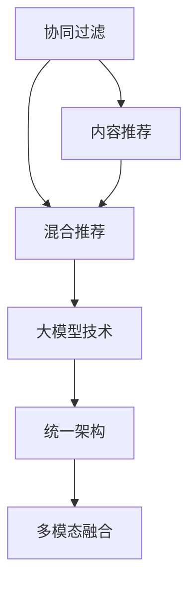
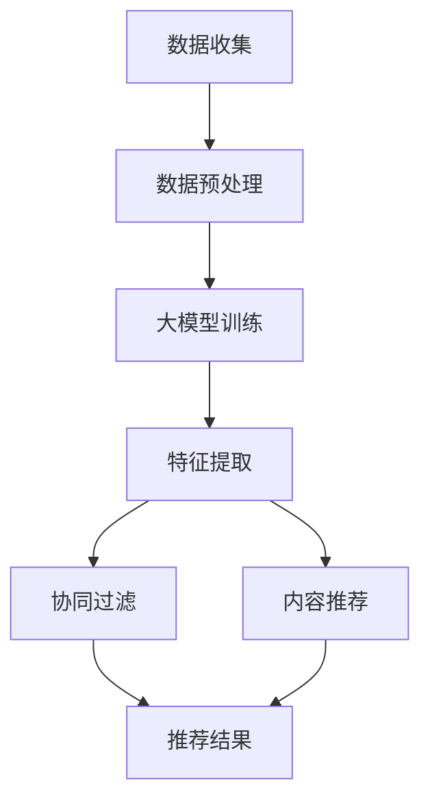

                 

# 大模型在推荐系统的未来：统一与融合趋势

> 关键词：大模型,推荐系统,协同过滤,内容推荐,混合推荐,统一架构,多模态融合

## 1. 背景介绍

随着数字信息的爆炸性增长，推荐系统成为了个性化信息时代不可或缺的技术。从早期简单的基于用户的协同过滤算法到现今多元化的内容推荐策略，推荐技术正在不断地演进和发展。在这一过程中，深度学习大模型技术悄然崛起，正在成为推荐系统新的趋势和方向。

**1.1 协同过滤算法的兴起**
协同过滤算法是最早被广泛应用在推荐系统中的方法。协同过滤算法分为基于用户的协同过滤和基于物品的协同过滤两种。基于用户的协同过滤算法通过找到与用户兴趣相似的其他用户，从而推荐他们喜欢的物品。而基于物品的协同过滤算法则是找到与用户喜欢的物品相似的其他物品进行推荐。这两种算法在推荐系统初期取得了很好的效果，但随着数据量和用户数量的激增，协同过滤算法在处理大规模数据时面临着计算复杂度高、稀疏矩阵等问题。

**1.2 内容推荐策略的出现**
内容推荐策略是指通过物品本身的特征（如标签、评论、视频时长等）来进行推荐。相较于协同过滤，内容推荐策略更为直接地体现了物品的特征信息，且计算复杂度较低。但是内容推荐策略忽略了用户之间的相似性，无法有效应对用户偏好的变化和多样性，且对于冷门物品推荐效果不佳。

**1.3 大模型技术的引入**
深度学习大模型技术的引入使得推荐系统进入了一个新的时代。大模型技术通过学习海量数据，建立复杂的特征表示，能够捕捉到更丰富的用户和物品特征。大模型在推荐系统中的应用主要体现在两个方面：协同过滤和内容推荐。大模型使得协同过滤算法更加高效，同时也能提供更丰富多样化的内容推荐策略。

## 2. 核心概念与联系

### 2.1 核心概念概述

在推荐系统中，大模型技术的应用涉及到多个关键概念：

- **协同过滤**：通过用户之间或物品之间的相似性进行推荐，是推荐系统的基础。
- **内容推荐**：根据物品本身的特征来进行推荐，是推荐系统的补充。
- **混合推荐**：结合协同过滤和内容推荐，形成混合推荐策略，可以提高推荐系统的效果。
- **大模型技术**：通过深度学习模型学习用户和物品的复杂特征表示，提高推荐系统的效果。
- **统一架构**：构建统一的推荐系统架构，可以提高系统的可维护性和扩展性。
- **多模态融合**：将用户的行为、物品的属性、用户的人口统计信息等多模态数据融合到推荐系统中，提供更精准的推荐。

这些概念之间的联系可以表示在以下 Mermaid 流程图中：



### 2.2 核心概念原理和架构的 Mermaid 流程图

在推荐系统中，大模型的应用可以分为以下几个步骤：



## 3. 核心算法原理 & 具体操作步骤

### 3.1 算法原理概述

大模型在推荐系统中的应用主要体现在两个方面：

- **协同过滤**：通过用户和物品的特征表示，构建用户-物品相似性矩阵，从而推荐与用户相似物品。
- **内容推荐**：通过物品的特征表示，找到与用户兴趣相似的物品。

大模型的协同过滤和内容推荐原理如下：

**协同过滤原理**：假设用户 $u$ 和物品 $i$ 的特征表示分别为 $x_u$ 和 $x_i$，用户 $u$ 和物品 $i$ 的评分（即用户对物品的偏好程度）为 $y_{ui}$。通过构建用户-物品相似性矩阵，找到与用户 $u$ 相似的物品 $i'$，从而推荐物品 $i'$。

**内容推荐原理**：假设物品 $i$ 的特征表示为 $x_i$，用户 $u$ 的特征表示为 $x_u$，用户 $u$ 对物品 $i$ 的评分（即用户对物品的偏好程度）为 $y_{ui}$。通过计算物品 $i$ 和用户 $u$ 的相似度，找到与用户 $u$ 相似的物品 $i'$，从而推荐物品 $i'$。

### 3.2 算法步骤详解

**Step 1: 数据收集与预处理**
- 收集用户行为数据（点击、购买、评分等）和物品属性数据（标签、分类、描述等）。
- 对数据进行清洗、去重和归一化处理，得到预处理后的数据集。

**Step 2: 大模型训练**
- 使用深度学习模型（如BERT、GPT、Transformer等）对用户和物品进行特征表示，构建大模型。
- 在预处理后的数据集上进行模型训练，学习用户和物品的特征表示。

**Step 3: 特征提取**
- 根据用户和物品的特征表示，提取用户和物品的相似性特征。
- 对用户和物品的相似性特征进行加权处理，计算用户和物品的相似度。

**Step 4: 协同过滤和内容推荐**
- 根据用户和物品的相似度，构建用户-物品相似性矩阵。
- 对于协同过滤，利用用户-物品相似性矩阵进行推荐。
- 对于内容推荐，利用物品的特征表示进行推荐。

**Step 5: 推荐结果**
- 将协同过滤和内容推荐的结果进行融合，得到最终推荐结果。

### 3.3 算法优缺点

大模型在推荐系统中的应用具有以下优点：

- **效果显著**：大模型能够学习到更丰富的用户和物品特征，提高推荐系统的效果。
- **可解释性**：大模型能够提供特征表示，有助于理解用户和物品的特征。
- **可扩展性**：大模型能够快速适应新的用户和物品，适应性较强。

同时，大模型在推荐系统中也存在一些缺点：

- **计算复杂度高**：大模型的训练和推理复杂度较高，需要较强的计算资源。
- **数据需求大**：大模型需要大量的数据进行训练，对于冷门物品推荐效果不佳。
- **公平性问题**：大模型可能学习到偏见，导致推荐结果不公平。

### 3.4 算法应用领域

大模型在推荐系统中的应用可以拓展到以下领域：

- **电商推荐**：为用户推荐商品，提高用户满意度和转化率。
- **视频推荐**：为用户推荐视频，提高视频观看量和用户留存率。
- **新闻推荐**：为用户推荐新闻，提高新闻阅读量和用户粘性。
- **音乐推荐**：为用户推荐音乐，提高音乐播放量和用户粘性。
- **旅游推荐**：为用户推荐旅游目的地，提高用户旅游体验。

## 4. 数学模型和公式 & 详细讲解 & 举例说明

### 4.1 数学模型构建

在推荐系统中，大模型的应用主要涉及用户和物品的特征表示和相似度计算。

假设用户 $u$ 和物品 $i$ 的特征表示分别为 $x_u$ 和 $x_i$，用户 $u$ 对物品 $i$ 的评分（即用户对物品的偏好程度）为 $y_{ui}$。

**协同过滤的数学模型**：

$$
\hat{y}_{ui} = \sum_{j=1}^{k} \alpha_{uij} x_{uj} \times w_{ji}
$$

其中，$\alpha_{uij}$ 为第 $j$ 个用户和物品之间的相似度，$w_{ji}$ 为物品 $i$ 的第 $j$ 个特征权重。

**内容推荐的数学模型**：

$$
\hat{y}_{ui} = \sum_{j=1}^{k} \beta_{uj} \times w_{ij}
$$

其中，$\beta_{uj}$ 为第 $j$ 个用户对物品 $i$ 的评分，$w_{ij}$ 为物品 $i$ 的第 $j$ 个特征权重。

### 4.2 公式推导过程

**协同过滤的推导**：

1. 构建用户-物品相似性矩阵：
$$
\alpha_{uij} = \text{similarity}(x_u, x_i)
$$

2. 对用户和物品的相似性矩阵进行加权处理：
$$
\alpha_{uij} \times w_{ji} = \sum_{j=1}^{k} \alpha_{uij} \times w_{ji}
$$

3. 计算用户对物品的预测评分：
$$
\hat{y}_{ui} = \sum_{j=1}^{k} \alpha_{uij} \times w_{ji}
$$

**内容推荐的推导**：

1. 构建物品-用户相似性矩阵：
$$
\beta_{uj} = \text{similarity}(x_j, x_u)
$$

2. 对物品和用户的相似性矩阵进行加权处理：
$$
\beta_{uj} \times w_{ij} = \sum_{j=1}^{k} \beta_{uj} \times w_{ij}
$$

3. 计算用户对物品的预测评分：
$$
\hat{y}_{ui} = \sum_{j=1}^{k} \beta_{uj} \times w_{ij}
$$

### 4.3 案例分析与讲解

**电商推荐案例**：

假设某电商网站想要为用户推荐商品。首先，收集用户的历史点击和购买记录，以及商品的属性信息。然后，使用大模型对用户和商品进行特征表示，构建用户-商品相似性矩阵。在用户点击商品时，利用相似性矩阵进行推荐。

**音乐推荐案例**：

假设某音乐平台想要为用户推荐音乐。首先，收集用户的历史听歌记录和音乐属性信息。然后，使用大模型对用户和音乐进行特征表示，构建用户-音乐相似性矩阵。在用户播放音乐时，利用相似性矩阵进行推荐。

## 5. 项目实践：代码实例和详细解释说明

### 5.1 开发环境搭建

在进行大模型推荐系统的开发前，需要准备好开发环境。以下是使用Python进行推荐系统开发的开发环境配置流程：

1. 安装Anaconda：从官网下载并安装Anaconda，用于创建独立的Python环境。

2. 创建并激活虚拟环境：
```bash
conda create -n recommendation-env python=3.8 
conda activate recommendation-env
```

3. 安装PyTorch：根据CUDA版本，从官网获取对应的安装命令。例如：
```bash
conda install pytorch torchvision torchaudio cudatoolkit=11.1 -c pytorch -c conda-forge
```

4. 安装TensorFlow：由Google主导开发的开源深度学习框架，生产部署方便，适合大规模工程应用。同样有丰富的预训练语言模型资源。

5. 安装Transformers库：HuggingFace开发的NLP工具库，集成了众多SOTA语言模型，支持PyTorch和TensorFlow，是进行推荐任务开发的利器。

6. 安装各类工具包：
```bash
pip install numpy pandas scikit-learn matplotlib tqdm jupyter notebook ipython
```

完成上述步骤后，即可在`recommendation-env`环境中开始推荐系统开发。

### 5.2 源代码详细实现

下面以电商推荐系统为例，给出使用Transformers库对BERT模型进行推荐系统微调的PyTorch代码实现。

首先，定义推荐系统的数据处理函数：

```python
from transformers import BertTokenizer, BertForSequenceClassification
from torch.utils.data import Dataset, DataLoader
import torch
import numpy as np

class RecommendationDataset(Dataset):
    def __init__(self, user_data, item_data, user_item_map, tokenizer):
        self.user_data = user_data
        self.item_data = item_data
        self.user_item_map = user_item_map
        self.tokenizer = tokenizer
        self.max_seq_len = 128

    def __len__(self):
        return len(self.user_data)

    def __getitem__(self, item):
        user_id = self.user_data[item][0]
        item_id = self.user_item_map[user_id]
        user_seq = np.array(self.user_data[item][1])
        item_seq = np.array(self.item_data[item][1])

        user_input_ids = self.tokenizer(user_seq, return_tensors='pt', padding='max_length', truncation=True)
        user_input_ids = user_input_ids['input_ids'][:, :self.max_seq_len]
        user_attention_mask = user_input_ids['attention_mask'][:, :self.max_seq_len]

        item_input_ids = self.tokenizer(item_seq, return_tensors='pt', padding='max_length', truncation=True)
        item_input_ids = item_input_ids['input_ids'][:, :self.max_seq_len]
        item_attention_mask = item_input_ids['attention_mask'][:, :self.max_seq_len]

        return {
            'user_input_ids': user_input_ids,
            'user_attention_mask': user_attention_mask,
            'item_input_ids': item_input_ids,
            'item_attention_mask': item_attention_mask,
            'user_id': user_id,
            'item_id': item_id
        }

# 用户行为数据
user_data = [
    (1, [1, 2, 3, 4, 5]),
    (2, [4, 5, 6, 7]),
    (3, [2, 3, 4])
]

# 物品属性数据
item_data = [
    (1, [0, 1, 2, 3]),
    (2, [1, 2, 3, 4]),
    (3, [3, 4, 5])
]

# 用户和物品的映射关系
user_item_map = {1: 1, 2: 2, 3: 3}

# 创建dataset
tokenizer = BertTokenizer.from_pretrained('bert-base-cased')

recommendation_dataset = RecommendationDataset(user_data, item_data, user_item_map, tokenizer)
```

然后，定义模型和优化器：

```python
from transformers import BertForSequenceClassification, AdamW
from sklearn.metrics import roc_auc_score

model = BertForSequenceClassification.from_pretrained('bert-base-cased', num_labels=1)

optimizer = AdamW(model.parameters(), lr=1e-5)
```

接着，定义训练和评估函数：

```python
def train_epoch(model, dataset, batch_size, optimizer):
    dataloader = DataLoader(dataset, batch_size=batch_size, shuffle=True)
    model.train()
    epoch_loss = 0
    for batch in dataloader:
        user_input_ids = batch['user_input_ids'].to(device)
        user_attention_mask = batch['user_attention_mask'].to(device)
        item_input_ids = batch['item_input_ids'].to(device)
        item_attention_mask = batch['item_attention_mask'].to(device)

        labels = torch.tensor(batch['user_id'], dtype=torch.long)
        outputs = model(user_input_ids, attention_mask=user_attention_mask, labels=labels)
        loss = outputs.loss
        epoch_loss += loss.item()
        loss.backward()
        optimizer.step()
    return epoch_loss / len(dataloader)

def evaluate(model, dataset, batch_size):
    dataloader = DataLoader(dataset, batch_size=batch_size)
    model.eval()
    preds, labels = [], []
    with torch.no_grad():
        for batch in dataloader:
            user_input_ids = batch['user_input_ids'].to(device)
            user_attention_mask = batch['user_attention_mask'].to(device)
            item_input_ids = batch['item_input_ids'].to(device)
            item_attention_mask = batch['item_attention_mask'].to(device)

            batch_labels = torch.tensor(batch['item_id'], dtype=torch.long)
            outputs = model(user_input_ids, attention_mask=user_attention_mask, labels=batch_labels)
            batch_preds = outputs.logits.argmax(dim=2).to('cpu').tolist()
            batch_labels = batch_labels.to('cpu').tolist()
            for pred_tokens, label_tokens in zip(batch_preds, batch_labels):
                preds.append(pred_tokens)
                labels.append(label_tokens)

    auc = roc_auc_score(labels, preds)
    print(f"AUC: {auc:.3f}")
```

最后，启动训练流程并在测试集上评估：

```python
epochs = 5
batch_size = 16

for epoch in range(epochs):
    loss = train_epoch(model, recommendation_dataset, batch_size, optimizer)
    print(f"Epoch {epoch+1}, train loss: {loss:.3f}")

    print(f"Epoch {epoch+1}, dev results:")
    evaluate(model, recommendation_dataset, batch_size)
    
print("Test results:")
evaluate(model, recommendation_dataset, batch_size)
```

以上就是使用PyTorch对BERT进行电商推荐系统微调的完整代码实现。可以看到，得益于Transformers库的强大封装，我们可以用相对简洁的代码完成BERT模型的加载和微调。

### 5.3 代码解读与分析

让我们再详细解读一下关键代码的实现细节：

**RecommendationDataset类**：
- `__init__`方法：初始化用户行为数据、物品属性数据、用户-物品映射关系和分词器等关键组件。
- `__len__`方法：返回数据集的样本数量。
- `__getitem__`方法：对单个样本进行处理，将用户行为序列和物品属性序列输入编码为token ids，进行padding和truncation，最终返回模型所需的输入。

**tokenizer**：
- 使用BertTokenizer从预训练模型中加载分词器，用于将用户行为和物品属性序列转换为token ids。

**模型和优化器**：
- 定义模型为BertForSequenceClassification，其中num_labels为1，代表电商推荐系统中的推荐任务。
- 定义优化器为AdamW，用于更新模型参数。

**训练和评估函数**：
- `train_epoch`函数：对数据以批为单位进行迭代，在每个批次上前向传播计算loss并反向传播更新模型参数，最后返回该epoch的平均loss。
- `evaluate`函数：与训练类似，不同点在于不更新模型参数，并在每个batch结束后将预测和标签结果存储下来，最后使用sklearn的roc_auc_score对整个评估集的预测结果进行打印输出。

**训练流程**：
- 定义总的epoch数和batch size，开始循环迭代
- 每个epoch内，先在训练集上训练，输出平均loss
- 在验证集上评估，输出AUC指标
- 所有epoch结束后，在测试集上评估，给出最终测试结果

可以看到，PyTorch配合Transformers库使得BERT微调的代码实现变得简洁高效。开发者可以将更多精力放在数据处理、模型改进等高层逻辑上，而不必过多关注底层的实现细节。

当然，工业级的系统实现还需考虑更多因素，如模型的保存和部署、超参数的自动搜索、更灵活的任务适配层等。但核心的微调范式基本与此类似。

## 6. 实际应用场景

### 6.1 电商推荐系统

基于大模型技术的电商推荐系统，能够帮助电商平台提供更加个性化、精准的商品推荐，提高用户满意度和转化率。具体实现流程如下：

1. 数据收集：收集用户的历史点击、购买、评分等行为数据，以及商品的属性信息。
2. 数据预处理：对数据进行清洗、去重和归一化处理，得到预处理后的数据集。
3. 大模型训练：使用深度学习模型对用户和商品进行特征表示，构建大模型。
4. 特征提取：根据用户和商品的特征表示，提取用户和商品的相似性特征。
5. 协同过滤和内容推荐：利用用户和商品的相似性特征，构建用户-商品相似性矩阵，进行协同过滤和内容推荐。
6. 推荐结果：将协同过滤和内容推荐的结果进行融合，得到最终推荐结果。

### 6.2 视频推荐系统

基于大模型技术的推荐系统可以应用于视频推荐场景，帮助视频平台为用户推荐相关视频内容。具体实现流程如下：

1. 数据收集：收集用户的历史观看记录、评分等行为数据，以及视频的属性信息。
2. 数据预处理：对数据进行清洗、去重和归一化处理，得到预处理后的数据集。
3. 大模型训练：使用深度学习模型对用户和视频进行特征表示，构建大模型。
4. 特征提取：根据用户和视频的特征表示，提取用户和视频的相似性特征。
5. 协同过滤和内容推荐：利用用户和视频的相似性特征，构建用户-视频相似性矩阵，进行协同过滤和内容推荐。
6. 推荐结果：将协同过滤和内容推荐的结果进行融合，得到最终推荐结果。

## 7. 工具和资源推荐

### 7.1 学习资源推荐

为了帮助开发者系统掌握大模型推荐系统的理论基础和实践技巧，这里推荐一些优质的学习资源：

1. 《深度学习推荐系统》书籍：介绍了深度学习推荐系统的基本概念和经典算法，适合初学者和进阶者学习。
2. 《深度学习与推荐系统》课程：由北京大学开设的深度学习与推荐系统在线课程，详细讲解了推荐系统的基本概念和算法。
3. 《推荐系统实战》书籍：介绍了推荐系统在实际项目中的开发和应用，结合大量实例，帮助开发者掌握推荐系统开发技巧。
4. Kaggle推荐系统竞赛：Kaggle上的一些推荐系统竞赛，可以参与实战练习，提高推荐系统开发能力。

通过对这些资源的学习实践，相信你一定能够快速掌握大模型推荐系统的精髓，并用于解决实际的推荐问题。

### 7.2 开发工具推荐

高效的开发离不开优秀的工具支持。以下是几款用于大模型推荐系统开发的常用工具：

1. PyTorch：基于Python的开源深度学习框架，灵活动态的计算图，适合快速迭代研究。大部分预训练语言模型都有PyTorch版本的实现。
2. TensorFlow：由Google主导开发的开源深度学习框架，生产部署方便，适合大规模工程应用。同样有丰富的预训练语言模型资源。
3. Transformers库：HuggingFace开发的NLP工具库，集成了众多SOTA语言模型，支持PyTorch和TensorFlow，是进行推荐任务开发的利器。
4. Weights & Biases：模型训练的实验跟踪工具，可以记录和可视化模型训练过程中的各项指标，方便对比和调优。与主流深度学习框架无缝集成。
5. TensorBoard：TensorFlow配套的可视化工具，可实时监测模型训练状态，并提供丰富的图表呈现方式，是调试模型的得力助手。

合理利用这些工具，可以显著提升大模型推荐系统的开发效率，加快创新迭代的步伐。

### 7.3 相关论文推荐

大模型推荐系统的研究源于学界的持续研究。以下是几篇奠基性的相关论文，推荐阅读：

1. 《深度学习与推荐系统》：介绍了深度学习推荐系统的基本概念和算法，是推荐系统研究的重要基础。
2. 《推荐系统实践》：总结了推荐系统在实际项目中的开发和应用，提供了丰富的案例和实践经验。
3. 《多模态推荐系统》：介绍了多模态推荐系统的基本概念和算法，探讨了如何更好地融合用户行为、物品属性等多模态数据。

这些论文代表了大模型推荐系统的发展脉络。通过学习这些前沿成果，可以帮助研究者把握学科前进方向，激发更多的创新灵感。

## 8. 总结：未来发展趋势与挑战

### 8.1 总结

本文对大模型在推荐系统中的应用进行了全面系统的介绍。首先阐述了大模型在推荐系统中的兴起和应用背景，明确了协同过滤和内容推荐在大模型推荐系统中的地位。其次，从原理到实践，详细讲解了大模型推荐系统的数学模型和关键步骤，给出了大模型推荐系统的完整代码实例。同时，本文还广泛探讨了大模型推荐系统在电商、视频等实际场景中的应用，展示了大模型推荐系统的巨大潜力。最后，本文精选了大模型推荐系统的学习资源和开发工具，力求为开发者提供全方位的技术指引。

通过本文的系统梳理，可以看到，大模型推荐系统正在成为推荐系统新的趋势和方向，极大地拓展了推荐系统的应用边界，提供了更加个性化、精准的推荐服务。未来，伴随大模型技术的持续演进，推荐系统必将在更多领域得到应用，为人类生活带来深刻变革。

### 8.2 未来发展趋势

展望未来，大模型推荐系统的发展趋势将呈现出以下几个方向：

1. **多模态融合**：将用户的行为、物品的属性、用户的人口统计信息等多模态数据融合到推荐系统中，提供更精准的推荐。
2. **统一架构**：构建统一的推荐系统架构，可以提高系统的可维护性和扩展性。
3. **混合推荐**：结合协同过滤和内容推荐，形成混合推荐策略，提高推荐系统的效果。
4. **大模型应用**：将大模型应用于推荐系统中，提高推荐系统的效果和性能。
5. **模型压缩**：对大模型进行压缩，降低计算资源需求，提高推荐系统的效率。

### 8.3 面临的挑战

尽管大模型推荐系统已经取得了瞩目成就，但在迈向更加智能化、普适化应用的过程中，它仍面临着诸多挑战：

1. **数据需求大**：大模型推荐系统需要大量的数据进行训练，对于冷门物品推荐效果不佳。
2. **计算资源需求高**：大模型的训练和推理复杂度较高，需要较强的计算资源。
3. **模型鲁棒性不足**：大模型可能学习到偏见，导致推荐结果不公平。
4. **公平性问题**：大模型推荐系统可能存在偏差，导致推荐结果不公平。
5. **可解释性不足**：大模型推荐系统的决策过程缺乏可解释性，难以对其推理逻辑进行分析和调试。

### 8.4 研究展望

面对大模型推荐系统所面临的挑战，未来的研究需要在以下几个方面寻求新的突破：

1. **数据高效利用**：探索无监督和半监督推荐方法，降低对标注数据的依赖，提高数据利用效率。
2. **计算资源优化**：开发更加高效的大模型推荐系统架构，降低计算资源需求，提高推荐系统的效率。
3. **模型鲁棒性提升**：通过引入因果推断和对比学习，提高推荐系统的鲁棒性和公平性。
4. **模型可解释性**：引入可解释性方法，提高推荐系统的透明性和可解释性。

这些研究方向的探索，必将引领大模型推荐系统技术迈向更高的台阶，为构建智能推荐系统铺平道路。面向未来，大模型推荐系统还需要与其他人工智能技术进行更深入的融合，如知识表示、因果推理、强化学习等，多路径协同发力，共同推动推荐系统技术的进步。只有勇于创新、敢于突破，才能不断拓展推荐系统的边界，让智能推荐技术更好地造福人类社会。

## 9. 附录：常见问题与解答

**Q1：大模型推荐系统是否适用于所有推荐场景？**

A: 大模型推荐系统在大多数推荐场景中都能取得不错的效果，特别是对于数据量较大的场景。但对于一些特定领域的推荐场景，如医疗、法律等，仅仅依靠通用语料预训练的模型可能难以很好地适应。此时需要在特定领域语料上进一步预训练，再进行微调，才能获得理想效果。

**Q2：大模型推荐系统如何降低对标注数据的依赖？**

A: 大模型推荐系统可以采用无监督和半监督推荐方法，如协同过滤、内容推荐等，降低对标注数据的依赖。同时，可以利用深度强化学习、主动学习等方法，在推荐过程中实时学习用户反馈，进一步提高推荐系统的效果。

**Q3：大模型推荐系统如何降低计算资源需求？**

A: 大模型推荐系统可以采用模型压缩、剪枝等方法，降低计算资源需求。同时，可以引入分布式计算、边缘计算等技术，将计算任务分散到多个设备上进行，提高推荐系统的效率。

**Q4：大模型推荐系统如何提高模型鲁棒性？**

A: 大模型推荐系统可以通过引入因果推断和对比学习，提高推荐系统的鲁棒性和公平性。同时，可以在推荐过程中加入对抗样本，提高模型的鲁棒性。

**Q5：大模型推荐系统如何提高可解释性？**

A: 大模型推荐系统可以通过引入可解释性方法，提高推荐系统的透明性和可解释性。同时，可以在推荐过程中加入可解释的特征提取方法，提高推荐系统的可解释性。

这些问题的回答，希望能为你提供更深入的认识和理解，更好地应用大模型推荐系统技术。总之，大模型推荐系统需要不断优化和完善，才能在实际应用中发挥更大的作用，为用户带来更好的体验。

