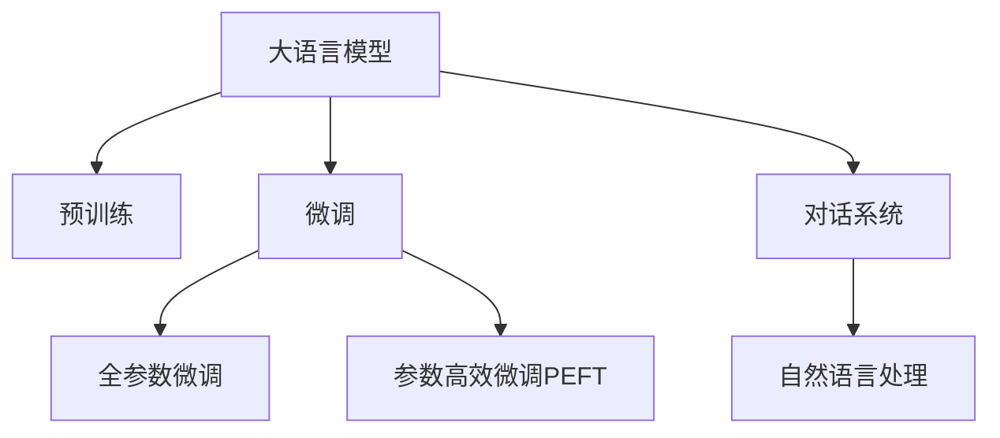

                 

# 大模型在电商平台智能客服中的应用

> 关键词：电商平台,智能客服,自然语言处理(NLP),对话系统,预训练模型,微调(Fine-tuning)

## 1. 背景介绍

### 1.1 问题由来

在数字化转型的大背景下，电商平台正面临着越来越激烈的竞争，客户服务作为用户体验的重要环节，直接影响着客户的购买决策。传统的客服方式依赖于人工客服，但受制于成本、效率和人力资源的限制，难以满足用户日益增长的需求。因此，通过技术手段提升客户服务水平，构建高效、智能的客服系统成为电商平台的重要任务。

近年来，大语言模型在NLP领域取得了突破性的进展，尤其是基于预训练模型的微调技术，使得大模型能够适应特定任务，具备强大的语言理解和生成能力，为智能客服系统的构建提供了新的可能。在电商平台中，智能客服系统的应用不仅能够降低成本、提高效率，还能提升客户满意度，增强品牌忠诚度，具有重要的商业价值。

### 1.2 问题核心关键点

电商平台智能客服系统的核心在于通过大语言模型实现自然语言处理，快速、准确地解答用户问题。具体而言，主要包括以下几个关键点：

1. **客户意图识别**：自动理解用户输入的意图，匹配到合适的服务场景。
2. **上下文理解**：结合用户历史交互信息，提供连贯、一致的对话。
3. **信息检索**：在知识库或商品数据库中快速检索相关信息，辅助客服人员回答问题。
4. **对话生成**：根据用户问题，自动生成合适且人性化的回答。
5. **多渠道集成**：支持多种沟通渠道，如文字聊天、语音客服、视频会议等。
6. **用户评价**：收集用户反馈，不断优化客服系统的表现。

这些关键点通过大语言模型的预训练-微调框架得以实现，可以大大提升客服系统的智能化水平。

## 2. 核心概念与联系

### 2.1 核心概念概述

为更好地理解大语言模型在电商平台智能客服中的应用，本节将介绍几个密切相关的核心概念：

- **大语言模型(Large Language Model, LLM)**：以自回归(如GPT)或自编码(如BERT)模型为代表的大规模预训练语言模型。通过在大规模无标签文本语料上进行预训练，学习通用的语言表示，具备强大的语言理解和生成能力。

- **预训练(Pre-training)**：指在大规模无标签文本语料上，通过自监督学习任务训练通用语言模型的过程。常见的预训练任务包括言语建模、遮挡语言模型等。预训练使得模型学习到语言的通用表示。

- **微调(Fine-tuning)**：指在预训练模型的基础上，使用下游任务的少量标注数据，通过有监督地训练来优化模型在该任务上的性能。通常只需要调整顶层分类器或解码器，并以较小的学习率更新全部或部分的模型参数。

- **对话系统(Dialogue System)**：通过构建能够与人类进行自然语言交流的计算机系统，实现人机交互的智能化。对话系统广泛应用于客服、智能助手等领域。

- **自然语言处理(Natural Language Processing, NLP)**：研究计算机如何理解和生成自然语言的技术。NLP是大模型在智能客服系统中应用的重要基础。

这些核心概念之间的逻辑关系可以通过以下Mermaid流程图来展示：



这个流程图展示了大语言模型的核心概念及其之间的关系：

1. 大语言模型通过预训练获得基础能力。
2. 微调是对预训练模型进行任务特定的优化，可以分为全参数微调和参数高效微调（PEFT）。
3. 对话系统是实现人机交互的关键，利用大语言模型进行意图识别和对话生成。
4. 自然语言处理是对话系统的基础，提供语言理解和生成的能力。

这些概念共同构成了电商平台智能客服系统的技术框架，使其能够高效地处理用户的自然语言输入，提供高质量的服务。

## 3. 核心算法原理 & 具体操作步骤
### 3.1 算法原理概述

电商平台智能客服系统基于大语言模型的微调技术，其核心思想是：将预训练的大语言模型作为基础，通过微调使其适应电商平台特定的客服任务。具体而言，系统先在大规模无标签文本语料上进行预训练，学习通用的语言表示。然后，在收集到特定电商平台的客服对话数据后，通过微调技术优化模型，使其能够准确识别用户意图、生成合适回答、进行上下文理解、快速检索商品信息等。

### 3.2 算法步骤详解

基于大语言模型的智能客服系统一般包括以下几个关键步骤：

**Step 1: 准备预训练模型和数据集**
- 选择合适的预训练语言模型 $M_{\theta}$ 作为初始化参数，如 BERT、GPT等。
- 准备电商平台的客服对话数据集 $D$，划分为训练集、验证集和测试集。数据集应涵盖常见客服场景和用户问题。

**Step 2: 添加任务适配层**
- 根据客服任务类型，在预训练模型顶层设计合适的输出层和损失函数。
- 对于分类任务（如订单状态查询、退货申请），通常在顶层添加线性分类器和交叉熵损失函数。
- 对于生成任务（如商品推荐、用户评价），通常使用语言模型的解码器输出概率分布，并以负对数似然为损失函数。

**Step 3: 设置微调超参数**
- 选择合适的优化算法及其参数，如 AdamW、SGD 等，设置学习率、批大小、迭代轮数等。
- 设置正则化技术及强度，包括权重衰减、Dropout、Early Stopping 等。
- 确定冻结预训练参数的策略，如仅微调顶层，或全部参数都参与微调。

**Step 4: 执行梯度训练**
- 将训练集数据分批次输入模型，前向传播计算损失函数。
- 反向传播计算参数梯度，根据设定的优化算法和学习率更新模型参数。
- 周期性在验证集上评估模型性能，根据性能指标决定是否触发 Early Stopping。
- 重复上述步骤直到满足预设的迭代轮数或 Early Stopping 条件。

**Step 5: 测试和部署**
- 在测试集上评估微调后模型 $M_{\hat{\theta}}$ 的性能，对比微调前后的精度提升。
- 使用微调后的模型对新样本进行推理预测，集成到实际的应用系统中。
- 持续收集新的对话数据，定期重新微调模型，以适应数据分布的变化。

以上是基于大语言模型微调智能客服系统的一般流程。在实际应用中，还需要针对具体客服场景，对微调过程的各个环节进行优化设计，如改进训练目标函数，引入更多的正则化技术，搜索最优的超参数组合等，以进一步提升模型性能。

### 3.3 算法优缺点

基于大语言模型的智能客服系统具有以下优点：
1. 自动化程度高。大模型能够处理大量客服对话，减少人工客服的工作量，提高响应速度。
2. 通用性强。大语言模型经过预训练，已经具备处理多种客服场景的能力，只需通过微调即可适应特定电商平台的客服任务。
3. 可扩展性好。模型可以部署在云平台，根据用户请求动态伸缩资源，灵活应对高峰期需求。
4. 准确度高。大语言模型通过微调学习到任务特定知识，能够提供准确的答案和建议。
5. 用户体验好。自然语言处理技术使得对话系统更加人性化，用户可以以更自然的方式与系统互动。

同时，该方法也存在一定的局限性：
1. 数据依赖性高。客服对话数据的质量和多样性直接影响模型的表现，标注数据的收集和维护成本较高。
2. 模型复杂度高。大模型虽然强大，但在推理过程中需要较高的计算资源和存储空间。
3. 鲁棒性不足。面对异常输入或复杂情境，模型的输出可能不够稳定。
4. 可解释性差。大语言模型的决策过程较为复杂，难以提供直观的解释。
5. 隐私风险。对话系统可能涉及敏感信息，需要严格保护用户隐私。

尽管存在这些局限性，但就目前而言，基于大语言模型的微调方法仍是最主流的客服系统开发范式。未来相关研究的重点在于如何进一步降低对标注数据的依赖，提高模型的鲁棒性和可解释性，同时兼顾隐私保护等伦理安全因素。

### 3.4 算法应用领域

基于大语言模型微调的智能客服系统，已经在电商平台、银行、保险、医疗等多个领域得到了广泛的应用。

- **电商平台**：提供订单查询、退换货申请、产品推荐等自动化服务，显著提升用户满意度。
- **银行**：处理用户咨询、转账、理财等业务，提高服务效率，降低人力成本。
- **保险**：进行理赔申请、保单查询、理赔指导等操作，提升理赔效率，增强用户体验。
- **医疗**：提供健康咨询、疾病查询、预约挂号等服务，缓解医生压力，改善就医体验。

此外，大语言模型微调技术还在智能客服系统的进一步优化和创新中发挥作用，如集成多模态信息处理、引入用户情感分析、支持实时对话上下文更新等，为电商平台的客户服务提供更强大的支持。

## 4. 数学模型和公式 & 详细讲解  
### 4.1 数学模型构建

本节将使用数学语言对基于大语言模型的智能客服系统微调过程进行更加严格的刻画。

记预训练语言模型为 $M_{\theta}$，其中 $\theta$ 为预训练得到的模型参数。假设电商平台客服任务 $T$ 的训练集为 $D=\{(x_i,y_i)\}_{i=1}^N, x_i \in \mathcal{X}, y_i \in \mathcal{Y}$。其中 $\mathcal{X}$ 为输入空间（如用户输入的文本），$\mathcal{Y}$ 为输出空间（如订单状态、产品信息等）。

定义模型 $M_{\theta}$ 在输入 $x$ 上的损失函数为 $\ell(M_{\theta}(x),y)$，则在数据集 $D$ 上的经验风险为：

$$
\mathcal{L}(\theta) = \frac{1}{N} \sum_{i=1}^N \ell(M_{\theta}(x_i),y_i)
$$

微调的优化目标是最小化经验风险，即找到最优参数：

$$
\theta^* = \mathop{\arg\min}_{\theta} \mathcal{L}(\theta)
$$

在实践中，我们通常使用基于梯度的优化算法（如SGD、Adam等）来近似求解上述最优化问题。设 $\eta$ 为学习率，$\lambda$ 为正则化系数，则参数的更新公式为：

$$
\theta \leftarrow \theta - \eta \nabla_{\theta}\mathcal{L}(\theta) - \eta\lambda\theta
$$

其中 $\nabla_{\theta}\mathcal{L}(\theta)$ 为损失函数对参数 $\theta$ 的梯度，可通过反向传播算法高效计算。

### 4.2 公式推导过程

以下我们以二分类任务为例，推导交叉熵损失函数及其梯度的计算公式。

假设模型 $M_{\theta}$ 在输入 $x$ 上的输出为 $\hat{y}=M_{\theta}(x) \in [0,1]$，表示样本属于正类的概率。真实标签 $y \in \{0,1\}$。则二分类交叉熵损失函数定义为：

$$
\ell(M_{\theta}(x),y) = -[y\log \hat{y} + (1-y)\log (1-\hat{y})]
$$

将其代入经验风险公式，得：

$$
\mathcal{L}(\theta) = -\frac{1}{N}\sum_{i=1}^N [y_i\log M_{\theta}(x_i)+(1-y_i)\log(1-M_{\theta}(x_i))]
$$

根据链式法则，损失函数对参数 $\theta_k$ 的梯度为：

$$
\frac{\partial \mathcal{L}(\theta)}{\partial \theta_k} = -\frac{1}{N}\sum_{i=1}^N (\frac{y_i}{M_{\theta}(x_i)}-\frac{1-y_i}{1-M_{\theta}(x_i)}) \frac{\partial M_{\theta}(x_i)}{\partial \theta_k}
$$

其中 $\frac{\partial M_{\theta}(x_i)}{\partial \theta_k}$ 可进一步递归展开，利用自动微分技术完成计算。

在得到损失函数的梯度后，即可带入参数更新公式，完成模型的迭代优化。重复上述过程直至收敛，最终得到适应电商平台客服任务的最优模型参数 $\theta^*$。

## 5. 项目实践：代码实例和详细解释说明
### 5.1 开发环境搭建

在进行智能客服系统开发前，我们需要准备好开发环境。以下是使用Python进行PyTorch开发的环境配置流程：

1. 安装Anaconda：从官网下载并安装Anaconda，用于创建独立的Python环境。

2. 创建并激活虚拟环境：
```bash
conda create -n pytorch-env python=3.8 
conda activate pytorch-env
```

3. 安装PyTorch：根据CUDA版本，从官网获取对应的安装命令。例如：
```bash
conda install pytorch torchvision torchaudio cudatoolkit=11.1 -c pytorch -c conda-forge
```

4. 安装Transformers库：
```bash
pip install transformers
```

5. 安装各类工具包：
```bash
pip install numpy pandas scikit-learn matplotlib tqdm jupyter notebook ipython
```

完成上述步骤后，即可在`pytorch-env`环境中开始智能客服系统开发。

### 5.2 源代码详细实现

下面以电商平台订单查询任务为例，给出使用Transformers库对BERT模型进行微调的PyTorch代码实现。

首先，定义订单查询任务的数据处理函数：

```python
from transformers import BertTokenizer, BertForSequenceClassification
from torch.utils.data import Dataset
import torch

class OrderQueryDataset(Dataset):
    def __init__(self, texts, labels, tokenizer, max_len=128):
        self.texts = texts
        self.labels = labels
        self.tokenizer = tokenizer
        self.max_len = max_len
        
    def __len__(self):
        return len(self.texts)
    
    def __getitem__(self, item):
        text = self.texts[item]
        label = self.labels[item]
        
        encoding = self.tokenizer(text, return_tensors='pt', max_length=self.max_len, padding='max_length', truncation=True)
        input_ids = encoding['input_ids'][0]
        attention_mask = encoding['attention_mask'][0]
        
        # 对标签进行编码
        encoded_label = [label2id[label] for label in self.labels] 
        encoded_label.extend([label2id['O']] * (self.max_len - len(encoded_label)))
        labels = torch.tensor(encoded_label, dtype=torch.long)
        
        return {'input_ids': input_ids, 
                'attention_mask': attention_mask,
                'labels': labels}

# 标签与id的映射
label2id = {'O': 0, '待发货': 1, '已发货': 2, '已收货': 3, '退货中': 4, '退货完成': 5}
id2label = {v: k for k, v in label2id.items()}

# 创建dataset
tokenizer = BertTokenizer.from_pretrained('bert-base-cased')

train_dataset = OrderQueryDataset(train_texts, train_labels, tokenizer)
dev_dataset = OrderQueryDataset(dev_texts, dev_labels, tokenizer)
test_dataset = OrderQueryDataset(test_texts, test_labels, tokenizer)
```

然后，定义模型和优化器：

```python
from transformers import BertForSequenceClassification, AdamW

model = BertForSequenceClassification.from_pretrained('bert-base-cased', num_labels=len(label2id))

optimizer = AdamW(model.parameters(), lr=2e-5)
```

接着，定义训练和评估函数：

```python
from torch.utils.data import DataLoader
from tqdm import tqdm
from sklearn.metrics import accuracy_score, precision_recall_fscore_support

device = torch.device('cuda') if torch.cuda.is_available() else torch.device('cpu')
model.to(device)

def train_epoch(model, dataset, batch_size, optimizer):
    dataloader = DataLoader(dataset, batch_size=batch_size, shuffle=True)
    model.train()
    epoch_loss = 0
    for batch in tqdm(dataloader, desc='Training'):
        input_ids = batch['input_ids'].to(device)
        attention_mask = batch['attention_mask'].to(device)
        labels = batch['labels'].to(device)
        model.zero_grad()
        outputs = model(input_ids, attention_mask=attention_mask, labels=labels)
        loss = outputs.loss
        epoch_loss += loss.item()
        loss.backward()
        optimizer.step()
    return epoch_loss / len(dataloader)

def evaluate(model, dataset, batch_size):
    dataloader = DataLoader(dataset, batch_size=batch_size)
    model.eval()
    preds, labels = [], []
    with torch.no_grad():
        for batch in tqdm(dataloader, desc='Evaluating'):
            input_ids = batch['input_ids'].to(device)
            attention_mask = batch['attention_mask'].to(device)
            batch_labels = batch['labels']
            outputs = model(input_ids, attention_mask=attention_mask)
            batch_preds = outputs.logits.argmax(dim=2).to('cpu').tolist()
            batch_labels = batch_labels.to('cpu').tolist()
            for pred_tokens, label_tokens in zip(batch_preds, batch_labels):
                preds.append(pred_tokens[:len(label_tokens)])
                labels.append(label_tokens)
                
    print('Accuracy: %.2f%%' % (accuracy_score(labels, preds) * 100))
    print('Precision, Recall, F1-Score, Support:')
    print(precision_recall_fscore_support(labels, preds, average='macro', labels=[0, 1, 2, 3, 4, 5]))

# 训练流程
epochs = 5
batch_size = 16

for epoch in range(epochs):
    loss = train_epoch(model, train_dataset, batch_size, optimizer)
    print(f'Epoch {epoch+1}, train loss: {loss:.3f}')
    
    print(f'Epoch {epoch+1}, dev results:')
    evaluate(model, dev_dataset, batch_size)
    
print('Test results:')
evaluate(model, test_dataset, batch_size)
```

以上就是使用PyTorch对BERT进行订单查询任务微调的完整代码实现。可以看到，得益于Transformers库的强大封装，我们可以用相对简洁的代码完成BERT模型的加载和微调。

### 5.3 代码解读与分析

让我们再详细解读一下关键代码的实现细节：

**OrderQueryDataset类**：
- `__init__`方法：初始化文本、标签、分词器等关键组件。
- `__len__`方法：返回数据集的样本数量。
- `__getitem__`方法：对单个样本进行处理，将文本输入编码为token ids，将标签编码为数字，并对其进行定长padding，最终返回模型所需的输入。

**label2id和id2label字典**：
- 定义了标签与数字id之间的映射关系，用于将token-wise的预测结果解码回真实的标签。

**训练和评估函数**：
- 使用PyTorch的DataLoader对数据集进行批次化加载，供模型训练和推理使用。
- 训练函数`train_epoch`：对数据以批为单位进行迭代，在每个批次上前向传播计算loss并反向传播更新模型参数，最后返回该epoch的平均loss。
- 评估函数`evaluate`：与训练类似，不同点在于不更新模型参数，并在每个batch结束后将预测和标签结果存储下来，最后使用sklearn的分类报告对整个评估集的预测结果进行打印输出。

**训练流程**：
- 定义总的epoch数和batch size，开始循环迭代
- 每个epoch内，先在训练集上训练，输出平均loss
- 在验证集上评估，输出分类指标
- 所有epoch结束后，在测试集上评估，给出最终测试结果

可以看到，PyTorch配合Transformers库使得BERT微调的代码实现变得简洁高效。开发者可以将更多精力放在数据处理、模型改进等高层逻辑上，而不必过多关注底层的实现细节。

当然，工业级的系统实现还需考虑更多因素，如模型的保存和部署、超参数的自动搜索、更灵活的任务适配层等。但核心的微调范式基本与此类似。

## 6. 实际应用场景
### 6.1 智能客服系统

智能客服系统是大语言模型在电商平台中最重要的应用之一。通过构建基于大语言模型的对话系统，电商平台可以自动化处理用户的各类查询和问题，提升用户体验和运营效率。

在技术实现上，智能客服系统主要包括以下几个关键环节：

1. **意图识别**：自动理解用户输入的意图，匹配到合适的服务场景。可以通过预训练模型和微调模型结合，使用Intent Classification任务进行训练，从而快速识别用户意图。
2. **对话管理**：根据用户意图，提供连贯、一致的对话。可以使用对话生成模型进行训练，如Seq2Seq模型、Transformers模型等。
3. **信息检索**：在知识库或商品数据库中快速检索相关信息，辅助客服人员回答问题。可以使用Encoder-Decoder模型或深度学习检索模型进行训练。
4. **回答生成**：根据用户问题，自动生成合适且人性化的回答。可以通过预训练模型和微调模型结合，使用文本生成任务进行训练，如Seq2Seq模型、Transformer模型等。
5. **多渠道集成**：支持多种沟通渠道，如文字聊天、语音客服、视频会议等。可以使用多模态信息处理模型进行训练，如VQA模型、Wav2Vec2等。
6. **用户评价**：收集用户反馈，不断优化客服系统的表现。可以使用情感分析模型进行训练，如BERT模型、RoBERTa模型等。

这些关键环节通过大语言模型的预训练-微调框架得以实现，可以大大提升客服系统的智能化水平。智能客服系统不仅能够降低客服成本，提高响应速度，还能提供更准确、更个性化的服务，提升用户满意度。

### 6.2 个性化推荐系统

个性化推荐系统也是大语言模型在电商平台中重要的应用场景之一。通过构建基于大语言模型的推荐系统，电商平台可以更精准地为用户推荐商品，提升用户购买率和满意度。

在技术实现上，个性化推荐系统主要包括以下几个关键环节：

1. **用户意图识别**：自动理解用户的购买意图和偏好，提取核心特征。可以通过预训练模型和微调模型结合，使用文本分类任务进行训练，如BERT模型、RoBERTa模型等。
2. **商品匹配**：根据用户意图，匹配合适的商品。可以使用文本匹配模型进行训练，如BERT模型、Siamese模型等。
3. **商品推荐**：根据用户历史行为和偏好，生成个性化的商品推荐列表。可以使用文本生成模型进行训练，如Seq2Seq模型、Transformer模型等。
4. **推荐结果排序**：对推荐列表进行排序，优先推荐最符合用户需求的商品。可以使用多模态信息处理模型进行训练，如BERT-CRF模型、Transformer模型等。
5. **用户反馈处理**：根据用户对推荐结果的反馈，不断优化推荐模型。可以使用情感分析模型进行训练，如BERT模型、RoBERTa模型等。

这些关键环节通过大语言模型的预训练-微调框架得以实现，可以大大提升推荐系统的精准度和个性化水平。个性化推荐系统不仅能够提升用户购买率和满意度，还能优化库存管理，减少物流成本，提高运营效率。

### 6.3 客户关系管理

客户关系管理(CRM)也是大语言模型在电商平台中重要的应用场景之一。通过构建基于大语言模型的CRM系统，电商平台可以更高效地管理客户信息，提升客户忠诚度和满意度。

在技术实现上，CRM系统主要包括以下几个关键环节：

1. **客户画像生成**：自动理解客户信息，生成全面的客户画像。可以通过预训练模型和微调模型结合，使用文本生成任务进行训练，如BERT模型、Transformer模型等。
2. **客户行为预测**：预测客户未来的行为和需求，提前做好应对。可以使用时间序列预测模型进行训练，如LSTM模型、GRU模型等。
3. **客户反馈处理**：自动分析客户反馈，提取有价值的信息。可以使用文本分类模型进行训练，如BERT模型、RoBERTa模型等。
4. **客户关系维护**：根据客户反馈，制定个性化的维护策略，提升客户满意度。可以使用文本生成模型进行训练，如Seq2Seq模型、Transformer模型等。
5. **营销活动设计**：根据客户画像和行为预测，设计个性化的营销活动。可以使用多模态信息处理模型进行训练，如BERT-CRF模型、Transformer模型等。

这些关键环节通过大语言模型的预训练-微调框架得以实现，可以大大提升CRM系统的智能化水平。CRM系统不仅能够提高客户管理的效率，还能提升客户忠诚度和满意度，为电商平台带来更多商业价值。

## 7. 工具和资源推荐
### 7.1 学习资源推荐

为了帮助开发者系统掌握大语言模型在电商平台智能客服中的应用，这里推荐一些优质的学习资源：

1. 《Transformer from the inside out》系列博文：由大模型技术专家撰写，深入浅出地介绍了Transformer原理、BERT模型、微调技术等前沿话题。

2. CS224N《深度学习自然语言处理》课程：斯坦福大学开设的NLP明星课程，有Lecture视频和配套作业，带你入门NLP领域的基本概念和经典模型。

3. 《Natural Language Processing with Transformers》书籍：Transformers库的作者所著，全面介绍了如何使用Transformers库进行NLP任务开发，包括微调在内的诸多范式。

4. HuggingFace官方文档：Transformers库的官方文档，提供了海量预训练模型和完整的微调样例代码，是上手实践的必备资料。

5. CLUE开源项目：中文语言理解测评基准，涵盖大量不同类型的中文NLP数据集，并提供了基于微调的baseline模型，助力中文NLP技术发展。

通过对这些资源的学习实践，相信你一定能够快速掌握大语言模型在电商平台智能客服系统中的应用精髓，并用于解决实际的NLP问题。
###  7.2 开发工具推荐

高效的开发离不开优秀的工具支持。以下是几款用于大语言模型在电商平台智能客服系统开发中的常用工具：

1. PyTorch：基于Python的开源深度学习框架，灵活动态的计算图，适合快速迭代研究。大部分预训练语言模型都有PyTorch版本的实现。

2. TensorFlow：由Google主导开发的开源深度学习框架，生产部署方便，适合大规模工程应用。同样有丰富的预训练语言模型资源。

3. Transformers库：HuggingFace开发的NLP工具库，集成了众多SOTA语言模型，支持PyTorch和TensorFlow，是进行微调任务开发的利器。

4. Weights & Biases：模型训练的实验跟踪工具，可以记录和可视化模型训练过程中的各项指标，方便对比和调优。与主流深度学习框架无缝集成。

5. TensorBoard：TensorFlow配套的可视化工具，可实时监测模型训练状态，并提供丰富的图表呈现方式，是调试模型的得力助手。

6. Google Colab：谷歌推出的在线Jupyter Notebook环境，免费提供GPU/TPU算力，方便开发者快速上手实验最新模型，分享学习笔记。

合理利用这些工具，可以显著提升大语言模型在电商平台智能客服系统中的开发效率，加快创新迭代的步伐。

### 7.3 相关论文推荐

大语言模型在电商平台智能客服系统中的应用源于学界的持续研究。以下是几篇奠基性的相关论文，推荐阅读：

1. Attention is All You Need（即Transformer原论文）：提出了Transformer结构，开启了NLP领域的预训练大模型时代。

2. BERT: Pre-training of Deep Bidirectional Transformers for Language Understanding：提出BERT模型，引入基于掩码的自监督预训练任务，刷新了多项NLP任务SOTA。

3. Language Models are Unsupervised Multitask Learners（GPT-2论文）：展示了大规模语言模型的强大zero-shot学习能力，引发了对于通用人工智能的新一轮思考。

4. Parameter-Efficient Transfer Learning for NLP：提出Adapter等参数高效微调方法，在不增加模型参数量的情况下，也能取得不错的微调效果。

5. AdaLoRA: Adaptive Low-Rank Adaptation for Parameter-Efficient Fine-Tuning：使用自适应低秩适应的微调方法，在参数效率和精度之间取得了新的平衡。

6. Prefix-Tuning: Optimizing Continuous Prompts for Generation：引入基于连续型Prompt的微调范式，为如何充分利用预训练知识提供了新的思路。

这些论文代表了大语言模型在电商平台智能客服系统中的应用发展脉络。通过学习这些前沿成果，可以帮助研究者把握学科前进方向，激发更多的创新灵感。

## 8. 总结：未来发展趋势与挑战
### 8.1 总结

本文对基于大语言模型的电商平台智能客服系统进行了全面系统的介绍。首先阐述了大语言模型在电商平台中的应用背景和重要性，明确了微调在拓展预训练模型应用、提升客服系统性能方面的独特价值。其次，从原理到实践，详细讲解了基于大语言模型的智能客服系统微调过程，给出了微调任务开发的完整代码实例。同时，本文还广泛探讨了大语言模型在电商平台中的多个应用场景，展示了微调范式的强大应用潜力。此外，本文精选了微调技术的各类学习资源，力求为读者提供全方位的技术指引。

通过本文的系统梳理，可以看到，基于大语言模型的微调方法正在成为电商平台智能客服系统开发的重要范式，极大地提升了客服系统的智能化水平，降低了人工客服的工作量，提高了响应速度和用户满意度。未来，伴随预训练语言模型和微调方法的持续演进，基于微调的方法必将在更多的应用场景中发挥重要作用，为电商平台客户服务的智能化发展注入新的动力。

### 8.2 未来发展趋势

展望未来，大语言模型在电商平台智能客服系统中的应用将呈现以下几个发展趋势：

1. **多模态融合**：未来的智能客服系统将融合文本、语音、图像等多种模态信息，提升系统的全面性和用户体验。例如，结合自然语言处理和计算机视觉技术，实现多模态对话系统。

2. **实时交互**：随着实时语音处理技术的发展，智能客服系统将支持实时语音对话，提升客户交互的流畅性和自然性。例如，结合自动语音识别和语音合成技术，实现全语音客服系统。

3. **个性化推荐**：智能客服系统将与个性化推荐系统相结合，通过多轮对话了解用户需求，提供更加精准的推荐服务。例如，结合用户历史行为数据和实时交互信息，进行多维度推荐。

4. **上下文感知**：智能客服系统将具备更强的上下文理解能力，能够处理多轮对话，提供连贯的响应。例如，结合上下文管理器和生成模型，实现多轮对话系统。

5. **多渠道集成**：智能客服系统将支持多种沟通渠道，如文字聊天、语音客服、视频会议等，提升用户的多样化沟通需求。例如，结合多模态信息处理技术，实现跨渠道客服系统。

6. **自适应学习**：智能客服系统将具备自适应学习能力，能够根据用户反馈不断优化对话策略。例如，结合强化学习技术，实现对话策略的动态调整。

以上趋势凸显了大语言模型在电商平台智能客服系统中的广阔前景。这些方向的探索发展，必将进一步提升客服系统的智能化水平，为电商平台客户服务的智能化发展注入新的动力。

### 8.3 面临的挑战

尽管大语言模型在电商平台智能客服系统中的应用已经取得了显著成效，但在迈向更加智能化、普适化应用的过程中，它仍面临着诸多挑战：

1. **数据依赖性高**：智能客服系统的表现很大程度上依赖于标注数据的质量和数量，获取高质量标注数据的成本较高。如何进一步降低对标注数据的依赖，是亟待解决的问题。

2. **鲁棒性不足**：客服对话场景复杂多样，异常输入和噪声干扰较多。如何在不同情境下保持系统的稳定性和鲁棒性，还需要更多的研究和优化。

3. **可解释性差**：智能客服系统的决策过程较为复杂，难以提供直观的解释。对于医疗、金融等高风险应用，算法的可解释性和可审计性尤为重要。如何赋予系统更强的可解释性，是亟需解决的问题。

4. **隐私风险**：客服对话中可能涉及敏感信息，如何保护用户隐私，确保数据的安全性和合规性，还需要严格的数据治理和隐私保护措施。

5. **计算资源消耗高**：大语言模型在推理过程中需要较高的计算资源和存储空间，如何优化模型结构，提高推理效率，降低资源消耗，还需要更多的研究和优化。

6. **模型更新频率高**：电商平台的客服场景和需求变化较快，智能客服系统需要频繁更新和优化，才能保持系统的高效和准确。如何在低成本、高效能的前提下进行模型更新，是亟需解决的问题。

这些挑战限制了大语言模型在电商平台智能客服系统中的应用范围和效果。未来相关研究的重点在于如何进一步提升系统的智能化水平、鲁棒性和可解释性，同时兼顾数据隐私和计算资源消耗等伦理安全因素。

### 8.4 研究展望

面向未来，大语言模型在电商平台智能客服系统中的应用需要进一步探索和优化，以下是一些可能的研究方向：

1. **多模态融合技术**：结合自然语言处理和计算机视觉技术，提升系统的全面性和用户体验，实现多模态对话系统。

2. **实时交互技术**：结合自动语音识别和语音合成技术，实现全语音客服系统，提升客户交互的流畅性和自然性。

3. **个性化推荐算法**：结合用户历史行为数据和实时交互信息，进行多维度推荐，提高个性化推荐的精准度和用户满意度。

4. **上下文感知模型**：结合上下文管理器和生成模型，实现多轮对话系统，提升系统的连贯性和用户满意度。

5. **多渠道集成技术**：结合多模态信息处理技术，实现跨渠道客服系统，提升用户的多样化沟通需求。

6. **自适应学习算法**：结合强化学习技术，实现对话策略的动态调整，提升系统的自适应能力和用户体验。

7. **可解释性增强方法**：引入因果分析方法，增强系统的可解释性和逻辑性，提高用户对系统决策的理解和信任。

8. **隐私保护技术**：结合数据脱敏和差分隐私技术，保护用户隐私，确保数据的安全性和合规性。

9. **计算资源优化方法**：结合模型压缩和稀疏化存储技术，优化模型结构，提高推理效率，降低资源消耗。

10. **模型更新策略**：结合自动调参和模型裁剪技术，在低成本、高效能的前提下进行模型更新，保持系统的高效和准确。

这些研究方向将有助于提升大语言模型在电商平台智能客服系统中的应用效果，推动客服系统的智能化发展。相信随着学界和产业界的共同努力，大语言模型必将在更多的应用场景中发挥重要作用，为电商平台客户服务的智能化发展注入新的动力。

## 9. 附录：常见问题与解答

**Q1：智能客服系统是否可以完全替代人工客服？**

A: 虽然智能客服系统在许多情况下可以提供快速、准确的响应，但在某些复杂情境下，人工客服依然是不可或缺的。例如，涉及隐私保护、法律咨询、心理辅导等专业领域，智能客服系统可能无法提供符合伦理和法律要求的解决方案。因此，智能客服系统应与人工客服相结合，形成互补机制，共同提升客户服务质量。

**Q2：如何提高智能客服系统的准确率和鲁棒性？**

A: 提高智能客服系统的准确率和鲁棒性，可以从以下几个方面入手：

1. **数据质量提升**：收集更丰富、高质量的客服对话数据，确保标注数据的准确性和多样性。

2. **模型结构优化**：采用更先进的模型架构，如Transformer、BERT等，提升模型的表达能力和泛化性能。

3. **多轮对话处理**：结合上下文管理器和生成模型，实现多轮对话系统，提升系统的连贯性和准确性。

4. **数据增强技术**：采用数据增强技术，如回译、近义替换、正则化等，扩充训练集，提升模型的泛化能力和鲁棒性。

5. **对抗样本训练**：引入对抗样本，提高模型对噪声和异常输入的鲁棒性，提升系统的稳定性和安全性。

6. **自适应学习算法**：结合强化学习技术，实现对话策略的动态调整，提升系统的自适应能力和鲁棒性。

**Q3：智能客服系统如何处理多渠道数据？**

A: 智能客服系统可以支持多种沟通渠道，如文字聊天、语音客服、视频会议等。在技术实现上，可以采用以下方法：

1. **多模态信息处理**：结合自然语言处理和计算机视觉技术，实现多模态对话系统，提升系统的全面性和用户体验。例如，结合自动语音识别和语音合成技术，实现全语音客服系统。

2. **统一数据格式**：将不同渠道的数据进行格式统一，转化为系统可处理的输入，提升系统的通用性和灵活性。

3. **跨渠道数据集成**：将不同渠道的数据集成到统一的数据库中，实现跨渠道客服系统，提升系统的连贯性和用户满意度。

**Q4：智能客服系统如何保护用户隐私？**

A: 智能客服系统处理的是用户的敏感信息，如何保护用户隐私，确保数据的安全性和合规性，是系统设计和开发的关键问题。以下是一些可能的解决方案：

1. **数据加密技术**：采用数据加密技术，保护用户数据在传输和存储过程中的安全。

2. **差分隐私技术**：结合差分隐私技术，在保护用户隐私的前提下，提升系统的统计性能和鲁棒性。

3. **访问控制技术**：采用访问控制技术，限制对用户数据的访问权限，确保数据的安全性和合规性。

4. **匿名化处理**：对用户数据进行匿名化处理，去除敏感信息，保护用户隐私。

5. **用户同意机制**：在数据收集和使用过程中，获取用户同意，确保数据的使用符合伦理和法律要求。

通过这些措施，可以有效地保护用户隐私，确保智能客服系统的安全性和合规性。

**Q5：智能客服系统如何提升个性化推荐精准度？**

A: 智能客服系统可以与个性化推荐系统相结合，通过多轮对话了解用户需求，提供更加精准的推荐服务。以下是一些可能的解决方案：

1. **用户画像生成**：自动理解用户信息，生成全面的用户画像，包括用户兴趣、行为偏好、历史交互信息等。

2. **推荐算法优化**：采用更先进的推荐算法，如协同过滤、深度学习推荐模型等，提升推荐的精准度和多样性。

3. **实时数据更新**：结合用户实时行为数据，动态更新推荐策略，提升推荐的及时性和精准度。

4. **多维度数据融合**：结合用户历史行为数据和实时交互信息，进行多维度推荐，提升推荐的全面性和精准度。

5. **用户反馈处理**：根据用户对推荐结果的反馈，不断优化推荐模型，提升推荐的准确性和用户满意度。

通过这些措施，可以有效地提升个性化推荐的精准度，满足用户的多样化需求，提升客户满意度。

---

作者：禅与计算机程序设计艺术 / Zen and the Art of Computer Programming

