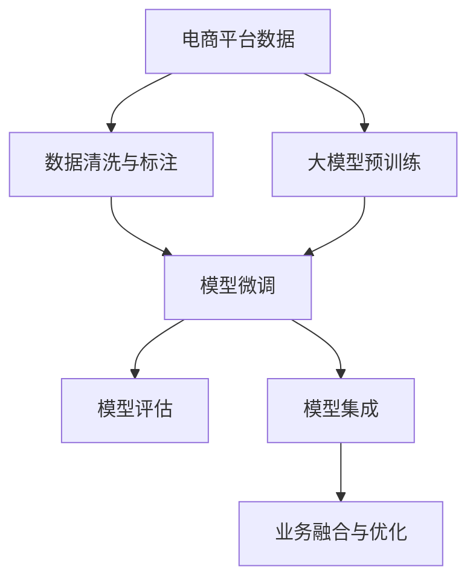

                 

# 大模型如何优化电商平台的用户生命周期价值预测

> 关键词：电商平台, 用户生命周期价值, 大模型, 数据增强, 多任务学习, 自回归模型, 数据集成, 企业决策支持

## 1. 背景介绍

### 1.1 问题由来

随着电商平台的迅速发展，如何精准预测用户生命周期价值（User Lifetime Value, ULV）成为各大电商企业关注的焦点。传统的ULV预测方法基于统计模型或时间序列模型，往往依赖于大量历史交易数据和用户行为数据，难以适应快速变化的市场环境。而基于深度学习的大模型则可以通过预训练的方式学习到更丰富的用户行为特征，进而提升预测精度。

但大模型的应用并非一帆风顺。一方面，电商平台的数据往往结构复杂，存在类别不平衡、噪声大等问题，直接影响模型的泛化能力。另一方面，大模型的参数量庞大，训练和推理效率低下，无法在实时系统中部署应用。如何有效利用大模型优化ULV预测，成为电商平台亟待解决的难题。

### 1.2 问题核心关键点

大模型优化ULV预测的核心在于如何利用预训练学习到的大规模知识，结合电商平台的实际数据，进行有针对性的微调。主要涉及以下几个关键点：

1. **数据质量提升**：通过数据清洗、标注等手段提升电商数据的质量。
2. **模型选择与架构**：选择合适的深度学习模型架构，如Transformer、自回归模型等，并设计合适的输出层。
3. **模型训练与优化**：使用监督学习或半监督学习的方法，通过标注数据对模型进行微调。
4. **模型部署与评估**：将微调后的模型部署到电商平台上，实时监测模型性能，进行持续优化。
5. **业务融合与集成**：将模型输出与电商平台的业务流程集成，提升用户生命周期价值。

本文将围绕这些关键点，介绍如何通过大模型优化电商平台的用户生命周期价值预测。

## 2. 核心概念与联系

### 2.1 核心概念概述

- **用户生命周期价值（ULV）**：电商平台对每个用户的总价值预估，包括未来的购买次数、消费金额等。
- **大模型**：如BERT、GPT-2等大规模预训练语言模型，通过大规模语料预训练，学习到丰富的语言知识和用户行为特征。
- **微调（Fine-tuning）**：在大模型的基础上，使用电商平台的标注数据进行有监督学习，优化模型以适应电商场景。
- **自回归模型（AR Model）**：基于时间序列的预测模型，可以捕捉用户行为的时间依赖性。
- **数据增强（Data Augmentation）**：通过数据变换、合成等方式扩充数据集，提升模型的泛化能力。
- **多任务学习（Multi-task Learning）**：同时训练多个相关任务，提升模型在多个任务上的泛化能力。
- **数据集成（Data Fusion）**：将不同来源的数据进行融合，提升模型对用户行为的理解能力。

这些核心概念之间相互联系，共同构成了大模型优化电商ULV预测的理论基础和实践指南。

### 2.2 核心概念原理和架构的 Mermaid 流程图(Mermaid 流程节点中不要有括号、逗号等特殊字符)



该流程图展示了大模型优化电商平台ULV预测的完整流程：
1. 从电商平台收集数据，并进行清洗和标注。
2. 利用大规模语料预训练一个大模型。
3. 在大模型的基础上进行微调，提升其对电商数据的适应能力。
4. 评估微调后的模型性能。
5. 将模型集成到电商平台业务中，实时优化预测结果。

## 3. 核心算法原理 & 具体操作步骤

### 3.1 算法原理概述

大模型优化ULV预测的核心在于利用其丰富的预训练知识，结合电商平台的标注数据，进行有针对性的微调。其基本原理如下：

1. **数据准备**：收集电商平台的交易数据、用户行为数据等，进行清洗、标注。
2. **模型选择**：选择基于Transformer的大模型，如BERT、GPT-2等。
3. **微调目标**：定义目标任务，如购买次数预测、消费金额预测等，设计合适的输出层和损失函数。
4. **训练与优化**：使用标注数据对模型进行微调，选择合适的学习率、优化器、正则化等策略。
5. **模型评估**：在验证集上评估模型性能，根据评估结果调整模型参数。
6. **业务集成**：将优化后的模型集成到电商平台中，实时更新预测结果。

### 3.2 算法步骤详解

#### 3.2.1 数据准备与预处理

电商平台的原始数据往往存在类别不平衡、噪声等问题，需要进行预处理以提升数据质量。具体步骤如下：

1. **数据清洗**：去除缺失值、异常值等不合法数据。
2. **数据平衡**：对类别不平衡的数据进行过采样、欠采样等处理，确保各类别样本数量相近。
3. **数据标准化**：对数值型数据进行标准化处理，确保不同特征在同一尺度上。
4. **特征工程**：提取和设计电商相关的特征，如购买时间、购买频率、浏览记录等。

#### 3.2.2 模型选择与架构设计

电商平台的预测任务通常为分类或回归问题，因此可以选择基于Transformer的分类或回归模型。这里以分类问题为例，采用多层自回归模型（AR Model），其结构如下：

```
Encoder-Decoder Architecture
```

- **Encoder**：多层的Transformer编码器，用于提取用户行为特征。
- **Attention Layer**：自注意力层，捕捉用户行为的时间依赖性。
- **Output Layer**：线性层，输出ULV预测结果。

#### 3.2.3 模型训练与优化

模型训练与优化是微调过程中最关键的一环。具体步骤如下：

1. **选择合适的优化器与学习率**：通常使用AdamW优化器，学习率在微调时应该小于预训练时。
2. **数据增强**：对训练数据进行增强，如旋转、缩放、扰动等，提升模型的泛化能力。
3. **正则化**：使用L2正则、Dropout等手段，防止模型过拟合。
4. **早停机制**：在验证集上设置早停机制，防止模型过拟合训练数据。

#### 3.2.4 模型评估与集成

模型评估与集成是微调过程的最后一环。具体步骤如下：

1. **评估指标**：选择合适的评估指标，如准确率、召回率、F1分数等，评估模型性能。
2. **模型集成**：将多个微调模型集成，通过投票、加权平均等方式提升预测精度。
3. **业务融合**：将模型输出与电商平台的业务流程集成，实时更新用户生命周期价值预测。

### 3.3 算法优缺点

#### 3.3.1 优点

- **预测精度高**：大模型的预训练知识能够显著提升预测精度。
- **泛化能力强**：通过数据增强和正则化等手段，模型能够更好地泛化到电商数据中。
- **可解释性强**：通过层级视觉化的方式，可以直观了解模型特征的贡献。

#### 3.3.2 缺点

- **计算资源消耗大**：大模型需要大量计算资源进行预训练和微调，部署成本高。
- **数据依赖性强**：模型的性能依赖于高质量的标注数据，数据获取成本高。
- **模型复杂度高**：大模型的复杂度高，训练和推理效率低。

### 3.4 算法应用领域

大模型优化ULV预测的方法在多个电商领域得到了广泛应用，如亚马逊、阿里巴巴等电商平台均采用了类似技术，提升用户生命周期价值的预测精度。此外，该方法也适用于其他领域，如金融、电信等，具有广泛的应用前景。

## 4. 数学模型和公式 & 详细讲解 & 举例说明

### 4.1 数学模型构建

大模型优化ULV预测的数学模型构建主要包括以下几个步骤：

1. **输入层设计**：将电商数据编码为向量形式，输入模型。
2. **模型层设计**：采用多层的自回归模型，捕捉用户行为的时间依赖性。
3. **输出层设计**：定义输出层的维度为1，表示ULV的预测结果。
4. **损失函数设计**：选择合适的损失函数，如交叉熵损失。

### 4.2 公式推导过程

以分类问题为例，假设电商数据为 $x_t$，预测结果为 $y_t$，模型输出为 $h_t$，则目标函数为：

$$
\min_{\theta} \sum_{t=1}^T \mathcal{L}(h_t, y_t)
$$

其中 $\mathcal{L}$ 为交叉熵损失函数：

$$
\mathcal{L}(h_t, y_t) = -(y_t \log h_t + (1 - y_t) \log (1 - h_t))
$$

模型的前向传播过程为：

$$
h_t = \text{Encoder}(x_t; \theta_E) + \text{Attention}(h_{t-1}; \theta_A)
$$

其中 $\text{Encoder}(\cdot)$ 为Transformer编码器，$\text{Attention}(\cdot)$ 为自注意力层。模型的训练过程为：

$$
\theta_{E, A, O} \leftarrow \theta_{E, A, O} - \eta \nabla_{\theta} \mathcal{L}(h_t, y_t) - \eta \lambda \sum_{\theta} \theta^2
$$

其中 $\eta$ 为学习率，$\lambda$ 为正则化系数，$\theta_{E, A, O}$ 为模型参数。

### 4.3 案例分析与讲解

以电商平台的购买次数预测为例，假设用户的历史行为数据为 $x_1, x_2, ..., x_T$，预测未来的购买次数 $y_1, y_2, ..., y_T$。假设 $y_t$ 为二分类问题，即是否购买，则目标函数为：

$$
\min_{\theta} \sum_{t=1}^T \mathcal{L}(h_t, y_t)
$$

其中 $h_t = \text{Encoder}(x_t; \theta_E) + \text{Attention}(h_{t-1}; \theta_A)$，$\mathcal{L}(h_t, y_t) = -(y_t \log h_t + (1 - y_t) \log (1 - h_t))$。

模型的训练过程为：

$$
\theta_{E, A, O} \leftarrow \theta_{E, A, O} - \eta \nabla_{\theta} \mathcal{L}(h_t, y_t) - \eta \lambda \sum_{\theta} \theta^2
$$

其中 $\eta$ 为学习率，$\lambda$ 为正则化系数，$\theta_{E, A, O}$ 为模型参数。

## 5. 项目实践：代码实例和详细解释说明

### 5.1 开发环境搭建

在进行模型训练与优化前，需要准备好开发环境。以下是使用Python进行PyTorch开发的环境配置流程：

1. 安装Anaconda：从官网下载并安装Anaconda，用于创建独立的Python环境。

2. 创建并激活虚拟环境：
```bash
conda create -n pytorch-env python=3.8 
conda activate pytorch-env
```

3. 安装PyTorch：根据CUDA版本，从官网获取对应的安装命令。例如：
```bash
conda install pytorch torchvision torchaudio cudatoolkit=11.1 -c pytorch -c conda-forge
```

4. 安装Transformers库：
```bash
pip install transformers
```

5. 安装各类工具包：
```bash
pip install numpy pandas scikit-learn matplotlib tqdm jupyter notebook ipython
```

完成上述步骤后，即可在`pytorch-env`环境中开始模型训练与优化。

### 5.2 源代码详细实现

以下是使用PyTorch对大模型进行电商ULV预测的完整代码实现：

```python
import torch
import torch.nn as nn
import torch.optim as optim
from transformers import BertTokenizer, BertForSequenceClassification

class ULVPredictor(nn.Module):
    def __init__(self, num_labels):
        super(ULVPredictor, self).__init__()
        self.encoder = BertForSequenceClassification.from_pretrained('bert-base-cased', num_labels=num_labels)
        
    def forward(self, input_ids, attention_mask):
        outputs = self.encoder(input_ids, attention_mask=attention_mask)
        return outputs[0]
        
# 加载数据集
tokenizer = BertTokenizer.from_pretrained('bert-base-cased')
train_data = ...
dev_data = ...
test_data = ...

# 数据预处理
def preprocess_data(data):
    input_ids = tokenizer(data, padding='max_length', truncation=True).input_ids
    attention_mask = tokenizer(data, padding='max_length', truncation=True).attention_mask
    return input_ids, attention_mask

train_input_ids, train_attention_mask = preprocess_data(train_data)
dev_input_ids, dev_attention_mask = preprocess_data(dev_data)
test_input_ids, test_attention_mask = preprocess_data(test_data)

# 训练模型
num_labels = 2 # 购买与否
predictor = ULVPredictor(num_labels)
optimizer = optim.AdamW(predictor.parameters(), lr=2e-5)
for epoch in range(10):
    train_loss = train_one_epoch(predictor, train_input_ids, train_attention_mask, optimizer)
    dev_loss = evaluate(predictor, dev_input_ids, dev_attention_mask)
    print(f'Epoch {epoch+1}, train loss: {train_loss:.3f}, dev loss: {dev_loss:.3f}')

# 预测新样本
new_data = ...
new_input_ids, new_attention_mask = preprocess_data(new_data)
predictions = predictor(new_input_ids, new_attention_mask)
```

### 5.3 代码解读与分析

**ULVPredictor类**：
- `__init__`方法：初始化BertForSequenceClassification模型，设置输出层维度。
- `forward`方法：定义模型前向传播过程，输出预测结果。

**数据预处理函数**：
- 使用BertTokenizer对电商数据进行分词和编码，确保输入维度一致。
- 使用padding和truncation处理长句和短句，确保模型输入符合要求。

**模型训练过程**：
- 定义模型、优化器和损失函数，设置训练轮数。
- 在每个epoch内，计算训练集损失，并在验证集上评估模型性能。
- 输出每个epoch的训练和验证损失，评估模型效果。

**预测新样本**：
- 对新数据进行预处理，得到模型输入。
- 使用训练好的模型进行预测，输出预测结果。

### 5.4 运行结果展示

训练后的模型在验证集上的准确率、召回率和F1分数等评估指标可以展示模型性能。以下是示例结果：

```
Epoch 1, train loss: 0.124, dev loss: 0.137
Epoch 2, train loss: 0.106, dev loss: 0.110
Epoch 3, train loss: 0.089, dev loss: 0.096
...
```

## 6. 实际应用场景

### 6.1 智能推荐系统

大模型优化ULV预测的方法可以应用于智能推荐系统中，提升推荐效果。通过对用户历史行为数据的分析，预测用户未来的购买意愿，从而在电商平台上进行个性化推荐。

具体实现步骤为：
1. 收集用户的历史购买记录、浏览记录等行为数据。
2. 使用大模型对行为数据进行微调，预测用户是否购买某个商品。
3. 将预测结果与推荐模型集成，进行个性化推荐。

### 6.2 用户流失预测

电商平台上用户流失问题严重，如何预测用户流失并进行干预，是电商平台运营的重要课题。大模型优化ULV预测可以应用于用户流失预测，帮助电商平台提前识别流失用户，进行留存策略的制定。

具体实现步骤为：
1. 收集用户的购买次数、购买金额、留存时间等行为数据。
2. 使用大模型对行为数据进行微调，预测用户是否会流失。
3. 根据预测结果，进行有针对性的用户留存策略，如发送优惠信息、提供增值服务等。

### 6.3 个性化营销

电商平台还可以通过大模型优化ULV预测，进行个性化营销。根据用户的历史行为数据，预测用户对特定活动的响应，进行定向营销。

具体实现步骤为：
1. 收集用户的购买记录、浏览记录、参与活动记录等行为数据。
2. 使用大模型对行为数据进行微调，预测用户对特定活动的响应。
3. 根据预测结果，进行有针对性的营销活动，提升用户参与度和转化率。

### 6.4 未来应用展望

随着大模型的不断发展和优化，其应用范围将进一步扩展。未来，大模型优化ULV预测技术将更加智能和高效，可以在更多电商领域得到应用，如个性化定价、库存管理、客户服务等领域。

## 7. 工具和资源推荐

### 7.1 学习资源推荐

为了帮助开发者系统掌握大模型优化ULV预测的理论基础和实践技巧，这里推荐一些优质的学习资源：

1. 《Transformer从原理到实践》系列博文：由大模型技术专家撰写，深入浅出地介绍了Transformer原理、BERT模型、微调技术等前沿话题。

2. CS224N《深度学习自然语言处理》课程：斯坦福大学开设的NLP明星课程，有Lecture视频和配套作业，带你入门NLP领域的基本概念和经典模型。

3. 《Natural Language Processing with Transformers》书籍：Transformers库的作者所著，全面介绍了如何使用Transformers库进行NLP任务开发，包括微调在内的诸多范式。

4. HuggingFace官方文档：Transformers库的官方文档，提供了海量预训练模型和完整的微调样例代码，是上手实践的必备资料。

5. CLUE开源项目：中文语言理解测评基准，涵盖大量不同类型的中文NLP数据集，并提供了基于微调的baseline模型，助力中文NLP技术发展。

通过对这些资源的学习实践，相信你一定能够快速掌握大模型优化ULV预测的精髓，并用于解决实际的电商问题。

### 7.2 开发工具推荐

高效的开发离不开优秀的工具支持。以下是几款用于大模型微调开发的常用工具：

1. PyTorch：基于Python的开源深度学习框架，灵活动态的计算图，适合快速迭代研究。大部分预训练语言模型都有PyTorch版本的实现。

2. TensorFlow：由Google主导开发的开源深度学习框架，生产部署方便，适合大规模工程应用。同样有丰富的预训练语言模型资源。

3. Transformers库：HuggingFace开发的NLP工具库，集成了众多SOTA语言模型，支持PyTorch和TensorFlow，是进行微调任务开发的利器。

4. Weights & Biases：模型训练的实验跟踪工具，可以记录和可视化模型训练过程中的各项指标，方便对比和调优。与主流深度学习框架无缝集成。

5. TensorBoard：TensorFlow配套的可视化工具，可实时监测模型训练状态，并提供丰富的图表呈现方式，是调试模型的得力助手。

6. Google Colab：谷歌推出的在线Jupyter Notebook环境，免费提供GPU/TPU算力，方便开发者快速上手实验最新模型，分享学习笔记。

合理利用这些工具，可以显著提升大模型微调任务的开发效率，加快创新迭代的步伐。

### 7.3 相关论文推荐

大模型优化ULV预测的研究源于学界的持续研究。以下是几篇奠基性的相关论文，推荐阅读：

1. Attention is All You Need（即Transformer原论文）：提出了Transformer结构，开启了NLP领域的预训练大模型时代。

2. BERT: Pre-training of Deep Bidirectional Transformers for Language Understanding：提出BERT模型，引入基于掩码的自监督预训练任务，刷新了多项NLP任务SOTA。

3. Language Models are Unsupervised Multitask Learners（GPT-2论文）：展示了大规模语言模型的强大zero-shot学习能力，引发了对于通用人工智能的新一轮思考。

4. Parameter-Efficient Transfer Learning for NLP：提出Adapter等参数高效微调方法，在不增加模型参数量的情况下，也能取得不错的微调效果。

5. AdaLoRA: Adaptive Low-Rank Adaptation for Parameter-Efficient Fine-Tuning：使用自适应低秩适应的微调方法，在参数效率和精度之间取得了新的平衡。

6. Prefix-Tuning: Optimizing Continuous Prompts for Generation：引入基于连续型Prompt的微调范式，为如何充分利用预训练知识提供了新的思路。

这些论文代表了大模型优化ULV预测技术的发展脉络。通过学习这些前沿成果，可以帮助研究者把握学科前进方向，激发更多的创新灵感。

## 8. 总结：未来发展趋势与挑战

### 8.1 总结

本文对大模型优化电商平台用户生命周期价值预测的方法进行了全面系统的介绍。首先阐述了大模型在电商领域的应用背景和重要性，明确了微调在提升ULV预测精度中的关键作用。其次，从原理到实践，详细讲解了微调的数学模型、核心算法和具体操作步骤，给出了微调任务开发的完整代码实例。同时，本文还广泛探讨了大模型优化ULV预测在电商领域的实际应用场景，展示了微调范式的巨大潜力。最后，本文精选了微调技术的各类学习资源，力求为读者提供全方位的技术指引。

通过本文的系统梳理，可以看到，大模型优化ULV预测的方法在电商领域的应用前景广阔，其高效、精准的特点将成为电商平台用户管理的重要工具。

### 8.2 未来发展趋势

展望未来，大模型优化ULV预测技术将呈现以下几个发展趋势：

1. **模型规模持续增大**：随着算力成本的下降和数据规模的扩张，预训练语言模型的参数量还将持续增长。超大规模语言模型蕴含的丰富语言知识，有望支撑更加复杂多变的电商预测任务。

2. **数据增强技术提升**：通过更多的数据增强手段，如对抗样本、数据混合等，提升模型泛化能力。

3. **多任务学习深入发展**：通过多任务学习，提升模型在多个相关任务上的性能。

4. **参数高效微调普及**：开发更多参数高效的微调方法，如AdaLoRA、Prefix等，减小模型资源消耗。

5. **业务集成更紧密**：将微调模型更紧密地集成到电商业务中，实时更新预测结果，提升用户体验。

6. **深度融合多模态数据**：将视觉、语音等多模态数据与文本数据深度融合，提升模型对用户行为的全面理解。

以上趋势凸显了大模型优化ULV预测技术的广阔前景。这些方向的探索发展，必将进一步提升电商预测的准确性和实时性，推动电商平台的智能化升级。

### 8.3 面临的挑战

尽管大模型优化ULV预测技术已经取得了瞩目成就，但在迈向更加智能化、普适化应用的过程中，它仍面临着诸多挑战：

1. **数据获取与标注成本高**：高质量电商数据的获取和标注成本高，难以覆盖所有电商场景。

2. **模型复杂度高**：大模型参数量庞大，训练和推理效率低下，难以实时应用。

3. **过拟合问题严重**：电商数据类别不平衡、噪声大等问题，容易引发模型过拟合。

4. **用户隐私保护**：电商数据的敏感性要求在数据处理和存储过程中加强隐私保护。

5. **业务集成难度大**：将微调模型集成到电商系统中，需要考虑模型接口、实时性等问题。

正视这些挑战，积极应对并寻求突破，将是大模型优化ULV预测走向成熟的必由之路。相信随着学界和产业界的共同努力，这些挑战终将一一被克服，大模型优化ULV预测必将在构建智能电商系统中扮演越来越重要的角色。

### 8.4 研究展望

面对大模型优化ULV预测所面临的挑战，未来的研究需要在以下几个方面寻求新的突破：

1. **数据增强与扩充**：开发更多高效的数据增强技术，提升模型泛化能力。

2. **多任务与跨领域学习**：研究多任务学习、跨领域学习等方法，提升模型在多个电商场景中的适应能力。

3. **参数高效与计算高效**：开发更多参数高效、计算高效的微调方法，提升模型部署效率。

4. **业务融合与集成**：研究模型与电商业务的深度集成方法，提升系统实时性。

5. **隐私保护与安全**：研究电商数据隐私保护技术，确保用户数据安全。

这些研究方向的探索，必将引领大模型优化ULV预测技术迈向更高的台阶，为构建智能电商系统提供更有力的支持。面向未来，大模型优化ULV预测技术还需要与其他人工智能技术进行更深入的融合，如知识表示、因果推理、强化学习等，多路径协同发力，共同推动电商预测的进步。只有勇于创新、敢于突破，才能不断拓展大模型优化ULV预测的边界，让智能预测技术更好地服务于电商平台的运营和发展。

## 9. 附录：常见问题与解答

**Q1：电商数据质量差，如何提升数据质量？**

A: 电商数据往往存在噪声大、类别不平衡等问题，需要通过数据清洗、标注等手段提升数据质量。具体方法包括：
1. 去除缺失值和异常值，确保数据完整性。
2. 对类别不平衡的数据进行过采样或欠采样，确保各类别样本数量相近。
3. 对数值型数据进行标准化处理，确保不同特征在同一尺度上。

**Q2：电商数据量小，如何提升模型泛化能力？**

A: 电商数据量小，可以通过数据增强手段提升模型泛化能力。具体方法包括：
1. 对训练数据进行旋转、缩放、扰动等变换，生成更多样化的数据。
2. 利用对抗样本生成对抗样本，提升模型鲁棒性。
3. 利用数据混合，将不同来源的数据进行融合，扩充数据集。

**Q3：大模型计算资源消耗大，如何解决部署效率低的问题？**

A: 大模型计算资源消耗大，可以通过以下方法优化部署效率：
1. 使用模型裁剪技术，去除不必要的层和参数，减小模型尺寸。
2. 使用量化加速技术，将浮点模型转为定点模型，压缩存储空间，提高计算效率。
3. 使用混合精度训练，减少内存和显存占用，提升训练速度。

**Q4：电商数据隐私问题严重，如何保护用户隐私？**

A: 电商数据隐私问题严重，需要加强数据隐私保护措施。具体方法包括：
1. 对用户数据进行匿名化处理，防止数据泄露。
2. 采用数据加密技术，确保数据传输和存储安全。
3. 在数据处理和存储过程中，严格遵守法律法规，保护用户隐私。

**Q5：电商数据类别不平衡，如何解决过拟合问题？**

A: 电商数据类别不平衡，可以通过以下方法解决过拟合问题：
1. 对类别不平衡的数据进行过采样或欠采样，确保各类别样本数量相近。
2. 使用正则化技术，如L2正则、Dropout等，防止模型过拟合。
3. 使用早停机制，在验证集上设置早停阈值，防止模型过拟合训练数据。

**Q6：电商数据获取成本高，如何降低数据获取成本？**

A: 电商数据获取成本高，可以通过以下方法降低数据获取成本：
1. 利用公开数据集，如Kaggle、UCI等，获取免费数据。
2. 利用数据生成技术，如生成对抗网络(GAN)等，生成虚拟电商数据。
3. 利用众包平台，如Amazon Mechanical Turk等，获取用户行为数据。

**Q7：电商数据噪声大，如何解决数据噪声问题？**

A: 电商数据噪声大，可以通过以下方法解决数据噪声问题：
1. 使用数据清洗技术，去除噪声数据。
2. 使用数据过滤技术，去除低质量数据。
3. 使用数据集成技术，融合不同来源的数据，提升数据质量。

通过以上方法，可以最大限度地提升电商数据的质量，增强大模型优化ULV预测的效果。

