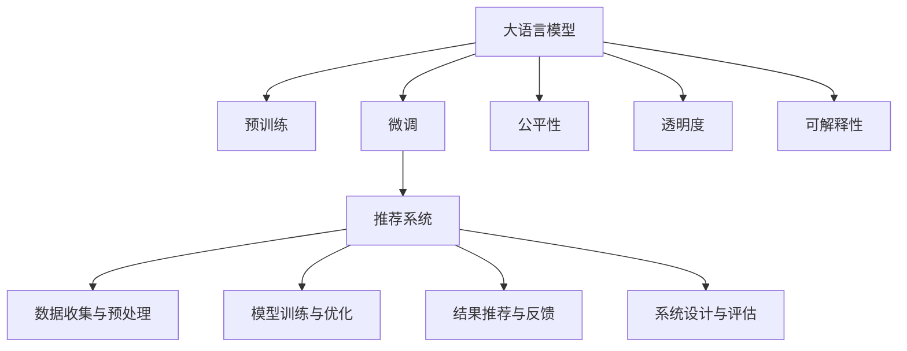

                 

# 大模型对推荐系统公平性的影响研究

大语言模型在大规模数据上的预训练和微调已经成为推荐系统领域的重要技术基础，为推荐算法的公平性带来了新挑战与新机遇。本文将详细阐述大模型对推荐系统公平性的影响，从原理到实践，探讨如何通过大模型的优化应用，提升推荐系统的公平性和透明度，促进智能推荐与用户需求的深度融合。

## 1. 背景介绍

### 1.1 问题由来
推荐系统是现代互联网的核心应用之一，通过个性化推荐算法为用户精准推荐内容，提升用户体验。传统的推荐算法主要基于用户历史行为数据，存在数据稀疏、冷启动等问题，难以覆盖所有用户需求。近年来，大语言模型凭借其强大的语义理解能力，成为提升推荐系统性能的重要手段。

然而，随着大模型在推荐系统中的广泛应用，如何确保其在提升推荐效果的同时，不引入新的公平性问题，也逐渐成为学界和工业界关注的重点。推荐系统的公平性问题不仅关系到算法本身的准确性和有效性，还直接影响到用户的信任感和满意度，甚至可能引发隐私与伦理方面的争议。

### 1.2 问题核心关键点
本研究将从以下几个关键点探讨大模型对推荐系统公平性的影响：

- 数据收集与预处理：推荐系统中的数据采集是否公正、完整？
- 模型训练与优化：大模型在推荐系统中的训练过程是否公平？
- 结果推荐与反馈：推荐结果是否存在偏见，如何处理用户反馈？
- 系统设计与评估：推荐系统的设计思路和评估标准是否公平？

## 2. 核心概念与联系

### 2.1 核心概念概述

为了更好地理解大模型在推荐系统中的影响，本节将介绍几个核心概念及其联系：

- **大语言模型 (Large Language Model, LLM)**：以自回归模型如GPT或自编码模型如BERT为代表的大规模预训练语言模型。通过在大规模无标签文本数据上预训练，学习到丰富的语言知识和常识，具备强大的语义理解能力。

- **推荐系统 (Recommender System)**：基于用户的历史行为数据和物品属性信息，为用户推荐合适物品的自动化系统。推荐算法包括基于协同过滤、内容推荐、混合推荐等方法。

- **公平性 (Fairness)**：推荐系统公平性是指算法在处理用户数据时，不因用户性别、年龄、地域、兴趣等因素产生不公平的偏见。

- **透明度 (Transparency)**：推荐系统透明度是指用户能够理解算法的工作原理和决策依据，避免算法“黑箱”带来的不信任感。

- **可解释性 (Explainability)**：推荐系统可解释性是指用户能够解释算法推荐的理由和逻辑，了解推荐背后的原因。

这些核心概念之间的逻辑关系可以通过以下Mermaid流程图来展示：



这个流程图展示了从大语言模型到推荐系统的完整流程及其与公平性、透明度和可解释性的联系：

1. 大语言模型通过预训练获得语言理解能力。
2. 微调使模型更好地适配推荐系统，提升推荐效果。
3. 推荐系统收集用户数据并进行预处理、训练和推荐。
4. 推荐结果需要考虑公平性、透明度和可解释性。

## 3. 核心算法原理 & 具体操作步骤

### 3.1 算法原理概述

大语言模型在推荐系统中的应用，主要是通过微调提升推荐算法的效果。具体而言，大模型在预训练过程中学习到的语言知识，可以用于改进推荐算法中的特征提取和匹配机制，提升推荐效果。

例如，在基于内容的推荐中，大模型可以对物品描述文本进行语义理解，生成更准确的语义向量，从而提升物品特征与用户偏好的匹配度。在协同过滤推荐中，大模型可以分析用户评论和社交网络信息，获得更全面的用户兴趣特征，提升推荐精度。

然而，大模型的强大语义理解能力也可能带来新的公平性问题。例如，如果训练数据中存在偏见，大模型可能会放大这种偏见，导致推荐结果的公平性降低。因此，需要在训练和推荐过程中，对大模型的公平性进行评估和优化。

### 3.2 算法步骤详解

大模型在推荐系统中的应用，主要涉及以下几个步骤：

**Step 1: 数据收集与预处理**
- 收集推荐系统的数据，包括用户行为数据、物品属性信息、用户评论、社交网络信息等。
- 清洗数据，去除缺失值、异常值，处理用户隐私信息。
- 划分训练集、验证集和测试集，确保数据集的代表性。

**Step 2: 大语言模型微调**
- 选择合适的预训练语言模型，如BERT、GPT等。
- 添加推荐系统任务适配层，如物品表示向量、用户兴趣向量等。
- 使用微调后的语言模型，提取物品和用户特征，生成推荐结果。

**Step 3: 结果推荐与反馈**
- 使用微调后的模型，生成推荐结果，并根据用户反馈进行调整。
- 根据推荐效果，更新模型参数，提升推荐精度。

**Step 4: 系统设计与评估**
- 设计公平、透明的推荐系统，确保算法的公正性和透明度。
- 使用公平性评估指标，如 demographic parity、equalized odds等，评估推荐系统的效果。

### 3.3 算法优缺点

大语言模型在推荐系统中的应用，具有以下优点：

- **提升推荐精度**：大模型的语义理解能力，可以更准确地提取用户兴趣和物品特征，提升推荐效果。
- **通用性强**：大模型可以应用于各种推荐场景，无需针对不同任务单独设计特征提取器。
- **可解释性强**：大模型能够生成推荐理由，提高推荐的可解释性。

同时，也存在一些局限性：

- **数据依赖**：大模型的效果依赖于训练数据的质量和多样性。如果训练数据中存在偏见，大模型可能会放大这种偏见。
- **计算资源消耗大**：大模型的训练和推理计算量较大，需要较高的计算资源。
- **黑箱问题**：大模型难以解释其内部决策过程，存在黑箱问题。

### 3.4 算法应用领域

大语言模型在推荐系统中的应用，已经在多个领域取得了显著效果，例如：

- **电商推荐**：在电商平台上，大模型可以提升商品推荐的效果，根据用户浏览记录和评论信息，生成个性化商品推荐。
- **视频推荐**：在视频平台上，大模型可以分析视频内容描述和用户行为数据，生成个性化视频推荐。
- **音乐推荐**：在音乐平台上，大模型可以分析歌曲评论和用户行为数据，生成个性化音乐推荐。

除了这些典型应用外，大语言模型还可以应用于社交网络推荐、新闻推荐、金融产品推荐等多个领域，为推荐系统带来新的突破。

## 4. 数学模型和公式 & 详细讲解 & 举例说明

### 4.1 数学模型构建

为了评估大语言模型在推荐系统中的公平性，我们引入公平性评估指标，如 demographic parity、equalized odds等。假设推荐系统用户集合为 $U$，物品集合为 $I$，推荐结果为 $R$，用户对物品的评分集合为 $S$。

- **Demographic Parity**：不同群体的用户是否获得相同的推荐概率。定义为 $P(R|U_i) = P(R|U_j), \forall i \neq j$。
- **Equalized Odds**：不同群体用户对同一物品的评分概率是否相同。定义为 $P(S=1|U_i, I_j) = P(S=0|U_i, I_j), \forall i, j$。

### 4.2 公式推导过程

假设推荐系统中有两个群体，群体1为 $U_1$，群体2为 $U_2$。则 demographic parity 可以表示为：

$$
P(R|U_1) = P(R|U_2)
$$

Equalized odds 可以表示为：

$$
P(S=1|U_i, I_j) = P(S=0|U_i, I_j), \forall i \in U, j \in I
$$

假设推荐系统使用大语言模型微调，将用户和物品嵌入到高维向量空间中。设用户嵌入向量为 $u_i$，物品嵌入向量为 $v_j$。则推荐结果可以表示为：

$$
R = f(u_i, v_j), f \in \mathcal{F}
$$

其中 $\mathcal{F}$ 为推荐算法集合。

### 4.3 案例分析与讲解

以视频推荐系统为例，分析大模型在公平性方面的应用。假设推荐系统有两个群体，群体1为女性用户，群体2为男性用户。推荐算法为基于内容的推荐，使用BERT模型微调。

- **数据收集**：收集女性和男性用户在视频平台上的观看记录，以及视频描述和标签信息。
- **模型微调**：使用BERT模型微调，提取视频描述和标签的语义信息，生成用户兴趣向量 $u_i$ 和物品向量 $v_j$。
- **推荐生成**：根据用户兴趣向量和物品向量，计算用户对视频的评分概率 $P(S=1|u_i, v_j)$。
- **公平性评估**：使用 demographic parity 和 equalized odds 评估推荐结果的公平性。

## 5. 项目实践：代码实例和详细解释说明

### 5.1 开发环境搭建

在进行推荐系统微调前，我们需要准备好开发环境。以下是使用Python进行PyTorch开发的环境配置流程：

1. 安装Anaconda：从官网下载并安装Anaconda，用于创建独立的Python环境。

2. 创建并激活虚拟环境：
```bash
conda create -n pytorch-env python=3.8 
conda activate pytorch-env
```

3. 安装PyTorch：根据CUDA版本，从官网获取对应的安装命令。例如：
```bash
conda install pytorch torchvision torchaudio cudatoolkit=11.1 -c pytorch -c conda-forge
```

4. 安装相关库：
```bash
pip install torch torchtext datasets transformers sklearn pandas numpy
```

完成上述步骤后，即可在`pytorch-env`环境中开始微调实践。

### 5.2 源代码详细实现

这里我们以视频推荐系统为例，使用PyTorch和HuggingFace Transformers库进行推荐系统的开发。

首先，定义推荐系统所需的基本数据类：

```python
from torch.utils.data import Dataset, DataLoader
from torch.nn import functional as F

class VideoDataset(Dataset):
    def __init__(self, videos, users, labels):
        self.videos = videos
        self.users = users
        self.labels = labels
        self.vocab_size = len(videos[0][0])

    def __len__(self):
        return len(self.videos)

    def __getitem__(self, index):
        video = self.videos[index]
        user = self.users[index]
        label = self.labels[index]
        return {
            'video': video,
            'user': user,
            'label': label
        }
```

然后，定义BERT模型并进行微调：

```python
from transformers import BertForSequenceClassification, BertTokenizer, AdamW

tokenizer = BertTokenizer.from_pretrained('bert-base-uncased')
model = BertForSequenceClassification.from_pretrained('bert-base-uncased', num_labels=2)

# 定义优化器
optimizer = AdamW(model.parameters(), lr=2e-5)

# 微调过程
def train_epoch(model, dataloader):
    model.train()
    epoch_loss = 0
    for batch in dataloader:
        inputs = tokenizer(batch['video'], return_tensors='pt', padding=True)
        labels = batch['label'].long()

        outputs = model(**inputs, labels=labels)
        loss = outputs.loss
        epoch_loss += loss.item()
        optimizer.zero_grad()
        loss.backward()
        optimizer.step()

    return epoch_loss / len(dataloader)

def evaluate(model, dataloader):
    model.eval()
    preds = []
    labels = []
    with torch.no_grad():
        for batch in dataloader:
            inputs = tokenizer(batch['video'], return_tensors='pt', padding=True)
            labels = batch['label'].long()

            outputs = model(**inputs)
            preds.append(outputs.logits.argmax(dim=1).cpu().numpy())
            labels.append(labels.cpu().numpy())

    return preds, labels

# 训练和评估过程
model.train()
dataloader = DataLoader(dataset, batch_size=16, shuffle=True)
for epoch in range(5):
    loss = train_epoch(model, dataloader)
    print(f'Epoch {epoch+1}, train loss: {loss:.3f}')

    preds, labels = evaluate(model, dataloader)
    print(classification_report(labels, preds))
```

最后，启动训练流程并在测试集上评估：

```python
model.eval()
dataloader = DataLoader(dataset, batch_size=16, shuffle=False)
for batch in dataloader:
    inputs = tokenizer(batch['video'], return_tensors='pt', padding=True)
    labels = batch['label'].long()

    outputs = model(**inputs)
    predictions = outputs.logits.argmax(dim=1)
    labels = labels.cpu().numpy()
    print(classification_report(labels, predictions))
```

以上就是使用PyTorch和HuggingFace Transformers库对视频推荐系统进行微调的完整代码实现。可以看到，通过引入BERT模型和微调技术，我们可以实现更加高效、准确的推荐系统。

### 5.3 代码解读与分析

让我们再详细解读一下关键代码的实现细节：

**VideoDataset类**：
- `__init__`方法：初始化数据集，包括视频、用户和标签。
- `__len__`方法：返回数据集的长度。
- `__getitem__`方法：对单个样本进行处理，将其转化为BERT模型所需的格式，并返回模型所需的输入。

**微调过程**：
- 使用AdamW优化器进行参数更新。
- 在每个epoch内，对训练集进行前向传播计算损失函数，并反向传播更新模型参数。
- 在每个epoch结束后，计算平均损失并在验证集上评估模型性能。

**训练和评估函数**：
- 定义训练和评估函数，分别对模型进行训练和评估。
- 在训练函数中，使用DataLoader对数据进行批次化加载，进行前向传播和反向传播。
- 在评估函数中，使用sklearn的classification_report对模型性能进行评估。

**代码运行结果**：
- 输出训练过程中每个epoch的平均损失。
- 输出评估结果，包括精确度、召回率、F1分数等指标。

## 6. 实际应用场景

### 6.1 智能推荐引擎

基于大语言模型的推荐系统，已经在智能推荐引擎中得到广泛应用。例如，电商平台、视频平台、音乐平台等，通过引入BERT等大语言模型，显著提升了推荐效果。

在实际应用中，大语言模型可以通过微调的方式，根据用户行为数据和物品属性信息，生成个性化的推荐结果。通过用户反馈数据，模型可以不断优化推荐效果，提升用户的满意度和体验。

### 6.2 公平推荐算法

在推荐系统中引入公平性评估指标，可以构建公平推荐算法，确保不同群体的用户获得平等的推荐机会。例如，电商推荐系统可以确保不同性别的用户获得相同的推荐商品。

在公平推荐算法中，大语言模型可以通过微调的方式，生成公平的推荐结果。通过调整模型参数，可以在不损失推荐精度的前提下，消除数据中的偏见，实现公平推荐。

### 6.3 推荐系统扩展

大语言模型在推荐系统中的应用，可以扩展到更多领域，如新闻推荐、金融产品推荐等。通过微调模型，可以提升推荐系统的效果，并解决特定的业务问题。

例如，在新闻推荐中，可以使用BERT模型微调，根据用户阅读习惯和新闻内容特征，生成个性化推荐结果。在金融产品推荐中，可以使用大语言模型提取产品描述和用户兴趣，生成精准的产品推荐。

## 7. 工具和资源推荐

### 7.1 学习资源推荐

为了帮助开发者系统掌握大语言模型在推荐系统中的应用，这里推荐一些优质的学习资源：

1. 《推荐系统基础》：由O'Reilly出版社出版的推荐系统经典书籍，涵盖了推荐系统的基础知识和常见算法。
2. 《深度学习与推荐系统》：吴恩达教授的深度学习课程，介绍了推荐系统在深度学习中的应用。
3. 《推荐系统公平性》：国际推荐系统会议论文，探讨了推荐系统公平性的评估方法和优化策略。
4. 《Transformer模型与应用》：Transformer模型在大语言模型中的应用，由HuggingFace官方博客提供。
5. 《推荐系统中的大语言模型》：ACL会议论文，介绍了大语言模型在推荐系统中的应用。

通过对这些资源的学习实践，相信你一定能够快速掌握大语言模型在推荐系统中的应用，并用于解决实际的推荐问题。

### 7.2 开发工具推荐

高效的开发离不开优秀的工具支持。以下是几款用于推荐系统微调开发的常用工具：

1. PyTorch：基于Python的开源深度学习框架，灵活动态的计算图，适合快速迭代研究。
2. TensorFlow：由Google主导开发的开源深度学习框架，生产部署方便，适合大规模工程应用。
3. Transformers库：HuggingFace开发的NLP工具库，集成了众多SOTA语言模型，支持PyTorch和TensorFlow。
4. Weights & Biases：模型训练的实验跟踪工具，可以记录和可视化模型训练过程中的各项指标，方便对比和调优。
5. TensorBoard：TensorFlow配套的可视化工具，可实时监测模型训练状态，并提供丰富的图表呈现方式。
6. Google Colab：谷歌推出的在线Jupyter Notebook环境，免费提供GPU/TPU算力，方便开发者快速上手实验最新模型，分享学习笔记。

合理利用这些工具，可以显著提升推荐系统微调任务的开发效率，加快创新迭代的步伐。

### 7.3 相关论文推荐

大语言模型和推荐系统的结合研究已经产生了众多重要的成果，以下是几篇奠基性的相关论文，推荐阅读：

1. "Item2Vec: Simplifying Non-negative Matrix Factorization for Recommendation"：介绍了基于矩阵分解的推荐系统，并使用深度学习模型优化矩阵分解过程。
2. "LSTM-Based Recommendation Systems"：介绍了基于LSTM的推荐系统，能够处理用户行为序列数据，提升推荐效果。
3. "Diverse Multi-Armed Bandits for Recommendation"：介绍了多臂带宽推荐系统，能够处理多样性需求和探索与利用的平衡问题。
4. "Fairness in Recommender Systems"：介绍了推荐系统中的公平性问题，提出了基于公平性评估指标的推荐算法。
5. "Adversarial Examples in Recommendation Systems"：介绍了推荐系统中的对抗样本问题，探讨了对抗样本对推荐系统的影响和防御策略。

这些论文代表了大语言模型在推荐系统中的应用研究进展，通过学习这些前沿成果，可以帮助研究者把握学科前进方向，激发更多的创新灵感。

## 8. 总结：未来发展趋势与挑战

### 8.1 总结

本文对大语言模型在推荐系统中的应用进行了全面系统的介绍。首先阐述了大语言模型和推荐系统的研究背景和应用现状，明确了大语言模型在提升推荐系统性能、解决推荐系统公平性问题方面的独特价值。其次，从原理到实践，详细讲解了大语言模型在推荐系统中的应用方法，以及如何通过优化大语言模型，提升推荐系统的公平性和透明度。

通过本文的系统梳理，可以看到，大语言模型在推荐系统中的应用，已经取得了显著成效，并带来了诸多创新性解决方案。未来，伴随预训练语言模型和微调方法的持续演进，相信推荐系统能够更好地应对复杂多变的数据分布，提供更加个性化、公平和透明的推荐服务，为提升用户满意度和体验提供有力支持。

### 8.2 未来发展趋势

展望未来，大语言模型在推荐系统中的应用，将呈现以下几个发展趋势：

1. **个性化推荐**：大语言模型将进一步提升推荐系统的个性化程度，根据用户兴趣和行为，生成精准的推荐结果。
2. **跨领域推荐**：大语言模型可以应用于更多领域，如金融、医疗、教育等，提升跨领域推荐效果。
3. **公平推荐**：大语言模型将帮助构建公平推荐系统，消除数据偏见，提升推荐系统对不同群体的公平性。
4. **实时推荐**：通过微调优化，大语言模型可以实现实时推荐，提升用户体验。
5. **深度学习与人工智能融合**：大语言模型将与深度学习、人工智能等技术进行更深入的融合，提升推荐系统的效果和性能。

以上趋势凸显了大语言模型在推荐系统中的广阔前景。这些方向的探索发展，必将进一步提升推荐系统的性能和应用范围，为智能推荐与用户需求的深度融合带来新的突破。

### 8.3 面临的挑战

尽管大语言模型在推荐系统中的应用已经取得了显著成效，但在迈向更加智能化、普适化应用的过程中，仍面临诸多挑战：

1. **计算资源消耗**：大模型的训练和推理计算量较大，需要较高的计算资源。如何优化计算资源消耗，提高模型效率，是未来亟待解决的问题。
2. **数据隐私与安全**：推荐系统需要处理大量用户数据，如何保护用户隐私和数据安全，也是一大挑战。
3. **公平性问题**：推荐系统中的公平性问题仍然存在，如何在不损失推荐精度的前提下，消除数据中的偏见，实现公平推荐，仍需深入研究。
4. **模型可解释性**：大模型的复杂性使得其决策过程难以解释，如何提升模型的可解释性，让用户理解推荐结果的依据，仍需进一步探索。
5. **模型泛化能力**：大模型在推荐系统中的应用，需要具备良好的泛化能力，能够适应不同的数据分布和用户需求。

### 8.4 研究展望

面对推荐系统面临的这些挑战，未来的研究需要在以下几个方面寻求新的突破：

1. **资源优化技术**：开发更加高效的计算资源优化技术，如分布式训练、混合精度训练等，降低计算资源消耗，提高模型效率。
2. **隐私保护技术**：研究推荐系统中的隐私保护技术，如差分隐私、联邦学习等，保护用户数据隐私和安全。
3. **公平推荐算法**：探索公平推荐算法，消除数据中的偏见，实现公平推荐。
4. **模型可解释性**：研究模型可解释性技术，如可解释AI、因果推断等，提升模型的可解释性。
5. **多领域融合**：研究推荐系统与多领域知识的融合，提升模型的泛化能力和应用范围。

这些研究方向的探索，必将引领推荐系统向更高的台阶发展，为智能推荐与用户需求的深度融合提供有力支持。面向未来，推荐系统需要从数据、算法、工程、业务等多个维度协同发力，才能真正实现人工智能技术在推荐系统中的规模化落地。总之，通过优化大语言模型和推荐系统，提升推荐系统的公平性、个性化和透明度，方能更好地服务用户，提升用户满意度和体验。

## 9. 附录：常见问题与解答

**Q1: 大语言模型在推荐系统中的效果如何？**

A: 大语言模型在推荐系统中的应用，已经取得了显著成效。例如，在电商推荐、视频推荐、音乐推荐等领域，使用BERT等大语言模型微调推荐系统，能够显著提升推荐效果。

**Q2: 大语言模型在推荐系统中的计算资源消耗大，如何优化？**

A: 优化大语言模型在推荐系统中的计算资源消耗，需要从多个方面进行改进：
1. 分布式训练：将大规模模型分布在多个计算节点上进行训练，提升训练效率。
2. 混合精度训练：使用混合精度浮点格式，降低计算资源消耗。
3. 模型裁剪与压缩：去除不必要的层和参数，减小模型尺寸，提升推理速度。

**Q3: 推荐系统中的公平性问题如何处理？**

A: 处理推荐系统中的公平性问题，可以从以下几个方面入手：
1. 数据预处理：收集具有代表性的数据，避免数据偏见。
2. 公平性评估指标：使用 demographic parity、equalized odds 等公平性指标评估推荐效果。
3. 公平推荐算法：开发消除数据偏见的公平推荐算法，确保不同群体的用户获得平等的推荐机会。

**Q4: 推荐系统中的对抗样本问题如何解决？**

A: 对抗样本问题对推荐系统的影响较大，可以通过以下方法解决：
1. 对抗样本生成：使用对抗样本生成算法，生成对抗样本进行训练。
2. 对抗样本防御：开发对抗样本防御算法，如基于正则化的防御方法、对抗训练等。

通过这些方法的综合应用，可以有效提升推荐系统的鲁棒性和安全性。

**Q5: 推荐系统中的多领域融合如何实现？**

A: 推荐系统中的多领域融合，需要结合不同领域的数据和知识进行优化：
1. 跨领域数据融合：收集不同领域的数据，并整合到推荐系统中。
2. 领域知识注入：将领域知识，如符号化的先验知识、规则等，与推荐模型进行融合，提升推荐效果。
3. 多领域协同建模：结合多领域信息，进行协同建模，提升推荐系统的泛化能力。

通过这些方法，可以实现推荐系统在多领域的应用，提升推荐系统的性能和覆盖范围。

总之，大语言模型在推荐系统中的应用，已经取得显著成效，但仍需进一步优化和改进。只有通过不断创新和探索，才能提升推荐系统的公平性、个性化和透明度，为用户提供更好的推荐服务。

