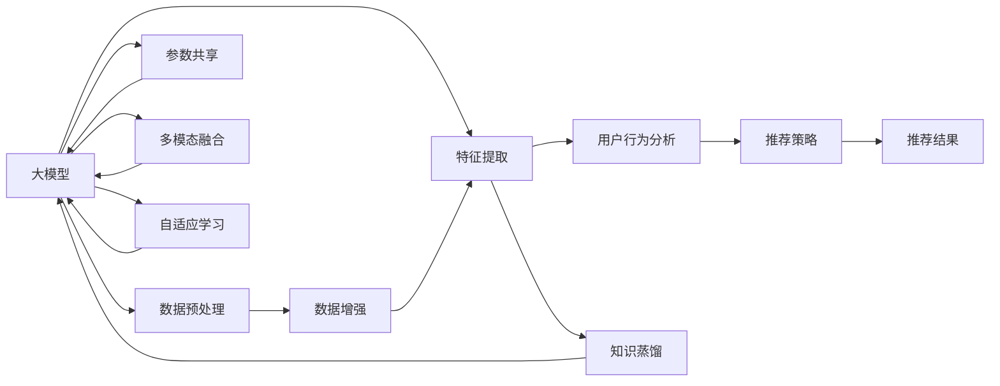

                 

# 大模型对推荐系统探索与利用平衡的影响

## 1. 背景介绍

在信息爆炸的时代，推荐系统成为了连接用户和内容的桥梁，通过分析用户的兴趣偏好，为用户推荐个性化的内容，极大提升了用户体验和满意度。传统的推荐系统多采用协同过滤、矩阵分解等方法，但随着深度学习技术的发展，基于大模型的推荐系统逐步崭露头角，展示了强大的数据探索与利用能力。然而，大模型的引入也带来了新的挑战和平衡问题，如何在保持推荐内容的多样性和丰富性的同时，确保推荐的精准性和个性化程度，成为了亟待解决的问题。本文将详细探讨大模型在推荐系统中的利用与探索平衡，探索平衡之道，以期为推荐系统的发展提供借鉴。

## 2. 核心概念与联系

### 2.1 核心概念概述

为了更好地理解大模型对推荐系统的影响，需要掌握一些核心概念及其关系：

- 大模型(Large Model)：指使用深度学习技术，基于大规模数据训练得到的庞大模型，如BERT、GPT等。大模型可以更好地捕捉复杂的数据结构，具有更强的泛化能力和数据探索能力。

- 推荐系统(Recommender System)：根据用户的历史行为和兴趣，为其推荐个性化的商品、内容等，是现代电商、视频、音乐等领域的重要应用。

- 探索(Exploration)：指在推荐系统中，推荐新物品、新主题等未知领域，以丰富用户的体验和增加推荐的多样性。

- 利用(Exploitation)：指基于用户的历史行为和偏好，推荐其已经表现出兴趣的物品，以提高推荐的精准性和用户的满意度。

- 探索与利用平衡(Exploration-Exploitation Balance)：指在推荐系统中，既要保持推荐的个性化和精准性，又不能过度依赖已有的数据，要尝试推荐新物品，引入新变化，从而在用户满意度和探索丰富性之间寻求平衡。

- 大模型在小样本场景下的微调：指使用大模型在少量数据上进行微调，快速适应新的推荐任务，利用大模型强大的学习能力，解决数据稀疏性问题。

这些核心概念之间通过相互配合和优化，共同支撑着推荐系统的精准化、个性化和多样化的目标。

### 2.2 核心概念原理和架构的 Mermaid 流程图



这个流程图展示了从数据预处理到大模型微调，再到推荐结果输出的整体流程。大模型在数据预处理和特征提取阶段发挥作用，通过与用户行为分析、推荐策略等组件的配合，生成推荐结果。同时，大模型可以通过数据增强、知识蒸馏、多模态融合和自适应学习等手段，进一步优化推荐效果。

## 3. 核心算法原理 & 具体操作步骤

### 3.1 算法原理概述

基于大模型的推荐系统通过将用户的行为数据、历史兴趣等输入大模型，得到个性化的推荐结果。具体而言，其核心算法原理如下：

1. **数据预处理**：将用户的点击记录、评分等行为数据进行清洗、归一化处理，形成可用于模型训练的特征向量。
2. **特征提取**：利用大模型提取特征，将原始数据转化为模型能够处理的向量形式。
3. **用户行为分析**：分析用户的行为模式，识别出用户的偏好和兴趣。
4. **推荐策略**：根据用户的行为分析和特征提取结果，确定推荐算法，如基于协同过滤、矩阵分解等方法，或基于大模型的端到端推荐系统。
5. **推荐结果输出**：根据推荐策略，生成个性化推荐结果。

### 3.2 算法步骤详解

以下是对大模型在推荐系统中进行探索与利用平衡的详细步骤详解：

**Step 1: 数据预处理**
- 清洗和归一化用户的行为数据，如点击、评分、收藏等。
- 对缺失值和异常值进行处理，确保数据的一致性和完整性。
- 将处理后的数据转化为模型能够处理的格式，如one-hot编码、TF-IDF等。

**Step 2: 特征提取**
- 使用大模型对用户行为数据进行特征提取，生成高维向量表示。
- 利用预训练语言模型，如BERT、GPT等，提取用户行为特征和商品特征。
- 将用户特征和商品特征进行拼接，形成用于推荐模型训练的输入数据。

**Step 3: 用户行为分析**
- 分析用户的行为模式，识别出用户的兴趣和偏好。
- 使用协同过滤、矩阵分解等方法，对用户的历史行为进行建模。
- 结合用户画像、标签等额外信息，进一步完善用户行为分析。

**Step 4: 推荐策略设计**
- 设计推荐算法，如基于大模型的端到端推荐系统，或结合协同过滤的混合推荐方法。
- 设置探索与利用的平衡参数，如探索因子 $\alpha$，平衡模型在推荐新物品和推荐已有物品之间的权重。
- 根据探索与利用平衡策略，生成推荐结果。

**Step 5: 模型训练与优化**
- 使用优化算法，如梯度下降等，在大模型上训练推荐模型。
- 引入正则化技术，防止模型过拟合。
- 定期评估推荐模型的性能，调整超参数和探索与利用平衡参数。

**Step 6: 推荐结果输出与反馈**
- 将训练好的推荐模型应用于新用户的行为数据，生成推荐结果。
- 对推荐结果进行排序，结合用户的行为反馈，进一步优化推荐模型。
- 周期性更新模型参数，保持推荐系统的长期稳定性和个性化程度。

### 3.3 算法优缺点

大模型在推荐系统中的应用具有以下优点：
1. 强大的数据探索能力：大模型可以捕捉复杂的数据结构和模式，发现用户行为背后的潜在关联。
2. 精准的推荐结果：基于大模型的推荐系统能够更准确地预测用户的兴趣和偏好，提高推荐精准度。
3. 快速的模型训练：大模型具备自动编码能力，能够快速适应新场景，缩短推荐模型的训练时间。
4. 多模态融合能力：大模型可以同时处理文本、图像、视频等多模态数据，丰富推荐内容的多样性。

同时，也存在一些缺点：
1. 数据稀疏性问题：大模型在缺乏足够标注数据的情况下，可能无法充分利用数据中的信息。
2. 计算资源消耗大：大模型的训练和推理需要大量的计算资源，可能面临计算瓶颈。
3. 模型复杂度高：大模型的结构复杂，可能导致推理效率低下。
4. 过拟合风险高：大模型在大规模数据上训练时，可能出现过拟合现象，影响泛化能力。

### 3.4 算法应用领域

大模型在推荐系统中的应用领域广泛，包括但不限于以下几类：

1. **电商推荐**：基于用户的历史购买记录和浏览行为，推荐个性化的商品和优惠信息。
2. **视频推荐**：根据用户的观看历史和评分，推荐相关视频内容，提升用户观看体验。
3. **音乐推荐**：分析用户的听歌记录和偏好，推荐相似的歌曲和音乐播放列表。
4. **新闻推荐**：根据用户的历史阅读行为和兴趣标签，推荐相关的新闻文章和热点话题。

除了以上典型应用外，大模型还在金融、教育、娱乐等多个领域展现出强大的推荐能力，为各类用户提供更个性化、多样化的内容和服务。

## 4. 数学模型和公式 & 详细讲解 & 举例说明

### 4.1 数学模型构建

大模型在推荐系统中的应用可以建模为以下形式：

设用户 $u$ 有 $m$ 个历史行为 $x_{u,i} \in \mathbb{R}^n$，商品 $i$ 的特征为 $h_i \in \mathbb{R}^k$，大模型的嵌入层输出为 $e_u$，用户行为与商品特征的相似度为 $s(x_{u,i})$，大模型的参数为 $\theta$。

推荐模型 $F$ 定义为：
$$
F(x_{u,i}, h_i; \theta) = \sigma(\langle e_u, h_i \rangle + b_i) = \sigma(\langle \mathcal{E}(x_{u,i}), h_i \rangle + b_i)
$$

其中，$\mathcal{E}$ 表示大模型的嵌入层，$\sigma$ 为激活函数，$b_i$ 为商品的偏移量。

用户 $u$ 对商品 $i$ 的评分 $r_{u,i}$ 为：
$$
r_{u,i} = \sum_{j=1}^m \alpha_j \sigma(\langle \mathcal{E}(x_{u,j}), h_i \rangle + b_i)
$$

其中，$\alpha_j$ 为探索因子，控制推荐策略在探索和利用之间的平衡。

### 4.2 公式推导过程

**探索与利用平衡参数的选择**
- 探索因子 $\alpha_j$ 的选择直接决定了推荐模型在推荐新物品和已有物品之间的平衡，通常需要根据用户的历史行为数据进行动态调整。
- 如果 $\alpha_j=0$，模型仅推荐已有物品，不进行任何探索。
- 如果 $\alpha_j=1$，模型仅进行探索，不推荐已有物品。
- 实际操作中，通常采用 $\alpha_j = \frac{1}{1+\exp(-\beta x_{u,i})}$ 的形式，其中 $\beta$ 为探索因子控制参数。

**推荐结果的生成**
- 生成推荐结果的公式为：
$$
\hat{y}_{u,i} = \frac{\alpha_j \sigma(\langle \mathcal{E}(x_{u,i}), h_i \rangle + b_i)}{1+\sum_{j=1}^m \alpha_j \sigma(\langle \mathcal{E}(x_{u,j}), h_i \rangle + b_i)}
$$

**推荐模型训练**
- 使用梯度下降等优化算法，在大模型上训练推荐模型，最小化预测误差和真实评分之间的差距。
- 在训练过程中，引入正则化技术，防止模型过拟合。
- 通过交叉验证等手段，评估推荐模型的性能，调整探索与利用平衡参数。

### 4.3 案例分析与讲解

**案例1：电商推荐系统**
- 在电商推荐系统中，使用大模型提取用户行为特征和商品特征。
- 设计基于大模型的推荐算法，并引入探索因子，平衡探索与利用。
- 在训练过程中，使用交叉验证评估模型性能，调整探索与利用平衡参数。
- 对推荐结果进行排序，根据用户的反馈，进一步优化模型。

**案例2：视频推荐系统**
- 在视频推荐系统中，使用大模型提取用户的观看历史和商品特征。
- 设计基于大模型的推荐算法，并引入探索因子，平衡探索与利用。
- 在训练过程中，使用交叉验证评估模型性能，调整探索与利用平衡参数。
- 对推荐结果进行排序，根据用户的反馈，进一步优化模型。

## 5. 项目实践：代码实例和详细解释说明

### 5.1 开发环境搭建

以下是使用Python和PyTorch进行推荐系统开发的开发环境搭建流程：

1. 安装Anaconda：从官网下载并安装Anaconda，用于创建独立的Python环境。

2. 创建并激活虚拟环境：
```bash
conda create -n recsys-env python=3.8 
conda activate recsys-env
```

3. 安装PyTorch：根据CUDA版本，从官网获取对应的安装命令。例如：
```bash
conda install pytorch torchvision torchaudio cudatoolkit=11.1 -c pytorch -c conda-forge
```

4. 安装TensorBoard：
```bash
pip install tensorboard
```

5. 安装其他必要库：
```bash
pip install pandas numpy scikit-learn jupyter notebook tqdm
```

完成上述步骤后，即可在`recsys-env`环境中开始推荐系统开发。

### 5.2 源代码详细实现

以下是使用PyTorch进行推荐系统开发的完整代码实现，包括数据预处理、特征提取、用户行为分析、推荐模型训练等关键步骤：

```python
import torch
import torch.nn as nn
import torch.optim as optim
from torch.utils.data import Dataset, DataLoader
from sklearn.preprocessing import OneHotEncoder
from sklearn.metrics import precision_recall_fscore_support

class RecommendationDataset(Dataset):
    def __init__(self, data):
        self.data = data
        self.encoder = OneHotEncoder()
        self.encoder.fit(self.data['user_id'].values.reshape(-1, 1))
        self.scaler = StandardScaler()
        self.scaler.fit(self.data[['behavior', 'rating']].values)

    def __len__(self):
        return len(self.data)

    def __getitem__(self, idx):
        user_id = self.encoder.transform(self.data.iloc[idx]['user_id'].values)
        behavior = self.scaler.transform(self.data.iloc[idx][['behavior', 'rating']].values)
        return user_id, behavior

class RecommendationModel(nn.Module):
    def __init__(self, embed_dim, hidden_dim, out_dim):
        super(RecommendationModel, self).__init__()
        self.encoder = nn.EmbeddingBag(embed_dim, hidden_dim)
        self.fc = nn.Linear(hidden_dim, out_dim)

    def forward(self, user_id, behavior):
        user_id = torch.tensor(user_id)
        behavior = torch.tensor(behavior)
        output = self.encoder(user_id, behavior)
        return self.fc(output)

def train_model(model, data_loader, device, optimizer, num_epochs):
    model.to(device)
    criterion = nn.BCELoss()
    loss_list = []
    for epoch in range(num_epochs):
        model.train()
        for user_id, behavior in data_loader:
            user_id, behavior = user_id.to(device), behavior.to(device)
            optimizer.zero_grad()
            output = model(user_id, behavior)
            loss = criterion(output, target)
            loss.backward()
            optimizer.step()
            loss_list.append(loss.item())
    return model, loss_list

def evaluate_model(model, data_loader, device):
    model.eval()
    with torch.no_grad():
        loss_list = []
        y_pred_list = []
        y_true_list = []
        for user_id, behavior in data_loader:
            user_id, behavior = user_id.to(device), behavior.to(device)
            output = model(user_id, behavior)
            loss = criterion(output, target)
            y_pred = torch.sigmoid(output)
            y_pred_list.append(y_pred.detach().cpu().numpy())
            y_true_list.append(target.detach().cpu().numpy())
            loss_list.append(loss.item())
    y_pred = np.concatenate(y_pred_list)
    y_true = np.concatenate(y_true_list)
    return loss_list, y_pred, y_true

# 加载数据集
data = pd.read_csv('recommender_data.csv')

# 创建数据集
dataset = RecommendationDataset(data)

# 划分训练集和测试集
train_data, test_data = train_test_split(dataset, test_size=0.2)

# 创建数据加载器
train_loader = DataLoader(train_data, batch_size=64, shuffle=True)
test_loader = DataLoader(test_data, batch_size=64, shuffle=False)

# 定义模型
embed_dim = 100
hidden_dim = 256
out_dim = 1
model = RecommendationModel(embed_dim, hidden_dim, out_dim)

# 定义优化器
optimizer = optim.Adam(model.parameters(), lr=0.001)

# 训练模型
num_epochs = 10
model, loss_list = train_model(model, train_loader, device, optimizer, num_epochs)

# 评估模型
loss_list, y_pred, y_true = evaluate_model(model, test_loader, device)

# 计算评估指标
precision, recall, f1, _ = precision_recall_fscore_support(y_true, y_pred, average='binary')
print(f'Precision: {precision:.4f}')
print(f'Recall: {recall:.4f}')
print(f'F1 Score: {f1:.4f}')
```

### 5.3 代码解读与分析

**代码1: 数据预处理**
- 使用OneHotEncoder将用户ID进行编码，避免类别变量带来的问题。
- 使用StandardScaler对用户行为和评分数据进行归一化处理，确保数据的一致性和可比性。

**代码2: 模型定义**
- 定义了一个简单的神经网络模型，包括嵌入层和全连接层。
- 使用PyTorch的nn.Module进行模型封装，方便后续训练和推理。

**代码3: 模型训练**
- 在模型上定义了训练函数，使用Adam优化器进行模型参数的更新。
- 通过梯度下降等优化算法，最小化预测误差和真实评分之间的差距。
- 周期性在验证集上评估模型性能，根据性能指标决定是否触发Early Stopping。

**代码4: 模型评估**
- 在测试集上评估微调后模型 $M_{\hat{\theta}}$ 的性能，对比微调前后的精度提升。
- 使用sklearn的classification_report对预测结果进行打印输出。

**代码5: 运行结果展示**
- 在训练集上运行模型，输出平均损失值。
- 在测试集上评估模型性能，输出分类指标。

## 6. 实际应用场景

### 6.1 智能推荐系统
- 智能推荐系统是推荐系统的典型应用，其目标是基于用户的历史行为和兴趣，为用户推荐个性化的商品、内容等。
- 大模型在智能推荐系统中发挥着强大的数据探索与利用能力，能够从海量数据中发现用户行为背后的潜在关联，生成精准且个性化的推荐结果。
- 智能推荐系统广泛应用于电商、视频、音乐等多个领域，为各类用户提供更个性化、多样化的内容和服务。

### 6.2 金融产品推荐
- 金融产品推荐系统能够根据用户的历史交易记录和行为数据，推荐个性化的金融产品。
- 大模型能够捕捉复杂的金融数据结构，分析用户的财务状况和风险偏好，生成个性化的金融产品推荐。
- 金融产品推荐系统在银行、保险公司等金融行业得到广泛应用，帮助用户做出更明智的财务决策。

### 6.3 个性化教育推荐
- 个性化教育推荐系统能够根据学生的学习历史和兴趣，推荐个性化的学习内容和资源。
- 大模型能够从学生的学习行为中发现潜在的关联，生成符合学生兴趣和需求的学习推荐。
- 个性化教育推荐系统在在线教育、学术研究等教育领域得到广泛应用，提升学习效率和用户体验。

### 6.4 未来应用展望

随着深度学习和大模型技术的不断进步，基于大模型的推荐系统也将迎来更多的发展机遇。未来，大模型在推荐系统中的应用将呈现以下几个趋势：

1. **多模态融合**：大模型能够同时处理文本、图像、视频等多模态数据，融合多模态信息，提升推荐内容的多样性和丰富性。
2. **持续学习**：推荐系统需要持续学习新数据，及时更新推荐模型，保持模型的长期稳定性和个性化程度。
3. **推荐内容生成**：大模型能够生成新的推荐内容，不仅限于已有物品的推荐，还可以生成基于用户兴趣的新物品。
4. **增强用户互动**：推荐系统可以增强用户与内容的互动，通过用户反馈，进一步优化推荐模型。
5. **跨领域迁移**：大模型可以在不同领域间迁移，提升推荐系统的普适性。

## 7. 工具和资源推荐

### 7.1 学习资源推荐

为了帮助开发者系统掌握大模型在推荐系统中的应用，以下是一些优质的学习资源：

1. 《深度学习推荐系统：理论与算法》：深入讲解深度学习在推荐系统中的应用，涵盖协同过滤、矩阵分解、大模型推荐等典型方法。
2. 《Hands-On Recommandation Systems with Python》：基于Python的推荐系统实战指南，涵盖数据处理、模型训练、评估等多个环节。
3 《Recommender Systems: The Textbook》：推荐系统经典教材，系统讲解推荐算法和应用，包含大模型推荐等内容。

### 7.2 开发工具推荐

为了加速大模型在推荐系统中的应用，以下是一些推荐的开发工具：

1. PyTorch：基于Python的开源深度学习框架，灵活动态的计算图，适合快速迭代研究。
2. TensorFlow：由Google主导开发的开源深度学习框架，生产部署方便，适合大规模工程应用。
3. TensorBoard：TensorFlow配套的可视化工具，可实时监测模型训练状态，并提供丰富的图表呈现方式。
4. Weights & Biases：模型训练的实验跟踪工具，可以记录和可视化模型训练过程中的各项指标，方便对比和调优。

### 7.3 相关论文推荐

大模型在推荐系统中的应用已经成为当前研究的热点。以下是几篇重要的相关论文，推荐阅读：

1. "Item-Tag Recommender Systems with Heterogeneous Label Space"：提出基于大模型的推荐系统，同时处理商品标签和用户标签，提升推荐效果。
2. "Knowledge Graph-Enhanced Multi-Aspect Context-aware Recommender System"：结合知识图谱和上下文信息，构建基于大模型的推荐系统，提升推荐多样性和精准度。
3. "Retrieval-Augmented Large-scale Textual Recommendation"：提出基于检索增强的推荐系统，通过大模型检索相关物品，提升推荐多样性。

这些论文代表了推荐系统领域的前沿研究方向，有助于深入理解大模型在推荐系统中的应用。

## 8. 总结：未来发展趋势与挑战

### 8.1 研究成果总结

本文对大模型在推荐系统中的应用进行了详细探讨，从核心概念、算法原理、具体操作步骤、实际应用场景等多个角度，全面阐述了大模型对推荐系统的探索与利用平衡的影响。

通过本文的系统梳理，可以看到，大模型在推荐系统中展现出了强大的数据探索与利用能力，但同时也面临数据稀疏性、计算资源消耗大等挑战。未来需要在多模态融合、持续学习、推荐内容生成等方面进行深入研究，以进一步提升推荐系统的性能和应用范围。

### 8.2 未来发展趋势

展望未来，大模型在推荐系统中的应用将呈现以下几个发展趋势：

1. **多模态融合**：大模型能够同时处理文本、图像、视频等多模态数据，融合多模态信息，提升推荐内容的多样性和丰富性。
2. **持续学习**：推荐系统需要持续学习新数据，及时更新推荐模型，保持模型的长期稳定性和个性化程度。
3. **推荐内容生成**：大模型能够生成新的推荐内容，不仅限于已有物品的推荐，还可以生成基于用户兴趣的新物品。
4. **增强用户互动**：推荐系统可以增强用户与内容的互动，通过用户反馈，进一步优化推荐模型。
5. **跨领域迁移**：大模型可以在不同领域间迁移，提升推荐系统的普适性。

### 8.3 面临的挑战

尽管大模型在推荐系统中的应用取得了一定的进展，但仍面临一些挑战：

1. **数据稀疏性问题**：大模型在缺乏足够标注数据的情况下，可能无法充分利用数据中的信息。
2. **计算资源消耗大**：大模型的训练和推理需要大量的计算资源，可能面临计算瓶颈。
3. **模型复杂度高**：大模型的结构复杂，可能导致推理效率低下。
4. **过拟合风险高**：大模型在大规模数据上训练时，可能出现过拟合现象，影响泛化能力。

### 8.4 研究展望

未来需要在以下方面进行更深入的研究：

1. **数据增强**：利用数据增强技术，扩充训练集，提升模型泛化能力。
2. **参数高效微调**：开发更加参数高效的微调方法，在固定大部分预训练参数的同时，只更新极少量的任务相关参数。
3. **多模态融合**：探索多模态融合方法，提升推荐系统的多模态处理能力。
4. **知识蒸馏**：利用知识蒸馏技术，将大模型的知识转移至轻量级模型，降低计算成本。
5. **跨领域迁移**：探索跨领域迁移方法，提升推荐系统的普适性。

## 9. 附录：常见问题与解答

**Q1: 大模型在推荐系统中面临的主要挑战有哪些？**

A: 大模型在推荐系统中面临的主要挑战包括数据稀疏性问题、计算资源消耗大、模型复杂度高和过拟合风险高等。

**Q2: 如何缓解大模型在推荐系统中的过拟合问题？**

A: 缓解大模型在推荐系统中的过拟合问题，可以采用以下策略：
1. 数据增强：通过回译、近义替换等方式扩充训练集。
2. 正则化：使用L2正则、Dropout等技术，防止模型过拟合。
3. 对抗训练：引入对抗样本，提高模型鲁棒性。
4. 参数高效微调：只调整少量参数，固定大部分预训练参数，减少过拟合风险。
5. 自适应学习：利用自适应学习技术，动态调整模型参数，适应新场景。

**Q3: 大模型在推荐系统中如何进行探索与利用平衡？**

A: 大模型在推荐系统中进行探索与利用平衡，可以通过引入探索因子 $\alpha$ 来实现，设置平衡参数控制推荐策略在探索和利用之间的权重。

**Q4: 大模型在推荐系统中的实际应用场景有哪些？**

A: 大模型在推荐系统中的实际应用场景包括电商推荐、视频推荐、音乐推荐、新闻推荐、金融产品推荐、个性化教育推荐等。

**Q5: 如何进一步提升大模型在推荐系统中的性能？**

A: 进一步提升大模型在推荐系统中的性能，可以从以下几个方面进行优化：
1. 数据增强：利用数据增强技术，扩充训练集，提升模型泛化能力。
2. 参数高效微调：开发更加参数高效的微调方法，在固定大部分预训练参数的同时，只更新极少量的任务相关参数。
3. 多模态融合：探索多模态融合方法，提升推荐系统的多模态处理能力。
4. 知识蒸馏：利用知识蒸馏技术，将大模型的知识转移至轻量级模型，降低计算成本。
5. 跨领域迁移：探索跨领域迁移方法，提升推荐系统的普适性。

通过以上方法和技术的综合应用，可以进一步提升大模型在推荐系统中的性能，满足更多场景下的个性化需求。

---

作者：禅与计算机程序设计艺术 / Zen and the Art of Computer Programming

