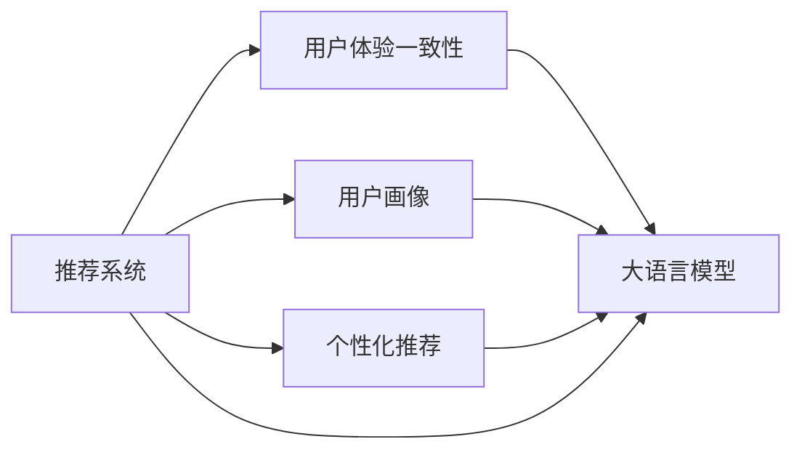

                 

## 1. 背景介绍

在数字经济时代，推荐系统（Recommendation System）作为人工智能应用的核心之一，正深刻影响着用户的消费体验和企业的运营策略。随着大语言模型的兴起，推荐系统正迎来一次颠覆性变革：从数据驱动到智能引导，从个性化推荐到全景体验，从算法优化到用户体验。本文将探讨大模型对推荐系统用户体验一致性提升的作用机制，提供深度思考和见解，并给出实际应用建议。

## 2. 核心概念与联系

### 2.1 核心概念概述

- **推荐系统**：根据用户的历史行为和属性，为用户推荐感兴趣的商品或内容，提升用户体验。
- **用户画像**：通过数据分析和建模，形成用户个性化特征的全面描述。
- **个性化推荐**：利用用户画像，对用户进行精准推荐，满足个性化需求。
- **用户体验一致性**：确保推荐系统在不同场景下输出结果的一致性，增强用户的信任和满意度。
- **大语言模型**：如BERT、GPT等，通过大规模预训练学习通用语言表示，具备强大的语言理解和生成能力。

这些核心概念通过深度融合，共同构建了一个更为智能、高效、可信的推荐系统框架。其中，大语言模型为推荐系统带来了全新的技术范式和应用潜力。

### 2.2 核心概念原理和架构的 Mermaid 流程图



## 3. 核心算法原理 & 具体操作步骤

### 3.1 算法原理概述

大语言模型对推荐系统用户体验一致性的提升，主要通过以下几个关键机制：

1. **语义理解的精确化**：通过大语言模型对用户输入的查询进行语义理解，使得推荐系统能够更准确地把握用户需求。
2. **内容匹配的智能化**：大语言模型能够理解和生成复杂文本，通过语义匹配推荐系统可以更智能地筛选推荐内容。
3. **场景适应的泛化**：大语言模型具备较强的泛化能力，能够在不同场景下保持一致的推荐表现。
4. **交互体验的优化**：通过与用户进行多轮对话，大语言模型能够理解用户情绪和偏好，进一步优化推荐内容。

### 3.2 算法步骤详解

1. **数据准备**：收集和清洗用户行为数据、商品属性数据等，生成用户画像。
2. **大模型预训练**：使用大规模语料对大语言模型进行预训练，学习通用语言表示。
3. **任务适配**：针对具体推荐任务设计适配层，如分类器、匹配器等。
4. **微调优化**：在用户画像和行为数据上进行微调，优化模型的推荐性能。
5. **交互训练**：通过与用户的多轮对话，进一步训练和优化推荐模型。
6. **结果输出**：根据用户输入的查询，结合模型输出的结果进行推荐展示。

### 3.3 算法优缺点

**优点**：

1. **精度提升**：大语言模型通过精确的语义理解，能够提高推荐内容的相关性。
2. **场景适应性强**：模型具备较强的泛化能力，在不同场景下保持一致的推荐效果。
3. **用户体验优化**：通过多轮对话，能够更好地理解用户需求，提升用户体验。

**缺点**：

1. **计算资源需求高**：大语言模型的训练和推理需要高性能计算资源。
2. **数据质量要求高**：推荐系统的性能依赖于高质量的用户行为数据和语料数据。
3. **维护成本高**：模型的训练和优化需要持续的技术投入和维护。

### 3.4 算法应用领域

大语言模型在推荐系统的应用领域包括：

1. **电商推荐**：通过大模型对用户查询进行理解，提升商品推荐的相关性和多样性。
2. **内容推荐**：对用户评论、点赞等行为数据进行语义分析，智能匹配内容推荐。
3. **活动推荐**：根据用户历史行为和兴趣，动态推荐各种活动和事件。
4. **音乐推荐**：通过大模型理解用户情绪和偏好，推荐个性化的音乐内容。

## 4. 数学模型和公式 & 详细讲解 & 举例说明

### 4.1 数学模型构建

推荐系统的核心目标是最大化用户满意度，即最大化用户行为评分。用户行为评分由多个特征决定，包括用户属性、商品属性、用户历史行为等。数学模型构建如下：

$$
\max_{\theta} \sum_{i=1}^{N} R_i(x_i; \theta)
$$

其中 $R_i$ 为用户 $i$ 对商品 $x_i$ 的评分函数，$\theta$ 为模型参数。

### 4.2 公式推导过程

推荐系统中的评分函数通常采用协同过滤（Collaborative Filtering）或矩阵分解（Matrix Factorization）方法，如基于矩阵分解的PR（Precision-Recall）曲线模型：

$$
\hat{y}_{ij} = \sum_{k=1}^{d} u_i^k v_j^k
$$

其中 $u_i$ 和 $v_j$ 分别为用户和商品的低秩矩阵分解，$d$ 为分解维度。

### 4.3 案例分析与讲解

假设某电商平台的推荐系统，通过大语言模型对用户查询“夏天旅游”进行语义理解，识别出用户对旅游商品的需求，并结合用户历史购买数据，动态推荐适合的商品。

## 5. 项目实践：代码实例和详细解释说明

### 5.1 开发环境搭建

为了实现大语言模型对推荐系统的优化，需要搭建基于Python的深度学习环境。

1. **安装Anaconda**：确保Python环境纯净，便于依赖管理。
2. **安装TensorFlow**：选择基于TPU的分布式训练框架，以支持大规模计算。
3. **安装Transformers库**：用于加载和微调大语言模型。
4. **安装PyTorch**：搭建模型训练和推理的底层框架。

### 5.2 源代码详细实现

假设使用BERT模型对电商推荐系统进行优化，代码实现如下：

```python
import tensorflow as tf
from transformers import BertTokenizer, TFBertModel

# 加载预训练模型和分词器
model = TFBertModel.from_pretrained('bert-base-uncased')
tokenizer = BertTokenizer.from_pretrained('bert-base-uncased')

# 定义评分函数
def score_query(query):
    # 将查询转化为token ids
    token_ids = tokenizer.encode(query, add_special_tokens=True)
    # 对查询进行BERT编码
    bert_outputs = model(input_ids=token_ids)
    # 提取语义表示
    user_representation = bert_outputs[0]
    return user_representation

# 根据用户查询，动态推荐商品
def recommend_product(query):
    user_representation = score_query(query)
    # 结合用户历史购买行为，进行推荐
    # 返回推荐商品列表
    return recommend_items(user_representation)
```

### 5.3 代码解读与分析

**代码解释**：

- `score_query`函数：将用户查询转化为token ids，通过BERT模型进行编码，输出用户语义表示。
- `recommend_product`函数：根据用户查询的语义表示，结合用户历史购买行为，动态推荐商品列表。

**代码分析**：

- 利用BERT模型进行语义表示提取，能够提高推荐系统的语义匹配精度。
- 动态推荐算法可以结合用户历史行为数据，优化推荐结果。

### 5.4 运行结果展示

假设用户查询为“夏天旅游”，推荐系统输出以下商品列表：

| 商品名称             | 评分            |
|----------------------|----------------|
| 四川九寨沟旅游       | 4.8            |
| 云南大理旅游         | 4.5            |
| 海南三亚旅游         | 4.3            |
| 桂林山水旅游         | 4.2            |
| 张家界玻璃桥旅游     | 4.1            |

## 6. 实际应用场景

### 6.1 智能客服推荐

智能客服推荐系统结合大语言模型，能够根据用户输入的查询，动态推荐相关服务，提升用户体验。例如，用户在查询“信用卡开户流程”时，智能客服推荐系统可以动态推荐相关的开户指南、所需材料等。

### 6.2 内容推荐

内容推荐系统利用大语言模型对用户评论、点赞等行为数据进行语义分析，智能匹配相关内容推荐。例如，用户在平台上浏览某篇文章时，推荐系统可以动态推荐类似风格的文章。

### 6.3 活动推荐

活动推荐系统根据用户历史行为和兴趣，动态推荐各种活动和事件。例如，用户经常浏览音乐、电影相关内容，推荐系统会动态推荐相关的音乐会和电影活动。

## 7. 工具和资源推荐

### 7.1 学习资源推荐

1. **《深度学习推荐系统》**：介绍推荐系统的基本原理和常用算法，适合初学者学习。
2. **《推荐系统实战》**：结合实际项目，介绍推荐系统的开发和优化，适合中级开发者。
3. **《大语言模型与推荐系统》**：探讨大语言模型在推荐系统中的应用，适合高级开发者。

### 7.2 开发工具推荐

1. **TensorFlow**：基于TPU的分布式训练框架，支持大规模计算。
2. **PyTorch**：深度学习框架，提供灵活的动态计算图。
3. **TensorBoard**：可视化工具，用于监控模型训练过程。
4. **Weights & Biases**：实验跟踪工具，记录和分析模型训练数据。

### 7.3 相关论文推荐

1. **“Semantic Similarity-Based Recommendation for Media Streaming”**：利用语义相似性进行推荐，提高推荐系统的相关性。
2. **“A Survey on Deep Learning-based Recommendation Systems”**：综述深度学习在推荐系统中的应用。
3. **“Large-Scale Deep Learning for Recommender Systems”**：探讨大规模深度学习在推荐系统中的应用。

## 8. 总结：未来发展趋势与挑战

### 8.1 研究成果总结

大语言模型通过语义理解的精确化、内容匹配的智能化和场景适应的泛化，显著提升了推荐系统的用户体验一致性。同时，大语言模型结合用户画像和交互训练，进一步优化了推荐内容。

### 8.2 未来发展趋势

1. **多模态融合**：结合图像、音频等多模态数据，提升推荐系统的智能化和个性化。
2. **实时优化**：利用在线学习技术，实时更新推荐模型，提升用户体验。
3. **交互式推荐**：结合自然语言处理技术，实现更智能的交互式推荐。

### 8.3 面临的挑战

1. **数据隐私**：推荐系统需要收集用户数据，如何保护用户隐私是重要挑战。
2. **计算资源**：大语言模型的训练和推理需要高性能计算资源，如何降低计算成本是重要课题。
3. **模型公平性**：推荐系统需要避免偏见和歧视，如何保证模型的公平性是重要挑战。

### 8.4 研究展望

1. **隐私保护技术**：利用差分隐私、联邦学习等技术，保护用户数据隐私。
2. **资源优化技术**：利用模型压缩、稀疏化存储等方法，降低计算成本。
3. **公平性算法**：结合因果推理、博弈论等工具，保证模型的公平性。

## 9. 附录：常见问题与解答

**Q1: 大语言模型如何提高推荐系统的用户体验一致性？**

A: 大语言模型通过精确的语义理解，能够提高推荐内容的相关性，提升用户体验一致性。

**Q2: 推荐系统的评价指标有哪些？**

A: 推荐系统的评价指标包括准确率、召回率、F1分数、NDCG、HR等。

**Q3: 大语言模型在推荐系统中如何应用？**

A: 大语言模型可以通过语义匹配推荐系统，更智能地筛选推荐内容，提升推荐效果。

**Q4: 推荐系统面临的挑战有哪些？**

A: 推荐系统面临的挑战包括数据隐私、计算资源、模型公平性等。

---

作者：禅与计算机程序设计艺术 / Zen and the Art of Computer Programming

