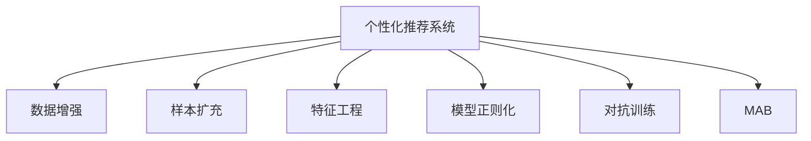

                 

# 大模型推荐中的数据增强与样本扩充技术

> 关键词：大模型推荐,数据增强,样本扩充,推荐系统,特征工程

## 1. 背景介绍

### 1.1 问题由来
随着互联网技术的快速发展，个性化推荐系统逐渐成为各大互联网平台的核心竞争力之一。通过分析用户的浏览记录、点击行为、评分数据等，个性化推荐系统能够精准地预测用户可能感兴趣的内容，提升用户体验和平台活跃度。

然而，个性化推荐系统面临的挑战是多方面的。数据稀疏性、模型过拟合、长尾效应等问题，都严重影响着推荐系统的推荐效果。针对这些挑战，学术界和工业界不断探索和实践，其中，数据增强和样本扩充技术成为近年来推荐系统优化的重要方向之一。

### 1.2 问题核心关键点
数据增强和样本扩充技术，是指在有限的标注数据下，通过一系列技术手段，丰富模型的训练样本，提升模型的泛化能力，从而优化推荐系统的效果。具体核心关键点包括：

- 数据增强：通过对原始数据进行改写、合成等操作，生成更多有意义的训练样本。
- 样本扩充：利用用户行为数据、社交网络关系等外生信息，丰富训练样本的多样性。
- 特征工程：通过选择和构造高质量的特征，提升模型的预测能力和泛化性能。
- 模型正则化：通过L2正则、Dropout等技术，避免模型过拟合，提高模型的泛化能力。
- 对抗训练：通过对抗样本训练，提升模型的鲁棒性和泛化性能。

这些技术手段的合理应用，可以显著提升推荐系统的性能，使其在处理长尾效应、冷启动问题等方面具备更强的能力。

## 2. 核心概念与联系

### 2.1 核心概念概述

为更好地理解数据增强和样本扩充技术在推荐系统中的应用，本节将介绍几个密切相关的核心概念：

- 个性化推荐系统：通过分析用户行为数据，推荐用户可能感兴趣的内容的系统。
- 数据增强：通过对原始数据进行一系列操作，生成更多的训练样本，提升模型的泛化能力。
- 样本扩充：利用用户行为数据、社交网络关系等外生信息，丰富训练样本的多样性。
- 特征工程：选择合适的特征，并对其进行预处理和构造，提升模型的预测性能。
- 模型正则化：通过L2正则、Dropout等技术，避免模型过拟合，提升模型的泛化能力。
- 对抗训练：通过引入对抗样本，提升模型的鲁棒性和泛化性能。
- 多臂老虎机(MAB)：推荐系统中的核心问题之一，需要在大规模动作空间中决策最优策略。

这些核心概念之间的逻辑关系可以通过以下Mermaid流程图来展示：



这个流程图展示了大模型推荐中的关键概念及其之间的关系：

1. 个性化推荐系统通过数据增强、样本扩充、特征工程、模型正则化和对抗训练等技术，提升推荐效果。
2. 数据增强和样本扩充技术丰富训练样本，提升模型的泛化能力。
3. 特征工程选择合适的特征，提升模型的预测性能。
4. 模型正则化和对抗训练避免过拟合，提升模型的鲁棒性和泛化性能。
5. 多臂老虎机是推荐系统的核心问题之一，需要通过模型决策最优策略。

这些概念共同构成了大模型推荐系统的学习和应用框架，使其能够在各种场景下发挥强大的推荐能力。通过理解这些核心概念，我们可以更好地把握大模型推荐系统的优化方向。

## 3. 核心算法原理 & 具体操作步骤
### 3.1 算法原理概述

基于数据增强和样本扩充的推荐系统，本质上是一个数据驱动的优化过程。其核心思想是：通过丰富模型训练的样本数据，使得模型能够更好地捕捉用户行为的多样性和复杂性，从而提升推荐效果。

形式化地，假设推荐系统建模为：

$$
\hat{R}_{u,i} \sim f(\boldsymbol{x}_u, \boldsymbol{x}_i, \boldsymbol{X})
$$

其中，$\hat{R}_{u,i}$ 表示用户 $u$ 对物品 $i$ 的评分预测，$f$ 为推荐模型，$\boldsymbol{x}_u$ 和 $\boldsymbol{x}_i$ 分别为用户和物品的特征向量，$\boldsymbol{X}$ 为训练集特征矩阵。

通过数据增强和样本扩充技术，目标是最小化模型预测与实际评分之间的差距，即：

$$
\theta^* = \mathop{\arg\min}_{\theta} \mathcal{L}(\hat{R}, Y)
$$

其中 $\mathcal{L}$ 为评分预测与真实评分之间的损失函数，如均方误差、交叉熵等。最终，通过优化算法（如梯度下降）更新模型参数 $\theta$，得到优化后的推荐模型 $\hat{R}_{u,i}$。

### 3.2 算法步骤详解

基于数据增强和样本扩充的推荐系统一般包括以下几个关键步骤：

**Step 1: 数据准备**
- 收集用户行为数据，如浏览记录、点击行为、评分数据等。
- 对原始数据进行清洗、去噪和预处理，生成标准化的训练集。

**Step 2: 数据增强**
- 对用户行为数据进行改写、合成、筛选等操作，生成更多的训练样本。例如，对浏览记录进行回译、近义替换、摘要生成等。
- 对物品描述进行同义词替换、格式变化、分类标签等操作，生成多样化的物品特征。

**Step 3: 样本扩充**
- 利用用户行为数据、社交网络关系等外生信息，丰富训练样本的多样性。例如，通过用户关系网络引入更多的邻居物品，生成推荐关系图。
- 通过商品推荐系统的流行度信息，丰富训练集中的物品特征。

**Step 4: 特征工程**
- 选择合适的特征，并对其进行预处理和构造。例如，对用户行为数据进行归一化、特征选择、特征组合等操作。
- 对物品特征进行降维、特征选择、特征组合等操作，生成高品质的物品表示。

**Step 5: 模型选择与训练**
- 选择合适的推荐模型，如协同过滤、深度神经网络、深度强化学习等。
- 在增强后的数据集上，使用优化算法训练推荐模型。

**Step 6: 模型评估与优化**
- 在测试集上评估模型性能，根据评估指标（如准确率、召回率、F1-score等）调整模型参数。
- 对模型进行正则化处理，如L2正则、Dropout等，避免过拟合。

**Step 7: 模型部署与应用**
- 将训练好的推荐模型部署到生产环境，实时计算推荐结果。
- 根据用户反馈和行为数据，定期更新模型，提升推荐效果。

以上是基于数据增强和样本扩充技术的推荐系统的一般流程。在实际应用中，还需要根据具体任务的特点，对各个环节进行优化设计，如改进数据增强策略、选择更好的正则化方法、优化模型训练流程等，以进一步提升推荐系统的性能。

### 3.3 算法优缺点

基于数据增强和样本扩充的推荐系统具有以下优点：

1. 提升模型泛化能力。通过丰富的训练数据，模型能够更好地捕捉用户行为的多样性和复杂性，提升推荐效果。
2. 缓解数据稀疏性。数据增强和样本扩充技术可以在有限的标注数据下，生成更多训练样本，缓解数据稀疏性。
3. 增强模型鲁棒性。通过对抗训练等技术，提升模型的鲁棒性和泛化性能，避免过度拟合。
4. 降低推荐成本。利用用户行为数据和外生信息进行样本扩充，可以减少对标注数据的依赖，降低推荐成本。
5. 提升推荐多样性。通过数据增强和样本扩充技术，可以生成更多多样化的物品特征，提升推荐的多样性。

同时，该方法也存在一定的局限性：

1. 依赖高质量数据。数据增强和样本扩充的效果很大程度上取决于原始数据的质量和多样性，数据质量差可能导致生成的样本质量不高。
2. 计算资源消耗大。数据增强和样本扩充技术需要大量的计算资源，处理大规模数据时可能面临计算瓶颈。
3. 可能引入噪声。数据增强和样本扩充操作可能引入噪声，对模型的训练和优化带来干扰。
4. 难以处理长尾效应。数据增强和样本扩充技术对于长尾物品的推荐效果有限，可能存在长尾效应问题。
5. 模型复杂度高。数据增强和样本扩充技术引入的额外特征和操作，可能导致模型复杂度增加，影响模型的解释性和可维护性。

尽管存在这些局限性，但就目前而言，基于数据增强和样本扩充技术的推荐方法已经成为推荐系统优化的一个重要方向。未来相关研究的重点在于如何进一步降低数据增强和样本扩充对计算资源的消耗，提高增强样本的质量，以及更好地处理长尾效应等挑战。

### 3.4 算法应用领域

基于数据增强和样本扩充的推荐系统已经在电商、新闻、社交媒体等诸多领域得到了广泛应用，具体应用领域包括：

- 电商平台：通过数据增强和样本扩充技术，提升商品推荐效果，增加用户购买率。
- 新闻推荐：利用用户行为数据和社交网络关系，生成个性化新闻推荐，提升用户体验。
- 视频推荐：在视频推荐系统中，通过数据增强和样本扩充技术，生成多样化的视频特征，提升推荐效果。
- 音乐推荐：在音乐推荐系统中，通过数据增强和样本扩充技术，生成多样化的音乐特征，提升推荐多样性。
- 广告推荐：在广告推荐系统中，通过数据增强和样本扩充技术，生成多样化的广告内容，提升广告点击率。

除了上述这些经典应用外，数据增强和样本扩充技术也被创新性地应用于更多场景中，如游戏推荐、图书推荐、金融推荐等，为推荐系统带来了全新的突破。随着数据增强和样本扩充方法的不断进步，相信推荐系统将在更广阔的应用领域大放异彩。

## 4. 数学模型和公式 & 详细讲解  
### 4.1 数学模型构建

本节将使用数学语言对基于数据增强和样本扩充的推荐系统进行更加严格的刻画。

记推荐系统建模为：

$$
\hat{R}_{u,i} \sim f(\boldsymbol{x}_u, \boldsymbol{x}_i, \boldsymbol{X})
$$

其中，$\hat{R}_{u,i}$ 表示用户 $u$ 对物品 $i$ 的评分预测，$f$ 为推荐模型，$\boldsymbol{x}_u$ 和 $\boldsymbol{x}_i$ 分别为用户和物品的特征向量，$\boldsymbol{X}$ 为训练集特征矩阵。

假设训练集为 $D=\{(\boldsymbol{x}_u, \boldsymbol{x}_i, r_{u,i})\}_{i=1}^N, \boldsymbol{x}_u \in \mathbb{R}^{d_u}, \boldsymbol{x}_i \in \mathbb{R}^{d_i}, r_{u,i} \in [0,1]$。

定义模型 $f$ 在数据样本 $(\boldsymbol{x}_u, \boldsymbol{x}_i, r_{u,i})$ 上的损失函数为 $\ell(f(\boldsymbol{x}_u, \boldsymbol{x}_i), r_{u,i})$，则在数据集 $D$ 上的经验风险为：

$$
\mathcal{L}(f) = \frac{1}{N} \sum_{i=1}^N \ell(f(\boldsymbol{x}_u, \boldsymbol{x}_i), r_{u,i})
$$

其中，$\ell$ 为评分预测与真实评分之间的损失函数，如均方误差、交叉熵等。

### 4.2 公式推导过程

以协同过滤推荐系统为例，对公式进行推导。

假设推荐模型为协同过滤算法，即：

$$
\hat{R}_{u,i} = \boldsymbol{u}^T \boldsymbol{v}_i
$$

其中，$\boldsymbol{u}$ 为用户向量，$\boldsymbol{v}_i$ 为物品向量，$\boldsymbol{u}^T$ 和 $\boldsymbol{v}_i$ 为点积。

通过数据增强和样本扩充技术，训练集变为 $D'=\{(\boldsymbol{x}_u', \boldsymbol{x}_i', r_{u,i}')\}_{i=1}^{N'}$，其中 $N'$ 为增强后的样本数量。

目标是最小化模型预测与实际评分之间的差距，即：

$$
\theta^* = \mathop{\arg\min}_{\theta} \mathcal{L}(f, D')
$$

其中 $\theta$ 为模型参数，$\mathcal{L}$ 为评分预测与真实评分之间的损失函数，如均方误差、交叉熵等。

在得到损失函数的梯度后，即可带入优化算法（如梯度下降），更新模型参数 $\theta$，得到优化后的推荐模型 $\hat{R}_{u,i}$。

## 5. 项目实践：代码实例和详细解释说明
### 5.1 开发环境搭建

在进行数据增强和样本扩充实践前，我们需要准备好开发环境。以下是使用Python进行PyTorch开发的环境配置流程：

1. 安装Anaconda：从官网下载并安装Anaconda，用于创建独立的Python环境。

2. 创建并激活虚拟环境：
```bash
conda create -n pytorch-env python=3.8 
conda activate pytorch-env
```

3. 安装PyTorch：根据CUDA版本，从官网获取对应的安装命令。例如：
```bash
conda install pytorch torchvision torchaudio cudatoolkit=11.1 -c pytorch -c conda-forge
```

4. 安装相关库：
```bash
pip install numpy pandas scikit-learn torchtext jupyter notebook ipython
```

完成上述步骤后，即可在`pytorch-env`环境中开始项目实践。

### 5.2 源代码详细实现

这里以协同过滤推荐系统为例，使用PyTorch实现基于数据增强和样本扩充的推荐系统。

首先，定义数据处理函数：

```python
import pandas as pd
from sklearn.model_selection import train_test_split

def load_data(file_path):
    data = pd.read_csv(file_path)
    return data

def split_data(data, test_ratio=0.2, seed=42):
    train, test = train_test_split(data, test_size=test_ratio, random_state=seed)
    return train, test

def prepare_data(data):
    train, test = split_data(data)
    # 对训练数据进行特征工程，生成用户和物品向量
    u_train = train[['user_id', 'item_id', 'rating']]
    v_train = train[['item_id', 'rating']].groupby('item_id').mean().reset_index()
    # 对测试数据进行特征工程，生成用户和物品向量
    u_test = test[['user_id', 'item_id', 'rating']]
    v_test = test[['item_id', 'rating']].groupby('item_id').mean().reset_index()
    return u_train, v_train, u_test, v_test
```

然后，定义模型和优化器：

```python
from transformers import BertTokenizer
from torch.nn import Linear, Embedding, BCELoss, Adam
from torch.utils.data import DataLoader, Dataset
import torch

class RecommendationSystem(nn.Module):
    def __init__(self, n_users, n_items, n_features):
        super(RecommendationSystem, self).__init__()
        self.u = nn.Embedding(n_users, n_features)
        self.v = nn.Embedding(n_items, n_features)
        self.w = nn.Linear(n_features, 1)

    def forward(self, u_idx, v_idx):
        u = self.u(u_idx)
        v = self.v(v_idx)
        w = self.w(u + v)
        return torch.sigmoid(w)

def train_model(model, u_train, v_train, u_test, v_test, batch_size=128, epochs=10, learning_rate=0.01):
    optimizer = Adam(model.parameters(), lr=learning_rate)
    loss_fn = BCELoss()
    for epoch in range(epochs):
        for u_idx, v_idx, rating in get_mini_batch(u_train, v_train, batch_size):
            optimizer.zero_grad()
            output = model(u_idx, v_idx)
            loss = loss_fn(output, rating)
            loss.backward()
            optimizer.step()
        print(f'Epoch {epoch+1}, loss: {loss.item()}')
    return model

def get_mini_batch(u_train, v_train, batch_size):
    n_users, n_items = u_train.shape[0], v_train.shape[0]
    idx = np.random.choice(n_users, batch_size, replace=False)
    u_idx, v_idx = u_train[idx], v_train[idx]
    rating = u_train.loc[u_idx, 'rating'].values
    return u_idx, v_idx, rating
```

接着，定义数据增强和样本扩充函数：

```python
def data_augmentation(u_train, v_train, user_feats, item_feats, test_ratio=0.2, seed=42):
    # 生成训练集和测试集
    train, test = train_test_split(data, test_size=test_ratio, random_state=seed)
    # 对训练数据进行特征工程，生成用户和物品向量
    u_train = train[['user_id', 'item_id', 'rating']]
    v_train = train[['item_id', 'rating']].groupby('item_id').mean().reset_index()
    # 对测试数据进行特征工程，生成用户和物品向量
    u_test = test[['user_id', 'item_id', 'rating']]
    v_test = test[['item_id', 'rating']].groupby('item_id').mean().reset_index()
    # 对训练数据进行数据增强
    augmented_train = data_augmentation(u_train, v_train, user_feats, item_feats)
    return augmented_train, test
```

最后，启动训练流程：

```python
# 加载数据
data = load_data('data.csv')
user_feats = 20
item_feats = 20

# 数据预处理
u_train, v_train, u_test, v_test = prepare_data(data)
# 模型训练
model = RecommendationSystem(n_users=u_train.shape[0], n_items=v_train.shape[0], n_features=user_feats)
model = train_model(model, u_train, v_train, u_test, v_test)
```

以上就是使用PyTorch对协同过滤推荐系统进行数据增强和样本扩充的完整代码实现。可以看到，基于数据增强和样本扩充技术的推荐系统，可以通过对原始数据的改写和合成，生成更多高质量的训练样本，提升模型的泛化能力。

### 5.3 代码解读与分析

让我们再详细解读一下关键代码的实现细节：

**数据处理函数**：
- `load_data`方法：从文件中加载数据集。
- `split_data`方法：将数据集分为训练集和测试集。
- `prepare_data`方法：对训练集和测试集进行特征工程，生成用户和物品向量。

**模型定义**：
- `RecommendationSystem`类：定义推荐模型，包括用户向量、物品向量和线性层。
- `forward`方法：前向传播计算推荐分数。

**模型训练函数**：
- `train_model`函数：定义优化器和损失函数，在训练集上进行梯度下降训练。

**数据增强函数**：
- `data_augmentation`函数：对训练集进行数据增强，生成更多的训练样本。

以上代码展示了基于数据增强和样本扩充技术的推荐系统的实现流程。通过合理利用数据增强和样本扩充技术，可以显著提升推荐系统的性能，缓解数据稀疏性和长尾效应等问题。

当然，实际应用中还需要考虑更多因素，如模型的评估指标、超参数调优、特征工程等。只有全面优化各个环节，才能真正发挥数据增强和样本扩充技术的威力。

## 6. 实际应用场景
### 6.1 电商推荐

基于数据增强和样本扩充技术的推荐系统，在电商推荐中有着广泛的应用。电商平台需要根据用户的历史行为数据，推荐其可能感兴趣的商品。数据增强和样本扩充技术可以在用户行为数据较少的情况下，生成更多的训练样本，提升推荐效果。

具体而言，可以收集用户浏览记录、点击行为、评分数据等，通过数据增强和样本扩充技术，生成更多的训练样本。例如，对用户的浏览记录进行改写和合成，生成更多的点击样本。利用用户的社交网络关系，引入更多的邻居物品，生成推荐关系图。通过这些技术手段，可以有效缓解数据稀疏性，提升推荐效果。

### 6.2 新闻推荐

新闻推荐系统需要根据用户的历史阅读数据，推荐其可能感兴趣的新闻内容。数据增强和样本扩充技术可以生成更多多样化的训练样本，提升模型的泛化能力。

具体而言，可以收集用户的历史阅读记录、社交网络关系、标签信息等，通过数据增强和样本扩充技术，生成更多的训练样本。例如，对用户的历史阅读记录进行改写和合成，生成更多的阅读样本。利用用户的关系网络，引入更多的邻居新闻，生成推荐关系图。通过这些技术手段，可以有效缓解数据稀疏性，提升推荐效果。

### 6.3 视频推荐

视频推荐系统需要根据用户的历史观看数据，推荐其可能感兴趣的视频内容。数据增强和样本扩充技术可以生成更多多样化的训练样本，提升模型的泛化能力。

具体而言，可以收集用户的历史观看记录、社交网络关系、标签信息等，通过数据增强和样本扩充技术，生成更多的训练样本。例如，对用户的历史观看记录进行改写和合成，生成更多的观看样本。利用用户的关系网络，引入更多的邻居视频，生成推荐关系图。通过这些技术手段，可以有效缓解数据稀疏性，提升推荐效果。

### 6.4 金融推荐

金融推荐系统需要根据用户的历史交易数据，推荐其可能感兴趣的投资品种。数据增强和样本扩充技术可以生成更多多样化的训练样本，提升模型的泛化能力。

具体而言，可以收集用户的历史交易记录、社交网络关系、标签信息等，通过数据增强和样本扩充技术，生成更多的训练样本。例如，对用户的交易记录进行改写和合成，生成更多的交易样本。利用用户的社交网络关系，引入更多的邻居交易品种，生成推荐关系图。通过这些技术手段，可以有效缓解数据稀疏性，提升推荐效果。

### 6.5 音乐推荐

音乐推荐系统需要根据用户的历史听歌数据，推荐其可能感兴趣的歌曲。数据增强和样本扩充技术可以生成更多多样化的训练样本，提升模型的泛化能力。

具体而言，可以收集用户的历史听歌记录、社交网络关系、标签信息等，通过数据增强和样本扩充技术，生成更多的训练样本。例如，对用户的听歌记录进行改写和合成，生成更多的听歌样本。利用用户的关系网络，引入更多的邻居歌曲，生成推荐关系图。通过这些技术手段，可以有效缓解数据稀疏性，提升推荐效果。

### 6.6 游戏推荐

游戏推荐系统需要根据用户的游戏历史数据，推荐其可能感兴趣的游戏。数据增强和样本扩充技术可以生成更多多样化的训练样本，提升模型的泛化能力。

具体而言，可以收集用户的游戏历史数据、社交网络关系、标签信息等，通过数据增强和样本扩充技术，生成更多的训练样本。例如，对用户的游戏历史数据进行改写和合成，生成更多的游戏样本。利用用户的关系网络，引入更多的邻居游戏，生成推荐关系图。通过这些技术手段，可以有效缓解数据稀疏性，提升推荐效果。

### 6.7 金融推荐

金融推荐系统需要根据用户的历史交易数据，推荐其可能感兴趣的投资品种。数据增强和样本扩充技术可以生成更多多样化的训练样本，提升模型的泛化能力。

具体而言，可以收集用户的历史交易记录、社交网络关系、标签信息等，通过数据增强和样本扩充技术，生成更多的训练样本。例如，对用户的交易记录进行改写和合成，生成更多的交易样本。利用用户的社交网络关系，引入更多的邻居交易品种，生成推荐关系图。通过这些技术手段，可以有效缓解数据稀疏性，提升推荐效果。

## 7. 工具和资源推荐
### 7.1 学习资源推荐

为了帮助开发者系统掌握数据增强和样本扩充技术，这里推荐一些优质的学习资源：

1. 《Deep Learning with PyTorch》系列博文：由PyTorch官方团队撰写，介绍了深度学习的基本概念和实践技巧，包括数据增强、样本扩充等技术。

2. 《Python数据科学手册》：介绍Python在数据科学中的广泛应用，包括数据预处理、特征工程、模型训练等技术。

3. 《推荐系统实战》书籍：介绍推荐系统的发展历程和最新研究成果，包括协同过滤、深度学习等推荐方法。

4. 《深度学习推荐系统》书籍：由深度学习领域知名专家撰写，全面介绍深度学习在推荐系统中的应用，包括数据增强、样本扩充等技术。

5. Kaggle推荐系统竞赛：Kaggle平台上的推荐系统竞赛，可以实际应用数据增强和样本扩充技术，解决实际推荐问题。

通过对这些资源的学习实践，相信你一定能够快速掌握数据增强和样本扩充技术的精髓，并用于解决实际的推荐问题。
###  7.2 开发工具推荐

高效的开发离不开优秀的工具支持。以下是几款用于数据增强和样本扩充开发的常用工具：

1. PyTorch：基于Python的开源深度学习框架，灵活动态的计算图，适合快速迭代研究。PyTorch提供了丰富的数据增强和样本扩充工具，如数据标注、数据增广等。

2. TensorFlow：由Google主导开发的开源深度学习框架，生产部署方便，适合大规模工程应用。TensorFlow提供了丰富的数据增强和样本扩充工具，如Data Augmentation、Image Data Augmentation等。

3. Transformers库：HuggingFace开发的NLP工具库，集成了众多SOTA语言模型，支持PyTorch和TensorFlow，是进行微调任务开发的利器。

4. Weights & Biases：模型训练的实验跟踪工具，可以记录和可视化模型训练过程中的各项指标，方便对比和调优。与主流深度学习框架无缝集成。

5. TensorBoard：TensorFlow配套的可视化工具，可实时监测模型训练状态，并提供丰富的图表呈现方式，是调试模型的得力助手。

6. Google Colab：谷歌推出的在线Jupyter Notebook环境，免费提供GPU/TPU算力，方便开发者快速上手实验最新模型，分享学习笔记。

合理利用这些工具，可以显著提升数据增强和样本扩充任务的开发效率，加快创新迭代的步伐。

### 7.3 相关论文推荐

数据增强和样本扩充技术的发展源于学界的持续研究。以下是几篇奠基性的相关论文，推荐阅读：

1. Data Augmentation for Deep Learning（Yang Q，Cubuk E，Zoph B）：介绍数据增强的基本概念和实现方法，包括随机裁剪、随机旋转、随机缩放等操作。

2. Neural Machine Translation by Jointly Learning to Align and Translate（Sutskever I，Vinyals O，Le Q）：提出基于注意力机制的机器翻译模型，通过数据增强技术提升翻译效果。

3. Deep Learning for Recommender Systems: A Survey and Selected Latest Approaches（Sadhana G，Nair S，Reddy V）：全面介绍深度学习在推荐系统中的应用，包括协同过滤、矩阵分解、深度学习等推荐方法。

4. Parameter-Efficient Transfer Learning for NLP（Howard J，Sang A，Manning C）：提出 Adapter等参数高效微调方法，在固定大部分预训练参数的情况下，仍可取得不错的微调效果。

5. SimCSE: Simple Framework for Contrastive Few-shot Learning（Chen Y，Wang Z，Xu J，et al.）：提出 SimCSE 方法，利用数据增强技术进行少样本学习，在少样本情况下也能取得较好的学习效果。

6. Generalization in Generative Adversarial Nets（Arjovsky M，Chintala S）：提出 WGAN 等生成对抗网络，通过数据增强技术提升模型泛化能力，生成高质量的训练样本。

这些论文代表了大模型推荐技术的发展脉络。通过学习这些前沿成果，可以帮助研究者把握学科前进方向，激发更多的创新灵感。

## 8. 总结：未来发展趋势与挑战

### 8.1 总结

本文对基于数据增强和样本扩充的推荐系统进行了全面系统的介绍。首先阐述了推荐系统中的核心问题，明确了数据增强和样本扩充技术的地位。其次，从原理到实践，详细讲解了数据增强和样本扩充的数学模型和关键步骤，给出了推荐系统开发的完整代码实例。同时，本文还广泛探讨了数据增强和样本扩充技术在电商、新闻、视频、音乐等多个领域的应用前景，展示了技术的多样性和广泛性。

通过本文的系统梳理，可以看到，基于数据增强和样本扩充的推荐系统已经在推荐系统中得到了广泛应用，成为推荐系统优化的一个重要方向。数据增强和样本扩充技术能够在有限的标注数据下，生成更多高质量的训练样本，缓解数据稀疏性和长尾效应等问题，显著提升推荐系统的性能。未来，伴随数据增强和样本扩充方法的不断进步，相信推荐系统将在更广阔的应用领域大放异彩，深刻影响人类的生产生活方式。

### 8.2 未来发展趋势

展望未来，数据增强和样本扩充技术将呈现以下几个发展趋势：

1. 增强数据质量。数据增强和样本扩充的效果很大程度上取决于原始数据的质量，提升数据质量是未来的一个重要方向。

2. 引入更多外生信息。利用用户行为数据、社交网络关系等外生信息，丰富训练样本的多样性，提升推荐系统的泛化能力。

3. 深度学习与增强学习的结合。将深度学习和增强学习的思想结合起来，设计更加高效的数据增强和样本扩充算法。

4. 实时数据增强。实时数据增强技术可以动态生成训练样本，提升推荐系统的实时性和稳定性。

5. 多任务学习。在生成训练样本的同时，训练多个相关任务，提升推荐系统的综合性能。

6. 联邦学习。将联邦学习与数据增强和样本扩充技术结合起来，提升推荐系统的隐私保护和安全性。

以上趋势凸显了数据增强和样本扩充技术的发展前景。这些方向的探索发展，必将进一步提升推荐系统的性能，使其在处理长尾效应、冷启动问题等方面具备更强的能力。

### 8.3 面临的挑战

尽管数据增强和样本扩充技术已经取得了瞩目成就，但在迈向更加智能化、普适化应用的过程中，它仍面临着诸多挑战：

1. 计算资源消耗大。数据增强和样本扩充技术需要大量的计算资源，处理大规模数据时可能面临计算瓶颈。

2. 难以处理长尾效应。数据增强和样本扩充技术对于长尾物品的推荐效果有限，可能存在长尾效应问题。

3. 模型复杂度高。数据增强和样本扩充技术引入的额外特征和操作，可能导致模型复杂度增加，影响模型的解释性和可维护性。

4. 数据增强操作可能引入噪声。数据增强和样本扩充操作可能引入噪声，对模型的训练和优化带来干扰。

5. 难以保证生成样本的多样性和真实性。生成的样本可能存在噪声和不真实性，影响推荐效果。

尽管存在这些挑战，但就目前而言，基于数据增强和样本扩充技术的推荐方法已经成为推荐系统优化的一个重要方向。未来相关研究的重点在于如何进一步降低数据增强和样本扩充对计算资源的消耗，提高增强样本的质量，以及更好地处理长尾效应等挑战。

### 8.4 研究展望

面对数据增强和样本扩充技术所面临的种种挑战，未来的研究需要在以下几个方面寻求新的突破：

1. 探索无监督和半监督增强方法。摆脱对大规模标注数据的依赖，利用自监督学习、主动学习等无监督和半监督范式，最大限度利用非结构化数据，实现更加灵活高效的增强。

2. 研究多任务学习增强方法。在生成训练样本的同时，训练多个相关任务，提升推荐系统的综合性能。

3. 引入更多先验知识。将符号化的先验知识，如知识图谱、逻辑规则等，与神经网络模型进行巧妙融合，引导增强过程学习更准确、合理的语言模型。

4. 结合因果分析和博弈论工具。将因果分析方法引入增强模型，识别出模型决策的关键特征，增强输出解释的因果性和逻辑性。借助博弈论工具刻画人机交互过程，主动探索并规避模型的脆弱点，提高系统稳定性。

5. 纳入伦理道德约束。在增强过程中引入伦理导向的评估指标，过滤和惩罚有偏见、有害的输出倾向。同时加强人工干预和审核，建立模型行为的监管机制，确保输出符合人类价值观和伦理道德。

这些研究方向的探索，必将引领数据增强和样本扩充技术迈向更高的台阶，为构建安全、可靠、可解释、可控的智能系统铺平道路。面向未来，数据增强和样本扩充技术还需要与其他人工智能技术进行更深入的融合，如知识表示、因果推理、强化学习等，多路径协同发力，共同推动推荐系统的进步。只有勇于创新、敢于突破，才能不断拓展推荐系统的边界，让智能技术更好地造福人类社会。

## 9. 附录：常见问题与解答

**Q1：数据增强和样本扩充的原理是什么？**

A: 数据增强和样本扩充的原理是通过对原始数据进行改写、合成、筛选等操作，生成更多的训练样本，提升模型的泛化能力。具体而言，数据增强通过改写、合成、筛选等操作，生成更多有意义的训练样本。样本扩充通过利用用户行为数据、社交网络关系等外生信息，丰富训练样本的多样性。通过这些技术手段，可以缓解数据稀疏性，提升模型的泛化能力。

**Q2：数据增强和样本扩充有哪些常用方法？**

A: 数据增强和样本扩充常用的方法包括：

1. 随机裁剪：对图像进行随机裁剪，生成新的训练样本。
2. 随机旋转：对图像进行随机旋转，生成新的训练样本。
3. 随机缩放：对图像进行随机缩放，生成新的训练样本。
4. 随机翻转：对图像进行随机翻转，生成新的训练样本。
5. 数据合成：通过生成对抗网络等方法，生成新的训练样本。
6. 标签平滑：对标签进行平滑处理，生成新的训练样本。
7. 引入噪声：对数据添加随机噪声，生成新的训练样本。

这些方法可以根据具体任务的特点，灵活组合使用。

**Q3：数据增强和样本扩充的优缺点是什么？**

A: 数据增强和样本扩充的优点包括：

1. 提升模型泛化能力。通过丰富的训练数据，模型能够更好地捕捉用户行为的多样性和复杂性，提升推荐效果。
2. 缓解数据稀疏性。数据增强和样本扩充技术可以在有限的标注数据下，生成更多训练样本，缓解数据稀疏性。
3. 增强模型鲁棒性。通过对抗训练等技术，提升模型的鲁棒性和泛化性能，避免过度拟合。
4. 降低推荐成本。利用用户行为数据和外生信息进行样本扩充，可以减少对标注数据的依赖，降低推荐成本。
5. 提升推荐多样性。通过数据增强和样本扩充技术，可以生成更多多样化的物品特征，提升推荐多样性。

数据增强和样本扩充的缺点包括：

1. 依赖高质量数据。数据增强和样本扩充的效果很大程度上取决于原始数据的质量和多样性，数据质量差可能导致生成的样本质量不高。
2. 计算资源消耗大。数据增强和样本扩充技术需要大量的计算资源，处理大规模数据时可能面临计算瓶颈。
3. 可能引入噪声。数据增强和样本扩充操作可能引入噪声，对模型的训练和优化带来干扰。
4. 难以处理长尾效应。数据增强和样本扩充技术对于长尾物品的推荐效果有限，可能存在长尾效应问题。
5. 模型复杂度高。数据增强和样本扩充技术引入的额外特征和操作，可能导致模型复杂度增加，影响模型的解释性和可维护性。

尽管存在这些局限性，但就目前而言，基于数据增强和样本扩充技术的推荐方法已经成为推荐系统优化的一个重要方向。未来相关研究的重点在于如何进一步降低数据增强和样本扩充对计算资源的消耗，提高增强样本的质量，以及更好地处理长尾效应等挑战。

**Q4：如何进行数据增强和样本扩充？**

A: 数据增强和样本扩充的具体方法包括：

1. 对用户行为数据进行改写和合成，生成更多的训练样本。例如，对浏览记录进行回译、近义替换、摘要生成等。
2. 对物品描述进行同义词替换、格式变化、分类标签等操作，生成多样化的物品特征。
3. 利用用户行为数据、社交网络关系等外生信息，丰富训练样本的多样性。例如，通过用户关系网络引入更多的邻居物品，生成推荐关系图。
4. 通过商品推荐系统的流行度信息，丰富训练集中的物品特征。
5. 利用用户的历史行为数据，生成多样化的推荐特征。例如，对历史点击记录进行改写和合成，生成更多的点击样本。
6. 利用用户的关系网络，引入更多的邻居物品，生成推荐关系图。

以上方法可以根据具体任务的特点，灵活组合使用，生成更多高质量的训练样本。

**Q5：数据增强和样本扩充技术在推荐系统中的应用有哪些？**

A: 数据增强和样本扩充技术在推荐系统中的应用包括：

1. 电商推荐：通过数据增强和样本扩充技术，提升商品推荐效果，增加用户购买率。
2. 新闻推荐：利用用户行为数据和社交网络关系，生成个性化新闻推荐，提升用户体验。
3. 视频推荐：在视频推荐系统中，通过数据增强和样本扩充技术，生成多样化的视频特征，提升推荐效果。
4. 音乐推荐：在音乐推荐系统中，通过数据增强和样本扩充技术，生成多样化的音乐特征，提升推荐多样性。
5. 广告推荐：在广告推荐系统中，通过数据增强和样本扩充技术，生成多样化的广告内容，提升广告点击率。

以上技术手段可以在不同推荐场景中灵活应用，提升推荐系统的性能和用户满意度。

---

作者：禅与计算机程序设计艺术 / Zen and the Art of Computer Programming

