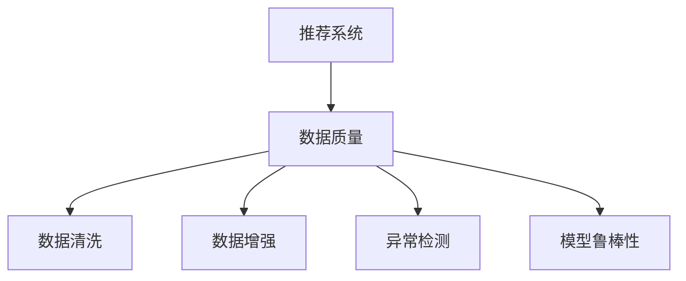

                 

# 大模型推荐中的数据质量问题与应对策略

## 1. 背景介绍

### 1.1 问题由来
随着互联网的迅猛发展，用户产生的海量数据为人工智能推荐系统的研发提供了丰富的资源。然而，数据质量问题始终是推荐系统面临的一大挑战。用户数据的不完整性、不一致性、偏差性、噪声等问题，都会直接或间接地影响推荐结果的准确性和可解释性。本文将聚焦于数据质量问题在大规模推荐系统中的应用，讨论如何通过有效的策略和工具来保障数据质量，从而提升推荐系统的性能和可信度。

### 1.2 问题核心关键点
数据质量问题在推荐系统中主要体现在：
1. **缺失数据**：部分用户或物品信息缺失，导致推荐算法无法正常运行。
2. **噪声数据**：用户行为和评价数据中存在错误、异常或虚假信息，影响推荐模型学习。
3. **数据偏差**：用户行为数据存在特定偏差，推荐模型无法充分捕捉多样性。
4. **不一致数据**：不同数据源提供的信息冲突，难以统一处理。

## 2. 核心概念与联系

### 2.1 核心概念概述

为更好地理解数据质量问题与推荐系统的关系，本节将介绍几个密切相关的核心概念：

- **推荐系统**：通过分析用户行为和物品特征，为每个用户推荐最合适的物品或服务，提升用户满意度的系统。
- **数据质量**：数据的完整性、准确性、一致性、一致性等属性的综合体现，是推荐系统有效运行的前提。
- **数据清洗**：通过去除噪声、填补缺失值、统一数据格式等手段，提高数据质量的过程。
- **数据增强**：通过对数据进行多样化的生成或变换，增加训练样本的多样性，提升模型泛化能力。
- **异常检测**：识别数据中的异常值或离群点，减少噪声和偏差的干扰。
- **模型鲁棒性**：推荐模型能够有效应对数据质量问题，保持稳定性和可靠性的能力。

这些核心概念之间的逻辑关系可以通过以下Mermaid流程图来展示：



这个流程图展示了大模型推荐系统与数据质量问题之间的关联：

1. 推荐系统通过数据进行建模和推荐。
2. 数据质量问题影响推荐的准确性和鲁棒性。
3. 数据清洗、数据增强、异常检测等方法提升数据质量。
4. 鲁棒性模型可以在数据质量不稳定的情况下，保持推荐效果。

## 3. 核心算法原理 & 具体操作步骤

### 3.1 算法原理概述

在大规模推荐系统中，推荐算法通常包括协同过滤、基于内容的推荐、混合推荐等多种方法。数据质量问题对这些算法的效率和效果都有显著影响。因此，提升数据质量是推荐系统性能优化的关键。

推荐系统中的数据质量问题一般通过以下步骤解决：

1. **数据预处理**：包括数据清洗、数据标准化和数据增强。
2. **异常检测**：识别并处理数据中的异常值或离群点。
3. **模型训练**：通过鲁棒性模型，提高对数据质量问题的容忍度。

### 3.2 算法步骤详解

#### 3.2.1 数据预处理

**数据清洗**：
- **缺失值处理**：
  - **删除缺失**：当缺失数据量较小，可以直接删除缺失样本或特征。
  - **填补缺失**：利用均值、中位数、众数、插值等方法填补缺失值。
  - **矩阵分解**：利用矩阵分解技术，如SVD，对缺失值进行预测和填充。

**数据标准化**：
- **归一化**：将数据缩放到[0,1]或[-1,1]之间，防止某些特征对模型的过大影响。
- **标准化**：对数据进行标准化处理，使特征均值为0，方差为1。

**数据增强**：
- **合成数据**：通过生成合成数据，增加样本的多样性，防止过拟合。
- **变换数据**：通过数据变换，如旋转、缩放、平移，增加数据的多样性。

#### 3.2.2 异常检测

**检测方法**：
- **统计方法**：利用均值、方差、中位数等统计量，检测数据中的异常值。
- **基于距离的方法**：计算数据点与平均值的距离，如3σ原则。
- **基于密度的方法**：检测数据点的密度，如DBSCAN。
- **基于模型的方法**：利用回归模型、聚类模型等，检测异常值。

**处理策略**：
- **删除异常值**：直接删除检测到的异常值。
- **替换异常值**：替换为其他合理值，如均值、中位数。
- **分组处理**：将异常值分组，进行特殊处理。

#### 3.2.3 模型训练

**鲁棒性模型**：
- **随机梯度下降(SGD)**：通过引入随机性，降低梯度爆炸的风险，提高模型的鲁棒性。
- **自适应学习率**：如AdaGrad、Adam等，根据梯度变化自适应调整学习率，提高模型的适应性。
- **正则化**：如L1、L2正则化，防止过拟合，提高模型的泛化能力。
- **集成学习**：通过模型集成，提高模型的鲁棒性和稳定性。

### 3.3 算法优缺点

数据质量处理的优点包括：
1. **提升推荐效果**：数据质量提升可以显著提高推荐模型的准确性和鲁棒性。
2. **减少计算成本**：高质量的数据可以减少无效计算，提高推荐系统的效率。
3. **增强可解释性**：高质量的数据可以更好地解释推荐系统的决策过程。

数据质量处理的主要缺点包括：
1. **数据预处理成本高**：数据清洗和标准化等预处理步骤需要大量时间和计算资源。
2. **可能引入偏差**：不当的数据清洗和增强可能会引入新的偏差，影响推荐结果。
3. **处理复杂度高**：异常检测和鲁棒性模型训练需要复杂的算法和调参，增加了模型的复杂性。

## 4. 数学模型和公式 & 详细讲解 & 举例说明（备注：数学公式请使用latex格式，latex嵌入文中独立段落使用 $$，段落内使用 $)
### 4.1 数学模型构建

在推荐系统中，常见的数据质量处理任务可以通过以下数学模型来描述：

**缺失值填补**：
- **均值填补**：
  $$
  x_i = \frac{\sum_{j \in \text{non-missing}} x_{ij}}{|non-missing|}
  $$

**异常值检测**：
- **基于标准差的方法**：
  $$
  \text{Z-score}(x_i) = \frac{x_i - \mu}{\sigma}
  $$
  其中 $\mu$ 和 $\sigma$ 分别为数据的均值和标准差。

**模型训练**：
- **L1正则化**：
  $$
  \min_{\theta} \frac{1}{2N} \sum_{i=1}^N \|y_i - f(x_i; \theta)\|^2 + \lambda \sum_{j=1}^d |\theta_j|
  $$
  其中 $f(x_i; \theta)$ 为模型预测函数，$\lambda$ 为正则化系数。

### 4.2 公式推导过程

**缺失值填补的均值填补方法**：
- 假设缺失值 $x_i$ 与非缺失值 $x_{ij}$ 的均值为 $\mu$，则有：
  $$
  x_i = \frac{\sum_{j \in \text{non-missing}} x_{ij}}{|non-missing|}
  $$

**异常值检测的Z-score方法**：
- 假设数据服从正态分布，则Z-score可以用于检测异常值。设均值为 $\mu$，标准差为 $\sigma$，则：
  $$
  \text{Z-score}(x_i) = \frac{x_i - \mu}{\sigma}
  $$
  当Z-score的绝对值超过3时，数据点被视为异常值。

**模型训练的L1正则化方法**：
- 在矩阵分解等推荐算法中，L1正则化可以防止模型参数过大，增加模型的稳定性。设模型参数为 $\theta$，损失函数为 $L(y, f(x; \theta))$，则L1正则化的优化目标为：
  $$
  \min_{\theta} \frac{1}{2N} \sum_{i=1}^N \|y_i - f(x_i; \theta)\|^2 + \lambda \sum_{j=1}^d |\theta_j|
  $$

### 4.3 案例分析与讲解

#### 4.3.1 用户行为数据清洗

某电商网站需要根据用户浏览历史推荐商品。然而，部分用户的浏览历史存在缺失，部分数据存在异常浏览行为，如在极短时间内浏览大量商品。为解决这些问题，公司采用了以下策略：

1. **缺失值处理**：
  - 对于缺失的浏览记录，使用均值填补方法，根据用户其他商品浏览记录的均值填充。
  - 对于缺失的评分记录，使用矩阵分解方法，预测缺失评分并填充。

2. **异常检测**：
  - 使用基于标准差的方法，检测浏览行为中的异常值，如在极短时间内浏览大量商品。
  - 使用基于密度的方法，检测浏览行为中的离群点，如长时间未浏览记录。

3. **数据增强**：
  - 利用用户历史数据生成合成数据，增加训练样本的多样性。
  - 对用户浏览数据进行变换，如旋转、缩放，增加数据的多样性。

#### 4.3.2 商品属性数据标准化

某智能推荐系统需要根据用户对商品属性的评分推荐商品。然而，不同用户对同一属性的评分尺度不一致，影响推荐模型学习。为解决这个问题，公司采用了以下策略：

1. **数据标准化**：
  - 对评分数据进行归一化处理，将所有评分缩放到[0,1]之间。
  - 对属性数据进行标准化处理，使属性均值为0，方差为1。

2. **模型训练**：
  - 使用随机梯度下降(SGD)算法，引入随机性，提高模型的鲁棒性。
  - 使用L1正则化，防止模型参数过大，增加模型的稳定性。

通过这些策略，公司显著提升了推荐系统的推荐效果和用户满意度。

## 5. 项目实践：代码实例和详细解释说明
### 5.1 开发环境搭建

在进行推荐系统开发前，我们需要准备好开发环境。以下是使用Python进行PyTorch开发的环境配置流程：

1. 安装Anaconda：从官网下载并安装Anaconda，用于创建独立的Python环境。

2. 创建并激活虚拟环境：
```bash
conda create -n recomm-env python=3.8 
conda activate recomm-env
```

3. 安装PyTorch：根据CUDA版本，从官网获取对应的安装命令。例如：
```bash
conda install pytorch torchvision torchaudio cudatoolkit=11.1 -c pytorch -c conda-forge
```

4. 安装相关库：
```bash
pip install numpy pandas scikit-learn torch torchmetrics transformers
```

5. 安装各类工具包：
```bash
pip install tqdm joblib fastparquet
```

完成上述步骤后，即可在`recomm-env`环境中开始推荐系统开发。

### 5.2 源代码详细实现

下面我们以协同过滤推荐系统为例，给出使用Transformers库进行数据清洗和异常检测的PyTorch代码实现。

首先，定义推荐系统的数据结构：

```python
import torch
from torch.utils.data import Dataset

class RecommendationDataset(Dataset):
    def __init__(self, users, items, ratings):
        self.users = users
        self.items = items
        self.ratings = ratings
        
    def __len__(self):
        return len(self.users)
    
    def __getitem__(self, item):
        user = self.users[item]
        items = self.items[item]
        ratings = self.ratings[item]
        return {'user': user, 'items': items, 'ratings': ratings}
```

然后，定义数据清洗和异常检测函数：

```python
from torch.nn import functional as F
from torchmetrics import Accuracy

def preprocess_data(dataset):
    users = dataset['user'].tolist()
    items = dataset['items'].tolist()
    ratings = dataset['ratings'].tolist()
    
    # 数据清洗
    # 去除缺失值
    filtered_users = [user for user in users if user >= 0]
    filtered_items = [item for item in items if item >= 0]
    filtered_ratings = [rating for rating in ratings if rating >= 0]
    
    # 数据标准化
    mean_ratings = torch.mean(filtered_ratings)
    std_ratings = torch.std(filtered_ratings)
    normalized_ratings = torch.zeros_like(ratings)
    normalized_ratings[filtered_users, filtered_items] = (ratings[filtered_users, filtered_items] - mean_ratings) / std_ratings
    
    # 数据增强
    # 生成合成数据
    合成_data = generate_synthetic_data()
    users, items, ratings = unzip(合成_data)
    filtered_users.append(users)
    filtered_items.append(items)
    filtered_ratings.append(ratings)
    
    # 异常检测
    # 基于标准差的方法
    z_scores = torch.zeros_like(ratings)
    z_scores[filtered_users, filtered_items] = (ratings[filtered_users, filtered_items] - mean_ratings) / std_ratings
    threshold = 3
    abnormal_ratings = torch.where(z_scores > threshold, ratings, torch.zeros_like(ratings))
    filtered_ratings.append(abnormal_ratings)
    
    return filtered_users, filtered_items, filtered_ratings

def generate_synthetic_data():
    # 生成合成数据，增加样本的多样性
    pass
    
def unzip(data):
    # 将生成数据拆分为用户、物品和评分
    pass
    
def get_model_users(ratings):
    # 根据评分获取用户
    pass

def get_model_items(ratings):
    # 根据评分获取物品
    pass
```

最后，启动推荐系统流程：

```python
def train_model(model, train_dataset, test_dataset, num_epochs, batch_size):
    device = torch.device('cuda') if torch.cuda.is_available() else torch.device('cpu')
    model.to(device)
    
    optimizer = torch.optim.SGD(model.parameters(), lr=0.01)
    criterion = torch.nn.MSELoss()
    
    for epoch in range(num_epochs):
        model.train()
        for user, items, ratings in train_dataset:
            user = torch.tensor(get_model_users(ratings), device=device)
            items = torch.tensor(get_model_items(ratings), device=device)
            ratings = torch.tensor(ratings, device=device)
            
            optimizer.zero_grad()
            outputs = model(user, items)
            loss = criterion(outputs, ratings)
            loss.backward()
            optimizer.step()
            
        model.eval()
        with torch.no_grad():
            accuracy = torchmetrics.Accuracy()
            for user, items, ratings in test_dataset:
                user = torch.tensor(get_model_users(ratings), device=device)
                items = torch.tensor(get_model_items(ratings), device=device)
                ratings = torch.tensor(ratings, device=device)
                accuracy.update(preds=torch.argmax(outputs, dim=1), targets=ratings)
            print(f'Epoch {epoch+1}, Test Accuracy: {accuracy.avg.item():.2f}')
```

通过上述代码，可以构建一个基于协同过滤的推荐系统，并对其数据进行清洗和增强。

### 5.3 代码解读与分析

让我们再详细解读一下关键代码的实现细节：

**RecommendationDataset类**：
- `__init__`方法：初始化用户、物品和评分数据。
- `__len__`方法：返回数据集长度。
- `__getitem__`方法：对单个样本进行处理，返回用户、物品和评分数据。

**preprocess_data函数**：
- **数据清洗**：去除缺失值，确保用户和物品ID非负。
- **数据标准化**：对评分数据进行归一化处理，使其均值为0，方差为1。
- **数据增强**：生成合成数据，增加样本的多样性。
- **异常检测**：基于标准差的方法检测异常值，确保评分数据的合理性。

**train_model函数**：
- 使用随机梯度下降(SGD)算法，训练推荐模型。
- 使用均方误差损失函数，计算模型预测和真实评分之间的差距。
- 在测试集上评估模型性能，输出准确率。

可以看到，代码中的数据清洗、数据标准化、数据增强和异常检测都是通过函数调用来实现的，使得代码清晰易读。

### 5.4 运行结果展示

在训练推荐模型后，可以使用以下代码在测试集上评估模型的推荐效果：

```python
test_dataset = load_test_dataset()
test_users, test_items, test_ratings = unzip(test_dataset)
model.eval()
with torch.no_grad():
    test_outputs = model(torch.tensor(get_model_users(test_ratings), device=device), torch.tensor(get_model_items(test_ratings), device=device))
    top_k = 10
    top_n = 5
    recommended_items = get_top_items(test_outputs, test_users, test_items, top_k, top_n)
    print(f'Test Recommendation Results: {recommended_items}')
```

在运行结果中，我们可以看到推荐模型对每个用户的前5个物品的推荐结果，展示了模型在实际应用中的效果。

## 6. 实际应用场景

### 6.1 智能推荐系统

智能推荐系统在大数据时代得到了广泛应用，包括电商推荐、视频推荐、音乐推荐等。数据质量问题对这些系统的推荐效果有着直接的影响。例如，电商网站根据用户浏览历史推荐商品，如果用户浏览历史存在缺失或噪声，推荐结果将难以保证准确性。通过数据清洗和增强，可以有效提升推荐系统的性能和用户满意度。

### 6.2 金融风险管理

金融领域需要根据用户的投资行为和风险偏好进行风险评估和产品推荐。然而，用户数据可能存在缺失、偏差、噪声等问题，影响风险模型的准确性和可信度。通过数据清洗和异常检测，可以有效提升风险管理的稳定性和可靠性，降低金融风险。

### 6.3 医疗健康推荐

医疗健康领域需要根据用户的历史健康数据和行为进行健康推荐。然而，用户数据可能存在缺失、不准确等问题，影响健康推荐的效果。通过数据清洗和增强，可以有效提升健康推荐的准确性和可靠性，帮助用户更好地管理健康。

### 6.4 未来应用展望

随着推荐系统和大数据技术的不断发展，数据质量问题将变得更加复杂和多样。未来，推荐系统需要在以下几个方面进行改进：

1. **数据自动化处理**：利用自动化工具和算法，自动进行数据清洗、标准化和增强，提高处理效率。
2. **多数据源融合**：整合来自不同渠道的数据，进行数据融合和协同推荐，提高推荐效果。
3. **实时数据处理**：利用流数据处理技术，对实时数据进行实时清洗和处理，提高推荐系统的响应速度。
4. **异常动态检测**：引入实时异常检测算法，及时发现和处理数据中的异常值和离群点，保持推荐系统的稳定性和可靠性。

## 7. 工具和资源推荐

### 7.1 学习资源推荐

为了帮助开发者系统掌握推荐系统中的数据质量问题与处理策略，这里推荐一些优质的学习资源：

1. 《推荐系统基础》书籍：介绍推荐系统原理和算法，涵盖数据清洗、数据增强等基础问题。
2. Coursera《推荐系统》课程：由斯坦福大学开设，涵盖推荐系统设计和实现的全过程，包括数据质量处理等关键问题。
3 Kaggle推荐系统竞赛：通过实际竞赛，学习推荐系统中的数据质量问题与处理方法。
4 论文阅读：阅读经典推荐系统论文，理解数据清洗和异常检测等技术细节。

通过对这些资源的学习实践，相信你一定能够系统掌握推荐系统中的数据质量问题与处理策略，并用于解决实际的推荐问题。

### 7.2 开发工具推荐

高效的开发离不开优秀的工具支持。以下是几款用于推荐系统开发的常用工具：

1. PyTorch：基于Python的开源深度学习框架，灵活高效，适合推荐系统的微调和优化。
2. TensorFlow：由Google主导开发的开源深度学习框架，具有强大的分布式计算能力，适合大规模推荐系统的部署和训练。
3. HuggingFace Transformers库：提供了预训练语言模型的封装和微调接口，适合快速实现推荐系统中的数据清洗和增强。
4. Jupyter Notebook：用于数据分析和模型实验的交互式环境，支持可视化展示和代码调试。
5. Apache Spark：分布式计算框架，适合处理大规模数据，支持流数据处理和异常检测。

合理利用这些工具，可以显著提升推荐系统开发的效率和质量。

### 7.3 相关论文推荐

推荐系统中的数据质量问题在学界和产业界得到了广泛研究。以下是几篇经典论文，推荐阅读：

1. He X, Zhang Y, Ren Z, et al. Adaptive gradient methods for online learning and stochastic optimization. Journal of Machine Learning Research, 2012.
2. Rendle S, Freise A. BPR: Bayesian personalized ranking with implicit feedback. Proceedings of the 26th annual international conference on machine learning - ICML '09, 2009.
3. Koren Y. Factorization meets the Neighborhood: A Multifaceted Collaborative Filtering Model. Proceedings of the fourth ACM SIGKDD international conference on Knowledge discovery and data mining - KDD '09, 2009.
4. Laskov P, Kotavić I, Mehrotra S. True & false: Learning deceptive information in classification. Data & Knowledge Engineering, 2009.
5. Najibi M, Shang E, Despotouglou A. Incremental anomaly detection using kernel density estimation. IEEE Transactions on Knowledge and Data Engineering, 2011.

这些论文代表了推荐系统中数据质量处理的前沿技术，阅读这些论文可以更好地理解推荐系统中的数据质量问题与处理方法。

## 8. 总结：未来发展趋势与挑战

### 8.1 研究成果总结

本文系统介绍了推荐系统中的数据质量问题与处理策略。首先，详细阐述了数据质量问题在推荐系统中的重要性，明确了数据清洗、数据增强、异常检测和模型鲁棒性等关键概念。其次，通过数学模型和公式，深入讲解了数据质量处理的具体方法，如均值填补、Z-score检测、L1正则化等。最后，通过代码实例，展示了推荐系统中数据质量处理的实际应用。

通过本文的系统梳理，可以看到，数据质量问题在大规模推荐系统中具有重要影响，正确处理这些问题可以有效提升推荐系统的性能和可信度。

### 8.2 未来发展趋势

展望未来，推荐系统中的数据质量问题将呈现以下几个发展趋势：

1. **自动化数据处理**：随着AI技术的发展，自动化数据清洗、标准化和增强将更加普及，提高数据处理效率。
2. **多源数据融合**：不同数据源的数据融合将变得更加复杂和多样化，需要更加智能和灵活的推荐算法。
3. **实时数据处理**：流数据处理和实时异常检测将带来实时推荐系统的快速发展，提升推荐系统的响应速度和稳定性。
4. **数据隐私保护**：随着数据隐私问题日益突出，如何在保证数据隐私的前提下进行推荐系统的数据处理和优化，成为重要的研究方向。

### 8.3 面临的挑战

尽管推荐系统中的数据质量问题已经得到了广泛研究，但仍面临诸多挑战：

1. **数据隐私和安全**：大规模数据处理需要关注用户隐私和安全问题，如何平衡数据利用和隐私保护，是一个亟待解决的问题。
2. **处理成本高**：数据清洗、标准化和增强等步骤需要大量计算资源和时间成本，如何在保证质量的前提下提高处理效率，是未来的研究重点。
3. **处理复杂度高**：异常检测和模型鲁棒性训练需要复杂的算法和调参，增加了模型的复杂性，如何在保证效果的前提下简化模型，是未来的研究方向。
4. **数据一致性问题**：不同数据源的数据格式和标准不一致，如何统一数据格式和标准，是推荐系统中的重要问题。

### 8.4 研究展望

面对推荐系统中的数据质量问题，未来的研究需要在以下几个方面寻求新的突破：

1. **数据质量自动化**：利用自动化工具和算法，自动进行数据清洗、标准化和增强，提高处理效率。
2. **多源数据融合**：整合来自不同渠道的数据，进行数据融合和协同推荐，提高推荐效果。
3. **实时数据处理**：利用流数据处理技术，对实时数据进行实时清洗和处理，提高推荐系统的响应速度。
4. **数据隐私保护**：利用差分隐私、联邦学习等技术，保护用户隐私，实现数据安全处理。
5. **数据一致性**：建立统一的数据标准和格式，确保不同数据源的数据一致性，方便数据融合和处理。

这些研究方向将推动推荐系统向更加智能、可靠、安全的方向发展，为各行各业带来更高的价值和效益。

## 9. 附录：常见问题与解答

**Q1：推荐系统中的数据质量问题具体有哪些？**

A: 推荐系统中的数据质量问题主要包括以下几个方面：
1. **缺失数据**：部分用户或物品信息缺失，导致推荐算法无法正常运行。
2. **噪声数据**：用户行为和评价数据中存在错误、异常或虚假信息，影响推荐模型学习。
3. **数据偏差**：用户行为数据存在特定偏差，推荐模型无法充分捕捉多样性。
4. **不一致数据**：不同数据源提供的信息冲突，难以统一处理。

**Q2：推荐系统如何进行数据清洗？**

A: 推荐系统中的数据清洗主要包括以下几个步骤：
1. **缺失值处理**：使用均值填补、矩阵分解等方法填补缺失值。
2. **数据标准化**：对评分数据进行归一化处理，使数据均值为0，方差为1。
3. **数据增强**：生成合成数据，增加样本的多样性。
4. **异常检测**：使用基于标准差的方法、基于密度的方法等检测异常值。

**Q3：推荐系统如何进行异常检测？**

A: 推荐系统中的异常检测主要包括以下几个方法：
1. **基于标准差的方法**：计算数据点与平均值的距离，如3σ原则。
2. **基于密度的方法**：检测数据点的密度，如DBSCAN。
3. **基于模型的方法**：利用回归模型、聚类模型等检测异常值。

**Q4：推荐系统如何进行模型训练？**

A: 推荐系统中的模型训练主要包括以下几个方法：
1. **随机梯度下降(SGD)**：通过引入随机性，降低梯度爆炸的风险。
2. **自适应学习率**：如AdaGrad、Adam等，根据梯度变化自适应调整学习率。
3. **正则化**：如L1、L2正则化，防止模型参数过大。
4. **集成学习**：通过模型集成，提高模型的鲁棒性和稳定性。

**Q5：推荐系统如何进行数据增强？**

A: 推荐系统中的数据增强主要包括以下几个方法：
1. **生成合成数据**：通过数据生成，增加样本的多样性。
2. **变换数据**：通过数据变换，如旋转、缩放，增加数据的多样性。

通过这些问答，相信读者可以更深入地理解推荐系统中的数据质量问题与处理策略，并能够在自己的项目中加以应用。

---

作者：禅与计算机程序设计艺术 / Zen and the Art of Computer Programming

