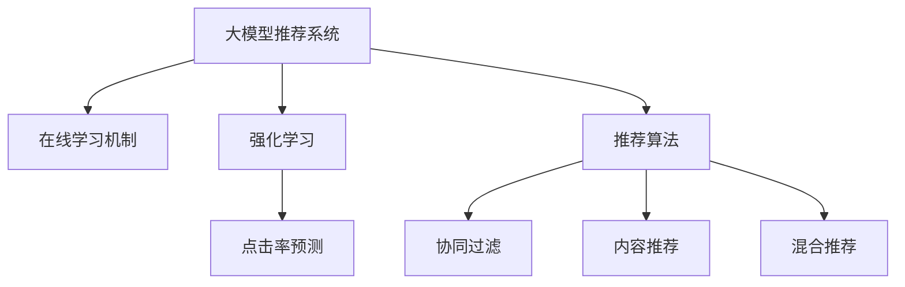

                 

# 大模型推荐系统的在线学习机制

> 关键词：大模型推荐系统,在线学习机制,强化学习,深度学习,点击率预测,推荐算法

## 1. 背景介绍

在数字时代，推荐系统已经成为支撑个性化服务的关键技术。从电商网站的产品推荐，到内容平台的个性化内容推送，再到社交网络的兴趣图谱分析，推荐系统在各行各业的应用几乎无处不在。然而，推荐系统不仅要处理海量的用户行为数据，还需要实时响应多变的用户需求，保持持续的推荐能力更新。传统基于静态模型的推荐方法，如协同过滤、基于内容的推荐等，在面对快速变化的市场和用户行为时，往往难以满足需求。

近年来，深度学习技术在推荐系统中得到了广泛应用。特别是以深度神经网络为代表的模型，通过端到端训练的方式，能够直接从原始数据中挖掘用户行为和物品属性的深层次关联，从而生成更加精准的推荐结果。但传统深度学习模型在离线训练和在线预测中分离的架构，难以适应实时变化的市场和用户行为。而在线学习机制，通过将模型训练与实时预测紧密结合，实现模型参数的动态更新，为推荐系统的实时优化提供了新的解决思路。

本文将深入探讨大模型推荐系统的在线学习机制，从原理到实践，详细讲解其核心算法和具体操作步骤，并给出数学模型的详细推导和应用示例，最后通过项目实践展示在线学习机制的实际效果。

## 2. 核心概念与联系

为了更好地理解在线学习机制在推荐系统中的应用，本节将介绍几个关键概念及其内在联系。

### 2.1 核心概念概述

- **大模型推荐系统**：指基于深度学习的大规模推荐模型，通过端到端的训练过程，直接从用户行为和物品属性中学习推荐逻辑。常见的大模型推荐系统包括基于深度神经网络的结构化推荐系统、基于Transformer的推荐系统等。

- **在线学习机制**：指模型在实际使用过程中，通过实时更新的方式，根据新数据不断优化模型参数，以提升推荐精度和实时响应能力。在线学习机制可以基于强化学习、在线梯度下降等方法实现。

- **强化学习**：指通过与环境交互，智能体学习最优行为策略，以最大化长期收益的一种学习方式。强化学习算法通过动态更新模型参数，实现模型性能的持续改进。

- **点击率预测**：指对用户可能产生点击行为的预测，是推荐系统中最重要的目标任务之一。点击率预测模型的目标是最大化点击率，即预测准确率。

- **推荐算法**：指实现个性化推荐的具体方法，如协同过滤、内容推荐、混合推荐等。在线学习机制可以应用于不同的推荐算法中，提升其实时推荐能力。

- **推荐系统**：指通过分析和处理用户行为数据，为特定用户推荐物品的系统，目标是提升用户体验和业务价值。

这些概念之间的联系可以通过以下Mermaid流程图来展示：



这个流程图展示了大模型推荐系统、在线学习机制、强化学习、点击率预测、推荐算法之间的内在联系。大模型推荐系统通过在线学习机制实现模型参数的动态更新，基于强化学习提升点击率预测的精度，最终通过推荐算法实现个性化推荐。

## 3. 核心算法原理 & 具体操作步骤
### 3.1 算法原理概述

在线学习机制的核心思想是，将推荐系统的训练过程与实时预测过程紧密结合，通过实时更新模型参数，实现模型的动态优化。在线学习机制一般基于强化学习和在线梯度下降等方法，通过不断处理新数据，调整模型参数，优化推荐结果。

### 3.2 算法步骤详解

以下将详细介绍在线学习机制的具体操作步骤：

**Step 1: 准备数据集**

在线学习机制需要基于实时数据流进行训练。首先需要准备好推荐系统的数据集，包含用户行为数据、物品属性数据等。这些数据应该包括用户的点击行为、浏览行为、评分行为等，以便训练模型预测点击率。

**Step 2: 设计损失函数**

在线学习机制需要设计合适的损失函数，用于衡量模型预测结果与真实标签之间的差异。常见的损失函数包括交叉熵损失、均方误差损失等。点击率预测的任务是最大化点击率，因此一般使用交叉熵损失函数。

**Step 3: 选择优化算法**

在线学习机制需要选择合适的优化算法，用于更新模型参数。常用的优化算法包括Adam、Adagrad、RMSprop等。在线学习机制需要保证优化算法的收敛速度和稳定性，同时确保模型参数更新对实时预测的干扰最小。

**Step 4: 实现模型训练**

在线学习机制需要实现模型训练过程，将实时数据流输入模型，计算预测结果和损失函数，通过优化算法更新模型参数。可以使用深度学习框架（如TensorFlow、PyTorch等）来实现模型训练过程。

**Step 5: 更新推荐模型**

在线学习机制需要根据实时数据流，不断更新推荐模型。可以使用在线梯度下降算法，在每次接收到新数据时，计算梯度并更新模型参数。确保模型参数更新与推荐结果实时同步。

**Step 6: 反馈控制机制**

在线学习机制需要引入反馈控制机制，根据推荐结果的实时反馈，调整模型参数更新策略。可以使用A/B测试等方法，评估不同模型参数更新策略的效果，选择最优方案。

### 3.3 算法优缺点

在线学习机制具有以下优点：

1. **实时更新**：在线学习机制能够实时响应市场和用户行为的变化，快速调整推荐结果，提高推荐精度。
2. **动态优化**：在线学习机制通过不断更新模型参数，保持模型的性能持续改进，避免模型过时。
3. **低存储需求**：在线学习机制不需要保存完整的训练数据集，存储需求相对较小。

同时，在线学习机制也存在一些局限性：

1. **计算开销大**：在线学习机制需要实时计算模型参数的梯度，计算开销较大，可能影响实时推荐的效率。
2. **噪声干扰**：在线学习机制受到实时数据流的干扰较大，噪声数据可能影响模型的收敛和性能。
3. **模型泛化能力不足**：在线学习机制通常基于小样本训练，可能对新用户和新物品的推荐效果不足。

尽管存在这些局限性，但在线学习机制在推荐系统中具有重要的应用价值，能够显著提升推荐系统的实时性能和推荐精度。

### 3.4 算法应用领域

在线学习机制在推荐系统中有着广泛的应用。以下列举几个典型应用场景：

- **电商推荐系统**：电商平台的推荐系统需要实时处理用户点击行为，根据用户的浏览记录和购买历史，推荐相关商品。在线学习机制可以实时更新推荐模型，提升推荐效果。
- **内容推荐系统**：视频、音乐、新闻等平台的推荐系统需要根据用户的历史行为和实时兴趣，推荐相关内容。在线学习机制可以实时调整推荐策略，提高用户满意度。
- **社交网络推荐系统**：社交网络平台的推荐系统需要根据用户的互动行为，推荐相关朋友和内容。在线学习机制可以实时更新推荐模型，增强用户的粘性。
- **广告推荐系统**：广告推荐系统需要根据用户的兴趣和行为，实时推荐相关广告。在线学习机制可以实时调整广告投放策略，提升广告点击率。
- **智能家居推荐系统**：智能家居设备需要根据用户的行为和习惯，推荐相关服务。在线学习机制可以实时调整推荐策略，提升用户体验。

## 4. 数学模型和公式 & 详细讲解 & 举例说明

### 4.1 数学模型构建

在线学习机制的数学模型一般基于强化学习框架构建。假设推荐系统有$K$个用户，$M$个物品，模型的目标是最大化期望点击率。模型的状态表示为$(s_t)$，动作表示为$(a_t)$，奖励表示为$(r_t)$。点击率预测模型的参数为$\theta$。模型的状态转移概率和奖励函数可以表示为：

$$
s_{t+1} = f(s_t, a_t, \epsilon)
$$

$$
r_t = R(s_t, a_t)
$$

其中，$f$表示状态转移函数，$\epsilon$表示噪声，$R$表示奖励函数。在线学习机制的目标是最小化期望的累计奖励：

$$
J(\theta) = \mathbb{E}[\sum_{t=0}^{\infty} \gamma^t r_t]
$$

其中，$\gamma$表示折扣因子。在线学习机制的优化目标是最小化$J(\theta)$，即：

$$
\theta^* = \mathop{\arg\min}_{\theta} J(\theta)
$$

### 4.2 公式推导过程

点击率预测模型的参数更新过程可以表示为：

$$
\theta_{t+1} = \theta_t + \alpha_t \nabla_{\theta} \ell(\theta_t, s_t, a_t, r_t)
$$

其中，$\alpha_t$表示学习率，$\ell(\theta, s_t, a_t, r_t)$表示损失函数，$\nabla_{\theta} \ell(\theta_t, s_t, a_t, r_t)$表示损失函数对模型参数$\theta$的梯度。在实际应用中，通常使用交叉熵损失函数：

$$
\ell(\theta, s_t, a_t, r_t) = -r_t \log \sigma(\theta^\top a_t) - (1-r_t) \log (1-\sigma(\theta^\top a_t))
$$

其中，$\sigma$表示sigmoid函数，$\theta^\top a_t$表示模型对物品的预测向量与用户特征的线性组合。在线学习机制可以通过强化学习算法（如Q-learning、SARSA等）实现参数更新，具体公式为：

$$
Q(s_t, a_t) = Q(s_t, a_t) + \alpha_t (r_t + \gamma \max_{a_{t+1}} Q(s_{t+1}, a_{t+1}) - Q(s_t, a_t))
$$

其中，$Q(s_t, a_t)$表示状态-动作值函数，$\alpha_t$表示学习率。在线学习机制的参数更新公式为：

$$
\theta_{t+1} = \theta_t + \alpha_t \nabla_{\theta} \ell(\theta_t, s_t, a_t, r_t)
$$

通过不断更新模型参数，在线学习机制可以实现实时推荐的动态优化。

### 4.3 案例分析与讲解

以电商推荐系统为例，展示在线学习机制的具体应用。电商推荐系统的目标是推荐用户可能感兴趣的商品，点击率预测模型的输入包括用户的历史行为数据和物品属性数据。模型的状态表示为用户的历史行为，动作表示为推荐的物品，奖励表示为用户的点击行为。

在电商推荐系统中，在线学习机制可以通过以下步骤实现实时推荐：

1. 收集用户的历史点击、浏览、购买等行为数据，将其作为输入数据。
2. 使用交叉熵损失函数，计算模型预测结果与真实点击标签之间的差异。
3. 使用在线梯度下降算法，根据实时点击数据更新模型参数。
4. 使用推荐模型，根据用户的实时行为数据，推荐相关商品。
5. 收集用户的点击反馈数据，更新模型参数。

通过在线学习机制，电商推荐系统可以实现实时推荐，提高推荐精度和用户体验。

## 5. 项目实践：代码实例和详细解释说明

### 5.1 开发环境搭建

在进行在线学习机制的实践之前，需要准备好开发环境。以下是使用Python进行TensorFlow开发的环境配置流程：

1. 安装Anaconda：从官网下载并安装Anaconda，用于创建独立的Python环境。

2. 创建并激活虚拟环境：
```bash
conda create -n tf-env python=3.8 
conda activate tf-env
```

3. 安装TensorFlow：根据CUDA版本，从官网获取对应的安装命令。例如：
```bash
pip install tensorflow==2.7.0
```

4. 安装TensorBoard：用于实时监测模型训练状态，生成图表。

5. 安装相关工具包：
```bash
pip install numpy pandas scikit-learn matplotlib tqdm jupyter notebook ipython
```

完成上述步骤后，即可在`tf-env`环境中开始在线学习机制的实践。

### 5.2 源代码详细实现

这里我们以在线学习机制在电商推荐系统中的应用为例，给出使用TensorFlow实现推荐模型的代码实现。

首先，定义推荐模型的输入和输出：

```python
import tensorflow as tf
from tensorflow.keras.layers import Input, Dense, Embedding, Concatenate

input_user = Input(shape=(num_users, ), name='user')
input_item = Input(shape=(num_items, ), name='item')

# 定义物品特征嵌入层
item_embedding = Embedding(num_items, emb_dim, input_length=num_items)(input_item)

# 定义用户特征嵌入层
user_embedding = Embedding(num_users, emb_dim, input_length=num_users)(input_user)

# 定义模型层
concat = Concatenate()([user_embedding, item_embedding])
x = Dense(256, activation='relu')(concat)
x = Dense(1, activation='sigmoid')(x)

# 定义模型输出
model = tf.keras.Model(inputs=[input_user, input_item], outputs=x)
```

然后，定义在线学习机制的训练过程：

```python
from tensorflow.keras.optimizers import Adam

# 定义损失函数
loss_fn = tf.keras.losses.BinaryCrossentropy(from_logits=True)

# 定义优化器
opt = Adam(lr=learning_rate)

# 定义训练过程
@tf.function
def train_step(inputs):
    with tf.GradientTape() as tape:
        y_pred = model(inputs)
        loss = loss_fn(y_true=y_true, y_pred=y_pred)
    grads = tape.gradient(loss, model.trainable_variables)
    opt.apply_gradients(zip(grads, model.trainable_variables))
    return loss

# 定义推荐模型
@tf.function
def predict(inputs):
    return model(inputs)
```

最后，启动在线学习机制的训练流程：

```python
# 定义训练参数
num_epochs = 100
num_batches = 10000

# 定义训练循环
for epoch in range(num_epochs):
    for batch in range(num_batches):
        inputs, y_true = get_data(batch_size)
        loss = train_step(inputs)
        print('Epoch:', epoch, 'Batch:', batch, 'Loss:', loss.numpy())
        
    # 在验证集上评估模型
    val_loss = train_step(val_data)
    print('Val Loss:', val_loss.numpy())
    
# 在测试集上测试模型
test_loss = train_step(test_data)
print('Test Loss:', test_loss.numpy())
```

以上就是使用TensorFlow实现在线学习机制的电商推荐系统的完整代码实现。可以看到，TensorFlow通过TensorFlow函数的特性，实现了高效的在线学习机制。

### 5.3 代码解读与分析

让我们再详细解读一下关键代码的实现细节：

**用户特征和物品特征的嵌入层**：
- `input_user`和`input_item`表示用户和物品的输入，分别使用`Input`层定义。
- `Embedding`层将用户和物品的特征向量化，生成高维稀疏向量。

**模型层**：
- `Concatenate`层将用户和物品的嵌入向量连接起来，形成高维稠密向量。
- `Dense`层将高维稠密向量映射到低维空间，并使用`relu`激活函数。
- `Dense`层将低维空间映射到二分类概率空间，并使用`sigmoid`激活函数。

**在线学习机制的训练过程**：
- `train_step`函数定义了模型训练的每一步，使用了`tf.GradientTape`计算梯度，并使用`Adam`优化器更新模型参数。
- `predict`函数定义了模型的预测过程，使用了`tf.function`加速模型前向传播。

**训练循环**：
- `for`循环实现模型的训练过程，使用`get_data`函数获取批量数据，并在每一步更新模型参数。
- `val_data`和`test_data`表示验证集和测试集，用于评估模型性能。

可以看到，通过TensorFlow的TensorFlow函数特性，在线学习机制的训练过程可以高效地实现。TensorFlow函数可以并行计算，避免了大量的循环操作，提高了模型的训练效率。

## 6. 实际应用场景

### 6.1 电商推荐系统

在线学习机制在电商推荐系统中的应用非常广泛。电商平台需要实时处理用户行为数据，并根据用户的兴趣和历史行为，推荐相关商品。在线学习机制可以实现实时的推荐更新，提升推荐精度和用户体验。

在电商推荐系统中，在线学习机制可以通过以下步骤实现实时推荐：

1. 收集用户的历史点击、浏览、购买等行为数据，将其作为输入数据。
2. 使用交叉熵损失函数，计算模型预测结果与真实点击标签之间的差异。
3. 使用在线梯度下降算法，根据实时点击数据更新模型参数。
4. 使用推荐模型，根据用户的实时行为数据，推荐相关商品。
5. 收集用户的点击反馈数据，更新模型参数。

通过在线学习机制，电商推荐系统可以实现实时推荐，提高推荐精度和用户体验。

### 6.2 内容推荐系统

内容推荐系统需要根据用户的历史行为和实时兴趣，推荐相关内容。在线学习机制可以实现实时的推荐更新，提升推荐精度和用户满意度。

在内容推荐系统中，在线学习机制可以通过以下步骤实现实时推荐：

1. 收集用户的历史点击、浏览、评分等行为数据，将其作为输入数据。
2. 使用交叉熵损失函数，计算模型预测结果与真实点击标签之间的差异。
3. 使用在线梯度下降算法，根据实时点击数据更新模型参数。
4. 使用推荐模型，根据用户的实时行为数据，推荐相关内容。
5. 收集用户的点击反馈数据，更新模型参数。

通过在线学习机制，内容推荐系统可以实现实时推荐，提高推荐精度和用户满意度。

### 6.3 社交网络推荐系统

社交网络推荐系统需要根据用户的互动行为，推荐相关朋友和内容。在线学习机制可以实现实时的推荐更新，增强用户的粘性和活跃度。

在社交网络推荐系统中，在线学习机制可以通过以下步骤实现实时推荐：

1. 收集用户的历史互动数据，将其作为输入数据。
2. 使用交叉熵损失函数，计算模型预测结果与真实点击标签之间的差异。
3. 使用在线梯度下降算法，根据实时互动数据更新模型参数。
4. 使用推荐模型，根据用户的实时互动数据，推荐相关朋友和内容。
5. 收集用户的互动反馈数据，更新模型参数。

通过在线学习机制，社交网络推荐系统可以实现实时推荐，增强用户的粘性和活跃度。

## 7. 工具和资源推荐

### 7.1 学习资源推荐

为了帮助开发者系统掌握在线学习机制的理论基础和实践技巧，这里推荐一些优质的学习资源：

1. 《深度学习》系列博文：由大模型技术专家撰写，深入浅出地介绍了深度学习的基础知识和前沿技术，包括在线学习机制的原理和实现。

2. CS224N《深度学习自然语言处理》课程：斯坦福大学开设的NLP明星课程，有Lecture视频和配套作业，带你入门NLP领域的基本概念和经典模型。

3. 《Deep Learning with Python》书籍：Google开源的深度学习教材，涵盖了深度学习的基础知识和实际应用，包括在线学习机制的应用场景和实现方法。

4. TensorFlow官方文档：TensorFlow的官方文档，提供了详细的在线学习机制的实现示例和应用场景，是实践在线学习机制的重要参考。

5. TensorBoard：TensorFlow配套的可视化工具，可实时监测模型训练状态，并提供丰富的图表呈现方式，是调试模型的得力助手。

通过对这些资源的学习实践，相信你一定能够快速掌握在线学习机制的精髓，并用于解决实际的推荐问题。

### 7.2 开发工具推荐

高效的开发离不开优秀的工具支持。以下是几款用于在线学习机制开发的常用工具：

1. TensorFlow：基于Python的开源深度学习框架，灵活动态的计算图，适合快速迭代研究。TensorFlow提供了丰富的在线学习机制的实现接口，方便开发者进行模型训练和预测。

2. PyTorch：基于Python的开源深度学习框架，灵活的动态计算图，适合学术研究和工业应用。PyTorch也提供了在线学习机制的实现接口，支持模型的高效训练和推理。

3. TensorFlow Serving：TensorFlow的模型部署和预测服务，支持在线学习机制的实时预测，适合工业级应用场景。

4. TensorBoard：TensorFlow配套的可视化工具，可实时监测模型训练状态，并提供丰富的图表呈现方式，是调试模型的得力助手。

5. Google Cloud AI Platform：Google提供的云AI平台，支持在线学习机制的分布式训练和实时预测，适合大规模工业应用。

合理利用这些工具，可以显著提升在线学习机制的开发效率，加快创新迭代的步伐。

### 7.3 相关论文推荐

在线学习机制在推荐系统中得到了广泛的研究和应用。以下是几篇奠基性的相关论文，推荐阅读：

1. Online Learning for Recommender Systems：文章介绍了在线学习机制在推荐系统中的应用，并提出了基于在线梯度下降的推荐模型。

2. A Survey on Online Learning in Recommender Systems：文章系统总结了在线学习机制在推荐系统中的应用，包括在线梯度下降、在线反向传播等方法。

3. Online Adaptive Collaborative Filtering for Recommender Systems：文章提出了基于在线学习机制的协同过滤推荐模型，并应用了在线梯度下降和在线反向传播算法。

4. Online Learning for Matrix Factorization-Based Recommender Systems：文章探讨了在线学习机制在矩阵分解推荐模型中的应用，提出了基于在线梯度下降的矩阵分解算法。

5. Online Learning with Adaptive Loss for Recommender Systems：文章提出了基于在线学习机制的推荐模型，并应用了自适应损失函数，提升了推荐模型的性能。

这些论文代表了大模型推荐系统在线学习机制的发展脉络。通过学习这些前沿成果，可以帮助研究者把握学科前进方向，激发更多的创新灵感。

## 8. 总结：未来发展趋势与挑战

### 8.1 总结

本文对在线学习机制在推荐系统中的应用进行了全面系统的介绍。首先阐述了在线学习机制在推荐系统中的重要性和应用价值，明确了在线学习机制在实时优化推荐模型、提高推荐精度方面的独特优势。其次，从原理到实践，详细讲解了在线学习机制的核心算法和具体操作步骤，给出了数学模型的详细推导和应用示例，最后通过项目实践展示在线学习机制的实际效果。

通过本文的系统梳理，可以看到，在线学习机制在推荐系统中具有重要的应用价值，能够显著提升推荐系统的实时性能和推荐精度。未来，伴随深度学习技术的不断发展，在线学习机制必将在推荐系统中发挥更加重要的作用，为推荐系统的实时优化提供新的解决思路。

### 8.2 未来发展趋势

展望未来，在线学习机制在推荐系统中将呈现以下几个发展趋势：

1. **实时性提升**：随着计算资源的不断提升，在线学习机制的实时性将进一步提升，能够实时处理大规模数据流，满足实时推荐的需求。

2. **多模态融合**：在线学习机制可以扩展到多模态数据融合，结合用户行为数据、物品属性数据、用户画像等多源数据，提升推荐模型的综合性能。

3. **联邦学习**：在线学习机制可以结合联邦学习技术，实现跨设备、跨系统的协同训练，提升模型的泛化能力和安全性。

4. **自适应学习**：在线学习机制可以引入自适应学习技术，根据用户行为和市场变化，动态调整模型参数，提升推荐模型的适应性。

5. **在线异常检测**：在线学习机制可以结合在线异常检测技术，及时识别和处理异常数据，提升推荐模型的鲁棒性。

6. **因果推断**：在线学习机制可以引入因果推断技术，识别推荐模型的因果关系，提升推荐模型的解释性和可信度。

以上趋势凸显了在线学习机制在推荐系统中的广阔前景。这些方向的探索发展，必将进一步提升推荐系统的实时性能和推荐精度，为推荐系统的发展带来新的动力。

### 8.3 面临的挑战

尽管在线学习机制在推荐系统中具有重要的应用价值，但在迈向更加智能化、普适化应用的过程中，它仍面临诸多挑战：

1. **计算开销大**：在线学习机制需要实时计算模型参数的梯度，计算开销较大，可能影响实时推荐的效率。

2. **噪声干扰**：在线学习机制受到实时数据流的干扰较大，噪声数据可能影响模型的收敛和性能。

3. **模型泛化能力不足**：在线学习机制通常基于小样本训练，可能对新用户和新物品的推荐效果不足。

4. **存储需求高**：在线学习机制需要保存和处理实时数据流，存储需求较高，可能面临存储资源瓶颈。

5. **模型参数更新策略复杂**：在线学习机制需要根据实时数据流，动态调整模型参数更新策略，模型设计复杂。

尽管存在这些挑战，但在线学习机制在推荐系统中具有重要的应用价值，能够显著提升推荐系统的实时性能和推荐精度。

### 8.4 研究展望

面对在线学习机制在推荐系统中面临的挑战，未来的研究需要在以下几个方面寻求新的突破：

1. **分布式训练**：引入分布式训练技术，加速在线学习机制的计算效率，提高推荐模型的实时性。

2. **多任务学习**：结合多任务学习技术，提升在线学习机制的泛化能力和推荐模型的适应性。

3. **自适应算法**：研究自适应算法，动态调整在线学习机制的模型参数更新策略，提升推荐模型的鲁棒性和性能。

4. **数据清洗和预处理**：引入数据清洗和预处理技术，减少噪声数据对在线学习机制的影响，提升模型的收敛和性能。

5. **模型压缩和优化**：引入模型压缩和优化技术，降低在线学习机制的存储需求和计算开销，提高推荐模型的效率和性能。

6. **因果推断和可解释性**：引入因果推断和可解释性技术，提升在线学习机制的解释性和可信度，帮助用户理解推荐模型的决策过程。

这些研究方向将进一步推动在线学习机制在推荐系统中的应用，提升推荐模型的实时性能和推荐精度，为推荐系统的实时优化提供新的解决思路。

## 9. 附录：常见问题与解答

**Q1：在线学习机制在推荐系统中有什么优势？**

A: 在线学习机制在推荐系统中的主要优势是实时性高，能够根据实时数据流动态更新模型参数，提升推荐精度和用户体验。相比于离线学习机制，在线学习机制能够实时响应市场和用户行为的变化，满足用户的即时需求。

**Q2：在线学习机制在推荐系统中有哪些局限性？**

A: 在线学习机制在推荐系统中面临的主要局限性包括计算开销大、噪声干扰、模型泛化能力不足、存储需求高等问题。在线学习机制需要实时计算模型参数的梯度，计算开销较大，可能影响实时推荐的效率。在线学习机制受到实时数据流的干扰较大，噪声数据可能影响模型的收敛和性能。在线学习机制通常基于小样本训练，可能对新用户和新物品的推荐效果不足。在线学习机制需要保存和处理实时数据流，存储需求较高，可能面临存储资源瓶颈。

**Q3：如何优化在线学习机制的计算效率？**

A: 优化在线学习机制的计算效率，可以采用以下方法：

1. 使用分布式计算技术，提高模型参数更新的并发度。
2. 引入模型压缩和优化技术，降低模型的存储需求和计算开销。
3. 使用自适应学习技术，根据用户行为和市场变化，动态调整模型参数更新策略。
4. 引入多任务学习技术，提升模型的泛化能力和适应性。
5. 使用在线异常检测技术，及时识别和处理异常数据，提升模型的鲁棒性。

**Q4：如何提升在线学习机制的泛化能力？**

A: 提升在线学习机制的泛化能力，可以采用以下方法：

1. 结合多任务学习技术，提升模型的泛化能力和推荐模型的适应性。
2. 引入自适应学习技术，根据用户行为和市场变化，动态调整模型参数更新策略，提升推荐模型的鲁棒性和性能。
3. 引入因果推断技术，识别推荐模型的因果关系，提升推荐模型的解释性和可信度。
4. 引入多模态融合技术，结合用户行为数据、物品属性数据、用户画像等多源数据，提升推荐模型的综合性能。

这些方法可以帮助在线学习机制提升模型的泛化能力和推荐性能，满足推荐系统的实际需求。

**Q5：在线学习机制在推荐系统中有哪些应用场景？**

A: 在线学习机制在推荐系统中有多个应用场景，包括：

1. 电商推荐系统：电商平台的推荐系统需要实时处理用户点击行为，根据用户的浏览记录和购买历史，推荐相关商品。
2. 内容推荐系统：视频、音乐、新闻等平台的推荐系统需要根据用户的历史行为和实时兴趣，推荐相关内容。
3. 社交网络推荐系统：社交网络平台的推荐系统需要根据用户的互动行为，推荐相关朋友和内容。
4. 广告推荐系统：广告推荐系统需要根据用户的兴趣和行为，实时推荐相关广告。
5. 智能家居推荐系统：智能家居设备需要根据用户的行为和习惯，推荐相关服务。

这些应用场景展示了在线学习机制在推荐系统中的广泛应用，体现了其重要的价值和潜力。

---

作者：禅与计算机程序设计艺术 / Zen and the Art of Computer Programming

