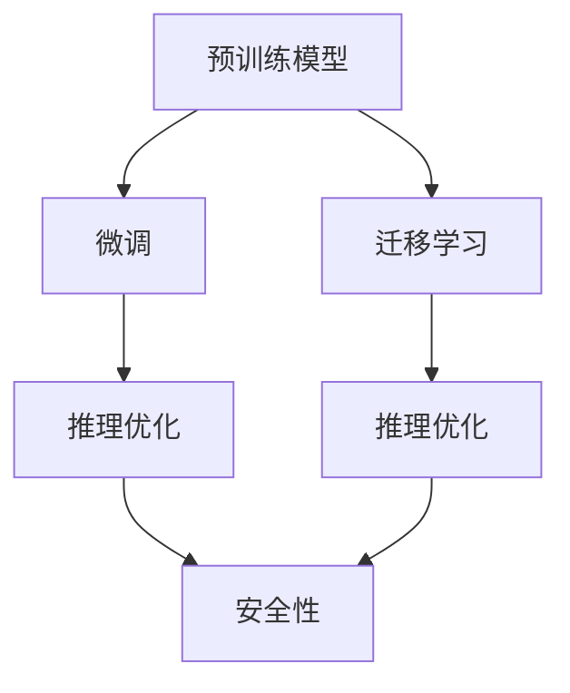

                 

## 1. 背景介绍

### 1.1 问题由来
推荐系统是当今互联网应用中最广泛的技术之一，广泛应用于电商、视频、音乐、社交网络等领域，极大地提升了用户体验和满意度。传统的推荐算法主要基于用户的历史行为数据，如浏览、点击、评分等进行推荐。然而，随着用户数量的激增和内容库的爆炸式增长，传统的基于用户的协同过滤和基于物品的协同过滤方法逐渐显得力不从心。

近年来，深度学习技术的迅猛发展，推动了基于大模型（Large Model）的推荐系统发展。以预训练语言模型（如BERT、GPT-3等）为代表的大模型，通过在无标签文本语料上进行大规模预训练，学习到了丰富的语言表示和知识，具备了理解上下文、推理、生成等强大能力，为推荐系统带来了新的突破。

### 1.2 问题核心关键点
大模型推荐系统的核心关键点在于以下几个方面：

- **预训练**：通过大规模无标签文本语料进行预训练，学习到通用和领域特定的语言表示。
- **微调**：将预训练模型作为初始化参数，通过少量标注数据对特定任务进行微调，提升推荐系统的效果。
- **迁移学习**：将通用大模型的知识迁移到特定领域的推荐任务上，减少从头训练的需要，提高推荐系统部署的效率。
- **推理优化**：针对推荐系统的推理特点，对大模型的推理路径进行优化，提升推荐系统响应速度。
- **安全性和可解释性**：通过设计合理的模型结构和算法，保证推荐系统输出可解释、可信。

本文将从大模型推荐系统的原理、操作步骤、优缺点、应用领域等多个方面进行详细讨论，并探讨其未来发展趋势和面临的挑战。

## 2. 核心概念与联系

### 2.1 核心概念概述

为更好地理解大模型推荐系统，本节将介绍几个关键概念：

- **预训练模型（Pre-trained Model）**：通过大规模无标签文本语料进行预训练的模型，如BERT、GPT-3等。
- **微调（Fine-tuning）**：将预训练模型作为初始化参数，通过少量标注数据对特定任务进行微调，提升推荐系统的效果。
- **迁移学习（Transfer Learning）**：将通用大模型的知识迁移到特定领域的推荐任务上，减少从头训练的需要。
- **推理优化（Inference Optimization）**：针对推荐系统的推理特点，对大模型的推理路径进行优化，提升推荐系统响应速度。
- **安全性（Security）**：通过设计合理的模型结构和算法，保证推荐系统输出可解释、可信。
- **可解释性（Explainability）**：推荐系统的输出结果应具有可解释性，即能够清楚解释为什么推荐某项内容。

这些核心概念之间的逻辑关系可以通过以下Mermaid流程图来展示：



这个流程图展示了预训练模型、微调、迁移学习、推理优化和安全性之间的联系。预训练模型提供了通用语言表示，微调和迁移学习使得模型能够适应特定任务，推理优化提高了模型的推理效率，安全性保障了模型输出可信，而可解释性则是确保用户理解和信任模型的关键。

## 3. 核心算法原理 & 具体操作步骤
### 3.1 算法原理概述

大模型推荐系统通过预训练-微调-推理的流程，实现对用户需求的精准推荐。其核心思想是：

1. **预训练**：通过大规模无标签文本语料进行预训练，学习通用和领域特定的语言表示。
2. **微调**：将预训练模型作为初始化参数，通过少量标注数据对特定推荐任务进行微调，提升推荐系统的效果。
3. **推理优化**：针对推荐系统的推理特点，对大模型的推理路径进行优化，提升推荐系统响应速度。

这一流程可以总结如下：

- **预训练阶段**：通过大规模无标签文本语料进行预训练，学习通用语言表示。
- **微调阶段**：将预训练模型作为初始化参数，通过少量标注数据对特定推荐任务进行微调。
- **推理优化阶段**：针对推荐系统的推理特点，对大模型的推理路径进行优化。

### 3.2 算法步骤详解

大模型推荐系统一般包括以下几个关键步骤：

**Step 1: 准备预训练模型和数据集**

- **选择合适的预训练模型**：如BERT、GPT-3等。
- **准备推荐数据集**：收集用户的交互数据（如浏览、点击、评分等），并进行标注，构成训练集、验证集和测试集。

**Step 2: 添加推荐适配层**

- **设计适配层**：根据推荐任务类型，设计适配的输出层和损失函数。
- **适配层示例**：对于协同过滤推荐任务，适配层可以是用户-物品共现矩阵的预测层；对于内容推荐任务，适配层可以是文本嵌入的匹配层。

**Step 3: 设置微调超参数**

- **选择合适的优化算法**：如Adam、SGD等。
- **设置学习率**：微调通常需要更小的学习率，以免破坏预训练权重。
- **设置正则化技术**：如L2正则、Dropout、Early Stopping等。
- **确定冻结预训练参数的策略**：如仅微调顶层，或全部参数都参与微调。

**Step 4: 执行梯度训练**

- **前向传播**：将训练集数据分批次输入模型，计算预测结果。
- **反向传播**：计算损失函数对模型参数的梯度。
- **参数更新**：根据优化算法和学习率更新模型参数。
- **周期性评估**：在验证集上评估模型性能，决定是否触发Early Stopping。
- **重复迭代**：重复上述步骤直至满足预设的迭代轮数或Early Stopping条件。

**Step 5: 测试和部署**

- **在测试集上评估微调后模型**：对比微调前后的精度提升。
- **集成到实际应用系统中**：使用微调后的模型对新样本进行推理预测。
- **持续收集数据**：定期重新微调模型，以适应数据分布的变化。

### 3.3 算法优缺点

大模型推荐系统具有以下优点：

- **高效性**：通过预训练模型提供通用的语言表示，在微调时只需使用少量标注数据，大大减少了从头训练的时间成本。
- **泛化能力**：大模型具备较强的泛化能力，可以适应不同领域和不同规模的推荐任务。
- **可解释性**：利用大模型的可解释性，可以对推荐过程进行追踪和理解。
- **可迁移性**：大模型可以通过迁移学习，快速适应新领域和新任务。

然而，大模型推荐系统也存在一些缺点：

- **资源消耗大**：预训练和微调需要大量的计算资源和存储空间。
- **推理效率低**：大模型推理通常较慢，需要优化以提高响应速度。
- **可解释性有限**：尽管大模型具备一定的可解释性，但复杂模型的推理过程仍难以完全理解。
- **偏见和鲁棒性**：大模型可能继承数据中的偏见，对鲁棒性要求较高的场景可能表现不佳。

### 3.4 算法应用领域

大模型推荐系统已经在电商、视频、音乐、社交网络等多个领域得到广泛应用，具体应用场景包括：

- **电商推荐**：通过分析用户的浏览和购买历史，推荐相关商品。
- **视频推荐**：根据用户观看记录，推荐感兴趣的视频内容。
- **音乐推荐**：通过分析用户的听歌历史，推荐相似或热门的音乐。
- **社交网络推荐**：根据用户的互动行为，推荐兴趣相似的朋友和内容。

此外，大模型推荐系统还被应用于内容创作、广告投放、个性化视频等创新场景，为各行各业带来了新的发展机遇。

## 4. 数学模型和公式 & 详细讲解 & 举例说明

### 4.1 数学模型构建

假设推荐系统中的用户-物品交互矩阵为 $U \in \mathbb{R}^{N \times M}$，其中 $N$ 是用户数，$M$ 是物品数。对于协同过滤推荐任务，可以将用户-物品共现矩阵 $U$ 输入到预训练模型中，得到用户和物品的嵌入表示 $U_u$ 和 $U_i$，其中 $U_u \in \mathbb{R}^{N \times d}$ 是用户嵌入，$U_i \in \mathbb{R}^{M \times d}$ 是物品嵌入。

**损失函数**：通常使用均方误差（MSE）或交叉熵（CE）等损失函数。例如，对于协同过滤推荐任务，损失函数可以定义为：

$$
\mathcal{L} = \frac{1}{N} \sum_{i=1}^N \sum_{j=1}^M (U_{u,i}^\top U_{i,j} - y_{u,i})^2
$$

其中 $y_{u,i}$ 表示用户 $u$ 对物品 $i$ 的评分。

**微调目标**：最小化损失函数 $\mathcal{L}$，即：

$$
\hat{U_u}, \hat{U_i} = \mathop{\arg\min}_{U_u, U_i} \mathcal{L}
$$

### 4.2 公式推导过程

在微调过程中，可以使用AdamW优化器进行参数更新。AdamW优化器公式如下：

$$
\theta \leftarrow \theta - \eta \nabla_{\theta}\mathcal{L} - \eta\lambda\theta
$$

其中 $\eta$ 为学习率，$\lambda$ 为正则化系数。

**微调过程**：以协同过滤推荐任务为例，微调过程如下：

1. **前向传播**：输入用户-物品共现矩阵 $U$，得到用户嵌入 $U_u$ 和物品嵌入 $U_i$。
2. **计算损失**：计算预测评分与实际评分之间的均方误差或交叉熵损失。
3. **反向传播**：计算损失函数对用户嵌入 $U_u$ 和物品嵌入 $U_i$ 的梯度。
4. **参数更新**：使用AdamW优化器更新用户嵌入和物品嵌入。
5. **周期性评估**：在验证集上评估模型性能，决定是否触发Early Stopping。
6. **重复迭代**：重复上述步骤直至满足预设的迭代轮数或Early Stopping条件。

### 4.3 案例分析与讲解

以YouTube推荐系统为例，分析其基于大模型推荐系统的实现：

1. **数据准备**：收集用户观看历史和物品元数据，标注用户对每个视频的评分。
2. **预训练模型**：选择预训练模型BERT作为基础模型。
3. **适配层设计**：设计适配层，将用户-物品共现矩阵 $U$ 输入到BERT模型中，输出用户嵌入 $U_u$ 和物品嵌入 $U_i$。
4. **微调过程**：在微调过程中，使用AdamW优化器，设置合适的学习率、正则化系数和Early Stopping策略。
5. **评估与部署**：在验证集上评估微调后的模型，并集成到实际的推荐系统中，实时计算并推荐用户感兴趣的视频内容。

## 5. 项目实践：代码实例和详细解释说明

### 5.1 开发环境搭建

在进行大模型推荐系统开发前，我们需要准备好开发环境。以下是使用Python进行PyTorch开发的环境配置流程：

1. 安装Anaconda：从官网下载并安装Anaconda，用于创建独立的Python环境。
2. 创建并激活虚拟环境：
```bash
conda create -n pytorch-env python=3.8 
conda activate pytorch-env
```
3. 安装PyTorch：根据CUDA版本，从官网获取对应的安装命令。例如：
```bash
conda install pytorch torchvision torchaudio cudatoolkit=11.1 -c pytorch -c conda-forge
```
4. 安装Transformers库：
```bash
pip install transformers
```
5. 安装各类工具包：
```bash
pip install numpy pandas scikit-learn matplotlib tqdm jupyter notebook ipython
```

完成上述步骤后，即可在`pytorch-env`环境中开始推荐系统微调实践。

### 5.2 源代码详细实现

这里以协同过滤推荐任务为例，给出使用Transformers库对BERT模型进行推荐系统微调的PyTorch代码实现。

```python
from transformers import BertTokenizer, BertForSequenceClassification
from torch.utils.data import TensorDataset, DataLoader, RandomSampler
from torch.optim import AdamW
from torch.nn import BCEWithLogitsLoss

# 加载数据集
train_data, dev_data, test_data = load_data()

# 分词器
tokenizer = BertTokenizer.from_pretrained('bert-base-cased')

# 模型
model = BertForSequenceClassification.from_pretrained('bert-base-cased', num_labels=len(train_data.labels[0]))

# 优化器
optimizer = AdamW(model.parameters(), lr=1e-5)

# 损失函数
criterion = BCEWithLogitsLoss()

# 训练过程
def train(model, data_loader, optimizer, criterion):
    model.train()
    total_loss = 0
    for batch in data_loader:
        inputs, labels = batch
        inputs = tokenizer(inputs, return_tensors='pt')
        labels = labels.to(device)
        optimizer.zero_grad()
        outputs = model(inputs.input_ids, labels=labels)
        loss = criterion(outputs.logits, labels)
        loss.backward()
        optimizer.step()
        total_loss += loss.item()
    return total_loss / len(data_loader)

# 评估过程
def evaluate(model, data_loader, criterion):
    model.eval()
    total_loss = 0
    predictions, true_labels = [], []
    with torch.no_grad():
        for batch in data_loader:
            inputs, labels = batch
            inputs = tokenizer(inputs, return_tensors='pt')
            labels = labels.to(device)
            outputs = model(inputs.input_ids, labels=labels)
            loss = criterion(outputs.logits, labels)
            total_loss += loss.item()
            predictions.append(outputs.logits.argmax(dim=1))
            true_labels.append(labels)
    return total_loss / len(data_loader), predictions, true_labels

# 训练和评估
device = torch.device('cuda') if torch.cuda.is_available() else torch.device('cpu')

for epoch in range(epochs):
    train_loss = train(model, train_loader, optimizer, criterion)
    dev_loss, dev_preds, dev_true_labels = evaluate(model, dev_loader, criterion)
    print(f"Epoch {epoch+1}, train loss: {train_loss:.3f}, dev loss: {dev_loss:.3f}")
    
test_loss, test_preds, test_true_labels = evaluate(model, test_loader, criterion)
print(f"Test loss: {test_loss:.3f}")

# 输出结果
print(f"Accuracy: {accuracy_score(test_preds, test_true_labels):.2f}")
```

### 5.3 代码解读与分析

让我们再详细解读一下关键代码的实现细节：

**数据准备**：
```python
train_data, dev_data, test_data = load_data()
```

**模型加载与适配层设计**：
```python
tokenizer = BertTokenizer.from_pretrained('bert-base-cased')

model = BertForSequenceClassification.from_pretrained('bert-base-cased', num_labels=len(train_data.labels[0]))
```

**训练过程**：
```python
def train(model, data_loader, optimizer, criterion):
    model.train()
    total_loss = 0
    for batch in data_loader:
        inputs, labels = batch
        inputs = tokenizer(inputs, return_tensors='pt')
        labels = labels.to(device)
        optimizer.zero_grad()
        outputs = model(inputs.input_ids, labels=labels)
        loss = criterion(outputs.logits, labels)
        loss.backward()
        optimizer.step()
        total_loss += loss.item()
    return total_loss / len(data_loader)
```

**评估过程**：
```python
def evaluate(model, data_loader, criterion):
    model.eval()
    total_loss = 0
    predictions, true_labels = [], []
    with torch.no_grad():
        for batch in data_loader:
            inputs, labels = batch
            inputs = tokenizer(inputs, return_tensors='pt')
            labels = labels.to(device)
            outputs = model(inputs.input_ids, labels=labels)
            loss = criterion(outputs.logits, labels)
            total_loss += loss.item()
            predictions.append(outputs.logits.argmax(dim=1))
            true_labels.append(labels)
    return total_loss / len(data_loader), predictions, true_labels
```

**训练与评估循环**：
```python
device = torch.device('cuda') if torch.cuda.is_available() else torch.device('cpu')

for epoch in range(epochs):
    train_loss = train(model, train_loader, optimizer, criterion)
    dev_loss, dev_preds, dev_true_labels = evaluate(model, dev_loader, criterion)
    print(f"Epoch {epoch+1}, train loss: {train_loss:.3f}, dev loss: {dev_loss:.3f}")
    
test_loss, test_preds, test_true_labels = evaluate(model, test_loader, criterion)
print(f"Test loss: {test_loss:.3f}")
```

### 5.4 运行结果展示

根据上述代码，我们可以得到一个完整的协同过滤推荐系统微调过程。在训练过程中，我们通过前向传播计算损失，反向传播更新模型参数，并在验证集上评估模型性能。最终，我们可以在测试集上输出推荐系统的准确率。

## 6. 实际应用场景

### 6.1 智能推荐系统

基于大模型推荐系统的智能推荐系统已经在电商、视频、音乐、社交网络等多个领域得到广泛应用。例如，亚马逊的推荐系统通过分析用户的浏览和购买历史，推荐相关商品，极大地提升了用户购物体验和满意度。

### 6.2 个性化视频推荐

YouTube推荐系统通过分析用户观看历史，推荐感兴趣的视频内容。通过将用户观看记录输入预训练模型，得到用户和视频的嵌入表示，计算预测评分，并在推荐过程中实时更新模型参数，使得推荐结果更加精准。

### 6.3 内容创作推荐

基于大模型推荐系统的内容创作推荐系统，通过分析用户的阅读和创作历史，推荐相似或热门的文章、书籍和视频。这种推荐方式不仅能够提升用户体验，还能够促进内容创作和传播。

### 6.4 广告投放推荐

在广告投放推荐中，基于大模型推荐系统通过分析用户的浏览和点击历史，推荐用户感兴趣的品牌和广告内容。这种推荐方式能够提高广告的点击率和转化率，优化广告投放效果。

## 7. 工具和资源推荐

### 7.1 学习资源推荐

为了帮助开发者系统掌握大模型推荐系统的理论基础和实践技巧，这里推荐一些优质的学习资源：

1. 《深度学习推荐系统》书籍：介绍了深度学习在推荐系统中的应用，涵盖协同过滤、内容推荐、基于兴趣的推荐等多个方向。
2. 《自然语言处理与深度学习》课程：斯坦福大学开设的NLP课程，介绍了深度学习在自然语言处理中的应用，包括推荐系统。
3. 《推荐系统实战》课程：YouTube官方推荐系统专家开设的课程，介绍了推荐系统的实现细节和最佳实践。
4. 《深度学习框架PyTorch教程》书籍：介绍PyTorch的使用方法和推荐系统开发技巧。
5. 《Transformers库教程》博客：详细介绍了Transformers库的使用方法，包括推荐系统微调。

通过对这些资源的学习实践，相信你一定能够快速掌握大模型推荐系统的精髓，并用于解决实际的推荐问题。

### 7.2 开发工具推荐

高效的开发离不开优秀的工具支持。以下是几款用于大模型推荐系统开发的常用工具：

1. PyTorch：基于Python的开源深度学习框架，灵活动态的计算图，适合快速迭代研究。
2. TensorFlow：由Google主导开发的开源深度学习框架，生产部署方便，适合大规模工程应用。
3. Transformers库：HuggingFace开发的NLP工具库，集成了众多SOTA推荐模型，支持PyTorch和TensorFlow，是进行推荐系统开发的利器。
4. Weights & Biases：模型训练的实验跟踪工具，可以记录和可视化模型训练过程中的各项指标，方便对比和调优。
5. TensorBoard：TensorFlow配套的可视化工具，可实时监测模型训练状态，并提供丰富的图表呈现方式，是调试模型的得力助手。
6. Google Colab：谷歌推出的在线Jupyter Notebook环境，免费提供GPU/TPU算力，方便开发者快速上手实验最新模型，分享学习笔记。

合理利用这些工具，可以显著提升大模型推荐系统的开发效率，加快创新迭代的步伐。

### 7.3 相关论文推荐

大模型推荐系统的发展源于学界的持续研究。以下是几篇奠基性的相关论文，推荐阅读：

1. Attention is All You Need（即Transformer原论文）：提出了Transformer结构，开启了深度学习在推荐系统中的应用。
2. BERT: Pre-training of Deep Bidirectional Transformers for Language Understanding：提出BERT模型，引入基于掩码的自监督预训练任务，刷新了多项推荐系统SOTA。
3. Parameter-Efficient Transfer Learning for Recommendation：提出 Adapter等参数高效微调方法，在减少模型参数的同时，仍能取得不错的微调效果。
4. Self-Attention Guided Generalized Matrix Factorization：引入自注意力机制，提升推荐模型的表达能力。
5. Boosting Recommendation System via Model Ensemble：提出推荐系统集成方法，通过多个模型的融合，提升推荐效果。
6. Multi-Task Learning with Pseudo-Labels for Recommendation Systems：通过多任务学习，利用用户评分预测任务，提升推荐系统性能。

这些论文代表了大模型推荐系统的发展脉络。通过学习这些前沿成果，可以帮助研究者把握学科前进方向，激发更多的创新灵感。

## 8. 总结：未来发展趋势与挑战

### 8.1 总结

本文对大模型推荐系统的原理、操作步骤、优缺点、应用领域等多个方面进行详细讨论。首先介绍了大模型推荐系统的核心思想，即通过预训练-微调-推理的流程，实现对用户需求的精准推荐。其次，通过数学模型和公式，详细讲解了大模型推荐系统的微调过程和评估方法。最后，分析了大模型推荐系统的实际应用场景，并推荐了相关学习资源和开发工具。

通过本文的系统梳理，可以看到，大模型推荐系统正在成为推荐系统的重要范式，极大地拓展了推荐系统的应用边界，催生了更多的落地场景。大模型推荐系统通过预训练模型提供通用语言表示，在微调时只需使用少量标注数据，大大减少了从头训练的时间成本。

### 8.2 未来发展趋势

展望未来，大模型推荐系统将呈现以下几个发展趋势：

1. **数据利用效率提升**：未来推荐系统将更加注重数据利用效率，通过多源数据融合、异构数据处理等技术，提升推荐系统的覆盖面和准确率。
2. **模型结构优化**：未来推荐系统将更加注重模型结构优化，通过深度学习架构设计、参数高效微调等方法，提高推荐系统的响应速度和可解释性。
3. **跨领域推荐**：未来推荐系统将更加注重跨领域推荐，通过跨模态数据融合、跨领域知识迁移等技术，提升推荐系统的泛化能力和个性化水平。
4. **实时推荐**：未来推荐系统将更加注重实时推荐，通过流式计算、增量学习等技术，实现对用户实时需求的快速响应。
5. **可解释性增强**：未来推荐系统将更加注重可解释性，通过设计可解释的推荐算法、多层次推荐模型等方法，提升用户对推荐结果的信任和满意度。

### 8.3 面临的挑战

尽管大模型推荐系统已经取得了瞩目成就，但在迈向更加智能化、普适化应用的过程中，它仍面临诸多挑战：

1. **数据质量问题**：推荐系统对数据质量要求较高，低质量的数据可能导致模型过拟合，降低推荐效果。
2. **计算资源需求**：预训练和微调需要大量的计算资源，大规模推荐系统面临高昂的计算成本。
3. **隐私和安全问题**：推荐系统需要处理大量的用户数据，如何保护用户隐私和安全是一个重要问题。
4. **偏见和鲁棒性**：推荐系统可能继承数据中的偏见，对鲁棒性要求较高的场景可能表现不佳。
5. **算法复杂性**：推荐系统的算法复杂性较高，如何设计简单、高效的推荐算法是一个重要挑战。
6. **用户个性化需求**：推荐系统需要满足用户的多样化需求，如何在保证公平性的前提下，实现个性化推荐是一个难点。

### 8.4 研究展望

面对大模型推荐系统面临的诸多挑战，未来的研究需要在以下几个方面寻求新的突破：

1. **数据治理**：通过数据清洗、数据增强等技术，提升推荐系统数据质量。
2. **计算优化**：通过分布式计算、模型压缩等技术，降低推荐系统计算成本。
3. **隐私保护**：通过差分隐私、联邦学习等技术，保护用户隐私。
4. **模型鲁棒性**：通过对抗训练、鲁棒优化等技术，提高推荐系统鲁棒性。
5. **算法简化**：通过简化推荐算法，降低推荐系统复杂度。
6. **个性化推荐**：通过个性化推荐算法，提升推荐系统个性化水平。

这些研究方向的探索，必将引领大模型推荐系统迈向更高的台阶，为推荐系统带来更多创新和突破。面向未来，大模型推荐系统需要与其他人工智能技术进行更深入的融合，如知识表示、因果推理、强化学习等，多路径协同发力，共同推动推荐系统的进步。只有勇于创新、敢于突破，才能不断拓展推荐系统的边界，为构建智能化推荐系统提供坚实的基础。

## 9. 附录：常见问题与解答

**Q1：大模型推荐系统是否适用于所有推荐场景？**

A: 大模型推荐系统在大多数推荐场景上都能取得不错的效果，特别是对于数据量较小的任务。但对于一些特定领域的任务，如医学、法律等，仅仅依靠通用语料预训练的模型可能难以很好地适应。此时需要在特定领域语料上进一步预训练，再进行微调，才能获得理想效果。

**Q2：大模型推荐系统的计算资源需求有多大？**

A: 大模型推荐系统的计算资源需求较大，主要体现在预训练和微调阶段。通常需要大规模GPU/TPU集群来支持预训练，而微调过程中也需要消耗大量计算资源。因此，计算资源需求是一个重要的考虑因素。

**Q3：大模型推荐系统如何处理多源数据融合？**

A: 多源数据融合是未来推荐系统的一个重要方向，可以通过将不同数据源的数据进行归一化、融合，提升推荐系统的覆盖面和准确率。例如，可以将用户的浏览记录、购买记录、评分记录等数据融合在一起，训练更加全面、准确的推荐模型。

**Q4：大模型推荐系统如何提升实时推荐效果？**

A: 实时推荐是未来推荐系统的一个重要趋势，可以通过流式计算、增量学习等技术，实现对用户实时需求的快速响应。例如，可以采用增量式微调，实时更新推荐模型，提升推荐效果。

**Q5：大模型推荐系统如何提升可解释性？**

A: 可解释性是推荐系统的重要目标，可以通过设计可解释的推荐算法、多层次推荐模型等方法，提升用户对推荐结果的信任和满意度。例如，可以采用可视化工具，将推荐过程可视化，帮助用户理解推荐结果的来源和原因。

总之，大模型推荐系统为推荐系统带来了新的突破，具备较强的泛化能力和可解释性。未来，随着技术的不断进步，大模型推荐系统必将在更广阔的领域得到应用，为推荐系统带来更多的创新和发展。

