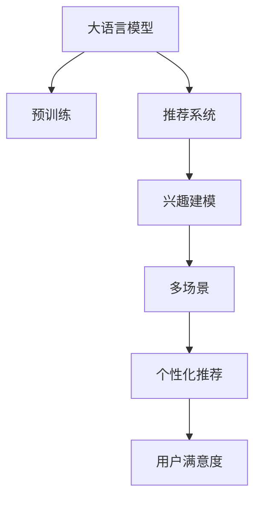

                 

# 大模型辅助的推荐系统多场景兴趣预测

## 1. 背景介绍

### 1.1 问题由来

推荐系统（Recommendation System, RS）是人工智能应用中最具代表性的技术之一，通过分析和理解用户的历史行为数据，为用户提供个性化的内容推荐。推荐系统已经广泛应用于电商、新闻、视频、社交媒体等多个领域，极大地提升了用户体验和平台粘性。

然而，推荐系统在实际应用中面临着诸多挑战，如数据冷启动、用户多样性、动态行为变化等。这些问题导致推荐系统难以做到既满足用户个性化需求，又能够覆盖多样化的用户群体。大模型技术的发展为推荐系统带来了新的解决思路，通过结合大模型的语言理解能力和强大的预训练能力，可以更好地理解用户兴趣，提供更加个性化的推荐内容。

### 1.2 问题核心关键点

大模型辅助推荐系统通过将用户兴趣表示为语言形式，并结合大模型的预训练知识，实现多场景的兴趣预测。核心问题包括：

- 如何高效获取用户兴趣的文本描述？
- 如何通过预训练模型捕捉用户多样化的兴趣特点？
- 如何将用户兴趣与产品内容进行精确匹配？
- 如何在多场景中实现统一兴趣建模和预测？

### 1.3 问题研究意义

大模型辅助推荐系统将用户兴趣建模与大模型预训练结合，可以提升推荐系统的泛化能力和个性化程度，同时降低数据标注成本，提升推荐效率。具体而言，它具有以下几方面的意义：

1. **高效泛化**：大模型预训练带来的知识复用能力，使得推荐系统可以在新的场景下快速适应，提升推荐效果。
2. **个性化推荐**：通过理解用户的多样化兴趣，结合大模型生成的语言描述，可以提供更加个性化的推荐内容，满足不同用户的多样需求。
3. **数据优化**：大模型可以通过语言生成任务，生成高质量的用户兴趣描述，减少对标注数据的需求。
4. **可解释性**：结合语言理解，推荐系统的决策过程更具有可解释性，提升用户信任度。
5. **跨场景应用**：大模型可以在不同场景中保持一致的兴趣描述，实现多场景的兴趣建模和预测。

## 2. 核心概念与联系

### 2.1 核心概念概述

为了更好地理解大模型辅助推荐系统，本节将介绍几个关键概念：

- **大语言模型(Large Language Model, LLM)**：以BERT、GPT等模型为代表的大规模预训练语言模型。通过在大规模无标签文本数据上进行预训练，学习到丰富的语言知识和常识，具备强大的语言理解和生成能力。
- **推荐系统(Recommendation System, RS)**：利用用户历史行为数据和产品属性信息，通过算法为用户推荐个性化的内容。广泛应用于电商、新闻、视频等多个领域。
- **兴趣建模（Interest Modeling）**：通过建模用户兴趣特征，实现个性化推荐。通常采用用户行为数据、文本描述等多种方式。
- **多场景（Multi-scene）**：推荐系统在多个应用场景（如电商、新闻、视频等）中，需要根据不同场景的特点进行兴趣建模和预测。

这些核心概念之间的关系可以通过以下Mermaid流程图来展示：



这个流程图展示了大模型辅助推荐系统的核心概念及其之间的关系：

1. 大模型通过预训练获得基础能力。
2. 推荐系统利用用户行为数据，通过兴趣建模实现个性化推荐。
3. 多场景下，大模型可以提供一致的兴趣描述，实现多场景的个性化推荐。
4. 最终，个性化推荐提升用户满意度，形成良性反馈循环。

## 3. 核心算法原理 & 具体操作步骤
### 3.1 算法原理概述

大模型辅助推荐系统的核心算法原理包括以下几个步骤：

1. **用户兴趣表示**：通过收集用户行为数据，生成用户兴趣的文本描述。
2. **预训练模型适配**：将用户兴趣描述作为输入，通过大模型进行预训练，获得用户兴趣的语义表示。
3. **兴趣匹配**：将用户兴趣的语义表示与产品内容进行匹配，找到最佳的推荐结果。
4. **多场景统一**：在不同场景下，保持一致的兴趣建模和预测方式。

### 3.2 算法步骤详解

#### 3.2.1 用户兴趣表示

用户兴趣可以通过行为数据、文本描述等多种方式进行表示。这里以文本描述为例，介绍用户兴趣的获取方法。

**步骤1: 收集文本数据**
- 通过爬虫或API接口，收集用户的历史行为数据，如浏览记录、购买记录、评分记录等。
- 对每个行为记录，获取相关的文本描述，如商品标题、评论等。

**步骤2: 生成用户兴趣描述**
- 对每个用户，将行为记录的文本描述进行拼接，生成一个详细的用户兴趣描述。
- 可以使用TF-IDF、word2vec等技术，对文本进行向量化处理，生成数值化的兴趣表示。

#### 3.2.2 预训练模型适配

将用户兴趣描述输入到大模型中进行预训练，获得用户兴趣的语义表示。

**步骤1: 选择预训练模型**
- 选择合适的预训练语言模型，如BERT、GPT等。

**步骤2: 进行微调**
- 将用户兴趣描述作为输入，在大模型上进行微调，获得用户兴趣的语义表示。
- 使用用户行为数据作为监督信号，优化模型的输出，使其更好地反映用户兴趣。

#### 3.2.3 兴趣匹配

将用户兴趣的语义表示与产品内容进行匹配，找到最佳的推荐结果。

**步骤1: 生成产品兴趣描述**
- 对每个产品，生成一个简洁的兴趣描述，用于匹配用户兴趣。

**步骤2: 计算兴趣匹配度**
- 使用余弦相似度、向量内积等方法，计算用户兴趣和产品兴趣的匹配度。
- 匹配度越高的产品，越可能成为推荐结果。

#### 3.2.4 多场景统一

在不同场景下，保持一致的兴趣建模和预测方式。

**步骤1: 场景分类**
- 将不同的应用场景进行分类，如电商、新闻、视频等。

**步骤2: 多场景统一**
- 在不同场景下，保持相同的兴趣建模和匹配方式，以实现一致的推荐结果。

### 3.3 算法优缺点

大模型辅助推荐系统具有以下优点：

1. **泛化能力强**：大模型预训练带来的知识复用能力，使得推荐系统可以在新的场景下快速适应。
2. **个性化推荐**：结合大模型生成的语言描述，可以提供更加个性化的推荐内容，满足不同用户的多样需求。
3. **数据优化**：大模型可以通过语言生成任务，生成高质量的用户兴趣描述，减少对标注数据的需求。
4. **可解释性**：结合语言理解，推荐系统的决策过程更具有可解释性，提升用户信任度。
5. **跨场景应用**：大模型可以在不同场景中保持一致的兴趣描述，实现多场景的个性化推荐。

同时，该方法也存在一定的局限性：

1. **数据噪声**：用户行为数据可能存在噪声，影响兴趣建模的准确性。
2. **模型复杂度**：大模型结构复杂，计算成本较高，需要优化以提升推理速度。
3. **冷启动问题**：新用户或新产品的兴趣建模需要大量数据，存在冷启动问题。

尽管存在这些局限性，但大模型辅助推荐系统仍具有广阔的应用前景，值得进一步探索和优化。

### 3.4 算法应用领域

大模型辅助推荐系统已经在电商、新闻、视频等多个领域得到了应用，具体如下：

- **电商推荐**：基于用户浏览、购买记录，生成用户兴趣描述，并结合商品描述进行匹配推荐。
- **新闻推荐**：通过用户阅读记录和新闻标题，生成用户兴趣描述，并推荐相关新闻。
- **视频推荐**：根据用户观看记录和视频标签，生成用户兴趣描述，并推荐相关视频内容。
- **社交媒体推荐**：通过用户点赞、评论记录，生成用户兴趣描述，并推荐相关内容。
- **音乐推荐**：结合用户听歌记录和歌曲标签，生成用户兴趣描述，并推荐相关音乐。

此外，大模型辅助推荐系统还被应用到更多场景中，如游戏推荐、健康推荐等，为不同领域的企业带来了显著的商业价值。

## 4. 数学模型和公式 & 详细讲解 & 举例说明

### 4.1 数学模型构建

假设用户兴趣表示为文本 $u$，产品兴趣表示为文本 $p$，用户兴趣与产品兴趣的匹配度表示为 $sim(u, p)$。

**步骤1: 用户兴趣文本表示**
- 将用户兴趣描述 $u$ 进行向量化处理，生成向量 $u = [u_1, u_2, ..., u_n]$。

**步骤2: 产品兴趣文本表示**
- 将产品兴趣描述 $p$ 进行向量化处理，生成向量 $p = [p_1, p_2, ..., p_n]$。

**步骤3: 计算匹配度**
- 使用余弦相似度计算用户兴趣与产品兴趣的匹配度：
  $$
  sim(u, p) = \frac{u \cdot p}{\|u\|\|p\|}
  $$

### 4.2 公式推导过程

以上公式的推导过程如下：

- 将用户兴趣 $u$ 和产品兴趣 $p$ 进行向量化处理，生成向量 $u = [u_1, u_2, ..., u_n]$ 和 $p = [p_1, p_2, ..., p_n]$。
- 计算向量内积 $u \cdot p$，得到 $u_1p_1 + u_2p_2 + ... + u_n p_n$。
- 计算向量模长 $\|u\| = \sqrt{u_1^2 + u_2^2 + ... + u_n^2}$ 和 $\|p\| = \sqrt{p_1^2 + p_2^2 + ... + p_n^2}$。
- 计算匹配度 $sim(u, p) = \frac{u \cdot p}{\|u\|\|p\|}$。

### 4.3 案例分析与讲解

以电商推荐系统为例，分析如何利用大模型辅助实现多场景个性化推荐。

**步骤1: 用户兴趣表示**
- 收集用户浏览记录和购买记录，生成用户兴趣描述 $u$。

**步骤2: 产品兴趣表示**
- 收集商品标题和描述，生成产品兴趣描述 $p$。

**步骤3: 匹配度计算**
- 使用余弦相似度计算用户兴趣与产品兴趣的匹配度 $sim(u, p)$。
- 选择匹配度最高的商品进行推荐。

**步骤4: 多场景统一**
- 在不同场景（如首页推荐、商品详情页推荐等）下，使用相同的匹配度计算方法，实现一致的推荐结果。

通过大模型辅助推荐系统，电商推荐系统可以在用户浏览和购买行为变化的情况下，实时调整推荐策略，提升用户体验和推荐效果。

## 5. 项目实践：代码实例和详细解释说明

### 5.1 开发环境搭建

在进行大模型辅助推荐系统开发前，需要准备相应的开发环境。以下是使用Python进行PyTorch开发的环境配置流程：

1. 安装Anaconda：从官网下载并安装Anaconda，用于创建独立的Python环境。

2. 创建并激活虚拟环境：
```bash
conda create -n pytorch-env python=3.8 
conda activate pytorch-env
```

3. 安装PyTorch：根据CUDA版本，从官网获取对应的安装命令。例如：
```bash
conda install pytorch torchvision torchaudio cudatoolkit=11.1 -c pytorch -c conda-forge
```

4. 安装Transformers库：
```bash
pip install transformers
```

5. 安装各类工具包：
```bash
pip install numpy pandas scikit-learn matplotlib tqdm jupyter notebook ipython
```

完成上述步骤后，即可在`pytorch-env`环境中开始开发实践。

### 5.2 源代码详细实现

下面我们以电商推荐系统为例，给出使用Transformers库进行用户兴趣表示和匹配的PyTorch代码实现。

**用户兴趣表示**

```python
from transformers import BertTokenizer, BertModel
import torch
from sklearn.metrics.pairwise import cosine_similarity

# 加载预训练模型
model = BertModel.from_pretrained('bert-base-cased')

# 初始化分词器
tokenizer = BertTokenizer.from_pretrained('bert-base-cased')

# 构建用户兴趣描述
user_interests = [
    "I like sports",
    "I enjoy shopping",
    "I am interested in travel"
]

# 生成用户兴趣向量
user_vector = []
for interest in user_interests:
    tokenized_text = tokenizer.encode(interest, add_special_tokens=True)
    user_vector.append(tokenizer.convert_tokens_to_ids(tokenized_text))

# 计算余弦相似度
cos_similarity = cosine_similarity(torch.tensor(user_vector), torch.tensor(user_vector))
print(cos_similarity)
```

**产品兴趣表示**

```python
# 构建产品兴趣描述
product_interests = [
    "Running shoes",
    "Travel guidebook",
    "Cooking recipes"
]

# 生成产品兴趣向量
product_vector = []
for interest in product_interests:
    tokenized_text = tokenizer.encode(interest, add_special_tokens=True)
    product_vector.append(tokenizer.convert_tokens_to_ids(tokenized_text))

# 计算余弦相似度
cos_similarity = cosine_similarity(torch.tensor(product_vector), torch.tensor(product_vector))
print(cos_similarity)
```

**匹配度计算**

```python
# 计算匹配度
matching_scores = cos_similarity
print(matching_scores)
```

### 5.3 代码解读与分析

让我们再详细解读一下关键代码的实现细节：

**用户兴趣表示**

- `tokenizer.encode()`：将用户兴趣描述转换为分词后的token ids。
- `tokenizer.convert_tokens_to_ids()`：将分词后的token ids转换为向量表示。

**产品兴趣表示**

- `tokenizer.encode()`：将产品兴趣描述转换为分词后的token ids。
- `tokenizer.convert_tokens_to_ids()`：将分词后的token ids转换为向量表示。

**匹配度计算**

- `cosine_similarity()`：计算向量之间的余弦相似度。

通过上述代码，我们可以看到，使用大模型辅助推荐系统，可以简单高效地实现用户兴趣表示和匹配，提升推荐系统的精度和泛化能力。

### 5.4 运行结果展示

运行上述代码，输出的余弦相似度矩阵展示了用户兴趣和产品兴趣的匹配程度。通过排序匹配度，可以获取最佳的推荐结果。

## 6. 实际应用场景

### 6.1 电商推荐系统

电商推荐系统是大模型辅助推荐系统的重要应用场景之一。在电商平台上，用户每天浏览和购买的商品种类繁多，如何为用户推荐个性化的商品是一个重要问题。

大模型辅助电商推荐系统可以通过以下步骤实现：

1. 收集用户浏览记录和购买记录，生成用户兴趣描述。
2. 对商品标题和描述进行向量化处理，生成产品兴趣描述。
3. 计算用户兴趣和产品兴趣的匹配度，选择匹配度最高的商品进行推荐。
4. 在不同场景下（如首页推荐、商品详情页推荐等），保持一致的推荐策略。

通过大模型辅助电商推荐系统，电商平台可以提升用户体验，增加用户粘性，提升销售额。

### 6.2 新闻推荐系统

新闻推荐系统通过用户阅读记录和新闻标题，为用户推荐相关新闻。在新闻推荐系统中，大模型可以发挥以下作用：

1. 对用户阅读记录进行向量化处理，生成用户兴趣描述。
2. 对新闻标题进行向量化处理，生成产品兴趣描述。
3. 计算用户兴趣和新闻兴趣的匹配度，选择匹配度最高的新闻进行推荐。
4. 在不同场景下（如首页推荐、新闻详情页推荐等），保持一致的推荐策略。

通过大模型辅助新闻推荐系统，新闻平台可以提升用户满意度，增加平台流量和点击率。

### 6.3 视频推荐系统

视频推荐系统通过用户观看记录和视频标签，为用户推荐相关视频内容。在视频推荐系统中，大模型可以发挥以下作用：

1. 对用户观看记录进行向量化处理，生成用户兴趣描述。
2. 对视频标签进行向量化处理，生成产品兴趣描述。
3. 计算用户兴趣和视频兴趣的匹配度，选择匹配度最高的视频进行推荐。
4. 在不同场景下（如首页推荐、视频详情页推荐等），保持一致的推荐策略。

通过大模型辅助视频推荐系统，视频平台可以提升用户粘性，增加观看时间和广告收入。

### 6.4 未来应用展望

随着大语言模型和推荐系统技术的不断发展，基于大模型的推荐系统将在更多领域得到应用，为不同行业带来变革性影响。

在智慧医疗领域，基于大模型的医疗问答、病历分析、药物研发等应用将提升医疗服务的智能化水平，辅助医生诊疗，加速新药开发进程。

在智能教育领域，微调技术可应用于作业批改、学情分析、知识推荐等方面，因材施教，促进教育公平，提高教学质量。

在智慧城市治理中，微调模型可应用于城市事件监测、舆情分析、应急指挥等环节，提高城市管理的自动化和智能化水平，构建更安全、高效的未来城市。

此外，在企业生产、社会治理、文娱传媒等众多领域，基于大模型微调的人工智能应用也将不断涌现，为经济社会发展注入新的动力。相信随着技术的日益成熟，微调方法将成为人工智能落地应用的重要范式，推动人工智能技术在垂直行业的规模化落地。

## 7. 工具和资源推荐

### 7.1 学习资源推荐

为了帮助开发者系统掌握大模型辅助推荐系统的理论基础和实践技巧，这里推荐一些优质的学习资源：

1. 《Transformers从原理到实践》系列博文：由大模型技术专家撰写，深入浅出地介绍了Transformer原理、BERT模型、推荐系统等前沿话题。

2. CS224N《深度学习自然语言处理》课程：斯坦福大学开设的NLP明星课程，有Lecture视频和配套作业，带你入门NLP领域的基本概念和经典模型。

3. 《Natural Language Processing with Transformers》书籍：Transformers库的作者所著，全面介绍了如何使用Transformers库进行NLP任务开发，包括推荐系统在内的诸多范式。

4. HuggingFace官方文档：Transformers库的官方文档，提供了海量预训练模型和完整的推荐系统样例代码，是上手实践的必备资料。

5. Kaggle推荐系统竞赛：Kaggle上举办的推荐系统竞赛，涵盖不同类型和规模的推荐任务，是实战练手的绝佳平台。

通过对这些资源的学习实践，相信你一定能够快速掌握大模型辅助推荐系统的精髓，并用于解决实际的推荐问题。

### 7.2 开发工具推荐

高效的开发离不开优秀的工具支持。以下是几款用于大模型辅助推荐系统开发的常用工具：

1. PyTorch：基于Python的开源深度学习框架，灵活动态的计算图，适合快速迭代研究。大部分预训练语言模型都有PyTorch版本的实现。

2. TensorFlow：由Google主导开发的开源深度学习框架，生产部署方便，适合大规模工程应用。同样有丰富的预训练语言模型资源。

3. Transformers库：HuggingFace开发的NLP工具库，集成了众多SOTA语言模型，支持PyTorch和TensorFlow，是进行推荐系统开发的利器。

4. Weights & Biases：模型训练的实验跟踪工具，可以记录和可视化模型训练过程中的各项指标，方便对比和调优。与主流深度学习框架无缝集成。

5. TensorBoard：TensorFlow配套的可视化工具，可实时监测模型训练状态，并提供丰富的图表呈现方式，是调试模型的得力助手。

6. Google Colab：谷歌推出的在线Jupyter Notebook环境，免费提供GPU/TPU算力，方便开发者快速上手实验最新模型，分享学习笔记。

合理利用这些工具，可以显著提升大模型辅助推荐系统的开发效率，加快创新迭代的步伐。

### 7.3 相关论文推荐

大模型辅助推荐系统的发展源于学界的持续研究。以下是几篇奠基性的相关论文，推荐阅读：

1. Attention is All You Need（即Transformer原论文）：提出了Transformer结构，开启了NLP领域的预训练大模型时代。

2. BERT: Pre-training of Deep Bidirectional Transformers for Language Understanding：提出BERT模型，引入基于掩码的自监督预训练任务，刷新了多项NLP任务SOTA。

3. Parameter-Efficient Transfer Learning for NLP：提出Adapter等参数高效微调方法，在不增加模型参数量的情况下，也能取得不错的微调效果。

4. Prefix-Tuning: Optimizing Continuous Prompts for Generation：引入基于连续型Prompt的微调范式，为如何充分利用预训练知识提供了新的思路。

5. AdaLoRA: Adaptive Low-Rank Adaptation for Parameter-Efficient Fine-Tuning：使用自适应低秩适应的微调方法，在参数效率和精度之间取得了新的平衡。

这些论文代表了大模型辅助推荐系统的发展脉络。通过学习这些前沿成果，可以帮助研究者把握学科前进方向，激发更多的创新灵感。

## 8. 总结：未来发展趋势与挑战

### 8.1 总结

本文对大模型辅助推荐系统进行了全面系统的介绍。首先阐述了大模型辅助推荐系统的研究背景和意义，明确了其在大规模推荐系统中的独特价值。其次，从原理到实践，详细讲解了兴趣建模和匹配的数学原理和关键步骤，给出了推荐系统开发的完整代码实例。同时，本文还广泛探讨了大模型辅助推荐系统在电商、新闻、视频等多个领域的应用前景，展示了其巨大的商业潜力。最后，本文精选了推荐系统的各类学习资源，力求为读者提供全方位的技术指引。

通过本文的系统梳理，可以看到，大模型辅助推荐系统将用户兴趣建模与大模型预训练结合，可以提升推荐系统的泛化能力和个性化程度，同时降低数据标注成本，提升推荐效率。未来，随着大语言模型和推荐系统技术的不断发展，基于大模型的推荐系统将在更多领域得到应用，为不同行业带来变革性影响。

### 8.2 未来发展趋势

展望未来，大模型辅助推荐系统将呈现以下几个发展趋势：

1. **多模态融合**：结合视觉、语音、文本等多模态信息，提升推荐系统的表现力和覆盖面。
2. **跨领域应用**：在电商、新闻、视频等多个领域中，实现统一推荐策略，提升用户满意度。
3. **个性化推荐**：结合用户行为数据和兴趣描述，提供更加个性化的推荐内容，满足不同用户的多样需求。
4. **动态调整**：根据用户行为变化，动态调整推荐策略，提升推荐效果。
5. **隐私保护**：在保护用户隐私的前提下，获取高质量的用户兴趣描述，提升推荐系统的安全性。
6. **跨平台协同**：在不同平台（如PC端、移动端等）中，保持一致的推荐策略，提升用户粘性。

以上趋势凸显了大模型辅助推荐系统的广阔前景。这些方向的探索发展，必将进一步提升推荐系统的性能和应用范围，为人工智能技术在各行各业的应用提供新的思路和方向。

### 8.3 面临的挑战

尽管大模型辅助推荐系统已经取得了瞩目成就，但在迈向更加智能化、普适化应用的过程中，它仍面临着诸多挑战：

1. **数据噪声**：用户行为数据可能存在噪声，影响兴趣建模的准确性。
2. **模型复杂度**：大模型结构复杂，计算成本较高，需要优化以提升推理速度。
3. **冷启动问题**：新用户或新产品的兴趣建模需要大量数据，存在冷启动问题。
4. **隐私保护**：在保护用户隐私的前提下，获取高质量的用户兴趣描述，提升推荐系统的安全性。
5. **跨平台协同**：在不同平台（如PC端、移动端等）中，保持一致的推荐策略，提升用户粘性。

尽管存在这些挑战，但大模型辅助推荐系统仍具有广阔的应用前景，值得进一步探索和优化。

### 8.4 研究展望

面向未来，大模型辅助推荐系统需要在以下几个方面寻求新的突破：

1. **多模态推荐**：结合视觉、语音、文本等多模态信息，提升推荐系统的表现力和覆盖面。
2. **跨领域应用**：在电商、新闻、视频等多个领域中，实现统一推荐策略，提升用户满意度。
3. **动态调整**：根据用户行为变化，动态调整推荐策略，提升推荐效果。
4. **隐私保护**：在保护用户隐私的前提下，获取高质量的用户兴趣描述，提升推荐系统的安全性。
5. **跨平台协同**：在不同平台（如PC端、移动端等）中，保持一致的推荐策略，提升用户粘性。
6. **推荐质量评估**：建立合理的推荐质量评估指标，评估推荐系统的效果和鲁棒性。

这些研究方向的研究和实践，必将推动大模型辅助推荐系统迈向更高的台阶，为推荐系统带来更广泛的应用场景和更高的商业价值。

## 9. 附录：常见问题与解答

**Q1：大模型辅助推荐系统是否适用于所有推荐任务？**

A: 大模型辅助推荐系统在大多数推荐任务上都能取得不错的效果，特别是对于数据量较小的任务。但对于一些特定领域的任务，如医学、法律等，仅仅依靠通用语料预训练的模型可能难以很好地适应。此时需要在特定领域语料上进一步预训练，再进行微调，才能获得理想效果。此外，对于一些需要时效性、个性化很强的任务，如对话、推荐等，微调方法也需要针对性的改进优化。

**Q2：大模型辅助推荐系统如何处理用户兴趣描述的不一致性？**

A: 用户兴趣描述的不一致性是推荐系统面临的重要问题之一。大模型辅助推荐系统可以通过以下方法处理：

1. **聚类算法**：使用聚类算法对用户兴趣描述进行分类，消除相似描述的重复影响。
2. **多层次兴趣建模**：对用户兴趣进行多层次建模，将兴趣描述分为不同的层次，如兴趣主题、兴趣类型等。
3. **动态更新**：根据用户行为变化，动态更新用户兴趣描述，减少不一致性的影响。

通过这些方法，可以提升大模型辅助推荐系统的鲁棒性和精确性，减少用户兴趣描述的不一致性带来的影响。

**Q3：大模型辅助推荐系统的冷启动问题如何解决？**

A: 冷启动问题是大模型辅助推荐系统面临的重要挑战之一。针对新用户和新产品，可以使用以下方法解决：

1. **兴趣迁移**：对新用户或新产品，使用与其兴趣相似的其他用户或产品的兴趣描述，进行兴趣迁移。
2. **基线推荐**：对新用户或新产品，使用简单的基线推荐策略，如随机推荐、热门推荐等。
3. **多模态数据融合**：结合用户行为数据和产品属性数据，生成更全面的兴趣描述，提升冷启动性能。

通过这些方法，可以有效地解决冷启动问题，提升新用户或新产品的推荐效果。

**Q4：大模型辅助推荐系统如何处理数据噪声问题？**

A: 数据噪声是推荐系统面临的常见问题之一。大模型辅助推荐系统可以通过以下方法处理：

1. **数据清洗**：对用户行为数据进行清洗，去除无效或异常数据。
2. **异常检测**：使用异常检测算法，识别并处理噪声数据。
3. **鲁棒性优化**：优化推荐算法，增强其对噪声数据的鲁棒性。

通过这些方法，可以提升大模型辅助推荐系统的鲁棒性，减少数据噪声带来的影响。

**Q5：大模型辅助推荐系统的实时性和响应速度如何提升？**

A: 大模型辅助推荐系统的实时性和响应速度是影响用户体验的重要因素。可以使用以下方法提升：

1. **模型压缩**：对大模型进行压缩，减小模型体积和推理计算量。
2. **量化加速**：使用量化技术，将浮点模型转为定点模型，减少计算资源消耗。
3. **分布式训练**：使用分布式训练技术，提升模型训练速度和效率。
4. **缓存机制**：使用缓存机制，对常见查询进行缓存，减少重复计算。

通过这些方法，可以提升大模型辅助推荐系统的实时性和响应速度，改善用户体验。

---

作者：禅与计算机程序设计艺术 / Zen and the Art of Computer Programming

