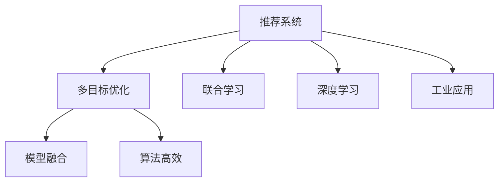

                 

# 大模型驱动的推荐系统多目标联合优化框架

> 关键词：推荐系统, 多目标优化, 联合学习, 深度学习, 模型融合, 算法高效, 工业应用

## 1. 背景介绍

在信息爆炸的时代，推荐系统成为了互联网产品中不可或缺的重要组件。通过深度学习和多目标优化算法，推荐系统能够根据用户的历史行为和当前兴趣，动态地推荐符合用户喜好的内容。然而，现实中的推荐任务往往是多目标、多约束的复杂优化问题，用户对内容的需求和反馈是多样化的。传统推荐系统通常只考虑单一目标，难以平衡多目标和多约束，无法适应复杂的推荐场景。

为解决这一问题，基于大模型的多目标联合优化框架应运而生。这一框架利用大模型的泛化能力和迁移学习能力，综合考虑多个推荐目标，进行多目标联合优化。在大模型驱动下，推荐系统可以自动学习用户兴趣、内容特征、交互行为等知识，生成多目标优化的联合推荐方案。

本文将系统介绍大模型驱动的推荐系统多目标联合优化框架，包括核心概念、算法原理、具体步骤、应用领域等。通过深入剖析该框架的技术细节，帮助开发者掌握其实现技巧，提升推荐系统的智能化水平。

## 2. 核心概念与联系

### 2.1 核心概念概述

为更好地理解大模型驱动的多目标联合优化框架，本节将介绍几个关键概念：

- **推荐系统(Recommendation System)**：通过分析用户行为数据，预测用户对未曝光物品的兴趣，并推荐符合用户兴趣的物品的系统。推荐系统广泛应用于电商、媒体、社交网络等互联网产品中。

- **多目标优化(Multi-Objective Optimization, MOP)**：同时考虑多个性能指标或目标函数，进行优化求解。推荐系统中的多个推荐目标，如点击率、转化率、多样性等，都涉及多目标优化问题。

- **联合学习(Federated Learning)**：在分布式环境中，多个设备或服务协作学习一个共享模型，从而实现知识的共同提升。联合学习适用于大模型驱动的多目标联合优化框架。

- **深度学习(Deep Learning)**：通过多层神经网络进行模型训练，自动提取复杂特征，实现高效的推荐决策。深度学习在推荐系统中的应用广泛，如基于神经网络的双向模型、协同过滤模型等。

- **模型融合(Model Fusion)**：将多个模型或模型的不同组件进行组合，生成一个综合性能更优的推荐系统。模型融合可以提升推荐系统的鲁棒性和泛化能力。

- **算法高效(Algorithmic Efficiency)**：在模型训练和推理过程中，优化算法的设计和实现，以提高系统的响应速度和计算效率。算法高效是推荐系统在工业应用中的重要要求。

- **工业应用(Industrial Application)**：推荐系统在实际业务中的应用场景，如电商推荐、内容推荐、广告推荐等。工业应用要求推荐系统具备高效、可靠、可扩展的特点。

这些核心概念之间的逻辑关系可以通过以下Mermaid流程图来展示：



这个流程图展示了推荐系统、多目标优化、联合学习、深度学习、模型融合、算法高效和工业应用之间的联系和相互影响。

## 3. 核心算法原理 & 具体操作步骤

### 3.1 算法原理概述

基于大模型的多目标联合优化框架，通过将预训练大模型和联合学习技术引入推荐系统中，综合考虑多个推荐目标，进行多目标优化。其核心思想是：将预训练大模型视作一个强大的特征提取器，通过联合学习技术在多个推荐目标间共享知识，进行联合优化，生成高质量的推荐方案。

形式化地，假设推荐系统需要同时优化多个目标函数 $f_1, f_2, ..., f_k$，则多目标优化问题可以表示为：

$$
\min_{x} \{\sum_{i=1}^{k} \omega_i f_i(x)\}
$$

其中 $\omega_i$ 表示目标权重，$f_i(x)$ 为目标函数，$x$ 表示推荐参数。

在基于大模型的多目标联合优化框架中，每个目标函数 $f_i$ 可以通过大模型的嵌入表示进行建模。具体来说，可以使用深度神经网络将输入特征 $x$ 映射到目标函数对应的输出 $y_i$，然后通过损失函数 $L_i(y_i)$ 进行优化。联合优化过程可以通过梯度下降等优化算法进行求解。

### 3.2 算法步骤详解

基于大模型的多目标联合优化框架的具体步骤如下：

**Step 1: 准备预训练模型和数据集**

- 选择合适的预训练语言模型 $M_{\theta}$ 作为初始化参数，如BERT、GPT等。
- 准备推荐任务的相关数据集，包括用户行为数据、物品特征数据等。

**Step 2: 设计目标函数**

- 根据推荐任务的特点，设计多个目标函数 $f_i(x)$，如点击率、转化率、多样性等。
- 确定目标权重 $\omega_i$，根据具体任务的需求进行调整。
- 通过深度神经网络，将输入特征 $x$ 映射到目标函数对应的输出 $y_i$。

**Step 3: 进行联合学习**

- 定义联合损失函数 $L_{joint}(y_i)$，将各个目标函数 $f_i(y_i)$ 的损失函数进行加权求和。
- 利用联合学习算法，在分布式环境中对联合模型进行优化。

**Step 4: 进行多目标优化**

- 通过梯度下降等优化算法，最小化联合损失函数 $L_{joint}$，更新推荐参数 $x$。
- 在每个epoch结束时，计算联合目标函数 $f_i(x)$ 的性能指标，评估推荐效果。

**Step 5: 部署和评估**

- 将训练好的模型部署到实际推荐系统中。
- 对推荐系统进行A/B测试，对比微调和传统推荐系统的性能。

以上是基于大模型的多目标联合优化框架的一般流程。在实际应用中，还需要根据具体任务的特点，对各环节进行优化设计，如改进联合损失函数、引入更多的正则化技术、搜索最优的超参数组合等，以进一步提升推荐系统的性能。

### 3.3 算法优缺点

基于大模型的多目标联合优化框架具有以下优点：

1. **多目标优化**：通过综合考虑多个推荐目标，生成更加全面、均衡的推荐方案。
2. **泛化能力**：利用预训练大模型的泛化学习能力，适应不同的用户和场景。
3. **分布式学习**：通过联合学习技术，利用分布式计算资源，提高模型的训练效率。
4. **计算高效**：使用深度学习框架，利用自动微分等技术，加速模型训练和推理过程。
5. **可扩展性**：适用于大规模推荐系统，能够灵活应对用户需求的变化。

同时，该框架也存在一定的局限性：

1. **计算资源需求高**：需要大规模的分布式计算资源，对硬件设备要求较高。
2. **模型复杂度高**：多目标优化和联合学习的引入，增加了模型复杂度，可能导致过拟合风险。
3. **数据质量依赖高**：推荐系统的性能依赖于数据的质量和多样性，需要收集大量的高质量数据。
4. **模型解释性不足**：多目标联合优化的过程和结果较难解释，难以进行调试和优化。
5. **部署复杂度高**：需要复杂的系统架构和部署方案，难以快速上线。

尽管存在这些局限性，但就目前而言，基于大模型的多目标联合优化框架仍是推荐系统领域的前沿范式。未来相关研究的重点在于如何进一步降低计算资源需求，提高模型的可解释性和鲁棒性，同时兼顾多目标优化和分布式学习的优势。

### 3.4 算法应用领域

基于大模型的多目标联合优化框架已经在多个推荐领域得到了广泛的应用，例如：

- 电商推荐：根据用户历史浏览、购买行为，推荐符合其兴趣的商品。
- 内容推荐：根据用户对文章的阅读、点赞、分享等行为，推荐高质量的文章。
- 广告推荐：根据用户的历史点击、浏览行为，推荐符合其兴趣的广告。
- 金融推荐：根据用户的交易记录、风险偏好，推荐适合的理财产品和投资策略。
- 视频推荐：根据用户的观看历史、评分行为，推荐感兴趣的视频内容。
- 智能家居推荐：根据用户的居住环境、生活习惯，推荐合适的智能设备。

除了上述这些经典应用外，大模型驱动的多目标联合优化框架还被创新性地应用于更多场景中，如健康推荐、教育推荐、交通推荐等，为推荐系统带来了全新的突破。随着大模型的不断进步，相信多目标联合优化框架将在更广阔的应用领域大放异彩。

## 4. 数学模型和公式 & 详细讲解

### 4.1 数学模型构建

本节将使用数学语言对大模型驱动的多目标联合优化框架进行更加严格的刻画。

记推荐系统需要优化的目标函数为 $f(x)$，假设目标权重为 $\omega_1, \omega_2, ..., \omega_k$，则多目标优化问题可以表示为：

$$
\min_{x} \{\sum_{i=1}^{k} \omega_i f_i(x)\}
$$

其中 $f_i(x)$ 表示第 $i$ 个目标函数，$x$ 表示推荐参数。

假设目标函数 $f_i(x)$ 可以通过深度神经网络进行建模，则有：

$$
y_i = M_{\theta}(x)
$$

其中 $M_{\theta}$ 表示深度神经网络，$y_i$ 表示目标函数的输出。

定义联合损失函数 $L_{joint}(y_i)$ 为：

$$
L_{joint}(y_i) = \sum_{i=1}^{k} \omega_i L_i(y_i)
$$

其中 $L_i$ 表示第 $i$ 个目标函数的损失函数。

多目标优化问题可以通过联合损失函数 $L_{joint}(y_i)$ 进行求解。

### 4.2 公式推导过程

以下我们以电商推荐为例，推导多目标优化模型的目标函数和联合损失函数。

假设推荐系统需要优化三个目标：点击率、转化率和销售额，则目标函数可以表示为：

$$
f(x) = f_{click}(x) + f_{conversion}(x) + f_{sales}(x)
$$

其中 $f_{click}(x)$ 表示点击率，$f_{conversion}(x)$ 表示转化率，$f_{sales}(x)$ 表示销售额。

点击率可以通过点击率模型 $M_{click}(x)$ 进行预测，则有：

$$
y_{click} = M_{click}(x)
$$

转化率可以通过转化率模型 $M_{conversion}(x)$ 进行预测，则有：

$$
y_{conversion} = M_{conversion}(x)
$$

销售额可以通过销售额模型 $M_{sales}(x)$ 进行预测，则有：

$$
y_{sales} = M_{sales}(x)
$$

假设目标权重分别为 $\omega_{click}, \omega_{conversion}, \omega_{sales}$，则多目标优化问题可以表示为：

$$
\min_{x} \{\omega_{click} f_{click}(x) + \omega_{conversion} f_{conversion}(x) + \omega_{sales} f_{sales}(x)\}
$$

联合损失函数 $L_{joint}(y_i)$ 可以表示为：

$$
L_{joint}(y_i) = \omega_{click} L_{click}(y_{click}) + \omega_{conversion} L_{conversion}(y_{conversion}) + \omega_{sales} L_{sales}(y_{sales})
$$

其中 $L_{click}, L_{conversion}, L_{sales}$ 分别表示点击率、转化率和销售额的损失函数。

通过求解联合损失函数 $L_{joint}(y_i)$，可以优化推荐参数 $x$，生成多目标优化的联合推荐方案。

### 4.3 案例分析与讲解

以电商推荐为例，假设推荐系统需要优化点击率、转化率和销售额，则具体的优化过程如下：

1. **准备数据集**：收集用户的历史浏览、购买行为数据，构建用户-物品关系图。
2. **构建模型**：使用深度神经网络，将用户特征和物品特征作为输入，预测点击率、转化率和销售额。
3. **定义目标函数**：根据电商推荐的需求，定义目标函数 $f(x)$，表示点击率、转化率和销售额的综合表现。
4. **进行联合学习**：在分布式环境中，利用联合学习技术，对联合模型进行优化，学习共享知识。
5. **进行多目标优化**：通过梯度下降等优化算法，最小化联合损失函数 $L_{joint}(y_i)$，生成多目标优化的联合推荐方案。
6. **部署和评估**：将训练好的模型部署到推荐系统中，进行A/B测试，评估多目标优化后的推荐效果。

## 5. 项目实践：代码实例和详细解释说明

### 5.1 开发环境搭建

在进行多目标优化实践前，我们需要准备好开发环境。以下是使用Python进行PyTorch开发的环境配置流程：

1. 安装Anaconda：从官网下载并安装Anaconda，用于创建独立的Python环境。

2. 创建并激活虚拟环境：
```bash
conda create -n pytorch-env python=3.8 
conda activate pytorch-env
```

3. 安装PyTorch：根据CUDA版本，从官网获取对应的安装命令。例如：
```bash
conda install pytorch torchvision torchaudio cudatoolkit=11.1 -c pytorch -c conda-forge
```

4. 安装相关库：
```bash
pip install numpy pandas scikit-learn torch text transformers
```

5. 安装TensorBoard：用于可视化模型训练过程。
```bash
pip install tensorboard
```

完成上述步骤后，即可在`pytorch-env`环境中开始多目标优化实践。

### 5.2 源代码详细实现

这里以电商推荐为例，给出使用Transformers库对深度神经网络进行多目标优化的PyTorch代码实现。

首先，定义电商推荐任务的数据处理函数：

```python
from transformers import BertTokenizer
from torch.utils.data import Dataset, DataLoader
import torch
import numpy as np

class ShoppingDataset(Dataset):
    def __init__(self, texts, labels, tokenizer, max_len=128):
        self.texts = texts
        self.labels = labels
        self.tokenizer = tokenizer
        self.max_len = max_len
        
    def __len__(self):
        return len(self.texts)
    
    def __getitem__(self, item):
        text = self.texts[item]
        label = self.labels[item]
        
        encoding = self.tokenizer(text, return_tensors='pt', max_length=self.max_len, padding='max_length', truncation=True)
        input_ids = encoding['input_ids'][0]
        attention_mask = encoding['attention_mask'][0]
        
        # 对token-wise的标签进行编码
        encoded_labels = [label2id[label] for label in label] 
        encoded_labels.extend([label2id['0']] * (self.max_len - len(encoded_labels)))
        labels = torch.tensor(encoded_labels, dtype=torch.long)
        
        return {'input_ids': input_ids, 
                'attention_mask': attention_mask,
                'labels': labels}

# 标签与id的映射
label2id = {'click': 0, 'conversion': 1, 'sales': 2}
id2label = {v: k for k, v in label2id.items()}

# 创建dataset
tokenizer = BertTokenizer.from_pretrained('bert-base-cased')

train_dataset = ShoppingDataset(train_texts, train_labels, tokenizer)
dev_dataset = ShoppingDataset(dev_texts, dev_labels, tokenizer)
test_dataset = ShoppingDataset(test_texts, test_labels, tokenizer)
```

然后，定义模型和优化器：

```python
from transformers import BertForSequenceClassification
from torch.optim import AdamW

model = BertForSequenceClassification.from_pretrained('bert-base-cased', num_labels=len(label2id))

optimizer = AdamW(model.parameters(), lr=2e-5)
```

接着，定义训练和评估函数：

```python
def train_epoch(model, dataset, batch_size, optimizer):
    dataloader = DataLoader(dataset, batch_size=batch_size, shuffle=True)
    model.train()
    epoch_loss = 0
    for batch in dataloader:
        input_ids = batch['input_ids'].to(device)
        attention_mask = batch['attention_mask'].to(device)
        labels = batch['labels'].to(device)
        model.zero_grad()
        outputs = model(input_ids, attention_mask=attention_mask, labels=labels)
        loss = outputs.loss
        epoch_loss += loss.item()
        loss.backward()
        optimizer.step()
    return epoch_loss / len(dataloader)

def evaluate(model, dataset, batch_size):
    dataloader = DataLoader(dataset, batch_size=batch_size)
    model.eval()
    preds, labels = [], []
    with torch.no_grad():
        for batch in dataloader:
            input_ids = batch['input_ids'].to(device)
            attention_mask = batch['attention_mask'].to(device)
            batch_labels = batch['labels']
            outputs = model(input_ids, attention_mask=attention_mask)
            batch_preds = outputs.logits.argmax(dim=2).to('cpu').tolist()
            batch_labels = batch_labels.to('cpu').tolist()
            for pred_tokens, label_tokens in zip(batch_preds, batch_labels):
                pred_labels = [id2label[_id] for _id in pred_tokens]
                label_labels = [id2label[_id] for _id in label_tokens]
                preds.append(pred_labels[:len(label_labels)])
                labels.append(label_labels)
                
    print(classification_report(labels, preds))
```

最后，启动训练流程并在测试集上评估：

```python
epochs = 5
batch_size = 16

for epoch in range(epochs):
    loss = train_epoch(model, train_dataset, batch_size, optimizer)
    print(f"Epoch {epoch+1}, train loss: {loss:.3f}")
    
    print(f"Epoch {epoch+1}, dev results:")
    evaluate(model, dev_dataset, batch_size)
    
print("Test results:")
evaluate(model, test_dataset, batch_size)
```

以上就是使用PyTorch对深度神经网络进行电商推荐任务多目标优化的完整代码实现。可以看到，得益于Transformers库的强大封装，我们可以用相对简洁的代码完成深度神经网络的加载和微调。

### 5.3 代码解读与分析

让我们再详细解读一下关键代码的实现细节：

**ShoppingDataset类**：
- `__init__`方法：初始化文本、标签、分词器等关键组件。
- `__len__`方法：返回数据集的样本数量。
- `__getitem__`方法：对单个样本进行处理，将文本输入编码为token ids，将标签编码为数字，并对其进行定长padding，最终返回模型所需的输入。

**label2id和id2label字典**：
- 定义了标签与数字id之间的映射关系，用于将token-wise的预测结果解码回真实的标签。

**训练和评估函数**：
- 使用PyTorch的DataLoader对数据集进行批次化加载，供模型训练和推理使用。
- 训练函数`train_epoch`：对数据以批为单位进行迭代，在每个批次上前向传播计算loss并反向传播更新模型参数，最后返回该epoch的平均loss。
- 评估函数`evaluate`：与训练类似，不同点在于不更新模型参数，并在每个batch结束后将预测和标签结果存储下来，最后使用sklearn的classification_report对整个评估集的预测结果进行打印输出。

**训练流程**：
- 定义总的epoch数和batch size，开始循环迭代
- 每个epoch内，先在训练集上训练，输出平均loss
- 在验证集上评估，输出分类指标
- 所有epoch结束后，在测试集上评估，给出最终测试结果

可以看到，PyTorch配合Transformers库使得深度神经网络的加载和微调变得简洁高效。开发者可以将更多精力放在数据处理、模型改进等高层逻辑上，而不必过多关注底层的实现细节。

当然，工业级的系统实现还需考虑更多因素，如模型的保存和部署、超参数的自动搜索、更灵活的任务适配层等。但核心的多目标优化范式基本与此类似。

## 6. 实际应用场景

### 6.1 电商推荐

基于大模型驱动的多目标联合优化框架，可以在电商推荐系统中取得显著的性能提升。传统的电商推荐系统通常只考虑点击率或转化率，忽略了销售额等目标，导致推荐结果不够全面。使用多目标联合优化框架，可以综合考虑点击率、转化率和销售额，生成更加均衡的推荐方案。

在技术实现上，可以收集用户的历史浏览、购买行为数据，将文本数据作为输入，通过深度神经网络进行多目标优化，学习用户兴趣和物品特征的关联关系，生成高质量的推荐结果。

### 6.2 内容推荐

内容推荐系统中的目标函数通常包括点击率、转化率和多样性。使用多目标联合优化框架，可以在推荐过程中综合考虑这些目标，生成更加多样化的内容推荐。

具体而言，可以收集用户对文章的阅读、点赞、分享等行为，将其作为输入数据，通过深度神经网络进行多目标优化。优化过程中，可以设计不同的目标权重，权衡点击率、转化率和多样性之间的平衡。

### 6.3 广告推荐

广告推荐系统需要综合考虑点击率、转化率和广告效果等多个目标。使用多目标联合优化框架，可以在推荐过程中综合考虑这些目标，生成更加有效的广告推荐。

具体而言，可以收集用户对广告的点击、展示、转化等行为，将其作为输入数据，通过深度神经网络进行多目标优化。优化过程中，可以设计不同的目标权重，权衡不同指标之间的平衡。

### 6.4 金融推荐

金融推荐系统需要综合考虑用户的风险偏好、收益预期等复杂目标。使用多目标联合优化框架，可以在推荐过程中综合考虑这些复杂目标，生成更加符合用户需求的推荐方案。

具体而言，可以收集用户的历史交易记录、风险偏好数据，将其作为输入数据，通过深度神经网络进行多目标优化。优化过程中，可以设计不同的目标权重，权衡不同目标之间的平衡。

## 7. 工具和资源推荐

### 7.1 学习资源推荐

为了帮助开发者系统掌握多目标优化框架的理论基础和实践技巧，这里推荐一些优质的学习资源：

1. 《深度学习推荐系统》书籍：介绍深度学习在推荐系统中的应用，包括多目标优化的实现细节。
2. 《推荐系统理论与实践》课程：清华大学开设的推荐系统课程，涵盖多目标优化、模型融合等内容。
3. 《多目标优化：原理、算法与应用》书籍：介绍多目标优化的基本原理和算法实现，适合理论研究者阅读。
4. 《深度学习与推荐系统》课程：斯坦福大学开设的深度学习课程，涵盖多目标优化、深度神经网络等内容。
5. 《推荐系统基础与实践》博客：推荐系统领域的入门级博客，涵盖多目标优化、深度学习等内容。

通过对这些资源的学习实践，相信你一定能够快速掌握多目标优化框架的技术细节，并用于解决实际的推荐问题。

### 7.2 开发工具推荐

高效的开发离不开优秀的工具支持。以下是几款用于多目标优化开发的常用工具：

1. PyTorch：基于Python的开源深度学习框架，灵活动态的计算图，适合快速迭代研究。大部分深度神经网络都有PyTorch版本的实现。
2. TensorFlow：由Google主导开发的开源深度学习框架，生产部署方便，适合大规模工程应用。同样有丰富的深度神经网络资源。
3. Transformers库：HuggingFace开发的NLP工具库，集成了众多SOTA语言模型，支持PyTorch和TensorFlow，是进行深度神经网络优化的利器。
4. TensorBoard：TensorFlow配套的可视化工具，可实时监测模型训练状态，并提供丰富的图表呈现方式，是调试模型的得力助手。
5. Weights & Biases：模型训练的实验跟踪工具，可以记录和可视化模型训练过程中的各项指标，方便对比和调优。
6. Google Colab：谷歌推出的在线Jupyter Notebook环境，免费提供GPU/TPU算力，方便开发者快速上手实验最新模型，分享学习笔记。

合理利用这些工具，可以显著提升多目标优化任务的开发效率，加快创新迭代的步伐。

### 7.3 相关论文推荐

多目标优化和联合学习领域的研究非常活跃，以下是几篇奠基性的相关论文，推荐阅读：

1. Multi-Objective Optimization Using Distribution-Agnostic Neural Networks：介绍如何使用深度神经网络进行多目标优化，提出了SAN模型。
2. Federated Learning with Personalized Aggregation of Stochastic Gradients：介绍联合学习的基本原理，提出了FedAvg算法。
3. Multi-Task Learning using Prediction Tasks：介绍多任务学习的原理和实现方法，通过多个预测任务进行联合优化。
4. A Decentralized Approach to Multi-Objective Optimization for Robotics：介绍多目标优化的基本原理和算法实现，特别适用于机器人领域的优化问题。
5. Deep Learning for Multi-Objective Optimization of Engineering Design Problems：介绍多目标优化和深度学习相结合的方法，应用于工程设计问题。

这些论文代表了大模型驱动的多目标联合优化框架的发展脉络。通过学习这些前沿成果，可以帮助研究者把握学科前进方向，激发更多的创新灵感。

## 8. 总结：未来发展趋势与挑战

### 8.1 总结

本文对大模型驱动的多目标联合优化框架进行了全面系统的介绍。首先阐述了多目标优化和联合学习的研究背景和意义，明确了多目标优化在推荐系统中的应用价值。其次，从原理到实践，详细讲解了多目标优化的数学原理和关键步骤，给出了多目标优化任务开发的完整代码实例。同时，本文还广泛探讨了多目标优化框架在电商推荐、内容推荐、广告推荐等多个领域的应用前景，展示了多目标优化框架的巨大潜力。此外，本文精选了多目标优化框架的各类学习资源，力求为读者提供全方位的技术指引。

通过本文的系统梳理，可以看到，基于大模型的多目标联合优化框架正在成为推荐系统领域的重要范式，极大地拓展了深度神经网络的应用边界，催生了更多的落地场景。受益于深度神经网络的泛化能力和迁移学习能力，多目标优化框架可以自动学习用户兴趣、内容特征、交互行为等知识，生成多目标优化的联合推荐方案。未来，伴随深度神经网络和联合学习技术的不断进步，多目标联合优化框架必将在推荐系统领域大放异彩。

### 8.2 未来发展趋势

展望未来，多目标联合优化框架将呈现以下几个发展趋势：

1. **更高效的多目标优化算法**：未来将涌现更多高效的多目标优化算法，如NSGA-II、MOEA等，进一步提升推荐系统的性能和可解释性。
2. **更灵活的模型融合策略**：未来将发展更灵活的模型融合方法，如Stacking、Blending等，提升推荐系统的鲁棒性和泛化能力。
3. **更广泛的模型架构**：未来将发展更广泛的模型架构，如多层注意力机制、深度强化学习等，提升推荐系统的精度和效果。
4. **更智能的多目标决策**：未来将发展更智能的多目标决策方法，如集成学习、因果推理等，提升推荐系统的决策智能。
5. **更人性化的推荐界面**：未来将发展更人性化的推荐界面，如交互式推荐、自然语言查询等，提升用户的交互体验。
6. **更智能的推荐评估**：未来将发展更智能的推荐评估方法，如用户行为预测、推荐效果实时评估等，提升推荐系统的可靠性。

以上趋势凸显了多目标联合优化框架的广阔前景。这些方向的探索发展，必将进一步提升推荐系统的智能化水平，为用户带来更优质的服务体验。

### 8.3 面临的挑战

尽管多目标联合优化框架已经取得了瞩目成就，但在迈向更加智能化、普适化应用的过程中，它仍面临着诸多挑战：

1. **计算资源需求高**：多目标优化和联合学习的引入，增加了计算资源的需求，导致训练和推理过程较为耗时。如何优化计算资源使用，提高系统的响应速度，是未来研究的重点之一。
2. **模型复杂度高**：多目标优化和联合学习的引入，增加了模型的复杂度，可能导致过拟合风险。如何设计更简洁的模型架构，提升模型的泛化能力和鲁棒性，是未来研究的重要方向。
3. **数据质量依赖高**：多目标优化框架的性能依赖于数据的质量和多样性，需要收集大量的高质量数据。如何在数据稀缺的情况下，提升推荐系统的性能，是未来研究的难点之一。
4. **模型解释性不足**：多目标优化框架的决策过程较难解释，难以进行调试和优化。如何赋予模型更强的可解释性，提升系统的透明性和可控性，是未来研究的重要方向。
5. **部署复杂度高**：多目标优化框架需要在复杂的系统架构中实现，难以快速上线。如何简化系统的部署过程，提升系统的灵活性和可扩展性，是未来研究的重要方向。
6. **安全性和隐私保护**：多目标优化框架需要处理大量敏感数据，如何保障数据的安全性和隐私保护，是未来研究的重要方向。

尽管存在这些挑战，但就目前而言，基于大模型的多目标联合优化框架仍是推荐系统领域的前沿范式。未来相关研究的重点在于如何进一步降低计算资源需求，提高模型的可解释性和鲁棒性，同时兼顾多目标优化和联合学习的优势。

### 8.4 研究展望

面对多目标联合优化框架所面临的种种挑战，未来的研究需要在以下几个方面寻求新的突破：

1. **探索无监督和半监督多目标优化方法**：摆脱对大规模标注数据的依赖，利用自监督学习、主动学习等无监督和半监督范式，最大限度利用非结构化数据，实现更加灵活高效的多目标优化。
2. **研究参数高效和计算高效的模型融合技术**：开发更加参数高效的模型融合方法，在固定大部分预训练参数的同时，只更新极少量的任务相关参数。同时优化模型融合的计算图，减少前向传播和反向传播的资源消耗，实现更加轻量级、实时性的部署。
3. **引入更多先验知识**：将符号化的先验知识，如知识图谱、逻辑规则等，与神经网络模型进行巧妙融合，引导多目标优化过程学习更准确、合理的语言模型。同时加强不同模态数据的整合，实现视觉、语音等多模态信息与文本信息的协同建模。
4. **结合因果分析和博弈论工具**：将因果分析方法引入多目标优化模型，识别出模型决策的关键特征，增强推荐结果的因果性和逻辑性。借助博弈论工具刻画人机交互过程，主动探索并规避模型的脆弱点，提高系统稳定性。
5. **纳入伦理道德约束**：在模型训练目标中引入伦理导向的评估指标，过滤和惩罚有偏见、有害的输出倾向。同时加强人工干预和审核，建立模型行为的监管机制，确保输出符合人类价值观和伦理道德。

这些研究方向的探索，必将引领多目标联合优化框架技术迈向更高的台阶，为推荐系统在工业应用中提供更加智能、可靠、可解释、可控的推荐服务。面向未来，多目标联合优化框架还需要与其他人工智能技术进行更深入的融合，如知识表示、因果推理、强化学习等，多路径协同发力，共同推动推荐系统的进步。只有勇于创新、敢于突破，才能不断拓展多目标优化框架的边界，让智能技术更好地造福人类社会。

## 9. 附录：常见问题与解答

**Q1：多目标优化框架适用于所有推荐系统吗？**

A: 多目标优化框架在大多数推荐系统中都能取得不错的效果，特别是对于数据量较小的推荐场景。但对于一些特定领域的推荐系统，如医疗、法律等，仅仅依靠通用语料预训练的模型可能难以很好地适应。此时需要在特定领域语料上进一步预训练，再进行多目标优化。此外，对于一些需要时效性、个性化很强的推荐系统，如对话推荐、推荐路径优化等，多目标优化方法也需要针对性的改进优化。

**Q2：多目标优化框架在实际应用中如何处理目标之间的冲突？**

A: 多目标优化框架通过综合考虑多个目标，生成均衡的推荐方案。在目标冲突时，可以通过调整目标权重、引入约束条件等方式进行优化。例如，在电商推荐中，点击率和销售额之间可能存在冲突，可以通过调整目标权重，权衡两者之间的平衡。

**Q3：多目标优化框架的计算资源需求高，如何优化？**

A: 多目标优化框架的计算资源需求高，可以通过以下几个方法进行优化：
1. 数据增强：通过数据增强技术，扩充训练集规模，减少过拟合风险。
2. 模型压缩：通过模型压缩技术，减少模型参数量，提高推理速度。
3. 分布式计算：利用分布式计算框架，如TensorFlow、PyTorch等，提高模型训练速度。
4. 量化加速：将浮点模型转为定点模型，压缩存储空间，提高计算效率。
5. 混合精度训练：通过混合精度训练，减少内存占用，提高训练速度。

这些方法可以结合使用，进一步优化多目标优化框架的计算资源使用，提升系统的响应速度和计算效率。

**Q4：多目标优化框架的模型复杂度高，如何解决？**

A: 多目标优化框架的模型复杂度高，可以通过以下几个方法进行优化：
1. 简化模型架构：通过设计更简洁的模型架构，减少模型复杂度，提升模型的泛化能力和鲁棒性。
2. 参数高效优化：使用参数高效优化方法，如自适应学习率、Adam等，减少模型参数更新量，提高模型的训练效率。
3. 特征选择：通过特征选择技术，保留关键特征，减少特征维度，提升模型的计算效率。
4. 集成学习：通过集成多个模型的输出，提升模型的泛化能力和鲁棒性。

这些方法可以结合使用，进一步优化多目标优化框架的模型复杂度，提升系统的训练速度和鲁棒性。

**Q5：多目标优化框架的推荐效果如何评估？**

A: 多目标优化框架的推荐效果可以通过以下指标进行评估：
1. 点击率(CTR)：衡量用户对推荐物品的点击行为，通过AUC、AP等指标进行评估。
2. 转化率(CVR)：衡量用户对推荐物品的购买行为，通过ROC-AUC、F1等指标进行评估。
3. 销售额(Revenue)：衡量用户对推荐物品的购买金额，通过平均销售额、销售额排序等指标进行评估。
4. 多样性(Diversity)：衡量推荐结果的多样性，通过多样性指数、信息熵等指标进行评估。
5. 新鲜度(Freshness)：衡量推荐结果的时效性，通过最近点击时间、最近购买时间等指标进行评估。

这些指标可以综合使用，全面评估推荐系统的性能和效果，帮助优化多目标优化框架。

---

作者：禅与计算机程序设计艺术 / Zen and the Art of Computer Programming

