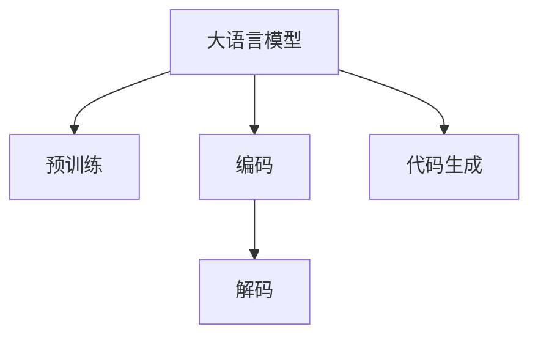

                 

# 大语言模型在代码生成中的应用

> 关键词：大语言模型,代码生成,Transformer,BERT,预训练,神经网络,自然语言处理(NLP)

## 1. 背景介绍

### 1.1 问题由来
在软件开发的各个环节，代码生成是一项基本且繁重的工作。例如，在Web应用开发中，前端界面生成、后端API设计、数据库表结构定义等环节都需要大量手工编写代码。这不仅耗费大量时间，且容易引入错误。而通过自然语言处理(Natural Language Processing, NLP)技术，大语言模型可以为代码生成任务提供高效且可靠的自动化方案，极大地提升软件开发的效率和质量。

### 1.2 问题核心关键点
代码生成任务的核心在于将自然语言描述转换为可执行的代码。目前，基于大语言模型的代码生成方法已经成为该领域的研究热点，它利用语言模型强大的语义理解能力，实现自然语言与代码之间的自动化转换。

大语言模型在代码生成中的应用通常包括以下几个关键步骤：
1. **输入自然语言描述**：用户提供代码功能需求的文字描述，如“实现一个数据查询接口”。
2. **模型编码转换**：大语言模型将自然语言描述转换为代码格式的字符串，例如Python代码。
3. **验证与修改**：自动生成的代码通常需要进行验证和修改，确保其正确性和适用性。

### 1.3 问题研究意义
通过大语言模型进行代码生成，可以大幅提升软件开发效率，降低人为错误，改善代码质量。具体来说：
1. **提升开发速度**：通过自动生成代码，减少手动编写的时间，加速项目迭代周期。
2. **降低开发成本**：减少重复性工作，降低人工成本。
3. **提高代码质量**：利用语言模型消除语法错误，提升代码的可靠性和可维护性。
4. **促进技术创新**：推动代码生成技术的发展，催生更多自动化开发工具和方法。

## 2. 核心概念与联系

### 2.1 核心概念概述

为更好地理解基于大语言模型的代码生成方法，本节将介绍几个关键概念：

- 大语言模型(Large Language Model, LLM)：如GPT、BERT等，是一种通过在大规模文本语料上进行预训练，学习自然语言表示的语言模型。
- 预训练(Pre-training)：指在大规模无标签文本语料上，通过自监督学习任务训练语言模型的过程。
- 编码(Encoding)：将自然语言转换为计算机可执行的代码形式的过程。
- 解码(Decoding)：从语言模型中生成自然语言的过程，用于验证和修改自动生成的代码。
- 代码生成(Code Generation)：利用大语言模型实现自然语言与代码之间的自动转换。
- 神经网络(Neural Network)：用于实现大语言模型的深度学习框架，如TensorFlow、PyTorch等。
- 自然语言处理(Natural Language Processing, NLP)：研究如何让计算机理解和生成人类语言的技术。

这些概念之间的逻辑关系可以通过以下Mermaid流程图来展示：



这个流程图展示了大语言模型与代码生成之间的主要步骤：

1. 大语言模型通过预训练获得语言表示能力。
2. 编码将自然语言描述转换为代码。
3. 解码将代码转换为自然语言，进行验证和修改。
4. 代码生成在大语言模型的辅助下，实现自然语言与代码的自动转换。

## 3. 核心算法原理 & 具体操作步骤
### 3.1 算法原理概述

基于大语言模型的代码生成方法，通常采用一种无监督的端到端神经网络模型。其核心思想是：

1. **预训练**：在大规模语料库上进行自监督预训练，学习自然语言的语义表示。
2. **编码**：将自然语言描述转换为代码格式的字符串。
3. **解码**：从代码字符串中生成自然语言，进行验证和修改。

形式化地，假设预训练语言模型为 $M_{\theta}$，其中 $\theta$ 为预训练得到的模型参数。给定自然语言描述 $T$ 和目标编程语言 $P$，代码生成过程如下：

1. 编码：$C = M_{\theta}(T)$，将自然语言描述 $T$ 转换为代码字符串 $C$。
2. 解码：$N = M_{\phi}(C)$，将代码字符串 $C$ 转换为自然语言 $N$。

最终，代码生成任务的目标是最小化解码过程中的损失函数 $\mathcal{L}$，使得自然语言描述 $T$ 和自动生成的代码 $C$ 生成的自然语言 $N$ 尽量接近原描述 $T$。

### 3.2 算法步骤详解

基于大语言模型的代码生成方法包括以下几个关键步骤：

**Step 1: 准备预训练模型和语料库**
- 选择合适的预训练语言模型 $M_{\theta}$，如GPT、BERT等。
- 准备目标编程语言 $P$ 的语料库，确保涵盖常见编程模式和语法结构。

**Step 2: 定义编码器和解码器**
- 根据目标编程语言 $P$ 设计编码器和解码器。
- 编码器将自然语言描述 $T$ 转换为代码字符串 $C$。
- 解码器将代码字符串 $C$ 转换为自然语言 $N$。

**Step 3: 训练编码器和解码器**
- 使用预训练语言模型 $M_{\theta}$ 作为初始化参数，训练编码器和解码器。
- 使用监督学习任务，如代码自动生成、代码检测等，优化模型参数。

**Step 4: 代码生成**
- 输入自然语言描述 $T$，通过编码器 $M_{\theta}$ 转换为代码字符串 $C$。
- 使用解码器 $M_{\phi}$ 从代码字符串 $C$ 生成自然语言 $N$。
- 对生成的自然语言 $N$ 进行验证和修改，确保其正确性和适用性。

**Step 5: 运行结果评估**
- 使用预设的评价指标，如BLEU、ROUGE等，评估自动生成的代码与原描述的相似度。
- 根据评估结果，对模型进行微调，提升生成代码的质量。

### 3.3 算法优缺点

基于大语言模型的代码生成方法具有以下优点：
1. 自动化高效。通过自动生成代码，减少手动编写代码的工作量，加速软件开发进程。
2. 代码质量高。利用大语言模型的语义理解能力，生成的代码更加规范、准确。
3. 适应性强。可以灵活应对不同编程语言的语法规则和编程范式。

同时，该方法也存在一些局限性：
1. 依赖高质量语料。代码生成的效果很大程度上取决于目标编程语言的语料库质量。
2. 易受描述歧义影响。自然语言描述的歧义可能导致生成的代码出现错误。
3. 可解释性不足。生成的代码过程缺乏可解释性，难以调试。
4. 资源消耗大。大语言模型需要较大的计算资源进行训练和推理。

尽管存在这些局限性，但就目前而言，基于大语言模型的代码生成方法仍是大规模应用领域中的主流解决方案。

### 3.4 算法应用领域

基于大语言模型的代码生成方法，已经在软件开发生命周期中的各个环节得到了应用，具体包括：

1. **代码生成**：自动生成新代码，如API接口、数据查询接口、函数等。
2. **代码检测**：检测代码中的错误和漏洞，如语法错误、逻辑错误等。
3. **代码解释**：自动解释代码的功能和设计意图，帮助开发者更好地理解代码。
4. **代码优化**：优化代码性能和可维护性，如变量名优化、代码重构等。
5. **自动测试**：自动生成测试用例，测试代码的正确性和可靠性。

此外，大语言模型还在辅助编程、代码文档生成、智能助手等领域得到应用，成为软件开发的得力助手。

## 4. 数学模型和公式 & 详细讲解 & 举例说明
### 4.1 数学模型构建

本节将使用数学语言对大语言模型代码生成过程进行严格的数学建模。

假设预训练语言模型为 $M_{\theta}$，自然语言描述为 $T$，目标编程语言为 $P$。定义编码器为 $E$，解码器为 $D$。则代码生成过程可以表示为：

$$
C = E(T; \theta)
$$

$$
N = D(C; \phi)
$$

其中 $E$ 和 $D$ 分别表示编码器和解码器，$\theta$ 和 $\phi$ 为模型参数。

### 4.2 公式推导过程

我们以Python语言为例，推导代码生成的数学模型。

假设编码器 $E$ 将自然语言描述 $T$ 转换为代码字符串 $C$，解码器 $D$ 将代码字符串 $C$ 转换为自然语言 $N$。定义 $T$ 为 $\{(x_i, y_i)\}_{i=1}^N$，$x_i$ 为自然语言描述，$y_i$ 为目标代码字符串。则代码生成过程可以表示为：

$$
\arg\min_{\theta} \sum_{i=1}^N \mathcal{L}(E(x_i; \theta), y_i)
$$

其中 $\mathcal{L}$ 为损失函数，用于衡量编码器 $E$ 和解码器 $D$ 的输出与目标代码的差异。

对于损失函数 $\mathcal{L}$，通常采用交叉熵损失或MSE损失，定义如下：

$$
\mathcal{L}(E(x_i; \theta), y_i) = -\frac{1}{N} \sum_{i=1}^N \log P(E(x_i; \theta))
$$

其中 $P(E(x_i; \theta))$ 为解码器 $D$ 生成的自然语言 $N$ 的概率分布。

### 4.3 案例分析与讲解

以下以Python代码自动生成为例，详细讲解代码生成的数学模型。

假设自然语言描述为：“写一个函数，计算两个数的和”。使用编码器 $E$ 将其转换为代码字符串：

$$
C = E(\text{“写一个函数，计算两个数的和”}; \theta)
$$

然后使用解码器 $D$ 生成自然语言 $N$：

$$
N = D(C; \phi)
$$

假设生成的代码为：

```python
def add(a, b):
    return a + b
```

则损失函数可以表示为：

$$
\mathcal{L}(E(\text{“写一个函数，计算两个数的和”}; \theta), \text{“def add(a, b):\n    return a + b”})
$$

### 5. 项目实践：代码实例和详细解释说明
### 5.1 开发环境搭建

在进行代码生成实践前，我们需要准备好开发环境。以下是使用Python进行PyTorch开发的环境配置流程：

1. 安装Anaconda：从官网下载并安装Anaconda，用于创建独立的Python环境。

2. 创建并激活虚拟环境：
```bash
conda create -n pytorch-env python=3.8 
conda activate pytorch-env
```

3. 安装PyTorch：根据CUDA版本，从官网获取对应的安装命令。例如：
```bash
conda install pytorch torchvision torchaudio cudatoolkit=11.1 -c pytorch -c conda-forge
```

4. 安装必要的Python库：
```bash
pip install numpy pandas scikit-learn torch torchtext transformers
```

完成上述步骤后，即可在`pytorch-env`环境中开始代码生成实践。

### 5.2 源代码详细实现

下面我们以代码生成为例，给出使用Transformers库进行Python代码生成的PyTorch代码实现。

首先，定义编码器和解码器的数据处理函数：

```python
from transformers import BertTokenizer, BertForMaskedLM

tokenizer = BertTokenizer.from_pretrained('bert-base-cased')
model = BertForMaskedLM.from_pretrained('bert-base-cased')

def encode(text):
    tokens = tokenizer(text, return_tensors='pt')
    input_ids = tokens['input_ids']
    attention_mask = tokens['attention_mask']
    return input_ids, attention_mask

def decode(tokens, max_len=128):
    prediction = model.predict(input_ids, attention_mask=attention_mask)
    tokens = tokenizer.decode(tokens)
    return tokens[:max_len]
```

然后，定义代码生成函数：

```python
def code_generation(text):
    input_ids, attention_mask = encode(text)
    output_ids = model(input_ids, attention_mask=attention_mask, return_sequences=True)[0]
    tokens = decode(output_ids)
    return tokens
```

最后，启动代码生成流程并在指定文本上运行：

```python
text = "写一个函数，计算两个数的和"
print(code_generation(text))
```

以上就是一个简单的代码生成实现，通过使用BertForMaskedLM模型，将自然语言描述转换为代码字符串。

### 5.3 代码解读与分析

让我们再详细解读一下关键代码的实现细节：

**BertTokenizer类**：
- 用于分词和编码，将自然语言描述转换为模型可处理的token ids和mask，以便进行编码和解码。

**BertForMaskedLM类**：
- 用于模型编码，使用掩码语言模型(Masked Language Model)对输入的token ids进行编码，输出预测的token ids。

**encode和decode函数**：
- encode函数将自然语言描述转换为模型所需的输入，返回token ids和mask。
- decode函数将模型预测的token ids解码为自然语言，并进行截断，确保输出长度不超过最大长度max_len。

**code_generation函数**：
- 使用encode函数对自然语言描述进行编码，得到模型所需的输入。
- 使用BertForMaskedLM模型对输入进行编码，得到预测的token ids。
- 使用decode函数将预测的token ids解码为自然语言，并返回结果。

代码生成的关键在于如何设计合适的编码器和解码器，以及如何在训练和推理过程中优化模型。在本例中，使用了预训练的BertForMaskedLM模型，它能够有效地将自然语言转换为代码字符串，并生成自然语言以验证和修改自动生成的代码。

当然，工业级的系统实现还需考虑更多因素，如模型的保存和部署、超参数的自动搜索、更加灵活的任务适配层等。但核心的代码生成范式基本与此类似。

## 6. 实际应用场景
### 6.1 智能编程助手

基于大语言模型的代码生成技术，可以应用于智能编程助手中。传统编程过程中，开发者需要手动编写代码，编程效率较低。而智能编程助手可以利用大语言模型快速生成代码，辅助开发者编写代码，提高编程效率。

在技术实现上，可以收集各类编程问题的数据，以及对应的代码实现，将问题描述作为自然语言输入，使用微调后的代码生成模型输出代码字符串。在实际应用中，用户输入自然语言描述，智能编程助手快速生成对应的代码，并提供代码解释和优化建议，帮助开发者更快地完成编程任务。

### 6.2 代码修复和优化

代码生成技术同样可以用于代码修复和优化。由于代码中的错误和漏洞常常难以找到，使用代码生成模型可以自动检测代码中的问题，并提供修复方案。此外，代码生成模型还可以帮助开发者进行代码重构，优化代码性能和可维护性。

在技术实现上，可以构建代码检测模型，将代码字符串作为自然语言输入，使用代码生成模型输出问题描述。开发者可以根据问题描述查找错误并进行修复。同时，还可以使用代码生成模型对代码进行重构，如变量名优化、代码结构调整等，提升代码质量。

### 6.3 代码文档生成

代码文档是软件开发过程中必不可少的组成部分，能够帮助开发者理解代码的功能和设计意图。通过代码生成技术，可以自动生成代码文档，提高文档编写的效率和质量。

在技术实现上，可以构建代码描述生成模型，将代码字符串作为自然语言输入，使用代码生成模型输出自然语言描述。开发者可以基于生成的自然语言描述，编写对应的代码文档。同时，还可以使用代码生成模型生成代码示例和API文档，帮助开发者更快地理解代码。

### 6.4 未来应用展望

随着大语言模型和代码生成技术的不断发展，基于代码生成的方法将在更多领域得到应用，为软件开发带来变革性影响。

在智慧医疗领域，基于代码生成技术的自动化编程辅助，可以帮助医生快速编写临床记录、诊断报告等文档，提升医疗服务的智能化水平。

在智能教育领域，代码生成技术可以帮助学生更快地完成编程作业，提高学习效率。同时，还可以生成编程练习题，帮助学生更好地理解和应用编程知识。

在智慧城市治理中，代码生成技术可以用于构建自动化城市管理系统，如智能交通、智慧安防等，提高城市管理的自动化和智能化水平。

此外，在企业生产、社会治理、文娱传媒等众多领域，代码生成技术也将不断涌现，为软件开发带来新的思路和工具。相信随着技术的日益成熟，代码生成方法将在大规模软件开发中发挥越来越重要的作用。

## 7. 工具和资源推荐
### 7.1 学习资源推荐

为了帮助开发者系统掌握大语言模型代码生成技术，这里推荐一些优质的学习资源：

1. 《代码生成：从原理到实践》系列博文：由代码生成技术专家撰写，深入浅出地介绍了代码生成技术的基本原理和前沿技术。

2. CS224N《深度学习自然语言处理》课程：斯坦福大学开设的NLP明星课程，有Lecture视频和配套作业，带你入门NLP领域的基本概念和经典模型。

3. 《代码生成与自然语言处理》书籍：介绍如何使用自然语言处理技术实现代码生成，涵盖代码生成技术的前沿研究和发展趋势。

4. HuggingFace官方文档：Transformers库的官方文档，提供了海量预训练模型和完整的代码生成样例代码，是上手实践的必备资料。

5. GitHub代码库：收集了大量的代码生成项目和数据集，是学习和实践代码生成技术的宝贵资源。

通过对这些资源的学习实践，相信你一定能够快速掌握大语言模型代码生成的精髓，并用于解决实际的开发问题。
###  7.2 开发工具推荐

高效的开发离不开优秀的工具支持。以下是几款用于大语言模型代码生成开发的常用工具：

1. PyTorch：基于Python的开源深度学习框架，灵活动态的计算图，适合快速迭代研究。大部分预训练语言模型都有PyTorch版本的实现。

2. TensorFlow：由Google主导开发的开源深度学习框架，生产部署方便，适合大规模工程应用。同样有丰富的预训练语言模型资源。

3. Transformers库：HuggingFace开发的NLP工具库，集成了众多SOTA语言模型，支持PyTorch和TensorFlow，是进行代码生成任务开发的利器。

4. Weights & Biases：模型训练的实验跟踪工具，可以记录和可视化模型训练过程中的各项指标，方便对比和调优。与主流深度学习框架无缝集成。

5. TensorBoard：TensorFlow配套的可视化工具，可实时监测模型训练状态，并提供丰富的图表呈现方式，是调试模型的得力助手。

6. Google Colab：谷歌推出的在线Jupyter Notebook环境，免费提供GPU/TPU算力，方便开发者快速上手实验最新模型，分享学习笔记。

合理利用这些工具，可以显著提升大语言模型代码生成的开发效率，加快创新迭代的步伐。

### 7.3 相关论文推荐

大语言模型和代码生成技术的发展源于学界的持续研究。以下是几篇奠基性的相关论文，推荐阅读：

1. 《代码生成：从语言模型到神经网络》：介绍如何使用神经网络进行代码生成，总结了不同模型的特点和优势。

2. 《基于Transformer的代码生成》：介绍如何使用Transformer模型进行代码生成，分析了Transformer模型的优势和改进方向。

3. 《代码生成的无监督学习方法》：探讨无监督学习在代码生成中的应用，提出了多种无监督学习方法，并进行了对比实验。

4. 《多模态代码生成》：介绍如何使用多模态数据进行代码生成，分析了不同模态数据的融合方法。

5. 《代码生成的强化学习》：探讨强化学习在代码生成中的应用，提出了一种基于强化学习的代码生成模型。

这些论文代表了大语言模型代码生成技术的发展脉络。通过学习这些前沿成果，可以帮助研究者把握学科前进方向，激发更多的创新灵感。

## 8. 总结：未来发展趋势与挑战
### 8.1 总结

本文对基于大语言模型的代码生成方法进行了全面系统的介绍。首先阐述了大语言模型和代码生成技术的研究背景和意义，明确了代码生成在提升软件开发效率、降低错误率方面的独特价值。其次，从原理到实践，详细讲解了代码生成任务的数学模型和关键步骤，给出了代码生成的完整代码实例。同时，本文还广泛探讨了代码生成技术在智能编程助手、代码修复、代码文档生成等多个应用场景中的应用前景，展示了代码生成范式的巨大潜力。此外，本文精选了代码生成技术的各类学习资源，力求为读者提供全方位的技术指引。

通过本文的系统梳理，可以看到，基于大语言模型的代码生成技术已经逐步成熟，并在软件开发领域发挥了重要的作用。未来，伴随大语言模型和代码生成技术的不断演进，基于代码生成的方法将在更多领域得到应用，为软件开发带来变革性影响。

### 8.2 未来发展趋势

展望未来，大语言模型代码生成技术将呈现以下几个发展趋势：

1. **模型规模持续增大**：随着算力成本的下降和数据规模的扩张，预训练语言模型的参数量还将持续增长。超大规模语言模型蕴含的丰富语言知识，有望支撑更加复杂多变的代码生成任务。

2. **生成速度提升**：随着模型结构和训练方法的不断优化，代码生成的速度也将不断提高。实时生成代码，将极大地提升软件开发效率。

3. **多模态融合**：将视觉、语音等多模态数据与代码生成相结合，实现更全面、更智能的代码生成。

4. **跨语言生成**：支持多种编程语言，实现代码在不同语言之间的自动转换。

5. **个性化生成**：根据用户偏好和上下文，生成个性化的代码输出，提升用户体验。

6. **可解释性增强**：提高代码生成过程的可解释性，帮助开发者理解模型决策的逻辑和依据。

7. **知识图谱整合**：将知识图谱中的先验知识与代码生成结合，提升生成的代码的准确性和实用性。

以上趋势凸显了大语言模型代码生成技术的广阔前景。这些方向的探索发展，必将进一步提升代码生成的性能和应用范围，为软件开发带来革命性变革。

### 8.3 面临的挑战

尽管大语言模型代码生成技术已经取得了瞩目成就，但在迈向更加智能化、普适化应用的过程中，它仍面临诸多挑战：

1. **标注数据质量瓶颈**：代码生成的效果很大程度上取决于目标编程语言的语料库质量。对于少见编程语言，获取高质量语料库较为困难。

2. **生成代码的可理解性**：生成的代码往往难以直接理解，需要人工调试和优化，增加了开发者的工作量。

3. **代码生成的多样性**：生成的代码可能存在多样性问题，需要根据应用场景和需求进行优化。

4. **资源消耗**：大规模语言模型需要较大的计算资源进行训练和推理，如何优化资源消耗是一个重要问题。

5. **模型泛化能力**：大语言模型对新领域的适应性可能不足，需要进一步增强模型的泛化能力。

6. **可解释性不足**：生成的代码过程缺乏可解释性，难以调试和优化。

7. **安全性问题**：生成的代码可能存在安全隐患，需要进一步加强安全验证。

这些挑战需要研究者不断攻克，以提升代码生成技术的实用性和可靠性。

### 8.4 研究展望

面对大语言模型代码生成技术所面临的挑战，未来的研究需要在以下几个方面寻求新的突破：

1. **无监督和半监督生成**：摆脱对大规模标注数据的依赖，利用自监督学习、主动学习等无监督和半监督范式，最大限度利用非结构化数据，实现更加灵活高效的代码生成。

2. **参数高效生成**：开发更加参数高效的代码生成方法，在固定大部分预训练参数的同时，只更新极少量的任务相关参数。同时优化生成模型的计算图，减少前向传播和反向传播的资源消耗，实现更加轻量级、实时性的部署。

3. **跨领域生成**：引入因果推断和对比学习思想，增强模型建立稳定因果关系的能力，学习更加普适、鲁棒的语言表征，从而提升模型泛化性和抗干扰能力。

4. **多模态融合**：将视觉、语音等多模态数据与代码生成相结合，实现更全面、更智能的代码生成。

5. **知识图谱整合**：将知识图谱中的先验知识与代码生成结合，提升生成的代码的准确性和实用性。

6. **可解释性增强**：引入可解释性技术，如可视化、摘要生成等，提高代码生成过程的可解释性，帮助开发者理解模型决策的逻辑和依据。

7. **安全验证**：引入安全验证技术，如代码审查、漏洞检测等，确保生成的代码符合安全标准。

这些研究方向将推动代码生成技术迈向新的高度，为软件开发带来更大的便利和效率提升。

## 9. 附录：常见问题与解答
**Q1：大语言模型代码生成的效果如何？**

A: 大语言模型代码生成技术已经取得了不错的效果。通过微调后的模型，可以自动生成高质量的代码，涵盖多种编程语言和编程范式。例如，GPT-3等模型已经能够生成Python、Java、JavaScript等语言的代码，并支持函数、类、接口等不同类型。但是，生成代码的效果还依赖于目标编程语言的语料库质量和模型的训练数据，对于少见编程语言的生成效果可能不佳。

**Q2：大语言模型代码生成会带来哪些挑战？**

A: 大语言模型代码生成技术面临以下挑战：

1. **标注数据质量瓶颈**：高质量标注数据的获取成本较高，尤其是对于少见编程语言的标注数据。

2. **生成代码的可理解性**：生成的代码往往难以直接理解，需要人工调试和优化。

3. **代码生成的多样性**：生成的代码可能存在多样性问题，需要根据应用场景和需求进行优化。

4. **资源消耗**：大规模语言模型需要较大的计算资源进行训练和推理，如何优化资源消耗是一个重要问题。

5. **模型泛化能力**：大语言模型对新领域的适应性可能不足，需要进一步增强模型的泛化能力。

6. **可解释性不足**：生成的代码过程缺乏可解释性，难以调试和优化。

7. **安全性问题**：生成的代码可能存在安全隐患，需要进一步加强安全验证。

解决这些问题需要研究者不断攻克，以提升代码生成技术的实用性和可靠性。

**Q3：如何优化大语言模型代码生成的效果？**

A: 优化大语言模型代码生成的效果可以从以下几个方面入手：

1. **数据增强**：通过回译、近义替换等方式扩充训练集，提高模型的泛化能力。

2. **正则化**：使用L2正则、Dropout等正则化技术，防止模型过拟合。

3. **对抗训练**：加入对抗样本，提高模型鲁棒性。

4. **参数高效生成**：只更新极少量的任务相关参数，减少计算资源消耗。

5. **多模态融合**：将视觉、语音等多模态数据与代码生成结合，实现更全面、更智能的代码生成。

6. **知识图谱整合**：将知识图谱中的先验知识与代码生成结合，提升生成的代码的准确性和实用性。

7. **可解释性增强**：引入可解释性技术，如可视化、摘要生成等，提高代码生成过程的可解释性。

8. **安全验证**：引入安全验证技术，如代码审查、漏洞检测等，确保生成的代码符合安全标准。

通过以上优化措施，可以显著提升大语言模型代码生成的效果，推动其在软件开发中的应用。

**Q4：大语言模型代码生成的应用场景有哪些？**

A: 大语言模型代码生成技术已经在软件开发领域得到了广泛应用，具体包括：

1. **智能编程助手**：帮助开发者编写代码，提高编程效率。

2. **代码修复和优化**：自动检测代码中的错误和漏洞，并提供修复方案。

3. **代码文档生成**：自动生成代码文档，帮助开发者理解代码的功能和设计意图。

4. **代码生成工具**：帮助开发者生成新代码，如API接口、数据查询接口、函数等。

5. **代码解释工具**：帮助开发者理解代码的功能和设计意图，提升代码的可理解性。

6. **代码检测工具**：自动检测代码中的错误和漏洞，提高代码质量。

这些应用场景展示了代码生成技术的强大潜力和广泛应用。未来，随着技术的不断演进，代码生成技术将在更多领域得到应用，推动软件开发领域的智能化发展。

---
作者：禅与计算机程序设计艺术 / Zen and the Art of Computer Programming

