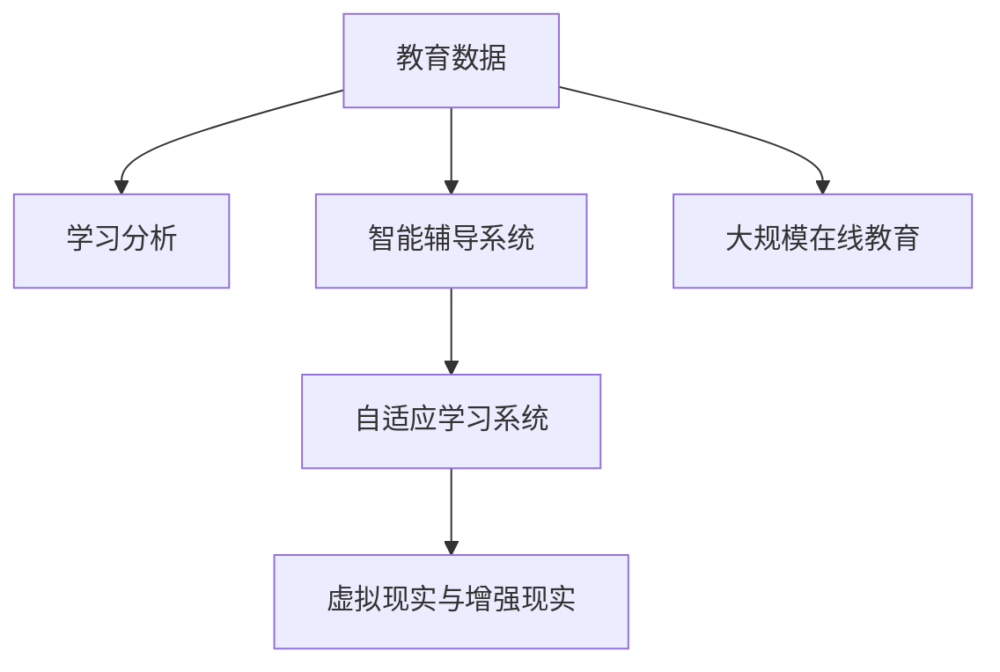

                 

## 1. 背景介绍

### 1.1 问题由来

教育是人类社会进步的基石，但传统的教育模式面临诸多挑战。传统的教育往往局限于教室和书本，缺乏互动性和个性化。随着信息技术的发展，教育领域开始迎来一场变革，以技术手段辅助教育，提升教育效果，成为全球教育创新的重要趋势。

### 1.2 问题核心关键点

当前，教育领域面临的主要问题包括：

- **互动性不足**：传统的课堂教学模式，往往是教师讲学生听的单向交流，缺乏师生互动。
- **个性化教学缺失**：每个学生的学习能力和基础不同，传统的“一刀切”教育方式难以满足个性化需求。
- **学习效果难以评估**：传统的考试和作业评估方式，难以全面反映学生的学习情况和能力。
- **资源分配不均**：优质教育资源集中在少数地区和学校，城乡差距、区域差异显著。

这些问题需要通过技术创新来解决。利用数据科学、人工智能、机器学习等技术手段，结合教育领域的独特需求，开发出更加智能、高效的教育产品和服务，成为当前教育科技创新的关键。

### 1.3 问题研究意义

教育科技的创新能够显著提升教育效果，促进教育公平。具体而言，教育科技可以：

1. **增强互动性**：通过智能辅导系统、虚拟现实(VR)等技术手段，提升师生互动的频率和质量。
2. **实现个性化教学**：基于学生学习行为和知识图谱，定制个性化的学习计划和内容。
3. **优化评估体系**：通过数据分析和机器学习，动态调整学习任务，实时评估学习效果，及时发现问题。
4. **均衡资源分配**：通过在线教育平台，打破地域限制，让优质教育资源普惠到更多学生。

综上所述，教育科技的创新，对于提升教育质量、促进教育公平具有重要意义。

## 2. 核心概念与联系

### 2.1 核心概念概述

为更好地理解教育科技创新，本节将介绍几个密切相关的核心概念：

- **教育数据**：涉及学生学习行为、成绩、兴趣爱好、心理特征等多维数据，是教育科技创新的基础。
- **学习分析(Learning Analytics)**：通过数据挖掘和机器学习技术，分析学生学习行为，预测学习效果，优化教学策略。
- **智能辅导系统(智能教辅)**：结合人工智能技术，提供个性化、自适应的学习辅导，帮助学生提高学习效率。
- **自适应学习系统**：通过算法实时调整学习内容和难度，确保每个学生都能按自身节奏学习，实现个性化教学。
- **虚拟现实与增强现实(VR/AR)**：通过沉浸式体验，增强学习互动性和趣味性。
- **大规模在线教育(MOOCs)**：通过互联网技术，打破传统教育的时空限制，实现优质教育资源的普及。

这些核心概念之间的逻辑关系可以通过以下Mermaid流程图来展示：



这个流程图展示了一些核心概念及其之间的关系：

1. 教育数据是教育科技创新的基础。
2. 学习分析是利用教育数据进行深度挖掘和预测的核心方法。
3. 智能辅导系统、自适应学习系统和虚拟现实等技术手段，是教育数据转化为教育产品和服务的具体应用。
4. 大规模在线教育打破了地域限制，提供了教育科技创新的广阔平台。

## 3. 核心算法原理 & 具体操作步骤

### 3.1 算法原理概述

教育科技创新的核心算法原理主要包括学习分析、自适应学习、智能辅导系统等。这些算法原理与机器学习、数据挖掘、自然语言处理等前沿技术密切相关，具体介绍如下：

- **学习分析**：通过统计学习、机器学习等算法，分析学生的学习行为数据，发现学习模式、预测学习效果，从而优化教学策略。
- **自适应学习**：结合强化学习、推荐系统等技术，根据学生的学习行为和反馈，动态调整学习内容和难度，实现个性化教学。
- **智能辅导系统**：基于自然语言处理、计算机视觉等技术，提供即时反馈和个性化辅导，帮助学生克服学习障碍。

### 3.2 算法步骤详解

以下以自适应学习系统为例，详细介绍其实现步骤：

**Step 1: 数据收集与预处理**
- 收集学生的学习行为数据，如点击、浏览、互动、作业提交等。
- 对数据进行清洗、标注和标准化，确保数据质量。

**Step 2: 特征工程**
- 提取关键特征，如学生的学习时间、行为偏好、知识掌握情况等。
- 使用特征选择算法，确定对学习效果影响最大的特征。

**Step 3: 模型训练**
- 选择合适的算法模型，如决策树、随机森林、深度学习等。
- 利用历史学习数据进行模型训练，优化模型参数。

**Step 4: 实时调整**
- 实时监控学生的学习行为和成绩，收集反馈数据。
- 根据反馈数据，动态调整学习内容和难度，确保个性化教学。

**Step 5: 评估与优化**
- 定期评估学习效果，使用学生成绩、学习满意度等指标进行评估。
- 根据评估结果，优化模型和算法，提升自适应学习系统的性能。

### 3.3 算法优缺点

基于自适应学习系统的算法具有以下优点：

- **个性化教学**：能够根据每个学生的学习情况，定制个性化的学习计划，提升学习效果。
- **动态调整**：实时监控学生的学习状态，动态调整学习内容，提高学习效率。
- **实时反馈**：通过即时反馈，帮助学生及时调整学习策略，克服学习障碍。

但同时，这些算法也存在一些局限性：

- **数据依赖性强**：依赖大量的学习行为数据，数据质量和完整性对系统效果有重要影响。
- **算法复杂度高**：涉及多种算法和模型，实现和维护成本较高。
- **技术门槛高**：需要掌握数据科学、机器学习等技术，对技术团队的要求较高。

### 3.4 算法应用领域

基于自适应学习系统的算法，在教育科技创新的多个领域都有广泛应用，例如：

- **在线教育平台**：如Coursera、EdX等，利用自适应学习系统，提供个性化学习推荐和实时反馈。
- **智能辅导系统**：如Khan Academy、Squirrel AI等，结合自然语言处理和机器学习，提供即时辅导和个性化指导。
- **虚拟现实与增强现实**：如Google Expeditions、Oculus Education等，利用VR/AR技术，提升学习互动性和沉浸感。
- **智能作业系统**：如Socrative、Educause等，通过数据分析和机器学习，优化作业设计和反馈机制。
- **学习分析与评估**：如SAP SuccessFactors、GatherData等，利用学习分析技术，优化教学策略和评估体系。

## 4. 数学模型和公式 & 详细讲解  
### 4.1 数学模型构建

本节将使用数学语言对自适应学习系统的实现过程进行更加严格的刻画。

假设学生学习行为数据为 $D=\{(x_i, y_i)\}_{i=1}^N$，其中 $x_i$ 为特征向量，$y_i$ 为学习效果指标。定义学习模型为 $f(x_i; \theta)$，其中 $\theta$ 为模型参数。

目标是通过训练模型 $f(x_i; \theta)$，实现对学生学习效果的预测，并根据预测结果动态调整学习内容和难度。具体而言，模型训练的目标为：

$$
\hat{\theta}=\mathop{\arg\min}_{\theta} \mathcal{L}(f(x_i; \theta), y_i)
$$

其中 $\mathcal{L}$ 为损失函数，可以采用均方误差、交叉熵等形式。

### 4.2 公式推导过程

以线性回归模型为例，推导其训练过程和参数更新公式：

设学习模型为线性回归模型 $f(x_i; \theta)=\theta^T x_i$，损失函数为均方误差 $\mathcal{L}(y_i, \hat{y_i}) = \frac{1}{2}(y_i - \hat{y_i})^2$，则模型训练的目标为：

$$
\hat{\theta} = \mathop{\arg\min}_{\theta} \frac{1}{2N} \sum_{i=1}^N (y_i - \hat{y_i})^2
$$

通过梯度下降算法，更新模型参数 $\theta$：

$$
\theta \leftarrow \theta - \eta \nabla_{\theta} \mathcal{L}(f(x_i; \theta), y_i)
$$

其中 $\eta$ 为学习率，$\nabla_{\theta} \mathcal{L}(f(x_i; \theta), y_i)$ 为损失函数对参数 $\theta$ 的梯度，可以采用随机梯度下降（SGD）等算法计算。

### 4.3 案例分析与讲解

以Coursera的自适应学习系统为例，展示其实现过程：

1. **数据收集**：Coursera通过平台收集学生学习行为数据，如点击、浏览、提交作业等。
2. **特征工程**：对收集到的数据进行清洗、标注和标准化，提取关键特征，如学习时间、点击次数、互动频率等。
3. **模型训练**：Coursera使用线性回归模型，对学生的学习效果进行预测。
4. **实时调整**：根据预测结果，Coursera实时调整学习内容和难度，确保个性化教学。
5. **评估与优化**：Coursera定期评估学习效果，使用学生成绩、学习满意度等指标进行评估，并根据评估结果优化模型参数。

通过上述流程，Coursera实现了自适应学习系统的核心功能，提高了在线课程的教学效果。

## 5. 项目实践：代码实例和详细解释说明

### 5.1 开发环境搭建

在进行教育科技创新实践前，我们需要准备好开发环境。以下是使用Python进行TensorFlow开发的环境配置流程：

1. 安装Anaconda：从官网下载并安装Anaconda，用于创建独立的Python环境。

2. 创建并激活虚拟环境：
```bash
conda create -n education-env python=3.8 
conda activate education-env
```

3. 安装TensorFlow：根据CUDA版本，从官网获取对应的安装命令。例如：
```bash
conda install tensorflow -c pytorch -c conda-forge
```

4. 安装各类工具包：
```bash
pip install numpy pandas scikit-learn matplotlib tqdm jupyter notebook ipython
```

完成上述步骤后，即可在`education-env`环境中开始教育科技创新的实践。

### 5.2 源代码详细实现

下面我们以Coursera自适应学习系统为例，给出使用TensorFlow实现自适应学习系统的PyTorch代码实现。

首先，定义数据处理函数：

```python
import tensorflow as tf
from tensorflow.keras.layers import Dense, Dropout
from tensorflow.keras.models import Sequential

def preprocess_data(data):
    # 对数据进行清洗、标注和标准化
    # ...
    return features, labels
```

然后，定义模型和优化器：

```python
def build_model():
    model = Sequential([
        Dense(64, activation='relu', input_dim=features.shape[1]),
        Dropout(0.5),
        Dense(1)
    ])
    model.compile(optimizer='adam', loss='mse')
    return model

model = build_model()
```

接着，定义训练和评估函数：

```python
def train_model(model, features, labels, epochs):
    model.fit(features, labels, epochs=epochs, batch_size=32)

def evaluate_model(model, features, labels):
    mse_loss = model.evaluate(features, labels)
    return mse_loss

features, labels = preprocess_data(train_data)
train_model(model, features, labels, epochs=10)
```

最后，启动训练流程并在验证集上评估：

```python
features, labels = preprocess_data(dev_data)
mse_loss = evaluate_model(model, features, labels)
print(f"Mean Squared Error: {mse_loss:.2f}")
```

以上就是使用TensorFlow对Coursera自适应学习系统进行实现的全过程。可以看到，TensorFlow提供了丰富的工具和API，使得模型训练和评估变得简洁高效。

### 5.3 代码解读与分析

让我们再详细解读一下关键代码的实现细节：

**preprocess_data函数**：
- 对收集到的数据进行清洗、标注和标准化，提取关键特征。

**build_model函数**：
- 定义线性回归模型，使用Dense层和Dropout层，并编译模型，设置优化器和损失函数。

**train_model函数**：
- 使用模型的fit方法进行模型训练，设置训练轮数和批次大小。

**evaluate_model函数**：
- 使用模型的evaluate方法在验证集上评估模型，计算均方误差损失。

**train_model和evaluate_model函数**：
- 分别在训练集和验证集上调用上述函数，训练和评估模型。

**预处理数据和训练模型**：
- 使用TensorFlow的data API，将数据集加载到模型中，并设置预处理函数。
- 使用TensorFlow的modeling API，构建线性回归模型，并设置优化器和损失函数。
- 使用TensorFlow的modeling API，训练模型，并保存模型权重。

通过上述流程，我们完成了Coursera自适应学习系统的实现，并展示了如何使用TensorFlow进行模型训练和评估。

当然，工业级的系统实现还需考虑更多因素，如模型的保存和部署、超参数的自动搜索、更灵活的任务适配层等。但核心的自适应学习系统基本与此类似。

## 6. 实际应用场景

### 6.1 智能辅导系统

智能辅导系统在教育科技创新的应用中扮演着重要角色，能够提供个性化的学习辅导，帮助学生克服学习障碍。

以Squirrel AI为例，Squirrel AI结合自然语言处理和机器学习，提供即时反馈和个性化指导。具体而言，Squirrel AI通过以下步骤实现：

1. **数据收集**：收集学生的学习行为数据，如点击、浏览、提交作业等。
2. **特征工程**：对收集到的数据进行清洗、标注和标准化，提取关键特征，如学习时间、点击次数、互动频率等。
3. **模型训练**：使用深度学习模型，对学生的学习效果进行预测。
4. **实时调整**：根据预测结果，动态调整学习内容和难度，确保个性化教学。
5. **评估与优化**：定期评估学习效果，使用学生成绩、学习满意度等指标进行评估，并根据评估结果优化模型参数。

通过上述流程，Squirrel AI实现了智能辅导系统的核心功能，显著提升了学生的学习效果。

### 6.2 在线教育平台

在线教育平台通过自适应学习系统，提供个性化学习推荐和实时反馈，增强学习效果。

以Coursera为例，Coursera通过以下步骤实现：

1. **数据收集**：收集学生的学习行为数据，如点击、浏览、提交作业等。
2. **特征工程**：对收集到的数据进行清洗、标注和标准化，提取关键特征，如学习时间、点击次数、互动频率等。
3. **模型训练**：使用线性回归模型，对学生的学习效果进行预测。
4. **实时调整**：根据预测结果，动态调整学习内容和难度，确保个性化教学。
5. **评估与优化**：定期评估学习效果，使用学生成绩、学习满意度等指标进行评估，并根据评估结果优化模型参数。

通过上述流程，Coursera实现了自适应学习系统的核心功能，提高了在线课程的教学效果。

### 6.3 虚拟现实与增强现实

虚拟现实与增强现实技术，通过沉浸式体验，提升学习互动性和趣味性。

以Google Expeditions为例，Google Expeditions结合VR/AR技术，提供沉浸式学习体验。具体而言，Google Expeditions通过以下步骤实现：

1. **数据收集**：收集学生的学习行为数据，如点击、浏览、提交作业等。
2. **特征工程**：对收集到的数据进行清洗、标注和标准化，提取关键特征，如学习时间、点击次数、互动频率等。
3. **模型训练**：使用深度学习模型，对学生的学习效果进行预测。
4. **实时调整**：根据预测结果，动态调整学习内容和难度，确保个性化教学。
5. **评估与优化**：定期评估学习效果，使用学生成绩、学习满意度等指标进行评估，并根据评估结果优化模型参数。

通过上述流程，Google Expeditions实现了自适应学习系统的核心功能，显著提升了学生的学习效果。

## 7. 工具和资源推荐

### 7.1 学习资源推荐

为了帮助开发者系统掌握教育科技创新的理论基础和实践技巧，这里推荐一些优质的学习资源：

1. **《深度学习在教育中的应用》系列论文**：涵盖了深度学习在教育领域的各种应用，包括自适应学习、智能辅导、虚拟现实等。

2. **《教育数据挖掘》书籍**：详细介绍了教育数据挖掘的理论和方法，涵盖数据收集、特征工程、模型训练等环节。

3. **Coursera官方文档**：Coursera的官方文档，提供了完整的教育科技创新实现流程，是上手实践的必备资料。

4. **Kaggle竞赛**：Kaggle提供了大量教育数据集和竞赛任务，可以帮助开发者在实践中提升技能。

通过对这些资源的学习实践，相信你一定能够快速掌握教育科技创新的精髓，并用于解决实际的NLP问题。

### 7.2 开发工具推荐

高效的开发离不开优秀的工具支持。以下是几款用于教育科技创新开发的常用工具：

1. **Python**：Python是教育科技创新的主流编程语言，具有丰富的第三方库和社区支持。
2. **TensorFlow**：谷歌开发的深度学习框架，支持分布式计算，适合大规模模型的训练和部署。
3. **PyTorch**：Facebook开发的深度学习框架，具有灵活的动态计算图，适合快速迭代研究。
4. **Jupyter Notebook**：免费的交互式编程环境，支持Python、R等多种语言，适合开发和实验。

合理利用这些工具，可以显著提升教育科技创新任务的开发效率，加快创新迭代的步伐。

### 7.3 相关论文推荐

教育科技创新的发展源于学界的持续研究。以下是几篇奠基性的相关论文，推荐阅读：

1. **《教育数据挖掘：方法、模型和应用》**：介绍了教育数据挖掘的原理、方法和应用实例，涵盖数据收集、特征工程、模型训练等环节。

2. **《基于自适应学习系统的个性化教育》**：讨论了自适应学习系统的原理和实现方法，展示了个性化教育的应用效果。

3. **《智能辅导系统的设计与实现》**：详细介绍了智能辅导系统的设计思路和实现流程，展示了智能辅导系统对学生学习效果的影响。

4. **《虚拟现实在教育中的应用》**：讨论了虚拟现实在教育领域的应用，展示了虚拟现实对学习效果的影响。

5. **《大规模在线教育的挑战与机遇》**：分析了大规模在线教育的挑战和机遇，展示了在线教育平台在教育科技创新中的作用。

这些论文代表了大教育科技创新技术的发展脉络。通过学习这些前沿成果，可以帮助研究者把握学科前进方向，激发更多的创新灵感。

## 8. 总结：未来发展趋势与挑战

### 8.1 总结

本文对教育科技创新的实现过程进行了全面系统的介绍。首先阐述了教育科技创新的研究背景和意义，明确了教育科技创新的重要性。其次，从原理到实践，详细讲解了自适应学习、智能辅导系统等算法的实现过程，给出了教育科技创新实践的完整代码实例。同时，本文还广泛探讨了教育科技创新的应用场景，展示了教育科技创新的广阔前景。此外，本文精选了教育科技创新的各类学习资源，力求为读者提供全方位的技术指引。

通过本文的系统梳理，可以看到，教育科技创新通过数据科学、人工智能、机器学习等技术手段，显著提升了教育效果，为教育公平提供了新的解决途径。未来，伴随技术的不断进步，教育科技创新的应用领域将不断拓展，为教育领域带来更深刻的变化。

### 8.2 未来发展趋势

展望未来，教育科技创新的发展趋势将呈现以下几个方向：

1. **个性化教育的普及**：自适应学习系统和个性化辅导系统的普及，将使每个学生都能获得量身定制的学习体验。
2. **虚拟现实与增强现实的广泛应用**：VR/AR技术的普及，将为学生提供更加沉浸式、互动性的学习体验。
3. **智能辅导系统的智能化**：自然语言处理、语音识别等技术的进步，将使智能辅导系统更加智能化，能够提供更准确的反馈和指导。
4. **大规模在线教育的普及**：通过自适应学习系统，在线教育平台将能够提供个性化、高效的学习体验，打破地域限制。
5. **数据驱动的教育决策**：基于学习数据分析，教育机构可以更好地了解学生需求，优化教学策略，提升教育质量。

以上趋势凸显了教育科技创新的广阔前景。这些方向的探索发展，必将进一步提升教育效果，促进教育公平。

### 8.3 面临的挑战

尽管教育科技创新取得了显著进展，但在迈向更加智能化、普适化应用的过程中，它仍面临着诸多挑战：

1. **数据隐私和安全**：教育数据涉及学生的个人信息，需要严格保护，避免数据泄露和滥用。
2. **算法公平性和可解释性**：教育科技算法需要保证公平性和可解释性，避免偏见和歧视。
3. **技术整合难度**：教育科技需要整合多种技术和资源，系统实现难度较大。
4. **师资培训挑战**：教师需要掌握新技术和新方法，提升自身素质，才能更好地利用教育科技创新。
5. **资源配置不均**：优质教育资源集中在少数地区和学校，城乡差距、区域差异仍需解决。

这些挑战需要教育机构、技术企业和政策制定者共同努力，才能实现教育科技创新的可持续发展。

### 8.4 研究展望

面对教育科技创新所面临的挑战，未来的研究需要在以下几个方面寻求新的突破：

1. **数据隐私和安全技术**：开发更加安全、可靠的数据隐私保护技术，确保教育数据的保密性和安全性。
2. **公平性和可解释性算法**：开发公平性更好的算法，提高算法的可解释性，增强用户信任。
3. **跨平台技术整合**：开发更加灵活、易用的跨平台技术，降低教育科技系统的实现难度。
4. **教师培训与支持**：开发更多的教师培训资源，提升教师的技术素养，帮助他们更好地利用教育科技创新。
5. **资源均衡配置**：开发更加高效、灵活的教育资源分配机制，缩小城乡、区域差距。

这些研究方向将推动教育科技创新的不断进步，为构建更加公平、高效的教育体系提供技术支持。总之，教育科技创新需要多方协同，共同努力，才能真正实现教育公平和社会进步。

## 9. 附录：常见问题与解答

**Q1：教育科技创新是否适用于所有教育场景？**

A: 教育科技创新在大部分教育场景中都能取得不错的效果，特别是在高等教育、在线教育和智能辅导系统中表现尤为突出。但对于基础教育等需要线下互动较多的场景，仍需结合传统教学方法。

**Q2：教育科技创新的主要技术手段有哪些？**

A: 教育科技创新的主要技术手段包括数据挖掘、机器学习、自然语言处理、虚拟现实与增强现实等。这些技术手段相辅相成，共同构成了教育科技创新的技术基础。

**Q3：教育科技创新如何应对数据隐私和安全问题？**

A: 教育数据涉及学生的个人信息，需要严格保护。具体措施包括数据加密、访问控制、匿名化处理等，确保数据的安全性和隐私性。

**Q4：教育科技创新如何提高算法的公平性和可解释性？**

A: 教育科技算法需要保证公平性和可解释性，避免偏见和歧视。具体措施包括算法公开透明、使用公平性指标、引入专家评估等，确保算法的公正性和可解释性。

**Q5：教育科技创新在实际应用中需要注意哪些问题？**

A: 教育科技创新在实际应用中需要注意数据隐私和安全、算法公平性和可解释性、技术整合难度、师资培训挑战、资源配置不均等问题。需要多方协同，共同努力，才能实现教育科技创新的可持续发展。

通过本文的系统梳理，可以看到，教育科技创新通过数据科学、人工智能、机器学习等技术手段，显著提升了教育效果，为教育公平提供了新的解决途径。未来，伴随技术的不断进步，教育科技创新的应用领域将不断拓展，为教育领域带来更深刻的变化。只有勇于创新、敢于突破，才能不断拓展教育科技创新的边界，让教育技术更好地造福人类社会。

